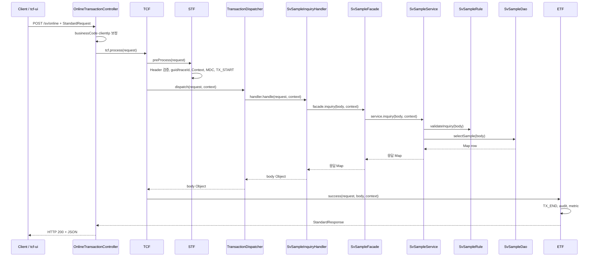

# 29. Web → TCF → Facade → Service → DAO 소스 가이드

| 항목 | 내용 |
|------|------|
| 문서 번호 | 29 |
| 제목 | Web–TCF–Facade–Service–DAO Source Guide |
| 상위 문서 | [architecture.md](architecture.md) |
| 관련 문서 | [01-application-layer.md](01-application-layer.md), [03-transaction.md](03-transaction.md), [14-online-arc.md](14-online-arc.md), [26-mybatis.md](26-mybatis.md), [27-paging.md](27-paging.md), [28-tcf-framework-ref.md](28-tcf-framework-ref.md) |
| 대상 | 업무 WAR(`*-service`), `tcf-om` 개발자 |

---

## 1. 개요

NSIGHT 온라인 거래는 **HTTP 한 개의 URL**(`/online`)로 들어와 **TCF 엔진**을 거친 뒤, 업무 모듈의 **Handler → Facade → Service → DAO** 계층으로 내려간다.

```text
[Web]  OnlineTransactionController / TcfGateway / tcf-ui Relay
         │  StandardRequest JSON
         ▼
[TCF]  STF → TransactionDispatcher → Handler → ETF
         │                              │
         │                              ▼
[App]                        Facade → Service → Rule / DAO → Mapper
```

| 계층 | 모듈·패키지 | 소스 위치 |
|------|-------------|-----------|
| Web | `tcf-web` | `com.nh.nsight.tcf.web.controller` |
| TCF | `tcf-core` | `com.nh.nsight.tcf.core.processor`, `dispatch`, `transaction` |
| Handler | 업무 WAR | `com.nh.nsight.marketing.{code}.handler` | [BTF](35-BTF.md) 진입 |
| Facade | 업무 WAR | `com.nh.nsight.marketing.{code}.facade` | [BTF](35-BTF.md) |
| Service | 업무 WAR | `com.nh.nsight.marketing.{code}.service` | [BTF](35-BTF.md) |
| Rule | 업무 WAR | `com.nh.nsight.marketing.{code}.rule` | [BTF](35-BTF.md) |
| DAO | 업무 WAR | `com.nh.nsight.marketing.{code}.dao` | [BTF](35-BTF.md) |
| Mapper | 업무 WAR | `com.nh.nsight.marketing.{code}.mapper` + `resources/mapper/` | [BTF](35-BTF.md) |

Handler는 TCF와 **BTF** 사이 **어댑터**이다. BTF 정의: [35-BTF.md](35-BTF.md).  
계층 책임 요약: [01-application-layer.md](01-application-layer.md)

---

## 2. 전체 시퀀스 (소스 파일 기준)

아래는 `POST /sv/online`, `serviceId = SV.Sample.inquiry` 기준 **실제 호출 순서**이다.



---

## 3. Web 계층 — HTTP 진입

### 3.1 표준 진입: `OnlineTransactionController`

| 파일 | `tcf-web/src/main/java/com/nh/nsight/tcf/web/controller/OnlineTransactionController.java` |
|------|---------------------------------------------------------------------------------------------|
| URL | `POST /online`, `POST /{businessCode}/online` |
| 역할 | JSON 역직렬화 → Header 보정 → `TCF.process()` 위임 |

```23:58:tcf-web/src/main/java/com/nh/nsight/tcf/web/controller/OnlineTransactionController.java
    @PostMapping("/online")
    public StandardResponse<Object> handleRoot(@RequestBody StandardRequest<Map<String, Object>> request,
                                               HttpServletRequest servletRequest) {
        return handle(null, request, servletRequest);
    }

    @PostMapping("/{businessCode}/online")
    public StandardResponse<Object> handleWithBusinessCode(@PathVariable("businessCode") String businessCode,
                                                           @RequestBody StandardRequest<Map<String, Object>> request,
                                                           HttpServletRequest servletRequest) {
        return handle(businessCode, request, servletRequest);
    }

    private StandardResponse<Object> handle(String businessCode,
                                            StandardRequest<Map<String, Object>> request,
                                            HttpServletRequest servletRequest) {
        // ...
        if (StringUtils.hasText(businessCode) && !StringUtils.hasText(header.getBusinessCode())) {
            header.setBusinessCode(businessCode);
        }
        if (!StringUtils.hasText(header.getClientIp())) {
            header.setClientIp(resolveClientIp(servletRequest));
        }
        StandardResponse<Object> response = tcf.process(request);
        return response;
    }
```

**Controller가 하는 일**

1. `StandardRequest<Map<String, Object>>` 바인딩 (Jackson)
2. Header null이면 빈 `StandardHeader` 생성
3. Path의 `{businessCode}` → `header.businessCode` (미설정 시)
4. `clientIp` ← `X-Forwarded-For` 또는 `remoteAddr`
5. **`tcf.process(request)`** — 이후 모든 처리는 TCF·업무 계층

**Controller가 하지 않는 일:** serviceId 라우�ing, 트랜잭션, SQL, Body 검증

### 3.2 대체 Web 진입점

| 진입 | 클래스 | 용도 |
|------|--------|------|
| 비표준 REST/multipart | `tcf-web/.../gateway/TcfGateway.java` | `TcfInvokeRequest` → `StandardRequest` 변환 후 TCF |
| 브라우저 Relay | `tcf-ui/.../TransactionRelayService.java` | `{base}{contextPath}/online`으로 HTTP POST 중계 |
| WAR 배포 | `tcf-web/.../boot/NsightWarBootstrap.java` | 외부 Tomcat에서 Spring Boot 기동 |

업무 WAR는 `@SpringBootApplication(scanBasePackages = "com.nh.nsight")`로 **tcf-web·tcf-core 빈을 함께 스캔**한다.

```8:10:sv-service/src/main/java/com/nh/nsight/marketing/sv/NsightSvServiceApplication.java
@SpringBootApplication(scanBasePackages = "com.nh.nsight")
@MapperScan("com.nh.nsight.marketing.sv.mapper")
public class NsightSvServiceApplication extends NsightWarBootstrap {
```

---

## 4. TCF 계층 — 프레임워크 파이프라인

### 4.1 `TCF.process()` — 단일 진입점

| 파일 | `tcf-core/src/main/java/com/nh/nsight/tcf/core/processor/TCF.java` |

```27:64:tcf-core/src/main/java/com/nh/nsight/tcf/core/processor/TCF.java
    public StandardResponse<Object> process(StandardRequest<Map<String, Object>> request) {
        TransactionContext context = null;
        try {
            context = stf.preProcess(request);
            Object body = dispatcher.dispatch(request, context);
            StandardResponse<Object> response = etf.success(request, body, context);
            return response;
        } catch (BusinessException e) {
            return etf.businessFail(request, e, context);
        } catch (Exception e) {
            return etf.systemError(request, e, context);
        } finally {
            TransactionContextHolder.clear();
            MDC.clear();
        }
    }
```

| 단계 | 컴포넌트 | 반환·부작용 |
|------|----------|-------------|
| 1 | `STF.preProcess` | `TransactionContext` 생성 |
| 2 | `TransactionDispatcher.dispatch` | Handler 결과 `Object`(보통 `Map`) |
| 3 | `ETF.success` / `businessFail` / `systemError` | `StandardResponse` |
| finally | Context·MDC 정리 | ThreadLocal 누수 방지 |

### 4.2 STF — 전처리

| 파일 | `tcf-core/.../processor/STF.java` |

```38:62:tcf-core/src/main/java/com/nh/nsight/tcf/core/processor/STF.java
    public TransactionContext preProcess(StandardRequest<Map<String, Object>> request) {
        headerValidator.validate(request);
        StandardHeader header = request.getHeader();
        if (!StringUtils.hasText(header.getGuid())) {
            header.setGuid(GuidGenerator.newGuid());
        }
        if (!StringUtils.hasText(header.getTraceId())) {
            header.setTraceId(GuidGenerator.newTraceId());
        }
        TransactionContext context = new TransactionContext(header);
        TransactionContextHolder.set(context);
        putMdc(header);
        sessionValidator.validate(header);
        authorizationValidator.validate(header);
        idempotencyChecker.checkAndMarkProcessing(header);
        transactionLogService.start(context);
        return context;
    }
```

STF는 **Header·세션·권한·멱등성·거래 시작 로그**만 처리한다. Body 필드 검증은 **Rule(Service 쪽)** 에서 한다.

### 4.3 Dispatcher — serviceId → Handler

| 파일 | `tcf-core/.../dispatch/TransactionDispatcher.java` |

기동 시 Spring이 주입한 모든 `TransactionHandler` `@Component`를 `serviceId` 키 Map에 등록한다.

```34:50:tcf-core/src/main/java/com/nh/nsight/tcf/core/dispatch/TransactionDispatcher.java
    public Object dispatch(StandardRequest<Map<String, Object>> request, TransactionContext context) {
        String serviceId = request.getHeader() == null ? null : request.getHeader().getServiceId();
        if (!StringUtils.hasText(serviceId)) {
            throw new BusinessException(ErrorCode.INVALID_HEADER, "serviceId가 없습니다.");
        }
        TransactionHandler handler = handlerMap.get(serviceId);
        if (handler == null) {
            throw new BusinessException(ErrorCode.SERVICE_NOT_FOUND, "등록되지 않은 serviceId입니다: " + serviceId);
        }
        Object result = handler.handle(request, context);
        return result;
    }
```

### 4.4 ETF — 후처리·표준 응답

| 파일 | `tcf-core/.../processor/ETF.java` |

성공 시 `StandardResponse.success(header, body)` — `result.resultCode = S0000`.  
Handler/Facade/Service에서 던진 `BusinessException`은 TCF가 catch하여 `ETF.businessFail()`로 변환한다.

```10:16:tcf-core/src/main/java/com/nh/nsight/tcf/core/message/StandardResponse.java
    public static <T> StandardResponse<T> success(StandardHeader header, T body) {
        StandardResponse<T> response = new StandardResponse<>();
        response.header = header;
        response.result = Result.success();
        response.body = body;
        return response;
    }
```

---

## 5. Handler — TCF → Facade 어댑터

| 항목 | 규칙 |
|------|------|
| 인터페이스 | `tcf-core/.../transaction/TransactionHandler.java` |
| 스테레오타입 | `@Component` |
| 메서드 | `serviceId()`, `doHandle(request, context)` |
| 금지 | `@Transactional`, DAO 직접 호출, 복잡한 비즈니스 로직 |

### 5.1 샘플: 조회 Handler

```10:26:sv-service/src/main/java/com/nh/nsight/marketing/sv/handler/SvSampleInquiryHandler.java
@Component
public class SvSampleInquiryHandler implements TransactionHandler {
    private final SvSampleFacade facade;

    @Override
    public String serviceId() {
        return "SV.Sample.inquiry";
    }

    @Override
    public Object doHandle(StandardRequest<Map<String, Object>> request, TransactionContext context) {
        return facade.inquiry(request.getBody(), context);
    }
}
```

**패턴:** `request.getBody()`와 `context`만 Facade에 넘긴다.  
**serviceId 명명:** `{BusinessCode}.{Domain}.{action}` — 예: `OM.ServiceCatalog.save`

### 5.2 tcf-om: 동일 Facade·다른 serviceId

`OmServiceCatalogFacade` 하나에 `inquiry`, `save`, `update`, `delete`가 있고, **Handler는 serviceId당 1개**다.

| Handler | serviceId | Facade 메서드 |
|---------|-----------|---------------|
| `OmServiceCatalogInquiryHandler` | `OM.ServiceCatalog.inquiry` | `facade.inquiry(...)` |
| `OmServiceCatalogSaveHandler` | `OM.ServiceCatalog.save` | `facade.save(...)` |

```18:26:tcf-om/src/main/java/com/nh/nsight/marketing/om/handler/OmServiceCatalogSaveHandler.java
    @Override
    public String serviceId() {
        return "OM.ServiceCatalog.save";
    }

    @Override
    public Object doHandle(StandardRequest<Map<String, Object>> request, TransactionContext context) {
        return facade.save(request.getBody(), context);
    }
```

---

## 6. Facade — 트랜잭션 경계·유스케이스

| 항목 | 규칙 |
|------|------|
| 스테레오타입 | `@Service` (프로젝트 관례) |
| 트랜잭션 | **`@Transactional`은 Facade에만** 선언 |
| 호출 | Service(들), 필요 시 Support |
| 인자 | `Map<String, Object> body`, `TransactionContext context` |
| 반환 | `Map<String, Object>` (ETF body로 그대로 전달) |

### 6.1 조회 Facade

```9:20:sv-service/src/main/java/com/nh/nsight/marketing/sv/facade/SvSampleFacade.java
@Service
public class SvSampleFacade {
    private final SvSampleService service;

    @Transactional(readOnly = true, timeout = 5)
    public Map<String, Object> inquiry(Map<String, Object> body, TransactionContext context) {
        return service.inquiry(body, context);
    }
}
```

### 6.2 CRUD Facade (tcf-om)

```17:39:tcf-om/src/main/java/com/nh/nsight/marketing/om/facade/OmServiceCatalogFacade.java
    @Transactional(readOnly = true, timeout = 10)
    public Map<String, Object> inquiry(Map<String, Object> body, TransactionContext context) {
        return service.inquiry(body, context);
    }

    @Transactional(timeout = 10)
    public Map<String, Object> save(Map<String, Object> body, TransactionContext context) {
        return service.save(body, context);
    }
```

| processingType | Facade 어노테이션 | timeout |
|----------------|-------------------|---------|
| INQUIRY | `@Transactional(readOnly = true, …)` | 카탈로그 `TIMEOUT_SEC` 또는 5~10 |
| SAVE/UPDATE/DELETE | `@Transactional(…)` | 10 (기본) |

**Facade vs Service:** Facade는 **유스케이스 1건 + TX 경계**. Service는 **도메인 연산**이며 `@Transactional` 없음(기본).

**복합 유스케이스:** 여러 Service 호출·tcf-batch HTTP·캐시 evict는 Facade에서 조합한다 (`OmBatchFacade`, `OmCacheFacade` 등).

---

## 7. Service — 도메인 로직·응답 조립

| 항목 | 규칙 |
|------|------|
| 스테레오타입 | `@Service` |
| 호출 순서 | Rule(검증) → DAO(영속) → 응답 Map 조립 |
| Context | `context.getHeader()` — guid, userId, serviceId |
| 예외 | `BusinessException(errorCode, message)` |

### 7.1 단순 조회 Service

```20:28:sv-service/src/main/java/com/nh/nsight/marketing/sv/service/SvSampleService.java
    public Map<String, Object> inquiry(Map<String, Object> body, TransactionContext context) {
        rule.validateInquiry(body);
        Map<String, Object> data = dao.selectSample(body);
        Map<String, Object> result = new LinkedHashMap<>();
        result.put("businessCode", "SV");
        result.put("serviceId", context.getHeader().getServiceId());
        result.put("guid", context.getHeader().getGuid());
        result.put("data", data);
        return result;
    }
```

Service가 **응답 body Map을 조립**한다. ETF는 이 Map을 `StandardResponse.body`에 넣을 뿐 추가 가공하지 않는다.

### 7.2 페이징·CRUD Service (tcf-om)

**목록 조회** — [27-paging.md](27-paging.md)와 동일 패턴:

```29:45:tcf-om/src/main/java/com/nh/nsight/marketing/om/service/OmServiceCatalogService.java
    public Map<String, Object> inquiry(Map<String, Object> body, TransactionContext context) {
        rule.validateOperation(context);
        Map<String, Object> criteria = new HashMap<>();
        copyIfPresent(body, criteria, "businessCode", "serviceId", "useYn", "pageNo", "pageSize");
        rule.normalizePaging(criteria);

        List<Map<String, Object>> rows = dao.searchServiceCatalog(criteria);
        int totalCount = dao.countServiceCatalog(criteria);

        Map<String, Object> result = new LinkedHashMap<>();
        result.put("pageNo", criteria.get("pageNo"));
        result.put("pageSize", criteria.get("pageSize"));
        result.put("totalCount", totalCount);
        result.put("rows", rows);
        return result;
    }
```

**등록(save)** — Rule → 중복 검사(DAO) → insert → 이력(Support):

```64:90:tcf-om/src/main/java/com/nh/nsight/marketing/om/service/OmServiceCatalogService.java
    public Map<String, Object> save(Map<String, Object> body, TransactionContext context) {
        rule.validateOperation(context);
        rule.requireField(body, "businessCode");
        rule.requireField(body, "serviceId");
        // ...
        if (dao.selectServiceCatalogByServiceId(serviceId) != null) {
            throw new BusinessException("E-OM-BIZ-0003", "이미 등록된 ServiceId입니다.");
        }
        dao.insertServiceCatalog(row);
        recorder.recordAuthHistory(context, "SERVICE_CATALOG", catalogId, ...);
        return savedResult("ServiceId 등록", row, "REGISTER");
    }
```

Facade의 `@Transactional` 안에서 DAO write + `OmChangeRecorder`가 **같은 TX**로 묶인다.

---

## 8. Rule — Body·도메인 검증

| 계층 | 검증 대상 | 예 |
|------|-----------|-----|
| STF | Header, 세션, 권한 | `serviceId` 누락 |
| Rule | Body, 업무 제약 | 필수 필드, 페이징 상한 |
| Service | 도메인 판단 | 중복 ServiceId, row 없음 |

```10:14:sv-service/src/main/java/com/nh/nsight/marketing/sv/rule/SvSampleRule.java
    public void validateInquiry(Map<String, Object> body) {
        if (body == null || body.isEmpty()) {
            throw new BusinessException(ErrorCode.BUSINESS_ERROR, "요청 Body가 비어 있습니다.");
        }
    }
```

```17:26:tcf-om/src/main/java/com/nh/nsight/marketing/om/rule/OmOperationRule.java
    public void normalizePaging(Map<String, Object> body) {
        int pageNo = Math.max(1, toInt(body.get("pageNo"), 1));
        int pageSize = toInt(body.get("pageSize"), 20);
        if (pageSize > 100) {
            pageSize = 100;
        }
        body.put("pageNo", pageNo);
        body.put("pageSize", pageSize);
        body.put("offset", (pageNo - 1) * pageSize);
    }
```

Rule은 **DAO를 호출하지 않는다**. DB 조회가 필요한 검증(중복 여부)은 Service에서 한다.

---

## 9. DAO → Mapper — 영속 접근

| 항목 | 규칙 |
|------|------|
| 스테레오타입 | `@Repository` |
| 역할 | 조건 Map 조립 → Mapper 호출 → 결과 반환 |
| 금지 | 비즈니스 판단, 응답 화면 Map 조립 |

### 9.1 인메모리 DAO (sv-service 샘플)

```8:16:sv-service/src/main/java/com/nh/nsight/marketing/sv/dao/SvSampleDao.java
@Repository
public class SvSampleDao {
    public Map<String, Object> selectSample(Map<String, Object> condition) {
        Map<String, Object> row = new LinkedHashMap<>();
        row.put("sampleKey", condition.getOrDefault("sampleKey", "SAMPLE"));
        row.put("sampleName", "SingleView sample response");
        // ...
        return row;
    }
}
```

샘플 WAR는 Mapper XML 훅만 두고 DAO에서 stub 반환하는 경우가 많다. 실 DB 연동 시 DAO가 Mapper를 주입받도록 확장한다.

### 9.2 MyBatis DAO (tcf-om)

```89:94:tcf-om/src/main/java/com/nh/nsight/marketing/om/dao/OmOperationDao.java
    public List<Map<String, Object>> searchServiceCatalog(Map<String, Object> criteria) {
        return mapper.searchServiceCatalog(criteria);
    }

    public int countServiceCatalog(Map<String, Object> criteria) {
        return mapper.countServiceCatalog(criteria);
    }
```

Mapper 인터페이스: `tcf-om/.../mapper/OmOperationMapper.java`  
XML: `tcf-om/src/main/resources/mapper/om/OmOperationMapper.xml`

```186:205:tcf-om/src/main/resources/mapper/om/OmOperationMapper.xml
    <select id="searchServiceCatalog" parameterType="map" resultType="map">
        SELECT CATALOG_ID AS "catalogId", ...
          FROM OM_SERVICE_CATALOG
         WHERE 1 = 1
        <include refid="serviceCatalogSearchWhere"/>
         ORDER BY BUSINESS_CODE, SERVICE_ID
        <if test="pageSize != null">
            OFFSET #{offset} ROWS FETCH NEXT #{pageSize} ROWS ONLY
        </if>
    </select>

    <select id="countServiceCatalog" parameterType="map" resultType="int">
        SELECT COUNT(*) FROM OM_SERVICE_CATALOG ...
    </select>
```

MyBatis 설정·이중 DataSource: [26-mybatis.md](26-mybatis.md)

---

## 10. Walkthrough A — `SV.Sample.inquiry` (전체 소스 경로)

### 10.1 요청 예

```http
POST http://localhost:8081/sv/online
Content-Type: application/json
```

```json
{
  "header": {
    "businessCode": "SV",
    "serviceId": "SV.Sample.inquiry",
    "transactionCode": "SV-INQ-0001",
    "processingType": "INQUIRY",
    "channelId": "WEBTOP",
    "userId": "U123456"
  },
  "body": {
    "sampleKey": "A001"
  }
}
```

### 10.2 단계별 파일·메서드

| # | 계층 | 파일 | 메서드 |
|---|------|------|--------|
| 1 | Web | `OnlineTransactionController` | `handleWithBusinessCode` → `handle` |
| 2 | TCF | `TCF` | `process` |
| 3 | STF | `STF` | `preProcess` |
| 4 | Dispatch | `TransactionDispatcher` | `dispatch` → `SvSampleInquiryHandler` |
| 5 | Handler | `SvSampleInquiryHandler` | `doHandle` |
| 6 | Facade | `SvSampleFacade` | `inquiry` (@Transactional readOnly) |
| 7 | Service | `SvSampleService` | `inquiry` |
| 8 | Rule | `SvSampleRule` | `validateInquiry` |
| 9 | DAO | `SvSampleDao` | `selectSample` |
| 10 | ETF | `ETF` | `success` |

### 10.3 응답 예

```json
{
  "header": { "serviceId": "SV.Sample.inquiry", "guid": "...", "traceId": "..." },
  "result": { "resultCode": "S0000", "resultMessage": "정상 처리되었습니다." },
  "body": {
    "businessCode": "SV",
    "serviceId": "SV.Sample.inquiry",
    "guid": "...",
    "data": {
      "sampleKey": "A001",
      "sampleName": "SingleView sample response"
    }
  }
}
```

---

## 11. Walkthrough B — `OM.ServiceCatalog.inquiry` (페이징 + MyBatis)

### 11.1 tcf-ui → tcf-om 경로

```text
Browser  static/om/admin/service-catalog.html
  → om-admin.js  POST /api/relay/om/online  (tcf-ui:8099)
  → TransactionRelayService.relay("om", json)
  → http://localhost:8097/om/online  (bootRun) 또는 :8080/om/online (ztomcat)
  → OnlineTransactionController (tcf-om WAR)
  → … 동일 TCF 파이프라인 …
```

### 11.2 serviceId별 Facade 메서드 매핑

```text
OM.ServiceCatalog.inquiry  → OmServiceCatalogFacade.inquiry
OM.ServiceCatalog.detail   → OmServiceCatalogFacade.detail
OM.ServiceCatalog.save     → OmServiceCatalogFacade.save
OM.ServiceCatalog.update   → OmServiceCatalogFacade.update
OM.ServiceCatalog.delete   → OmServiceCatalogFacade.delete
```

### 11.3 DAO·SQL까지의 데이터

```text
body { pageNo:1, pageSize:10, businessCode:"SV" }
  → Service: criteria Map
  → Rule.normalizePaging: { pageNo:1, pageSize:10, offset:0 }
  → DAO.searchServiceCatalog(criteria)  → List<Map> rows
  → DAO.countServiceCatalog(criteria)   → totalCount
  → Service: { pageNo, pageSize, totalCount, rows }
  → ETF → Client
```

---

## 12. 예외·트랜잭션 흐름

```text
Rule/Service에서 BusinessException throw
  → Handler / Facade / Service 스택 그대로 전파 (catch 없음)
  → TCF.process catch (BusinessException)
  → ETF.businessFail → resultCode E0001 + errorCode
  → HTTP 200 (비즈니스 실패도 200, result로 판별)

Service에서 RuntimeException / SQLException
  → TCF.process catch (Exception)
  → ETF.systemError → E-COM-SYS-0001
  → Facade @Transactional → rollback (write 거래)
```

| 예외 타입 | 처리 | HTTP | resultCode |
|-----------|------|------|------------|
| `BusinessException` | ETF.businessFail | 200 | E0001 |
| 기타 `Exception` | ETF.systemError | 200 | E0001 |
| STF Header 오류 | BusinessException → businessFail | 200 | E0001 |

---

## 13. 호출 규칙 (허용·금지)

```text
허용:
  Web        → TCF
  TCF        → Handler
  Handler    → Facade
  Facade     → Service, Support
  Service    → Rule, DAO, (다른 Service — 주의)
  DAO        → Mapper

금지:
  Handler    → DAO
  Rule       → DAO
  Service    → Mapper 직접
  DAO        → Service
  Mapper     → Spring Bean
```

---

## 14. 신규 거래 추가 체크리스트

`XX.Domain.action` serviceId를 추가할 때 **아래 파일을 순서대로** 만든다.

| 순서 | 작업 | 파일 예 (`sv-service`) |
|------|------|------------------------|
| 1 | Handler | `handler/SvXxxActionHandler.java` — `serviceId()`, `facade.xxx(body, context)` |
| 2 | Facade 메서드 | `facade/SvXxxFacade.java` — `@Transactional` |
| 3 | Service | `service/SvXxxService.java` — Rule → DAO → result Map |
| 4 | Rule | `rule/SvXxxRule.java` — Body 검증 |
| 5 | DAO | `dao/SvXxxDao.java` |
| 6 | Mapper (DB 사용 시) | `mapper/SvXxxMapper.java` + `resources/mapper/sv/SvXxxMapper.xml` |
| 7 | Application | `@MapperScan` 패키지에 mapper 포함 확인 |
| 8 | OM 카탈로그 | `OM_SERVICE_CATALOG` seed / Admin 등록 (`serviceId`, `timeoutSec`) |
| 9 | UI·샘플 | `tcf-ui/sample-requests/`, `static/{bc}/` (선택) |

기동 시 `TransactionDispatcher` 로그에 `Registered NSIGHT handler. serviceId=...`가 출력되면 Handler 등록 성공이다.

---

## 15. 계층별 디버깅 포인트

| 증상 | 확인 위치 |
|------|-----------|
| 404 / URL 오류 | context-path (`/sv`, `/om`), Relay target URL |
| `등록되지 않은 serviceId` | Handler `@Component`, `serviceId()` 문자열, WAR scanBasePackages |
| Header 검증 실패 | `STF` / `StandardHeaderValidator` |
| Body 검증 실패 | `*Rule` |
| SQL / 페이징 | `OmOperationMapper.xml`, `criteria`의 `offset`/`pageSize` |
| TX rollback | Facade `@Transactional` 위치, Service에서 예외 swallow 여부 |
| 응답 body 비어 있음 | Service result Map, ETF `success(header, body)` |

로컬 호출: `tcf-scripts/curl-sample.bat`, `tcf-ui` 거래 테스트 화면.

---

## 16. 관련 문서

| 주제 | 문서 |
|------|------|
| 계층 책임 요약 | [01-application-layer.md](01-application-layer.md) |
| TCF STF/Dispatcher/ETF | [03-transaction.md](03-transaction.md) |
| 온라인 아키텍처 | [14-online-arc.md](14-online-arc.md) |
| MyBatis·DAO | [26-mybatis.md](26-mybatis.md), [07-DAO.md](07-DAO.md) |
| 페이징 | [27-paging.md](27-paging.md) |
| 모듈·포트 | [28-tcf-framework-ref.md](28-tcf-framework-ref.md) |

---

## 17. 변경 이력

| 일자 | 변경 내용 |
|------|-----------|
| 2026-06 | 최초 작성 — Web→TCF→Facade→Service→DAO 소스 레벨 가이드 |
