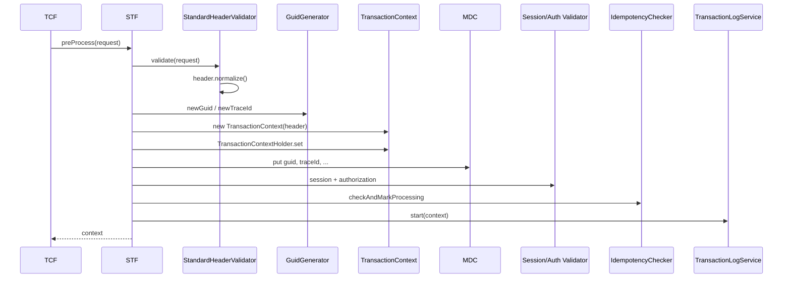

# 34. STF (Standard Transaction Front) 가이드

| 항목 | 내용 |
|------|------|
| 문서 번호 | 34 |
| 제목 | STF — Standard Transaction Front |
| 상위 문서 | [architecture.md](architecture.md) |
| 관련 문서 | [02-junmun.md](02-junmun.md), [03-transaction.md](03-transaction.md), [05-exception.md](05-exception.md), [09-transaction log.md](09-transaction%20log.md), [10-session.md](10-session.md), [33-TCF.md](33-TCF.md) |
| 구현 | `tcf-core/.../processor/STF.java` |
| 대상 | 프레임워크·업무·연동 개발자 |

---

## 1. STF란?

**STF(Standard Transaction Front)** 는 TCF 파이프라인의 **전처리(Front)** 단계이다.  
HTTP JSON 요청이 업무 Handler에 도달하기 **전에** Header·보안·추적·거래 시작 로그를 일괄 처리한다.

| 약어 | 풀네임 | 클래스 |
|------|--------|--------|
| **STF** | Standard Transaction **Front** | `STF` |
| TCF | Transaction Control Framework | `TCF` (오케스트레이션) |
| ETF | **E**nd Transaction Framework | `ETF` (후처리) |

```text
TCF.process()
  ├─ STF.preProcess()     ← 본 문서 (전처리)
  ├─ Dispatcher → Handler
  └─ ETF.success/fail     ← 후처리 ([36-ETF.md](36-ETF.md))

STF **이후** 업무 처리 구간 = **BTF** (Handler → Facade → Service → Rule → DAO → Mapper) — [35-BTF.md](35-BTF.md)
```

STF의 **출력**은 `TransactionContext` 하나 — 이후 Handler·Facade·Service가 동일 Header·추적 정보를 공유한다.

> Header 항목별 통제 기준·DB·구현 갭: [39-header-transaction-control.md](39-header-transaction-control.md)

---

## 2. STF 이전·이후 경계

### 2.1 STF **이전** (Web 계층)

`OnlineTransactionController` / `TcfGateway`가 JSON 역직렬화 후 **최소 Header 보정**만 하고 `TCF.process()`를 호출한다.

| 보정 | 담당 | STF와의 관계 |
|------|------|--------------|
| `header` null → 빈 객체 | Controller | STF validator가 필수값 검증 |
| `businessCode` ← URL path | Controller | STF에서 대문자 normalize |
| `clientIp` ← HTTP | Controller | STF **미검증** (선택 필드) |
| Body 필드 검증 | **Rule (업무)** | STF **범위 밖** |

```46:56:tcf-web/src/main/java/com/nh/nsight/tcf/web/controller/OnlineTransactionController.java
        if (StringUtils.hasText(businessCode) && !StringUtils.hasText(header.getBusinessCode())) {
            header.setBusinessCode(businessCode);
        }
        if (!StringUtils.hasText(header.getClientIp())) {
            header.setClientIp(resolveClientIp(servletRequest));
        }
        StandardResponse<Object> response = tcf.process(request);
```

### 2.2 STF **이후**

| 단계 | 담당 | 검증 대상 |
|------|------|-----------|
| Dispatcher | `TransactionDispatcher` | `serviceId` 등록 여부 |
| Handler~DAO | 업무 WAR | Body·도메인 (Rule/Service) |

**원칙:** Header·프레임워크 보안 = **STF**, Body·업무 규칙 = **Rule/Service**.

---

## 3. `STF.preProcess()` — 전체 흐름

**파일:** `tcf-core/src/main/java/com/nh/nsight/tcf/core/processor/STF.java`  
**진입:** `TCF.process()` try 블록 **첫 줄** — 실패 시 ETF `businessFail`, Context 없을 수 있음.

```38:62:tcf-core/src/main/java/com/nh/nsight/tcf/core/processor/STF.java
    public TransactionContext preProcess(StandardRequest<Map<String, Object>> request) {
        headerValidator.validate(request);
        StandardHeader header = request.getHeader();
        if (!StringUtils.hasText(header.getGuid())) {
            header.setGuid(GuidGenerator.newGuid());
        }
        if (!StringUtils.hasText(header.getTraceId())) {
            header.setTraceId(GuidGenerator.newTraceId());
        }
        TransactionContext context = new TransactionContext(header);
        TransactionContextHolder.set(context);
        putMdc(header);
        sessionValidator.validate(header);
        authorizationValidator.validate(header);
        idempotencyChecker.checkAndMarkProcessing(header);
        transactionLogService.start(context);
        return context;
    }
```

### 3.1 단계 요약표

| # | 처리 | 클래스·메서드 | 실패 errorCode |
|---|------|---------------|----------------|
| 1 | Header 존재·필수·normalize | `StandardHeaderValidator.validate` | `E-COM-VALID-0001` |
| 2 | GUID 부여 | `GuidGenerator.newGuid()` | — |
| 3 | TraceId 부여 | `GuidGenerator.newTraceId()` | — |
| 4 | Context 생성 | `TransactionContext` | — |
| 5 | ThreadLocal 등록 | `TransactionContextHolder.set` | — |
| 6 | MDC 적재 | `STF.putMdc` | — |
| 7 | 세션 검증 | `SessionValidator.validate` | `E-COM-AUTH-0001` |
| 8 | 권한 검증 | `AuthorizationValidator.validate` | `E-COM-AUTH-0002` |
| 9 | 멱등성 | `IdempotencyChecker.checkAndMarkProcessing` | `E-COM-IDEMP-0001` |
| 10 | 거래 시작 로그 | `TransactionLogService.start` | — |



---

## 4. 협력 컴포넌트 상세

### 4.1 StandardHeaderValidator

**파일:** `tcf-core/.../validation/StandardHeaderValidator.java`

```13:32:tcf-core/src/main/java/com/nh/nsight/tcf/core/validation/StandardHeaderValidator.java
    public void validate(StandardRequest<Map<String, Object>> request) {
        if (request == null || request.getHeader() == null) {
            throw new BusinessException(ErrorCode.INVALID_HEADER, "표준 Header가 없습니다.");
        }
        StandardHeader header = request.getHeader();
        header.normalize();
        required(header.getServiceId(), "serviceId");
        required(header.getBusinessCode(), "businessCode");
        required(header.getTransactionCode(), "transactionCode");
        required(header.getProcessingType(), "processingType");
        required(header.getChannelId(), "channelId");
    }
```

**필수 Header (5개):** `serviceId`, `businessCode`, `transactionCode`, `processingType`, `channelId`

**normalize()** (`StandardHeader`):

| 필드 | 미입력 시 |
|------|-----------|
| `systemId` | `NSIGHT-MP` |
| `requestTime` | 현재 시각 ISO-8601 |
| `businessCode` | trim + **대문자** |
| `processingType` | trim + **대문자** |

전문 필드 전체: [02-junmun.md](02-junmun.md) §3.2

**Body는 검증하지 않음** — `request.getBody()` null/empty 허용 (업무 Rule에서 처리).

### 4.2 GUID / TraceId

**파일:** `tcf-util/.../GuidGenerator.java`

```8:14:tcf-util/src/main/java/com/nh/nsight/tcf/util/GuidGenerator.java
    public static String newGuid() {
        return UUID.randomUUID().toString();
    }

    public static String newTraceId() {
        return "trc-" + UUID.randomUUID();
    }
```

| 필드 | 클라이언트 전송 | STF 동작 |
|------|-----------------|----------|
| `guid` | 빈 문자열 또는 omit | 서버 생성 UUID |
| `traceId` | 빈 문자열 또는 omit | `trc-{uuid}` |
| `guid` | 값 있음 | **그대로 사용** |

응답 Header·`TCF_TX_LOG`·MDC에 **동일 guid**가 유지된다.

### 4.3 TransactionContext · ThreadLocal

**파일:** `tcf-core/.../context/TransactionContext.java`

```12:15:tcf-core/src/main/java/com/nh/nsight/tcf/core/context/TransactionContext.java
    public TransactionContext(StandardHeader header) {
        this.header = header;
        this.startTimeMillis = System.currentTimeMillis();
    }
```

| 멤버 | STF 시점 | 용도 |
|------|----------|------|
| `header` | STF 이후 확정 | Handler·ETF·로그 |
| `startTimeMillis` | Context 생성 시 | `elapsedMillis()` → ETF·메트릭 |
| `attributes` | 빈 Map | `TransactionLogService.start` → `txLogStarted` |

**전달 경로**

1. `TransactionContextHolder` (ThreadLocal) — 동일 스레드 어디서든 `get()`
2. Handler → Facade → Service **메서드 인자** (권장)

정리: `TCF.process()` finally + `GuidMdcCleanupFilter` ([33-TCF.md](33-TCF.md))

### 4.4 MDC (로그 상관)

```65:71:tcf-core/src/main/java/com/nh/nsight/tcf/core/processor/STF.java
    private void putMdc(StandardHeader header) {
        MDC.put("guid", header.getGuid());
        MDC.put("traceId", header.getTraceId());
        MDC.put("serviceId", header.getServiceId());
        MDC.put("userId", header.getUserId());
        MDC.put("branchId", header.getBranchId());
    }
```

logback pattern에 `%X{guid}` 등 설정 시 **STF 이후 모든 로그**에 거래 식별자가 붙는다.  
`userId`/`branchId` null이면 MDC에 null 저장.

### 4.5 SessionValidator

**파일:** `tcf-core/.../security/SessionValidator.java`

```18:24:tcf-core/src/main/java/com/nh/nsight/tcf/core/security/SessionValidator.java
    public void validate(StandardHeader header) {
        if (!properties.isSessionValidationEnabled()) {
            return;
        }
        if (!StringUtils.hasText(header.getUserId())) {
            throw new BusinessException(ErrorCode.SESSION_INVALID, "로그인 세션이 유효하지 않습니다.");
        }
    }
```

| `nsight.tcf.session-validation-enabled` | 동작 |
|----------------------------------------|------|
| `false` (업무 WAR 기본) | **스킵** |
| `true` | `userId` 필수 |

HTTP 세션(Spring Session)과 **직접 연동하지 않음** — Header `userId` 존재만 확인.  
실제 OM 로그인·세션: [10-session.md](10-session.md), `OM.Auth.login` Handler.

### 4.6 AuthorizationValidator

**파일:** `tcf-core/.../security/AuthorizationValidator.java`

```18:24:tcf-core/src/main/java/com/nh/nsight/tcf/core/security/AuthorizationValidator.java
    public void validate(StandardHeader header) {
        if (!properties.isAuthorizationValidationEnabled()) {
            return;
        }
        if (!StringUtils.hasText(header.getBranchId())) {
            throw new BusinessException(ErrorCode.AUTHORIZATION_DENIED, "지점 권한 정보를 확인할 수 없습니다.");
        }
    }
```

| `nsight.tcf.authorization-validation-enabled` | 동작 |
|---------------------------------------------|------|
| `false` (기본) | **스킵** |
| `true` | `branchId` 필수 |

ServiceId별 `authCode`·메뉴 권한은 **OM·업무 Rule** 영역 — STF는 Header 최소값만.

### 4.7 IdempotencyChecker

**인터페이스:** `tcf-core/.../idempotency/IdempotencyChecker.java`  
**기본 구현:** `InMemoryIdempotencyChecker` (JVM 메모리)

STF에서 호출: **`checkAndMarkProcessing`만** — ETF에서 `markSuccess` / `markFail`.

| 설정 | `nsight.tcf.idempotency-enabled` |
|------|----------------------------------|
| 업무 WAR 기본 | `true` |
| `tcf-om` | `false` (Admin·로그인 중복 허용) |

**키 구성**

```55:62:tcf-core/src/main/java/com/nh/nsight/tcf/core/idempotency/InMemoryIdempotencyChecker.java
    private String buildKey(StandardHeader header) {
        if (StringUtils.hasText(header.getIdempotencyKey())) {
            return header.getIdempotencyKey();
        }
        return header.getGuid();
    }
```

| 상황 | 결과 |
|------|------|
| 동일 키 `PROCESSING` 중 재요청 | `E-COM-IDEMP-0001` |
| ETF success | `SUCCESS` 상태 |
| ETF fail | `FAIL` 상태 — 재시도 가능 |

다중 AP 운영 시 Redis 등 **`IdempotencyChecker` `@Primary` Bean** 교체 권장.

### 4.8 TransactionLogService.start

**파일:** `tcf-core/.../logging/TransactionLogService.java`

```26:31:tcf-core/src/main/java/com/nh/nsight/tcf/core/logging/TransactionLogService.java
    public void start(TransactionContext context) {
        StandardHeader h = context.getHeader();
        log.info("TX_START guid={} traceId={} serviceId={} txCode={} userId={} branchId={} channelId={}",
                h.getGuid(), h.getTraceId(), h.getServiceId(), ...);
        context.put("txLogStarted", Boolean.TRUE);
    }
```

| 항목 | STF `start()` | ETF `end()` |
|------|---------------|-------------|
| SLF4J `transaction.log` | TX_START | TX_END |
| DB `TCF_TX_LOG` | **없음** | INSERT (별도 DS) |

STF는 **거래 시작 이벤트 로깅**만 — DB 적재는 ETF 후처리.

---

## 5. STF 실패와 TCF 응답

STF 단계 `BusinessException` → `TCF` catch → **`ETF.businessFail`** (Handler 미실행).

```text
요청 (serviceId 누락)
  → STF StandardHeaderValidator
  → BusinessException(E-COM-VALID-0001)
  → ETF.businessFail
  → HTTP 200 + result.resultCode=E0001
```

| STF 실패 지점 | errorCode | Handler 실행 |
|---------------|-----------|--------------|
| Header 필수 | `E-COM-VALID-0001` | ✕ |
| 세션 | `E-COM-AUTH-0001` | ✕ |
| 권한 | `E-COM-AUTH-0002` | ✕ |
| 멱등성 | `E-COM-IDEMP-0001` | ✕ |

Context가 STF **중간**에 실패하면 `TransactionContextHolder`에 일부만 설정될 수 있으나, TCF `finally`에서 **항상 clear**.

상세: [05-exception.md](05-exception.md)

---

## 6. 모듈별 STF 관련 설정

| 모듈 | session-validation | authorization-validation | idempotency-enabled |
|------|--------------------|---------------------------|---------------------|
| `*-service` (16) | `false` | `false` | `true` |
| `tcf-om` | `false` | `false` | **`false`** |
| `tcf-batch` | (TCF 없음) | — | — |

**OM Admin**은 Spring Session JDBC로 로그인하지만, STF `session-validation-enabled`는 기본 **off** —  
`userId`는 클라이언트 JSON Header 또는 Relay Cookie 세션에서 **채워서** 보낸다.

---

## 7. Walkthrough — 정상 STF

**요청:** `POST /sv/online`

```json
{
  "header": {
    "businessCode": "SV",
    "serviceId": "SV.Sample.inquiry",
    "transactionCode": "SV-INQ-0001",
    "processingType": "INQUIRY",
    "channelId": "WEBTOP",
    "userId": "U123456"
  },
  "body": { "sampleKey": "A001" }
}
```

| # | STF 동작 | 결과 Header/Context |
|---|----------|------------------------|
| 1 | validate + normalize | `systemId=NSIGHT-MP`, `businessCode=SV` |
| 2 | guid/traceId | 새 UUID / `trc-...` |
| 3 | Context | `startTimeMillis` 기록 |
| 4 | MDC | guid, serviceId, userId, … |
| 5 | session/auth | 설정 off → skip |
| 6 | idempotency | 키=guid, PROCESSING 등록 |
| 7 | TX_START | 로그 1줄 |

이후 `Dispatcher` → `SvSampleHandler` → Facade …

---

## 8. Walkthrough — STF 실패 예

**Case A — channelId 누락**

```json
{ "header": { "serviceId": "SV.Sample.inquiry", "businessCode": "SV",
              "transactionCode": "SV-INQ-0001", "processingType": "INQUIRY" },
  "body": {} }
```

→ `E-COM-VALID-0001` "필수 Header 누락: channelId"  
→ Handler·Facade **미호출**

**Case B — idempotency (동일 guid 재전송, idempotency-enabled=true)**

첫 요청 처리 중 동일 `guid` 재POST  
→ `E-COM-IDEMP-0001` "동일 요청이 처리 중입니다."

---

## 9. STF vs ETF (대칭)

| 항목 | STF (Front) | ETF (End) |
|------|-------------|-----------|
| 호출 시점 | Handler **전** | Handler **후** |
| Header | 검증·보완·ID 부여 | 응답 Header 유지 |
| Context | **생성** | 소요 시간·결과 사용 |
| Idempotency | `checkAndMarkProcessing` | `markSuccess` / `markFail` |
| TransactionLog | `start()` (로그만) | `end()` + DB |
| Audit / Metric | ✕ | `audit()`, `record()` |
| 출력 | `TransactionContext` | `StandardResponse` |

---

## 10. STF가 하지 **않는** 것

| 항목 | 담당 |
|------|------|
| Body 필드 검증 | Rule / Service |
| serviceId → Handler 매핑 | `TransactionDispatcher` |
| 업무 DB 트랜잭션 | Facade `@Transactional` |
| `TCF_TX_LOG` INSERT | ETF + `TransactionLogRepository` |
| HTTP status 4xx/5xx | Controller/TCF — **200 + resultCode** |
| Spring Session 조회 | Spring Session Filter (tcf-om) |
| ServiceId 권한·카탈로그 | OM `OM_SERVICE_CATALOG` / 업무 Rule |

---

## 11. 확장·교체

| 컴포넌트 | 교체 방법 |
|----------|-----------|
| Header 검증 규칙 | `StandardHeaderValidator` `@Component` 교체 |
| 세션/권한 | `SessionValidator` / `AuthorizationValidator` Bean 교체 |
| 멱등성 저장소 | `IdempotencyChecker` `@Primary` 구현 |
| STF 파이프라인 순서 | **`STF` 클래스 수정** (프레임워크 변경 — 신중) |

업무 WAR에서 STF를 **우회·fork하지 않음** — 모든 `/online`은 `TCF.process()` 필수.

---

## 12. 디버깅

| 확인 | 방법 |
|------|------|
| STF 단계별 콘솔 | `TcfConsoleLog` / `[STF.preProcess]` System.out (개발) |
| Header 검증 실패 | 응답 `errorCode` `E-COM-*` |
| guid 추적 | MDC `guid`, `TCF_TX_LOG.GUID` |
| idempotency | 동일 guid 연속 호출, `idempotency-enabled` yml |
| session-validation | `nsight.tcf.session-validation-enabled=true` 후 userId 없는 요청 |

---

## 13. 관련 문서

| 주제 | 문서 |
|------|------|
| TCF 전체·ETF | [33-TCF.md](33-TCF.md) |
| 표준 Header 필드 | [02-junmun.md](02-junmun.md) |
| 트랜잭션 파이프라인 | [03-transaction.md](03-transaction.md) §4 |
| 거래로그 DB | [09-transaction log.md](09-transaction%20log.md) |
| Handler 이후 | [29-facade.md](29-facade.md) |

---

## 14. 변경 이력

| 일자 | 변경 내용 |
|------|-----------|
| 2026-06 | 최초 작성 — STF preProcess·협력 컴포넌트 소스 가이드 |
