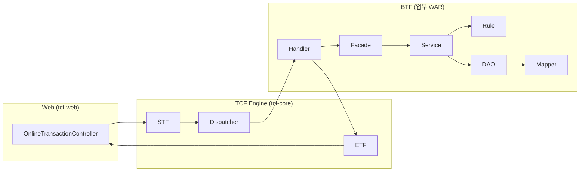

# 35. BTF (Business Transaction Framework) 가이드

| 항목 | 내용 |
|------|------|
| 문서 번호 | 35 |
| 제목 | BTF — Business Transaction Framework |
| 상위 문서 | [architecture.md](architecture.md) |
| 관련 문서 | [01-application-layer.md](01-application-layer.md), [29-facade.md](29-facade.md), [32-AOP.md](32-AOP.md), [33-TCF.md](33-TCF.md), [34-STF.md](34-STF.md), [26-mybatis.md](26-mybatis.md) |
| 구현 | 업무 WAR(`*-service`), `tcf-om` — **단일 JAR 클래스명 `BTF` 없음** |
| 대상 | 업무 Handler·Facade·Service 개발자 |

---

## 1. BTF란?

**BTF(Business Transaction Framework)** 는 NSIGHT TCF 파이프라인에서 **STF 전처리 이후 · ETF 후처리 이전**에 위치하는 **업무(비즈니스) 처리 구간**을 가리키는 아키텍처 용어이다.

| 약어 | 풀네임 | 구현 |
|------|--------|------|
| STF | Standard Transaction **Front** | `tcf-core` — `STF.java` |
| **BTF** | **Business** Transaction Framework | 업무 WAR — Handler → Facade → Service → Rule → DAO → Mapper |
| ETF | **E**nd Transaction Framework | `tcf-core` — `ETF.java` |
| TCF | Transaction Control **Framework** | STF + Dispatcher + **BTF 구간** + ETF 전체를 `TCF.process()`로 오케스트레이션 |

```text
TCF.process()
  │
  ├─ STF.preProcess()              ← Header·추적·프레임워크 보안 ([34-STF.md](34-STF.md))
  │
  ├─ TransactionDispatcher         ← serviceId → Handler (TCF ↔ BTF 경계)
  │
  ├─ ═══ BTF (Business Transaction Framework) ═══
  │     Handler        TCF → 업무 어댑터
  │       → Facade     유스케이스·@Transactional
  │         → Service  도메인·응답 Map 조립
  │           → Rule   Body·업무 검증
  │           → DAO    영속 추상화
  │             → Mapper (+ XML)  SQL
  │
  └─ ETF.success / businessFail / systemError   ← 표준 응답·거래 종료 ([36-ETF.md](36-ETF.md))
```

BTF는 **Gradle 모듈 이름이 아니라** 업무 코드가 따르는 **계층 패턴·프레임워크 관례**이다.  
소스 레벨 상세 호출: [29-facade.md](29-facade.md).

---

## 2. TCF 파이프라인에서의 위치



| 구간 | 담당 | 검증·처리 대상 |
|------|------|----------------|
| STF | `tcf-core` | Header, guid, 세션·권한·멱등성 |
| **BTF** | 업무 WAR | Body, 도메인, DB, 응답 body Map |
| ETF | `tcf-core` | resultCode, TX_END, 감사·메트릭 |

---

## 3. BTF 계층 구조

### 3.1 수직 계층

```text
┌─────────────────────────────────────────────────────────┐
│ Handler          serviceId 등록, Facade 위임 (얇게)       │  ← BTF 진입
├─────────────────────────────────────────────────────────┤
│ Facade           @Transactional, 유스케이스 1건         │
├─────────────────────────────────────────────────────────┤
│ Service          Rule → DAO, 결과 Map 조립               │
├─────────────────────────────────────────────────────────┤
│ Rule             Body·업무 제약, BusinessException      │
├─────────────────────────────────────────────────────────┤
│ DAO              Mapper 호출, 조건 Map                  │
├─────────────────────────────────────────────────────────┤
│ Mapper + XML     MyBatis SQL                            │
└─────────────────────────────────────────────────────────┘
```

### 3.2 패키지·스테레오타입 (업무 WAR 표준)

```text
com.nh.nsight.marketing.{code}/
├── handler/     @Component implements TransactionHandler
├── facade/      @Service + @Transactional
├── service/     @Service
├── rule/        @Component
├── dao/         @Repository
├── mapper/      @Mapper (MyBatis)
└── resources/mapper/{code}/*.xml
```

| 패키지 | Spring | BTF 역할 |
|--------|--------|----------|
| `handler` | `@Component` | BTF **진입** — `serviceId`, `body`/`context` → Facade |
| `facade` | `@Service` | TX 경계, Service 호출 |
| `service` | `@Service` | 도메인 로직 |
| `rule` | `@Component` | 입력 검증 |
| `dao` | `@Repository` | DB 접근 |
| `mapper` | `@Mapper` | SQL |

`tcf-om`은 Handler 40+ · Facade 20+ — 동일 BTF 패턴.

---

## 4. BTF 진입 — Handler

Dispatcher가 `serviceId`로 Handler를 찾으면 **BTF가 시작**된다.

```10:26:sv-service/src/main/java/com/nh/nsight/marketing/sv/handler/SvSampleInquiryHandler.java
@Component
public class SvSampleInquiryHandler implements TransactionHandler {
    private final SvSampleFacade facade;

    @Override
    public String serviceId() {
        return "SV.Sample.inquiry";
    }

    @Override
    public Object doHandle(StandardRequest<Map<String, Object>> request, TransactionContext context) {
        return facade.inquiry(request.getBody(), context);
    }
}
```

| Handler 규칙 | 내용 |
|--------------|------|
| `serviceId()` | `TransactionDispatcher` Map 키 — **유일** |
| `doHandle` | Facade 메서드 1개 호출 |
| 예외 | catch **금지** → TCF → ETF |
| `@Transactional` | **금지** — Facade에 둠 |

Handler는 BTF의 **문**이지 비즈니스 로직 본체가 아니다.

---

## 5. Facade — BTF 트랜잭션·유스케이스 경계

```17:19:sv-service/src/main/java/com/nh/nsight/marketing/sv/facade/SvSampleFacade.java
    @Transactional(readOnly = true, timeout = 5)
    public Map<String, Object> inquiry(Map<String, Object> body, TransactionContext context) {
        return service.inquiry(body, context);
    }
```

| 항목 | Facade | Service |
|------|--------|---------|
| Spring TX (`@Transactional`) | **●** | ✕ (기본) |
| 범위 | 유스케이스 1건 | 도메인 연산 |
| AOP | `TransactionInterceptor` ([32-AOP.md](32-AOP.md)) | 없음 |

**BTF 내부 DB TX**는 Facade에서만 시작·종료 — STF/ETF의 TCF 거래로그와 **별도 Connection**.

---

## 6. Service — 도메인·응답 조립

```20:28:sv-service/src/main/java/com/nh/nsight/marketing/sv/service/SvSampleService.java
    public Map<String, Object> inquiry(Map<String, Object> body, TransactionContext context) {
        rule.validateInquiry(body);
        Map<String, Object> data = dao.selectSample(body);
        Map<String, Object> result = new LinkedHashMap<>();
        result.put("businessCode", "SV");
        result.put("serviceId", context.getHeader().getServiceId());
        result.put("guid", context.getHeader().getGuid());
        result.put("data", data);
        return result;
    }
```

Service가 반환한 `Map`이 Handler → Dispatcher → **ETF `body`**로 전달된다.  
ETF는 body 내용을 **가공하지 않고** `StandardResponse`에 실은다.

---

## 7. Rule — BTF 검증 (STF와 분리)

| 계층 | 검증 대상 | 예 |
|------|-----------|-----|
| STF | Header | `serviceId`, `channelId` |
| **Rule (BTF)** | Body·업무 | 필수 필드, 페이징 상한 |
| Service | 도메인 | 중복 키, row 없음 |

```10:14:sv-service/src/main/java/com/nh/nsight/marketing/sv/rule/SvSampleRule.java
    public void validateInquiry(Map<String, Object> body) {
        if (body == null || body.isEmpty()) {
            throw new BusinessException(ErrorCode.BUSINESS_ERROR, "요청 Body가 비어 있습니다.");
        }
    }
```

`BusinessException` → TCF catch → **ETF.businessFail** — BTF 밖으로 표준 오류 JSON.

---

## 8. DAO · Mapper — BTF 영속

```text
Service → DAO (@Repository) → Mapper Interface → Mapper XML → DB
```

| 계층 | 금지 |
|------|------|
| Service | Mapper/SQL 직접 호출 |
| Rule | DAO 호출 |
| Handler | Facade 건너뛰기 |

MyBatis 상세: [26-mybatis.md](26-mybatis.md)  
페이징: Rule `normalizePaging` → DAO `search*` + `count*` — [27-paging.md](27-paging.md)

---

## 9. BTF 종료 — ETF로 body 전달

Handler `doHandle` return 값 = BTF **산출물**(업무 body).

```text
BTF return (Map body)
  → TransactionDispatcher.dispatch() return
  → TCF: etf.success(request, body, context)
  → StandardResponse { header, result: S0000, body }
```

| BTF 결과 | ETF 분기 |
|----------|----------|
| Map 정상 return | `ETF.success` |
| `BusinessException` | `ETF.businessFail` (body null) |
| 기타 Exception | `ETF.systemError` |

BTF에서 Facade `@Transactional` rollback이 일어나도 ETF는 **거래 종료 로그·result 전문**을 만든다.

---

## 10. End-to-End — BTF 구간만 확대

`SV.Sample.inquiry` 기준:

| # | 계층 | 클래스·메서드 |
|---|------|---------------|
| 0 | TCF 경계 | `TransactionDispatcher.dispatch` |
| 1 | Handler | `SvSampleInquiryHandler.doHandle` |
| 2 | Facade | `SvSampleFacade.inquiry` (@Transactional readOnly) |
| 3 | Service | `SvSampleService.inquiry` |
| 4 | Rule | `SvSampleRule.validateInquiry` |
| 5 | DAO | `SvSampleDao.selectSample` |
| 6 | (Mapper) | 샘플은 stub — 실제는 `SvSampleMapper.xml` |
| 7 | return | `Map` → ETF |

**tcf-om 페이징 CRUD** (`OM.ServiceCatalog.inquiry`):

```text
OmServiceCatalogInquiryHandler
  → OmServiceCatalogFacade.inquiry
  → OmServiceCatalogService.inquiry
      → OmOperationRule.validateOperation / normalizePaging
      → OmOperationDao.searchServiceCatalog / countServiceCatalog
      → OmOperationMapper.xml
  → { pageNo, pageSize, totalCount, rows }
```

---

## 11. BTF 호출 규칙

```text
허용:
  Dispatcher → Handler
  Handler    → Facade
  Facade     → Service
  Service    → Rule, DAO
  DAO        → Mapper

금지:
  Handler    → Service / DAO (Facade 우회)
  Handler    → @Transactional
  Rule       → DAO
  Service    → Mapper 직접
  Handler    → 예외 catch 후 null return
```

---

## 12. 모듈별 BTF

| 모듈 | BTF | Handler 수 | 비고 |
|------|-----|------------|------|
| `sv-service` … `mg-service` | ● | 샘플 1~N | `com.nh.nsight` scan |
| `tcf-om` | ● | 40+ | OM·UD 통합 |
| `tcf-batch` | ✕ | — | Job/Scheduler, `/online` 없음 |
| `tcf-ui` | ✕ | — | Relay only |

---

## 13. STF · BTF · ETF 대칭

| | STF | BTF | ETF |
|---|-----|-----|-----|
| 위치 | Handler **전** | Handler **~** Mapper | Handler **후** |
| 모듈 | tcf-core | 업무 WAR | tcf-core |
| 입력 | `StandardRequest` | `body`, `TransactionContext` | body + context |
| 출력 | `TransactionContext` | body `Map` | `StandardResponse` |
| DB | 거래로그 start(로그) | **업무 DB** (Facade TX) | `TCF_TX_LOG` INSERT |
| 개발자 | 프레임워크 | **업무 팀** | 프레임워크 |

---

## 14. 신규 BTF(거래) 추가

| 순서 | 작업 |
|------|------|
| 1 | `XxxActionHandler` — `serviceId()`, Facade 위임 |
| 2 | `XxxFacade` — `@Transactional` |
| 3 | `XxxService` — Rule → DAO → result Map |
| 4 | `XxxRule` — Body 검증 |
| 5 | `XxxDao` + `XxxMapper` (+ XML) |
| 6 | `OM_SERVICE_CATALOG` / Admin 등록 (운영) |

기동 로그: `Registered NSIGHT handler. serviceId=...`

---

## 15. 관련 문서

| 주제 | 문서 |
|------|------|
| BTF 소스 호출 상세 | [29-facade.md](29-facade.md) |
| 계층 책임 | [01-application-layer.md](01-application-layer.md) |
| STF (BTF 이전) | [34-STF.md](34-STF.md) |
| TCF·ETF | [33-TCF.md](33-TCF.md), [36-ETF.md](36-ETF.md) |
| Facade TX AOP | [32-AOP.md](32-AOP.md) |

---

## 16. 변경 이력

| 일자 | 변경 내용 |
|------|-----------|
| 2026-06 | 최초 작성 — BTF(Business Transaction Framework) 정의 및 Handler~Mapper 가이드 |
