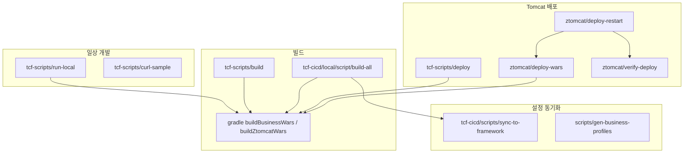

# 38. 스크립트 가이드

| 항목 | 내용 |
|------|------|
| 문서 번호 | 38 |
| 제목 | Script — 빌드·실행·배포·CICD 스크립트 정리 |
| 상위 문서 | [architecture.md](architecture.md) |
| 관련 문서 | [20-env-spring.md](20-env-spring.md), [30-springboot.md](30-springboot.md), [37-transaction-log.md](37-transaction-log.md), [ztomcat/README.md](../../ztomcat/README.md), [tcf-scripts/README.md](../../tcf-scripts/README.md) |
| 대상 | 로컬 개발·통합 검증·배포·CICD 담당자 |

---

## 1. 개요

NSIGHT TCF Framework의 스크립트는 **역할별 디렉터리**로 나뉜다.  
일상 개발은 **`tcf-scripts/`**(프로젝트 루트)와 **`ztomcat/`** 만 익히면 대부분 커버된다.

```text
nsight-tcf-framework/
├── tcf-scripts/          ★ 루트 Gradle 래퍼 (build / run-local / deploy / curl)
├── ztomcat/              ★ 로컬 Tomcat 8080 통합 배포
├── {module}/scripts/     모듈별 단건 래퍼 (build / run-local / deploy)
├── tcf-cicd/
│   ├── scripts/          CICD ↔ framework 설정 동기화
│   └── local/script/     local 프로파일 빌드·배포 일괄
├── scripts/              yml 템플릿 생성 (gen-business-profiles)
└── build.gradle          buildBusinessWars / buildZtomcatWars
```

| 실행 모드 | 포트 | 주 스크립트 |
|-----------|------|-------------|
| **bootRun** (모듈별) | 8081–8099 | `tcf-scripts/run-local.*` |
| **ztomcat** (통합) | **8080** | `ztomcat/deploy-wars.*`, `start.*` |
| **CICD local 빌드** | — | `tcf-cicd/local/script/build-all.*` |

상세 Tomcat: [ztomcat/README.md](../../ztomcat/README.md)  
단축 README: [tcf-scripts/README.md](../../tcf-scripts/README.md)

---

## 2. 스크립트 계층



**원칙**

1. **프로젝트 루트**에서 `tcf-scripts/*` 실행 (`cd` 자동 처리).
2. 모듈 `scripts/`는 **해당 모듈 디렉터리 기준** — IDE·습관용 단건 래퍼.
3. WAR 파일명·context path 규칙은 `ztomcat/deploy-wars`와 Gradle `bootWar`가 **단일 진실**.

---

## 3. `tcf-scripts/` — 메인 진입점

**위치:** `tcf-scripts/`  
**실행:** 저장소 **루트** 기준 (스크립트가 `cd ..` 처리).

### 3.1 `run-local` — Spring Boot bootRun

| 파일 | OS |
|------|-----|
| `run-local.bat` | Windows |
| `run-local.sh` | Linux/macOS |

```bat
tcf-scripts\run-local.bat sv
tcf-scripts\run-local.bat tcf-om batch ui
tcf-scripts\run-local.bat all
```

| 인자 | 모듈 | bootRun 포트 |
|------|------|--------------|
| `sv`, `sv-service` | sv-service | 8086 |
| `cc` … `mg` | `{code}-service` | 8081–8096 |
| `om`, `ud`, `tcf-om` | tcf-om | 8097 |
| `batch`, `tcf-batch` | tcf-batch | 8098 |
| `ui`, `tcf-ui` | tcf-ui | 8099 |
| `all` | 16 *-service + tcf-om | 각각 **새 cmd 창** |

**동작**

- 인자 **1개** → 포그라운드 `gradle :{module}:bootRun`
- 인자 **복수** → 모듈당 새 창에서 bootRun
- `all` → 16 업무 + tcf-om 일괄 기동 (batch/ui 제외)

### 3.2 `build` — Gradle 빌드

```bat
tcf-scripts\build.bat all
tcf-scripts\build.bat wars
tcf-scripts\build.bat tcf
tcf-scripts\build.bat sv cc
```

| target | Gradle task |
|--------|-------------|
| `all` | `clean buildBusinessWars` |
| `wars` | `buildBusinessWars` |
| `tcf` | `:tcf-util:build :tcf-core:build :tcf-web:build` |
| `ui` / `tcf-ui` | `:tcf-ui:bootJar` |
| `services` | 16 *-service `:build` + `:tcf-om:bootWar` |
| `sv`, `ic`, … | `:{code}-service:build` |

`build-all.bat` / `build-all.sh` → 내부적으로 `build.bat all` 호출.

> `ztomcat` **13 WAR** 배포는 `ztomcat/deploy-wars all`. 빌드는 `gradle buildZtomcatWars`(15 WAR).

### 3.3 `deploy` — WAR → Tomcat webapps

```bat
tcf-scripts\deploy.bat all
tcf-scripts\deploy.bat sv cc om
```

| 단계 | 내용 |
|------|------|
| 1 | Gradle `buildBusinessWars` (또는 선택 모듈 `bootWar`) |
| 2 | `webapps/{code}/` exploded 디렉터리 삭제 |
| 3 | `build/libs/*.war` → `ztomcat/apache-tomcat-10.1.34/webapps/` 복사 |

**WAR 이름 매핑 (일부)**

| 코드 | Gradle 모듈 | webapps 파일 |
|------|-------------|--------------|
| sv | sv-service | `sv.war` |
| om | tcf-om | `om.war` (빌드 산출 `tcf-om.war`) |

기본 webapps: `{PROJECT}/ztomcat/apache-tomcat-10.1.34/webapps`  
오버라이드: 환경변수 `TOMCAT_WEBAPPS`.

> 전체 재배포·검증은 `ztomcat/deploy-restart.*` + `verify-deploy.*` 권장.

### 3.4 `curl-sample` — 샘플 거래 POST

```bat
tcf-scripts\curl-sample.bat sv
```

- bootRun 포트로 `POST /{code}/online`
- Body: `tcf-ui/src/main/resources/sample-requests/{code}-sample-inquiry.json`
- Tomcat 모드(8080)용: `curl-sv-sample.bat` / 수동 `curl localhost:8080/sv/online`

---

## 4. `ztomcat/` — 로컬 Tomcat 통합

**목적:** Spring Boot WAR **19개**를 Tomcat **8080**에 올려 운영과 동일 context path로 검증.

| 항목 | 값 |
|------|-----|
| Tomcat | 10.1.34 (Jakarta / Servlet 6) |
| JDK | **21 필수** |
| WAR | 업무 9 + tcf-om + tcf-batch + tcf-ui + tcf-jwt (deploy 13) |

### 4.1 스크립트 목록

| 스크립트 | Windows | Linux | 설명 |
|----------|---------|-------|------|
| Tomcat 설치 | `install-tomcat.bat` | `install-tomcat.sh` | 최초 1회 다운로드·압축 해제 |
| WAR 배포 | `deploy-wars.bat` | `deploy-wars.sh` | bootWar + webapps 복사 |
| 기동 | `start.bat` → `start.ps1` | `start.sh` | JDK21, apply-config, catalina start |
| 중지 | `stop.bat` → `stop.ps1` | `stop.sh` | catalina stop |
| 설정 | `apply-config.ps1` | `apply-config.sh` | setenv 복사, server.xml UTF-8 |
| 검증 | `verify-deploy.ps1` | `verify-deploy.sh` | 19 context `/actuator/health` |
| 원클릭 | `deploy-restart.ps1` | `deploy-restart.sh` | stop → deploy all → start → verify |
| H2 TCP | `h2-txlog.ps1` | — | nsight_om TCP 9092 (선택) |
| exploded 정리 | `clean-exploded.ps1` | — | webapps 하위 디렉터리 정리 |

**Windows:** 경로에 괄호 `(23-08-15)` 등이 있어 `start.bat`/`stop.bat`은 **PowerShell 래퍼** 사용.

### 4.2 빠른 시작

```bat
cd ztomcat
install-tomcat.bat
deploy-wars.bat all
start.bat
verify-deploy.ps1
```

### 4.3 deploy-wars 코드 (19개)

```text
cc ic pc bc ms sv pd cm eb ep bp bd ss cs ct mg om batch ui
```

| 코드 | Context | Health URL |
|------|---------|------------|
| sv | `/sv` | `http://localhost:8080/sv/actuator/health` |
| om | `/om` | `http://localhost:8080/om/actuator/health` |
| batch | `/batch` | … |
| ui | `/ui` | … |

온라인 거래: `POST http://localhost:8080/sv/online` (JSON)

### 4.4 JVM·H2 공유

`conf/setenv.*` / `setenv.local.*`:

- `-Dnsight.txlog.path={프로젝트}/data/nsight-txlog`
- bootRun·Tomcat이 **동일 H2** (`TCF_TX_LOG`) — [37-transaction-log.md](37-transaction-log.md)

오버라이드: `NSIGHT_TXLOG_PATH`, `setenv.local.bat|sh`

---

## 5. 모듈별 `scripts/` — 단건 래퍼

**대상:** 16 *-service, tcf-om, tcf-ui, tcf-batch, tcf-web, tcf-core 등

각 모듈 `scripts/`에 **동일 패턴** 4종:

| 파일 | 역할 |
|------|------|
| `build.bat` / `build.sh` | `gradle :{module}:build` 또는 `bootWar` |
| `run-local.bat` / `run-local.sh` | `gradle :{module}:bootRun` |
| `deploy.bat` / `deploy.sh` | 해당 WAR만 빌드 후 ztomcat webapps 복사 |

**예:** `sv-service/scripts/run-local.bat`

- `PROJECT_HOME` = 모듈 상위 2단계 (프레임워크 루트)
- `MODULE=sv-service`, 포트 8086 고정 출력
- Gradle: `GRADLE_HOME` → `GRADLE_HOME_OVERRIDE` → PATH `gradle`

**언제 쓰는가**

| 상황 | 권장 |
|------|------|
| SV만 반복 개발 | `sv-service/scripts/run-local.bat` 또는 `tcf-scripts/run-local.bat sv` |
| 여러 모듈·일괄 | **항상 `tcf-scripts/`** |
| IDE Run Configuration | 모듈 `scripts/run-local` 경로 참고 |

### 5.1 tcf-om 전용

| 스크립트 | 설명 |
|----------|------|
| `seed-common-code.bat` | H2 `nsight_om`에 `seed-common-code.sql` 실행 |
| `seed-common-code.sql` | 공통코드 시드 |
| `seed-auth-login.sql` | 로그인 시드 (수동) |

---

## 6. Gradle 루트 태스크

**파일:** `build.gradle`

| Task | 설명 | WAR 수 |
|------|------|--------|
| `buildBusinessWars` | 16 *-service + `tcf-om` bootWar | **17** |
| `buildZtomcatWars` | 위 + `tcf-batch` + `tcf-ui` bootWar | **19** |

```bash
gradle buildBusinessWars
gradle buildZtomcatWars
gradle :sv-service:bootRun
```

`businessModules` (17): cc, ic, pc, bc, ms, sv, pd, cm, eb, ep, bp, bd, ss, cs, ct, mg, **tcf-om**

---

## 7. `tcf-cicd/` — 설정·빌드 파이프라인

### 7.1 `tcf-cicd/scripts/`

| 스크립트 | 설명 |
|----------|------|
| `sync-to-framework.ps1` | `tcf-cicd/{local\|dev\|prod}/spring/{module}/application-*.yml` → framework `src/main/resources/` |
| `pull-from-framework.ps1` | framework → tcf-cicd 역방향 |
| `render-business-yml.ps1` | values.yaml 기반 yml 렌더 (확장 포인트) |
| `apply-tomcat-config.sh` | prod yml → `$CATALINA_BASE/conf/nsight/` (WAR 재빌드 없이 설정 갱신) |

```powershell
tcf-cicd\scripts\sync-to-framework.ps1 -Profile local
tcf-cicd\scripts\sync-to-framework.ps1 -Profile dev -SpringOnly
```

### 7.2 `tcf-cicd/local/script/`

| 스크립트 | 설명 |
|----------|------|
| `build-all.ps1` | local yml sync → gradle build / buildZtomcatWars 등 |
| `build-all.bat` / `.sh` | PowerShell 래퍼 |
| `deploy-wars.ps1` / `.bat` / `.sh` | ztomcat 배포 단축 |
| `h2-txlog.bat` / `.ps1` | H2 txlog TCP (local) |

**build-all.ps1 `-Target`**

| Target | Gradle |
|--------|--------|
| `all` (기본) | `build` (전 모듈 compile+test) |
| `wars` | `buildZtomcatWars` |
| `business` | `buildBusinessWars` |
| `framework` | tcf-* + om/batch/ui (업무 WAR 제외) |
| `fast` | `build -x test` |

### 7.3 `tcf-cicd/{local,dev,prod}/ztomcat/`

프로파일별 `setenv.*` — framework `ztomcat/conf/`와 대응.  
local 통합 검증 시 `tcf-cicd/local/ztomcat/start.bat` 등 **cicd 경로** 래퍼도 존재 (framework `ztomcat/`과 동일 역할).

---

## 8. `scripts/` — 프로파일 생성

| 파일 | 설명 |
|------|------|
| `gen-business-profiles.ps1` | 16 *-service + om-service용 `application-local/dev/prod.yml` 일괄 생성 |
| `gen-business-profiles.py` | 동일 목적 Python 버전 |

포트·H2 DB명·`nsight.tcf.transaction-log-datasource` 등 **템플릿 값**을 코드 테이블로 관리.  
CICD SoT는 `tcf-cicd/` — 변경 후 `sync-to-framework` 또는 `render-business-yml`로 반영.

---

## 9. 환경 변수·경로

| 변수 | 용도 |
|------|------|
| `GRADLE_HOME` / `GRADLE_HOME_OVERRIDE` | Gradle 실행 파일 (괄호 경로 시 OVERRIDE 권장) |
| `JAVA_HOME` | JDK 21 (ztomcat `setenv.local.*`) |
| `TOMCAT_WEBAPPS` | deploy 대상 webapps 경로 |
| `NSIGHT_TXLOG_PATH` | H2 `data/nsight-txlog` 루트 |
| `CATALINA_HOME` / `CATALINA_BASE` | 운영 Tomcat (`apply-tomcat-config.sh`) |

**실행 위치**

| 스크립트 그룹 | cwd |
|---------------|-----|
| `tcf-scripts/*` | 프로젝트 루트 (자동 `cd ..`) |
| `ztomcat/*` | `ztomcat/` |
| `{module}/scripts/*` | 모듈 내 실행 가능 (PROJECT_HOME 자동 계산) |

---

## 10. bootRun 포트 매트릭스

| 코드 | 모듈 | 포트 |
|------|------|------|
| cc | cc-service | 8081 |
| ic | ic-service | 8082 |
| pc | pc-service | 8083 |
| bc | bc-service | 8084 |
| ms | ms-service | 8085 |
| sv | sv-service | 8086 |
| pd | pd-service | 8087 |
| cm | cm-service | 8088 |
| eb | eb-service | 8089 |
| ep | ep-service | 8090 |
| bp | bp-service | 8091 |
| bd | bd-service | 8092 |
| ss | ss-service | 8093 |
| cs | cs-service | 8094 |
| ct | ct-service | 8095 |
| mg | mg-service | 8096 |
| om | tcf-om | 8097 |
| batch | tcf-batch | 8098 |
| ui | tcf-ui | 8099 |

**ztomcat:** 전부 **8080**, context `/cc` … `/mg`, `/om`, `/batch`, `/ui`

---

## 11. 시나리오별 실행 순서

### 11.1 단일 업무 bootRun 개발

```bat
tcf-scripts\run-local.bat sv
tcf-scripts\curl-sample.bat sv
```

### 11.2 OM + UI + batch (bootRun)

```bat
tcf-scripts\run-local.bat tcf-om batch ui
```

브라우저: `http://localhost:8099/om/admin/dashboard.html`

### 11.3 Tomcat 통합 (deploy-wars 13 WAR)

```bat
cd ztomcat
deploy-restart.bat
curl http://localhost:8080/sv/actuator/health
```

### 11.4 SV만 Tomcat hot deploy

```bat
ztomcat\deploy-wars.bat sv
```

Tomcat **재기동 불필요** (~15초 autoDeploy).

### 11.5 CICD local 전체 빌드

```powershell
tcf-cicd\local\script\build-all.ps1 -Target wars
```

### 11.6 공통코드 시드 (OM)

```bat
tcf-om\scripts\seed-common-code.bat
```

---

## 12. OS·확장자 규칙

| OS | 선호 | 비고 |
|----|------|------|
| Windows | `.bat` → 내부 `.ps1` | Tomcat start/stop, deploy-restart |
| Linux/macOS | `.sh` | `chmod +x` 후 실행 |
| 공통 | Gradle 직접 호출 | CI·IDE |

`.bat`과 `.sh`는 **동일 시맨틱**을 목표로 유지. Windows 전용: `h2-txlog.ps1`, `clean-exploded.ps1`.

---

## 13. 트러블슈팅

| 증상 | 확인 |
|------|------|
| `gradle not found` | `GRADLE_HOME_OVERRIDE`, PATH |
| `/sv/online` 404 (Tomcat) | JDK 21, `catalina.log`에 `Started` |
| deploy 후 구버전 | exploded `{code}/` 삭제 — deploy-wars가 처리 |
| bootRun vs Tomcat DB 불일치 | `NSIGHT_TXLOG_PATH` / setenv `-Dnsight.txlog.path` |
| curl-sample connection refused | bootRun 기동 여부·포트 매트릭스 |
| build-all sync 실패 | `tcf-cicd/local/spring/{module}/application-local.yml` 존재 |

Tomcat 상세: [ztomcat/README.md §12](../../ztomcat/README.md#12-트러블슈팅)

---

## 14. 스크립트 파일 인덱스 (요약)

| 경로 | 개수(약) | 역할 |
|------|----------|------|
| `tcf-scripts/` | 14 | **루트** build / run / deploy / curl |
| `ztomcat/` | 20+ | Tomcat install / deploy / lifecycle |
| `*-service/scripts/` | ×4 ×16 | 모듈 단건 래퍼 |
| `tcf-om/scripts/` | 8+ | om + seed |
| `tcf-ui/scripts/` | 6 | ui build/run/deploy |
| `tcf-batch/scripts/` | 1+ | batch run-local |
| `tcf-cicd/scripts/` | 5 | yml sync / tomcat config |
| `tcf-cicd/local/script/` | 8+ | local build-all / deploy |
| `scripts/` | 2 | gen-business-profiles |

---

## 15. 관련 문서

| 문서 | 내용 |
|------|------|
| [ztomcat/README.md](../../ztomcat/README.md) | Tomcat 상세·URL·트러블슈팅 |
| [tcf-scripts/README.md](../../tcf-scripts/README.md) | tcf-scripts 요약 |
| [20-env-spring.md](20-env-spring.md) | application-local/dev/prod |
| [30-springboot.md](30-springboot.md) | bootRun / WAR 기동 |
| [37-transaction-log.md](37-transaction-log.md) | H2 txlog 경로 |
