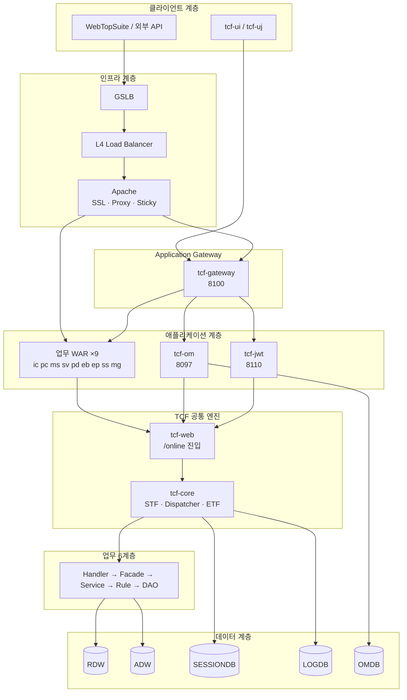

# 01. 전체 시스템 아키텍처

> **범위:** NSIGHT TCF Framework 전체 논리·물리 구조, 비기능 목표, 아키텍처 원칙  
> **관련:** [zman/03-전체아키텍처.md](../zman/03-전체아키텍처.md) · [docs/architecture/architecture.md](../docs/architecture/architecture.md)

---

## 1. 문서 개요

### 1.1 목적

NSIGHT 마케팅 플랫폼의 **End-to-End 아키텍처**를 정의한다. 클라이언트 요청이 인프라 계층을 거쳐 업무 WAR, TCF 엔진, 데이터 계층까지 도달하는 전체 경로와 각 계층의 책임·경계를 명시한다.

### 1.2 시스템 정의

NSIGHT TCF Framework는 마케팅 업무를 **표준 HTTP/JSON 전문(StandardRequest/StandardResponse)** 으로 처리하는 **Transaction Control Framework(TCF)** 기반 멀티 모듈 시스템이다.

| 항목 | 값 |
|------|-----|
| 저장소 | `nsight-tcf-framework` (Gradle 멀티 모듈) |
| Java | 21 |
| Framework | Spring Boot 3.3 |
| 빌드 | Gradle 8.x |
| ORM | MyBatis |
| 로컬 DB | H2 (Oracle MODE) |
| 캐시 | EhCache 3 (JCache) |

---

## 2. 비기능 목표 (NFR)

설계서 기준 목표치 (운영 환경 설계 참고):

| 지표 | 목표 |
|------|------|
| 동시 사용자 | 36,000 |
| 동시 세션 | 43,200 |
| TPS | 720 |
| P95 응답 | 3초 이내 |
| 가용성 | 99.99% |

성능·용량 달성 수단:

- HikariCP Connection Pool로 DB 자원 통제
- Online Timeout + Query Timeout 다층 (→ [10-거래통제-Timeout-로깅-아키텍처.md](./10-거래통제-Timeout-로깅-아키텍처.md))
- 기준정보 Cache (→ [11-캐시-아키텍처.md](./11-캐시-아키텍처.md))
- RDW/ADW 역할 분리 (→ [09-데이터-DB-아키텍처.md](./09-데이터-DB-아키텍처.md))

---

## 3. 논리 아키텍처

### 3.1 End-to-End 흐름



### 3.2 단일 거래 처리 경로 (온라인)

모든 업무·OM·JWT 온라인 거래는 **동일한 TCF 파이프라인**을 따른다.

```
POST /{businessCode}/online
  Content-Type: application/json
  Cookie: JSESSIONID=... (세션 거래)
  Body: StandardRequest { header, body }
```

```
① HTTP 수신          tcf-web — OnlineTransactionController
② TCF.process()      tcf-core
   ②-a STF.preProcess     Header·GUID·세션·권한·거래통제·Timeout·PROCESSING 로그
   ②-b TimeoutExecutor    OnlineTransactionTimeoutExecutor
   ②-c Dispatcher           header.serviceId → TransactionHandler
   ②-d Handler.doHandle()   업무 6계층
   ②-e ETF.postProcess()    StandardResponse·로그 종료·감사
③ JSON 응답           StandardResponse
```

**핵심 설계 결정:** URL마다 Controller를 추가하지 않는다. **serviceId**가 실행 키이다.

---

## 4. 물리·배포 아키텍처

### 4.1 배포 모드 3단계

| 모드 | 용도 | 특징 |
|------|------|------|
| **bootRun** | 개발자 PC | 모듈별 JVM·포트 분리 (8082~8110) |
| **ztomcat** | 통합 검증 | Tomcat 8080, 다중 Context (/ic, /sv, /gw, /ui …) |
| **운영 Tomcat** | Production | 17 WAR 목표, Apache 앞단, Gateway 선택 |

### 4.2 WAR 패키징 원칙

- 각 업무 WAR·플랫폼 WAR는 `WEB-INF/lib`에 **tcf-* JAR를 내장**
- 공통 라이브러리(tcf-util, tcf-core, tcf-web)는 **transitive dependency**로 포함
- WAR 간 **Java 클래스 직접 참조 금지** → HTTP/tcf-eai

### 4.3 로컬 bootRun 포트 맵

| 업무/모듈 | 포트 | Context | WAR |
|-----------|------|---------|-----|
| ic-service | 8082 | /ic | ic.war |
| pc-service | 8083 | /pc | pc.war |
| ms-service | 8085 | /ms | ms.war |
| sv-service | 8086 | /sv | sv.war |
| pd-service | 8087 | /pd | pd.war |
| eb-service | 8089 | /eb | eb.war |
| ep-service | 8090 | /ep | ep.war |
| ss-service | 8093 | /ss | ss.war |
| mg-service | 8096 | /mg | mg.war |
| tcf-om | 8097 | /om | om.war |
| tcf-batch | 8098 | /batch | tcf-batch.war |
| tcf-ui | 8099 | / | tcf-ui.jar |
| tcf-gateway | 8100 | / | gw.war |
| tcf-uj | 8102 | / | tcf-uj.jar |
| tcf-jwt | 8110 | / | jwt.war |
| ztomcat | 8080 | 다중 | 통합 |

---

## 5. 모듈 영역 구분

### 5.1 6영역 모델

```
┌─────────────────────────────────────────────────────────┐
│ ① 공통 Framework    tcf-util, tcf-core, tcf-web, tcf-cache │
├─────────────────────────────────────────────────────────┤
│ ② 업무 Domain WAR   ic, pc, ms, sv, pd, eb, ep, ss, mg   │
├─────────────────────────────────────────────────────────┤
│ ③ 운영 OM           tcf-om (Catalog·통제·세션·Admin)      │
├─────────────────────────────────────────────────────────┤
│ ④ Gateway·JWT·EAI   tcf-gateway, tcf-jwt, tcf-eai        │
├─────────────────────────────────────────────────────────┤
│ ⑤ Batch·UI          tcf-batch, tcf-ui, tcf-uj            │
├─────────────────────────────────────────────────────────┤
│ ⑥ 배포·환경         tcf-cicd, tcf-scripts, ztomcat       │
└─────────────────────────────────────────────────────────┘
```

### 5.2 의존 방향 (단방향)

```
tcf-util
  └── tcf-core
        └── tcf-web
              ├── tcf-cache (선택)
              ├── 업무 WAR ×9
              ├── tcf-om
              ├── tcf-jwt
              └── tcf-batch

tcf-eai ──→ (업무 WAR에 implementation, ic/sv 등)
tcf-gateway ──→ (독립 WAR, downstream HTTP)
tcf-ui / tcf-uj ──→ (독립 JAR, Relay HTTP)
```

**금지:** 업무 WAR ↔ 업무 WAR Java import, tcf-core → 업무 WAR 역방향

---

## 6. 계층별 책임

| 계층 | 구성요소 | 책임 |
|------|----------|------|
| **Edge** | GSLB, L4, Apache | SSL 종료, VIP, Reverse Proxy, Sticky Session, Access Log |
| **Application Gateway** | tcf-gateway | businessCode 라우팅, SESSIONDB 4단계 검증, Cookie Relay, Gateway TX Log |
| **Web Container** | Tomcat / Spring Boot | Servlet, Session Cookie, JDBC Session Filter |
| **HTTP 진입** | tcf-web | `POST /online`, GlobalStandardExceptionHandler |
| **TCF Engine** | tcf-core | STF, Dispatcher, Timeout, ETF |
| **업무** | Handler~DAO | 도메인 로직, MyBatis SQL |
| **운영** | tcf-om | Catalog, 거래통제, Timeout, 사용자·권한, Admin API |
| **인증(선택)** | tcf-jwt | RS256 JWT 발급·갱신·폐기 (Gateway 세션과 별도 경로) |
| **연동** | tcf-eai | WAR 간 HTTP/JSON + serviceId |
| **채널** | tcf-ui, tcf-uj | 브라우저 테스트·OM Admin Relay |
| **수집** | tcf-batch | AP/DB/세션/배포 Dashboard 수집 |

---

## 7. Gateway vs TCF Dispatcher

두 라우팅 메커니즘은 **서로 다른 계층**에서 동작한다.

| | tcf-gateway | TransactionDispatcher |
|---|-------------|----------------------|
| **키** | businessCode (Path/Header) | serviceId |
| **위치** | Apache 뒤, WAR 앞 | WAR 내부 STF 뒤 |
| **역할** | Target WAR 선택·Relay | Handler Bean 선택 |
| **설정** | TCF_GATEWAY_ROUTE | Spring `@Component` Handler Registry |

예: `POST /8100/sv/online` + `header.serviceId=SV.Customer.selectSummary`

1. Gateway → `http://127.0.0.1:8086/sv/online` Relay
2. sv-service TCF → STF → Dispatcher → `SvCustomerHandler`

---

## 8. 데이터 아키텍처 개요

| DB (논리) | 용도 | 로컬(H2) |
|-----------|------|----------|
| **RDW** | 실시간 조회·Single View | 업무 WAR별 schema |
| **ADW** | 분석·집계 (온라인 분리) | (목표) |
| **SESSIONDB** | Spring Session JDBC, TCF_USER_SESSION | tcf-om H2 공유 |
| **OMDB** | 사용자·Catalog·통제·코드 | nsight_om |
| **LOGDB** | TCF_TX_LOG, OM_AUDIT_LOG | nsight-txlog |
| **Gateway DB** | TCF_GATEWAY_ROUTE, TCF_GATEWAY_TX_LOG | gateway-route |
| **JWT DB** | Token·Refresh·Denylist | tcf-jwt schema |

상세: [09-데이터-DB-아키텍처.md](./09-데이터-DB-아키텍처.md)

---

## 9. 아키텍처 원칙 (ADR 요약)

| # | 원칙 | 근거 |
|---|------|------|
| 1 | **표준 전문 + serviceId Dispatcher** | URL 기반 업무 분기 제거, OM Catalog 연계 |
| 2 | **공통 STF/ETF, 업무 Handler만 분리** | 검증·로그·응답 표준화 |
| 3 | **WAR 간 HTTP/JSON (tcf-eai)** | 배포·장애 격리, MSA 준비 |
| 4 | **OM = 운영 기준정보 원장** | Catalog·통제·Timeout 단일 출처 |
| 5 | **SESSIONDB = 세션 원천** | 다중 WAR·Gateway 세션 공유 |
| 6 | **Gateway = Relay + 관문** | L4/Apache 대체 ❌, Cookie 전달 ✅ |
| 7 | **Handler = 도메인당 1개** | serviceIds() + switch (코드베이스 2026-07) |

---

## 10. 채널별 진입 경로

### 10.1 tcf-ui (직접 Relay)

```
브라우저 → tcf-ui:8099/api/relay/{code}/online → 업무 WAS 직접
```

- 개발·단순 테스트용
- Gateway·세션 관문 **미경유**

### 10.2 tcf-uj (Gateway 경유)

```
브라우저 → tcf-uj:8102/api/relay/{code}/online
         → tcf-gateway:8100/{code}/online
         → downstream WAS
```

- 운영형 UI·세션·Gateway 검증
- `/api/updownload/*`만 tcf-om 직접

상세: [13-UI-채널-아키텍처.md](./13-UI-채널-아키텍처.md)

---

## 11. 현재 vs 목표

| 항목 | 현재(develop) | 목표(설계서) |
|------|---------------|--------------|
| 업무 WAR | 9 (ic~mg) | 17 |
| OM Handler | 24 (도메인 통합) | 동일 패턴 확장 |
| om-service | 레거시 | tcf-om만 사용 |
| CC, BC, CM … | 미구현 | Gateway Route 예비 |

Gap 상세: [zman/23-소스Gap분석.md](../zman/23-소스Gap분석.md)

---

## 12. 관련 문서

| 문서 | 내용 |
|------|------|
| [02-TCF-프레임워크-아키텍처.md](./02-TCF-프레임워크-아키텍처.md) | STF/Dispatcher/ETF |
| [04-업무-도메인-서비스-아키텍처.md](./04-업무-도메인-서비스-아키텍처.md) | 9 WAR |
| [16-모듈-포트-의존성-레퍼런스.md](./16-모듈-포트-의존성-레퍼런스.md) | 전체 매핑 |
| [zguide/README.md](../zguide/README.md) | 개발자 가이드 |
| [zman/04-모듈구성.md](../zman/04-모듈구성.md) | 모듈 트리 |

---

← [README](./README.md) · [02-TCF-프레임워크 →](./02-TCF-프레임워크-아키텍처.md)
