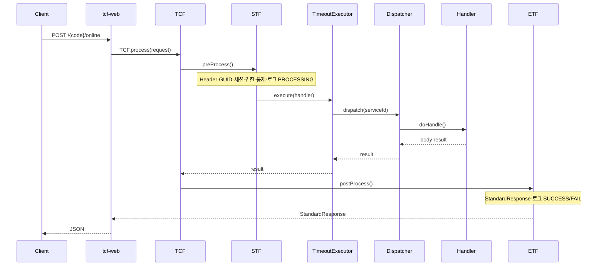

# 02. TCF 프레임워크 아키텍처

> **범위:** tcf-util, tcf-core, tcf-web — TCF 엔진·HTTP 진입·표준 전문  
> **관련:** [zman/05-TCF처리구조.md](../zman/05-TCF처리구조.md) · [zman/06-표준전문구조.md](../zman/06-표준전문구조.md) · [zguide/tcf-core-개발가이드.md](../zguide/tcf-core-개발가이드.md)

---

## 1. 개요

TCF(Transaction Control Framework)는 NSIGHT 모든 온라인 거래의 **공통 실행 엔진**이다. 업무 WAR·tcf-om·tcf-jwt는 TCF 파이프라인 위에서 `TransactionHandler`만 구현한다.

### 1.1 모듈 구성

| 모듈 | 유형 | 역할 |
|------|------|------|
| **tcf-util** | JAR | 순수 Java 유틸 (Spring 비의존) |
| **tcf-core** | JAR | STF/TCF/ETF, Dispatcher, 표준 전문, 거래통제·Timeout |
| **tcf-web** | JAR | HTTP `/online` 진입, AutoConfiguration, WAR Bootstrap |

의존: `tcf-util` ← `tcf-core` ← `tcf-web` ← 업무 WAR

---

## 2. TCF 처리 파이프라인

### 2.1 전체 시퀀스



### 2.2 컴포넌트 책임

| 컴포넌트 | 패키지 | 책임 |
|----------|--------|------|
| `OnlineTransactionController` | tcf-web | HTTP 수신, TCF 위임 |
| `TCF` | tcf-core/processor | process() 오케스트레이션 |
| `STF` | tcf-core/processor | 전처리 13단계 |
| `OnlineTransactionTimeoutExecutor` | tcf-core/timeout | 거래 전체 시간 제한 |
| `TransactionDispatcher` | tcf-core/dispatch | serviceId → Handler |
| `TransactionHandler` | tcf-core/transaction | 업무 진입 (업무 WAR 구현) |
| `ETF` | tcf-core/processor | 후처리·응답 조립 |
| `GlobalStandardExceptionHandler` | tcf-web | HTTP 예외 → StandardResponse |

---

## 3. STF (Standard Transaction Front) 전처리

STF는 업무 실행 **전** 공통 통제를 수행한다. 업무 Handler는 STF 결과를 신뢰하고 Facade만 호출한다.

### 3.1 처리 단계

| # | 단계 | 설명 | 실패 코드 예 |
|---|------|------|-------------|
| 1 | StandardRequest 파싱 | header + body | E-TCF-MSG-* |
| 2 | Header 필수 검증 | businessCode, serviceId, … | E-TCF-HDR-* |
| 3 | GUID / TraceId | correlation id 생성·검증 | |
| 4 | MDC 설정 | 로그 correlation | |
| 5 | 세션 검증 | Cookie → SESSIONDB | E-TCF-SES-* |
| 6 | 인증 | user 존재 | |
| 7 | 권한 | 기능권한 (OM) | E-TCF-AUTH-* |
| 8 | **거래통제** | Header 7 Allow-List | E-TCF-CTL-* |
| 9 | Idempotency | 중복 요청 방지 | |
| 10 | Timeout 정책 | serviceId별 timeout 조회 | |
| 11 | 감사 대상 판단 | OM_AUDIT_POLICY | |
| 12 | **TCF_TX_LOG INSERT** | status=PROCESSING | |
| 13 | TransactionContext 저장 | ThreadLocal | |

구현: `STF.java`, `StandardHeaderValidator`, `SessionValidator`, `AuthorizationValidator`, `TransactionControlService`

### 3.2 TransactionContext

```java
TransactionContextHolder.getContext()
  .getHeader()      // StandardHeader
  .getGuid()        // 거래 GUID
  .getUserId()      // 세션 user
  .getSessionId()   // JSESSIONID
  .getTimeoutMs()   // 적용 timeout
```

Handler·Facade·Service 전 구간에서 context 참조.

---

## 4. 표준 전문 (StandardRequest/Response)

### 4.1 StandardRequest

```json
{
  "header": {
    "businessCode": "SV",
    "serviceId": "SV.Customer.selectSummary",
    "transactionCode": "SV-CUS-0001",
    "serviceName": "고객요약조회",
    "user": "admin01",
    "channelId": "WEBTOP",
    "branch": "001",
    "guid": "...",
    "traceId": "..."
  },
  "body": {
    "customerId": "C001"
  }
}
```

### 4.2 StandardResponse

```json
{
  "header": {
    "businessCode": "SV",
    "serviceId": "SV.Customer.selectSummary",
    "resultCode": "SUCCESS",
    "errorCode": null,
    "message": "정상 처리",
    "responseTime": "20260704153000",
    "elapsedTimeMs": 42
  },
  "body": { ... }
}
```

### 4.3 serviceId 명명 규칙

```
{BusinessCode}.{Domain}.{action}
예: SV.Customer.selectSummary
    OM.Auth.login
    JWT.Auth.refresh
```

상세: [zdoc/전문관리.md](../zdoc/전문관리.md) · [zman/06-표준전문구조.md](../zman/06-표준전문구조.md)

---

## 5. TransactionDispatcher

### 5.1 라우팅 원칙

- **URL 라우팅 ❌** — `/online`은 공통 Controller 하나
- **serviceId 라우팅 ✅** — `header.serviceId`가 유일한 실행 키
- Spring `@Component` Handler 자동 등록
- `serviceIds()` Collection → Registry Map
- **중복 serviceId** → 기동 실패 (Fail-Fast)

### 5.2 Handler 등록 패턴 (코드베이스)

```java
@Component
public class SvCustomerHandler implements TransactionHandler {
    @Override
    public Collection<String> serviceIds() {
        return List.of("SV.Customer.selectSummary");
    }
    @Override
    public Object doHandle(StandardRequest<Map<String, Object>> req, TransactionContext ctx) {
        return switch (ctx.getHeader().getServiceId()) {
            case "SV.Customer.selectSummary" -> facade.selectCustomerSummary(req.getBody(), ctx);
            default -> throw new BusinessException(ErrorCode.SERVICE_NOT_FOUND, ...);
        };
    }
}
```

> 설계서(docx): serviceId당 1 Handler 클래스 → **코드: 도메인당 1 Handler**, switch 분기

---

## 6. ETF (End Transaction Front) 후처리

| # | 단계 | 설명 |
|---|------|------|
| 1 | Result 조립 | SUCCESS / FAIL / TIMEOUT |
| 2 | errorCode | OM_ERROR_CODE 연계 |
| 3 | message | 사용자 메시지 |
| 4 | header echo | responseTime, elapsedTimeMs |
| 5 | body | 업무 결과 또는 null |
| 6 | 마스킹 | 민감정보 |
| 7 | TCF_TX_LOG UPDATE | PROCESSING → SUCCESS/FAIL/TIMEOUT |
| 8 | OM_AUDIT_LOG | 감사 대상 시 |
| 9 | Metrics | (선택) |

---

## 7. 오류 처리

| 유형 | 발생 위치 | 처리 |
|------|-----------|------|
| Header 검증 | STF | E-TCF-HDR-*, ETF systemFail |
| BusinessException | Handler~Service | ETF businessFail, OM errorCode |
| System Exception | Any | ETF systemError |
| Timeout | TimeoutExecutor | TIMEOUT, E-TCF-TIME-* |
| Integration | tcf-eai | E-TCF-IF-* |

거래 상태: `PROCESSING` → `SUCCESS` | `FAIL` | `TIMEOUT` | `UNKNOWN`

---

## 8. tcf-web — HTTP 진입 계층

### 8.1 OnlineTransactionController

```java
@PostMapping("/online")
public StandardResponse<?> online(@RequestBody StandardRequest<?> request) {
    return tcf.process(request);
}
```

Context path: `/{businessCode}` → 실제 URL `POST /sv/online`

### 8.2 NsightWarBootstrap

업무 WAR Application 클래스가 상속:

```java
@SpringBootApplication
public class NsightSvServiceApplication extends NsightWarBootstrap { }
```

- tcf-web AutoConfiguration 자동 로드
- Context path, DataSource, Session 설정

### 8.3 거래 로그 (tcf-web)

- `TransactionLogService` — TCF_TX_LOG JDBC
- STF INSERT → ETF UPDATE
- LOGDB (로컬: `data/nsight-txlog`)

---

## 9. tcf-util

Spring 비의존 순수 유틸:

- 날짜·문자열·Map 변환
- tcf-core·업무 WAR 공통 사용
- **역방향 의존 금지**

---

## 10. 확장 포인트

| 확장 | 방법 |
|------|------|
| 신규 serviceId | Handler + Catalog + TC + Timeout |
| STF 단계 추가 | tcf-core STF (플랫폼만) |
| 커스텀 Validator | tcf-core validation 패키지 |
| AOP | tcf-web / 업무 Facade (@Transactional 외) |

AOP 상세: [zdoc/AOP.md](../zdoc/AOP.md) · [docs/architecture/32-AOP.md](../docs/architecture/32-AOP.md)

---

## 11. 관련 문서

| | |
|---|---|
| [03-애플리케이션-6계층-아키텍처.md](./03-애플리케이션-6계층-아키텍처.md) | Handler 이후 |
| [10-거래통제-Timeout-로깅-아키텍처.md](./10-거래통제-Timeout-로깅-아키텍처.md) | STF 8·10·12 |
| [docs/architecture/33-TCF.md](../docs/architecture/33-TCF.md) | TCF 상세 |
| [docs/architecture/34-STF.md](../docs/architecture/34-STF.md) | STF 상세 |
| [docs/architecture/36-ETF.md](../docs/architecture/36-ETF.md) | ETF 상세 |

---

← [01-전체-시스템](./01-전체-시스템-아키텍처.md) · [03-6계층 →](./03-애플리케이션-6계층-아키텍처.md)
