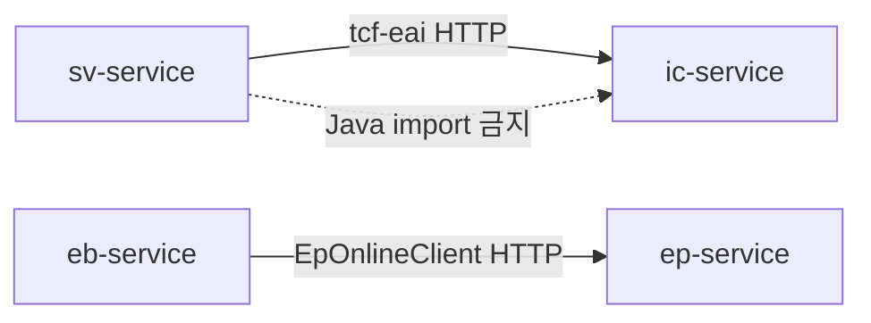

# 04. 업무 도메인 서비스 아키텍처

> **범위:** ic, pc, ms, sv, pd, eb, ep, ss, mg — 9개 업무 WAR  
> **관련:** [zguide/](../zguide/) 업무별 개발가이드 · [zman/22-업무서비스샘플.md](../zman/22-업무서비스샘플.md)

---

## 1. 개요

NSIGHT 업무 도메인은 **독립 Spring Boot WAR** 9개로 구성된다. 각 WAR는 동일 TCF 패턴·6계층 구조를 공유하며, **businessCode**와 **Context path**로 식별된다.

### 1.1 업무 WAR 맵

| WAR | 업무코드 | Context | 포트 | 도메인 | Handler 수 |
|-----|----------|---------|------|--------|------------|
| ic-service | IC | /ic | 8082 | Individual Customer | 2 |
| pc-service | PC | /pc | 8083 | Private Customer | 1 |
| ms-service | MS | /ms | 8085 | Marketing Strategy | 1 |
| sv-service | SV | /sv | 8086 | Single View | 3 |
| pd-service | PD | /pd | 8087 | Product | 1 |
| eb-service | EB | /eb | 8089 | Event Bridge | 4 |
| ep-service | EP | /ep | 8090 | Event Processing | 2 |
| ss-service | SS | /ss | 8093 | Self Service | 1 |
| mg-service | MG | /mg | 8096 | Marketing Gateway | 1 |

**레거시:** om-service → **tcf-om** 사용 ([05-운영관리-OM](./05-운영관리-OM-아키텍처.md))

---

## 2. 공통 아키텍처

### 2.1 의존성 (build.gradle)

```gradle
implementation project(':tcf-util')
implementation project(':tcf-core')
implementation project(':tcf-web')
// 연동 WAR만:
implementation project(':tcf-eai')   // ic, sv
```

### 2.2 API 계약

| 항목 | 값 |
|------|-----|
| Method | POST |
| Path | `/{businessCode}/online` |
| Content-Type | application/json |
| Request | StandardRequest |
| Response | StandardResponse |

### 2.3 부트스트랩

```java
@SpringBootApplication
public class NsightSvServiceApplication extends NsightWarBootstrap { }
```

- tcf-web AutoConfiguration 자동 적용
- `server.servlet.context-path: /sv` (application.yml)

---

## 3. 도메인별 상세

### 3.1 ic-service — Individual Customer (8082)

**역할:** 개인고객 조회·관리. SV 등 타 WAR의 **tcf-eai 연동 대상**.

| Handler | serviceId |
|---------|-----------|
| IcSampleHandler | IC.Sample.inquiry |
| IcCustomerHandler | IC.Customer.inquiry |

**연동:** SV → IC (`SV.Integration.icSample` → `IC.Sample.inquiry`)

가이드: [zguide/ic-service-개발가이드.md](../zguide/ic-service-개발가이드.md)

---

### 3.2 pc-service — Private Customer (8083)

**역할:** 고객(PC) 도메인 샘플 WAR.

| Handler | serviceId |
|---------|-----------|
| PcSampleHandler | PC.Sample.inquiry |

가이드: [zguide/pc-service-개발가이드.md](../zguide/pc-service-개발가이드.md)

---

### 3.3 ms-service — Marketing Strategy (8085)

**역할:** 마케팅 전략(MS) 도메인.

| Handler | serviceId |
|---------|-----------|
| MsSampleHandler | MS.Sample.inquiry |

가이드: [zguide/ms-service-개발가이드.md](../zguide/ms-service-개발가이드.md)

---

### 3.4 sv-service — Single View (8086) ★ 핵심 샘플

**역할:** 고객 Single View. **페이징·tcf-eai 연동·고객요약** 레퍼런스 WAR.

| Handler | serviceId | Facade |
|---------|-----------|--------|
| SvSampleHandler | SV.Sample.inquiry | SvSampleFacade |
| SvCustomerHandler | SV.Customer.selectSummary | SvCustomerFacade |
| SvIntegrationHandler | SV.Integration.icSample | SvIntegrationFacade |

**특징:**
- `tcf-eai` 의존 — IC WAR HTTP 호출
- 페이징 샘플: `/sv/sample-list.html`
- Catalog·거래통제 seed 필수

가이드: [zguide/sv-service-개발가이드.md](../zguide/sv-service-개발가이드.md) · [zdoc/SV고객요약샘플.md](../zdoc/SV고객요약샘플.md)

---

### 3.5 pd-service — Product (8087)

| Handler | serviceId |
|---------|-----------|
| PdSampleHandler | PD.Sample.inquiry |

가이드: [zguide/pd-service-개발가이드.md](../zguide/pd-service-개발가이드.md)

---

### 3.6 eb-service — Event Bridge (8089)

**역할:** 이벤트 Outbox — 사용자·이벤트 등록 후 EP로 비동기 발행.

```
EB.User.create → EB_USER + EB_EVENT(READY)
EbEventPublishScheduler → POST ep-service EP.UserEvent.receive
→ EB_EVENT = SENT | FAIL
```

| Handler | serviceId | transactionCode |
|---------|-----------|-----------------|
| EbSampleHandler | EB.Sample.inquiry | EB-INQ-0001 |
| EbUserHandler | EB.User.inquiry, EB.User.create | EB-USR-* |
| EbEventHandler | EB.Event.inquiry | EB-EVT-0001 |
| EbBatchHandler | EB.Batch.inquiry | EB-BAT-0001 |

**테이블:** EB_USER, EB_EVENT  
**Client:** EpOnlineClient (HTTP, tcf-eai 대신 전용 Client)

상세: [14-이벤트-연계-아키텍처.md](./14-이벤트-연계-아키텍처.md)

---

### 3.7 ep-service — Event Processing (8090)

**역할:** EB 배치가 전달한 이벤트 수신·저장.

| Handler | serviceId |
|---------|-----------|
| EpSampleHandler | EP.Sample.inquiry |
| EpUserEventHandler | EP.UserEvent.inquiry, EP.UserEvent.receive |

**테이블:** EP_USER_EVENT

---

### 3.8 ss-service — Self Service (8093)

| Handler | serviceId |
|---------|-----------|
| SsSampleHandler | SS.Sample.inquiry |

---

### 3.9 mg-service — Marketing Gateway (8096)

| Handler | serviceId |
|---------|-----------|
| MgSampleHandler | MG.Sample.inquiry |

> **주의:** mg-service(업무) ≠ tcf-gateway(인프라 Gateway)

---

## 4. WAR 간 경계 원칙



| 허용 | 금지 |
|------|------|
| tcf-eai `TcfServiceClient.call()` | WAR A imports WAR B class |
| HTTP POST /{code}/online | 공유 DB 직접 쓰기 (업무 간) |
| Header propagation (GUID, user) | 동일 serviceId 중복 등록 |

---

## 5. Gateway 등록

로컬 bootRun 시 tcf-gateway H2 seed에 등록:

| BC | Target URL |
|----|------------|
| IC | http://127.0.0.1:8082/ic/online |
| SV | http://127.0.0.1:8086/sv/online |
| EB | http://127.0.0.1:8089/eb/online |
| … | … |

미등록 BC → tcf-uj Relay 404

---

## 6. 배포·빌드

```bash
gradle :sv-service:bootWar          # sv.war
tcf-scripts/build.bat wars            # 9 + tcf-om
ztomcat/deploy-wars.bat sv ic        # 8080/sv, /ic
```

CI/CD: [15-배포-환경-CICD-아키텍처.md](./15-배포-환경-CICD-아키텍처.md)

---

## 7. 목표 확장 (17 WAR)

설계서 목표 업무 (미구현): CC, BC, CM, BP, BD, CS, CT …

Gateway Route·BusinessModuleDefinitions에 예비 코드 존재.

---

## 8. 관련 문서

| WAR | zguide | zman |
|-----|--------|------|
| sv | [sv-service-개발가이드](../zguide/sv-service-개발가이드.md) | [22-업무샘플](../zman/22-업무서비스샘플.md) |
| ic | [ic-service-개발가이드](../zguide/ic-service-개발가이드.md) | |
| eb/ep | [eb](../zguide/eb-service-개발가이드.md), [ep](../zguide/ep-service-개발가이드.md) | |

---

← [03-6계층](./03-애플리케이션-6계층-아키텍처.md) · [05-OM →](./05-운영관리-OM-아키텍처.md)
