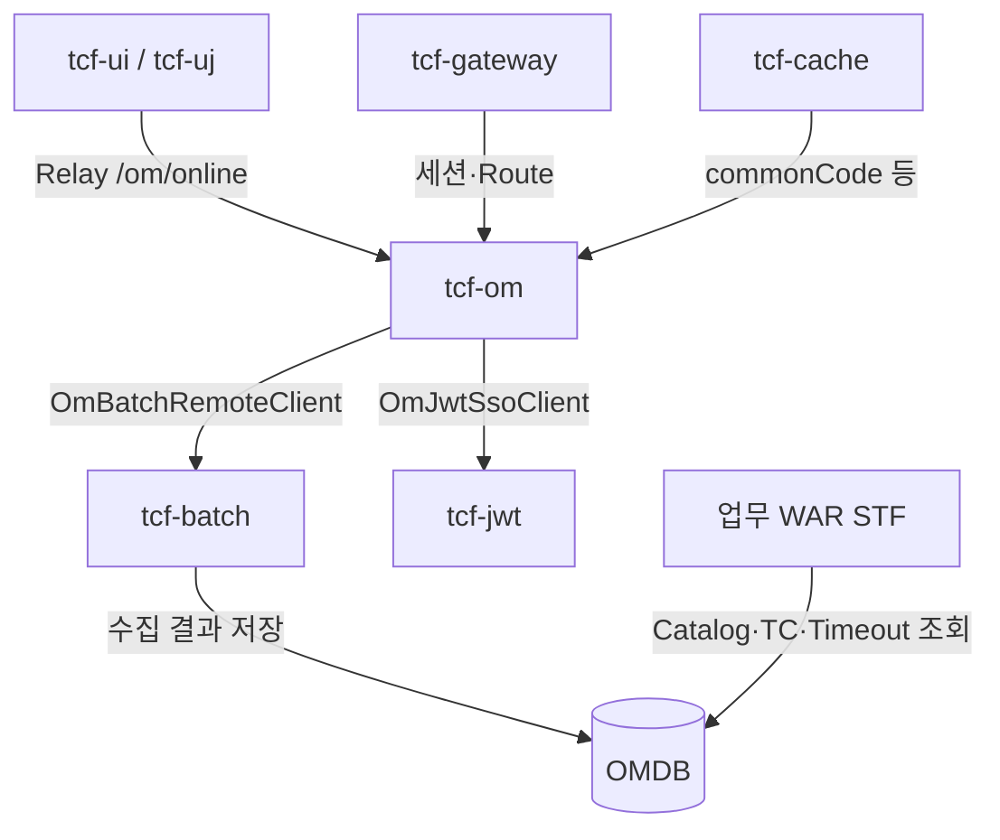

# 05. 운영관리 OM 아키텍처

> **범위:** tcf-om — 운영 기준정보 원장, Admin API, Catalog·통제·세션  
> **관련:** [zman/12-OM운영관리.md](../zman/12-OM운영관리.md) · [zguide/tcf-om-개발가이드.md](../zguide/tcf-om-개발가이드.md)

---

## 1. 개요

### 1.1 OM의 위치

> **OM = 운영 기준정보 원장 (System of Record for Operations)**

| 담당 | 비담당 |
|------|--------|
| 사용자·권한·메뉴 | 업무 도메인 로직 |
| ServiceId Catalog | 실시간 마케팅 처리 |
| 거래통제·Timeout·ErrorCode | |
| 세션 레지스트리 (TCF_USER_SESSION) | |
| 거래·감사 로그 조회 | |
| Cache·Batch·Deploy·Dashboard | |
| 파일 업·다운로드 (UD) | |

| 항목 | 값 |
|------|-----|
| 모듈 | tcf-om |
| 업무코드 | OM |
| 포트 | 8097 |
| Context | /om |
| WAR | om.war / tcf-om.war |

**레거시 om-service:** Gradle·CI 미포함, 샘플만 — **tcf-om만 사용**

---

## 2. 처리 아키텍처

```
POST /om/online
  header.serviceId = OM.{Domain}.{action}
→ TCF (STF/ETF 동일)
→ Om{Domain}Handler
→ Om{Domain}Facade (@Transactional)
→ Service → Rule → DAO
→ OMDB (H2: nsight_om)
```

OM Admin UI (tcf-ui/tcf-uj)는 **Relay**로 동일 API 호출.

---

## 3. Handler 24개 (도메인 통합)

설계서 83 Handler → **코드 24 Handler** (도메인당 1개, serviceIds + switch)

| Handler | serviceId prefix | 영역 |
|---------|------------------|------|
| OmAuthHandler | OM.Auth.* | login, logout, ssoLogin |
| OmUserHandler | OM.User.* | 사용자 CRUD |
| OmAuthGroupHandler | OM.AuthGroup.* | 권한그룹 |
| OmAuthHistoryHandler | OM.AuthHistory.* | 권한 이력 |
| OmMenuHandler | OM.Menu.* | 메뉴 |
| OmFunctionAuthHandler | OM.FunctionAuth.* | 기능권한 |
| OmDataAuthHandler | OM.DataAuth.* | 데이터권한 |
| OmServiceCatalogHandler | OM.ServiceCatalog.* | **ServiceId Catalog** |
| OmTransactionControlHandler | OM.TransactionControl.* | **거래통제** |
| OmTimeoutPolicyHandler | OM.TimeoutPolicy.* | Timeout 정책 |
| OmCommonCodeHandler | OM.CommonCode.* | 공통코드 |
| OmErrorCodeHandler | OM.ErrorCode.* | 오류코드 |
| OmTransactionLogHandler | OM.TransactionLog.* | 거래로그 조회 |
| OmAuditLogHandler | OM.AuditLog.* | 감사로그 |
| OmSessionHandler | OM.Session.* | 세션 관리 |
| OmBatchHandler | OM.Batch.* | 배치 Job 관리 |
| OmDeployHandler | OM.Deploy.* | 배포 현황 |
| OmFileDownloadHandler | OM.File.* | 파일·UD |
| OmCacheHandler | OM.Cache.* | Cache 관리 |
| OmSystemConfigHandler | OM.SystemConfig.* | 환경설정 |
| OmDashboardHandler | OM.Dashboard.* | 대시보드 |
| OmHealthCheckHandler | OM.HealthCheck.* | 헬스 |
| OmMessageStructureHandler | OM.MessageStructure.* | 전문 조립 |
| OmSampleHandler | OM.Sample.* | 샘플 |

경로: `tcf-om/.../marketing/om/entry/handler/`

---

## 4. Catalog · Seed 아키텍처

### 4.1 OM_SERVICE_CATALOG

업무·OM 모든 serviceId의 **마스터 레지스트리**.

| 컬럼 | 역할 |
|------|------|
| SERVICE_ID | PK |
| BUSINESS_CODE | SV, IC, OM, … |
| HANDLER_CLASS | SvCustomerHandler |
| SERVICE_NAME | 표시명 |
| USE_YN | 사용 여부 |

### 4.2 Seed 데이터

| 파일 | 역할 |
|------|------|
| `tcf-om/src/main/resources/data.sql` | 초기 Catalog·TC·Timeout |
| `ServiceCatalogSeedData.java` | 프로그램 seed |

**신규 업무 serviceId 절차:**

1. Catalog INSERT  
2. TCF_TRANSACTION_CONTROL (Allow-List)  
3. TCF_SERVICE_TIMEOUT_POLICY  
4. OM_ERROR_CODE (필요 시)  
5. 기능·데이터 권한 (필요 시)

---

## 5. OM Admin UI 아키텍처

tcf-ui(8099) / tcf-uj(8102)에서 Relay:

| 화면 | 경로 | OM serviceId 예 |
|------|------|-----------------|
| 로그인 | /om/admin/login.html | OM.Auth.login |
| 대시보드 | /om/admin/dashboard.html | OM.Dashboard.* |
| ServiceId | /om/admin/service-catalog.html | OM.ServiceCatalog.* |
| 거래통제 | (user-auth 등) | OM.TransactionControl.* |
| 거래로그 | /om/admin/transaction-log.html | OM.TransactionLog.* |
| Cache | /om/admin/cache.html | OM.Cache.* |
| 세션 | /om/admin/session.html | OM.Session.* |
| 배치 | /om/admin/batch.html | OM.Batch.* |

테스트 계정: `admin01` / `nsight01!`

공통 JS: `_shared/om-admin.js` — `relayFetch()`, `uiPath()`

---

## 6. 연계 모듈



| 모듈 | 연계 |
|------|------|
| tcf-batch | Dashboard AP/DB/세션/배포 수집 → OM 테이블 |
| tcf-jwt | SSO Issue (`JWT.Auth.ssoIssue`) |
| tcf-gateway | SESSIONDB, TCF_USER_SESSION |
| tcf-cache | 공통코드·Catalog 캐시 |
| 업무 STF | Catalog·TC·Timeout **조회** (Allow-List) |

---

## 7. UD (파일 업·다운로드)

- `OmUpdownloadFileController` — `/ud` REST (Gateway 미경유)
- tcf-ui/tcf-uj: `/api/updownload/*` → tcf-om 직접
- 테이블: UD_FILE, UD_DOWNLOAD_LOG

상세: [zman/18-파일업다운로드.md](../zman/18-파일업다운로드.md)

---

## 8. 의존성

```gradle
tcf-util, tcf-core, tcf-web, tcf-cache
Spring Session JDBC, MyBatis
```

---

## 9. DB (OMDB)

주요 테이블: OM_USER, OM_MENU, OM_FUNCTION_AUTH, OM_DATA_AUTH, OM_COMMON_CODE, OM_ERROR_CODE, OM_SYSTEM_CONFIG, OM_SERVICE_CATALOG, TCF_TRANSACTION_CONTROL, TCF_SERVICE_TIMEOUT_POLICY, TCF_USER_SESSION, OM_BATCH_*, OM_*_STATUS (Dashboard)

상세: [09-데이터-DB-아키텍처.md](./09-데이터-DB-아키텍처.md)

---

## 10. 운영 절차 (신규 serviceId)

```
Catalog 등록 → 거래통제 → Timeout → ErrorCode → (권한·감사)
```

각 단계 OM Admin UI 또는 data.sql seed.

---

## 11. 관련 문서

| | |
|---|---|
| [10-거래통제-Timeout-로깅](./10-거래통제-Timeout-로깅-아키텍처.md) | STF 연계 |
| [07-세션-인증-보안](./07-세션-인증-보안-아키텍처.md) | OM.Auth.login |
| [11-캐시-아키텍처](./11-캐시-아키텍처.md) | OmCacheHandler |
| [12-배치-모니터링](./12-배치-모니터링-아키텍처.md) | Dashboard |

---

← [04-업무-도메인](./04-업무-도메인-서비스-아키텍처.md) · [06-Gateway →](./06-API-Gateway-아키텍처.md)
