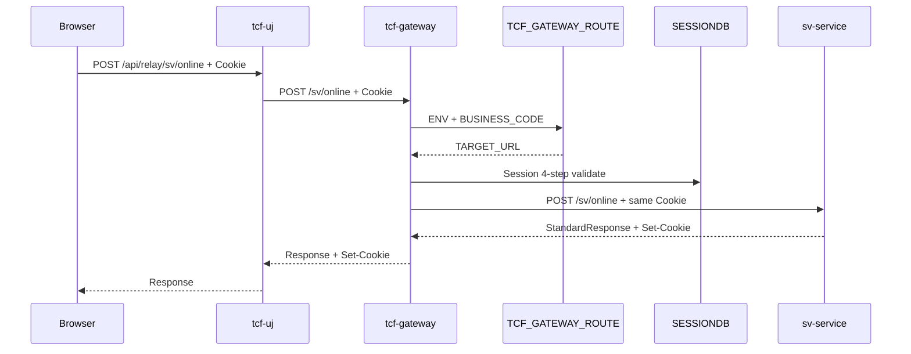

# 06. API Gateway 아키텍처

> **범위:** tcf-gateway — businessCode 라우팅, SESSIONDB 관문, downstream Relay  
> **관련:** [zman/09-Gateway라우팅.md](../zman/09-Gateway라우팅.md) · [zguide/tcf-gateway-개발가이드.md](../zguide/tcf-gateway-개발가이드.md)

---

## 1. 개요

### 1.1 Gateway의 역할

> **Application Gateway** — L4/GSLB/Apache를 대체하지 않고, **업무 WAR로의 HTTP Relay + 세션 관문**

| ✅ Gateway | ❌ Gateway 아님 |
|------------|----------------|
| businessCode → Target WAR | SSL 종료 (→ Apache) |
| Cookie/JSESSIONID Relay | Sticky Session (→ Apache/L4) |
| SESSIONDB 4단계 검증 | 업무 serviceId Dispatcher |
| TCF_GATEWAY_TX_LOG | JWT 발급 (→ tcf-jwt) |

| 항목 | 값 |
|------|-----|
| 모듈 | tcf-gateway |
| 포트 | 8100 (bootRun) |
| ztomcat | /gw (8080) |
| 라우팅 DB | H2 `data/gateway-route` / Oracle TCF_GATEWAY_ROUTE |

---

## 2. End-to-End 흐름



---

## 3. 처리 파이프라인 (GRF/GSF/GEF)

```
*ProxyController (entry/web)
  → BusinessRouteService (entry/facade) — 단일 Facade, 업무별 RouteService 없음
    → GRF.forwardOnline (support)
      → GSF.preProcess (support)
          ① TCF_GATEWAY_ROUTE 조회
          ② 미등록 → 404 GatewayRouteNotFoundException
          ③ GatewaySessionValidator (4단계)
          ④ GatewaySessionRequestEnricher (header 보정)
      → GatewayRouteDispatcher (client) — RestClient POST
      → GEF — success / authFail / routeNotFound / httpError
      → GatewayTransactionLogRecorder — TCF_GATEWAY_TX_LOG
```

### 3.1 패키지 구조

| 패키지 | 주요 클래스 |
|--------|-------------|
| entry/web | *ProxyController, Gateway*AdminController |
| entry/facade | BusinessRouteService |
| application/service | GatewayRouteAdminService, GatewaySessionRegistry |
| application/rule | GatewaySessionValidator, GatewayAuthExemptions |
| client | GatewayRouteDispatcher |
| persistence/dao | GatewayRouteDao, UserSessionDao |
| support | GRF, GSF, GEF, GatewayBusinessModules |

---

## 4. 라우팅 테이블

### 4.1 TCF_GATEWAY_ROUTE

```sql
WHERE ENV_CODE = :envCode        -- LOCAL / DEV / PRD
  AND BUSINESS_CODE = :businessCode
  AND USE_YN = 'Y'
```

### 4.2 Target URL 조립

```
TARGET_URL = TARGET_BASE_URL + CONTEXT_PATH + ONLINE_PATH
예: http://127.0.0.1:8086 + /sv + /online
  = http://127.0.0.1:8086/sv/online
```

### 4.3 LOCAL bootRun 시드

| BC | Target |
|----|--------|
| IC | http://127.0.0.1:8082/ic/online |
| SV | http://127.0.0.1:8086/sv/online |
| OM | http://127.0.0.1:8097/om/online |
| JWT | http://127.0.0.1:8110/online |
| EB, EP, MG, SS, PC, MS, PD | 각 bootRun 포트 |

DEV/PRD: K8s Service 호스트명 (msa-a-service 등)

### 4.4 Target 선택 (설계)

- TCF_GATEWAY_ROUTE_TARGET: WEIGHT, STATUS (ACTIVE/UP/DOWN)
- Round Robin / Weight, Health Check
- 장애 Target 제외

---

## 5. 세션 관문 (SESSIONDB)

Gateway는 **세션을 소유하지 않음**.

```
클라이언트 ──Cookie(JSESSIONID/NSIGHTSID)──► Gateway ──동일 Cookie──► 업무 WAS
                ▲                                    │
                └── Set-Cookie (downstream 그대로) ──┘
```

### 5.1 4단계 검증 (GSF)

| 단계 | 검증 | 설정 |
|------|------|------|
| 1 | Cookie 존재 (JSESSIONID/NSIGHTSID) | 필수 |
| 2 | SPRING_SESSION 존재·만료 | 권장 |
| 3 | TCF_USER_SESSION STATUS | 권장 |
| 4 | header.userId vs SESSIONDB userId | Gateway 권장 |

`nsight.gateway.auth.session-validation.*` — 단계별 on/off

### 5.2 Gateway DB 연결

| DB | 역할 | 설정 |
|----|------|------|
| gateway-route H2/Oracle | TCF_GATEWAY_ROUTE, TCF_USER_SESSION | spring.datasource |
| tcf-om H2 (local) | SPRING_SESSION | nsight.gateway.session-datasource |

`server.servlet.session.tracking-modes: []` — Gateway 자체 JSESSIONID **미발급**

### 5.3 User Session Sync

`GatewayUserSessionSyncScheduler` — TCF_USER_SESSION ↔ SPRING_SESSION 주기 동기 (기본 10초)

---

## 6. Gateway vs TCF Dispatcher

| | Gateway | Dispatcher |
|---|---------|------------|
| Key | businessCode | serviceId |
| Layer | WAR 앞 | WAR 내부 STF 뒤 |
| Config | TCF_GATEWAY_ROUTE | Handler Registry |
| Log | TCF_GATEWAY_TX_LOG | TCF_TX_LOG |

---

## 7. 프록시 엔드포인트

| 업무 | Gateway Path | Controller |
|------|--------------|------------|
| SV | POST /sv/online | SvProxyController |
| OM | POST /om/online | OmProxyController |
| JWT | POST /jwt/online | JwtProxyController |
| … | POST /{code}/online | *ProxyController |

### 7.1 Admin API

| URL | 설명 |
|-----|------|
| /admin/routes.html | 라우팅 관리 UI |
| /admin/sessions.html | 세션 관리 |
| /admin/transaction-log.html | Gateway TX Log |
| /api/admin/routes | REST CRUD |

---

## 8. Timeout·오류

| 설정 | 기본 | 적용 |
|------|------|------|
| CONNECT_TIMEOUT_MS | 3000 | GatewayRouteDispatcher |
| READ_TIMEOUT_MS | 5000 | GatewayRouteDispatcher |

| 오류 | 원인 |
|------|------|
| 404 Route Not Found | Catalog 미등록 |
| authFail | 세션 4단계 실패 |
| connectionError | Target DOWN |
| httpError | downstream 5xx |

---

## 9. Profile

| Profile | env-code | Route Cache |
|---------|----------|-------------|
| local | LOCAL | off |
| dev | DEV | 30s TTL |
| prod | PRD | 60s TTL |

---

## 10. tcf-uj 연동

```
bootRun: http://127.0.0.1:8100/{code}/online
Tomcat:  http://localhost:8080/gw/{code}/online
```

Query `deploymentMode`, `bootrunHost` — **Target 결정에 미사용** (하위 호환 전달만)

---

## 11. 운영 체크리스트

- [ ] ENV별 Route 등록·검증  
- [ ] Target Health / STATUS  
- [ ] Gateway TX Log ↔ TCF TX Log GUID 연계  
- [ ] H2 seed 변경 시 DB 파일 갱신  
- [ ] session-datasource ↔ tcf-om SESSIONDB 일치  

---

## 12. 관련 문서

| | |
|---|---|
| [tcf-gateway/docs/ROUTING_TABLE.md](../tcf-gateway/docs/ROUTING_TABLE.md) | DDL·시드 |
| [07-세션-인증-보안](./07-세션-인증-보안-아키텍처.md) | SESSIONDB |
| [13-UI-채널](./13-UI-채널-아키텍처.md) | tcf-uj Relay |

---

← [05-OM](./05-운영관리-OM-아키텍처.md) · [07-세션·인증 →](./07-세션-인증-보안-아키텍처.md)
