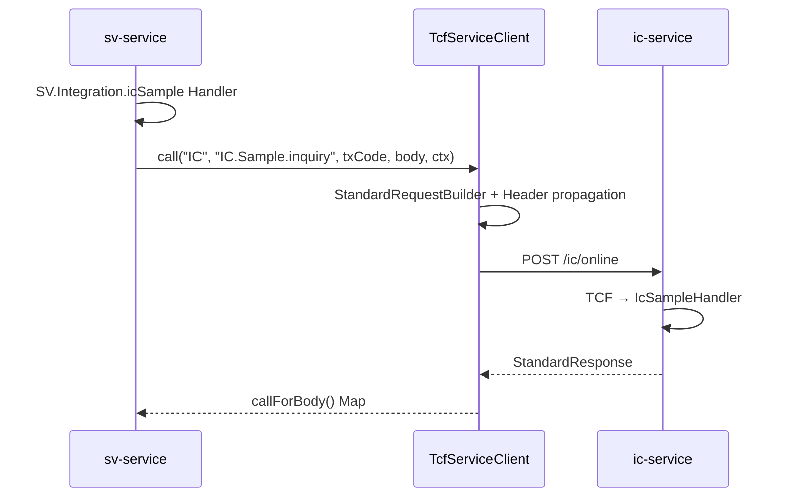

# 08. 서비스 간 연동 아키텍처

> **범위:** tcf-eai, WAR 간 HTTP/JSON, Header 전파, EB→EP 패턴  
> **관련:** [zdoc/서비스간연동.md](../zdoc/서비스간연동.md) · [zguide/tcf-eai-개발가이드.md](../zguide/tcf-eai-개발가이드.md)

---

## 1. 개요

### 1.1 원칙

> **WAR 간 Java 직접 참조 금지** — HTTP/JSON + serviceId + 표준 전문

| ❌ 금지 | ✅ 권장 |
|---------|---------|
| sv imports ic-service class | tcf-eai TcfServiceClient |
| WAR 간 Bean 공유 | POST /{code}/online |
| 공유 JAR에 업무 로직 | client 패키지 Adapter |

---

## 2. tcf-eai 모듈

### 2.1 구성

```
com.nh.nsight.tcf.eai/
├── client/      TcfServiceClient, DefaultTcfServiceClient
├── config/      TcfIntegrationConfiguration, TcfIntegrationProperties
├── model/       IntegrationCallRequest, IntegrationCallResult
├── support/     StandardRequestBuilder, HeaderPropagationHelper, ResponseResultValidator
└── exception/   IntegrationException, IntegrationTimeoutException, IntegrationBusinessException
```

### 2.2 의존

```gradle
implementation project(':tcf-eai')   // ic-service, sv-service
```

---

## 3. 연동 흐름



---

## 4. 설정

```yaml
nsight:
  integration:
    default-timeout-ms: 3000
    services:
      IC:
        base-url: http://127.0.0.1:8082
        context-path: /ic
        online-path: /online
      SV:
        base-url: http://127.0.0.1:8086
        context-path: /sv
        online-path: /online
```

Gateway 경유 시 base-url을 `http://127.0.0.1:8100`으로 변경 가능 (Cookie 필요).

---

## 5. API 사용

```java
@Service
public class SvIntegrationDemoService {
    private final TcfServiceClient client;

    public Map<String, Object> callIcSample(Map<String, Object> body, TransactionContext ctx) {
        return client.callForBody(
            "IC",                      // target businessCode
            "IC.Sample.inquiry",       // target serviceId
            "IC-INQ-0001",             // transactionCode
            body,
            ctx                        // GUID, user, channel 전파
        );
    }
}
```

### 5.1 Header 전파

`HeaderPropagationHelper` — GUID, TraceId, user, channelId, branch

### 5.2 응답 검증

`ResponseResultValidator` — resultCode SUCCESS, BusinessException 전파

---

## 6. 구현 패턴

| 계층 | 클래스 | WAR |
|------|--------|-----|
| Handler | SvIntegrationHandler | sv-service |
| Facade | SvIntegrationFacade | sv-service |
| Service | SvIntegrationDemoService | sv-service |
| Client | (TcfServiceClient bean) | tcf-eai |

**Adapter/Client는 호출 WAR에 위치** — tcf-eai는 공통 HTTP 클라이언트만 제공.

---

## 7. 데모 시나리오 (SV ↔ IC)

| 방향 | Caller serviceId | Target serviceId |
|------|------------------|------------------|
| SV → IC | SV.Integration.icSample | IC.Sample.inquiry |
| IC → SV | (설정 시) | SV.* |

샘플 JSON: `tcf-ui/.../sample-requests/sv-integration-icsample.json`

---

## 8. EB → EP (Outbox, tcf-eai 외)

eb-service는 **전용 EpOnlineClient** 사용 (동일 HTTP 원칙):

```
EB.User.create → EB_EVENT(READY)
EbEventPublishScheduler → POST /ep/online EP.UserEvent.receive
```

→ [14-이벤트-연계](./14-이벤트-연계-아키텍처.md)

---

## 9. 오류·Timeout

| 예외 | 원인 |
|------|------|
| IntegrationTimeoutException | 연동 timeout |
| IntegrationBusinessException | 상대 WAR BusinessException |
| IntegrationException | HTTP/파싱 오류 |

오류코드: E-TCF-IF-*, E-TCF-MSG-*

---

## 10. Catalog·거래통제

연동 serviceId도 **OM Catalog + TC** 등록 필요:

- SV.Integration.icSample (caller)
- IC.Sample.inquiry (callee)

---

## 11. Gateway 경유 연동

운영 시 tcf-eai base-url → Gateway:

```yaml
services:
  IC:
    base-url: http://gateway-host:8100
    context-path: ""      # /ic/online 직접
```

Cookie 전파 필수 (세션 거래).

---

## 12. 관련 문서

| | |
|---|---|
| [04-업무-도메인](./04-업무-도메인-서비스-아키텍처.md) | ic, sv |
| [14-이벤트-연계](./14-이벤트-연계-아키텍처.md) | eb, ep |
| [zman/04-모듈구성.md](../zman/04-모듈구성.md) | tcf-eai |

---

← [07-세션·인증](./07-세션-인증-보안-아키텍처.md) · [09-데이터-DB →](./09-데이터-DB-아키텍처.md)
