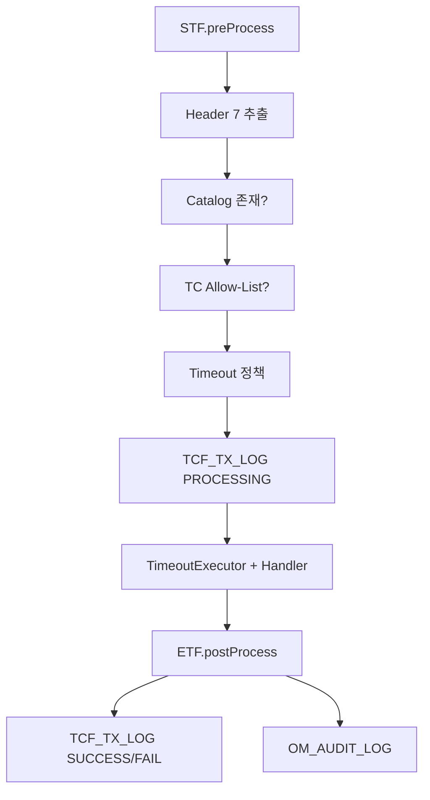

# 10. 거래통제·Timeout·로깅 아키텍처

> **범위:** Header 7 거래통제, Online Timeout, TCF_TX_LOG, 감사로그  
> **관련:** [zman/13-거래통제.md](../zman/13-거래통제.md) · [zman/14-Timeout관리.md](../zman/14-Timeout관리.md) · [zman/15-거래로그-감사로그.md](../zman/15-거래로그-감사로그.md)

---

## 1. 개요

STF 전처리·TimeoutExecutor·ETF 후처리에서 **거래 통제·시간·로그**를 일관 적용한다.



---

## 2. 거래통제 (Transaction Control)

### 2.1 핵심

> **Allow-List** — 등록된 Header 7 조합만 실행. 권한 있어도 미등록 → 차단.

### 2.2 Header 7항목

| # | 필드 | 예 |
|---|------|-----|
| 1 | serviceId | SV.Customer.selectSummary |
| 2 | transactionCode | SV-CUS-0001 |
| 3 | businessCode | SV |
| 4 | serviceName | 고객요약 |
| 5 | user | admin01 |
| 6 | channelId | WEBTOP |
| 7 | branch | 001 |

**별도 처리:** GUID, TraceId, Timeout, Role

### 2.3 Catalog vs TC

| | OM_SERVICE_CATALOG | TCF_TRANSACTION_CONTROL |
|---|-------------------|-------------------------|
| 질문 | serviceId **존재**? | 이 **7조합** 허용? |
| 실패 | E-TCF-CTL-CATALOG | E-TCF-CTL-DENIED |

### 2.4 판단 순서

1. Header 7 추출·필수 확인  
2. Catalog 등록 확인  
3. TC 매칭 (와일드카드 규칙)  
4. ACTIVE 여부  
5. Dispatcher 또는 차단  

### 2.5 Gateway 1차 vs STF 최종

| | Gateway | STF |
|---|---------|-----|
| 거래통제 | 1차 가능 | **최종** |
| Catalog | — | 필수 |

구현: `TransactionControlService`, `tcf-core/control/`

---

## 3. Timeout

### 3.1 계층

| 계층 | 컴포넌트 | 역할 |
|------|----------|------|
| Online | OnlineTransactionTimeoutExecutor | 거래 전체 |
| Query | MyBatis/JDBC | SQL timeout |
| Gateway | GatewayRouteDispatcher | CONNECT/READ |
| Integration | tcf-eai | default-timeout-ms |

### 3.2 정책 테이블

**TCF_SERVICE_TIMEOUT_POLICY**

- serviceId별 timeoutMs
- OM Admin / data.sql seed

### 3.3 거래 상태

```
PROCESSING → SUCCESS | FAIL | TIMEOUT | UNKNOWN
```

Timeout 시: E-TCF-TIME-*

상세: [zdoc/타임아웃관리.md](../zdoc/타임아웃관리.md)

---

## 4. 거래 로그

### 4.1 TCF_TX_LOG 생명주기

| 시점 | status | 주체 |
|------|--------|------|
| STF 후 | PROCESSING | STF |
| ETF 후 | SUCCESS / FAIL / TIMEOUT | ETF |

주요 컬럼: GUID, serviceId, user, channel, elapsedMs, errorCode

### 4.2 TCF_TX_STEP_LOG

- Handler/Facade/DAO 단계
- SQL ID 연계

### 4.3 Gateway 로그

**TCF_GATEWAY_TX_LOG** — Gateway Relay 구간, downstream Target, elapsed

GUID로 TCF_TX_LOG 연계

---

## 5. 감사 로그

**OM_AUDIT_LOG**

- TCF_SERVICE_AUDIT_POLICY 기준
- ETF에서 INSERT
- OM Admin 조회: OM.AuditLog.*

---

## 6. Idempotency

**TCF_IDEMPOTENCY_KEY**

- STF에서 중복 요청 검증
- 동일 key + PROCESSING/SUCCESS → 거부 또는 재응답

---

## 7. Cache 연계

거래통제·Catalog·Timeout 조회 — tcf-cache:

- `serviceCatalog` region (60분)
- Catalog 변경 시 `@CacheEvict`

→ [11-캐시-아키텍처](./11-캐시-아키텍처.md)

---

## 8. OM Admin

| 화면 | serviceId |
|------|-----------|
| ServiceId Catalog | OM.ServiceCatalog.* |
| 거래통제 | OM.TransactionControl.* |
| Timeout | OM.TimeoutPolicy.* |
| 거래로그 | OM.TransactionLog.* |
| 감사로그 | OM.AuditLog.* |

---

## 9. 신규 serviceId 등록 순서

```
1. OM_SERVICE_CATALOG
2. TCF_TRANSACTION_CONTROL (Header 7)
3. TCF_SERVICE_TIMEOUT_POLICY
4. OM_ERROR_CODE (필요)
5. TCF_SERVICE_AUDIT_POLICY (필요)
```

---

## 10. 관련 문서

| | |
|---|---|
| [05-운영관리-OM](./05-운영관리-OM-아키텍처.md) | Catalog seed |
| [docs/architecture/39-header-transaction-control.md](../docs/architecture/39-header-transaction-control.md) | |
| [docs/architecture/41-service-timeout-policy.md](../docs/architecture/41-service-timeout-policy.md) | |
| [docs/architecture/37-transaction-log.md](../docs/architecture/37-transaction-log.md) | |

---

← [09-데이터-DB](./09-데이터-DB-아키텍처.md) · [11-캐시 →](./11-캐시-아키텍처.md)
