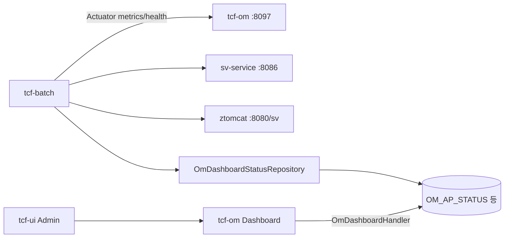

# 12. 배치·모니터링 아키텍처

> **범위:** tcf-batch, OM Dashboard 수집, Scheduler, Actuator  
> **관련:** [zman/17-Batch-Scheduler.md](../zman/17-Batch-Scheduler.md) · [zdoc/배치관리.md](../zdoc/배치관리.md)

---

## 1. 개요

tcf-batch는 OM 운영 대시보드용 **AP/DB/세션/배포 상태**를 수집·적재한다.

| 항목 | 값 |
|------|-----|
| 모듈 | tcf-batch |
| 포트 | 8098 |
| Context | /batch |
| 공유 DB | tcf-om H2 (nsight_om) |

---

## 2. Job 아키텍처

| Job ID | API | Service | 저장 테이블 |
|--------|-----|---------|-------------|
| BAT-BATCH-001 | POST /batch/jobs/ap-status/run | ApStatusCollectService | OM_AP_STATUS |
| BAT-BATCH-002 | POST /batch/jobs/db-status/run | DbStatusCollectService | OM_DB_STATUS |
| BAT-BATCH-003 | POST /batch/jobs/session-status/run | SessionStatusCollectService | OM_SESSION_STATUS |
| BAT-BATCH-004 | POST /batch/jobs/deploy-status/run | DeployStatusCollectService | OM_DEPLOY_STATUS |

### 2.1 스케줄러

`ApStatusCollectScheduler` 등 — `@Scheduled` 자동 수집 + REST 수동 실행

---

## 3. 수집 흐름



---

## 4. Client 계층

| Client | 수집 대상 |
|--------|-----------|
| ApMetricsClient | CPU, Heap, Thread (Actuator) |
| DbMetricsClient | JDBC, connection pool |
| SessionMetricsClient | SPRING_SESSION, Tomcat session |
| DeployMetricsClient | health, startup time |

**사전 조건:** 대상 WAS Actuator `health`, `metrics` 노출

---

## 5. Profile별 수집 대상

| Profile | base-url 패턴 |
|---------|---------------|
| local | http://127.0.0.1:{port} |
| dev | http://127.0.0.1:8080/{context} |
| prod | ${NSIGHT_GATEWAY_BASE_URL}/{context} |

---

## 6. OM 연동

```yaml
# tcf-om
nsight.om.batch-service-url: http://127.0.0.1:8098/batch   # bootRun
# Tomcat: http://127.0.0.1:8080/batch
```

- OM Admin `/om/admin/batch.html` — Job 수동 재실행
- OmBatchRemoteClient — OM → batch HTTP

---

## 7. 세션 수집 규칙

| 대상 | 수집 |
|------|------|
| OM Portal | SPRING_SESSION (OM-PORTAL) |
| 업무 WAR | tomcat.sessions.active.current |
| OM Tomcat HTTP Session | **제외** (Spring Session 중복) |

---

## 8. 패키지 구조

```
com.nh.nsight.tcf.batch
├── application/service/    *CollectService
├── application/scheduler/  *CollectScheduler
├── client/                 *MetricsClient
├── entry/web/              *BatchController
├── persistence/repository/ OmDashboardStatusRepository
└── support/                BatchDatabaseMigration
```

---

## 9. 로컬 검증

```bash
gradle :tcf-om:bootRun
gradle :sv-service:bootRun
gradle :tcf-batch:bootRun
curl -X POST http://localhost:8098/batch/jobs/ap-status/run
# http://localhost:8099/om/admin/dashboard.html
```

---

## 10. eb-service Scheduler (참고)

eb-service `EbEventPublishScheduler` — **업무 Outbox**, tcf-batch와 별개.

→ [14-이벤트-연계](./14-이벤트-연계-아키텍처.md)

---

## 11. 관련 문서

| | |
|---|---|
| [zguide/tcf-batch-개발가이드.md](../zguide/tcf-batch-개발가이드.md) | |
| [05-운영관리-OM](./05-운영관리-OM-아키텍처.md) | Dashboard |
| [docs/architecture/13-batch.md](../docs/architecture/13-batch.md) | |

---

← [11-캐시](./11-캐시-아키텍처.md) · [13-UI →](./13-UI-채널-아키텍처.md)
