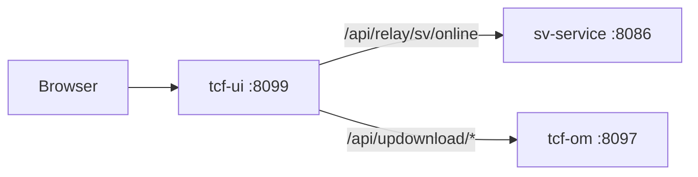
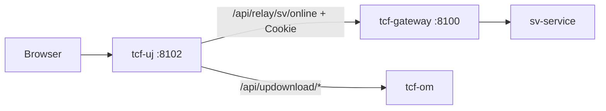

# 13. UI·채널 아키텍처

> **범위:** tcf-ui, tcf-uj — Relay, OM Admin, JWT Admin, 거래 테스트  
> **관련:** [zguide/tcf-ui-개발가이드.md](../zguide/tcf-ui-개발가이드.md) · [zguide/tcf-uj-개발가이드.md](../zguide/tcf-uj-개발가이드.md)

---

## 1. 개요

WebTopSuite 없이 브라우저에서 TCF JSON 전문 테스트·OM 운영 포털을 제공한다.

| | tcf-ui | tcf-uj |
|---|--------|--------|
| 포트 | 8099 | 8102 |
| ztomcat | /ui | /uj |
| WAR/JAR | tcf-ui.jar / ui.war | tcf-uj.jar / uj.war |
| Relay | **WAS 직접** | **Gateway 경유** |
| JWT Admin | ❌ | ✅ |
| 설정 prefix | nsight.tcf-ui | nsight.tcf-uj |

---

## 2. 아키텍처 비교

### 2.1 tcf-ui (직접 Relay)



**용도:** 개발·단순 테스트, Gateway/세션 관문 **미경유**

### 2.2 tcf-uj (Gateway Relay)



**용도:** 운영형 UI, 세션·Gateway 검증, **Cookie 필수**

---

## 3. 공통 패키지 구조

```
com.nh.nsight.tcf.{ui|uj}/
├── application/service/  BusinessModuleCatalog, BusinessTransactionCatalog
├── client/               TransactionRelayService, GatewayRelayService, UpdownloadRelayService
├── config/               TcfUiProperties / TcfUjProperties
├── entry/web/            TcfApiController, UpdownloadApiController
└── support/              BusinessModuleDefinitions, RelayResult
```

---

## 4. Relay API

| Method | Path | 설명 |
|--------|------|------|
| GET | /api/business-modules | 업무 목록 |
| GET | /api/business-modules/{code}/target-url | Relay URL |
| POST | /api/relay/{code}/online | 온라인 거래 |
| POST | /api/multi/relay/{code}/online | 다중 거래 (uj) |
| GET | /api/config | deployment-mode |
| POST | /api/updownload/upload | 파일 (OM 직접) |

---

## 5. Gateway Relay URL

| mode | URL |
|------|-----|
| bootrun | http://127.0.0.1:8100/{code}/online |
| tomcat | http://localhost:8080/gw/{code}/online |

tcf-ui: `TransactionRelayService` → 업무 WAS 직접 URL

---

## 6. 배포 모드

| mode | 설정 파일 | UI base |
|------|-----------|---------|
| bootrun | application-local.yml | :8099 / :8102 |
| tomcat | application-dev.yml | :8080/ui, :8080/uj |

공통 JS:
- `_shared/ui-context.js` / `uj-context.js` — context path 자동 보정
- `_shared/om-admin.js` — OM Admin relayFetch()

---

## 7. 화면 맵

| 화면 | bootRun (ui) | bootRun (uj) |
|------|--------------|--------------|
| 업무 허브 | /index.html | / |
| SV 테스트 | /sv/index.html | /sv/index.html |
| SV 페이징 | /sv/sample-list.html | /sv/sample-list.html |
| OM 로그인 | /om/admin/login.html | /om/admin/login.html |
| OM 대시보드 | /om/admin/dashboard.html | /om/admin/dashboard.html |
| JWT Admin | — | /jwt/admin/* |
| UD 파일 | /ud/updownload.html | /ud/updownload.html |

---

## 8. 등록 업무 (BusinessModuleDefinitions)

Gateway Route 등록 업무만 uj Relay 성공: IC, PC, MS, SV, PD, EB, EP, SS, MG, OM, JWT

미등록 (CC, BC …): Gateway Catalog 추가 필요

---

## 9. 샘플 JSON

`tcf-ui/src/main/resources/sample-requests/` — 업무별 inquiry JSON

`tcf-scripts/curl-sample.bat sv` — CLI 테스트

---

## 10. 로컬 기동 순서

### tcf-ui

```
sv-service → tcf-om → tcf-ui
```

### tcf-uj (권장)

```
sv-service → tcf-om → tcf-gateway → tcf-uj
→ OM login → SV 테스트
```

---

## 11. Actuator (Dashboard)

tcf-ui management endpoints — tcf-batch AP 수집 대상:

```yaml
management.endpoints.web.exposure.include: health,info,metrics
```

---

## 12. 관련 문서

| | |
|---|---|
| [06-API-Gateway](./06-API-Gateway-아키텍처.md) | uj 경유 |
| [05-운영관리-OM](./05-운영관리-OM-아키텍처.md) | Admin |
| [15-배포-CICD](./15-배포-환경-CICD-아키텍처.md) | ui/uj WAR |

---

← [12-배치](./12-배치-모니터링-아키텍처.md) · [14-이벤트 →](./14-이벤트-연계-아키텍처.md)
