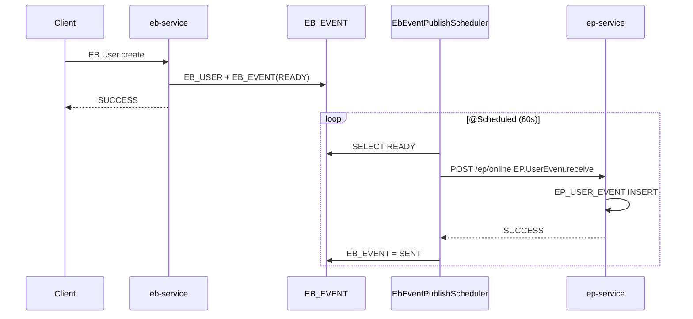

# 14. 이벤트 연계 아키텍처

> **범위:** eb-service (Event Bridge), ep-service (Event Processing), Outbox 패턴  
> **관련:** [zguide/eb-service-개발가이드.md](../zguide/eb-service-개발가이드.md) · [zguide/ep-service-개발가이드.md](../zguide/ep-service-개발가이드.md)

---

## 1. 개요

EB/EP는 **이벤트 기반 연계** 샘플 — 사용자 등록 → Outbox → 배치 발행 → EP 수신.

| WAR | BC | 포트 | 역할 |
|-----|-----|------|------|
| eb-service | EB | 8089 | Event Bridge — 이벤트 생성·Outbox |
| ep-service | EP | 8090 | Event Processing — 이벤트 수신·저장 |

---

## 2. End-to-End 흐름



---

## 3. eb-service 아키텍처

### 3.1 Handler

| Handler | serviceId | 설명 |
|---------|-----------|------|
| EbSampleHandler | EB.Sample.inquiry | 샘플 |
| EbUserHandler | EB.User.inquiry, EB.User.create | 사용자·이벤트 생성 |
| EbEventHandler | EB.Event.inquiry | Outbox 조회·집계 |
| EbBatchHandler | EB.Batch.inquiry | 발행 배치 설정 |

### 3.2 테이블

| 테이블 | 역할 |
|--------|------|
| EB_USER | 사용자 |
| EB_EVENT | READY → SENT / FAIL |

### 3.3 Outbox 발행

| 컴ponent | 역할 |
|----------|------|
| EbEventPublishService | READY 이벤트 조회·상태 전이 |
| EbEventPublishScheduler | @Scheduled 주기 실행 |
| EpOnlineClient | POST ep-service /ep/online |

설정: `nsight.eb.event-publish` (interval, ep base-url 8090)

---

## 4. ep-service 아키텍처

### 4.1 Handler

| Handler | serviceId | 설명 |
|---------|-----------|------|
| EpSampleHandler | EP.Sample.inquiry | 샘플 |
| EpUserEventHandler | EP.UserEvent.inquiry | 수신 목록 (페이징) |
| | EP.UserEvent.receive | EB 배치 수신 |

### 4.2 수신 Body 예

```json
{
  "eventId": "EVT001",
  "eventType": "USER_CREATED",
  "userId": "U001"
}
```

### 4.3 테이블

EP_USER_EVENT

---

## 5. tcf-eai vs EpOnlineClient

| | tcf-eai | EpOnlineClient |
|---|---------|----------------|
| 용도 | 일반 WAR↔WAR serviceId 호출 | EB→EP 전용 |
| 모듈 | tcf-eai JAR | eb-service/client |
| 패턴 | StandardRequest + TcfServiceClient | 동일 HTTP 원칙 |

EB→EP도 **Java import 금지**, HTTP/JSON.

---

## 6. 오류·재시도

| 상태 | 의미 |
|------|------|
| READY | 발행 대기 |
| SENT | EP 수신 성공 |
| FAIL | EP 호출 실패 (재시도 대상) |

Scheduler 재실행 시 FAIL/READY 재처리 정책 — EbEventPublishService

---

## 7. Catalog·거래통제

등록 필요 serviceId:

- EB.User.create, EB.Event.inquiry, …
- EP.UserEvent.receive, EP.UserEvent.inquiry

---

## 8. Gateway·UI

| | URL |
|---|-----|
| Gateway | POST /8100/eb/online, /ep/online |
| tcf-ui | /eb/index.html, /ep/index.html |

---

## 9. 확장 (Saga/Event-driven)

현재: **Outbox + Scheduler** (at-least-once)

목표 확장: Message Queue, Dead Letter, Idempotency (EP.UserEvent.receive)

---

## 10. 관련 문서

| | |
|---|---|
| [08-서비스-간-연동](./08-서비스-간-연동-아키텍처.md) | HTTP 원칙 |
| [04-업무-도메인](./04-업무-도메인-서비스-아키텍처.md) | EB, EP |
| [zdoc/스케줄러.md](../zdoc/스케줄러.md) | |

---

← [13-UI](./13-UI-채널-아키텍처.md) · [15-배포-CICD →](./15-배포-환경-CICD-아키텍처.md)
