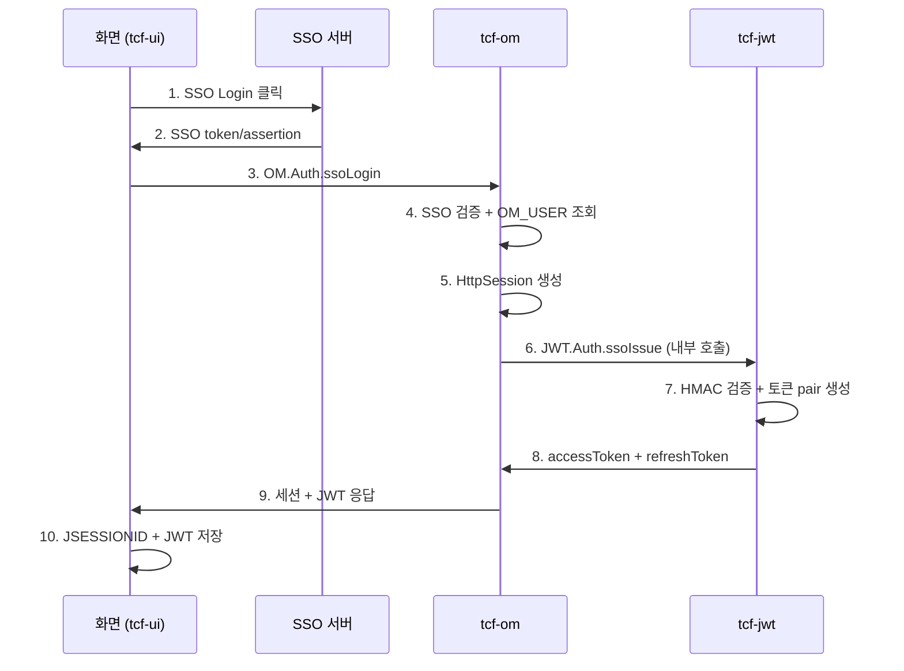

# SSO · JWT 로그인 흐름 정리

구현된 SSO·JWT 로그인 흐름을 코드와 문서 기준으로 정리합니다.

NSIGHT TCF에는 **로그인 방식이 3가지** 있습니다. 공통점은 모두 **TCF 표준 거래(`serviceId`)** 로 처리된다는 것입니다.

관련 문서: [SSO-TOKEN처리.md](SSO-TOKEN처리.md) · [로그인.md](로그인.md) · [세션관리.md](세션관리.md)

---

## 1. 한눈에 비교

| 구분 | OM 일반 로그인 | SSO 로그인 | JWT 포털 로그인 |
|------|---------------|------------|----------------|
| 화면 | `/om/admin/login.html` | 동일 (SSO 버튼) | `/jwt/admin/login.html` |
| 거래 | `OM.Auth.login` | `OM.Auth.ssoLogin` | `JWT.Auth.login` |
| 인증 주체 | `tcf-om` (ID/PW) | `tcf-om` (SSO 검증) | `tcf-jwt` (ID/PW) |
| OM 세션 | ✅ 생성 | ✅ 생성 | ❌ 없음 |
| JWT 토큰 | ❌ 없음 | ✅ 발급 | ✅ 발급 |
| 이후 OM Admin | JSESSIONID Relay | JSESSIONID Relay | — |
| Gateway API | — | Bearer (선택) | Bearer |

**핵심:** JWT는 TCF를 대체하지 않습니다. 인증 수단이고, TCF는 Header·거래통제·권한·로그·Timeout을 계속 담당합니다.

---

## 2. OM 일반 로그인 (ID/비밀번호)

```text
[브라우저] login.html
    │ userId + password
    ▼
[tcf-ui:8099] POST /api/relay/OM/online  (OM.Auth.login)
    │ Cookie 중계
    ▼
[tcf-om:8097] TCF.process()
    → OmAuthService.login()
    → OM_USER 조회 + 비밀번호 검증
    → HttpSession 생성 → SPRING_SESSION 저장
    ▼
[브라우저]
    JSESSIONID 쿠키 + sessionStorage(사용자 정보)
```

- **local 계정:** `admin01` / `nsight01!` (또는 `op01`, `view01`)
- 이후 OM Admin 거래는 **Relay + JSESSIONID 쿠키**로 `tcf-om`에 직접 호출

---

## 3. SSO 로그인 (OM 세션 + JWT 동시 발급)

설계 문서: [SSO-TOKEN처리.md](SSO-TOKEN처리.md)



### 단계별 설명

| 단계 | 처리 |
|------|------|
| 1~2 | IdP가 사용자 인증 후 SSO token/code/assertion 발급 |
| 3 | 화면이 `OM.Auth.ssoLogin` (`OM-AUT-0005`) 호출 |
| 4~5 | `tcf-om`이 SSO 검증 → `OM_USER` 조회 → `HttpSession` + `SPRING_SESSION` |
| 6~8 | `tcf-om`이 `tcf-jwt`의 `JWT.Auth.ssoIssue`를 **내부 HTTP 호출** (HMAC 서명) |
| 9 | 응답에 `sessionId`, `accessToken`, `refreshToken` 등 포함 |

### local 개발 (mock)

- IdP 없이 **「SSO 로그인」** 버튼 → mock SSO token 생성
- 아이디: **`admin01`** 권장 (`admin`은 OM/JWT DB에 없을 수 있음)
- **필수 기동:** `tcf-om`(8097) + `tcf-jwt`(8110) + `tcf-ui`(8099)

### 화면 저장

| 항목 | 저장 위치 |
|------|-----------|
| OM 세션 | `JSESSIONID` 쿠키 (HttpOnly) |
| Access Token | `sessionStorage` (`nsight.jwt.session`) |
| 사용자 정보 | `sessionStorage` (`nsight.om.session`) |

### 이후 API 호출

- **OM Admin 화면:** SSO 후 **OM Relay(8097) + 세션 쿠키** 우선 (gateway 불필요)
- **Gateway 경유 업무 API:** `Authorization: Bearer {accessToken}` (gateway 8100 기동 시)

---

## 4. JWT 포털 로그인 (독립 JWT 인증)

```text
[브라우저] /jwt/admin/login.html
    │ userId + password
    ▼
[tcf-ui:8099] POST /api/relay/JWT/online  (JWT.Auth.login)
    ▼
[tcf-jwt:8110] TCF.process()
    → JwtAuthService.login()
    → OM_USER 조회 + 비밀번호 검증
    → accessToken + refreshToken 발급
    → TCF_JWT_TOKEN / TCF_REFRESH_TOKEN 저장
    ▼
[브라우저] sessionStorage(nsight.jwt.session)
```

- **접속:** http://localhost:8099/jwt/admin/login.html
- **기동:** `tcf-ui`(8099) + `tcf-jwt`(8110)
- OM 세션은 **생성되지 않음** — JWT Admin·토큰 관리 전용
- 이후 거래: `JWT.Auth.refresh`, `JWT.Auth.revoke`, `JWT.Auth.logout` 등

---

## 5. 역할 분리 (누가 무엇을 하나)

| 컴포넌트 | SSO/JWT에서 하는 일 | 하지 않는 일 |
|----------|---------------------|--------------|
| **화면** | 로그인 시작, 토큰·세션 보관 | SSO 원문 검증, 권한 최종 판단 |
| **SSO IdP** | 사용자 인증, assertion 발급 | OM 세션·JWT 생성 |
| **tcf-om** | SSO 검증, OM 세션, JWT 발급 **요청**, 응답 조립 | JWT 서명키 관리 |
| **tcf-jwt** | 토큰 생성·저장·폐기·갱신 | SSO 검증, OM 세션 생성 |
| **tcf-gateway** | JWT/세션 확인, 라우팅 | 로그인·토큰 발급 |
| **업무 WAR** | TCF STF에서 세션/JWT/권한 검증 후 업무 처리 | 로그인 중복 구현 |

---

## 6. local 기동 체크리스트

| 목적 | 필요 서비스 | 포트 |
|------|------------|------|
| OM 일반 로그인 | `tcf-ui`, `tcf-om` | 8099, 8097 |
| SSO 로그인 | `tcf-ui`, `tcf-om`, `tcf-jwt` | 8099, 8097, 8110 |
| JWT 포털 | `tcf-ui`, `tcf-jwt` | 8099, 8110 |
| Gateway API (선택) | + `tcf-gateway` | 8100 |

---

## 7. 정리 한 줄

| 방식 | 결과 |
|------|------|
| **OM 로그인** | 세션만 (포털용) |
| **SSO 로그인** | 세션 + JWT (포털 + Gateway API) |
| **JWT 로그인** | JWT만 (토큰 관리·API 인증용) |

SSO는 `OM.Auth.ssoLogin` 한 번으로 OM 세션과 JWT를 함께 받고, JWT 단독 로그인은 `JWT.Auth.login`으로 토큰만 받는 구조입니다.
