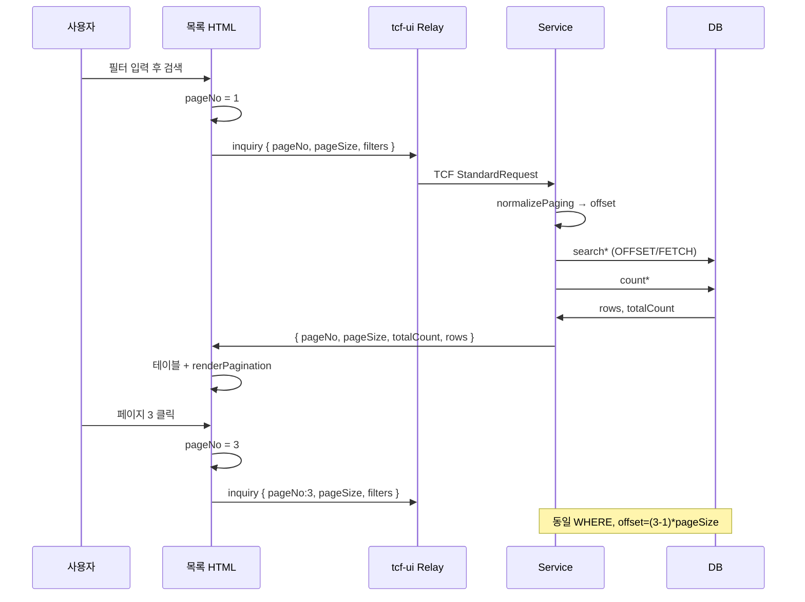

# TCF 화면 페이징 처리 설계

NSIGHT TCF 목록 화면은 **offset 기반 페이지 페이징**을 표준으로 사용합니다.  
화면(tcf-ui)은 `pageNo`·`pageSize`만 보내고, **offset 계산·상한·건수 조회**는 서버(Rule/Service/DAO)가 담당합니다.

| 관점 | 역할 | 핵심 |
|------|------|------|
| **화면** | 현재 페이지 state, 페이징 UI | `pageNo`, `PAGE_SIZE`, `renderPagination` |
| **요청** | TCF INQUIRY body | `pageNo`(1-based), `pageSize` |
| **서버** | 정규화·slice·total | `Rule.normalizePaging` → `search*` + `count*` |
| **응답** | 목록 계약 | `pageNo`, `pageSize`, `totalCount`, `rows` |
| **DB** | Oracle dialect | `OFFSET … ROWS FETCH NEXT … ROWS ONLY` |

관련: [DAO처리.md](DAO처리.md) · [mybatisNaming.md](mybatisNaming.md) · [업무페이징.md](업무페이징.md) · [어플리케이션계층.md](어플리케이션계층.md) · [docs/architecture/27-paging.md](../docs/architecture/27-paging.md)

---

## 1. 설계 목표

| 목표 | 설명 |
|------|------|
| **일관된 UX** | OM Admin·EB·JWT 화면 모두 PREV/번호/NEXT + 총 건수 표시 |
| **서버 주도** | `offset`은 클라이언트가 보내지 않음 — Rule에서만 계산 |
| **정확한 total** | `totalCount`는 count 쿼리 결과 (`rows.length` 사용 금지) |
| **대용량 안전** | DB에서 slice — 전체 목록을 메모리에 올리지 않음 (예외: 소량 캐시) |
| **검색 연동** | 필터 변경 시 **1페이지로 리셋** |

---

## 2. 전체 흐름

```text
[Browser — 목록 HTML]
  state: currentPage / pageNo, PAGE_SIZE
  body: { pageNo, pageSize, ...검색조건 }
       │
       ▼ OmAdmin.call / EbAdmin.call  →  POST /api/relay/{BC}/online
[tcf-ui Relay]
       │
       ▼ serviceId: OM.Xxx.inquiry  (processingType: INQUIRY)
[Handler → Facade → Service]
  1. criteria = 검색조건 + pageNo/pageSize
  2. Rule.normalizePaging(criteria)   → pageNo, pageSize, offset
  3. DAO.searchXxx(criteria)          → rows (현재 페이지)
  4. DAO.countXxx(criteria)         → totalCount (동일 WHERE)
  5. 응답 Map { pageNo, pageSize, totalCount, rows }
       │
       ▼ ETF StandardResponse.body
[Browser]
  테이블 렌더링 + OmAdmin.renderPagination(...)
```

---

## 3. 요청·응답 계약

### 3.1 요청 body (목록 INQUIRY)

```json
{
  "pageNo": 1,
  "pageSize": 10,
  "businessCode": "OM",
  "serviceId": "SV",
  "useYn": "Y"
}
```

| 필드 | 타입 | 필수 | 기본값 | 설명 |
|------|------|------|--------|------|
| `pageNo` | number | N | `1` | **1-based** 페이지 번호 |
| `pageSize` | number | N | `20` | 페이지당 건수 (**최대 100**) |
| 검색 필드 | varies | N | — | 화면별 (`userId`, `serviceId`, `activeOnly` …) |

- 클라이언트는 **`offset`을 보내지 않습니다.**
- `processingType`은 Header에서 `INQUIRY` (라우팅 키는 `serviceId`).

### 3.2 응답 body

```json
{
  "businessCode": "OM",
  "screen": "ServiceId / 거래코드 관리",
  "pageNo": 1,
  "pageSize": 10,
  "totalCount": 72,
  "rows": [
    { "catalogId": "CAT-001", "serviceId": "OM.User.inquiry" }
  ]
}
```

| 필드 | 설명 |
|------|------|
| `pageNo` | Rule 정규화 **후** 적용된 페이지 |
| `pageSize` | Rule 정규화 **후** 적용된 크기 |
| `totalCount` | 검색 조건에 맞는 **전체** 건수 |
| `rows` | **현재 페이지** 데이터만 (길이 ≤ `pageSize`) |

---

## 4. 서버 페이징 (Rule · Service · DAO)

### 4.1 Rule — `normalizePaging`

표준 구현: `OmOperationRule.normalizePaging(Map)`

```java
public void normalizePaging(Map<String, Object> body) {
    int pageNo = Math.max(1, toInt(body.get("pageNo"), 1));
    int pageSize = toInt(body.get("pageSize"), 20);
    if (pageSize > 100) {
        pageSize = 100;
    }
    body.put("pageNo", pageNo);
    body.put("pageSize", pageSize);
    body.put("offset", (pageNo - 1) * pageSize);
}
```

| 입력 | 처리 |
|------|------|
| `pageNo` null / 0 / 음수 | `1` |
| `pageSize` null | `20` |
| `pageSize` > 100 | `100` cap |
| `offset` | `(pageNo - 1) * pageSize` — **서버만 계산** |

### 4.2 Service 패턴 (DB 페이징 — 표준)

```java
public Map<String, Object> inquiry(Map<String, Object> body, TransactionContext context) {
    rule.validateOperation(context);
    Map<String, Object> criteria = new HashMap<>();
    copyIfPresent(body, criteria, "errorCode", "useYn", "pageNo", "pageSize");
    rule.normalizePaging(criteria);

    List<Map<String, Object>> rows = dao.searchErrorCodes(criteria);
    int totalCount = dao.countErrorCodes(criteria);

    Map<String, Object> result = new LinkedHashMap<>();
    result.put("pageNo", criteria.get("pageNo"));
    result.put("pageSize", criteria.get("pageSize"));
    result.put("totalCount", totalCount);
    result.put("rows", rows);
    return result;
}
```

**필수 체크**

1. `normalizePaging` **전에** `pageNo`·`pageSize`가 criteria에 있어야 함
2. `search*`와 `count*`에 **동일 WHERE** (`<sql id="...Where">` 공유)
3. `totalCount` ≠ `rows.size()`

### 4.3 MyBatis SQL

```xml
<select id="searchServiceCatalog" parameterType="map" resultType="map">
    SELECT ...
      FROM OM_SERVICE_CATALOG
    <include refid="serviceCatalogSearchWhere"/>
     ORDER BY BUSINESS_CODE, SERVICE_ID
     OFFSET #{offset} ROWS FETCH NEXT #{pageSize} ROWS ONLY
</select>

<select id="countServiceCatalog" parameterType="map" resultType="int">
    SELECT COUNT(*)
      FROM OM_SERVICE_CATALOG
    <include refid="serviceCatalogSearchWhere"/>
</select>
```

- 로컬 H2: `MODE=Oracle` — `OFFSET … FETCH NEXT …`
- `FETCH FIRST #{limit}` 는 Top-N·대시보드용 — **목록 페이징과 구분**

상세: [mybatisNaming.md](mybatisNaming.md) §10

### 4.4 페이징 방식 선택

| 방식 | when | 예 |
|------|------|-----|
| **DB 페이징** | 대용량 테이블, 인덱스 활용 | `OmUserService`, `OmErrorCodeService` |
| **메모리 페이징** | 소량 캐시·전체 로드 후 slice | `OmCommonCodeService` (EhCache) |
| **JdbcTemplate** | MyBatis 미사용 영역 | `OmUpdownloadService` (동일 cap 100) |

메모리 페이징도 offset 공식은 동일: `(pageNo - 1) * pageSize` → `subList`.

---

## 5. 화면(tcf-ui) 페이징 설계

### 5.1 화면 state 패턴

```javascript
const PAGE_SIZE = 10;   // 화면별 상수
let currentPage = 1;    // 또는 pageNo

function readFilters() {
  const f = { pageNo: currentPage, pageSize: PAGE_SIZE };
  // 검색 input 값 추가
  if (document.getElementById('filterUseYn').value) {
    f.useYn = document.getElementById('filterUseYn').value;
  }
  return f;
}
```

| 규칙 | 설명 |
|------|------|
| `PAGE_SIZE` | 화면 상단 **const** — UX 기본값 |
| `currentPage` / `pageNo` | 사용자가 바꾼 **현재 페이지** |
| 검색·필터 변경 | **`currentPage = 1`** 리셋 후 재조회 |
| 삭제·등록 후 | 목록 유지 또는 1페이지 — 화면 정책에 따름 |

### 5.2 목록 로드

```javascript
async function loadList(page, container) {
  if (page != null) currentPage = page;
  const body = readFilters();
  const { body: data, elapsedMs } = await OmAdmin.call('serviceCatalog', 'inquiry', body);
  renderTable(data.rows || []);
  renderStatus(data, elapsedMs);
  OmAdmin.renderPagination(
    document.getElementById('pagination'),
    data.pageNo || currentPage,
    data.pageSize || PAGE_SIZE,
    data.totalCount || 0,
    p => loadList(p, container).catch(e => OmAdmin.showErrorBanner(container, e.message)),
    false
  );
}
```

### 5.3 `OmAdmin.renderPagination`

공통 함수: `tcf-ui/.../_shared/om-admin.js`

```javascript
OmAdmin.renderPagination(container, pageNo, pageSize, totalCount, onPage, prevNextOnly);
```

| 인자 | 설명 |
|------|------|
| `container` | `#pagination` DOM (`.om-pagination`) |
| `pageNo` | 현재 페이지 (서버 응답 우선) |
| `pageSize` | 페이지 크기 |
| `totalCount` | 서버 `totalCount` |
| `onPage(p)` | 페이지 변경 시 `loadList(p)` 호출 |
| `prevNextOnly` | `false` → 페이지 번호 버튼 표시, `true` → PREV/NEXT만 |

**UI 동작**

| 조건 | 동작 |
|------|------|
| `totalCount === 0` | pagination 숨김 (`hidden`) |
| PREV | `pageNo > 1` 일 때만 활성 |
| NEXT | `pageNo < totalPages` 일 때만 활성 |
| 표시 문구 | `{pageNo} / {totalPages} · 총 {totalCount}건` |

EB·JWT Admin도 동일 패턴: `EbAdmin.renderPagination`, `JwtAdmin.renderPagination`.

### 5.4 HTML 마크업

```html
<table class="om-table" id="dataTable">...</table>
<div class="om-pagination" id="pagination"></div>
```

스타일: `om-admin.css` — `.om-pagination`, `.om-page-btn`, `.om-page-btn.active`

### 5.5 상태 표시 (권장)

목록 상단에 서버 응답 기준 요약:

```text
42ms · 페이지 1 / 8 · 총 72건 · 페이지당 10건
```

`service-catalog.html` — `statusEl.textContent` 패턴.

---

## 6. 모듈별 적용

### 6.1 OM Admin (`tcf-ui/om/admin/*.html`)

| 화면 | `PAGE_SIZE` | serviceId (예) |
|------|-------------|----------------|
| service-catalog | 10 | `OM.ServiceCatalog.inquiry` |
| error-code, common-code | 10 | `OM.ErrorCode.inquiry` |
| user-auth | 10 | `OM.User.inquiry` |
| transaction-log, audit-log | 10~20 | `OM.TransactionLog.inquiry` |
| session | 10 | `OM.Session.inquiry` |
| batch | 10 | `OM.Batch.inquiry` |

공통: `OmAdmin.call` / `OmAdmin.inquiry` → Relay → `tcf-om`.

### 6.2 EB 화면 (`eb/*.html`)

```javascript
const PAGE_SIZE = 10;
let pageNo = 1;
const filters = { pageNo, pageSize: PAGE_SIZE, ... };
await EbAdmin.call('user', 'inquiry', filters);
EbAdmin.renderPagination(...);
```

### 6.3 JWT Admin (`jwt/admin/*.html`)

`JwtAdmin.renderPagination` — 토큰·로그인 이력 목록.

### 6.4 파일 UD (예외 — Query String)

TCF 표준 body 대신 REST query:

```text
GET /ui/api/updownload/files?pageNo=1&pageSize=10
```

`OmUpdownloadService` — 동일 cap(`pageSize` 최대 100).

---

## 7. UI `pageSize` vs 서버 기본값

| 구분 | 값 |
|------|-----|
| 서버 Rule 기본 | `pageSize = 20` (미전송 시) |
| OM Admin UI | 대부분 `PAGE_SIZE = 10` |

**요청 body의 `pageSize`가 우선**합니다. UI에서 `pageSize: PAGE_SIZE`를 항상 넣으면 화면·서버가 일치합니다.

---

## 8. 시퀀스 (검색 + 페이지 이동)



---

## 9. 자주 하는 실수

| 증상 | 원인 | 해결 |
|------|------|------|
| 항상 1페이지·20건 | Service가 `pageNo`/`pageSize`를 criteria에 누락 | `copyIfPresent` 또는 `searchCriteria`에 포함 |
| totalCount = rows.length | count 쿼리 없음 | `count*` Mapper 추가 |
| 페이지마다 total 다름 | search/count WHERE 불일치 | `<include refid="sameWhere"/>` |
| 페이지 버튼 없음 | `prevNextOnly: true` | 목록 화면은 `false` |
| 검색 후 빈 페이지 | pageNo 리셋 안 함 | 필터 변경 시 `pageNo = 1` |
| offset 클라이언트 전송 | 보안·일관성 위반 | Rule에서만 계산 |
| pageSize 1000 | 상한 없음 | Rule cap 100 |

---

## 10. 신규 목록 화면 체크리스트

### 서버

1. `serviceId` — `*.inquiry` (또는 v1 `selectList`)
2. Service — `normalizePaging` 호출
3. DAO/Mapper — `search*` + `count*`, 공통 WHERE
4. SQL — `OFFSET #{offset} ROWS FETCH NEXT #{pageSize} ROWS ONLY`
5. 응답 — `pageNo`, `pageSize`, `totalCount`, `rows`

### 화면

1. `const PAGE_SIZE = …` 정의
2. `let pageNo = 1` (또는 `currentPage`)
3. `readFilters()` — `{ pageNo, pageSize, ...검색 }`
4. `loadList(page)` — `OmAdmin.call` / `inquiry`
5. `<div id="pagination" class="om-pagination">` + `renderPagination`
6. 검색 버튼 — `pageNo = 1` 후 `loadList()`
7. 샘플 JSON — `pageNo`, `pageSize` 예시 포함

---

## 11. 참고 소스

| 구분 | 경로 |
|------|------|
| Rule | `tcf-om/.../rule/OmOperationRule.java` |
| Service | `tcf-om/.../service/OmServiceCatalogService.java` |
| SQL | `tcf-om/.../mapper/om/OmOperationMapper.xml` |
| UI 공통 | `tcf-ui/.../_shared/om-admin.js` — `renderPagination` |
| UI 예시 | `tcf-ui/.../om/admin/service-catalog.html` |
| EB 예시 | `tcf-ui/.../eb/user-management.html` |
| 샘플 JSON | `tcf-ui/.../sample-requests/om-transactions.json` |

---

## 관련 문서

- [DAO처리.md](DAO처리.md) §8 — 페이징·Rule
- [mybatisNaming.md](mybatisNaming.md) §10 — SQL·파라미터
- [전문관리.md](전문관리.md) — INQUIRY Header
- [docs/architecture/27-paging.md](../docs/architecture/27-paging.md) — 아키텍처 상세 (영문 번호 문서)
