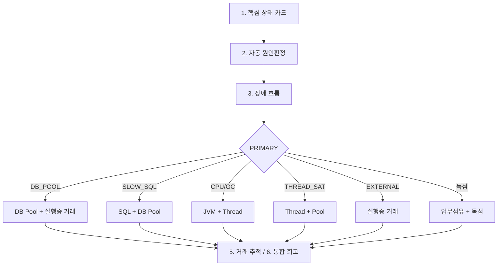

# 83. OM 런타임 진단 — 순서별 활용 가이드

> **NSIGHT TCF 개발 Manual** · 운영·장애 대응용 · 갱신: 2026-07-11  
> 관련: [82장 OM 런타임 진단 설명서](./82-OM-런타임-진단-설명서.md) · [46장 OM 운영관리](./46-OM-운영관리-개발.md) · [69장 장애 개발자 확인 항목](./69-장애-개발자-확인-항목.md)

---

## 83.1 한 줄 요약

장애·지연이 의심될 때 **“어디부터, 어떤 화면을, 무엇을 확인할지”**를 **진단 순서**에 맞춰 정리한 운영 가이드이다.  
설계 **14장(원인 우선순위)** · **15장(운영 화면)** · **19장(장애 흐름)** 과 같은 흐름을 따른다.

**권장 흐름:** 핵심 카드 → 자동 원인판정 → 장애 흐름 → PRIMARY별 심층 화면 → 실행 중 거래 추적.

**OM Admin 화면:** [`/om/admin/runtime-diagnosis-guide.html`](/om/admin/runtime-diagnosis-guide.html) — **순차 진단 위저드** (0→6단계, 단계별 실시간 데이터 + 다음/이전)

---

## 0단계: 전제

| 항목 | 내용 |
| --- | --- |
| **접속** | OM Admin (`tcf-ui`, 예: `8099`) → 좌측 **런타임 진단** 메뉴 |
| **갱신** | 대부분 30초 자동 새로고침 · **새로고침** 버튼으로 즉시 재조회 |
| **데이터** | 각 WAR `/internal/runtime/*` → tcf-om 통합 |
| **Tomcat** | Thread·JVM·Heap은 **공유** — WAR별로 나뉘지 않음 |
| **상세 조회** | 실행 중 거래·Slow SQL·Thread 등은 API body `includeDetails: Y` 필요 |

---

## 1단계: 30초 스냅샷 — “지금 이상한가?”

### 사용 화면: **핵심 상태 카드** (15.2)

**URL:** `/om/admin/runtime-status-cards.html`

**목적:** 8개 지표로 **1차 이상 여부**만 빠르게 확인.

**확인 순서 (카드 읽기):**

1. **DB Pool** — `50/50, Pending 48` → Connection 대기 1순위 의심
2. **Thread** — `690/800, 86%` → Tomcat 포화 여부
3. **JVM CPU / Heap / GC** — CPU·GC 압박 여부
4. **Slow 거래 / Slow SQL** — SQL·장기 거래 증가
5. **주요 업무** — `MG 70%` → 특정 업무 독점

**다음 분기:**

| 카드에서 보이는 것 | 다음 화면 |
| --- | --- |
| Pending↑, Pool 포화색 | → DB Pool 분석 (4-A) |
| Slow SQL↑ | → SQL 분석 (4-E) |
| CPU/Heap/GC 경고 | → JVM 분석 (4-B, 4-C) |
| Thread busy↑ | → Thread 분석 (4-D) |
| 특정 업무 점유↑ | → 독점·업무 점유 (4-G) |

**팁:** 상황실 모니터링은 이 화면만 켜 두고, 이상 시 2단계로 이동.

---

## 2단계: 공식 판정 — “원인 코드는 무엇인가?”

### 사용 화면: **자동 원인판정** (14장)

**URL:** `/om/admin/runtime-cause-analysis.html`

**목적:** tcf-om **PRIMARY Cause**와 **14.1 우선순위**로 공식 답 확인.

**판정 우선순위 (위에서 먼저 적용):**

```text
1 Deadlock          → THREAD_DEADLOCK
2 DB Pool 고갈      → DB_POOL_EXHAUSTED
3 GC 압박           → GC_PRESSURE
4 CPU 과부하        → CPU_OVERLOAD
5 Thread 포화       → THREAD_SATURATION
6 Slow SQL          → SLOW_SQL
7 외부 연계 지연    → EXTERNAL_WAIT
8 업무/ServiceId 독점
9 원인 불명         → UNKNOWN
```

**확인 방법:**

1. 상단 배너 — `CRITICAL` / `WARN` / `NORMAL`
2. **PRIMARY** 행(빨간 강조) — `primaryCauseCode` + 운영 메시지
3. **WAR별 1차 판정** — 어느 업무 WAR에서 먼저 터졌는지

**다음 분기 (PRIMARY 기준):**

| PRIMARY | 바로 갈 화면 |
| --- | --- |
| `DB_POOL_EXHAUSTED` | DB Pool 분석 (4-A) |
| `GC_PRESSURE` | JVM 분석 (4-B) |
| `CPU_OVERLOAD` | JVM 분석 → Thread 분석 (4-C) |
| `THREAD_SATURATION` | Thread 분석 (4-D) |
| `SLOW_SQL` | SQL 분석 (4-E) |
| `EXTERNAL_WAIT` | 실행 중 거래 (4-F) |
| `BUSINESS_*` / `SERVICE_DOMINANCE` | 독점·업무 점유 (4-G) |
| `UNKNOWN` | 런타임 진단 통합 + 거래·Thread 상세 (4-H) |

**팁:** 회의·보고용 “공식 원인”은 이 화면의 PRIMARY + 메시지를 기준으로 한다.

---

## 3단계: 장애 패턴 — “어떤 경로로 악화됐는가?”

### 사용 화면: **장애 흐름** (19장)

**URL:** `/om/admin/runtime-incident-flow.html`

**목적:** PRIMARY만으로 부족할 때, **단계별 인과** 확인 + **관련 화면 링크**.

**4가지 흐름 중 PRIMARY와 일치하는 카드**를 열고, **활성(노란) 단계**를 위→아래로 읽는다.

| 흐름 | 전형적 순서 | 카드 하단 링크 |
| --- | --- | --- |
| **19.1 DB Pool** | Connection 부족 → WAIT_DB → Pending → Busy Thread → 판정 | DB Pool, 실행 중 거래 |
| **19.2 Slow SQL** | Connection 정상 → EXECUTING_SQL 장시간 → Mapper 반복 → Pool Active → 판정 | SQL, DB Pool |
| **19.3 외부** | Pool/CPU/GC 정상 → WAIT_EXTERNAL → 외부코드 집중 → 판정 | 실행 중 거래 |
| **19.4 CPU** | Pending·외부 없음 → CPU≥90% → ServiceId CPU → 판정 | JVM, Thread, 독점 |

**활용:**

- 교육·RCA 문서 작성
- “Pool 문제인데 SQL처럼 보였다” 같은 **오진 방지** (19.1 vs 19.2 분기)

---

## 4단계: PRIMARY별 심층 분석

PRIMARY가 정해지면 **아래 순서대로** 해당 전용 화면을 본다.  
(여러 PRIMARY 후보가 겹치면 **14장 우선순위 숫자가 작은 쪽**부터.)

### 4-A. `DB_POOL_EXHAUSTED` (2순위)

| 순서 | 화면 | 확인 포인트 |
| --- | --- | --- |
| 1 | **DB Pool 분석** (9장) | Active=Max, Idle=0, Pending>0, 포화 메시지 |
| 2 | 같은 화면 9.3 | `WAIT_DB_CONNECTION` vs `EXECUTING_SQL` — **Pool 부족 vs SQL/Lock** |
| 3 | **실행 중 거래** (15.4) | 단계 `DB 대기` 건수·ServiceId |
| 4 | **업무 점유** (15.5) | 어느 업무 DB가 `50/50`인지 |
| 5 | **거래·Thread 상세** (12.3) | GUID·`dbWaitMs` |

**조치 방향:** Pool 크기, 장기 SQL 점유, 동시 거래 폭주(MG 등).

### 4-B. `GC_PRESSURE` (3순위)

| 순서 | 화면 | 확인 포인트 |
| --- | --- | --- |
| 1 | **JVM 분석** (8.3) | Heap≥80%, GC 시간, GC_PRESSURE 메시지 |
| 2 | **핵심 상태 카드** | Heap·GC 카드 재확인 |
| 3 | **Thread 분석** | GC로 인한 Thread 지연 동반 여부 |

**조치 방향:** Heap, GC 로그, 메모리 누수·대용량 객체 (전 WAR 공통 영향).

### 4-C. `CPU_OVERLOAD` (4순위)

| 순서 | 화면 | 확인 포인트 |
| --- | --- | --- |
| 1 | **JVM 분석** (8.2) | CPU≥90%, **DB Pending=0** (Pool 대기와 구분) |
| 2 | JVM **ServiceId Thread CPU** | CPU 많이 쓰는 ServiceId |
| 3 | **자원 독점** (11.3) | ServiceId 점유≥40% |
| 4 | **Thread 분석** | busy ratio |

**조치 방향:** 해당 ServiceId 로직, 루프·과다 연산, 배치 동시 실행.

### 4-D. `THREAD_SATURATION` (5순위)

| 순서 | 화면 | 확인 포인트 |
| --- | --- | --- |
| 1 | **Thread 분석** (7장) | busy≥85% **AND** slowTx≥5 |
| 2 | **DB Pool** | Pending>0이면 Thread만 늘리면 안 됨 → Pool 먼저 |
| 3 | **실행 중 거래** | 장기 점유 거래·단계 |
| 4 | **업무 점유** | 특정 업무 Thread 독점 |

**조치 방향:** maxThreads, 장기 거래, Pool/SQL/외부 대기 해소.

### 4-E. `SLOW_SQL` (6순위)

| 순서 | 화면 | 확인 포인트 |
| --- | --- | --- |
| 1 | **SQL 분석** (10장) | Slow SQL 이력, `EXECUTING_SQL` 실행 중 |
| 2 | **DB Pool** 9.3 | `EXECUTING_SQL` 장시간 — Lock·Slow SQL |
| 3 | **자동 원인판정** | `dominantSqlId` |
| 4 | **거래·Thread 상세** (12.4) | Mapper ID·elapsed |

**조치 방향:** 해당 Mapper/인덱스/실행 계획 (원문·Parameter는 화면에 없음 → DB·로그 추가 확인).

### 4-F. `EXTERNAL_WAIT` (7순위)

| 순서 | 화면 | 확인 포인트 |
| --- | --- | --- |
| 1 | **실행 중 거래** | 단계 `외부 대기`, `CREDIT-EAI` 등 |
| 2 | **장애 흐름** 19.3 | Pool/CPU/GC 정상 + WAIT_EXTERNAL |
| 3 | **거래·Thread 상세** (12.3) | `externalSystemCode` |

**조치 방향:** 해당 EAI/외부 API·타임아웃.

**참고:** `markExternalWait()` 미연동 WAR는 징후가 적게 나올 수 있다. (82.23 갭)

### 4-G. 독점 (`BUSINESS_*` / `SERVICE_DOMINANCE`) (8순위)

| 순서 | 화면 | 확인 포인트 |
| --- | --- | --- |
| 1 | **업무 점유** (15.5) | MG 70%, DB Active, Slow |
| 2 | **자원 독점** (11장) | 업무≥60%+busy≥80%, ServiceId≥40% |
| 3 | **실행 중 거래** | `MG.Message.sendBulk` 등 집중 ServiceId |
| 4 | **SQL / DB Pool** | 독점 업무의 Pool·SQL |

**조치 방향:** 해당 업무 트래픽 통제, 배치 분산, Pool/SQL 튜닝.

### 4-H. `UNKNOWN` (9순위)

| 순서 | 화면 | 확인 포인트 |
| --- | --- | --- |
| 1 | **런타임 진단** (통합) | WAR별 findings, reachable |
| 2 | **핵심 상태 카드** | 경계 징후 (Slow, busy 70%대 등) |
| 3 | **거래·Thread 상세** | raw 목록 전체 |
| 4 | DB·OS·네트워크 | 화면 밖 (AWR, DB lock, 방화벽) |

---

## 5단계: “어떤 거래?” — 현장 추적

PRIMARY·심층 분석 후 **담당자·ServiceId**까지 좁힐 때.

| 순서 | 화면 | 용도 |
| --- | --- | --- |
| 1 | **실행 중 거래** (15.4) | 가독성 좋은 **현재 막힌 거래** (단계 한글) |
| 2 | **업무 점유** (15.5) | **어느 WAR**가 대부분인지 |
| 3 | **거래·Thread 상세** (12장) | GUID, Thread명, Slow 이력, API 단위 raw |

**읽는 법 (15.4):**

- `SQL 실행` + SQL ID → Mapper/SQL 추적
- `DB 대기` → Pool (4-A)
- `외부 대기` + 코드 → 외부 연계 (4-F)

---

## 6단계: 통합·회고 — **런타임 진단** (허브)

**URL:** `/om/admin/runtime-diagnostics.html`

**언제 쓰나:**

- **처음** 한 번에 전체 그림 (카드 + findings + 표)
- **여러 화면** 오간 뒤 **한 화면에 모아** 확인
- 다른 화면으로 가는 **링크 허브**

심층 분석이 끝난 뒤 “지금 상태가 나아졌는지” 볼 때도 유용하다.

---

## 83.2 한 장 요약: “증상 → 화면” 빠른 표

| 처음 보이는 증상 | 1→2→3 화면 | 4단계 심층 |
| --- | --- | --- |
| 응답 전체 지연 | 카드 → 원인판정 → 장애흐름 | PRIMARY 따라 4-A~H |
| Pending만 큼 | 카드 DB → 원인판정 | DB Pool → 실행 중 거래 |
| CPU 100% | 카드 CPU → 원인판정 | JVM → 독점 |
| 특정 API만 느림 | 실행 중 거래 | SQL → DB Pool |
| MG만 느림 | 업무 점유 → 카드 | 독점 → SQL/Pool |

---

## 83.3 권장 타임라인 (실무 예)

```text
T+0   핵심 상태 카드 — Pending 48, MG 70% 확인
T+1   자동 원인판정 — PRIMARY: DB_POOL_EXHAUSTED
T+2   장애 흐름 19.1 — WAIT_DB → Pending 단계 활성 확인
T+3   DB Pool 분석 — WAIT_DB vs EXECUTING_SQL
T+4   실행 중 거래 — MG.Message.sendBulk, DB 대기 다수
T+5   업무 점유 — MG DB 50/50, Slow 42
T+6   (필요 시) 거래·Thread 상세 — GUID로 로그 상관
T+7   조치 후 — 카드 Pending↓ 확인 → 원인판정 NORMAL 복귀
```

---

## 83.4 역할별 대표 화면

| 역할 | 대표 화면 |
| --- | --- |
| **관제·모니터** | 핵심 상태 카드 |
| **1차 원인 확정** | 자동 원인판정 |
| **인과·교육·RCA** | 장애 흐름 |
| **영역별 전문** | Thread / JVM / DB Pool / SQL / 독점 |
| **거래·업무 추적** | 실행 중 거래 / 업무 점유 / 거래·Thread 상세 |
| **올인원 허브** | 런타임 진단 |

**원칙:**  
**카드(무엇)** → **원인판정(공식 답)** → **장애흐름(경로)** → **전용 화면(왜)** → **실행 중 거래(누구)** 순서를 지키면, 14장 우선순위와 맞게 진단할 수 있다.

---

## 83.5 OM Admin 화면 URL (base: `http://{host}:8099`)

| # | 메뉴명 | URL | 설계 |
| --- | --- | --- | --- |
| 1 | 런타임 진단 (통합) | `/om/admin/runtime-diagnostics.html` | 15장 허브 |
| 2 | **진단 순서 가이드** | `/om/admin/runtime-diagnosis-guide.html` | 83장 운영 |
| 3 | 핵심 상태 카드 | `/om/admin/runtime-status-cards.html` | 15.2 |
| 4 | 자동 원인판정 | `/om/admin/runtime-cause-analysis.html` | 14장 |
| 5 | 장애 흐름 | `/om/admin/runtime-incident-flow.html` | 19장 |
| 6 | Thread 분석 | `/om/admin/runtime-thread-analysis.html` | 7장 |
| 7 | JVM 분석 | `/om/admin/runtime-jvm-analysis.html` | 8장 |
| 8 | DB Pool 분석 | `/om/admin/runtime-dbpool-analysis.html` | 9장 |
| 9 | SQL 분석 | `/om/admin/runtime-sql-analysis.html` | 10장 |
| 10 | 자원 독점 분석 | `/om/admin/runtime-dominance-analysis.html` | 11장 |
| 11 | 실행 중 거래 | `/om/admin/runtime-active-transactions.html` | 15.4 |
| 12 | 업무 점유 현황 | `/om/admin/runtime-business-occupancy.html` | 15.5 |
| 13 | 거래·Thread 상세 | `/om/admin/runtime-transaction-detail.html` | 12장 |

---

## 83.6 진단 흐름도 (요약)



---

## 83.7 관련 문서

| 문서 | 용도 |
| --- | --- |
| [82-OM-런타임-진단-설명서.md](./82-OM-런타임-진단-설명서.md) | API·판정식·구현 상세 |
| [46-OM-운영관리-개발.md](./46-OM-운영관리-개발.md) | OM Admin·메뉴·인증 |
| [69-장애-개발자-확인-항목.md](./69-장애-개발자-확인-항목.md) | 화면 밖 확인 항목 |
