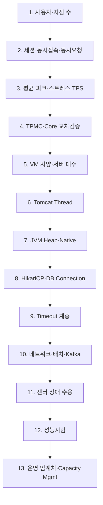
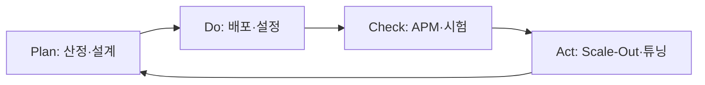

# NSIGHT 용량산정 전체 흐름

> 출처: `znsight-capacity-word` (환경셋팅·용량산정·Tomcat·JVM·Timeout·DB Pool·8CORE 전략 등)

용량산정은 **서버 대수만 계산하는 작업이 아닙니다.** 아래 13단계가 하나의 체인으로 연결되어야 하며, 어느 한 단계가 끊기면 운영 안정성을 검증할 수 없습니다.



---

## 1. 사용자·지점 수

### 핵심 질문
**누가 사용할 것인가?** — 전체 사용자와 설계 세션의 기준을 확정합니다.

### 산정식

```
전체 사용자 = 지점 수 × 지점당 사용자
```

### NSIGHT 1차 기준

| 항목 | 산식 | 값 |
|------|------|-----|
| 지점 수 | — | 3,600 |
| 지점당 사용자 | — | 6 |
| **전체 사용자** | 3,600 × 6 | **21,600** |

### 왜 먼저 확정하는가

이 값이 흔들리면 **세션 용량, 동시 요청자, TPS, AP 수량, DB Session 총량**이 모두 함께 흔들립니다. PMO·업무팀·인프라가 동일 숫자를 기준으로 판단하려면 여기서 합의가 필요합니다.

### tcf-ui 연동

- **CAP-010**: `branchCount`, `userPerBranch`, `totalUsers` (자동계산)
- **ENV-002**: `capBranchCount`, `capUsersPerBranch`, `capTotalUsers`

---

## 2. 세션·동시접속·동시요청

### 핵심 구분 (가장 중요)

| 개념 | 의미 | 용도 |
|------|------|------|
| **세션** | 로그인 상태 유지 규모 | Tomcat/Spring Session, L4 Sticky, Heap |
| **동시접속** | TCP/HTTP 연결 유지 | maxConnections, KeepAlive |
| **동시요청** | 실제로 거래 요청을 보내는 사용자 | **TPS·Thread·DB Pool 산정 기준** |

> 세션 수와 TPS는 **같은 값이 아닙니다.** 세션이 많아도 TPS가 낮을 수 있고, 반대로 짧은 시간 버스트만 TPS가 높을 수 있습니다.

### 설계 세션

```
설계 세션 = 전체 사용자 × (1 + 세션 여유율)
```

| 여유율 | 설계 세션 |
|--------|-----------|
| 20% | 25,920 |
| 30% | 28,080 |
| **권장** | **26,000 ~ 28,000** |

세션은 Tomcat Session, Spring Session, L4 Sticky Timeout, WebTopSuite Center 유지 정책과 함께 검토합니다.

### 동시 요청률 시나리오 (21,600명 기준)

| 시나리오 | 동시요청률 | 동시 요청자 | 의미 |
|----------|------------|-------------|------|
| 낮은 부하 | 3% | 648 | 평상시 |
| **기본 운영** | **5%** | **1,080** | 일반 피크 |
| **피크 설계** | **10%** | **2,160** | 업무 집중·캠페인 |
| **스트레스** | **15%** | **3,240** | 한계 검증·성능시험 |

```
동시 요청자 = ⌈전체 사용자 × 동시요청률%⌉
```

---

## 3. 평균·피크·스트레스 TPS

### 핵심 질문
**목표 응답시간 내 몇 건을 처리해야 하는가?**

### 산정식

```
목표 TPS = 동시 요청자 ÷ 목표 응답시간(초)
```

목표 응답시간은 **p95 3초 이하** (SLA). 평균 응답시간은 **1.0~1.5초** 수준으로 관리해야 250 TPS/VM 기준이 현실적입니다.

### TPS 시나리오표 (21,600명, 응답 3초)

| 시나리오 | 동시 요청자 | TPS | 용도 |
|----------|-------------|-----|------|
| 낮은 부하 (3%) | 648 | 216 | 참고 |
| **기본 운영 (5%)** | 1,080 | **360** | 일상 운영 기준 |
| **피크 설계 (10%)** | 2,160 | **720** | 설계 대표 기준 |
| **스트레스 (15%)** | 3,240 | **1,080** | 한계·성능시험 |

### CAP / ENV 화면

- CAP-020: 시나리오별 TPS·TPMC 표
- ENV-003: VM별 TPS·필요 VM 대수
- ENV-001 대시: 시나리오 12건(4요청률×3응답시간) 등급 집계

---

## 4. TPMC·CPU Core 교차검증

### 왜 필요한가

이론식 `1 TPS = 60 TPMC`는 Spring Boot 정보계 거래에는 **부적합**합니다. 전문 파싱, 인증, 로깅, RDW 조회, 마스킹이 포함되기 때문입니다.

### Core당 벤치마크 vs 실효 TPS

| 항목 | 값 |
|------|-----|
| Core당 벤치마크 | 106,932 TPMC |
| 이론 TPS/Core | 106,932 ÷ 60 ≈ 1,782 (참고만) |
| **실효 권장** | **Core당 30~40 TPS** |

### 업무 유형별 1 TPS당 TPMC

| 업무 유형 | TPMC/TPS | Core당 TPS (보수) |
|----------|----------|-------------------|
| 단순 API | 300~600 | — |
| 단순 조회 | 600~1,200 | — |
| 일반 정보계 | 1,200~2,000 | ~53 |
| **Single View** | **2,000~3,500** | **~35** |
| CruzAPIM 연계 | 2,500~5,000 | ~27 |
| 복합 업무 | 5,000+ | ~21 |

### 교차검증 산식

```
필요 TPMC = 목표 TPS × 1 TPS당 TPMC
필요 Core  = ⌈목표 TPS ÷ Core당 TPS⌉
Core TPMC/초 = Core당 TPS × TPMC/TPS
```

**NSIGHT 권장**: 1 TPS당 **2,500~3,500 TPMC** (Single View 기준 3,000), Core당 **35 TPS** → 8 Core VM **250 TPS/VM**.

### TPMC ↔ Core TPS 역연동

```
Core당 TPS = (기준 Core TPMC/초) ÷ TPMC/TPS
기준: 35 TPS @ 3,000 TPMC → Core TPMC/초 = 105,000
```

TPMC를 높이면 Core당 TPS가 낮아져 **같은 VM에서 처리 가능 TPS가 줄어듭니다.** ENV-001에서 위험 건수가 늘어나는 주요 원인 중 하나입니다.

---

## 5. VM 사양과 서버 대수

### VM 표준 (IaaS)

| 프로파일 | vCPU | Memory | VM당 TPS (보수) | 용도 |
|----------|------|--------|-----------------|------|
| **8CORE-32GB** | 8 | 32GB | **250** | **온라인 AP 표준** |
| 8CORE-64GB | 8 | 64GB | 250 | 메모리 여유 |
| 16CORE-64GB | 16 | 64GB | 500 | 중형 (제한 검토) |
| 32CORE-256GB | 32 | 256GB | — | 배치·BI·특수 AP |

### AP 수량 산정

```
필요 AP = ⌈목표 TPS ÷ VM당 처리 TPS⌉
A-A 배포 AP = 필요 AP × 2 (센터당)
```

### 250 TPS/VM 기준 (피크 720 TPS)

| 시나리오 | 목표 TPS | 최소 AP | A-A 총 AP | 센터 장애 감당 AP |
|----------|----------|---------|-----------|-------------------|
| 기본 360 | 360 | 2 | 4 | 4 (잔여 500 TPS) |
| **피크 720** | 720 | 3 | 6 | **6~8** (N+1 권장) |
| 스트레스 1080 | 1,080 | 5 | 10 | 10~12 |

### 8CORE vs 16CORE 전략 (동일 64C/256GB)

| 구분 | 8CORE × 8대 | 16CORE × 4대 |
|------|-------------|--------------|
| VM 1대 장애 영향 | **12.5%** | 25% |
| DB Pool 분산 | 작은 단위 | VM당 Pool 큼 |
| 장애 분석·GC | 용이 | Heap/덤프 부담 |
| **권장** | **온라인·SingleView** | 배치·BI·ETL 일부 |

---

## 6. Tomcat Thread

### 산정 원칙

**p95 3초를 직접 곱하지 않습니다.** Thread는 **평균 응답시간** 기준으로 산정하고, p95 3초는 성능 **목표**로 관리합니다.

```
총 Thread = 목표 TPS × 평균 Thread 점유(초) × Thread 여유율
VM당 Thread = ⌈총 Thread ÷ AP 수⌉
maxThreads  = VM당 Thread × maxThreads 배율 (1.2~1.3)
```

### 예시 (250 TPS/VM, 점유 1.2초, 여유 1.2)

```
총 Thread = 250 × 1.2 × 1.2 = 360
→ maxThreads 400~500 (8CORE 표준)
```

### 8CORE / 32GB 권장값

| 항목 | 권장값 |
|------|--------|
| maxThreads | 400~500 |
| minSpareThreads | 100 |
| acceptCount | 300~500 |
| maxConnections | 10,000 |
| connectionTimeout | 8초 |
| keepAliveTimeout | 120초 |

### 주의

Thread만 늘리면 성능이 오르지 않습니다. **DB Pool 대기, SQL 지연, GC Pause, 외부연계 대기**가 먼저 해결되어야 합니다.

---

## 7. JVM Heap·Native Memory

### Heap 설계 (8CORE / 32GB VM)

| AP 유형 | Xms / Xmx | 비고 |
|---------|-----------|------|
| 일반 마케팅 AP | **12GB** | Scale-Out 표준 |
| SingleView AP | **14GB** | 조회·객체 생성량 보정 |

### 메모리 구성 (32GB VM)

| 구성 요소 | 8CORE 권장 | 설명 |
|-----------|------------|------|
| Java Heap | 12~14GB | Xms=Xmx 동일 권장 |
| Thread Stack | -Xss512k | Thread 수와 함께 산정 |
| Metaspace | Max 1GB | |
| OS·Native·APM | **14~18GB 여유** | 과대 Heap 금지 |

### GC (G1GC 표준)

```
-XX:+UseG1GC
-XX:MaxGCPauseMillis=200
```

GC Pause도 **사용자 응답시간에 포함**됩니다. p95 3초 목표에서는 GC Pause p95 **200ms 이하** 관리.

### 세션 저장 금지 항목

고객 조회 결과, 캠페인 대상 목록, Single View 결과 → **세션 저장 금지** (Heap·DeltaManager 복제 부담).

### Native Memory

Thread Stack, Direct Buffer, Metaspace, APM Agent가 Heap 외 메모리를 사용합니다. `maxThreads` 증가 시 `-Xss`와 함께 OS 여유 메모리를 재검증합니다.

---

## 8. HikariCP·DB Connection

### 핵심 원칙

```
DB Pool ≠ SQL 실행시간
connectionTimeout = Pool에서 Connection 획득 대기 (2~3초)
SQL 실행 한도     = MyBatis statement timeout (2~3초)
```

### DB Pool 산정식 (4단계)

```
① AP TPS        = 목표 TPS ÷ AP 수
② 산출 Pool     = ⌈AP TPS × DB점유(초) × DB비율 × Pool안전계수⌉
③ 상한 Pool     = ⌈WAS Thread × Thread→DB%⌉
⑤ 용량 권장     = min(②, ③)
④ 배포 Pool     = max(운영최소, ⑤)   ← maximumPoolSize
```

### 8CORE / 250 TPS 예시 (DB 점유 0.15초)

| 단계 | 계산 | 결과 |
|------|------|------|
| ② 산출 | 250 × 0.15 × 1.0 × 1.3 | ≈ 49 → **50** |
| ③ 상한 | 360 Thread × 30% | 108 |
| ④ 배포 | max(30, min(50, 108)) | **50** |

### AP 유형별 권장 maximumPoolSize

| AP 유형 | Pool/VM |
|---------|---------|
| 일반 마케팅 AP | 40~50 |
| SingleView AP | 50~60 |

### DB Session 총량

```
DB Pool 총량 = AP 수 × AP당 maximumPoolSize × DataSource 수
DB Session 총량 = Pool 총량 + 배치 + BI + ETL + 운영 + 여유율
```

RDW와 ADW는 **역할이 다르므로 별도 산정**합니다. Pool을 무조건 키우기보다 SQL 튜닝·ADW 분리·Fetch Size 조정을 먼저 검토합니다.

---

## 9. Timeout 계층

### 핵심 원칙

**안쪽 자원부터 짧게 실패**시켜 장애 전파를 차단합니다.

```
DB Query (2~3초)
  < Hikari connectionTimeout (3초)
  < Spring @Transactional (4~5초)
  < Proxy Read (10초)
  < WebTopSuite Request (15초)
  < L4 Idle (120초)
  < Session Idle (60분) / Absolute (8~12시간)
```

### 권장값 요약

| 계층 | 항목 | 권장값 |
|------|------|--------|
| DB | MyBatis statement timeout | **3초** |
| Pool | Hikari connectionTimeout | **3초** |
| AP | Spring Transaction | **4~5초** |
| Proxy | Read / Connect | **10초 / 3초** |
| 단말 | WebTopSuite Request | **15초** |
| L4 | Health Check | 5초 간격 / 2초 timeout / 3회 fail |
| L4 | Sticky Timeout | Session + 10분 (예: 70분) |
| 연계 | CruzAPIM Connect / Read | **3초 / 5초** |

### Timeout 후 재처리

동기 거래는 **무조건 재시도 금지**. GUID·IdempotencyKey로 **거래 상태 조회** 후 처리.

### 10초 이상 동기 처리

온라인에서 **금지** → 비동기·배치·결과조회 API로 전환.

---

## 10. 네트워크·스토리지·배치·Kafka

### 네트워크 / L4 / Proxy

| 영역 | 핵심 설정 |
|------|-----------|
| GSLB | DNS TTL 30~60초 (센터 장애 시 재조회) |
| L4 | Sticky(JSESSIONID), Idle 120초, Health Check |
| Apache/Nginx | proxy_connect 3s, proxy_read 10s |
| KeepAlive | Tomcat·Proxy·L4 정합 (120초) |

E2E 추적: **X-GUID** Header를 단말~Proxy~AP~DB~연계까지 전달.

### 스토리지

- Heap Dump: `/logs/dump` (디스크 여유 필수)
- GC Log: `/logs/gc` (회전 정책)
- Access Log: GUID, 응답시간(D), X-Forwarded-For

### 배치 / ETL / DataStage

| 항목 | 관리 단위 |
|------|-----------|
| Job Timeout | 30분~2시간 (업무별) |
| Step Timeout | 10분 (단계별) |
| Batch Window | 00:00~06:00 (온라인 영향 방지) |
| Long Running Alert | duration > threshold |

온라인 Transaction Timeout과 **별도 체계**. Timeout은 실패 처리가 아니라 **운영 판단 기준** (Kill/대기/재처리 R&R).

### Kafka / CDC (FAST 흐름)

| 항목 | 권장 | 모니터링 |
|------|------|----------|
| producer request.timeout.ms | 30초 | — |
| consumer session.timeout.ms | 30초 | Consumer 장애 |
| max.poll.interval.ms | 업무별 | 처리 지연 |
| DLQ | **필수** | 반복 실패 격리 |
| Consumer Lag | 업무별 임계치 | 이벤트 지연 |

Kafka Timeout은 사용자 동기 응답과 **다른 기준**으로 관리합니다.

### RDW vs ADW 역할 분리

| DB | 용도 | 온라인 SQL |
|----|------|------------|
| **RDW** | 현행성·Single View 조회 | timeout 2~3초 |
| **ADW** | 분석·집계·BI | RDW 금지, 비동기 |

---

## 11. 센터 장애 수용량

### 검증 질문

**1개 센터가 내려가도 목표 TPS를 감당하는가?**

```
센터 장애 후 잔여 TPS = 잔여 센터 AP 수 × VM당 TPS
센터 장애 후 잔여 Pool = 잔여 AP 수 × Pool/VM
```

### 피크 720 TPS / 250 TPS·VM 기준

| 구성 | 센터별 AP | 센터 장애 후 AP | 잔여 TPS | 판정 |
|------|-----------|---------------|----------|------|
| 최소 | 3대/센터 | 3대 | 750 | 조건부 충족 |
| **권장** | **4대/센터** | **4대** | **1,000** | **충분** |
| 스트레스 1080 | 5~6대/센터 | 5~6대 | 1,250~1,500 | 권장 |

### AP 1대 vs 센터 장애

| 장애 유형 | 8CORE×8 | 16CORE×4 |
|-----------|---------|----------|
| VM 1대 | 12.5% 손실 | 25% 손실 |
| 센터 전체 | GSLB 재조회·재로그인 정책 | 동일 |

센터 간 세션 복제는 **기본 미적용**. 센터 내부는 DeltaManager(2~4노드) 검토.

### DR 옵션 (CAP-030)

- 2센터 Active-Active: 센터당 필요 AP×2로 총 배포 대수 산출
- DR 검증: 1센터 장애 시 목표 TPS 감당 여부

---

## 12. 성능시험

### 필수 시나리오

| 시나리오 | 목표 TPS | 합격 기준 (요약) |
|----------|----------|------------------|
| 기본 부하 | 360 | p95 ≤ 3초, CPU ≤ 70%, GC Pause p95 ≤ 200ms |
| 피크 설계 | 720 | Thread/Pool 고갈 없음, 오류율 기준 이하 |
| 스트레스 | 1,080 | 한계점·Fail-fast·Circuit Breaker 동작 확인 |
| AP 1대 Down | — | L4 제외, 서비스 지속 |
| DB SQL 지연 | — | SQL Timeout → Thread 회수 |
| CruzAPIM 지연 | — | Read 5초, CB 동작 |
| 센터 장애 | — | 잔여 TPS ≥ 목표 TPS |
| 3시간 세션 | — | Heap·GC 급증 없음 |

### 측정 항목 (평균 TPS만 보면 안 됨)

- p95 / p99 응답시간
- Tomcat Busy Thread, acceptCount 대기
- Hikari Active / Pending / Wait
- SQL p95, DB Pool 사용률
- GC Pause, Heap 사용률
- 5xx / Timeout 오류율
- Consumer Lag (이벤트)

### 대표 거래 기준

Single View 대표거래, 일반 마케팅 조회, CruzAPIM 연계 거래를 각각 실측하여 **TPMC, Thread, Pool, GC, SQL Time**을 보정합니다.

### tcf-ui 검증 경로

1. `/oc/capacity.html` — CAP 산정 후 시나리오별 표·Tomcat 스니펫 확인
2. `/oc/env-002.html` — ENV 조건 산정 실행
3. `/oc/rule-check.html` — 설정 파일 업로드·Rule 점검
4. `/oc/check.html` — 종합 보고서

---

## 13. 운영 임계치와 Capacity Management

### 모니터링 Warning / Critical

| 항목 | Warning | Critical | 조치 |
|------|---------|----------|------|
| p95 응답시간 | > 3초 | > 5초 | SQL·Pool·GC·연계 분석 |
| Heap 사용률 | > 70% | > 85% | 세션·캐시·Leak |
| GC Pause p95 | > 200ms | > 500ms | Heap·객체·SQL |
| Tomcat Busy Thread | > 70% | > 90% | Thread Dump |
| Hikari Active | > 70% | > 90% | SQL·Pool |
| Hikari Pending | 증가 추세 | 지속 > 0 | Pool·SQL |
| CPU | > 70% | > 85% | Scale-Out |
| Timeout 오류율 | > 0.1% | > 0.5% | GUID 추적 |
| Circuit Breaker | — | Open | 연계 장애 |
| Kafka Lag | 업무별 | Critical | Consumer·DLQ |
| Batch Duration | 계획 120% | — | 후속 Job 통제 |

### Capacity Management 운영 루프



1. **Plan** — 13단계 산정표·환경설정 기준안 확정
2. **Do** — Tomcat·JVM·Hikari·Timeout 표준 적용
3. **Check** — 360/720/1080 시험 + 일상 APM
4. **Act** — AP 증설, SQL 튜닝, Pool 보정, 업무 비동기화

### 최종 승인용 산정표 (한 줄 연결)

| 구분 | 사용자 | 요청률 | 동시요청 | TPS | VM TPS | AP | Pool/VM | Pool 합 | 장애후 TPS | 판정 |
|------|--------|--------|----------|-----|--------|-----|---------|---------|------------|------|
| 기본 | 21,600 | 5% | 1,080 | 360 | 250 | 4 | 50 | 200 | 500 | 충족 |
| 피크 최소 | 21,600 | 10% | 2,160 | 720 | 250 | 6 | 50 | 300 | 750 | 조건부 |
| 피크 권장 | 21,600 | 10% | 2,160 | 720 | 250 | 8 | 50 | 400 | 1,000 | 권장 |
| 스트레스 | 21,600 | 15% | 3,240 | 1,080 | 250 | 10~12 | 50 | 500~600 | 1,250+ | 시험 |

### 운영 검증 체크리스트

- [ ] 사용자·세션·동시요청·TPS가 **산식으로 연결**되는가
- [ ] TPMC·Core TPS·VM TPS가 **교차검증**되었는가
- [ ] 센터 장애 시 **잔여 TPS ≥ 목표 TPS**인가
- [ ] DB Pool·Session **총량**이 DBA 한도 내인가
- [ ] Timeout **계층 순서**가 맞는가
- [ ] 성능시험·장애시험 **결과가 문서화**되었는가
- [ ] APM에 Heap·GC·Thread·Pool·GUID **지표가 등록**되었는가

---

## 부록 A. 전체 산정 체인 (한 페이지 요약)

```
[1] 전체 사용자 = 지점 × 지점당 사용자
[2] 설계 세션 = 전체 사용자 × (1 + 여유율)
[3] 동시 요청자 = 전체 사용자 × 동시요청률
[4] 목표 TPS = 동시 요청자 ÷ 응답시간(초)
[5] 필요 TPMC = TPS × TPMC/TPS
[6] 필요 AP = ⌈TPS ÷ VM당 TPS⌉  (A-A 시 ×2)
[7] WAS Thread = TPS × 점유시간 × 여유율
[8] DB Pool = f(AP TPS, 점유, Thread 상한, 운영최소)
[9] DB Session = Σ(AP × Pool) + 배치 + BI + 여유
[10] Timeout·JVM·Tomcat·L4·Kafka 표준 적용
[11] 장애 후 잔여 TPS·Pool 검증
[12] 성능시험으로 실측 보정
[13] 운영 임계치·Capacity Management 지속 운영
```

## 부록 B. 환경설정 최종 요약표

| 영역 | 핵심 권장값 |
|------|-------------|
| VM | 8 vCPU / 32GB |
| VM당 TPS | 250 |
| TPS 목표 | 360 / 720 / 1,080 |
| p95 응답 | 3초 이하 |
| Tomcat maxThreads | 400~500 |
| Hikari Pool | 일반 50 / SV 60 |
| Transaction | 4~5초 |
| JVM Heap | 일반 12GB / SV 14GB |
| GC | G1GC, Pause 목표 200ms |
| Session Idle | 60분 (예외 180분 검토) |

---

*본 문서는 선도개발·성능시험 전 **표준 기준선**입니다. 최종 확정은 Single View 대표거래 실측과 운영 모니터링으로 보정합니다.*
