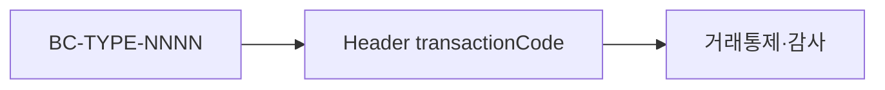

# 부록 C. 거래코드 명명규칙 요약

| 항목 | 내용 |
| --- | --- |
| **부록** | C |
| **상태** | Master Edition (ztcfbook-h) |
| **목차** | [00-목차](../00-목차.md) |

---

## 아키텍처 뷰



---

## Master 해설

부록 C 거래코드 `{BC}-{TYPE}-{NNNN}`은 StandardHeader transactionCode, 감사로그, 거래통제 OM TCF_TX_CONTROL, Catalog processingType(INQ/REG/UPD/DEL)과 연결됩니다. 하나의 ServiceId에 여러 거래코드(1:N)를 둘 수 있어 화면·채널별 감사 granularity를 조정합니다.

STF Header 검증에서 transactionCode 형식 불일치는 E-TCF-HDR-002 등으로 조기 fail하며 Handler DB access 전에 차단됩니다. Catalog lifecycle state machine(설계·승인·운영)과 거래코드 TYPE enum은 OM 등록 절차(znsight-man 17·48)와 동기됩니다.

설계 단계에서 신규 TYPE(예: APR 승인) 추가 시 부록 C row·OM enum·거래통제 policy·감사로그 필드 mapping을 세트로 작성합니다. ServiceId만 등록하고 transactionCode를 임의 문자열로 두면 운영 감사·통계가 깨집니다.

코드 리뷰·운영: Header transactionCode vs TCF_TX_LOG·audit log field, negative test wrong TYPE, Catalog NNNN sequence collision check.

---

## 구현 샘플 (코드베이스)

### StandardHeader transactionCode

```java
package com.nh.nsight.tcf.core.support.message;

import com.fasterxml.jackson.annotation.JsonAlias;
import java.io.Serializable;
import java.time.OffsetDateTime;
import java.time.format.DateTimeFormatter;
import java.util.Objects;

public class StandardHeader implements Serializable {
    private String systemId;
    private String businessCode;
    private String serviceId;
    private String serviceName;
    private String transactionCode;
    private String processingType;
    private String guid;
    private String traceId;
    private String channelId;
    @JsonAlias("user")
    private String userId;
    @JsonAlias("branch")
    private String branchId;
    private String centerId;
    private String requestTime;
    private String clientIp;
    private String idempotencyKey;

    public void normalize() {
        if (systemId == null || systemId.isBlank()) {
            systemId = "NSIGHT-MP";
        }
        if (requestTime == null || requestTime.isBlank()) {
            requestTime = OffsetDateTime.now().format(DateTimeFormatter.ISO_OFFSET_DATE_TIME);
        }
        if (businessCode != null) {
            businessCode = businessCode.trim().toUpperCase();
        }
        if (processingType != null) {
            processingType = processingType.trim().toUpperCase();
        }
    }

    /** STF 처리 전 클라이언트 Header 값 보존용 복사본. */
    public static StandardHeader copyOf(StandardHeader source) {
        if (source == null) {
            return null;
        }
        StandardHeader copy = new StandardHeader();
        copy.setSystemId(source.getSystemId());
        copy.setBusinessCode(source.getBusinessCode());
```

원본: [`tcf-core/src/main/java/com/nh/nsight/tcf/core/support/message/StandardHeader.java`](../tcf-core/src/main/java/com/nh/nsight/tcf/core/support/message/StandardHeader.java)

### TransactionControlService

```java
package com.nh.nsight.tcf.core.support.control;

import com.nh.nsight.tcf.core.config.TcfProperties;
import com.nh.nsight.tcf.core.support.error.BusinessException;
import com.nh.nsight.tcf.core.support.error.ErrorCode;
import com.nh.nsight.tcf.core.support.message.StandardHeader;
import com.nh.nsight.tcf.core.support.TcfConsoleLog;
import java.util.Optional;
import org.slf4j.Logger;
import org.slf4j.LoggerFactory;
import org.springframework.beans.factory.ObjectProvider;
import org.springframework.stereotype.Service;

@Service
public class TransactionControlService {
    private static final Logger log = LoggerFactory.getLogger(TransactionControlService.class);

    private final TcfProperties properties;
    private final TransactionControlValidator validator;
    private final ObjectProvider<TransactionControlRepository> repositoryProvider;

    public TransactionControlService(TcfProperties properties,
                                     TransactionControlValidator validator,
                                     ObjectProvider<TransactionControlRepository> repositoryProvider) {
        this.properties = properties;
        this.validator = validator;
        this.repositoryProvider = repositoryProvider;
    }

    public void check(StandardHeader header) {
        if (!properties.isTransactionControlEnabled()) {
            return;
        }
        if (header != null && TransactionControlExemptions.isExempt(header.getServiceId())) {
            log.debug("Transaction control skipped for exempt service. serviceId={}", header.getServiceId());
            return;
        }
        TcfConsoleLog.boundary("TransactionControlService", "check", "START");
        TransactionControlHeader controlHeader = TransactionControlHeader.from(header);
        validator.validateRequired(controlHeader);
```

원본: [`tcf-core/src/main/java/com/nh/nsight/tcf/core/support/control/TransactionControlService.java`](../tcf-core/src/main/java/com/nh/nsight/tcf/core/support/control/TransactionControlService.java)

---

## Master Deep Dive — 부록 C · 거래코드

- ServiceId 1:N 거래코드 가능
- TYPE: INQ/REG/UPD/DEL 등
- Catalog 상태머신과 연동
- E-TCF-HDR-002 transactionCode 검증

### 아키텍트 체크리스트

- 상단 **구현 샘플**을 실제 코드와 대조한다.
- **심화 참고**와 ztcfbook 본문 절 번호를 매핑한다.
- 운영·배포 관점은 ztcfbook-h Master 블록을 우선 본다.

---

## 심화 참고 (Master)

- [znsight-man/부록C-거래코드-명명규칙.md](../znsight-man/부록C-거래코드-명명규칙.md)
- [zdoc/applicationNaming.md](../zdoc/applicationNaming.md)

---

## C.1 거래코드의 역할

거래코드(TransactionCode)는 NSIGHT TCF에서 **운영·감사·재처리·장애추적 관점의 거래 식별 번호**이다. ServiceId가 "어떤 Handler를 실행했는가"를 나타낸다면, 거래코드는 "어떤 거래 유형으로 기록·통제할 것인가"를 나타낸다. 거래로그 테이블의 `TRANSACTION_CODE` 컬럼, 감사로그, 거래통제 Allow-List, Timeout 정책이 모두 이 값을 기준으로 연결된다.

HTTP/JSON 표준 전문에서는 URL이 `POST /{businessCode}/online`으로 단순화되어 있다. 업무 식별은 `serviceId` + `transactionCode` + `processingType` 조합으로 수행하고, End-to-End 추적은 `guid`와 `traceId`가 담당한다. 운영자가 OM 거래조회 화면에서 "SV-INQ-0001 거래만 필터"할 때 사용하는 키가 바로 거래코드이다.

```text
업무코드 (businessCode)
        ↓
ServiceId (실행 Handler)
        ↓
TransactionCode (거래 로그·감사·재처리)
        ↓
거래통제 / Timeout / processingType 검증
        ↓
거래로그 · 감사로그
        ↓
재처리 · 장애추적 (GUID + TransactionCode)
```

거래코드를 임의 문자열로 두면 동일 ServiceId라도 로그 집계 기준이 흔들리고, 거래통제 정책을 ServiceId 단위로만 관리해야 하는 비효율이 생긴다. 따라서 거래코드는 부록 A 업무코드와 부록 B ServiceId와 함께 **개발 착수 전에 발급**한다.

---

## C.2 거래코드 기본 형식

```text
{업무코드}-{거래유형}-{일련번호}
```

| 구성요소 | 자리수 | 표기 | 설명 | 예시 |
| --- | --- | --- | --- | --- |
| 업무코드 | 2~3 | 대문자 | 부록 A 표준표 | SV, CM, OM, BAT |
| 구분자 | 1 | `-` | 고정 | - |
| 거래유형 | 3 | 대문자 | 처리유형 약어 | INQ, CRT, UPD |
| 구분자 | 1 | `-` | 고정 | - |
| 일련번호 | 4 | 숫자 | 업무+유형 내 순번 | 0001 |

**형식 예시**

| 거래코드 | 의미 |
| --- | --- |
| SV-INQ-0001 | SV 업무 조회 1번 |
| CM-CRT-0001 | CM 업무 등록 1번 |
| CM-UPD-0001 | CM 업무 수정 1번 |
| MG-SND-0001 | MG 메시지 발송 |
| OM-ADM-0001 | OM 관리자 기능 |
| OM-BAT-0001 | OM 배치 실행 |
| BAT-EXE-0001 | 배치 Job 실행 (BAT 업무코드) |

하이픈 외 구분자(`_`, `.`)나 소문자, 한글 유형명은 허용하지 않는다. 일련번호는 항상 4자리 zero-padding이다 (`0001`, `0123`).

---

## C.3 ServiceId와의 관계

| 구분 | 역할 | 예시 |
| --- | --- | --- |
| businessCode | 업무 WAR / Context 식별 | SV |
| serviceId | 실행 Handler 식별 | SV.Customer.selectSummary |
| transactionCode | 거래로그·감사·재처리 식별 | SV-INQ-0001 |

권장 정합성 규칙은 다음과 같다.

- `businessCode` + `transactionCode` → 업무 거래 식별
- `serviceId` → 실행 프로그램 식별
- `serviceId` + `transactionCode` → Catalog 매핑으로 실행·로그 정합성 검증

하나의 ServiceId에 대표 거래코드가 하나 매핑되는 것이 일반적이다. 동일 Handler가 조회·변경을 모두 처리하는 안티패턴은 피하고, 조회용·변경용 ServiceId와 거래코드를 분리한다.

---

## C.4 거래유형 코드 표준

| 거래유형 | 코드 | 의미 | 거래코드 예시 |
| --- | --- | --- | --- |
| 조회 | INQ | 단건·목록·요약 조회 | SV-INQ-0001 |
| 등록 | CRT | 신규 생성 | CM-CRT-0001 |
| 수정 | UPD | 기존 데이터 변경 | CM-UPD-0001 |
| 삭제 | DEL | 삭제·사용중지 | OM-DEL-0001 |
| 저장 | SAV | 등록·수정 통합 | OM-SAV-0001 |
| 실행 | EXE | 배치·캠페인·룰 실행 | CM-EXE-0001 |
| 검증 | CHK | 규칙·권한·상태 검증 | EB-CHK-0001 |
| 발송 | SND | 메시지·알림 발송 | MG-SND-0001 |
| 업로드 | UPL | 파일 업로드 | UD-UPL-0001 |
| 다운로드 | DWN | 파일·엑셀 다운로드 | UD-DWN-0001 |
| 승인 | APR | 승인 처리 | CM-APR-0001 |
| 취소 | CAN | 실행·승인 취소 | CM-CAN-0001 |
| 재처리 | RTY | 실패·Timeout 재처리 | OM-RTY-0001 |
| 배치 | BAT | 배치 Job 관리·실행 | OM-BAT-0001 |
| 관리자 | ADM | 운영관리 기능 | OM-ADM-0001 |
| 인증 | AUT | 로그인·SSO·토큰 | OM-AUT-0001 |
| 시스템 | SYS | Health·환경설정 | OM-SYS-0001 |

신규 거래유형이 필요하면 표준에 추가 등록 후 사용한다. `SELECT`, `INSERT` 같은 DB 용어나 한글 약어는 거래유형으로 쓰지 않는다.

---

## C.5 processingType 매핑

Header `processingType`은 프레임워크·STF가 이해하는 처리유형 열거값이다. 거래유형 코드와 다음처럼 매핑한다.

| processingType | 거래유형 | 설명 | 예시 |
| --- | --- | --- | --- |
| INQUIRY | INQ | 조회 | SV-INQ-0001 |
| CREATE | CRT | 등록 | CM-CRT-0001 |
| UPDATE | UPD | 수정 | CM-UPD-0001 |
| DELETE | DEL | 삭제 | OM-DEL-0001 |
| SAVE | SAV | 통합 저장 | OM-SAV-0001 |
| EXECUTE | EXE / BAT | 실행·배치 | CM-EXE-0001, OM-BAT-0001 |
| DOWNLOAD | DWN | 다운로드 | UD-DWN-0001 |
| UPLOAD | UPL | 업로드 | UD-UPL-0001 |
| APPROVAL | APR | 승인 | CM-APR-0001 |
| CANCEL | CAN | 취소 | CM-CAN-0001 |

STF는 `processingType`과 Catalog의 `PROCESSING_TYPE`·거래코드의 거래유형이 불일치하면 `E-TCF-TRX-0004`류 오류를 반환한다. 예: `transactionCode: SV-DWN-0001`인데 `processingType: INQUIRY`는 금지.

---

## C.6 업무별 거래코드 예시

| 업무코드 | 업무명 | ServiceId | 거래코드 | 설명 |
| --- | --- | --- | --- | --- |
| CC | 공통 | CC.Code.selectList | CC-INQ-0001 | 공통코드 목록 |
| IC | 통합고객 | IC.Customer.selectIntegration | IC-INQ-0001 | 통합고객 조회 |
| PC | 개인고객 | PC.Customer.selectPrivate | PC-INQ-0001 | 개인고객 조회 |
| BC | 기업고객 | BC.Customer.selectBusiness | BC-INQ-0001 | 기업고객 조회 |
| MS | 미니SV | MS.Customer.selectSummary | MS-INQ-0001 | 고객 요약 |
| SV | 싱글뷰 | SV.Customer.selectSummary | SV-INQ-0001 | 고객 요약 조회 |
| PD | 상품 | PD.Product.selectDetail | PD-INQ-0001 | 상품 상세 |
| CM | 캠페인 | CM.Campaign.selectList | CM-INQ-0001 | 캠페인 목록 |
| CM | 캠페인 | CM.Campaign.create | CM-CRT-0001 | 캠페인 등록 |
| CM | 캠페인 | CM.Campaign.update | CM-UPD-0001 | 캠페인 수정 |
| EB | EBM | EB.Rule.checkEvent | EB-CHK-0001 | 룰 검증 |
| EP | 이벤트 | EP.Event.process | EP-EXE-0001 | 이벤트 처리 |
| BP | 행동처리 | BP.Behavior.process | BP-EXE-0001 | 행동정보 처리 |
| BD | 행동데이터 | BD.Behavior.selectData | BD-INQ-0001 | 데이터 조회 |
| SS | 영업지원 | SS.Sales.selectSupport | SS-INQ-0001 | 영업지원 조회 |
| CS | 공통서비스 | CS.Common.selectService | CS-INQ-0001 | 공통서비스 |
| CT | 콘텐츠 | CT.Contents.selectList | CT-INQ-0001 | 콘텐츠 목록 |
| MG | 메시지 | MG.Message.send | MG-SND-0001 | 메시지 발송 |
| OM | 운영 | OM.User.inquiry | OM-ADM-0001 | 사용자 조회 |
| UD | 파일 | UD.File.download | UD-DWN-0001 | 파일 다운로드 |
| BAT | 배치 | BAT.ApStatus.collect | BAT-EXE-0001 | AP 상태 수집 |

---

## C.7 일련번호 부여·잘못된 예시

일련번호는 **업무코드 + 거래유형** 단위로 0001부터 증가한다. 중간 번호 재사용·폐기 코드 재활용은 금지한다.

```text
SV-INQ-0001 → SV-INQ-0002 → SV-INQ-0003
CM-CRT-0001 → CM-CRT-0002
CM-UPD-0001 → CM-UPD-0002
```

| 기준 | 설명 |
| --- | --- |
| 채번 단위 | 업무코드 + 거래유형 |
| 번호 형식 | 4자리 숫자, 0001 시작 |
| 재사용 | 폐기(DEPRECATED) 번호 재사용 금지 |
| 유사 거래 | 기존 번호 대신 신규 번호 발급 |
| 테스트 | 운영 거래코드와 분리 (별도 Catalog 또는 DRAFT) |

| 잘못된 거래코드 | 문제 | 표준 예시 |
| --- | --- | --- |
| SV-1 | 유형·자리수 없음 | SV-INQ-0001 |
| SV-SELECT-0001 | 비표준 거래유형 | SV-INQ-0001 |
| sv-inq-0001 | 소문자 | SV-INQ-0001 |
| SV_INQ_0001 | 구분자 위반 | SV-INQ-0001 |
| SV-INQ-1 | 일련번호 자리수 | SV-INQ-0001 |
| CUSTOMER-INQ-0001 | 업무코드 위반 | SV-INQ-0001 |
| SV-INQ-0001-A | 임의 Suffix | 신규 코드 발급 |

---

## C.8 Catalog 관리

거래코드는 `TCF_TRANSACTION_CATALOG`(또는 OM 동등 테이블)에서 관리한다.

| 항목 | 설명 | 예시 |
| --- | --- | --- |
| TRANSACTION_CODE | 거래코드 | SV-INQ-0001 |
| BUSINESS_CODE | 업무코드 | SV |
| SERVICE_ID | 연결 ServiceId | SV.Customer.selectSummary |
| TRANSACTION_NAME | 거래명 | 고객 요약 조회 |
| PROCESSING_TYPE | processingType | INQUIRY |
| TRANSACTION_TYPE | 거래유형 | INQ |
| AUDIT_REQUIRED_YN | 감사 | Y |
| RETRY_ALLOWED_YN | 재처리 허용 | N |
| TIMEOUT_POLICY_ID | Timeout 정책 | SV-INQ-0001-TM |
| USE_YN | 사용 | Y |
| TRANSACTION_STATUS | 상태 | ACTIVE |

등록 DDL·INSERT 예시는 아래와 같다.

```sql
CREATE TABLE TCF_TRANSACTION_CATALOG (
    TRANSACTION_CODE      VARCHAR2(50)   NOT NULL,
    BUSINESS_CODE         VARCHAR2(10)   NOT NULL,
    SERVICE_ID            VARCHAR2(120)  NOT NULL,
    TRANSACTION_NAME      VARCHAR2(200)  NOT NULL,
    TRANSACTION_DESC      VARCHAR2(1000),
    PROCESSING_TYPE       VARCHAR2(30)   NOT NULL,
    TRANSACTION_TYPE      VARCHAR2(10)   NOT NULL,
    AUDIT_REQUIRED_YN     CHAR(1)        DEFAULT 'N' NOT NULL,
    RETRY_ALLOWED_YN      CHAR(1)        DEFAULT 'N' NOT NULL,
    TIMEOUT_POLICY_ID     VARCHAR2(50),
    USE_YN                CHAR(1)        DEFAULT 'Y' NOT NULL,
    TRANSACTION_STATUS    VARCHAR2(30)   DEFAULT 'DRAFT' NOT NULL,
    OWNER_TEAM            VARCHAR2(100),
    OWNER_USER            VARCHAR2(100),
    CREATED_BY            VARCHAR2(50),
    CREATED_AT            TIMESTAMP      DEFAULT SYSTIMESTAMP NOT NULL,
    UPDATED_BY            VARCHAR2(50),
    UPDATED_AT            TIMESTAMP,
    CONSTRAINT PK_TCF_TRANSACTION_CATALOG PRIMARY KEY (TRANSACTION_CODE)
);
```

```sql
INSERT INTO TCF_TRANSACTION_CATALOG (
      TRANSACTION_CODE, BUSINESS_CODE, SERVICE_ID, TRANSACTION_NAME,
      TRANSACTION_DESC, PROCESSING_TYPE, TRANSACTION_TYPE,
      AUDIT_REQUIRED_YN, RETRY_ALLOWED_YN, TIMEOUT_POLICY_ID,
      USE_YN, TRANSACTION_STATUS, OWNER_TEAM, OWNER_USER, CREATED_BY
) VALUES (
      'SV-INQ-0001', 'SV', 'SV.Customer.selectSummary', '고객 요약 조회',
      'Single View 고객 기본정보·등급·잔액 요약', 'INQUIRY', 'INQ',
      'Y', 'N', 'SV-INQ-0001-TM', 'Y', 'ACTIVE', 'SV업무팀', '홍길동', 'admin'
);
```

---

## C.9 거래코드 상태 머신

```text
DRAFT → ACTIVE → SUSPENDED → DEPRECATED
```

| 상태 | 의미 | 실행 가능 |
| --- | --- | --- |
| DRAFT | 등록·개발·검토 중 | 개발/검증 환경만 |
| ACTIVE | 운영 사용 | 가능 |
| SUSPENDED | 임시 중지 | 불가 |
| DEPRECATED | 폐기·폐기 예정 | 불가 |

운영 기준: `ACTIVE`만 실행. `SUSPENDED`는 즉시 차단. `DEPRECATED` 번호는 재발급하지 않고 신규 일련번호를 사용한다.

---

## C.10 검증·거래통제·재처리

### STF 검증

| 검증 항목 | 기준 | 오류 예시 |
| --- | --- | --- |
| 필수값 | transactionCode 필수 | E-TCF-HDR-0002 |
| 형식 | `{BC}-{TYPE}-{NNNN}` | E-TCF-TRX-0001 |
| 업무코드 | Prefix = businessCode | E-TCF-TRX-0002 |
| ServiceId | Catalog serviceId 일치 | E-TCF-TRX-0003 |
| processingType | 거래유형과 일치 | E-TCF-TRX-0004 |
| USE_YN | Y | E-TCF-TRX-0005 |
| 상태 | ACTIVE | E-TCF-TRX-0006 |
| 거래통제 | Allow-List 등록 | E-TCF-CTL-0001 |
| Timeout | 정책 존재 | E-TCF-TIME-0001 |

### 거래통제 7요소

거래통제는 `serviceId`, `transactionCode`, `businessCode`, `serviceName`, `user`, `channelId`, `branch` 조합으로 등록된 거래만 허용한다.

### 거래로그 컬럼

| 컬럼 | 예시 | 설명 |
| --- | --- | --- |
| GUID | GUID-20260705-0001 | E2E 추적 |
| TRACE_ID | TRACE-20260705-0001 | 내부 Trace |
| SERVICE_ID | SV.Customer.selectSummary | ServiceId |
| TRANSACTION_CODE | SV-INQ-0001 | 거래코드 |
| BUSINESS_CODE | SV | 업무코드 |
| TRANSACTION_STATUS | SUCCESS | 처리상태 |

### 재처리 가이드

| 거래유형 | 재처리 | 비고 |
| --- | --- | --- |
| INQ | 불필요 | 재조회 |
| CRT | 주의 | 중복 등록 확인 |
| UPD/DEL | 조건부 | 최종 상태 확인 |
| SND | 주의 | 중복 발송 위험 |
| EXE | 조건부 | 실행 상태 확인 |
| TIMEOUT/UNKNOWN | 조건부 | DB·외부 반영 여부 확인 후 |

---

## C.11 요청 전문에서의 거래코드

```json
{
  "header": {
    "systemId": "NSIGHT-MP",
    "businessCode": "SV",
    "serviceId": "SV.Customer.selectSummary",
    "transactionCode": "SV-INQ-0001",
    "processingType": "INQUIRY",
    "guid": "GUID-20260705-0001",
    "traceId": "TRACE-20260705-0001",
    "channelId": "WEBTOP",
    "userId": "U12345",
    "branchId": "001234",
    "requestTime": "2026-07-05T10:00:00+09:00"
  },
  "body": {
    "customerNo": "CUST0001",
    "baseDate": "20260705"
  }
}
```

---

## C.12 개발 시 준수사항

| 구분 | 준수사항 |
| --- | --- |
| 신규 거래 | 거래코드 먼저 발급 후 ServiceId 매핑 |
| 업무코드 | Prefix = 부록 A 표준표 |
| 거래유형 | 표준 3자리 코드만 사용 |
| 일련번호 | 4자리, 재사용 금지 |
| ServiceId | 1개 이상 Catalog 매핑 |
| processingType | 거래유형과 일치 |
| 거래통제 | serviceId + transactionCode 등록 |
| Timeout | 거래코드별 정책 연결 |
| 로그 | transactionCode 필수 저장 |
| 감사 | 고객·다운로드·관리자·승인·발송 지정 |
| 폐기 | DEPRECATED, 삭제 금지 |

---

## 요약

거래코드 `{업무코드}-{거래유형}-{4자리 일련번호}`는 로그·감사·통제·재처리의 운영 식별자이고, ServiceId와 processingType과 삼각 정합성을 유지해야 한다. ACTIVE Catalog 등록·채번 규칙·상태 관리를 지키지 않으면 장애 시 GUID만으로는 거래 의미를 복원하기 어렵다.

---

## 이전 · 다음

| | |
| --- | --- |
| ← 이전 | [부록 B](./B-ServiceId-명명규칙.md) |
| → 다음 | [부록 D](./D-표준-전문-JSON-예시.md) |

---

## 출처 색인 · Master 확장

| 구분 | 경로 |
| --- | --- |
| ztcfbook-h | 본 파일 |
| ztcfbook | `../ztcfbook/부록/C-거래코드-명명규칙.md` |

### 원본 출처


| 참고 | 경로 |
| --- | --- |
| NSIGHT TCF 개발 매뉴얼 (원본) | `znsight-guide-word/통합 (74).docx` |
| znsight-man 부록 C | `znsight-man/부록C-거래코드-명명규칙.md` |
| 애플리케이션 명명 규칙 | `zdoc/applicationNaming.md` |
