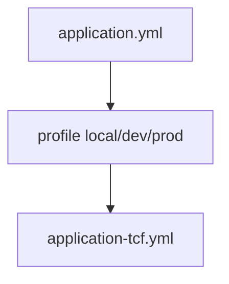

# 부록 G. application.yml 템플릿

| 항목 | 내용 |
| --- | --- |
| **부록** | G |
| **상태** | Master Edition (ztcfbook-h) |
| **목차** | [00-목차](../00-목차.md) |

---

## 아키텍처 뷰



---

## Master 해설

부록 G application.yml 템플릿은 HikariCP·MyBatis·TCF feature flag·spring.profiles·application-tcf.yml import를 모듈별로 표준화합니다. tcf-cicd local/dev/prod가 profile별 SoT이므로 sv-service/src/main/resources와 tcf-cicd/local/spring/*/application-local.yml drift를 릴리즈 전 sync-to-framework로 맞춥니다.

로컬 tcf.session-validation-enabled=false는 STF 4단 SessionValidator skip tradeoff를 문서화합니다. datasource URL은 업무 RDW와 OM H2(nsight_om)·TxLog를 혼동하지 않도록 module별로 분리합니다.

repo에 DB password·JWT secret hardcoding은 금지이며, management endpoint exposure는 prod profile에서 제한합니다. Gateway auth.jwt.enabled와 tcf-web security flag 불일치는 ztomcat 통합 smoke fail로 나타납니다.

리뷰·운영: active profile CI 명시, cicd yml 변경 시 ALL_MODULES smoke, connection pool leak, H2→운영 DB 전환 checklist(부록 J).

---

## 구현 샘플 (코드베이스)

### application.yml

```yaml
server:
  servlet:
    context-path: /
    encoding:
      charset: UTF-8
      enabled: true
      force: true
    session:
      timeout: 60m
      tracking-modes: cookie
      cookie:
        name: JSESSIONID
        path: /
        http-only: true
        secure: false
        same-site: Lax

spring:
  profiles:
    default: local
  datasource:
    driver-class-name: org.h2.Driver
    username: sa
    password:
    hikari:
      maximum-pool-size: 10
      minimum-idle: 2
      connection-timeout: 3000
      validation-timeout: 3000
      idle-timeout: 600000
      max-lifetime: 1800000
      keepalive-time: 300000
      auto-commit: false
  session:
    store-type: none
  transaction:
    default-timeout: 5

mybatis:
  mapper-locations:
    - classpath:/mapper/**/*.xml
  configuration:
    map-underscore-to-camel-case: true
    default-statement-timeout: 3
    jdbc-type-for-null: NULL
    call-setters-on-nulls: true
    default-fetch-size: 500
    cache-enabled: false

management:
```

원본: [`sv-service/src/main/resources/application.yml`](../sv-service/src/main/resources/application.yml)

### application-local (cicd)

```yaml
# local - bootRun (port 8086)
server:
  port: 8086

spring:
  application:
    name: nsight-sv-service
  datasource:
    url: jdbc:h2:mem:nsight_sv;MODE=Oracle;DB_CLOSE_DELAY=-1;DATABASE_TO_UPPER=false
    hikari:
      pool-name: nsight-sv-hikari-local
  h2:
    console:
      enabled: true

nsight:
  tcf:
    transaction-log-schema-auto-init: true
    transaction-log-datasource:
      url: jdbc:h2:file:${nsight.txlog.path:./data/nsight-txlog}/nsight_om;MODE=Oracle;AUTO_SERVER=TRUE;DATABASE_TO_UPPER=false
      username: sa
      password:
      driver-class-name: org.h2.Driver
```

원본: [`tcf-cicd/local/spring/sv-service/application-local.yml`](../tcf-cicd/local/spring/sv-service/application-local.yml)

---

## Master Deep Dive — 부록 G · application.yml

- Hikari + MyBatis + TCF flags
- secret 외부화 — repo에 비밀번호 금지
- tcf-cicd profile SoT
- session-validation-enabled 로컬

### 아키텍트 체크리스트

- 상단 **구현 샘플**을 실제 코드와 대조한다.
- **심화 참고**와 ztcfbook 본문 절 번호를 매핑한다.
- 운영·배포 관점은 ztcfbook-h Master 블록을 우선 본다.

---

## 심화 참고 (Master)

- [znsight-man/부록G-application-yml-템플릿.md](../znsight-man/부록G-application-yml-템플릿.md)
- [tcf-cicd/README.md](../tcf-cicd/README.md)
- [docs/architecture/20-env-spring.md](../docs/architecture/20-env-spring.md)

---

## G.1 application.yml의 역할

NSIGHT TCF에서 `application.yml`은 단순한 Spring Boot 설정 파일이 아니다. Port, Context Path, 세션, DB, HikariCP, MyBatis, Transaction, TCF 실행 정책, 보안, 로그, Actuator를 **운영 기준**으로 통제하는 런타임 표준이다.

```text
application.yml
  ↓
Spring Boot 실행환경
  ↓
TCF 거래처리 정책 (세션·권한·거래통제·Timeout)
  ↓
Session / DB / Pool / MyBatis Timeout
  ↓
Log / Metrics / Health
  ↓
OM 환경설정 조회 / 운영 점검
```

운영 설정은 Git/CI-CD 기준으로 관리하고, 운영 서버에서 직접 수정하지 않는다. 비밀번호, JWT Key, API Key는 Git에 저장하지 않고 **환경변수 또는 Secret 관리 체계**로 외부화한다.

---

## G.2 설정 파일 분리 기준

```text
src/main/resources/
 ├─ application.yml              # 공통 기본
 ├─ application-local.yml        # 개발자 PC
 ├─ application-dev.yml          # 개발/통합검증
 ├─ application-stg.yml          # 성능/인수검증
 ├─ application-prod.yml         # 운영
 ├─ application-datasource.yml   # RDW, ADW, SESSIONDB, LOGDB (선택 분리)
 ├─ application-tcf.yml            # TCF 거래·Timeout·로그 (선택 분리)
 └─ mapper/
     └─ {업무코드}/
```

| 파일 | 역할 |
| --- | --- |
| `application.yml` | 공통 기본 설정, Profile 그룹 정의 |
| `application-local.yml` | H2, bootRun, 통제 완화 |
| `application-dev.yml` | 개발 DB, 환경변수 주입 |
| `application-stg.yml` | 운영 유사 설정, 보안 활성화 |
| `application-prod.yml` | 운영 DB, Secret 외부화, 통제 전면 활성 |
| `application-datasource.yml` | DB Pool 분리 (대규모 프로젝트) |
| `application-tcf.yml` | TCF Timeout·거래통제·로그 정책 |

설정 우선순위: **JVM `-D` → OS 환경변수 → `application-{profile}.yml` → `application.yml` → 기본값**

---

## G.3 기본 application.yml 템플릿

업무 WAR 공통 골격이다. Profile 그룹으로 datasource·tcf·mybatis를 묶는다.

```yaml
spring:
  application:
    name: ${NSIGHT_APP_NAME:nsight-sv-service}
  profiles:
    active: ${SPRING_PROFILES_ACTIVE:local}
    group:
      local:
        - local
      dev:
        - dev
      prod:
        - prod

server:
  port: ${SERVER_PORT:8086}
  forward-headers-strategy: framework
  servlet:
    context-path: ${SERVER_CONTEXT_PATH:/sv}
    encoding:
      charset: UTF-8
      enabled: true
      force: true
    session:
      timeout: 60m
      tracking-modes: cookie
      cookie:
        name: JSESSIONID
        path: /
        http-only: true
        secure: ${SESSION_COOKIE_SECURE:false}
        same-site: Lax

spring:
  transaction:
    default-timeout: 5
  servlet:
    multipart:
      enabled: true
      max-file-size: 100MB
      max-request-size: 100MB

management:
  endpoints:
    web:
      exposure:
        include: health,info,metrics,prometheus,threaddump
  endpoint:
    health:
      probes:
        enabled: true

logging:
  level:
    root: INFO
    com.nh.nsight: INFO
    org.springframework: WARN
    org.mybatis: WARN

nsight:
  system-id: NSIGHT-MP
  business-code: SV
```

| 항목 | SV 예시 | OM 예시 |
| --- | --- | --- |
| spring.application.name | nsight-sv-service | nsight-om-service |
| server.servlet.context-path | /sv | /om |
| nsight.business-code | SV | OM |
| server.port (bootRun) | 8086 | 8090 |

외부 Tomcat WAR 배포 시 `server.port`는 내장 Tomcat bootRun에만 의미가 있고, 실제 운영 포트는 Tomcat Connector와 L4 라우팅으로 관리한다.

---

## G.4 Profile별 설정

### application-local.yml (개발자 PC)

로컬은 H2 in-memory, 세션·권한·거래통제를 완화하여 빠른 개발을 지원한다.

```yaml
spring:
  config:
    activate:
      on-profile: local
  application:
    name: nsight-sv-service
  sql:
    init:
      mode: always
      schema-locations: classpath:schema.sql
      data-locations: classpath:data.sql
  datasource:
    url: jdbc:h2:mem:nsight_sv;MODE=Oracle;DB_CLOSE_DELAY=-1;DATABASE_TO_UPPER=false
    username: sa
    password:
    driver-class-name: org.h2.Driver
    hikari:
      pool-name: nsight-sv-hikari-local
      maximum-pool-size: 10
      minimum-idle: 2
      connection-timeout: 3000
      auto-commit: false
  session:
    store-type: none

server:
  port: 8086

nsight:
  tcf:
    session-validation-enabled: false
    authorization-validation-enabled: false
    transaction-control-enabled: false
    transaction-log-enabled: true
  timeout:
    online-transaction-seconds: 5
    db-query-seconds: 3
```

### application-dev.yml (개발/통합)

```yaml
spring:
  config:
    activate:
      on-profile: dev
  datasource:
    url: ${NSIGHT_DEV_RDW_DB_URL}
    username: ${NSIGHT_DEV_RDW_DB_USER}
    password: ${NSIGHT_DEV_RDW_DB_PASSWORD}
    driver-class-name: oracle.jdbc.OracleDriver
    hikari:
      pool-name: nsight-rdw-hikari-dev
      maximum-pool-size: 30
      connection-timeout: 3000
      auto-commit: false

nsight:
  tcf:
    session-validation-enabled: true
    authorization-validation-enabled: true
    transaction-control-enabled: true
    idempotency-enabled: true
```

### application-prod.yml (운영)

```yaml
spring:
  config:
    activate:
      on-profile: prod
  datasource:
    url: ${NSIGHT_RDW_DB_URL}
    username: ${NSIGHT_RDW_DB_USER}
    password: ${NSIGHT_RDW_DB_PASSWORD}
    driver-class-name: oracle.jdbc.OracleDriver
    hikari:
      pool-name: nsight-rdw-hikari-prod
      maximum-pool-size: ${NSIGHT_RDW_POOL_MAX:120}
      minimum-idle: ${NSIGHT_RDW_POOL_MIN:30}
      connection-timeout: 3000
      idle-timeout: 600000
      max-lifetime: 1800000
      auto-commit: false

server:
  servlet:
    session:
      cookie:
        secure: true
        http-only: true
        same-site: Lax

nsight:
  tcf:
    session-validation-enabled: true
    authorization-validation-enabled: true
    transaction-control-enabled: true
    timeout-policy-enabled: true
    transaction-log-enabled: true
    audit-log-enabled: true
    idempotency-enabled: true
```

운영 DB URL·사용자·비밀번호는 **환경변수로만** 주입한다. yml에 평문 비밀번호를 저장하지 않는다.

---

## G.5 DataSource · HikariCP 스니펫

NSIGHT는 DB 목적별로 DataSource와 Pool을 분리한다.

```yaml
spring:
  datasource:
    rdw:
      jdbc-url: ${NSIGHT_RDW_DB_URL}
      username: ${NSIGHT_RDW_DB_USER}
      password: ${NSIGHT_RDW_DB_PASSWORD}
      driver-class-name: oracle.jdbc.OracleDriver
      hikari:
        pool-name: nsight-rdw-hikari
        maximum-pool-size: ${NSIGHT_RDW_POOL_MAX:120}
        minimum-idle: ${NSIGHT_RDW_POOL_MIN:30}
        connection-timeout: 3000
        validation-timeout: 3000
        idle-timeout: 600000
        max-lifetime: 1800000
        keepalive-time: 300000
        auto-commit: false
    adw:
      jdbc-url: ${NSIGHT_ADW_DB_URL}
      username: ${NSIGHT_ADW_DB_USER}
      password: ${NSIGHT_ADW_DB_PASSWORD}
      driver-class-name: oracle.jdbc.OracleDriver
      hikari:
        pool-name: nsight-adw-hikari
        maximum-pool-size: ${NSIGHT_ADW_POOL_MAX:80}
        connection-timeout: 3000
        auto-commit: false
    sessiondb:
      jdbc-url: ${NSIGHT_SESSION_DB_URL}
      username: ${NSIGHT_SESSION_DB_USER}
      password: ${NSIGHT_SESSION_DB_PASSWORD}
      driver-class-name: oracle.jdbc.OracleDriver
      hikari:
        pool-name: nsight-sessiondb-hikari
        maximum-pool-size: ${NSIGHT_SESSION_POOL_MAX:120}
        connection-timeout: 3000
        auto-commit: false
```

| 설정 | 기준 | 비고 |
| --- | --- | --- |
| connection-timeout | 3초 | Pool에서 Connection **대기** 시간 |
| validation-timeout | 3초 | Connection 유효성 검사 |
| idle-timeout | 10분 | 유휴 Connection 회수 |
| max-lifetime | 30분 이하 | Connection 최대 수명 |
| auto-commit | false | Spring Transaction과 연동 |
| Pool 사용률 | 70~80% 이하 | 운영 모니터링 |

**주의:** Hikari `connection-timeout`은 SQL 실행 제한시간이 아니다. SQL Timeout은 MyBatis `default-statement-timeout`과 Mapper XML `timeout` 속성으로 관리한다.

---

## G.6 MyBatis 스니펫

```yaml
mybatis:
  mapper-locations:
    - classpath:/mapper/**/*.xml
  type-aliases-package: com.nh.nsight
  configuration:
    map-underscore-to-camel-case: true
    default-statement-timeout: 3
    default-fetch-size: 500
    jdbc-type-for-null: NULL
    call-setters-on-nulls: true
    safe-row-bounds-enabled: true
    safe-result-handler-enabled: true
    cache-enabled: false

nsight:
  mybatis:
    sql-id-required: true
    rdw-query-timeout-seconds: 3
    adw-query-timeout-seconds: 5
    default-page-size: 100
    max-page-size: 1000
    block-select-star: true
```

| 항목 | 기준 |
| --- | --- |
| Mapper 위치 | `classpath:/mapper/**/*.xml` |
| SQL Timeout | RDW 3초, ADW 5초 |
| Fetch Size | 기본 500 |
| MyBatis Cache | 기본 **비활성** |
| 목록 조회 | Paging 필수 |

---

## G.7 TCF 스니펫 (application-tcf.yml)

TCF 거래처리·Timeout·로그 정책을 `nsight.tcf` 아래에 둔다.

```yaml
nsight:
  tcf:
    enabled: true
    online:
      endpoint: /online
      default-business-code: ${NSIGHT_BUSINESS_CODE:SV}
    session-validation-enabled: true
    authorization-validation-enabled: true
    transaction-control-enabled: true
    idempotency-enabled: true
    transaction-log-enabled: true
    audit-log-enabled: true
    timeout-policy-enabled: true
    timeout:
      default-online-timeout-sec: 5
      default-tx-timeout-sec: 5
      default-db-query-timeout-sec: 3
      default-external-connect-timeout-ms: 3000
      default-external-read-timeout-ms: 5000
    dispatcher:
      fail-on-duplicated-service-id: true
      fail-on-handler-not-found: true
    log:
      mdc-enabled: true
      mask-sensitive-data: true
      generate-guid-when-empty: true
      generate-trace-id-when-empty: true
    idempotency:
      enabled: true
      header-name: idempotencyKey
      ttl-seconds: 300
      apply-processing-types:
        - CREATE
        - UPDATE
        - DELETE
        - EXECUTE

  timeout:
    online-transaction-seconds: 5
    db-query-seconds: 3
```

Timeout 기본값은 yml에 두되, 서비스별 정책은 `TCF_SERVICE_TIMEOUT_POLICY` 같은 **DB 정책 테이블** 값을 우선 적용한다.

| Timeout 종류 | 기본값 | 설정 위치 |
| --- | --- | --- |
| Online 거래 | 5초 | nsight.tcf.timeout |
| Spring Transaction | 5초 | spring.transaction.default-timeout |
| MyBatis Query (RDW) | 3초 | mybatis + Mapper XML |
| MyBatis Query (ADW) | 5초 | nsight.mybatis |
| Hikari Connection 대기 | 3초 | datasource.hikari |
| External Connect | 3초 | nsight.tcf.timeout |
| External Read | 5초 | nsight.tcf.timeout |

---

## G.8 Session · Gateway · JWT (참고 스니펫)

### Spring Session JDBC (운영)

```yaml
server:
  servlet:
    session:
      timeout: 60m
      tracking-modes: cookie
      cookie:
        http-only: true
        secure: true
        same-site: Lax

spring:
  session:
    store-type: jdbc
    timeout: 60m
    jdbc:
      table-name: SPRING_SESSION
      initialize-schema: never
      cleanup-cron: "0 */5 * * * *"
```

다중 WAR·다중 WAS 환경에서는 SESSIONDB 중심 세션 공유가 기준이다. 로컬 bootRun은 `store-type: none`으로 완화할 수 있다.

### Gateway 라우팅

```yaml
nsight:
  gateway:
    enabled: true
    mode: route-by-business-code
    default-connect-timeout-ms: 3000
    default-read-timeout-ms: 8000
    preserve-guid: true
    preserve-trace-id: true
    routes:
      SV:
        context-path: /sv
        target-base-url: ${NSIGHT_ROUTE_SV_URL:http://sv-service:8080}
        online-path: /online
        read-timeout-ms: 5000
        enabled: true
      OM:
        context-path: /om
        target-base-url: ${NSIGHT_ROUTE_OM_URL:http://om-service:8080}
        online-path: /online
        read-timeout-ms: 5000
        enabled: true
```

### JWT / SSO (Secret 외부화)

```yaml
nsight:
  auth:
    mode: sso-jwt-session
    jwt:
      enabled: true
      issuer: nsight-tcf-jwt
      algorithm: RS256
      access-token-expire-minutes: 30
      refresh-token-expire-hours: 8
      public-key-location: ${JWT_PUBLIC_KEY_LOCATION}
      private-key-location: ${JWT_PRIVATE_KEY_LOCATION}
    security:
      mask-token-in-log: true
      require-jwt-for-gateway: true
```

JWT 공개키·개인키·SSO URL은 Secret Mount 또는 Vault에서 주입한다.

---

## G.9 보안 · Secret 외부화

| 항목 | 기준 |
| --- | --- |
| DB 비밀번호 | 환경변수 `${NSIGHT_*_DB_PASSWORD}` |
| JWT Key | `${JWT_PUBLIC_KEY_LOCATION}`, `${JWT_PRIVATE_KEY_LOCATION}` |
| SSO URL | `${SSO_VERIFY_URL}` |
| 파일 Storage | `${NSIGHT_FILE_STORAGE_PATH}` |
| Git 저장 | Secret **금지** |
| 운영 직접 수정 | **금지** — CI/CD 배포 |
| Cookie | HttpOnly, 운영 Secure=true, SameSite=Lax |
| Actuator | health, metrics 제한 노출 |
| 로그 | Token, password, rrn, accountNo 마스킹 |

환경변수 표준:

| 환경변수 | 설명 |
| --- | --- |
| SPRING_PROFILES_ACTIVE | 실행 Profile (local, dev, prod) |
| SERVER_PORT | bootRun 포트 |
| SERVER_CONTEXT_PATH | Context Path (/sv, /om) |
| NSIGHT_BUSINESS_CODE | 업무코드 |
| NSIGHT_RDW_DB_URL | RDW JDBC URL |
| NSIGHT_RDW_DB_USER | RDW 사용자 |
| NSIGHT_RDW_DB_PASSWORD | RDW 비밀번호 (Secret) |
| JWT_PUBLIC_KEY_LOCATION | JWT 공개키 경로 |
| JWT_PRIVATE_KEY_LOCATION | JWT 개인키 경로 |

---

## G.10 금지 패턴 · 체크리스트

### 금지 패턴

| 금지 패턴 | 사유 |
| --- | --- |
| 운영 DB 비밀번호를 yml에 직접 저장 | Secret 유출 |
| 운영 서버에서 yml 직접 수정 | 변경 이력 추적 불가 |
| Profile 없이 단일 yml만 사용 | 환경별 설정 충돌 |
| RDW/ADW/SESSIONDB Pool 혼용 | 장애 영향 범위 확대 |
| connection-timeout을 SQL Timeout으로 오해 | Pool 대기 vs SQL 실행 혼동 |
| Session을 WAS Memory에만 저장 | 다중 WAS 세션 불안정 |
| Actuator 전체 노출 | 보안 위험 |
| logging.level.root=DEBUG 운영 적용 | 로그 폭증, 개인정보 노출 |

### 체크리스트

| 점검 항목 | 확인 기준 |
| --- | --- |
| Profile | local/dev/stg/prod 분리 여부 |
| Context Path | 업무코드와 일치 (/sv, /om) |
| Session | 60분, Cookie Only, JDBC 저장 (운영) |
| DataSource | RDW/ADW/SESSIONDB/LOGDB 분리 |
| HikariCP | Pool Size, Timeout, Lifetime 설정 |
| MyBatis | Mapper 위치, Query Timeout, Fetch Size |
| TCF | 거래통제, 권한, 세션, Timeout, 로그 활성화 |
| Gateway | 업무코드별 Route, Timeout |
| JWT/SSO | Secret 외부화, Token 마스킹 |
| Secret | Git 저장 금지, CI/CD 변경관리 |

---

## 요약

`application.yml`은 개발 편의용 설정이 아니라 NSIGHT 온라인 거래가 안정적으로 실행되도록 만드는 **런타임 운영 표준**이다. Profile로 환경을 분리하고, DB·Pool·MyBatis·TCF Timeout을 계층별로 명시한다. Secret은 환경변수로 외부화하고, 운영 yml 직접 수정을 금지한다. Hikari connection-timeout(3초)과 MyBatis query timeout(RDW 3초, ADW 5초)을 구분하여 설정한다.

---

## 이전 · 다음

| | |
| --- | --- |
| ← 이전 | [부록 F](./F-오류코드-표준표.md) |
| → 다음 | [부록 H](./H-개발-완료-체크리스트.md) |

---

## 출처 색인 · Master 확장

| 구분 | 경로 |
| --- | --- |
| ztcfbook-h | 본 파일 |
| ztcfbook | `../ztcfbook/부록/G-application-yml-템플릿.md` |

### 원본 출처


- [znsight-man/부록G-application-yml-템플릿.md](../../znsight-man/부록G-application-yml-템플릿.md)
- [zman/20-Spring환경설정.md](../../zman/20-Spring환경설정.md)
- [znsight-man/20-Spring-환경설정-정의서.md](../../znsight-man/20-Spring-환경설정-정의서.md)
- [sv-service/src/main/resources/application.yml](../../sv-service/src/main/resources/application.yml)
- [sv-service/src/main/resources/application-local.yml](../../sv-service/src/main/resources/application-local.yml)
- [ztomcat/README.md](../../ztomcat/README.md)
