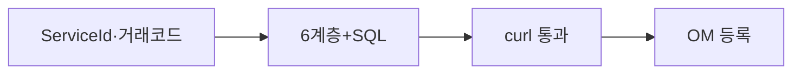

# 부록 H. 개발 완료 체크리스트

| 항목 | 내용 |
| --- | --- |
| **부록** | H |
| **상태** | Master Edition (ztcfbook-h) |
| **목차** | [00-목차](../00-목차.md) |

---

## 아키텍처 뷰



---

## Master 해설

부록 H 개발 완료 체크리스트는 ServiceId·거래코드·OM Catalog 3점 일치, 6계층+Mapper SQL, curl E2E 통과, functionAuth OM seed, negative STF case를 출시 전 gate로 묶습니다. Handler merge만으로 "완료"가 될 수 없고, OM 등록 evidence가 없으면 운영 반려가 정상입니다.

curl-sv-sample.sh 또는 동등 JSON E2E 로그, OM 화면 캡처·export, MR description checklist tick을 PR evidence로 남깁니다. znsight-man 62 품질 게이트와 연동하면 DevOps 파이프라인 조건으로 승격할 수 있습니다.

H2 integration에서 Catalog·거래통제·Timeout prod-like seed로 STF 7~8단을 mock 없이 통과시키는 것이 아키텍트 sign-off 권장 기준입니다. Idempotency·Timeout·Authorization negative test 포함 여부도 확인하십시오.

운영 인수 전 부록 H와 I·J 중복 항목을 한 번에 점검하면 Catalog 누락형 incident를 줄입니다.

---

## 구현 샘플 (코드베이스)

### SvCustomerHandler

```java
package com.nh.nsight.marketing.sv.entry.handler;

import com.nh.nsight.marketing.sv.entry.facade.SvCustomerFacade;
import com.nh.nsight.tcf.core.support.context.TransactionContext;
import com.nh.nsight.tcf.core.support.error.BusinessException;
import com.nh.nsight.tcf.core.support.error.ErrorCode;
import com.nh.nsight.tcf.core.support.message.StandardRequest;
import com.nh.nsight.tcf.core.support.transaction.TransactionHandler;
import java.util.Collection;
import java.util.List;
import java.util.Map;
import org.springframework.stereotype.Component;

/**
 * SV 고객 도메인 핸들러. SV.Customer.* 거래를 한 핸들러가 처리한다(Service 도메인당 1개).
 */
@Component
public class SvCustomerHandler implements TransactionHandler {

    private static final String SELECT_SUMMARY = "SV.Customer.selectSummary";

    private final SvCustomerFacade facade;

    public SvCustomerHandler(SvCustomerFacade facade) {
        this.facade = facade;
    }

    @Override
    public Collection<String> serviceIds() {
        return List.of(SELECT_SUMMARY);
```

원본: [`sv-service/src/main/java/com/nh/nsight/marketing/sv/entry/handler/SvCustomerHandler.java`](../sv-service/src/main/java/com/nh/nsight/marketing/sv/entry/handler/SvCustomerHandler.java)

### curl-sv-sample.sh

```shell
#!/usr/bin/env bash
set -euo pipefail
cd "$(dirname "$0")"
exec ./curl-sample.sh sv

```

원본: [`tcf-scripts/curl-sv-sample.sh`](../tcf-scripts/curl-sv-sample.sh)

---

## Master Deep Dive — 부록 H · 개발 완료

- ServiceId·거래코드·Catalog 3점 일치
- Mapper·SQL review
- 로컬 curl E2E 통과
- functionAuth OM seed

### 아키텍트 체크리스트

- 상단 **구현 샘플**을 실제 코드와 대조한다.
- **심화 참고**와 ztcfbook 본문 절 번호를 매핑한다.
- 운영·배포 관점은 ztcfbook-h Master 블록을 우선 본다.

---

## 심화 참고 (Master)

- [znsight-man/부록H-개발-완료-체크리스트.md](../znsight-man/부록H-개발-완료-체크리스트.md)
- [znsight-man/62-품질-게이트-기준.md](../znsight-man/62-품질-게이트-기준.md)
- [znsight-man/47-ServiceId-등록-절차.md](../znsight-man/47-ServiceId-등록-절차.md)

---

## H.1 목적

본 부록은 NSIGHT TCF Framework 기반 **신규·변경 거래**가 "코드 작성 완료"를 넘어 **운영 반영 가능한 개발 완료** 상태인지 개발자가 자체 점검할 때 사용하는 표준 체크리스트이다.

NSIGHT에서 개발 완료는 다음을 모두 만족할 때로 정의한다.

```text
기능 구현
+ TCF 식별체계(ServiceId·거래코드·Catalog)
+ 6계층 구조 준수
+ SQL/Mapper 검증
+ 테스트(정상·오류·권한)
+ OM 기준정보 등록
+ 로컬 개발환경 검증
+ 품질 게이트 통과
```

Handler를 작성하고 로컬에서 한 번 호출해 본 것만으로는 개발 완료가 아니다. **운영자가 ServiceId·거래로그·오류코드 기준으로 추적하고, 미등록 거래가 차단되는 상태**까지 확인해야 Merge Request·운영 전환 절차로 넘어갈 수 있다.

---

## H.2 사용 시점

| 시점 | 담당 | 용도 |
| --- | --- | --- |
| 기능 구현 직후 | 업무 개발자 | 자체 점검, MR 생성 전 최종 확인 |
| Merge Request 전 | 업무 개발자 | [부록 I](./I-코드-리뷰-체크리스트.md) 리뷰 요청 전 필수 선행 |
| 통합 테스트 전 | QA / PL | 테스트 범위·전제조건 확인 |
| 운영 전환 전 | PL / 운영 | [부록 J](./J-운영-전환-체크리스트.md)와 연계한 개발 완료 증빙 |

개발자는 본 체크리스트를 **거래 단위**(ServiceId 1건 또는 논리적 묶음)로 작성·보관한다. PL은 MR 승인 시 본 체크리스트 완료 여부를 확인한다.

---

## H.3 TCF 식별체계 체크리스트

ServiceId·거래코드·Handler·Catalog는 NSIGHT 거래 추적의 네 기둥이다. 네 항목이 서로 정합해야 STF 전처리·Dispatcher·거래로그가 정상 동작한다.

| 점검 항목 | 확인 기준 | 확인 |
| --- | --- | --- |
| ServiceId 명명 | `{업무코드}.{업무대상}.{처리행위}` 형식 (예: `SV.Customer.selectSummary`) | □ |
| ServiceId Prefix | Header `businessCode`와 ServiceId 업무코드가 일치 | □ |
| 거래코드 명명 | `{업무코드}-{거래유형}-{일련번호}` 형식 (예: `SV-INQ-0002`) | □ |
| 거래코드 Prefix | 거래코드 업무코드가 `businessCode`와 일치 | □ |
| processingType | 거래유형(INQUIRY/REGISTER/UPDATE/DELETE/EXECUTE)과 Catalog·코드 일치 | □ |
| Handler 구현 | `TransactionHandler` 구현, `serviceIds()`에 Catalog SERVICE_ID 포함 | □ |
| Handler 책임 | Body 변환 후 Facade만 호출, SQL·업무로직·트랜잭션 선언 없음 | □ |
| Handler 중복 | 동일 ServiceId를 두 Handler가 선언하지 않음 | □ |
| Catalog 등록 | `OM_SERVICE_CATALOG`에 SERVICE_ID·TRANSACTION_CODE·HANDLER 등록 | □ |
| Catalog 상태 | `USE_YN=Y`, 승인 상태 ACTIVE(또는 환경별 허용 상태) | □ |
| Endpoint | `POST /{businessCode}/online`, Context Path가 업무코드 소문자와 일치 | □ |
| SQL ID 연계 | Mapper XML 주석 또는 SQL ID가 ServiceId와 추적 가능하게 연결 | □ |

**리뷰 질문:** ServiceId만 보고 어떤 업무·Handler가 실행되는지, 거래코드만 보고 조회/등록/변경 거래인지 즉시 알 수 있는가?

---

## H.4 6계층 구조 체크리스트

NSIGHT 업무 WAR는 Handler → Facade → Service → Rule → DAO → Mapper 6계층 책임 분리를 따른다.

| 계층 | 확인 기준 | 금지 사항 | 확인 |
| --- | --- | --- | --- |
| Handler | ServiceId 진입, Body 변환, Facade 호출 | DAO/Mapper 직접 호출, 업무 판단 | □ |
| Facade | 유스케이스 조립, `@Transactional` 경계 | 세부 Rule 직접 구현, HTTP 응답 생성 | □ |
| Service | 처리 절차(검증→조회/저장→조립) | 권한·세션 직접 처리, SQL 문자열 작성 | □ |
| Rule | Validation, 업무 조건, criteria 조립 | DB 직접 접근 | □ |
| DAO | Mapper 호출, DB 예외 변환 | 업무 판단, 트랜잭션 선언 | □ |
| Mapper | SQL 실행, Result Mapping | 사용자 메시지·오류코드 생성 | □ |

| 점검 항목 | 확인 기준 | 확인 |
| --- | --- | --- |
| 패키지 구조 | `entry/handler`, `entry/facade`, `application/service`, `application/rule`, `persistence/dao`, `persistence/mapper` | □ |
| Class Prefix | 업무코드 PascalCase Prefix (예: `SvCustomerHandler`) | □ |
| 조회 거래 | Facade `@Transactional(readOnly = true)` 적용 | □ |
| 변경 거래 | Facade에 `@Transactional(timeout = …)` 적용 | □ |
| Controller | 업무 `@RestController` 추가 없음, `OnlineTransactionController` 공통 사용 | □ |
| 응답 조립 | Handler/Service에서 HTTP Status 직접 설정 없음, StandardResponse 후처리 위임 | □ |

---

## H.5 SQL / Mapper 체크리스트

| 점검 항목 | 확인 기준 | 확인 |
| --- | --- | --- |
| Mapper XML 위치 | `resources/mapper/{업무코드소문자}/` 하위 | □ |
| Namespace | Java Mapper Interface FQCN과 일치 | □ |
| SQL ID | Mapper Method명과 일치 | □ |
| SQL ID 주석 | `/* SQL_ID: {ServiceId 또는 표준 ID} */` 포함 | □ |
| SELECT 컬럼 | `SELECT *` 미사용, 필요 컬럼만 명시 | □ |
| Parameter Binding | `#{}` 사용, 사용자 입력에 `${}` 미사용 | □ |
| 목록 조회 | Paging(`OFFSET`/`FETCH` 또는 표준 Paging) 적용 | □ |
| Count SQL | 목록 조회 시 Count SQL 분리 | □ |
| ORDER BY | 고정 정렬 기준 존재 | □ |
| Query Timeout | MyBatis `timeout` 속성 적용 (RDW 3초, ADW 5초 등) | □ |
| Facade Timeout | Spring `@Transactional(timeout=…)`과 SQL Timeout 정합 | □ |
| 인덱스 | 주요 WHERE 조건 컬럼 인덱스 검토(운영 DB) | □ |
| 실행계획 | 주요 SQL 실행계획 확인(통합/운영 DB) | □ |
| RDW/ADW 분리 | 데이터소스·Mapper 분리 기준 준수 | □ |

---

## H.6 테스트 체크리스트

| 테스트 구분 | 확인 기준 | 확인 |
| --- | --- | --- |
| Rule 단위 테스트 | 필수값·형식·경계값·업무 조건 검증 | □ |
| Service 단위 테스트 | Rule→DAO 흐름, 정상·업무 오류 시나리오 | □ |
| Handler 단위 테스트 | `serviceIds()` 매핑, Facade 위임 | □ |
| Mapper 테스트 | SQL ID, 파라미터 바인딩, 결과 매핑 | □ |
| TCF 통합 테스트 | `POST /{businessCode}/online` End-to-End 정상 호출 | □ |
| 오류 테스트 | Validation·BusinessException → 표준 오류코드 반환 | □ |
| 권한 테스트 | 미인증·권한 없음·타 지점 접근 차단 | □ |
| 거래통제 테스트 | 미등록 ServiceId·미등록 거래통제 차단 | □ |
| Timeout 테스트 | Timeout 초과 시 거래로그 TIMEOUT 상태 | □ |
| 거래로그 | GUID, ServiceId, transactionCode, resultCode 기록 | □ |
| Gradle Build | `gradle clean build` 또는 CI 빌드 성공 | □ |
| Unit Test | 실패 0건 | □ |

품질 게이트 관점의 핵심 질문(62.15절 연계):

| 영역 | 점검 질문 | 확인 |
| --- | --- | --- |
| 예외 | 표준 예외와 오류코드를 사용하는가 | □ |
| 로그 | GUID, TraceId, ServiceId로 추적 가능한가 | □ |
| 보안 | 민감정보가 응답·로그에 노출되지 않는가 | □ |
| 세션 | 유효 세션·권한 검증이 적용되는가 | □ |
| Timeout | 거래/SQL/연계 Timeout 기준이 적용되는가 | □ |
| 배포 | Health Check·Smoke Test 시나리오가 정의되어 있는가 | □ |

---

## H.7 OM 등록 체크리스트

ServiceId Catalog 등록만으로 거래가 완성되지 않는다. 다음 기준정보를 **거래 단위 세트**로 등록해야 한다.

| 점검 항목 | 확인 기준 | 확인 |
| --- | --- | --- |
| Service Catalog | `OM_SERVICE_CATALOG` 등록 완료 | □ |
| 거래코드 | 거래코드 마스터 등록, Catalog TRANSACTION_CODE와 일치 | □ |
| 거래통제 | `TCF_TRANSACTION_CONTROL` 허용 조건 등록 (Header 7항 기준) | □ |
| Timeout 정책 | `TCF_SERVICE_TIMEOUT_POLICY` 또는 Catalog TIMEOUT_SEC 연계 | □ |
| 오류코드 | `OM_ERROR_CODE`에 업무 오류코드 등록 (E-{DOMAIN}-{CATEGORY}-{NNNN}) | □ |
| 권한·메뉴 | 화면 거래 시 메뉴권한·기능권한 매핑 | □ |
| 공통코드 | 화면·업무에서 참조하는 공통코드 등록 | □ |
| Gateway Route | Gateway 경유 시 업무코드 Route 등록(해당 시) | □ |
| Cache 갱신 | 기준정보 변경 후 Cache Evict/Reload 확인 | □ |
| 감사로그 | Catalog 등록·변경 이력 감사로그 기록 | □ |
| 승인 상태 | DRAFT→APPROVED→ACTIVE 흐름 완료(운영 반영 전) | □ |

거래통제 허용 범위 점검:

| 점검 항목 | 확인 기준 | 확인 |
| --- | --- | --- |
| Header 7항 | serviceId, transactionCode, businessCode, serviceName, user, channelId, branch 정의 | □ |
| 허용 범위 | 등록·수정·삭제·다운로드 거래에 `*` 전체 허용 미사용 | □ |
| 적용 기간 | APPLY_START/END_DTTM 적절 | □ |
| 차단 오류 | 미등록 시 `E-TCF-CTL-*` 표준 오류 반환 | □ |

---

## H.8 로컬 개발 완료 체크리스트

로컬 환경은 운영 구조의 축소판이다. 아래 항목은 [06-로컬-개발환경-구성](../../znsight-man/06-로컬-개발환경-구성.md) 6.19절 기준이다.

| 점검 항목 | 확인 |
| --- | --- |
| JDK 버전이 표준 기준에 맞는가 | □ |
| Gradle Wrapper로 빌드했는가 | □ |
| local Profile로 실행했는가 | □ |
| 업무 Context Path가 업무코드와 일치하는가 | □ |
| `POST /{businessCode}/online` 호출이 가능한가 | □ |
| Header의 businessCode와 URL Path가 일치하는가 | □ |
| serviceId가 Handler로 정상 매핑되는가 | □ |
| Handler가 Facade만 호출하는가 | □ |
| Facade에서 트랜잭션 경계를 관리하는가 | □ |
| Service, Rule, DAO 책임이 분리되어 있는가 | □ |
| Mapper XML SQL ID가 표준을 따르는가 | □ |
| 단위 테스트를 수행했는가 | □ |
| 개인정보 로그 출력이 없는가 | □ |
| DB 비밀번호가 소스에 포함되지 않았는가 | □ |
| 운영 Profile을 사용하지 않았는가 | □ |
| 로컬 빌드가 성공했는가 | □ |

---

## H.9 최종 승인 (Sign-off)

거래 개발 완료 선언 전 아래 표를 작성한다. 모든 **필수** 항목이 완료되어야 PL·아키텍트 승인을 요청할 수 있다.

| 항목 | 내용 |
| --- | --- |
| **거래명** | |
| **ServiceId** | |
| **거래코드** | |
| **업무코드 / WAR** | |
| **개발 Branch / Commit** | |
| **MR 번호** | |

| 점검 영역 | 완료 (Y/N) | 담당 | 일자 | 비고 |
| --- | --- | --- | --- | --- |
| H.3 TCF 식별체계 | | 개발자 | | |
| H.4 6계층 구조 | | 개발자 | | |
| H.5 SQL / Mapper | | 개발자 | | |
| H.6 테스트 | | 개발자 | | |
| H.7 OM 등록 | | 개발자 / OM | | |
| H.8 로컬 개발 | | 개발자 | | |
| 코드 리뷰 ([부록 I](./I-코드-리뷰-체크리스트.md)) | | 리뷰어 | | |
| 품질 게이트 (빌드·정적분석) | | CI / QA | | |

| 승인 역할 | 성명 | 서명 / 일자 | 판정 |
| --- | --- | --- | --- |
| 업무 개발자 | | | 완료 신고 |
| 업무 PL | | | 승인 / 보완 |
| 아키텍트 (필요 시) | | | 승인 / 보완 |

**판정 기준**

| 판정 | 의미 | 다음 단계 |
| --- | --- | --- |
| **완료** | 필수 항목 전부 Y, MR 승인 가능 | 통합 테스트 → 운영 전환 검토 |
| **조건부 완료** | 경미한 보완(주석·문서)만 잔존 | 보완 기한 내 MR Merge |
| **미완료** | 식별체계·구조·테스트·OM 등록 중 필수 미비 | 보완 후 재점검 |

---

## 요약

개발 완료는 "기능이 돌아간다"가 아니라 **TCF 식별체계·6계층·SQL·테스트·OM 등록·로컬 검증**을 모두 충족한 상태이다. 본 부록 H는 개발자 자체 점검용이며, MR 전 [부록 I](./I-코드-리뷰-체크리스트.md), 운영 반영 전 [부록 J](./J-운영-전환-체크리스트.md)와 연계하여 사용한다. ServiceId·거래코드·Catalog·Handler·거래통제·Timeout·오류코드가 한 세트로 정합할 때만 운영자가 장애 시 추적·차단·복구가 가능하다.

---

## 이전 · 다음

| | |
| --- | --- |
| ← 이전 | [부록 G](./G-application-yml-템플릿.md) |
| → 다음 | [부록 I](./I-코드-리뷰-체크리스트.md) |

---

## 출처 색인 · Master 확장

| 구분 | 경로 |
| --- | --- |
| ztcfbook-h | 본 파일 |
| ztcfbook | `../ztcfbook/부록/H-개발-완료-체크리스트.md` |

### 원본 출처


- [znsight-man/62-품질-게이트-기준.md](../../znsight-man/62-품질-게이트-기준.md) — 62.15 개발 완료 전 품질 체크리스트
- [znsight-man/06-로컬-개발환경-구성.md](../../znsight-man/06-로컬-개발환경-구성.md) — 6.19 로컬 개발 완료 체크리스트
- [znsight-man/47-ServiceId-등록-절차.md](../../znsight-man/47-ServiceId-등록-절차.md) — 47.16 개발자 체크리스트
- [znsight-man/48-거래통제-등록-절차.md](../../znsight-man/48-거래통제-등록-절차.md) — 48.17 개발자 체크리스트
- [znsight-man/12-애플리케이션-계층구조.md](../../znsight-man/12-애플리케이션-계층구조.md)
- [znsight-man/29-SQL-작성-기준.md](../../znsight-man/29-SQL-작성-기준.md)
- [znsight-man/56-TCF-거래-테스트-기준.md](../../znsight-man/56-TCF-거래-테스트-기준.md)
