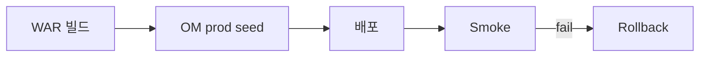

# 부록 J. 운영 전환 체크리스트

| 항목 | 내용 |
| --- | --- |
| **부록** | J |
| **상태** | Master Edition (ztcfbook-h) |
| **목차** | [00-목차](../00-목차.md) |

---

## 아키텍처 뷰



---

## Master 해설

부록 J 운영 전환 체크리스트 10영역은 WAR build version pin, OM prod seed(Catalog·통제·Timeout·ErrorCode), Gateway·Apache route prod yml, Tomcat deploy, Gateway 경유 smoke, rollback WAR pin, 운영자 인수인계를 포함합니다. Smoke fail 시 znsight-man 67 롤백 절차로 즉시 분기합니다.

cicd-deploy.sh·deploy-wars.sh·data.sql prod seed diff는 변경 관리 ticket과 연결합니다. JWT key rotation·SESSIONDB migration·OMDB backup restore는 DR drill checklist로 분기별 rehearsal합니다.

Gateway downstream URL·Context Path·부록 K 포트 표 triad mismatch는 전환 직후 404·502 burst를 유발합니다. tcf-batch·Dashboard feed가 online smoke와 별도임을 runbook에 명시하십시오.

운영 전환 승인 서명 전 부록 H 개발 완료와 부록 J를 연속 tick하고, rollback pin WAR file name을 release note에 기록하십시오.

---

## 구현 샘플 (코드베이스)

### cicd-deploy.sh

```shell
#!/usr/bin/env bash
# tcf-cicd — CI/CD 배포 파이프라인 (Linux/macOS / Git Bash)
set -euo pipefail

SCRIPT_DIR="$(cd "$(dirname "${BASH_SOURCE[0]}")" && pwd)"
DEPLOY_PS1="${SCRIPT_DIR}/cicd-deploy.ps1"

usage() {
  cat <<'EOF'
Usage: cicd-deploy.sh [options] [codes...]

CI/CD 파이프라인 wrapper (PowerShell cicd-deploy.ps1 호출).

Options:
  --action full|sync|build|deploy|config   (기본 full)
  --profile local|dev|prod                 (기본 dev)
  --dry-run
  --skip-sync
  --skip-build
  --skip-deploy
  --no-gradle-stop
  --restart
  --apply-config
  --health-check
  --artifact-dir <path>
  --gateway-base <url>
  -h, --help

Codes: ic pc ms sv pd eb ep ss mg om ui batch (생략 = all)

Examples:
  ./cicd-deploy.sh
  ./cicd-deploy.sh --profile dev sv om --restart
  ./cicd-deploy.sh --action build --profile prod --artifact-dir ./artifacts

```

원본: [`tcf-cicd/scripts/cicd-deploy.sh`](../tcf-cicd/scripts/cicd-deploy.sh)

### deploy-wars.sh

```shell
#!/usr/bin/env bash
set -euo pipefail

ZTOMCAT_HOME="$(cd "$(dirname "${BASH_SOURCE[0]}")" && pwd)"
PROJECT_HOME="$(cd "${ZTOMCAT_HOME}/.." && pwd)"
CATALINA_HOME="${ZTOMCAT_HOME}/apache-tomcat-10.1.34"
WEBAPPS="${CATALINA_HOME}/webapps"

ALL_MODULES=(
  ic-service:ic.war:ic.war:ic
  pc-service:pc.war:pc.war:pc
  ms-service:ms.war:ms.war:ms
  sv-service:sv.war:sv.war:sv
  pd-service:pd.war:pd.war:pd
  eb-service:eb.war:eb.war:eb
  ep-service:ep.war:ep.war:ep
  ss-service:ss.war:ss.war:ss
  mg-service:mg.war:mg.war:mg
  tcf-om:tcf-om.war:om.war:om
  tcf-ui:tcf-ui.war:ui.war:ui
  tcf-jwt:jwt.war:jwt.war:jwt
  tcf-batch:tcf-batch.war:zz-batch.war:batch
)

usage() {
  cat <<'EOF'
Usage:
  deploy-wars.sh              Build and deploy all 13 WARs
  deploy-wars.sh all          Same as above
  deploy-wars.sh sv           Build and deploy one code (e.g. sv.war -> /sv)
```

원본: [`ztomcat/deploy-wars.sh`](../ztomcat/deploy-wars.sh)

### data.sql seed

```sql
-- OM seed data (local)

INSERT INTO OM_AUTH_GROUP (AUTH_GROUP_ID, AUTH_GROUP_NAME, DESCRIPTION, USE_YN) VALUES
('ROLE_ADMIN', '시스템관리자', 'OM 전체 관리', 'Y'),
('ROLE_OPERATOR', '운영담당자', '거래로그/모니터링', 'Y'),
('ROLE_VIEWER', '조회자', '조회 전용', 'Y');

-- 초기 비밀번호: nsight01! (기동 시 OmUserPasswordInitializer 가 BCrypt 해시 설정)
INSERT INTO OM_USER (USER_ID, USER_NAME, PASSWORD_HASH, BRANCH_ID, AUTH_GROUP_ID, USE_YN, LAST_LOGIN_TIME) VALUES
('admin01', '운영관리자', NULL, '000001', 'ROLE_ADMIN', 'Y', '2026-06-14T09:15:00+09:00'),
('op01', '김운영', NULL, '001234', 'ROLE_OPERATOR', 'Y', '2026-06-14T08:50:00+09:00'),
('view01', '이조회', NULL, '001234', 'ROLE_VIEWER', 'Y', '2026-06-13T17:20:00+09:00');

INSERT INTO OM_MENU (MENU_ID, MENU_NAME, MENU_URL, PARENT_MENU_ID, SORT_ORDER, USE_YN) VALUES
('OM_GRP_OPS', '운영', '', NULL, 0, 'Y'),
('OM_DASH', '운영 대시보드', '/om/admin/dashboard.html', 'OM_GRP_OPS', 1, 'Y'),
('OM_TX', '거래로그 조회', '/om/admin/transaction-log.html', 'OM_GRP_OPS', 2, 'Y'),
('OM_TXC', '거래통제 관리', '/om/admin/transaction-control.html', 'OM_GRP_OPS', 3, 'Y'),
('OM_TMO', 'Timeout 정책', '/om/admin/timeout-policy.html', 'OM_GRP_OPS', 4, 'Y'),
('OM_SVC', 'ServiceId 관리', '/om/admin/service-catalog.html', 'OM_GRP_OPS', 5, 'Y'),
('OM_AUTH', '사용자/권한/메뉴/기능·데이터권한', '/om/admin/user-auth.html', 'OM_GRP_OPS', 6, 'Y'),
('OM_AUDIT', '감사로그', '/om/admin/audit-log.html', 'OM_GRP_OPS', 7, 'Y'),
('OM_SES', '세션 관리', '/om/admin/session.html', 'OM_GRP_OPS', 8, 'Y'),
('OM_GRP_SYS', '시스템·배포', '', NULL, 10, 'Y'),
('OM_ERR', '오류코드 관리', '/om/admin/error-code.html', 'OM_GRP_SYS', 11, 'Y'),
('OM_BAT', '배치 관리', '/om/admin/batch.html', 'OM_GRP_SYS', 12, 'Y'),
('OM_HLT', 'Health Check', '/om/admin/health-check.html', 'OM_GRP_SYS', 13, 'Y'),
('OM_CFG', '환경설정 조회', '/om/admin/system-config.html', 'OM_GRP_SYS', 14, 'Y'),
('OM_FIL', '파일 관리', '/om/admin/file-management.html', 'OM_GRP_SYS', 15, 'Y'),
('OM_DPL', '배포 관리', '/om/admin/deploy.html', 'OM_GRP_SYS', 16, 'Y'),
```

원본: [`tcf-om/src/main/resources/data.sql`](../tcf-om/src/main/resources/data.sql)

---

## Master Deep Dive — 부록 J · 운영 전환

- 10영역 체크 — Catalog·통제 prod
- Gateway route prod yml
- Rollback WAR version pin
- 운영자 인수인계·Smoke

### 아키텍트 체크리스트

- 상단 **구현 샘플**을 실제 코드와 대조한다.
- **심화 참고**와 ztcfbook 본문 절 번호를 매핑한다.
- 운영·배포 관점은 ztcfbook-h Master 블록을 우선 본다.

---

## 심화 참고 (Master)

- [znsight-man/부록J-운영-전환-체크리스트.md](../znsight-man/부록J-운영-전환-체크리스트.md)
- [znsight-man/68-운영-전환-체크리스트.md](../znsight-man/68-운영-전환-체크리스트.md)
- [znsight-man/67-롤백-절차.md](../znsight-man/67-롤백-절차.md)

---

## J.1 목적

운영 전환 체크리스트는 개발·검증이 완료된 프로그램을 **운영환경에 반영하기 전**에 기능, 품질, 보안, 성능, 배포, 장애 대응, 운영 절차가 모두 준비되었는지 확인하는 **최종 점검표**이다.

NSIGHT TCF Framework에서는 WAR 빌드 성공만으로 운영 전환이 가능하지 않다. 전환 대상은 다음을 모두 포함한다.

```text
소스 + 설정 + DB 스키마/DDL
+ ServiceId + 거래통제 + Timeout + 오류코드
+ 권한 + 로그 + 모니터링
+ 배포 절차 + Rollback + 운영 인수인계
```

**핵심 기준:** 운영자가 장애 발생 시 원인을 찾고, 서비스를 우회하고, 필요하면 **즉시 Rollback**할 수 있는 상태여야 운영 전환이 가능하다.

운영 전환은 "개발이 끝났다"는 선언이 아니라, **운영자가 안정적으로 서비스할 수 있음**을 확인하는 절차이다.

---

## J.2 운영 전환 전체 흐름

```text
개발 완료
   ↓  [부록 H] 개발 완료 체크리스트
코드 리뷰 완료
   ↓  [부록 I]
품질 게이트 통과
   ↓  빌드·테스트·정적분석·SQL 검증
통합 테스트 완료
   ↓
성능 / 보안 검증 완료
   ↓
운영 설정·기준정보 확인
   ↓
배포 계획 수립
   ↓
Rollback 계획 수립
   ↓
운영자 인수인계
   ↓
운영 반영 승인 (Go / Conditional Go)
   ↓
운영 배포
   ↓
Health Check → Smoke Test → L4 복귀
   ↓
운영 전환 완료 · 사후 모니터링
```

| 원칙 | 기준 |
| --- | --- |
| 승인된 산출물만 전환 | Git Tag/Commit, CI Artifact, 승인 이력 |
| 운영 환경 직접 수정 금지 | 소스·WAR·yml 임의 수정 불가 |
| WAR 단위 전환 | Class/Mapper 일부만 단독 반영 금지 |
| 기준정보 사전 등록 | Catalog·거래통제·Timeout·오류코드·권한 |
| Health Check 필수 | Liveness, Readiness, Smoke |
| Rollback 가능 | 직전 WAR·설정·DB Script 보관 |

---

## J.3 10개 영역 총괄표

| No | 점검 영역 | 통과 기준 | 확인 |
| --- | --- | --- | --- |
| 1 | 소스 / 빌드 | Git 확정, MR 승인, Gradle/CI 빌드·Unit Test 성공 | □ |
| 2 | TCF 거래 | ServiceId, 거래코드, Handler, Endpoint, StandardResponse | □ |
| 3 | DB / Mapper | DDL, 인덱스, Mapper SQL, 실행계획, Timeout | □ |
| 4 | 운영 기준정보 | Catalog, 거래통제, Timeout, 오류코드, 권한, 공통코드 | □ |
| 5 | 보안 / 권한 | 인증, 세션/JWT, 권한, 마스킹, 감사, 입력 검증 | □ |
| 6 | 로그 / 모니터링 | GUID, TraceId, 거래로그, Health, Dashboard, Alert | □ |
| 7 | 성능 / 안정성 | p95, SQL, Thread, Pool, Heap, Timeout, 대량조회 통제 | □ |
| 8 | 배포 | 일정, 순서, 백업, L4, Smoke, 배포 이력 | □ |
| 9 | Rollback | 이전 WAR·설정, DB 원복, 라우팅 복구, 담당자 | □ |
| 10 | 인수인계 / 최종 승인 | 운영 매뉴얼, 장애 대응, 연락체계, 다부서 승인 | □ |

---

## J.4 소스 / 빌드 체크리스트

| 점검 항목 | 확인 기준 | 확인 |
| --- | --- | --- |
| Git Branch / Tag | 운영 반영 대상 Commit 확정 | □ |
| Merge Request | 코드 리뷰·승인 이력 존재 | □ |
| Gradle Build | `gradle clean build` 또는 CI 빌드 성공 | □ |
| Unit Test | 실패 0건 | □ |
| 정적 분석 | SonarQube Blocker/Critical 0 (기준 이내) | □ |
| WAR 생성 | 업무별 WAR 정상 생성 (`bootWar`) | □ |
| Artifact 보관 | 배포 대상 WAR 저장소·버전 식별 가능 | □ |
| Secret | Git·Artifact에 비밀번호·Token 미포함 | □ |

---

## J.5 TCF 거래 등록 체크리스트

| 점검 항목 | 확인 기준 | 확인 |
| --- | --- | --- |
| 업무코드 | 표준 업무코드 체계 | □ |
| Context Path | `/sv`, `/om` 등 표준 Context | □ |
| Endpoint | `POST /{businessCode}/online` | □ |
| ServiceId | `{업무코드}.{대상}.{행위}` 명명 | □ |
| 거래코드 | 업무·처리유형 기준 채번 | □ |
| Handler | ServiceId ↔ Handler Bean 매핑 | □ |
| Facade 연결 | Handler → Facade만 호출 | □ |
| Catalog | `OM_SERVICE_CATALOG` ACTIVE, USE_YN=Y | □ |
| 응답 전문 | StandardResponse (header + result + body) | □ |
| 오류 응답 | 표준 오류코드·메시지 | □ |
| 미등록 차단 | 미등록 ServiceId·비활성 Catalog 차단 확인 | □ |

---

## J.6 운영 기준정보 체크리스트

| 기준정보 | 확인 기준 | 확인 |
| --- | --- | --- |
| ServiceId Master / Catalog | 신규 ServiceId 운영 OM 등록 | □ |
| 거래통제 | `TCF_TRANSACTION_CONTROL` 허용 조건 (Header 7항) | □ |
| Timeout 정책 | `TCF_SERVICE_TIMEOUT_POLICY` 또는 Catalog TIMEOUT | □ |
| 오류코드 | `OM_ERROR_CODE` 신규 코드 등록 | □ |
| 공통코드 | 화면·업무 참조 코드 등록 | □ |
| 권한 | 메뉴·기능·데이터 권한 | □ |
| Gateway Route | Gateway 사용 시 Route 등록 | □ |
| Cache | TTL·Evict 정책, 기준정보 변경 후 Reload | □ |
| 승인 이력 | Catalog·거래통제 등록·변경 감사로그 | □ |

거래통제는 ServiceId 존재와 별개로 **허용 조건**이 등록되어야 실행된다. 등록·수정·삭제 거래는 `*` 전체 허용을 지양한다.

---

## J.7 DB / MyBatis 체크리스트

| 점검 항목 | 확인 기준 | 확인 |
| --- | --- | --- |
| DDL | 운영 반영 DDL 확정·승인 | □ |
| 컬럼 | 타입, 길이, Nullable, 기본값 | □ |
| 인덱스 | 조회 조건 컬럼 인덱스 | □ |
| Mapper XML | 위치·namespace 표준 | □ |
| SQL ID | Method명·추적 주석 | □ |
| 실행계획 | 주요 SQL EXPLAIN/실행계획 | □ |
| Full Scan | 온라인 주요 SQL 불필요 Full Scan 없음 | □ |
| Paging | 목록 pageSize 상한 | □ |
| Query Timeout | MyBatis timeout | □ |
| DB 권한 | 운영 계정 최소 권한 | □ |
| Rollback Script | DDL/DML 변경 시 원복 Script | □ |

---

## J.8 보안 / 권한 체크리스트

| 점검 항목 | 확인 기준 | 확인 |
| --- | --- | --- |
| 인증 | 미인증 사용자 업무 ServiceId 호출 불가 | □ |
| 세션 | 만료·위조·중복 로그인 정책 | □ |
| JWT | 만료·변조·폐기 Token 검증 (해당 시) | □ |
| 메뉴권한 | 메뉴 접근 검증 | □ |
| 기능권한 | 조회·등록·수정·삭제·다운로드 | □ |
| 데이터권한 | 지점·부서·사용자 범위 | □ |
| 마스킹 | 고객번호·계좌·전화·식별정보 | □ |
| 감사로그 | PII 조회·다운로드·권한 위반 | □ |
| 입력 검증 | SQL Injection·Script 방어 | □ |
| 오류 노출 | StackTrace·SQL·내부 IP 미노출 | □ |
| Secret | prd yml·Git Secret 없음 | □ |
| Cookie | Secure, HttpOnly, SameSite (해당 시) | □ |

---

## J.9 로그 / 모니터링 체크리스트

| 점검 항목 | 확인 기준 | 확인 |
| --- | --- | --- |
| GUID | 요청~응답 동일 GUID 추적 | □ |
| TraceId | 서비스 간 TraceId 전달 | □ |
| 거래로그 | 시작 PROCESSING, 종료 SUCCESS/FAIL/TIMEOUT | □ |
| 오류로그 | 오류코드, ServiceId, GUID | □ |
| 감사로그 | 권한·다운로드·PII 조회 | □ |
| 성능로그 | AP·DB·외부연계 elapsed | □ |
| Health Check | Liveness / Readiness / Deep | □ |
| Dashboard | OM·Prometheus 등 상태 확인 | □ |
| Alert | 장애 조건 알림 기준 | □ |
| 로그 보관 | 경로·파일명·보관 주기(prd) | □ |

---

## J.10 성능 / 안정성 체크리스트

| 점검 항목 | 기준 | 확인 |
| --- | --- | --- |
| 응답시간 | 주요 온라인 p95 **3초 이내** | □ |
| SQL 응답 | 주요 조회 SQL **100~300ms** 목표 | □ |
| Tomcat Thread | Busy Thread **70% 이하** 권장 | □ |
| Hikari Pool | 사용률 **70~80% 이하** 권장 | □ |
| JVM Heap | **70% 이하** 권장 | □ |
| GC | Full GC 빈발 없음 | □ |
| DB Session | Session 한계 초과 없음 | □ |
| Timeout | 온라인·SQL·외부연계 적용 | □ |
| 대량조회 | 온라인 무제한 조회 없음 | □ |
| 다운로드 | 대용량은 별도 ServiceId·비동기 | □ |

NSIGHT 표준 목표(참고): 사용자 36,000, TPS 720, P95 3초, 가용성 99.99%.

---

## J.11 배포 체크리스트

| 점검 항목 | 확인 기준 | 확인 |
| --- | --- | --- |
| 배포 일정 | 일시·작업 시간·공지 확정 | □ |
| 배포 대상 | 서버, Tomcat, WAR, Context 명확 | □ |
| 배포 순서 | Gateway → OM → 업무 WAR → Batch 등 | □ |
| 사전 백업 | WAR, yml, DB Script | □ |
| L4 / 로드밸런서 | 배포 WAS Pool 제외 가능 | □ |
| Apache / Gateway | Context·Route 반영 | □ |
| Tomcat 기동 | WAR 배포 후 기동 정상 | □ |
| Health Check | 배포 직후 Health 성공 | □ |
| Smoke Test | 대표 ServiceId 호출 성공 | □ |
| L4 복귀 | 정상 확인 후 트래픽 복귀 | □ |
| 배포 이력 | OM·배포대장 기록 | □ |
| 환경설정 | prd Profile, DataSource, SessionDB, Logging | □ |

---

## J.12 Rollback 체크리스트

| 점검 항목 | 확인 기준 | 확인 |
| --- | --- | --- |
| 이전 WAR | 직전 정상 WAR 보관 | □ |
| 이전 설정 | application prd 설정 스냅샷 | □ |
| DB Rollback | DDL/DML 원복 Script | □ |
| 기준정보 Rollback | Catalog·거래통제 이전 상태 또는 비활성 | □ |
| 라우팅 복구 | Apache/Gateway Route 원복 | □ |
| L4 우회 | 장애 WAS 즉시 제외 | □ |
| Rollback 기준 | 어떤 상황에서 원복할지 명문화 | □ |
| Rollback 담당 | 수행자·승인자 지정 | □ |
| Rollback 검증 | 원복 후 Health·Smoke | □ |

**No-Go에 해당하는 Rollback 불가 상태는 운영 전환 자체를 보류한다.**

---

## J.13 운영자 인수인계 체크리스트

| 인수인계 항목 | 내용 | 확인 |
| --- | --- | --- |
| 운영 매뉴얼 | 기동·중지·배포·장애 대응 | □ |
| 업무 설명 | 신규 ServiceId, 기능, 호출 경로 | □ |
| 설정 설명 | Timeout, Pool, DB 연결(prd) | □ |
| 로그 위치 | App, Error, 거래로그, 감사로그 | □ |
| 모니터링 | Health, Dashboard, Alert | □ |
| 장애 대응 | 주요 오류코드·조치 | □ |
| Rollback | 원복 절차·담당자 | □ |
| 연락체계 | 개발·운영·DBA·보안·인프라 | □ |
| [부록 H](./H-개발-완료-체크리스트.md) | 개발 완료 Sign-off 사본 | □ |
| [부록 I](./I-코드-리뷰-체크리스트.md) | 코드 리뷰 결과 | □ |

---

## J.14 최종 승인

운영 전환은 아래 조건을 **모두** 만족할 때 승인한다.

| 승인 조건 | 확인 |
| --- | --- |
| 기능 검증 — 핵심 업무 시나리오 정상 | □ |
| 품질 게이트 — 빌드·테스트·정적분석 통과 | □ |
| 보안 검증 — 인증·권한·마스킹·감사 | □ |
| 성능 검증 — p95·SQL·Thread·Pool | □ |
| 운영 설정 — prd Profile·DB·Session·Log | □ |
| 배포 계획 — 순서·담당·작업 시간 | □ |
| Rollback 계획 — WAR·설정·DB 원복 | □ |
| 운영 인수인계 — 매뉴얼·연락체계 | □ |

### 최종 판정표

| 판정 | 의미 | 조치 |
| --- | --- | --- |
| **Go** | 운영 전환 가능 | 예정 일정에 배포 |
| **Conditional Go** | 경미한 보완 후 가능 | 보완 항목 조치 후 승인 |
| **Hold** | 필수 미비 | 조치 후 재심의 |
| **No-Go** | 운영 전환 불가 | 배포 중단, 원인 제거 후 재검증 |

**No-Go 조건 (하나라도 해당 시 전환 불가)**

| 조건 | 설명 |
| --- | --- |
| 운영 빌드 실패 | WAR 생성·배포 불가 |
| 핵심 기능 실패 | 대표 ServiceId 호출 실패 |
| 인증/권한 우회 | 미권한 사용자 업무 실행 가능 |
| PII 노출 | 응답·로그 평문 민감정보 |
| SQL 성능 미달 | 온라인 장시간 SQL |
| Health Check 실패 | 기동 후 정상 상태 미확인 |
| Rollback 불가 | 장애 시 원복 방법 없음 |
| 인수인계 미완 | 운영자 조치 불가 |

### 승인 서명

| 역할 | 성명 | 일자 | Go / Hold / No-Go |
| --- | --- | --- | --- |
| 개발 | | | |
| 업무 PL | | | |
| 아키텍트 | | | |
| DBA | | | |
| 보안 | | | |
| 운영 | | | |
| PMO | | | |

---

## J.15 운영 전환 완료 후 점검

| 시점 | 점검 항목 |
| --- | --- |
| 배포 직후 | Health, Smoke, 오류로그 |
| 30분 이내 | 거래로그 SUCCESS/FAIL 비율 |
| 1시간 이내 | Thread, Heap, Hikari, SQL 응답 |
| 당일 종료 전 | 사용자 문의, Timeout, 오류코드 |
| 익일 오전 | 야간 Batch, 세션, 로그 적재, Dashboard |
| 1주일 이내 | 성능 추이, 장애 이력, 개선사항 정리 |

---

## 요약

운영 전환 체크리스트는 배포 직전 형식 문서가 아니라 **개발 완료·품질 Gate·운영 준비·장애 대응·PMO/감사** 증빙이다. 10개 영역 총괄표로 전환 준비도를 한눈에 보고, 빌드·TCF·기준정보·보안·로그·성능·배포·Rollback·인수인계·최종 승인을 순서대로 점검한다. Go 판정은 운영자가 장애 시 추적·우회·Rollback할 수 있을 때만 내린다.

---

## 이전 · 다음

| | |
| --- | --- |
| ← 이전 | [부록 I](./I-코드-리뷰-체크리스트.md) |
| → 다음 | [부록 K](./K-모듈-포트-Context-WAR-매핑표.md) |

---

## 출처 색인 · Master 확장

| 구분 | 경로 |
| --- | --- |
| ztcfbook-h | 본 파일 |
| ztcfbook | `../ztcfbook/부록/J-운영-전환-체크리스트.md` |

### 원본 출처


- [znsight-man/부록J-운영-전환-체크리스트.md](../../znsight-man/부록J-운영-전환-체크리스트.md)
- [znsight-man/68-운영-전환-체크리스트.md](../../znsight-man/68-운영-전환-체크리스트.md)
- [znsight-man/66-배포-절차.md](../../znsight-man/66-배포-절차.md)
- [znsight-man/67-롤백-절차.md](../../znsight-man/67-롤백-절차.md)
- [znsight-man/47-ServiceId-등록-절차.md](../../znsight-man/47-ServiceId-등록-절차.md)
- [znsight-man/48-거래통제-등록-절차.md](../../znsight-man/48-거래통제-등록-절차.md)
- [znsight-man/59-성능-테스트-기준.md](../../znsight-man/59-성능-테스트-기준.md)
- [znsight-man/58-보안-테스트-기준.md](../../znsight-man/58-보안-테스트-기준.md)
