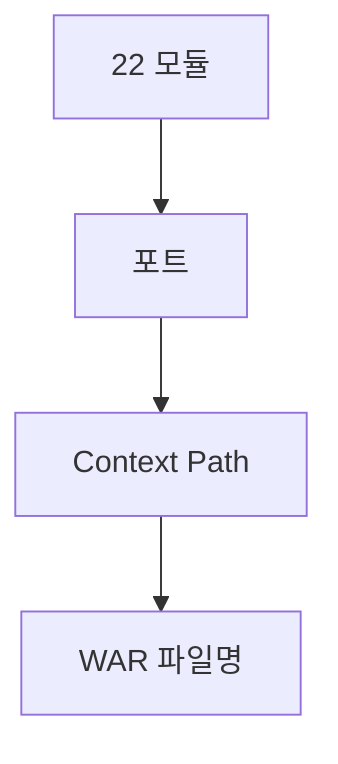

# 부록 K. 모듈·포트·Context·WAR 매핑표

| 항목 | 내용 |
| --- | --- |
| **부록** | K |
| **상태** | Master Edition (ztcfbook-h) |
| **목차** | [00-목차](../00-목차.md) |

---

## 아키텍처 뷰



---

## Master 해설

부록 K는 settings.gradle 22모듈·bootRun port·Context Path·WAR 파일명·ztomcat /gw·/jwt·Gateway downstream /{bc}/online 매핑의 단일 표입니다. BusinessModuleDefinitions·ROUTING_TABLE.md·ztomcat README·부록 K 네 곳 불일치가 integration smoke fail의 최빈 원인입니다.

참조 포트: tcf-ui 8099, tcf-uj 8102, tcf-gateway 8100, tcf-jwt 8110, tcf-om 8097, sv-service 8086 등. bootRun root context vs ztomcat nested context 차이를 curl URL 작성 시 반드시 구분합니다.

포트 충돌은 다른 WAR가 뜬 것처럼 보이 yet wrong Handler 응답을 주거나, Proxy 502만 발생합니다. 신규 module 추가 시 부록 K row·Gradle·Gateway ProxyController·deploy-wars.sh를 동시 MR로 묶으십시오.

장애 triage: (1) 부록 K port listen (2) Context Path (3) Gateway ROUTING_TABLE downstream host:port.

---

## 구현 샘플 (코드베이스)

### BusinessModuleDefinitions

```java
package com.nh.nsight.tcf.ui.support;

import java.util.List;

public final class BusinessModuleDefinitions {
    private BusinessModuleDefinitions() {}

    public static final List<ModuleDefinition> ALL = List.of(
            new ModuleDefinition("CC", "Common", "공통", 8081),
            new ModuleDefinition("IC", "Integration Customer", "고객", 8082),
            new ModuleDefinition("PC", "Private Customer", "고객", 8083),
            new ModuleDefinition("BC", "Business Customer", "고객", 8084),
            new ModuleDefinition("MS", "Mini Single View", "고객", 8085),
            new ModuleDefinition("SV", "Single View", "마케팅", 8086),
            new ModuleDefinition("PD", "Product", "마케팅", 8087),
            new ModuleDefinition("CM", "Campaign", "마케팅", 8088),
            new ModuleDefinition("EB", "EBM", "마케팅", 8089),
            new ModuleDefinition("EP", "Event Processing", "실시간", 8090),
            new ModuleDefinition("BP", "Behavior Processing", "실시간", 8091),
            new ModuleDefinition("BD", "Behavior Data", "데이터", 8092),
            new ModuleDefinition("SS", "Sales Support", "지원", 8093),
            new ModuleDefinition("CS", "Common Service", "지원", 8094),
            new ModuleDefinition("CT", "Contents", "지원", 8095),
            new ModuleDefinition("MG", "Message", "지원", 8096),
            new ModuleDefinition("OM", "Operation Management (tcf-om)", "운영", 8097),
            new ModuleDefinition("UD", "Common UpDownload (tcf-om)", "공통", 8097),
            new ModuleDefinition("JWT", "JWT Auth (tcf-jwt)", "인증", 8110)
    );

    public record ModuleDefinition(String code, String name, String group, int localPort) {}
}

```

원본: [`tcf-ui/src/main/java/com/nh/nsight/tcf/ui/support/BusinessModuleDefinitions.java`](../tcf-ui/src/main/java/com/nh/nsight/tcf/ui/support/BusinessModuleDefinitions.java)

### ROUTING_TABLE

```markdown
# Gateway 라우팅 테이블 설계 (TCF_GATEWAY_ROUTE)

## 개요

Gateway는 현재 실행 환경(`ENV_CODE`)과 업무코드(`BUSINESS_CODE`)로 `TCF_GATEWAY_ROUTE`를 조회하고,
Target URL을 아래 공식으로 조립해 downstream WAR로 Relay합니다.

```text
TARGET_URL = TARGET_BASE_URL + CONTEXT_PATH + ONLINE_PATH
```

## 처리 흐름

```text
tcf-gateway
   ↓
현재 실행 모드 확인 (application-{profile}.yml → nsight.gateway.env-code)
LOCAL / DEV / PRD
   ↓
businessCode 기준 조회
   ↓
TCF_GATEWAY_ROUTE
   ↓
TARGET_BASE_URL + CONTEXT_PATH + ONLINE_PATH 조립
   ↓
GEF Relay
```

## Oracle DDL

```sql
CREATE TABLE TCF_GATEWAY_ROUTE (
    ROUTE_ID             VARCHAR2(60)  NOT NULL,
    ENV_CODE             VARCHAR2(20)  NOT NULL,
    ROUTE_GROUP_CODE     VARCHAR2(30)  NOT NULL,
    ROUTE_GROUP_NAME     VARCHAR2(100) NOT NULL,
    BUSINESS_CODE        VARCHAR2(10)  NOT NULL,
    BUSINESS_NAME        VARCHAR2(100) NOT NULL,
    TARGET_BASE_URL      VARCHAR2(300) NOT NULL,
    CONTEXT_PATH         VARCHAR2(100) NOT NULL,
```

원본: [`tcf-gateway/docs/ROUTING_TABLE.md`](../tcf-gateway/docs/ROUTING_TABLE.md)

---

## Master Deep Dive — 부록 K · 모듈·포트·WAR

- bootRun root vs ztomcat `/gw` `/jwt`
- Gateway downstream `/{bc}/online`
- tcf-ui 8099, tcf-uj 8102, gateway 8100
- settings.gradle 모듈 목록 = SoT

### 아키텍트 체크리스트

- 상단 **구현 샘플**을 실제 코드와 대조한다.
- **심화 참고**와 ztcfbook 본문 절 번호를 매핑한다.
- 운영·배포 관점은 ztcfbook-h Master 블록을 우선 본다.

---

## 심화 참고 (Master)

- [zarchitecture/16-모듈-포트-의존성-레퍼런스.md](../zarchitecture/16-모듈-포트-의존성-레퍼런스.md)
- [ztomcat/README.md](../ztomcat/README.md)
- [tcf-gateway/docs/ROUTING_TABLE.md](../tcf-gateway/docs/ROUTING_TABLE.md)

---

## K.1 전체 모듈 매핑표

NSIGHT TCF 모노레포의 Gradle 모듈, 포트, Context Path, 산출물(WAR/JAR), CI 대상을 한눈에 정리한다. 업무 WAR는 **업무코드(BC)** 2자리와 1:1로 대응하며, 로컬 `bootRun` 시 아래 포트를 사용한다.

| 모듈 | 유형 | BC | 포트 | Context | WAR/JAR | Gradle CI |
| --- | --- | --- | --- | --- | --- | --- |
| tcf-util | JAR | — | — | — | lib | ✅ |
| tcf-core | JAR | — | — | — | lib | ✅ |
| tcf-web | JAR | — | — | — | lib | ✅ |
| tcf-cache | JAR | — | — | — | lib | ✅ |
| tcf-eai | JAR | — | — | — | lib | ✅ |
| ic-service | WAR | IC | 8082 | `/ic` | ic.war | ✅ |
| pc-service | WAR | PC | 8083 | `/pc` | pc.war | ✅ |
| ms-service | WAR | MS | 8085 | `/ms` | ms.war | ✅ |
| sv-service | WAR | SV | 8086 | `/sv` | sv.war | ✅ |
| pd-service | WAR | PD | 8087 | `/pd` | pd.war | ✅ |
| eb-service | WAR | EB | 8089 | `/eb` | eb.war | ✅ |
| ep-service | WAR | EP | 8090 | `/ep` | ep.war | ✅ |
| ss-service | WAR | SS | 8093 | `/ss` | ss.war | ✅ |
| mg-service | WAR | MG | 8096 | `/mg` | mg.war | ✅ |
| tcf-om | WAR | OM | 8097 | `/om` | om.war | ✅ |
| om-service | WAR | OM | 8097 | `/om` | — | ❌ 레거시 |
| tcf-batch | WAR | — | 8098 | `/batch` | tcf-batch.war | ✅ |
| tcf-ui | JAR | — | 8099 | `/` | tcf-ui.jar | ✅ |
| tcf-gateway | WAR | — | 8100 | `/` (bootRun) · **`/gw`** (ztomcat) | gw.war | ✅ |
| tcf-uj | JAR | — | 8102 | `/` | tcf-uj.jar | ✅ |
| tcf-jwt | WAR | JWT | 8110 | `/` (bootRun) · **`/jwt`** (ztomcat) | jwt.war | ✅ |
| tcf-cicd | config | — | — | — | — | — |
| tcf-scripts | scripts | — | — | — | — | — |
| ztomcat | tool | — | 8080 | 다중 context | — | — |

**온라인 진입 URL 패턴**

- 업무·OM WAR (bootRun): `http://127.0.0.1:{port}/{bc}/online` — 예) SV → `http://127.0.0.1:8086/sv/online`
- ztomcat 통합 Tomcat: `http://127.0.0.1:8080/{bc}/online` — 예) SV → `http://localhost:8080/sv/online`
- Gateway (bootRun): `http://127.0.0.1:8100/gw/{BC}/online` — 예) SV → `http://127.0.0.1:8100/gw/SV/online`
- JWT (bootRun): `http://127.0.0.1:8110/online` — ztomcat 시 `http://127.0.0.1:8080/jwt/online`

---

## K.2 의존성 그래프

라이브러리 계층은 `tcf-util` → `tcf-core` → `tcf-web` 순으로 쌓이고, 업무·인프라 WAR는 `tcf-web`을 공통 의존한다. Gateway·UI·UJ는 HTTP Relay 목적으로 **독립 기동**한다.

```text
tcf-util
  └── tcf-core
        └── tcf-web
              ├── tcf-cache (tcf-om)
              ├── tcf-eai (ic-service, sv-service)
              ├── ic-service … mg-service (업무 WAR 9)
              ├── tcf-om
              ├── tcf-jwt
              └── tcf-batch

독립 실행 (HTTP Relay / 프록시):
  tcf-gateway  → downstream 업무 WAR 프록시
  tcf-ui       → Relay HTTP (브라우저 채널)
  tcf-uj       → Relay → Gateway
```

| 의존 모듈 | 사용처 | 용도 |
| --- | --- | --- |
| tcf-cache | tcf-om | EhCache 상태 스냅샷·캐시 관리 |
| tcf-eai | ic-service, sv-service | WAR 간 동기 연동 (`integration.services`) |

---

## K.3 bootRun vs ztomcat Context 차이

| 모듈 | bootRun (개발) | ztomcat (통합 Tomcat 8080) | 비고 |
| --- | --- | --- | --- |
| 업무 WAR 9종 | `/{bc}` | `/{bc}` | ic, pc, ms, sv, pd, eb, ep, ss, mg |
| tcf-om | `/om` | `/om` | 공유 DB `nsight_om` Primary |
| tcf-batch | `/batch` | `/batch` | 모니터링 스냅샷 적재 |
| tcf-ui | `/` (8099) | `/ui` | Relay 전용, DB 없음 |
| tcf-jwt | `/` (8110) | **`/jwt`** | JWT Auth Handler |
| tcf-gateway | `/` (8100) | **`/gw`** | 업무 프록시; ztomcat 표준 12 WAR 배포에는 미포함, 별도 `gw.war` 배포 시 `/gw` |
| tcf-jwt Gateway 라우트 | `http://127.0.0.1:8110/online` | `http://127.0.0.1:8080/jwt/online` | LOCAL Route는 bootRun 기준 |

**개발 시 선택 가이드**

- 단일 업무 디버깅: `gradle :sv-service:bootRun` 또는 `tcf-scripts/run-local.bat sv`
- OM + Gateway + UI 전체 채널: `tcf-om`, `tcf-gateway`, `tcf-uj` 각각 bootRun
- 운영 유사 통합 검증: `ztomcat/deploy-wars.bat all && ztomcat/start.bat` (JDK 21 필수)

---

## K.4 Gateway LOCAL Route

`tcf-gateway` 로컬 프로파일의 업무별 downstream URL이다. Gateway는 `businessCode`로 Route를 선택하고 `{target}/online`으로 프록시한다.

| BC | Target URL (LOCAL) |
| --- | --- |
| IC | `http://127.0.0.1:8082/ic/online` |
| PC | `http://127.0.0.1:8083/pc/online` |
| MS | `http://127.0.0.1:8085/ms/online` |
| SV | `http://127.0.0.1:8086/sv/online` |
| PD | `http://127.0.0.1:8087/pd/online` |
| EB | `http://127.0.0.1:8089/eb/online` |
| EP | `http://127.0.0.1:8090/ep/online` |
| SS | `http://127.0.0.1:8093/ss/online` |
| MG | `http://127.0.0.1:8096/mg/online` |
| OM | `http://127.0.0.1:8097/om/online` |
| JWT | `http://127.0.0.1:8110/online` |

ztomcat 단일 Tomcat 환경에서 Gateway를 `/gw`에 올린 경우 Target URL은 포트 **8080**·context `/{bc}`로 치환한다. 예) SV → `http://127.0.0.1:8080/sv/online`.

---

## K.5 업무 WAR Handler·serviceId 요약

| WAR | 대표 Handler | 주요 serviceId 예시 |
| --- | --- | --- |
| ic | IcSample, IcCustomer | `IC.Sample.inquiry`, `IC.Customer.inquiry` |
| pc | PcSample | `PC.Sample.inquiry` |
| ms | MsSample | `MS.Sample.inquiry` |
| sv | SvSample, SvCustomer, SvIntegration | `SV.Customer.selectSummary`, `SV.Integration.icSample` |
| pd | PdSample | `PD.Sample.inquiry` |
| eb | EbSample, EbUser, EbEvent, EbBatch | `EB.User.create`, `EB.Event.inquiry` |
| ep | EpSample, EpUserEvent | `EP.UserEvent.receive` |
| ss | SsSample | `SS.Sample.inquiry` |
| mg | MgSample | `MG.Sample.inquiry` |
| tcf-om | Om* (24종) | `OM.Auth.login`, `OM.ServiceCatalog.*`, … |
| tcf-jwt | JwtAuth* | `JWT.Auth.login`, `JWT.Auth.refresh` |

Handler 패키지 위치: `{module}/src/main/java/com/nh/nsight/marketing/{bc}/entry/handler/` (JWT는 `auth/jwt`).

---

## K.6 메인 Application 클래스

| 모듈 | Application Class |
| --- | --- |
| ic-service | `com.nh.nsight.marketing.ic.NsightIcServiceApplication` |
| sv-service | `com.nh.nsight.marketing.sv.NsightSvServiceApplication` |
| tcf-om | `com.nh.nsight.marketing.om.NsightOmServiceApplication` |
| tcf-gateway | `com.nh.nsight.gateway.NsightGatewayApplication` |
| tcf-jwt | `com.nh.nsight.auth.jwt.NsightJwtServiceApplication` |
| tcf-batch | `com.nh.nsight.tcf.batch.NsightTcfBatchApplication` |
| tcf-ui | `com.nh.nsight.tcf.ui.NsightTcfUiApplication` |
| tcf-uj | `com.nh.nsight.tcf.uj.NsightTcfUjApplication` |

---

## K.7 빠른 기동 명령

```bash
# 단일 업무 WAR
gradle :sv-service:bootRun
tcf-scripts/run-local.bat sv

# Gateway·UI 채널 (OM 선행 권장)
gradle :tcf-om:bootRun
gradle :tcf-gateway:bootRun
gradle :tcf-uj:bootRun

# ztomcat 통합 배포 (JDK 21)
ztomcat/deploy-wars.bat all && ztomcat/start.bat
```

---

## 요약

NSIGHT TCF는 라이브러리 5종(tcf-util~tcf-eai), 업무 WAR 9종, 인프라 WAR/JAR 6종, 도구·설정으로 구성된다. 업무 WAR는 BC별 고유 포트·`/{bc}` context를 가지며, Gateway(8100)와 JWT(8110)는 bootRun 시 루트 context, ztomcat 배포 시 각각 **`/gw`**, **`/jwt`** context를 사용한다. 의존성은 tcf-web 중심으로 수렴하고 Gateway·UI·UJ는 독립 Relay 계층이다. 로컬 Gateway Route 표는 BC별 downstream `/{bc}/online` URL을 고정한다.

---

## 이전 · 다음

| | |
| --- | --- |
| ← 이전 | [부록 J](./J-운영-전환-체크리스트.md) |
| → 다음 | [부록 L](./L-TCF-핵심-테이블-DDL-요약.md) |

---

## 출처 색인 · Master 확장

| 구분 | 경로 |
| --- | --- |
| ztcfbook-h | 본 파일 |
| ztcfbook | `../ztcfbook/부록/K-모듈-포트-Context-WAR-매핑표.md` |

### 원본 출처


| 절 | 참고 문서 |
| --- | --- |
| K.1~K.4 | [zarchitecture/16-모듈-포트-의존성-레퍼런스.md](../../zarchitecture/16-모듈-포트-의존성-레퍼런스.md) |
| K.3 | [ztomcat/README.md](../../ztomcat/README.md), [znsight-man/10-bootRun-Tomcat-WAR-차이.md](../../znsight-man/10-bootRun-Tomcat-WAR-차이.md) |
| K.4 | [tcf-gateway/docs/ROUTING_TABLE.md](../../tcf-gateway/docs/ROUTING_TABLE.md), [znsight-man/명명규칙-18-Gateway-라우팅.md](../../znsight-man/명명규칙-18-Gateway-라우팅.md) |
| K.5~K.7 | [zarchitecture/16-모듈-포트-의존성-레퍼런스.md](../../zarchitecture/16-모듈-포트-의존성-레퍼런스.md), [docs/SOURCE_INDEX.md](../../docs/SOURCE_INDEX.md) |
