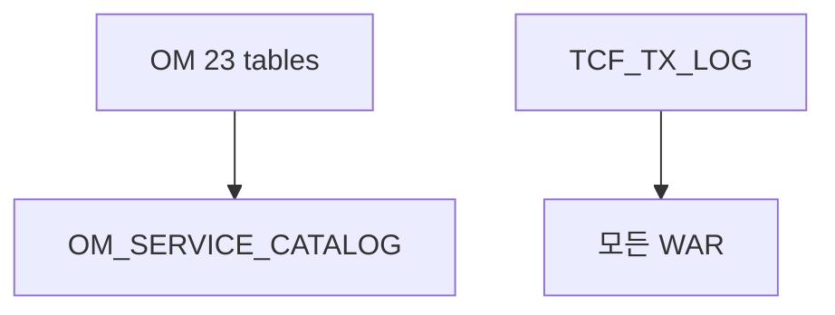

# 부록 L. TCF 핵심 테이블 DDL 요약

| 항목 | 내용 |
| --- | --- |
| **부록** | L |
| **상태** | Master Edition (ztcfbook-h) |
| **목차** | [00-목차](../00-목차.md) |

---

## 아키텍처 뷰



---

## Master 해설

부록 L은 tcf-om schema.sql 23테이블·TCF_TX_LOG·Spring Session table DDL 요약입니다. OM_SERVICE_CATALOG·TCF_TX_CONTROL·TCF_TIMEOUT_POLICY는 STF 7~8단 runtime lookup core이며, TCF_TX_LOG는 모든 업무 WAR가 INSERT하는 cross-cutting audit trail입니다.

data.sql seed와 schema migration 순서는 tcf-om 기동·OM Handler integration test 전제입니다. docs/architecture/19-tcf-table.md와 DDL diff가 어긋나면 문서 기반 장애 분석이 실패합니다.

운영: TxLog INSERT slow·disk full, OMDB migration rollback script, SESSIONDB separate from RDW. OM upgrade without cache evict → stale Catalog incident.

리뷰: schema.sql PR은 docs/19·부록 L·OM Handler 영향 분석 동반, index on guid·service_id.

---

## 구현 샘플 (코드베이스)

### schema.sql

```sql
-- OM Operation Management (local H2)

CREATE TABLE IF NOT EXISTS TCF_TX_LOG (
    LOG_ID VARCHAR(64) NOT NULL,
    TX_TIME VARCHAR(40) NOT NULL,
    BUSINESS_CODE VARCHAR(10),
    SERVICE_ID VARCHAR(100),
    TRANSACTION_CODE VARCHAR(50),
    GUID VARCHAR(64) NOT NULL,
    TRACE_ID VARCHAR(64),
    USER_ID VARCHAR(50),
    BRANCH_ID VARCHAR(20),
    RESULT_STATUS VARCHAR(20),
    RESULT_CODE VARCHAR(20),
    ERROR_CODE VARCHAR(50),
    ELAPSED_TIME_MS BIGINT,
    PRIMARY KEY (LOG_ID)
);

CREATE INDEX IF NOT EXISTS IDX_TCF_TX_GUID ON TCF_TX_LOG (GUID, TX_TIME DESC);
CREATE INDEX IF NOT EXISTS IDX_TCF_TX_SVC ON TCF_TX_LOG (SERVICE_ID, TX_TIME DESC);
CREATE INDEX IF NOT EXISTS IDX_TCF_TX_USER ON TCF_TX_LOG (USER_ID, TX_TIME DESC);

CREATE TABLE IF NOT EXISTS TCF_TRANSACTION_CONTROL (
    SERVICE_ID VARCHAR(100) NOT NULL,
    TRANSACTION_CODE VARCHAR(50) NOT NULL,
    BUSINESS_CODE VARCHAR(10) NOT NULL,
    SERVICE_NAME VARCHAR(200) NOT NULL,
    USER_ID VARCHAR(50) NOT NULL,
    CHANNEL_ID VARCHAR(30) NOT NULL,
    BRANCH_ID VARCHAR(30) NOT NULL,
    CONTROL_TYPE VARCHAR(20) NOT NULL DEFAULT 'FULL',
    BLOCK_YN CHAR(1) NOT NULL DEFAULT 'Y',
    PRIMARY KEY (
        SERVICE_ID,
        TRANSACTION_CODE,
        BUSINESS_CODE,
        SERVICE_NAME,
        USER_ID,
        CHANNEL_ID,
        BRANCH_ID
    )
);

CREATE INDEX IF NOT EXISTS IDX_TCF_TX_CTRL_USER ON TCF_TRANSACTION_CONTROL (USER_ID, CHANNEL_ID, BRANCH_ID);
CREATE INDEX IF NOT EXISTS IDX_TCF_TX_CTRL_SVC ON TCF_TRANSACTION_CONTROL (BUSINESS_CODE, SERVICE_ID, TRANSACTION_CODE);

CREATE TABLE IF NOT EXISTS OM_SERVICE_CATALOG (
    CATALOG_ID VARCHAR(64) NOT NULL,
    BUSINESS_CODE VARCHAR(10) NOT NULL,
    SERVICE_ID VARCHAR(100) NOT NULL,
    TRANSACTION_CODE VARCHAR(50) NOT NULL,
    PROCESSING_TYPE VARCHAR(20) NOT NULL,
    HANDLER_CLASS VARCHAR(200),
    AUTH_CODE VARCHAR(50),
    AUDIT_YN CHAR(1) DEFAULT 'N',
    TIMEOUT_SEC INT DEFAULT 5,
    USE_YN CHAR(1) DEFAULT 'Y',
    DESCRIPTION VARCHAR(500),
    PRIMARY KEY (CATALOG_ID)
```

원본: [`tcf-om/src/main/resources/schema.sql`](../tcf-om/src/main/resources/schema.sql)

### data.sql

```sql
-- OM seed data (local)

INSERT INTO OM_AUTH_GROUP (AUTH_GROUP_ID, AUTH_GROUP_NAME, DESCRIPTION, USE_YN) VALUES
('ROLE_ADMIN', '시스템관리자', 'OM 전체 관리', 'Y'),
('ROLE_OPERATOR', '운영담당자', '거래로그/모니터링', 'Y'),
('ROLE_VIEWER', '조회자', '조회 전용', 'Y');

-- 초기 비밀번호: nsight01! (기동 시 OmUserPasswordInitializer 가 BCrypt 해시 설정)
INSERT INTO OM_USER (USER_ID, USER_NAME, PASSWORD_HASH, BRANCH_ID, AUTH_GROUP_ID, USE_YN, LAST_LOGIN_TIME) VALUES
('admin01', '운영관리자', NULL, '000001', 'ROLE_ADMIN', 'Y', '2026-06-14T09:15:00+09:00'),
('op01', '김운영', NULL, '001234', 'ROLE_OPERATOR', 'Y', '2026-06-14T08:50:00+09:00'),
('view01', '이조회', NULL, '001234', 'ROLE_VIEWER', 'Y', '2026-06-13T17:20:00+09:00');

INSERT INTO OM_MENU (MENU_ID, MENU_NAME, MENU_URL, PARENT_MENU_ID, SORT_ORDER, USE_YN) VALUES
('OM_GRP_OPS', '운영', '', NULL, 0, 'Y'),
('OM_DASH', '운영 대시보드', '/om/admin/dashboard.html', 'OM_GRP_OPS', 1, 'Y'),
('OM_TX', '거래로그 조회', '/om/admin/transaction-log.html', 'OM_GRP_OPS', 2, 'Y'),
('OM_TXC', '거래통제 관리', '/om/admin/transaction-control.html', 'OM_GRP_OPS', 3, 'Y'),
('OM_TMO', 'Timeout 정책', '/om/admin/timeout-policy.html', 'OM_GRP_OPS', 4, 'Y'),
('OM_SVC', 'ServiceId 관리', '/om/admin/service-catalog.html', 'OM_GRP_OPS', 5, 'Y'),
('OM_AUTH', '사용자/권한/메뉴/기능·데이터권한', '/om/admin/user-auth.html', 'OM_GRP_OPS', 6, 'Y'),
('OM_AUDIT', '감사로그', '/om/admin/audit-log.html', 'OM_GRP_OPS', 7, 'Y'),
('OM_SES', '세션 관리', '/om/admin/session.html', 'OM_GRP_OPS', 8, 'Y'),
('OM_GRP_SYS', '시스템·배포', '', NULL, 10, 'Y'),
('OM_ERR', '오류코드 관리', '/om/admin/error-code.html', 'OM_GRP_SYS', 11, 'Y'),
('OM_BAT', '배치 관리', '/om/admin/batch.html', 'OM_GRP_SYS', 12, 'Y'),
('OM_HLT', 'Health Check', '/om/admin/health-check.html', 'OM_GRP_SYS', 13, 'Y'),
('OM_CFG', '환경설정 조회', '/om/admin/system-config.html', 'OM_GRP_SYS', 14, 'Y'),
('OM_FIL', '파일 관리', '/om/admin/file-management.html', 'OM_GRP_SYS', 15, 'Y'),
('OM_DPL', '배포 관리', '/om/admin/deploy.html', 'OM_GRP_SYS', 16, 'Y'),
```

원본: [`tcf-om/src/main/resources/data.sql`](../tcf-om/src/main/resources/data.sql)

---

## Master Deep Dive — 부록 L · DDL

- OM_SERVICE_CATALOG·TCF_TX_CONTROL 핵심
- TCF_TX_LOG cross-WAR INSERT
- Spring Session tables
- seed data.sql + migration

### 아키텍트 체크리스트

- 상단 **구현 샘플**을 실제 코드와 대조한다.
- **심화 참고**와 ztcfbook 본문 절 번호를 매핑한다.
- 운영·배포 관점은 ztcfbook-h Master 블록을 우선 본다.

---

## 심화 참고 (Master)

- [docs/architecture/19-tcf-table.md](../docs/architecture/19-tcf-table.md)
- [tcf-om/src/main/resources/schema.sql](../tcf-om/src/main/resources/schema.sql)

---

## L.1 DB 토폴로지 개요

NSIGHT TCF는 **모듈별 DB 사용 범위가 다르다**. 운영·공통 메타는 `tcf-om` 단일 H2 file DB에 집중하고, 모든 온라인 WAR는 **동일 file DB**에 거래 이력(`TCF_TX_LOG`)만 쓴다.

| 구분 | 모듈 | DB 특성 | 테이블 |
| --- | --- | --- | --- |
| 공유 운영 DB | tcf-om, tcf-batch | H2 file `./data/nsight-txlog/nsight_om` | OM·UD·세션·거래로그 등 **23개** |
| 거래로그만 공유 | 업무 WAR 9종 (목표 17) | Primary `h2:mem:nsight_{bc}` + 거래로그 file DS | `TCF_TX_LOG` (INSERT) |
| DB 미사용 | tcf-ui, tcf-cache, tcf-core | — | 없음 |
| 레거시 | om-service | 업무 H2 mem | 없음 (tcf-om으로 이전) |

```text
                    ┌─────────────────────────────────────────┐
                    │  ./data/nsight-txlog/nsight_om (H2 file) │
                    │  ─────────────────────────────────────  │
                    │  TCF_TX_LOG          ← 모든 WAR 적재     │
                    │  OM_* / UD_* / SPRING_SESSION*          │
                    │  ← tcf-om CRUD, tcf-batch 수집·이력    │
                    └─────────────────────────────────────────┘
                           ▲                    ▲
              separate DS  │                    │ primary DS
                           │                    │
     ┌─────────────────────┴──┐    ┌───────────┴──────────────┐
     │  sv-service, ic-service │    │  tcf-om (8097)            │
     │  … 업무 WAR 9종         │    │  tcf-batch (8098)         │
     │  jdbc:h2:mem:nsight_*   │    └──────────────────────────┘
     │  (업무 테이블 없음)      │
     └─────────────────────────┘

     ┌─────────────────────────┐
     │  ./data/updownload/     │  ← 물리 파일 (DB 외부)
     │  {fileId}.bin           │
     └─────────────────────────┘
```

### 데이터소스 설정 요약

| 모듈 | Primary DS | 거래로그 DS | `transaction-log-enabled` |
| --- | --- | --- | --- |
| tcf-om | `nsight_om` file | 동일 (`separate: false`) | `true` |
| tcf-batch | `nsight_om` file | — | `false` |
| 업무 WAR | `h2:mem:nsight_{code}` | `nsight_om` file (`separate: true`) | `true` (기본) |
| tcf-ui | 없음 | — | — |

설정 키: Primary `spring.datasource.url`, 거래로그 `nsight.tcf.transaction-log-datasource.*`, 공유 경로 `nsight.txlog.path` (기본 `./data/nsight-txlog`).

---

## L.2 테이블 접두어 규칙

| 접두어 | 소유 | 의미 |
| --- | --- | --- |
| `TCF_` | 프레임워크 | TCF 공통 (거래로그·거래통제) |
| `OM_` | 운영관리 | OM Admin·배치·감사·배포 |
| `UD_` | 공통 파일 | 업·다운로드 메타 |
| `SPRING_SESSION` | Spring Session | JDBC 세션 저장 (표준 스키마) |

업무 전용 테이블 추가 시 `{업무코드}_` 접두어를 사용하고 `OM_`, `TCF_`, `UD_`, `SPRING_`는 예약한다.

---

## L.3 nsight_om 23개 테이블 목록

DDL 원본: `tcf-om/src/main/resources/schema.sql`. 아래 23개가 아키텍처 기준 공유 DB 전체이다.

| 그룹 | 테이블 | 용도 |
| --- | --- | --- |
| **TCF** | `TCF_TX_LOG` | 온라인 거래 요약 이력 |
| **서비스·권한** | `OM_SERVICE_CATALOG` | serviceId·Handler·타임아웃 메타 |
| | `OM_USER` | OM 포털 사용자 |
| | `OM_AUTH_GROUP` | 권한 그룹 |
| | `OM_MENU` | Admin 메뉴 트리 |
| | `OM_FUNCTION_AUTH` | 메뉴별 CRUD·다운로드 권한 |
| | `OM_DATA_AUTH` | 지점·고객 데이터 범위 |
| | `OM_AUTH_HISTORY` | 권한·설정 변경 이력 |
| **감사·오류·설정** | `OM_AUDIT_LOG` | 고객정보 조회 등 업무 감사 |
| | `OM_ERROR_CODE` | 표준 오류코드 사전 |
| | `OM_SYSTEM_CONFIG` | 환경설정 스냅샷 |
| | `OM_COMMON_CODE` | 공통코드 (업무코드·채널 등) |
| **모니터링·배치** | `OM_AP_STATUS` | AP CPU/Heap/Thread 스냅샷 |
| | `OM_DB_STATUS` | DB Pool 사용률 |
| | `OM_SESSION_STATUS` | 세션 수·활성 사용자 |
| | `OM_DEPLOY_STATUS` | WAR 배포·헬스 |
| | `OM_BATCH_JOB` | 배치 Job 정의·cron |
| | `OM_BATCH_HISTORY` | 배치 실행 이력 |
| | `OM_CACHE_STATUS` | EhCache 엔트리 스냅샷 |
| **세션** | `SPRING_SESSION` | 세션 메타 (`PRINCIPAL_NAME` = USER_ID) |
| | `SPRING_SESSION_ATTRIBUTES` | 세션 속성 바이너리 |
| **파일·UD** | `UD_FILE_META` | 업로드 파일 메타 |
| | `OM_FILE_DOWNLOAD_LOG` | 다운로드 감사 |

> `schema.sql`에는 `TCF_TRANSACTION_CONTROL`, `OM_MESSAGE_STRUCT`, `OM_DEPLOY_REQUEST` 등 운영 확장 테이블이 추가로 정의되어 있다. 신규 환경 구축 시 `OmDatabaseMigration`·`BatchDatabaseMigration`이 보강 DDL을 적용한다.

---

## L.4 TCF_TX_LOG

| 항목 | 내용 |
| --- | --- |
| 용도 | 온라인 거래 요약 이력 (성공/실패, 소요시간) |
| 쓰기 | 모든 업무 WAR ETF (`JdbcTransactionLogRepository`, 독립 커밋) |
| 읽기/삭제 | tcf-om (`OmTransactionLogHandler`) |
| 인덱스 | `(GUID, TX_TIME)`, `(SERVICE_ID, TX_TIME)`, `(USER_ID, TX_TIME)` |

| 컬럼 | 타입 | 설명 |
| --- | --- | --- |
| `LOG_ID` | VARCHAR(64) PK | 로그 ID |
| `TX_TIME` | VARCHAR(40) | 거래 시각 (KST ISO) |
| `BUSINESS_CODE` | VARCHAR(10) | 업무코드 (SV, OM, …) |
| `SERVICE_ID` | VARCHAR(100) | 서비스 ID |
| `TRANSACTION_CODE` | VARCHAR(50) | 거래코드 |
| `GUID` | VARCHAR(64) | 거래 GUID |
| `TRACE_ID` | VARCHAR(64) | 추적 ID |
| `USER_ID` | VARCHAR(50) | 사용자 |
| `BRANCH_ID` | VARCHAR(20) | 지점 |
| `RESULT_STATUS` | VARCHAR(20) | `SUCCESS` / `FAIL` |
| `RESULT_CODE` | VARCHAR(20) | `S0000` / `E0001` |
| `ERROR_CODE` | VARCHAR(50) | 업무·시스템 오류코드 |
| `ELAPSED_TIME_MS` | BIGINT | 소요 시간(ms) |

### CREATE TABLE 발췌

```sql
CREATE TABLE IF NOT EXISTS TCF_TX_LOG (
    LOG_ID VARCHAR(64) NOT NULL,
    TX_TIME VARCHAR(40) NOT NULL,
    BUSINESS_CODE VARCHAR(10),
    SERVICE_ID VARCHAR(100),
    TRANSACTION_CODE VARCHAR(50),
    GUID VARCHAR(64) NOT NULL,
    TRACE_ID VARCHAR(64),
    USER_ID VARCHAR(50),
    BRANCH_ID VARCHAR(20),
    RESULT_STATUS VARCHAR(20),
    RESULT_CODE VARCHAR(20),
    ERROR_CODE VARCHAR(50),
    ELAPSED_TIME_MS BIGINT,
    PRIMARY KEY (LOG_ID)
);

CREATE INDEX IF NOT EXISTS IDX_TCF_TX_GUID ON TCF_TX_LOG (GUID, TX_TIME DESC);
CREATE INDEX IF NOT EXISTS IDX_TCF_TX_SVC ON TCF_TX_LOG (SERVICE_ID, TX_TIME DESC);
CREATE INDEX IF NOT EXISTS IDX_TCF_TX_USER ON TCF_TX_LOG (USER_ID, TX_TIME DESC);
```

---

## L.5 OM_SERVICE_CATALOG

| 항목 | 내용 |
| --- | --- |
| 용도 | 등록된 serviceId·Handler·타임아웃·감사 여부 메타 |
| 쓰기 | OM Admin, `OmDatabaseMigration` MERGE |
| 읽기 | STF 거래통제·타임아웃 정책, OM ServiceId 관리 화면 |

주요 컬럼: `CATALOG_ID`, `BUSINESS_CODE`, `SERVICE_ID`(UK), `TRANSACTION_CODE`, `PROCESSING_TYPE`, `HANDLER_CLASS`, `AUTH_CODE`, `AUDIT_YN`, `TIMEOUT_SEC`, `USE_YN`, `DESCRIPTION`

### CREATE TABLE 발췌

```sql
CREATE TABLE IF NOT EXISTS OM_SERVICE_CATALOG (
    CATALOG_ID VARCHAR(64) NOT NULL,
    BUSINESS_CODE VARCHAR(10) NOT NULL,
    SERVICE_ID VARCHAR(100) NOT NULL,
    TRANSACTION_CODE VARCHAR(50) NOT NULL,
    PROCESSING_TYPE VARCHAR(20) NOT NULL,
    HANDLER_CLASS VARCHAR(200),
    AUTH_CODE VARCHAR(50),
    AUDIT_YN CHAR(1) DEFAULT 'N',
    TIMEOUT_SEC INT DEFAULT 5,
    USE_YN CHAR(1) DEFAULT 'Y',
    DESCRIPTION VARCHAR(500),
    PRIMARY KEY (CATALOG_ID)
);

CREATE UNIQUE INDEX IF NOT EXISTS IDX_OM_SVC_ID ON OM_SERVICE_CATALOG (SERVICE_ID);
```

---

## L.6 주요 OM 테이블 그룹별 컬럼 요약

### 서비스·권한·사용자

| 테이블 | 핵심 컬럼 |
| --- | --- |
| `OM_USER` | `USER_ID` PK, `USER_NAME`, `PASSWORD_HASH`, `BRANCH_ID`, `AUTH_GROUP_ID`, `USE_YN`, `LAST_LOGIN_TIME` |
| `OM_AUTH_GROUP` | `AUTH_GROUP_ID` PK, `AUTH_GROUP_NAME`, `USE_YN` |
| `OM_MENU` | `MENU_ID`, `PARENT_MENU_ID`, `MENU_NAME`, `MENU_URL`, `SORT_ORDER` |
| `OM_FUNCTION_AUTH` | `AUTH_GROUP_ID`, `MENU_ID`, CRUD·다운로드 플래그 |
| `OM_DATA_AUTH` | `AUTH_GROUP_ID`, `BRANCH_ID`, `CUSTOMER_SCOPE` |

### 감사·모니터링

| 테이블 | 핵심 컬럼 |
| --- | --- |
| `OM_AUDIT_LOG` | `AUDIT_ID`, `AUDIT_TIME`, `USER_ID`, `CUSTOMER_NO`, `FUNCTION_ID`, `INQUIRY_REASON`, `CLIENT_IP` |
| `OM_AP_STATUS` | `AP_ID` PK, `AP_NAME`, `HEALTH_STATUS`, `CPU_USAGE_PCT`, `HEAP_USAGE_PCT`, `CHECKED_AT` |
| `OM_BATCH_HISTORY` | `HISTORY_ID`, `JOB_ID`, `START_TIME`, `END_TIME`, `RESULT_STATUS`, `MESSAGE` |

### 파일·UD

| 테이블 | 핵심 컬럼 |
| --- | --- |
| `UD_FILE_META` | `FILE_ID` PK, `ORIGINAL_NAME`, `CONTENT_TYPE`, `FILE_SIZE`, `UPLOAD_USER`, `BUSINESS_CODE` |
| `OM_FILE_DOWNLOAD_LOG` | `DOWNLOAD_ID`, `FILE_ID`, `USER_ID`, `DOWNLOAD_TIME`, `CLIENT_IP` |

물리 바이너리: `nsight.updownload.storage-path` (기본 `./data/updownload/{fileId}.bin`).

---

## L.7 테이블 관계 (개념 ER)

```text
OM_AUTH_GROUP ──< OM_USER ──< SPRING_SESSION (PRINCIPAL_NAME)
      │
      ├──< OM_FUNCTION_AUTH >── OM_MENU
      └──< OM_DATA_AUTH

OM_SERVICE_CATALOG          (독립 — serviceId 레지스트리)

TCF_TX_LOG                  (독립 — BUSINESS_CODE로 업무 구분)

OM_BATCH_JOB ──< OM_BATCH_HISTORY

UD_FILE_META ──> OM_FILE_DOWNLOAD_LOG (다운로드 감사)

OM_AP_STATUS / OM_DB_STATUS / OM_SESSION_STATUS / OM_DEPLOY_STATUS
                            (배치 스냅샷, 독립)
```

---

## L.8 스키마 초기화 경로

| 경로 | 담당 | 대상 |
| --- | --- | --- |
| `tcf-om/src/main/resources/schema.sql` + `data.sql` | Spring `sql.init` (`mode: embedded`) | 공유 DB 전체 + seed |
| `tcf-om/.../support/OmDatabaseMigration.java` | tcf-om 기동 시 | 메뉴·카탈로그 MERGE, UD·세션 테이블 보강 |
| `tcf-web/.../persistence/dao/TransactionLogSchemaInitializer.java` | 업무 WAR·tcf-om (조건부) | `TCF_TX_LOG` + 인덱스 |
| `tcf-batch/.../BatchDatabaseMigration.java` | tcf-batch 기동 시 | 모니터링 4종 + `OM_BATCH_HISTORY` DDL |

업무 WAR Primary DB(in-memory)에는 **DDL을 실행하지 않는다**. 거래로그 DS에만 `TCF_TX_LOG`가 자동 생성된다.

### 모듈별 DB 접근 패턴

| 모듈 | 접근 방식 | 대상 테이블 |
| --- | --- | --- |
| tcf-om | MyBatis `OmOperationMapper.xml` | 대부분 `OM_*`, `TCF_TX_LOG`, `SPRING_SESSION` |
| tcf-om | JdbcTemplate `OmUpdownloadService` | `UD_FILE_META` |
| tcf-batch | JdbcTemplate `OmDashboardStatusRepository` | 모니터링 4종, `OM_BATCH_HISTORY` |
| 업무 WAR | `TransactionLogService` | `TCF_TX_LOG` INSERT only |

---

## L.9 시드 데이터·물리 경로

`data.sql` 로컬 seed: `OM_USER` 3건, `OM_SERVICE_CATALOG`, `TCF_TX_LOG` 샘플, `OM_BATCH_JOB`, `OM_COMMON_CODE` 등.

| 경로 | 내용 |
| --- | --- |
| `./data/nsight-txlog/nsight_om.mv.db` | H2 공유 DB 파일 |
| `./data/updownload/{fileId}.bin` | 업로드 바이너리 |

---

## 요약

NSIGHT TCF 공유 DB `nsight_om`에는 TCF·OM·UD·세션 테이블 23개가 정의되어 있으며, 모든 온라인 WAR가 `TCF_TX_LOG`에 거래 이력을 적재한다. `OM_SERVICE_CATALOG`는 serviceId 실행 메타의 단일 진실 공급원이다. 스키마는 `schema.sql`·`data.sql`로 초기화되고, `OmDatabaseMigration`·`TransactionLogSchemaInitializer`·`BatchDatabaseMigration`이 기동 시 보강한다. 테이블명은 `TCF_`/`OM_`/`UD_` 접두어로 역할을 구분한다.

---

## 이전 · 다음

| | |
| --- | --- |
| ← 이전 | [부록 K](./K-모듈-포트-Context-WAR-매핑표.md) |
| → 다음 | [부록 M](./M-명명규칙-21주제-색인.md) |

---

## 출처 색인 · Master 확장

| 구분 | 경로 |
| --- | --- |
| ztcfbook-h | 본 파일 |
| ztcfbook | `../ztcfbook/부록/L-TCF-핵심-테이블-DDL-요약.md` |

### 원본 출처


| 절 | 참고 문서 |
| --- | --- |
| L.1~L.3 | [docs/architecture/19-tcf-table.md](../../docs/architecture/19-tcf-table.md) |
| L.4~L.5 | [tcf-om/src/main/resources/schema.sql](../../tcf-om/src/main/resources/schema.sql) |
| L.6~L.7 | [docs/architecture/19-tcf-table.md](../../docs/architecture/19-tcf-table.md), [docs/architecture/09-transaction log.md](../../docs/architecture/09-transaction%20log.md) |
| L.8 | [tcf-om/.../OmDatabaseMigration.java](../../tcf-om/src/main/java/com/nh/nsight/marketing/om/support/OmDatabaseMigration.java), [tcf-web/.../TransactionLogSchemaInitializer.java](../../tcf-web/src/main/java/com/nh/nsight/tcf/web/persistence/dao/TransactionLogSchemaInitializer.java) |
| L.9 | [tcf-om/src/main/resources/data.sql](../../tcf-om/src/main/resources/data.sql), [docs/architecture/18-fileupdownload.md](../../docs/architecture/18-fileupdownload.md) |
