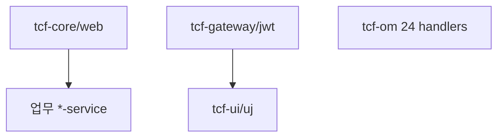

# 부록 N. 소스 인덱스 (클래스·패키지)

| 항목 | 내용 |
| --- | --- |
| **부록** | N |
| **상태** | Master Edition (ztcfbook-h) |
| **목차** | [00-목차](../00-목차.md) |

---

## 아키텍처 뷰



---

## Master 해설

부록 N은 docs/SOURCE_INDEX.md 기반 패키지→핵심 클래스 인덱스로, TCF.process·STF·ETF·OnlineTransactionController·TransactionDispatcher·{bc}/entry/handler/*Handler 경로를 장애 triage starting point로 제공합니다. 온라인 10단(Controller→TCF→STF→Dispatcher→Handler→ETF) 네비게이션은 제01편 3장과 동일합니다.

ztcfbook-h 구현 샘플 file path가 SOURCE_INDEX·실 repo layout과 drift하면 Master Edition 신뢰도가 떨어집니다. 신규 module·Handler 추가 시 SOURCE_INDEX.md 갱신을 MR checklist에 포함하십시오.

Cross-module jump: tcf-gateway ProxyController→업무 Handler, tcf-om Om*Handler→schema.sql table, tcf-eai TcfServiceClient→target ServiceId Catalog.

아키텍트: INDEX를 IDE 대체가 아닌 onboarding·incident map으로 유지하고, 분기별 stale link scan을 권장합니다.

---

## 구현 샘플 (코드베이스)

### TCF.process

```java
package com.nh.nsight.tcf.core.support.processor;

import com.nh.nsight.tcf.core.support.context.TransactionContext;
import com.nh.nsight.tcf.core.support.context.TransactionContextHolder;
import com.nh.nsight.tcf.core.support.error.BusinessException;
import com.nh.nsight.tcf.core.support.message.StandardHeader;
import com.nh.nsight.tcf.core.support.message.StandardRequest;
import com.nh.nsight.tcf.core.support.message.StandardResponse;
import com.nh.nsight.tcf.core.support.dispatch.TransactionDispatcher;
import com.nh.nsight.tcf.core.support.security.AuthenticationContextHolder;
import com.nh.nsight.tcf.core.support.timeout.OnlineTransactionTimeoutExecutor;
import com.nh.nsight.tcf.core.support.timeout.TimeoutContextHolder;
import com.nh.nsight.tcf.core.support.timeout.TimeoutExceptionResolver;
import java.util.Map;
import org.slf4j.MDC;
import org.springframework.stereotype.Component;

@Component
public class TCF {
    private final STF stf;
    private final TransactionDispatcher dispatcher;
    private final ETF etf;
    private final OnlineTransactionTimeoutExecutor onlineTransactionTimeoutExecutor;

    public TCF(STF stf,
            TransactionDispatcher dispatcher,
            ETF etf,
            OnlineTransactionTimeoutExecutor onlineTransactionTimeoutExecutor) {
        this.stf = stf;
        this.dispatcher = dispatcher;
        this.etf = etf;
        this.onlineTransactionTimeoutExecutor = onlineTransactionTimeoutExecutor;
    }

    public StandardResponse<Object> process(StandardRequest<Map<String, Object>> request) {
```

원본: [`tcf-core/src/main/java/com/nh/nsight/tcf/core/support/processor/TCF.java`](../tcf-core/src/main/java/com/nh/nsight/tcf/core/support/processor/TCF.java)

### OnlineTransactionController

```java
package com.nh.nsight.tcf.web.entry.web;

import com.nh.nsight.tcf.core.support.message.StandardHeader;
import com.nh.nsight.tcf.core.support.message.StandardRequest;
import com.nh.nsight.tcf.core.support.message.StandardResponse;
import com.nh.nsight.tcf.core.support.processor.TCF;
import jakarta.servlet.http.HttpServletRequest;
import java.util.Map;
import org.springframework.web.bind.annotation.PathVariable;
import org.springframework.web.bind.annotation.PostMapping;
import org.springframework.web.bind.annotation.RequestBody;
import org.springframework.web.bind.annotation.RestController;
import org.springframework.util.StringUtils;

@RestController
public class OnlineTransactionController {
    private final TCF tcf;

    public OnlineTransactionController(TCF tcf) {
        this.tcf = tcf;
    }

    @PostMapping("/online")
    public StandardResponse<Object> handleRoot(@RequestBody StandardRequest<Map<String, Object>> request,
                                               HttpServletRequest servletRequest) {
        return handle(null, request, servletRequest);
    }

    @PostMapping("/{businessCode}/online")
    public StandardResponse<Object> handleWithBusinessCode(@PathVariable("businessCode") String businessCode,
                                                           @RequestBody StandardRequest<Map<String, Object>> request,
                                                           HttpServletRequest servletRequest) {
        return handle(businessCode, request, servletRequest);
    }

```

원본: [`tcf-web/src/main/java/com/nh/nsight/tcf/web/entry/web/OnlineTransactionController.java`](../tcf-web/src/main/java/com/nh/nsight/tcf/web/entry/web/OnlineTransactionController.java)

### SOURCE_INDEX

```markdown
# NSIGHT TCF Framework Source Index

## 1. TCF 공통 모듈

| 영역 | 위치 |
|---|---|
| Util | `tcf-util/src/main/java/com/nh/nsight/tcf/util` |
| 표준 전문 | `tcf-core/src/main/java/com/nh/nsight/tcf/core/message` |
| 거래 Context | `tcf-core/src/main/java/com/nh/nsight/tcf/core/context` |
| 오류/예외 | `tcf-core/src/main/java/com/nh/nsight/tcf/core/error` |
| TCF | `tcf-core/src/main/java/com/nh/nsight/tcf/core/processor/TCF.java` |
| STF | `tcf-core/src/main/java/com/nh/nsight/tcf/core/processor/STF.java` |
| ETF | `tcf-core/src/main/java/com/nh/nsight/tcf/core/processor/ETF.java` |
| Dispatcher | `tcf-core/src/main/java/com/nh/nsight/tcf/core/dispatch/TransactionDispatcher.java` |
| Handler Interface | `tcf-core/src/main/java/com/nh/nsight/tcf/core/transaction/TransactionHandler.java` |
| Controller | `tcf-web/src/main/java/com/nh/nsight/tcf/web/controller/OnlineTransactionController.java` |

## 2. 업무 샘플

| 업무 | 대표 Handler |
|---|---|
| SV | `sv-service/src/main/java/com/nh/nsight/marketing/sv/entry/handler/SvSampleHandler.java` |
| IC | `ic-service/src/main/java/com/nh/nsight/marketing/ic/entry/handler/IcSampleHandler.java` |
| MG | `mg-service/src/main/java/com/nh/nsight/marketing/mg/entry/handler/MgSampleHandler.java` |
| OM | `tcf-om/src/main/java/com/nh/nsight/marketing/om/entry/handler/OmSampleHandler.java` |

## 3. 실행 흐름

```text
OnlineTransactionController → TCF → STF → TransactionDispatcher → Handler
  → Facade → Service → Rule / DAO → Mapper
  → ETF → StandardResponse
```

상세 소스 가이드: [architecture/29-facade.md](architecture/29-facade.md)  
Spring Boot 기동: [architecture/30-springboot.md](architecture/30-springboot.md)  
AutoConfiguration: [architecture/31-autoconfiguration.md](architecture/31-autoconfiguration.md)  
AOP: [architecture/32-AOP.md](architecture/32-AOP.md)  
TCF 엔진: [architecture/33-TCF.md](architecture/33-TCF.md)  
STF: [architecture/34-STF.md](architecture/34-STF.md)  
```

원본: [`docs/SOURCE_INDEX.md`](../docs/SOURCE_INDEX.md)

---

## Master Deep Dive — 부록 N · 소스 인덱스

- 패키지별 핵심 클래스表
- Handler 경로 `{bc}/entry/handler/*Handler`
- 온라인 10단: Controller→TCF→STF→Dispatcher→Handler→ETF
- docs/SOURCE_INDEX.md 최신 유지

### 아키텍트 체크리스트

- 상단 **구현 샘플**을 실제 코드와 대조한다.
- **심화 참고**와 ztcfbook 본문 절 번호를 매핑한다.
- 운영·배포 관점은 ztcfbook-h Master 블록을 우선 본다.

---

## 심화 참고 (Master)

- [docs/SOURCE_INDEX.md](../docs/SOURCE_INDEX.md)
- [docs/architecture/33-TCF.md](../docs/architecture/33-TCF.md)
- [zarchitecture/16-모듈-포트-의존성-레퍼런스.md](../zarchitecture/16-모듈-포트-의존성-레퍼런스.md)

---

## N.1 TCF 공통 라이브러리

| 영역 | 패키지·클래스 경로 |
| --- | --- |
| Util | `tcf-util/src/main/java/com/nh/nsight/tcf/util` |
| 표준 전문 | `tcf-core/.../support/message` — `StandardRequest`, `StandardResponse`, `StandardHeader` |
| 오류/예외 | `tcf-core/.../support/error` — `BusinessException`, `SystemException`, `ErrorCode` |
| 거래 Context | `tcf-core/.../support/security` — `AuthenticationContext`, `AuthenticationContextHolder` |
| 거래통제 | `tcf-core/.../support/control` — `TransactionControlValidator` |
| 타임아웃 | `tcf-core/.../support/timeout` — `TimeoutPolicyService`, `OnlineTransactionTimeoutExecutor` |
| 거래로그 | `tcf-core/.../support/logging` — `TransactionLogService`, `TcfTransactionLogConstants` |
| 감사 | `tcf-core/.../support/logging` — `AuditLogService` |

---

## N.2 TCF 처리 엔진 (STF · TCF · Dispatcher · ETF)

| 컴포넌트 | 클래스 | 경로 |
| --- | --- | --- |
| **STF** (전처리) | `STF` | `tcf-core/src/main/java/com/nh/nsight/tcf/core/support/processor/STF.java` |
| **TCF** (오케스트레이터) | `TCF` | `tcf-core/.../support/processor/TCF.java` |
| **Dispatcher** | `TransactionDispatcher` | `tcf-core/.../support/dispatch/TransactionDispatcher.java` |
| **ETF** (후처리) | `ETF` | `tcf-core/.../support/processor/ETF.java` |
| **Handler Interface** | `TransactionHandler` | `tcf-core/.../support/transaction/TransactionHandler.java` |
| Header 검증 | `StandardHeaderValidator` | `tcf-core/.../support/validation/StandardHeaderValidator.java` |

STF는 Header 7항 검증·GUID·세션·권한·거래통제를 수행하고, Dispatcher는 `serviceId → Handler` 맵에서 Bean을 실행하며, ETF는 결과 조립·거래로그·감사·메트릭을 기록한다.

---

## N.3 tcf-web — HTTP 진입점

| 클래스 | 경로 | 역할 |
| --- | --- | --- |
| `OnlineTransactionController` | `tcf-web/src/main/java/com/nh/nsight/tcf/web/entry/web/OnlineTransactionController.java` | `POST /online`, `POST /{businessCode}/online` |
| `GlobalStandardExceptionHandler` | `tcf-web/.../entry/web/GlobalStandardExceptionHandler.java` | 표준 오류 응답 변환 |
| `TransactionLogSchemaInitializer` | `tcf-web/.../persistence/dao/TransactionLogSchemaInitializer.java` | `TCF_TX_LOG` 자동 DDL |
| `JdbcTransactionLogRepository` | `tcf-web/.../persistence/dao/JdbcTransactionLogRepository.java` | 거래로그 INSERT |

---

## N.4 업무 WAR Handler 위치 패턴

모든 업무 WAR는 동일 패키지 규칙을 따른다.

```text
{module}/src/main/java/com/nh/nsight/marketing/{bc}/entry/handler/{Bc}{Domain}Handler.java
```

| BC | 모듈 | Handler 패키지 | 대표 Handler |
| --- | --- | --- | --- |
| IC | ic-service | `.../marketing/ic/entry/handler/` | `IcSampleHandler`, `IcCustomerHandler` |
| PC | pc-service | `.../marketing/pc/entry/handler/` | `PcSampleHandler` |
| MS | ms-service | `.../marketing/ms/entry/handler/` | `MsSampleHandler` |
| SV | sv-service | `.../marketing/sv/entry/handler/` | `SvSampleHandler`, `SvCustomerHandler`, `SvIntegrationHandler` |
| PD | pd-service | `.../marketing/pd/entry/handler/` | `PdSampleHandler` |
| EB | eb-service | `.../marketing/eb/entry/handler/` | `EbSampleHandler`, `EbUserHandler`, `EbEventHandler` |
| EP | ep-service | `.../marketing/ep/entry/handler/` | `EpSampleHandler`, `EpUserEventHandler` |
| SS | ss-service | `.../marketing/ss/entry/handler/` | `SsSampleHandler` |
| MG | mg-service | `.../marketing/mg/entry/handler/` | `MgSampleHandler` |

6계층 하위 패키지 (업무 WAR 공통):

| 계층 | 패키지 접미어 |
| --- | --- |
| Facade | `.../application/facade/` |
| Service | `.../application/service/` |
| Rule | `.../application/rule/` |
| DAO | `.../persistence/dao/` |
| Mapper XML | `{module}/src/main/resources/mapper/{bc}/` |

---

## N.5 tcf-om (운영관리 WAR)

| 영역 | 경로 |
| --- | --- |
| Application | `tcf-om/.../NsightOmServiceApplication.java` |
| Handler (24종) | `tcf-om/src/main/java/com/nh/nsight/marketing/om/entry/handler/Om*.java` |
| MyBatis | `tcf-om/src/main/resources/mapper/om/OmOperationMapper.xml` |
| DB 마이그레이션 | `tcf-om/.../support/OmDatabaseMigration.java` |
| 스키마·시드 | `tcf-om/src/main/resources/schema.sql`, `data.sql` |
| 파일 업·다운로드 | `tcf-om/.../updownload/service/OmUpdownloadService.java` |

대표 Handler: `OmAuthHandler`, `OmServiceCatalogHandler`, `OmTransactionLogHandler`, `OmSessionHandler`, `OmBatchHandler`, `OmHealthCheckHandler`

---

## N.6 tcf-gateway

| 영역 | 경로 |
| --- | --- |
| Application | `tcf-gateway/.../NsightGatewayApplication.java` |
| 프록시 Controller | `tcf-gateway/.../entry/web/AbstractBusinessProxyController.java` |
| Route 설정 | `tcf-gateway/src/main/resources/application.yml`, `application-local.yml` |
| BC 상수 | `tcf-gateway/.../support/GatewayBusinessModules.java` |
| 라우팅 문서 | `tcf-gateway/docs/ROUTING_TABLE.md` |

Gateway는 URL 경로의 `businessCode`로 downstream WAR를 선택하고 표준 전문을 그대로 Relay한다. bootRun context `/`, ztomcat context `/gw`.

---

## N.7 tcf-jwt

| 영역 | 경로 |
| --- | --- |
| Application | `tcf-jwt/.../NsightJwtServiceApplication.java` |
| Auth Handler | `tcf-jwt/src/main/java/com/nh/nsight/auth/jwt/entry/handler/JwtAuth*.java` |
| Token Handler | `JwtTokenInquiryHandler`, `JwtRefreshTokenInquiryHandler`, `JwtTokenRevokeHandler` |
| SSO | `JwtAuthSsoIssueHandler` |
| Key 설정 | `tcf-jwt/.../config/JwtKeyConfiguration.java` |

대표 serviceId: `JWT.Auth.login`, `JWT.Auth.refresh`, `JWT.Auth.logout`

---

## N.8 tcf-batch

| 영역 | 경로 |
| --- | --- |
| Application | `tcf-batch/.../NsightTcfBatchApplication.java` |
| 모니터링 적재 | `tcf-batch/.../support/OmDashboardStatusRepository.java` |
| DB 마이그레이션 | `tcf-batch/.../BatchDatabaseMigration.java` |
| 세션 메트릭 | `tcf-batch/.../SessionMetricsClient.java` |
| 배치 Controller | `tcf-batch/.../entry/web/DeployStatusBatchController.java` |

`tcf-batch`는 `OM_AP_STATUS`, `OM_DB_STATUS`, `OM_SESSION_STATUS`, `OM_DEPLOY_STATUS`, `OM_BATCH_HISTORY`에 스냅샷·이력을 기록한다.

---

## N.9 UI·연동·캐시 모듈

| 모듈 | 핵심 경로 | 역할 |
| --- | --- | --- |
| tcf-ui | `tcf-ui/.../NsightTcfUiApplication.java` | 브라우저 Relay (포트 8099) |
| tcf-uj | `tcf-uj/.../NsightTcfUjApplication.java` | UJ 채널 Relay → Gateway |
| tcf-eai | `tcf-eai/src/main/java/com/nh/nsight/tcf/eai` | WAR 간 동기 연동 (ic↔sv) |
| tcf-cache | `tcf-cache/src/main/java/com/nh/nsight/tcf/cache` | EhCache 추상화 (tcf-om 사용) |

---

## N.10 온라인 거래 실행 흐름

```text
[Client / tcf-ui / tcf-uj / Gateway]
        │
        ▼ POST /{bc}/online  (Gateway: /gw/{BC}/online)
┌───────────────────────────────────┐
│  OnlineTransactionController        │  tcf-web
│  JSON → StandardRequest             │
└───────────────┬───────────────────┘
                ▼
┌───────────────────────────────────┐
│  TCF.process()                      │  tcf-core
│    ├─ STF  : Header검증·GUID·권한  │
│    ├─ TransactionDispatcher         │
│    │     └─ TransactionHandler      │  업무/OM/JWT Handler
│    │           └─ Facade            │
│    │                 └─ Service     │
│    │                       └─ Rule  │
│    │                             └─ DAO → Mapper XML
│    └─ ETF  : StandardResponse·로그   │
└───────────────┬───────────────────┘
                ▼
        JSON StandardResponse
        TCF_TX_LOG INSERT (ETF)
```

Handler는 `getServiceId()`로 등록되며, Dispatcher는 기동 시 Spring Context에서 모든 `TransactionHandler` Bean을 수집한다. OM `OM_SERVICE_CATALOG`에 없는 serviceId는 STF 거래통제 단계에서 차단될 수 있다.

---

## N.11 아키텍처 문서 교차 참조

| 주제 | docs/architecture |
| --- | --- |
| TCF 엔진 | [33-TCF.md](../../docs/architecture/33-TCF.md) |
| STF | [34-STF.md](../../docs/architecture/34-STF.md) |
| ETF | [36-ETF.md](../../docs/architecture/36-ETF.md) |
| 6계층 | [01-application-layer.md](../../docs/architecture/01-application-layer.md) |
| Facade | [29-facade.md](../../docs/architecture/29-facade.md) |
| Spring Boot 기동 | [30-springboot.md](../../docs/architecture/30-springboot.md) |

---

## 요약

NSIGHT TCF 소스는 `tcf-core`의 STF·TCF·Dispatcher·ETF 파이프라인을 중심으로 하고, `tcf-web`의 `OnlineTransactionController`가 모든 WAR의 단일 HTTP 진입점이다. 업무 Handler는 `com.nh.nsight.marketing.{bc}.entry.handler`에 위치하며, OM·JWT·배치·Gateway는 각각 독립 패키지 트리를 가진다. 거래 실행은 Controller → TCF → Handler → 6계층 → ETF → `TCF_TX_LOG` 순으로 진행된다.

---

## 이전 · 다음

| | |
| --- | --- |
| ← 이전 | [부록 M](./M-명명규칙-21주제-색인.md) |
| → 다음 | — |

---

## 출처 색인 · Master 확장

| 구분 | 경로 |
| --- | --- |
| ztcfbook-h | 본 파일 |
| ztcfbook | `../ztcfbook/부록/N-소스-인덱스.md` |

### 원본 출처


| 절 | 참고 문서 |
| --- | --- |
| N.1~N.3 | [docs/SOURCE_INDEX.md](../../docs/SOURCE_INDEX.md), [docs/architecture/33-TCF.md](../../docs/architecture/33-TCF.md) |
| N.4 | [docs/SOURCE_INDEX.md](../../docs/SOURCE_INDEX.md), 업무 WAR `entry/handler/` (코드베이스) |
| N.5~N.8 | [zarchitecture/16-모듈-포트-의존성-레퍼런스.md](../../zarchitecture/16-모듈-포트-의존성-레퍼런스.md), [docs/architecture/19-tcf-table.md](../../docs/architecture/19-tcf-table.md) |
| N.10 | [docs/SOURCE_INDEX.md](../../docs/SOURCE_INDEX.md), [zman/05-TCF처리구조.md](../../zman/05-TCF처리구조.md) |
| N.11 | [docs/architecture/](../../docs/architecture/) |
