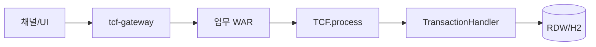

# 제1장. NSIGHT TCF란 무엇인가

| 항목 | 내용 |
| --- | --- |
| **편** | 제1편 · TCF Framework 이해하기 |
| **에디션** | **Master** — 아키텍트·시니어·플랫폼 |
| **기반 원본** | [ztcfbook/제01편/01-NSIGHT-TCF란-무엇인가.md](../ztcfbook/제01편/01-NSIGHT-TCF란-무엇인가.md) |
| **입문서** | [ztcfbook-m](../ztcfbook-m/README.md) |
| **장** | 제1장 |
| **파일** | `제01편/01-NSIGHT-TCF란-무엇인가.md` |
| **상태** | Master Edition (ztcfbook-h) |
| **목차** | [00-목차](../00-목차.md) |

---

## 아키텍처 뷰



---

## Master 해설

NSIGHT TCF는 REST Resource Controller 대신 Online Endpoint(`/{businessCode}/online`) 하나로 모든 업무 거래를 수용하는 프레임워크입니다. ServiceId가 TransactionDispatcher의 라우팅 키이고, 거래코드는 감사·거래통제·Catalog 메타데이터로 쓰이므로 두 식별자의 역할 분리를 이해하지 못하면 설계 단계부터 Handler와 OM 등록이 어긋납니다.

클라이언트 요청은 tcf-gateway 또는 tcf-ui Relay를 거쳐 업무 WAR에 도달하고, OnlineTransactionController가 StandardRequest를 받아 TCF.process()를 호출합니다. 이후 STF 전처리, TimeoutExecutor, Dispatcher, Handler, ETF 후처리까지 한 파이프라인으로 귀결되므로 "Controller에서 비즈니스 로직 처리"는 프레임워크 계약 위반입니다.

bootRun 단독 개발과 ztomcat WAR 통합 배포의 이중 모델은 프로파일·Context Path·Gateway downstream URL 차이를 만듭니다. 로컬에서 통과한 거래가 ztomcat 8080 통합 환경에서 실패하는 경우, 대부분 Gateway route·session-validation·OM H2 seed 불일치에서 기인합니다.

아키텍트 리뷰에서는 신규 거래마다 OM Service Catalog 등록, Handler serviceIds() 선언, Facade @Transactional 경계 세 가지가 동시에 충족되는지 확인해야 합니다. Handler만 추가하고 Catalog를 빼면 런타임 SERVICE_NOT_FOUND 또는 거래통제 E-TCF-CTL-* 오류가 운영 직후에 터집니다.

---

## 구현 샘플 (코드베이스)

### OnlineTransactionController

```java
@RestController
public class OnlineTransactionController {
    private final TCF tcf;

    public OnlineTransactionController(TCF tcf) {
        this.tcf = tcf;
    }

    @PostMapping("/online")
    public StandardResponse<Object> handleRoot(@RequestBody StandardRequest<Map<String, Object>> request,
                                               HttpServletRequest servletRequest) {
        return handle(null, request, servletRequest);
    }

    @PostMapping("/{businessCode}/online")
    public StandardResponse<Object> handleWithBusinessCode(@PathVariable("businessCode") String businessCode,
                                                           @RequestBody StandardRequest<Map<String, Object>> request,
                                                           HttpServletRequest servletRequest) {
        return handle(businessCode, request, servletRequest);
    }

    private StandardResponse<Object> handle(String businessCode,
                                            StandardRequest<Map<String, Object>> request,
                                            HttpServletRequest servletRequest) {
        System.out.println("\n ======================================================================[OnlineTransactionController.handle] start");
        System.out.println(" ======================================================================[OnlineTransactionController.handle] businessCode=" + businessCode);
        if (request.getHeader() == null) {
            System.out.println(" ======================================================================[OnlineTransactionController.handle] create empty header");
            request.setHeader(new StandardHeader());
        }
        StandardHeader header = request.getHeader();
        if (StringUtils.hasText(businessCode) && !StringUtils.hasText(header.getBusinessCode())) {
            System.out.println(" ======================================================================[OnlineTransactionController.handle] set businessCode from path");
            header.setBusinessCode(businessCode);
        }
        if (!StringUtils.hasText(header.getClientIp())) {
            System.out.println(" ======================================================================[OnlineTransactionController.handle] resolveClientIp");
            header.setClientIp(resolveClientIp(servletRequest));
        }
        System.out.println(" ======================================================================[OnlineTransactionController.handle] tcf.process serviceId="
                + header.getServiceId());
        StandardResponse<Object> response = tcf.process(request);
        System.out.println(" ======================================================================[OnlineTransactionController.handle] end");
        return response;
```

원본: [`tcf-web/src/main/java/com/nh/nsight/tcf/web/entry/web/OnlineTransactionController.java`](../tcf-web/src/main/java/com/nh/nsight/tcf/web/entry/web/OnlineTransactionController.java)

### NsightWarBootstrap

```java
package com.nh.nsight.tcf.web.support;

import org.springframework.boot.builder.SpringApplicationBuilder;
import org.springframework.boot.web.servlet.support.SpringBootServletInitializer;

/**
 * 외부 Tomcat WAR 배포 시 Spring Boot 컨텍스트를 기동합니다.
 */
public abstract class NsightWarBootstrap extends SpringBootServletInitializer {
    private final Class<?> source;

    protected NsightWarBootstrap(Class<?> source) {
        this.source = source;
    }

    @Override
    protected SpringApplicationBuilder configure(SpringApplicationBuilder application) {
        return application.sources(source);
    }
}

```

원본: [`tcf-web/src/main/java/com/nh/nsight/tcf/web/support/NsightWarBootstrap.java`](../tcf-web/src/main/java/com/nh/nsight/tcf/web/support/NsightWarBootstrap.java)

---

## Master Deep Dive — NSIGHT TCF 개요

- Online Endpoint(`/{bc}/online`)만 사용 — REST Resource Controller 아님
- ServiceId가 Dispatcher 라우팅 키, 거래코드는 감사·통제용
- bootRun(개발) vs ztomcat WAR(통합) 이중 배포 모델
- 신규 거래 = OM Catalog + Handler serviceIds() + Facade @Transactional

### 아키텍트 체크리스트

- 상단 **구현 샘플**을 실제 코드와 대조한다.
- **심화 참고**와 ztcfbook 본문 절 번호를 매핑한다.
- 운영·배포 관점은 ztcfbook-h Master 블록을 우선 본다.

---

## 심화 참고 (Master)

- [docs/architecture/architecture.md](../docs/architecture/architecture.md)
- [znsight-man/03-TCF-개발원칙.md](../znsight-man/03-TCF-개발원칙.md)
- [zman/05-TCF처리구조.md](../zman/05-TCF처리구조.md)
- [znsight-man/22-Online-Endpoint-기준.md](../znsight-man/22-Online-Endpoint-기준.md)

---

## 1.1 TCF의 목적과 핵심 원칙

NSIGHT TCF(Transaction Control Framework)는 마케팅 플랫폼의 모든 온라인 거래를 **하나의 표준 방식**으로 수신·검증·실행·응답·기록하기 위한 거래 실행 프레임워크이다. 단순한 공통 라이브러리나 Controller 추상화 모듈이 아니라, HTTP/JSON 표준 전문과 ServiceId Dispatcher를 중심으로 **거래 전체 생명주기를 통제**하는 플랫폼 계층이다.

일반적인 Spring Boot REST 애플리케이션은 URL 경로가 곧 업무 의미를 가진다. `POST /customers/summary`와 `POST /campaigns/search`는 각각 별도의 Controller 메서드에 매핑되며, 인증·로깅·예외 처리는 프로젝트마다 제각각 구현되는 경우가 많다. NSIGHT TCF는 이 접근을 의도적으로 배제한다. 모든 업무 WAR는 `POST /{businessCode}/online`이라는 **단일 진입점**을 사용하고, 실제 실행 대상은 JSON Header의 `serviceId`로 결정한다.

TCF Framework 개발 원칙은 열 가지로 정리된다. 첫째, HTTP/JSON 표준 전문 방식을 사용한다. 둘째, ServiceId 중심으로 개발한다. 셋째, 모든 거래는 STF → Dispatcher → Handler → ETF 공통 파이프라인을 통과한다. 넷째, Handler는 Facade 호출만 담당하고 업무 로직을 직접 처리하지 않는다. 다섯째, Handler·Facade·Service·Rule·DAO·Mapper 계층 책임을 분리한다. 여섯째, OM 또는 거래통제에 등록된 ServiceId만 실행한다. 일곱째, 세션·권한·Timeout·로그·오류응답을 업무별로 임의 우회하지 않는다. 여덟째, GUID·TraceId·ServiceId·거래코드·SQL ID로 추적 가능해야 한다. 아홉째, Timeout과 자원 보호를 개발 단계에서 확보한다. 열째, Handler·Service·Rule·DAO·Mapper 단위로 테스트 가능한 구조를 유지한다.

개발자에게 핵심 메시지는 명확하다. **업무 로직은 개발자가 구현하고, 거래 실행은 TCF가 통제한다.** 이 분리가 없으면 운영 환경에서 거래통제·감사·장애 추적이 불가능해진다. 신규 개발자는 "내 거래만 빠르게 만들자"는 유혹에 빠지기 쉽지만, TCF 원칙을 어기면 Gateway 라우팅·OM Catalog·거래로그·권한 검증과의 정합성이 한꺼번에 깨진다.

```text
[개발자 책임]                    [TCF 책임]
Handler → Facade → Service       STF 전처리 (Header 검증, GUID)
Rule → DAO → Mapper              Dispatcher (serviceId 라우팅)
                                 ETF 후처리 (결과 조립, 거래로그)
```

TCF를 도입하는 조직에서 자주 나오는 질문은 "Spring MVC로도 충분하지 않은가?"이다. 단일 소규모 서비스에서는 REST Controller만으로도 개발이 가능하다. 그러나 NSIGHT처럼 9개 이상의 업무 WAR, OM 운영관리, Gateway, JWT, 배치가 공존하는 환경에서는 **거래 실행 방식의 표준화** 없이는 운영 비용이 기하급수적으로 증가한다. TCF는 이 문제를 프레임워크 계층에서 해결한다. 모든 WAR가 동일한 Header 검증, 동일한 로그 스키마, 동일한 오류 응답 형식을 사용하므로 OM 대시보드·장애 분석·보안 감사가 가능해진다.

원칙 6 "등록된 거래만 실행"과 원칙 7 "공통 처리 우회 금지"는 특히 엄격히 적용된다. 개발자가 Handler 안에서 `HttpSession`을 직접 조작하거나, Header 없이 내부 API를 호출하거나, catch 블록에서 임의 JSON을 반환하면 TCF 계약이 깨진다. 코드 리뷰와 CI 품질 게이트에서 이러한 패턴은 반려 대상이다.

---

## 1.2 Handler 중심 개발 · 공통 파이프라인 · 업무 WAR

NSIGHT TCF의 아키텍처는 세 축으로 요약된다. **Handler 중심 개발**, **공통 파이프라인**, **업무 독립 WAR**이다.

Handler 중심 개발이란 업무 개발자가 Spring `@RestController`를 업무별로 만들지 않고, `TransactionHandler` 인터페이스를 구현하여 `serviceId`를 등록하는 방식을 말한다. Dispatcher는 애플리케이션 기동 시 모든 Handler Bean을 스캔하여 `serviceId → Handler` 맵을 구성한다. 요청이 들어오면 Header의 `serviceId`로 Handler를 찾아 `doHandle`을 호출한다. 업무 개발의 90%는 이 Handler와 그 아래 Facade·Service·Rule·DAO 계층에 집중된다.

공통 파이프라인은 `tcf-core` 모듈의 STF(Standard Transaction Framework, 전처리)·TCF(Dispatcher)·ETF(End Transaction Framework, 후처리)가 담당한다. STF는 Header 7항 검증, GUID·TraceId 생성, 세션·권한·멱등성 검사, 거래 시작 로그를 수행한다. Dispatcher는 등록된 Handler를 실행한다. ETF는 결과 코드 매핑, StandardResponse 조립, 거래 종료 로그·감사·메트릭을 기록한다. 업무 개발자는 이 파이프라인을 재구현하거나 우회할 수 없다.

업무 독립 WAR는 9개 업무 도메인(ic, pc, ms, sv, pd, eb, ep, ss, mg)이 각각 동일한 패턴의 Spring Boot WAR로 배포된다는 의미이다. 모든 WAR는 `tcf-web`을 의존하여 `OnlineTransactionController`와 TCF 엔진을 공유하지만, Handler·Facade·Service·DAO 코드는 완전히 분리된다. 이 구조는 업무별 독립 배포·롤백·용량 확장을 가능하게 한다.

```text
                    ┌─────────────────────────────────────────┐
                    │           Client / Channel              │
                    │  (브라우저, tcf-ui Relay, 외부 REST)     │
                    └──────────────────┬──────────────────────┘
                                       │ POST /{code}/online (JSON)
                    ┌──────────────────▼──────────────────────┐
                    │     업무 WAR / tcf-om (Spring Boot)      │
                    │  OnlineTransactionController / Gateway   │
                    └──────────────────┬──────────────────────┘
                                       │
                    ┌──────────────────▼──────────────────────┐
                    │              TCF Engine                  │
                    │         STF → Dispatcher → ETF             │
                    └──────────────────┬──────────────────────┘
                                       │
                    ┌──────────────────▼──────────────────────┐
                    │   Handler → Facade → Service → DAO       │
                    └─────────────────────────────────────────┘
```

플랫폼 모듈(tcf-om, tcf-gateway, tcf-jwt, tcf-batch 등)도 동일한 TCF 파이프라인과 6계층 패키지 규칙을 따른다. OM 운영관리 화면의 거래도 `OM.Auth.login` 같은 ServiceId로 처리되며, 업무 WAR와 동일한 STF·ETF를 통과한다.

업무 WAR 독립성은 배포·운영 측면에서 중요한 이점을 제공한다. SV 업무만 변경되었을 때 `sv.war`만 재배포하면 되며, IC·PC 등 다른 WAR는 영향을 받지 않는다. 장애 격리도 용이하다. 특정 WAR의 Connection Pool 고갈이 다른 WAR로 전파되지 않도록 인스턴스·Pool이 분리된다. 다만 공통 프레임워크(`tcf-core`) 버전은 전 WAR가 동일하게 유지해야 하며, 릴리즈 전략 문서(제20장)의 호환성 매트릭스를 따른다.

신규 팀원 온보딩 시 "Handler만 만들면 된다"는 말은 반은 맞고 반은 틀리다. Handler는 진입점일 뿐이며, Facade·Service·Rule·DAO·Mapper·DTO·OM 등록까지 포함한 **거래 단위 개발**이 완성된 것이 진정한 "거래 개발 완료"이다. 제3편(제8~11장)에서 이 실무 흐름을 상세히 다룬다.

---

## 1.3 REST가 아닌 Online Endpoint 방식

NSIGHT TCF는 REST Resource 중심이 아니라 **Online Endpoint + 표준 전문** 방식을 채택한다. 이는 레거시 금융·정보계 시스템의 전문(준문) 처리 패턴을 HTTP/JSON 시대에 맞게 재해석한 것이다.

REST 방식에서 URL은 리소스와 동작을 동시에 표현한다. `GET /customers/{id}`, `POST /campaigns`, `PUT /messages/{id}/status`처럼 HTTP Method와 Path 조합이 API 계약이 된다. NSIGHT TCF에서는 URL이 **업무 Context 진입점** 역할만 한다. SV 업무는 `/sv/online`, CM 업무는 `/cm/online`으로 요청을 받고, 어떤 기능을 실행할지는 전적으로 Header의 `serviceId`가 결정한다.

표준 요청 전문은 `header`와 `body` 두 영역으로 구성된다. Header에는 `businessCode`, `serviceId`, `transactionCode`, `channelId`, `userId` 등 공통 통제·추적 정보가 담긴다. Body에는 업무별 요청 데이터가 담긴다. 표준 응답 전문은 `header`, `result`, `body`(선택), `error`(실패 시)로 구성된다.

```json
{
  "header": {
    "businessCode": "SV",
    "serviceId": "SV.Customer.selectSummary",
    "transactionCode": "SV-INQ-0001",
    "serviceName": "고객요약조회",
    "userId": "U123456",
    "channelId": "WEBTOP",
    "branchId": "001"
  },
  "body": {
    "customerNo": "1234567890"
  }
}
```

| 구분 | REST 방식 | NSIGHT TCF 방식 |
| --- | --- | --- |
| 실행 식별 | URL + HTTP Method | `header.serviceId` |
| 진입점 | 리소스별 URL 다수 | `POST /{businessCode}/online` 단일 |
| 요청 구조 | 자유 형식 JSON | `header` + `body` 표준 |
| 응답 구조 | 자유 형식 | `header` + `result` + `body` |
| 거래 추적 | 애플리케이션 자체 구현 | GUID, TraceId, transactionCode 내장 |
| 거래통제 | 별도 구현 | Header 7항 + OM Catalog 연동 |

Online Endpoint 방식의 장점은 운영 통제와 추적성이다. Gateway는 `businessCode`만 보고 올바른 WAR로 라우팅하면 되고, WAR 내부에서는 Dispatcher가 `serviceId`로 Handler를 선택한다. 거래로그·감사로그·권한·Timeout은 Header 항목과 OM Catalog를 기준으로 일관되게 적용된다. 채널(WebTop, tcf-ui, 외부 API)이 달라도 동일한 전문 구조를 사용하므로 연동 비용이 낮다.

REST와 TCF 방식을 혼용하는 것은 금지된다. "빠른 조회용으로만 REST Controller 하나 추가"하는 패턴은 Gateway 라우팅·OM 거래통제·거래로그에서 누락을 발생시킨다. 외부 시스템이 REST 스타일 API를 요구하더라도 내부적으로는 `POST /{bc}/online` + 표준 전문으로 변환하는 Adapter를 Gateway 또는 연계 계층에 둔다. OpenAPI 문서가 필요한 경우 ServiceId·거래코드·Body 스키마를 기준으로 문서를 생성한다.

HTTP Method는 원칙적으로 POST만 사용한다. GET으로 조회 거래를 노출하지 않는다. 이는 요청 Body에 업무 데이터가 포함되는 표준 전문 구조와 일치하며, 보안 정책상 URL에 민감 파라미터가 노출되는 것을 방지한다.

요청 전문의 `body`는 업무마다 자유롭게 정의하되, 필드명은 camelCase를 사용하고 Request DTO와 1:1 매핑한다. 응답 `body`는 `result.code`가 SUCCESS일 때만 신뢰한다. 실패 응답에서 부분 `body`를 내려주는 패턴은 클라이언트 혼란을 유발하므로 지양한다.

---

## 1.4 bootRun vs Tomcat WAR (이중 배포)

NSIGHT TCF Framework는 **이중 배포 모드**를 지원한다. 개발 단계에서는 Gradle `bootRun`으로 각 모듈을 독립 포트에서 기동하고, 통합 검증 단계에서는 `ztomcat` 도구로 단일 Tomcat 8080에 여러 WAR를 배포한다.

`bootRun` 모드는 개발 생산성을 위한 것이다. `sv-service`는 8086, `tcf-om`은 8097, `tcf-gateway`는 8100 포트에서 각각 독립 실행된다. 개발자는 자신이 담당하는 WAR만 기동하여 빠르게 Handler·Service·Mapper를 수정·검증할 수 있다. `application-local.yml` 프로파일로 H2 인메모리 DB를 사용하면 외부 DB 없이도 거래 테스트가 가능하다.

`ztomcat` 모드는 운영 환경에 가까운 통합 검증을 위한 것이다. `ztomcat`은 빌드된 WAR 파일들을 단일 Tomcat 인스턴스(기본 8080)에 배포한다. Gateway Context는 `/gw`, JWT는 `/jwt`, 업무 WAR는 `/sv`, `/ic` 등 업무코드 Context로 마운트된다. Apache 프록시·Sticky Session·SSL 종료를 시뮬레이션할 때 이 모드가 필수적이다.

| 항목 | bootRun | ztomcat (Tomcat WAR) |
| --- | --- | --- |
| 목적 | 개발·단위 검증 | 통합·운영 유사 검증 |
| 포트 | 모듈별 분리 (8082~8110) | 단일 8080 |
| Context | `/{businessCode}` | 동일, Gateway는 `/gw` |
| DB | H2 local 프로파일 | 공유 H2 또는 외부 DB |
| 기동 명령 | `./gradlew :sv-service:bootRun` | `ztomcat deploy` |
| Gateway 라우팅 | 직접 업무 포트 호출 가능 | 8080/gw 경유 필수 |

두 모드 모두 동일한 WAR 산출물을 사용한다. `bootRun`은 embedded Tomcat, `ztomcat`은 external Tomcat에 배포할 뿐 애플리케이션 코드·TCF 파이프라인·Handler 동작은 동일하다. 운영 배포 전에는 반드시 `ztomcat` 환경에서 Gateway 경유 End-to-End 거래를 검증해야 한다. bootRun에서만 테스트한 거래가 ztomcat에서 Context Path 불일치로 실패하는 사례가 빈번하다.

`application.yml` 프로파일도 모드에 맞게 전환한다. `local` 프로파일은 bootRun + H2, `ztomcat` 프로파일은 8080 통합 + 공유 DB 설정을 사용한다. Gateway Context(`/gw` vs `/`)와 JWT Context(`/jwt` vs `/`) 차이는 부록 K 모듈·포트 매핑표에서 확인한다. DevOps 담당자와 협업하여 CI 파이프라인에 `bootWar` 산출물 생성과 ztomcat 스모크 테스트 단계를 포함하는 것을 권장한다.

---

## 1.5 개발자 역할과 RACI

NSIGHT TCF 프로젝트에서 개발자 역할은 업무 개발자·플랫폼 개발자·OM/운영 담당자·아키텍트·DevOps로 구분된다. 각 역할의 책임(R)과 승인(A)을 명확히 하면 거래 설계부터 운영 전환까지 누락 없이 진행할 수 있다.

**업무 개발자**는 담당 업무 WAR의 ServiceId 설계, TransactionHandler·Facade·Service·Rule·DAO·Mapper 구현, 단위·통합 테스트 작성을 담당한다. ServiceId와 거래코드는 OM Catalog 등록 절차와 연계하여 사전 합의된 명명규칙을 따라야 한다. 공통 파이프라인(STF·ETF)이나 Gateway 라우팅을 임의 수정해서는 안 된다.

**플랫폼 개발자**는 `tcf-core`, `tcf-web`, `tcf-gateway`, `tcf-jwt`, `tcf-eai` 등 Foundation·Platform 모듈을 담당한다. TCF 엔진 개선, AutoConfiguration, AOP, 거래로그 SPI, Gateway STF/GRF/GSF/GEF 파이프라인이 이 범위에 해당한다.

**OM/운영 담당자**는 Service Catalog 등록, 거래통제 정책, Timeout 설정, 공통코드·오류코드 관리, 운영 대시보드를 담당한다. 업무 개발자가 구현한 ServiceId는 OM에 등록되어야 실제 운영 환경에서 실행된다.

| 활동 | 업무 개발자 | 플랫폼 개발자 | OM/운영 | 아키텍트 | DevOps |
| --- | --- | --- | --- | --- | --- |
| ServiceId 설계 | R | C | A | C | — |
| Handler·Service 구현 | R/A | — | — | C | — |
| OM Catalog 등록 | R | — | A | — | — |
| TCF 엔진 변경 | C | R/A | — | A | — |
| Gateway·JWT 설정 | C | R | C | A | R |
| CI/CD·배포 | C | C | C | C | R/A |
| 거래통제·Timeout | R | C | A | C | — |

RACI에서 가장 흔한 실수는 업무 개발자가 ServiceId를 코드에만 등록하고 OM Catalog 등록을 누락하는 것이다. TCF는 미등록 ServiceId를 기본 차단하므로, 개발 환경에서 동작하더라도 통합 환경에서는 "ServiceId not registered" 오류가 발생한다. 반대로 OM에만 등록하고 Handler를 구현하지 않으면 "Handler not found" 오류가 난다. 설계 단계에서 ServiceId·거래코드·Handler·OM 등록을 한 세트로 관리해야 한다.

아키텍트는 표준 준수 여부와 모듈 의존 방향을 감독한다. 플랫폼 모듈 변경이 전 업무 WAR에 미치는 영향을 ADR(Architecture Decision Record)로 기록한다. DevOps는 WAR 빌드·배포·롤백·모니터링 파이프라인을 운영하며, 장애 시 거래로그 GUID로 업무·플랫폼 담당자를 연결한다. 역할별 읽기 경로는 [00-목차](../00-목차.md)의 "역할별 읽기 경로"를 참조한다.

---

## 장 요약 (Master)

NSIGHT TCF는 HTTP/JSON 표준 전문과 ServiceId Dispatcher를 기반으로 모든 온라인 거래의 수신·검증·실행·응답·기록을 통제하는 거래 실행 프레임워크이다. 업무 개발자는 TransactionHandler와 6계층 구조에 집중하고, STF·Dispatcher·ETF 공통 파이프라인은 프레임워크가 담당한다. REST Resource 방식이 아닌 `POST /{businessCode}/online` Online Endpoint를 사용하며, bootRun과 ztomcat 이중 배포로 개발 생산성과 통합 검증을 모두 지원한다. 역할별 RACI를 따르면 ServiceId 설계부터 OM 등록·배포까지 누락 없이 운영 가능한 거래를 만들 수 있다.

> Master Edition: **아키텍처 뷰** → **Master 해설** → **구현 샘플** → **Master Deep Dive** → **심화 참고** 순으로 본문과 함께 읽는다.

---

## 이전 · 다음

| | |
| --- | --- |
| ← 이전 | [서문](../서문/00-서문.md) |
| → 다음 | [제2장 전체 시스템 구조](./02-전체-시스템-구조.md) |

---

## 출처 색인 · Master 확장

| 구분 | 경로 |
| --- | --- |
| ztcfbook-h | 본 파일 |
| ztcfbook | `../ztcfbook/제01편/01-NSIGHT-TCF란-무엇인가.md` |

### 원본 출처


- [znsight-man/03-TCF-개발원칙.md](../../znsight-man/03-TCF-개발원칙.md)
- [zman/05-TCF처리구조.md](../../zman/05-TCF처리구조.md)
- [docs/architecture/architecture.md](../../docs/architecture/architecture.md)
- [znsight-man/22-Online-Endpoint-기준.md](../../znsight-man/22-Online-Endpoint-기준.md)
- [zman/06-표준전문구조.md](../../zman/06-표준전문구조.md)
- [znsight-man/10-bootRun-Tomcat-WAR-차이.md](../../znsight-man/10-bootRun-Tomcat-WAR-차이.md)
- [ztomcat/README.md](../../ztomcat/README.md)
- [znsight-man/05-개발자-역할과-책임.md](../../znsight-man/05-개발자-역할과-책임.md)
