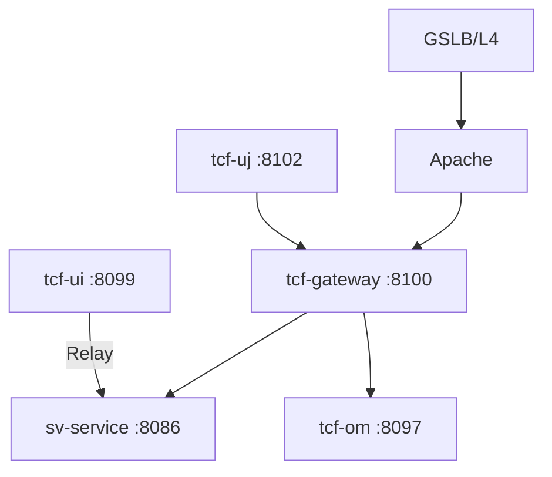

# 제2장. 전체 시스템 구조

| 항목 | 내용 |
| --- | --- |
| **편** | 제1편 · TCF Framework 이해하기 |
| **에디션** | **Master** — 아키텍트·시니어·플랫폼 |
| **기반 원본** | [ztcfbook/제01편/02-전체-시스템-구조.md](../ztcfbook/제01편/02-전체-시스템-구조.md) |
| **입문서** | [ztcfbook-m](../ztcfbook-m/README.md) |
| **장** | 제2장 |
| **파일** | `제01편/02-전체-시스템-구조.md` |
| **상태** | Master Edition (ztcfbook-h) |
| **목차** | [00-목차](../00-목차.md) |

---

## 아키텍처 뷰



---

## Master 해설

GSLB·Apache·tcf-gateway·업무 WAR·tcf-om으로 이어지는 물리 배치는 장애 격리와 확장 단위를 결정합니다. Gateway(:8100)가 `/{bc}/online` 프록시를 담당하고, tcf-ui(:8099)는 개발 Relay, tcf-uj(:8102)는 Gateway 경유 UI 채널로 분리되어 있어 "UI에서 되는데 Gateway 경유는 안 된다" 유형의 이슈는 라우팅 계층부터 분해해야 합니다.

9개 업무 WAR(ic·pc·ms·sv·pd·eb·ep·ss·mg)와 플랫폼 모듈은 Gradle 멀티모듈 settings.gradle이 SoT이며, 포트·Context Path·WAR 파일명은 부록 K와 BusinessModuleDefinitions에서 1:1로 맞춰져 있습니다. 업무 WAR는 tcf-web을 transitively 의존하므로 tcf-core STF/TCF 변경은 전 WAR에 파급됩니다.

채널별 통계와 거래통제는 StandardHeader channelId·businessCode와 Gateway ROUTING_TABLE 정합에 달려 있습니다. 외부 REST 연계를 추가할 때 Online Endpoint 규약을 깨고 ad-hoc Controller를 만들면 STF Header 검증·TxLog·MDC 추적이 모두 우회됩니다.

운영 점검 시 ztomcat deploy-wars.sh ALL_MODULES 스모크, Gateway downstream health, OM Dashboard feed(tcf-batch) 수신 여부를 주기적으로 확인하십시오. 포트 충돌이나 Context Path 오타는 기동은 되지만 Proxy 404로만 드러나는 경우가 많습니다.

---

## 구현 샘플 (코드베이스)

### BusinessModuleDefinitions (tcf-ui)

```java
package com.nh.nsight.tcf.ui.support;

import java.util.List;

public final class BusinessModuleDefinitions {
    private BusinessModuleDefinitions() {}

    public static final List<ModuleDefinition> ALL = List.of(
            new ModuleDefinition("CC", "Common", "공통", 8081),
            new ModuleDefinition("IC", "Integration Customer", "고객", 8082),
            new ModuleDefinition("PC", "Private Customer", "고객", 8083),
            new ModuleDefinition("BC", "Business Customer", "고객", 8084),
            new ModuleDefinition("MS", "Mini Single View", "고객", 8085),
            new ModuleDefinition("SV", "Single View", "마케팅", 8086),
            new ModuleDefinition("PD", "Product", "마케팅", 8087),
            new ModuleDefinition("CM", "Campaign", "마케팅", 8088),
            new ModuleDefinition("EB", "EBM", "마케팅", 8089),
            new ModuleDefinition("EP", "Event Processing", "실시간", 8090),
            new ModuleDefinition("BP", "Behavior Processing", "실시간", 8091),
            new ModuleDefinition("BD", "Behavior Data", "데이터", 8092),
            new ModuleDefinition("SS", "Sales Support", "지원", 8093),
            new ModuleDefinition("CS", "Common Service", "지원", 8094),
            new ModuleDefinition("CT", "Contents", "지원", 8095),
            new ModuleDefinition("MG", "Message", "지원", 8096),
            new ModuleDefinition("OM", "Operation Management (tcf-om)", "운영", 8097),
            new ModuleDefinition("UD", "Common UpDownload (tcf-om)", "공통", 8097),
            new ModuleDefinition("JWT", "JWT Auth (tcf-jwt)", "인증", 8110)
    );

    public record ModuleDefinition(String code, String name, String group, int localPort) {}
}

```

원본: [`tcf-ui/src/main/java/com/nh/nsight/tcf/ui/support/BusinessModuleDefinitions.java`](../tcf-ui/src/main/java/com/nh/nsight/tcf/ui/support/BusinessModuleDefinitions.java)

### deploy-wars.sh

```shell
#!/usr/bin/env bash
set -euo pipefail

ZTOMCAT_HOME="$(cd "$(dirname "${BASH_SOURCE[0]}")" && pwd)"
PROJECT_HOME="$(cd "${ZTOMCAT_HOME}/.." && pwd)"
CATALINA_HOME="${ZTOMCAT_HOME}/apache-tomcat-10.1.34"
WEBAPPS="${CATALINA_HOME}/webapps"

ALL_MODULES=(
  ic-service:ic.war:ic.war:ic
  pc-service:pc.war:pc.war:pc
  ms-service:ms.war:ms.war:ms
  sv-service:sv.war:sv.war:sv
  pd-service:pd.war:pd.war:pd
  eb-service:eb.war:eb.war:eb
  ep-service:ep.war:ep.war:ep
  ss-service:ss.war:ss.war:ss
  mg-service:mg.war:mg.war:mg
  tcf-om:tcf-om.war:om.war:om
  tcf-ui:tcf-ui.war:ui.war:ui
  tcf-jwt:jwt.war:jwt.war:jwt
  tcf-batch:tcf-batch.war:zz-batch.war:batch
)

usage() {
  cat <<'EOF'
Usage:
  deploy-wars.sh              Build and deploy all 13 WARs
  deploy-wars.sh all          Same as above
  deploy-wars.sh sv           Build and deploy one code (e.g. sv.war -> /sv)
  deploy-wars.sh sv ic om     Build and deploy multiple codes

Codes: ic pc ms sv pd eb ep ss mg om ui jwt batch
  (별칭: tcf-jwt, tcf-om, tcf-ui, tcf-batch)
EOF
```

원본: [`ztomcat/deploy-wars.sh`](../ztomcat/deploy-wars.sh)

---

## Master Deep Dive — 전체 시스템 구조

- 9 업무 WAR + 플랫폼(tcf-om/ui/uj/jwt/gateway/batch/eai/cache)
- 포트·Context Path·WAR명 1:1 — 부록 K 참조
- Gradle 멀티모듈, 업무 WAR는 tcf-web transitively 의존
- tcf-ui=개발 Relay, tcf-uj=Gateway 경유 UI

### 아키텍트 체크리스트

- 상단 **구현 샘플**을 실제 코드와 대조한다.
- **심화 참고**와 ztcfbook 본문 절 번호를 매핑한다.
- 운영·배포 관점은 ztcfbook-h Master 블록을 우선 본다.

---

## 심화 참고 (Master)

- [zarchitecture/01-전체-시스템-아키텍처.md](../zarchitecture/01-전체-시스템-아키텍처.md)
- [zarchitecture/16-모듈-포트-의존성-레퍼런스.md](../zarchitecture/16-모듈-포트-의존성-레퍼런스.md)
- [docs/architecture/48-multi-module-dependencies.md](../docs/architecture/48-multi-module-dependencies.md)

---

## 2.1 GSLB → Gateway → WAR → TCF 흐름

NSIGHT 마케팅 플랫폼의 End-to-End 아키텍처는 클라이언트 요청이 인프라 계층을 거쳐 업무 WAR, TCF 엔진, 데이터 계층까지 도달하는 다층 구조이다. 운영 환경에서는 GSLB(Global Server Load Balancer) → L4 Load Balancer → Apache(SSL·Proxy·Sticky Session) → tcf-gateway → 업무 WAR 순으로 요청이 전달된다.

클라이언트 계층에는 WebTopSuite, 외부 REST API, tcf-ui·tcf-uj 테스트 UI가 포함된다. WebTopSuite는 운영 채널의 대표 프론트엔드이며, `POST /{businessCode}/online` 표준 전문을 직접 호출한다. tcf-ui는 개발·테스트용 Relay UI로, 업무 WAR 또는 Gateway에 프록시 요청을 보낸다. tcf-uj는 반드시 Gateway(8100)를 경유하여 거래를 테스트하는 UI이다.

인프라 계층의 Apache는 SSL 종료, 리버스 프록시, Sticky Session(JSESSIONID 기반)을 담당한다. 동일 사용자의 연속 요청이 같은 WAR 인스턴스로 라우팅되어야 세션 일관성이 유지된다. Apache는 업무 WAR로 직접 프록시할 수도 있고, tcf-gateway(8100)를 경유할 수도 있다. Gateway 경유 시 JWT 검증·라우팅·세션 관문이 추가된다.

```text
[클라이언트] WebTop / tcf-ui / 외부 API
      │
      ▼
[GSLB] → [L4] → [Apache: SSL · Proxy · Sticky]
      │
      ├──────────────────────┐
      ▼                      ▼
[tcf-gateway:8100]    [업무 WAR 직접]
      │                      │
      └──────────┬───────────┘
                 ▼
      [업무 WAR: ic~mg, tcf-om, tcf-jwt]
                 │
                 ▼
      [tcf-web] OnlineTransactionController
                 │
                 ▼
      [tcf-core] STF → Dispatcher → ETF
                 │
                 ▼
      [6계층] Handler → Facade → Service → Rule → DAO
                 │
                 ▼
      [데이터] RDW · ADW · SESSIONDB · LOGDB · OMDB
```

단일 온라인 거래의 처리 경로를 단계별로 보면 다음과 같다. 클라이언트가 `POST /sv/online`에 JSON 전문을 전송한다. Apache 또는 Gateway가 요청을 sv-service WAR로 전달한다. `OnlineTransactionController`가 JSON을 `StandardRequest`로 역직렬화하고 TCF 엔진에 위임한다. STF가 Header 검증·GUID 생성·세션·권한·멱등성을 처리한다. Dispatcher가 `serviceId`로 Handler를 찾아 실행한다. Handler는 Facade를 호출하고, Facade·Service·Rule·DAO가 업무 로직을 수행한다. ETF가 `StandardResponse`를 조립하고 거래 종료 로그를 기록한다. JSON 응답이 클라이언트에 반환된다.

비기능 목표(NFR)는 설계서 기준으로 동시 사용자 36,000, TPS 720, P95 응답 3초 이내, 가용성 99.99%이다. 이를 달성하기 위해 HikariCP Connection Pool, Online Timeout + Query Timeout 다층 구조, 기준정보 Cache, RDW/ADW 역할 분리가 적용된다.

물리 배포 관점에서 업무 WAR는 수평 확장(Scale-out)된다. L4·Apache가 여러 인스턴스에 부하를 분산하고, Sticky Session으로 동일 사용자의 요청을 같은 인스턴스에 고정한다. Gateway는 라우팅·JWT 검증만 담당하며 상태를 최소화한다. Stateless에 가까운 설계가 DR(재해복구) 전환 시 유리하다. 제20장에서 CI/CD·릴리즈·DR 절차를 다룬다.

로컬 개발에서 End-to-End 흐름을 축소하면 `tcf-ui → sv-service:8086/sv/online`만으로도 Handler·Service·Mapper 검증이 가능하다. 그러나 운영 배포 전에는 `tcf-uj → Gateway:8100 → sv-service` 경로와 ztomcat 8080 통합 검증을 반드시 수행한다.

---

## 2.2 채널·UI·외부 연계

NSIGHT TCF의 채널 아키텍처는 **표준 전문 계약**을 중심으로 다양한 호출 주체를 수용한다. 채널이 무엇이든 요청·응답 JSON 구조와 Header 항목은 동일해야 한다.

**WebTopSuite**는 운영 채널의 핵심이다. 화면에서 거래를 호출할 때 `channelId`를 `WEBTOP`으로 설정하고, `userId`·`branchId`·`transactionCode`를 Header에 포함한다. WebTop은 Gateway 또는 Apache를 경유하여 업무 WAR에 직접 요청을 보낸다.

**tcf-ui**(포트 8099)는 개발·운영 테스트용 Relay UI이다. 브라우저에서 표준 전문을 편집하여 업무 WAR 또는 tcf-om에 직접 POST할 수 있다. OM Admin 화면도 tcf-ui Relay를 통해 접근한다. tcf-ui는 Spring Boot JAR로 실행되며, 자체 TCF 파이프라인 없이 HTTP 프록시 역할만 한다.

**tcf-uj**(포트 8102)는 Gateway 경유 테스트 전용 UI이다. JWT·Gateway 라우팅·세션 관문을 포함한 운영 유사 경로를 검증할 때 사용한다. tcf-uj → tcf-gateway → 업무 WAR 흐름은 운영 환경과 동일하다.

**외부 REST 연계**는 tcf-eai 모듈을 통해 이루어진다. 업무 WAR 내부에서 다른 WAR의 ServiceId를 HTTP/JSON으로 호출한다. 예를 들어 sv-service가 ic-service의 `IC.Customer.inquiry`를 tcf-eai Client로 호출할 수 있다. 외부 연계도 표준 전문 구조를 유지하며, `integration.services` 설정으로 대상 URL을 지정한다.

| 채널/UI | 포트 | 경로 | 용도 |
| --- | --- | --- | --- |
| WebTopSuite | — | Gateway 또는 Apache 경유 | 운영 채널 |
| tcf-ui | 8099 | 업무 WAR 직접 Relay | 개발·OM 테스트 |
| tcf-uj | 8102 | Gateway(8100) 경유 | Gateway·JWT 검증 테스트 |
| tcf-eai Client | — | 업무 WAR 내부 | 서비스 간 연동 |

채널 ID(`channelId`)는 Header에 반드시 포함되어야 하며, 거래통제·감사로그·통계에서 채널별 분석의 기준이 된다. 신규 채널 도입 시 OM 공통코드에 채널 ID를 등록하고, 거래통제 정책에 허용 채널을 반영해야 한다.

tcf-ui와 tcf-uj의 차이를 혼동하지 말아야 한다. tcf-ui는 **업무 WAR 직접** 호출로 Handler·Service 로직을 빠르게 검증할 때 사용한다. tcf-uj는 **Gateway 경유**로 JWT·라우팅·세션 관문까지 포함한 운영 유사 경로를 검증한다. 운영 전환 체크리스트(부록 J)에서는 tcf-uj E2E 통과를 필수 항목으로 둔다.

---

## 2.3 9개 업무 WAR + 플랫폼 모듈 맵

NSIGHT TCF Framework는 Gradle 멀티 모듈로 구성되며, 모듈은 Foundation·Platform Services·Business Domain·Legacy·Tooling 다섯 계층으로 분류된다.

**Foundation** 계층은 모든 모듈의 기반이다. `tcf-util`은 Spring 비의존 순수 Java 유틸(GuidGenerator, DateTimeUtil)을 제공한다. `tcf-core`는 TCF 엔진 전체(STF, Dispatcher, ETF, StandardRequest/Response, TransactionContext)를 포함한다. `tcf-web`은 HTTP 진입점(OnlineTransactionController), AutoConfiguration, WAR Bootstrap을 제공한다. `tcf-cache`는 EhCache 기반 Spring Cache를, `tcf-eai`는 서비스 간 HTTP/JSON 연동 Client를 제공한다.

**Platform Services** 계층은 운영·인프라 기능을 담당한다. `tcf-om`(8097, /om)은 운영관리 OM 포털이다. `tcf-batch`(8098)는 OM 대시보드 상태 수집 배치이다. `tcf-ui`(8099), `tcf-uj`(8102)는 테스트 UI이다. `tcf-gateway`(8100)는 API Gateway이다. `tcf-jwt`(8110)는 JWT 발급·JWKS이다.

**Business Domain** 계층은 9개 업무 WAR이다. 각 WAR는 업무코드(BC), 독립 포트, Context Path를 가진다.

| WAR | BC | 포트 | Context | 도메인 |
| --- | --- | --- | --- | --- |
| ic-service | IC | 8082 | /ic | 통합고객 |
| pc-service | PC | 8083 | /pc | 캠페인 |
| ms-service | MS | 8085 | /ms | 마케팅전략 |
| sv-service | SV | 8086 | /sv | Single View |
| pd-service | PD | 8087 | /pd | 상품 |
| eb-service | EB | 8089 | /eb | 이벤트브로커 |
| ep-service | EP | 8090 | /ep | 이벤트프로세서 |
| ss-service | SS | 8093 | /ss | 세그먼트 |
| mg-service | MG | 8096 | /mg | 메시지 |

목표 확장은 17업무 WAR(cc, ct 등 추가)이지만, 현재 코드베이스는 9개 업무 + OM + JWT를 기준으로 한다. `om-service`는 레거시 OM으로 `tcf-om` 사용을 권장한다.

의존 방향은 단방향이다. `tcf-util` ← `tcf-core` ← `tcf-web` ← 업무 WAR. 업무 WAR는 서로 직접 의존하지 않고, 필요 시 `tcf-eai`로 HTTP 호출한다. `tcf-gateway`와 `tcf-ui`는 독립 실행 모듈이다.

각 업무 WAR의 도메인 책임은 zarchitecture/04와 zguide 모듈별 가이드에 정의되어 있다. 예를 들어 sv-service는 Single View(고객 통합 조회), ic-service는 통합고객 마스터, mg-service는 메시지 발송이다. 업무 간 데이터 공유는 DB 직접 접근이 아닌 ServiceId 기반 EAI 호출 또는 공유 RDW 테이블(설계 승인)로 한다.

---

## 2.4 로컬 포트·Context Path 레퍼런스

로컬 개발 환경에서 각 모듈은 고정 포트와 Context Path를 사용한다. 포트 충돌 없이 여러 WAR를 동시에 bootRun할 수 있도록 포트가 분리되어 있다.

업무 WAR의 Context Path는 업무코드와 일치한다. `sv-service`는 `server.servlet.context-path: /sv`로 설정되며, Online Endpoint는 `http://localhost:8086/sv/online`이 된다. `tcf-om`은 `/om`, `tcf-gateway`는 bootRun 시 `/`, ztomcat 시 `/gw`이다.

ztomcat 통합 환경에서는 모든 WAR가 8080 포트에 배포된다. Gateway는 `http://localhost:8080/gw`, SV 업무는 `http://localhost:8080/sv/online`으로 접근한다. Context Path가 bootRun과 ztomcat에서 다를 수 있는 모듈(tcf-gateway, tcf-jwt)은 `application.yml`의 profile별 설정을 확인해야 한다.

```text
로컬 bootRun 포트 맵 (주요 모듈)

8082  ic-service    /ic/online
8083  pc-service    /pc/online
8085  ms-service    /ms/online
8086  sv-service    /sv/online
8087  pd-service    /pd/online
8089  eb-service    /eb/online
8090  ep-service    /ep/online
8093  ss-service    /ss/online
8096  mg-service    /mg/online
8097  tcf-om        /om/online
8098  tcf-batch     /batch
8099  tcf-ui        /
8100  tcf-gateway   /
8102  tcf-uj        /
8110  tcf-jwt       /

ztomcat 통합: 8080 (모든 WAR, Gateway=/gw, JWT=/jwt)
```

개발자는 담당 WAR의 포트·Context·Endpoint를 숙지하고, tcf-ui나 curl로 거래 테스트 시 정확한 URL을 사용해야 한다. `POST http://localhost:8086/online`처럼 Context Path를 빠뜨리면 404가 발생한다.

IDE Run Configuration에서 `spring.profiles.active=local`을 설정하는 것이 일반적이다. 여러 WAR를 동시에 기동할 때는 포트 충돌을 방지하기 위해 zarchitecture/16 표를 붙여두고, 담당 외 WAR는 tcf-ui Relay로 원격 호출한다. H2 콘솔·Actuator health 엔드포인트는 로컬에서만 노출하고 운영에서는 비활성화한다.

---

## 2.5 Gradle 멀티 모듈 의존 그래프

`nsight-tcf-framework` 루트 프로젝트는 `settings.gradle`에 모든 서브모듈을 선언하고, 각 모듈의 `build.gradle`에서 의존성을 정의한다. 의존 방향 위반(업무 WAR → 다른 업무 WAR 직접 의존, tcf-core → 업무 WAR)은 금지된다.

```text
nsight-tcf-framework
│
├─ [Foundation]
│   ├─ tcf-util          순수 Java 유틸 (Spring 비의존)
│   ├─ tcf-core          TCF 엔진, STF/Dispatcher/ETF
│   ├─ tcf-web           HTTP 진입, AutoConfiguration
│   ├─ tcf-cache         EhCache (tcf-om 의존)
│   └─ tcf-eai           서비스 간 HTTP Client
│
├─ [Platform]
│   ├─ tcf-om            운영관리 OM
│   ├─ tcf-batch         배치 모니터링
│   ├─ tcf-ui / tcf-uj   테스트 UI
│   ├─ tcf-gateway       API Gateway
│   └─ tcf-jwt           JWT 발급
│
├─ [Business] ic … mg (9개 *-service)
├─ [Legacy] om-service
└─ [Tooling] tcf-cicd, tcf-scripts, ztomcat
```

업무 WAR의 표준 의존성은 `tcf-web`이다. `tcf-web`이 `tcf-core`와 `tcf-util`을 전이 의존하므로 업무 WAR는 `tcf-web`만 선언하면 된다. `tcf-eai`가 필요한 모듈(ic-service, sv-service 등)은 추가로 선언한다. `tcf-om`은 `tcf-cache`를 추가 의존한다.

빌드 명령은 모듈 단위로 실행한다. `./gradlew :sv-service:build`는 sv-service WAR만 빌드한다. `./gradlew build`는 전체 모듈을 빌드한다. CI/CD 파이프라인은 변경된 모듈만 선택 빌드하는 전략을 사용할 수 있다.

신규 업무 WAR 추가 시 `settings.gradle`에 모듈을 등록하고, `build.gradle`에서 `tcf-web` 의존·WAR 플러그인·Context Path·포트를 표준에 맞게 설정한다. `Nsight{Xxx}Application`은 `NsightWarBootstrap`을 상속하여 TCF AutoConfiguration이 적용되도록 한다.

멀티 모듈에서 `tcf-core` 변경은 **전 WAR 영향**을 미친다. 프레임워크 버전 업그레이드 시 regression 테스트 범위를 9개 업무 + OM + JWT로 확장한다. `docs/architecture/48-multi-module-dependencies.md`의 의존 그래프와 금지 의존 목록을 변경 전에 반드시 확인한다.

---

## 장 요약 (Master)

NSIGHT TCF 시스템은 GSLB·Apache·Gateway를 거쳐 업무 WAR에 도달하는 다층 아키텍처이며, 모든 온라인 거래는 동일한 TCF 파이프라인(STF → Dispatcher → ETF)을 통과한다. WebTop·tcf-ui·tcf-uj·tcf-eai 등 다양한 채널이 표준 전문 계약으로 연결된다. 9개 업무 WAR와 플랫폼 모듈(tcf-om, gateway, jwt 등)이 Gradle 멀티 모듈로 구성되며, 로컬 bootRun 포트와 ztomcat 8080 통합 환경을 구분하여 사용한다.

> Master Edition: **아키텍처 뷰** → **Master 해설** → **구현 샘플** → **Master Deep Dive** → **심화 참고** 순으로 본문과 함께 읽는다.

---

## 이전 · 다음

| | |
| --- | --- |
| ← 이전 | [제1장 NSIGHT TCF란 무엇인가](./01-NSIGHT-TCF란-무엇인가.md) |
| → 다음 | [제3장 TCF 처리 엔진](./03-TCF-처리-엔진.md) |

---

## 출처 색인 · Master 확장

| 구분 | 경로 |
| --- | --- |
| ztcfbook-h | 본 파일 |
| ztcfbook | `../ztcfbook/제01편/02-전체-시스템-구조.md` |

### 원본 출처


- [zarchitecture/01-전체-시스템-아키텍처.md](../../zarchitecture/01-전체-시스템-아키텍처.md)
- [zarchitecture/13-UI-채널-아키텍처.md](../../zarchitecture/13-UI-채널-아키텍처.md)
- [zguide/tcf-ui-개발가이드.md](../../zguide/tcf-ui-개발가이드.md)
- [zarchitecture/04-업무-도메인-서비스-아키텍처.md](../../zarchitecture/04-업무-도메인-서비스-아키텍처.md)
- [zman/04-모듈구성.md](../../zman/04-모듈구성.md)
- [zarchitecture/16-모듈-포트-의존성-레퍼런스.md](../../zarchitecture/16-모듈-포트-의존성-레퍼런스.md)
- [zguide/README.md](../../zguide/README.md)
- [docs/architecture/48-multi-module-dependencies.md](../../docs/architecture/48-multi-module-dependencies.md)
- [znsight-man/08-Gradle-멀티모듈.md](../../znsight-man/08-Gradle-멀티모듈.md)
