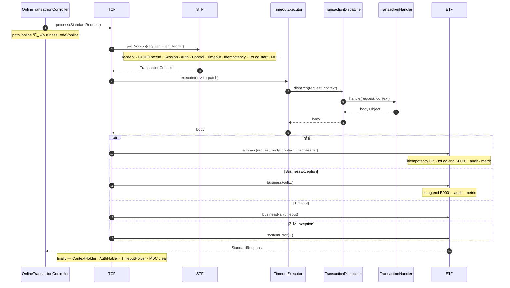
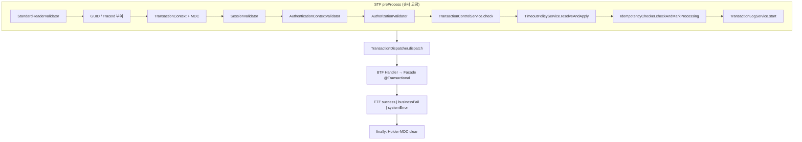

# 제3장. TCF 처리 엔진

| 항목 | 내용 |
| --- | --- |
| **편** | 제1편 · TCF Framework 이해하기 |
| **에디션** | **Master** — 아키텍트·시니어·플랫폼 |
| **기반 원본** | [ztcfbook/제01편/03-TCF-처리-엔진.md](../ztcfbook/제01편/03-TCF-처리-엔진.md) |
| **입문서** | [ztcfbook-m](../ztcfbook-m/README.md) |
| **장** | 제3장 |
| **파일** | `제01편/03-TCF-처리-엔진.md` |
| **상태** | Master Edition (ztcfbook-h) |
| **목차** | [00-목차](../00-목차.md) |

---

## 아키텍처 뷰



### STF 내부 · ETF 합류



---

## Master 해설

TCF.process()는 STF preProcess → TimeoutExecutor → TransactionDispatcher → ETF postProcess의 고정 순서를 강제합니다. STF 10단(Header 검증, GUID/TraceId, TransactionContext·MDC, Session, Auth, Authorization, 거래통제, Timeout, Idempotency, TxLog.start) 중 하나라도 실패하면 Handler와 DB 트랜잭션은 실행되지 않습니다. 이 "선 검증 후 실행" 모델이 프레임워크의 안전장치입니다.

TransactionDispatcher는 ServiceId→TransactionHandler 레지스트리에서 Handler를 찾고, 중복 serviceId 등록 시 IllegalStateException으로 기동을 중단합니다. Handler는 body Object를 반환할 뿐 StandardResponse를 조립하지 않으며, ETF가 success·businessFail·systemError 세 경로로 result·errorCode·TxLog.end·audit·metric을 일괄 처리합니다.

clientHeader 스냅샷 echo 규칙은 응답 Header가 요청 Header와 필드 단위로 대응되도록 ETF에 위임되어 있습니다. finally 블록에서 ContextHolder·AuthHolder·TimeoutHolder·MDC clear가 누락되면 스레드 풀 reuse 시 세션·권한 정보가 다음 거래로 유출되는 치명적 결함이 됩니다.

코드 리뷰에서는 TimeoutPolicyService가 STF 8단에서 resolve된 값과 OnlineTransactionTimeoutExecutor 적용 구간이 일치하는지, 장애 추적 시 guid/traceId와 TCF_TX_LOG INSERT가 모든 WAR에서 동작하는지 검증하십시오. STF 단계별 BusinessException과 E-TCF-HDR-* 오류코드 매핑도 ETF 경로와 대조해야 합니다.

---

## 구현 샘플 (코드베이스)

### OnlineTransactionController

```java
@RestController
public class OnlineTransactionController {
    private final TCF tcf;

    public OnlineTransactionController(TCF tcf) {
        this.tcf = tcf;
    }

    @PostMapping("/online")
    public StandardResponse<Object> handleRoot(@RequestBody StandardRequest<Map<String, Object>> request,
                                               HttpServletRequest servletRequest) {
        return handle(null, request, servletRequest);
    }

    @PostMapping("/{businessCode}/online")
    public StandardResponse<Object> handleWithBusinessCode(@PathVariable("businessCode") String businessCode,
                                                           @RequestBody StandardRequest<Map<String, Object>> request,
                                                           HttpServletRequest servletRequest) {
        return handle(businessCode, request, servletRequest);
    }

    private StandardResponse<Object> handle(String businessCode,
                                            StandardRequest<Map<String, Object>> request,
                                            HttpServletRequest servletRequest) {
        System.out.println("\n ======================================================================[OnlineTransactionController.handle] start");
        System.out.println(" ======================================================================[OnlineTransactionController.handle] businessCode=" + businessCode);
        if (request.getHeader() == null) {
            System.out.println(" ======================================================================[OnlineTransactionController.handle] create empty header");
            request.setHeader(new StandardHeader());
        }
        StandardHeader header = request.getHeader();
        if (StringUtils.hasText(businessCode) && !StringUtils.hasText(header.getBusinessCode())) {
            System.out.println(" ======================================================================[OnlineTransactionController.handle] set businessCode from path");
            header.setBusinessCode(businessCode);
        }
        if (!StringUtils.hasText(header.getClientIp())) {
            System.out.println(" ======================================================================[OnlineTransactionController.handle] resolveClientIp");
            header.setClientIp(resolveClientIp(servletRequest));
        }
        System.out.println(" ======================================================================[OnlineTransactionController.handle] tcf.process serviceId="
                + header.getServiceId());
        StandardResponse<Object> response = tcf.process(request);
        System.out.println(" ======================================================================[OnlineTransactionController.handle] end");
        return response;
```

원본: [`tcf-web/src/main/java/com/nh/nsight/tcf/web/entry/web/OnlineTransactionController.java`](../tcf-web/src/main/java/com/nh/nsight/tcf/web/entry/web/OnlineTransactionController.java)

### TCF.process()

```java
    public StandardResponse<Object> process(StandardRequest<Map<String, Object>> request) {
        TransactionContext context = null;
        StandardHeader clientHeader = StandardHeader.copyOf(request == null ? null : request.getHeader());
        System.out.println("======================================================[TCF.process] start");
        try {
            logClientRequest(request);

            System.out.println(" ============================[TCF.process] STF START");
            context = stf.preProcess(request, clientHeader);
            System.out.println(" ============================[TCF.process] STF END");

            System.out.println(" ============================[TCF.process] DISPATCHER  START");
            TransactionContext dispatchContext = context;
            Object body = onlineTransactionTimeoutExecutor.execute(
                    () -> dispatcher.dispatch(request, dispatchContext));
            System.out.println(" ============================[TCF.process] DISPATCHER END");

            System.out.println(" ============================[TCF.process] ETF START");
            StandardResponse<Object> response = etf.success(request, body, context, clientHeader);
            System.out.println(" ============================[TCF.process] ETF END");

            logClientResponse(response);
            System.out.println(" ========================================================[TCF.process] end (success)");
            return response;
        } catch (BusinessException e) {
            System.out.println(" ============================[TCF.process] ETF.businessFail START");
            StandardResponse<Object> response = etf.businessFail(request, e, context, clientHeader);
            logClientResponse(response);
            System.out.println(" ============================[TCF.process] end (businessFail)");
            return response;
        } catch (Exception e) {
            var timeoutError = TimeoutExceptionResolver.toBusinessException(e);
            if (timeoutError.isPresent()) {
                System.out.println(" ========================[TCF.process] ETF.businessFail (timeout)");
                StandardResponse<Object> response = etf.businessFail(request, timeoutError.get(), context,
                        clientHeader);
                logClientResponse(response);
                System.out.println(" =======================[TCF.process] end (timeoutFail)");
                return response;
            }
            System.out.println(" ===========================[TCF.process] etf.systemError");
            StandardResponse<Object> response = etf.systemError(request, e, context, clientHeader);
            logClientResponse(response);
            System.out.println(" ==========================================[TCF.process] end (systemError)");
            return response;
        } finally {
            System.out.println(" =========================================[TCF.process] cleanup");
            TransactionContextHolder.clear();
            AuthenticationContextHolder.clear();
            TimeoutContextHolder.clear();
            MDC.clear();
        }
    }
```

원본: [`tcf-core/src/main/java/com/nh/nsight/tcf/core/support/processor/TCF.java`](../tcf-core/src/main/java/com/nh/nsight/tcf/core/support/processor/TCF.java)

### STF.preProcess()

```java
    public TransactionContext preProcess(StandardRequest<Map<String, Object>> request, StandardHeader clientHeader) {
        System.out.println("=====================================================[STF.preProcess] start");
        StandardHeader header = request.getHeader();
        if (clientHeader == null) {
            clientHeader = StandardHeader.copyOf(header);
        }
        System.out.println(
                " =====================================================[STF.preProcess] headerValidator.validate");
        headerValidator.validate(request);
        if (!StringUtils.hasText(header.getGuid())) {
            header.setGuid(GuidGenerator.newGuid());
        }
        if (!StringUtils.hasText(header.getTraceId())) {
            header.setTraceId(GuidGenerator.newTraceId());
        }
        clientHeader.applyGeneratedCorrelationIdsFrom(header);
        System.out.println(
                " =====================================================[STF.preProcess] guid/traceId assigned");
        TransactionContext context = new TransactionContext(header, clientHeader);
        TransactionContextHolder.set(context);
        putMdc(header);
        System.out.println(
                " =====================================================[STF.preProcess] sessionValidator.validate");
        sessionValidator.validate(header);
        System.out.println(
                " =====================================================[STF.preProcess] authenticationContextValidator.validate");
        authenticationContextValidator.validate(header, context);
        System.out.println(
                " =====================================================[STF.preProcess] authorizationValidator.validate");
        authorizationValidator.validate(header);
        System.out.println(
                " =====================================================[STF.preProcess] transactionControlService.check");
        transactionControlService.check(header);
        System.out.println(
                " =====================================================[STF.preProcess] timeoutPolicyService.resolveAndApply");
        timeoutPolicyService.resolveAndApply(header, context);
        System.out.println(
                " =====================================================[STF.preProcess] idempotencyChecker.checkAndMarkProcessing");
        idempotencyChecker.checkAndMarkProcessing(header);
        System.out.println(
                " =====================================================[STF.preProcess] transactionLogService.start");
        transactionLogService.start(context);
        System.out.println(" =====================================================[STF.preProcess] end");
        return context;
    }

    private void putMdc(StandardHeader header) {
        MDC.put("guid", header.getGuid());
        MDC.put("traceId", header.getTraceId());
        MDC.put("serviceId", header.getServiceId());
        MDC.put("userId", header.getUserId());
        MDC.put("branchId", header.getBranchId());
    }
```

원본: [`tcf-core/src/main/java/com/nh/nsight/tcf/core/support/processor/STF.java`](../tcf-core/src/main/java/com/nh/nsight/tcf/core/support/processor/STF.java)

### TransactionDispatcher

```java
    public TransactionDispatcher(List<TransactionHandler> handlers) {
        TcfConsoleLog.boundary("Dispatcher", "init", "START");
        for (TransactionHandler handler : handlers) {
            java.util.Collection<String> serviceIds = handler.serviceIds();
            if (serviceIds == null || serviceIds.isEmpty()) {
                log.warn("Handler declares no serviceId, skipped: {}", handler.getClass().getName());
                continue;
            }
            for (String serviceId : serviceIds) {
                TransactionHandler previous = handlerMap.put(serviceId, handler);
                if (previous != null) {
                    throw new IllegalStateException("Duplicate serviceId detected: " + serviceId);
                }
                TcfConsoleLog.step("Dispatcher", "init", "register", serviceId);
                log.info("Registered NSIGHT handler. serviceId={} handler={}",
                        serviceId, handler.getClass().getSimpleName());
            }
        }
        System.out.println(" ============================[Dispatcher] handlerMap dump (size=" + handlerMap.size() + ")");
        handlerMap.forEach((serviceId, mappedHandler) ->
                System.out.println("    " + serviceId + " -> " + mappedHandler.getClass().getName()));
        System.out.println(" ============================[Dispatcher] handlerMap dump end");
        TcfConsoleLog.boundary("Dispatcher", "init", "END", "handlers=" + handlerMap.size());
    }

    public Object dispatch(StandardRequest<Map<String, Object>> request, TransactionContext context) {
        TcfConsoleLog.boundary("Dispatcher", "dispatch", "START");
        String serviceId = request.getHeader() == null ? null : request.getHeader().getServiceId();
        TcfConsoleLog.step("Dispatcher", "dispatch", "resolve serviceId", serviceId);
        if (!StringUtils.hasText(serviceId)) {
            TcfConsoleLog.boundary("Dispatcher", "dispatch", "END", "invalid serviceId");
            throw new BusinessException(ErrorCode.INVALID_HEADER, "serviceId가 없습니다.");
        }
        TransactionHandler handler = handlerMap.get(serviceId);
        if (handler == null) {
            TcfConsoleLog.boundary("Dispatcher", "dispatch", "END", "handler not found");
            throw new BusinessException(ErrorCode.SERVICE_NOT_FOUND, "등록되지 않은 serviceId입니다: " + serviceId);
        }
        TcfConsoleLog.step("Dispatcher", "dispatch", "handler.handle", serviceId);
        Object result = handler.handle(request, context);
        TcfConsoleLog.boundary("Dispatcher", "dispatch", "END");
        return result;
    }
```

원본: [`tcf-core/src/main/java/com/nh/nsight/tcf/core/support/dispatch/TransactionDispatcher.java`](../tcf-core/src/main/java/com/nh/nsight/tcf/core/support/dispatch/TransactionDispatcher.java)

### ETF 3경로

```java
    public StandardResponse<Object> success(StandardRequest<Map<String, Object>> request, Object body,
            TransactionContext context, StandardHeader clientHeader) {
        System.out.println("==============================[ETF.success] start");
        StandardHeader header = responseHeaderOf(request, context, clientHeader);
        if (context != null) {
            StandardHeader processingHeader = context.getHeader();
            System.out.println(" ==============================[ETF.success] idempotencyChecker.markSuccess");
            idempotencyChecker.markSuccess(processingHeader);
            System.out.println(" ==============================[ETF.success] transactionLogService.end");
            transactionLogService.end(context, "S0000", null);
            System.out.println(" ==============================[ETF.success] auditLogService.audit");
            auditLogService.audit(context, "S0000");
            System.out.println(" ==============================[ETF.success] metricService.record");
            metricService.record(context, "S0000");
        }
        System.out.println(" ==============================[ETF.success] end");
        return StandardResponse.success(header, body);
    }

    public StandardResponse<Object> businessFail(StandardRequest<Map<String, Object>> request, BusinessException e,
            TransactionContext context, StandardHeader clientHeader) {
        System.out.println("\n ==============================[ETF.businessFail] start");
        StandardHeader header = responseHeaderOf(request, context, clientHeader);
        if (context != null) {
            StandardHeader processingHeader = context.getHeader();
            System.out.println(" ==============================[ETF.businessFail] idempotencyChecker.markFail");
            idempotencyChecker.markFail(processingHeader);
            System.out.println(" ==============================[ETF.businessFail] transactionLogService.end");
            transactionLogService.end(context, "E0001", e.getErrorCode());
            System.out.println(" ==============================[ETF.businessFail] auditLogService.audit");
            auditLogService.audit(context, "E0001");
            System.out.println(" ==============================[ETF.businessFail] metricService.record");
            metricService.record(context, "E0001");
        }
        System.out.println(" ==============================[ETF.businessFail] end");
        return StandardResponse.fail(header, e.getErrorCode(), e.getMessage(), null);
    }

    public StandardResponse<Object> systemError(StandardRequest<Map<String, Object>> request, Exception e,
            TransactionContext context, StandardHeader clientHeader) {
        System.out.println("\n ==============================[ETF.systemError] start");
        StandardHeader header = responseHeaderOf(request, context, clientHeader);
        log.error("TCF system error. serviceId={}", header == null ? null : header.getServiceId(), e);
        if (context != null) {
            StandardHeader processingHeader = context.getHeader();
            System.out.println(" ==============================[ETF.systemError] idempotencyChecker.markFail");
            idempotencyChecker.markFail(processingHeader);
            System.out.println(" ==============================[ETF.systemError] transactionLogService.end");
            transactionLogService.end(context, "E0001", ErrorCode.SYSTEM_ERROR);
            System.out.println(" ==============================[ETF.systemError] auditLogService.audit");
            auditLogService.audit(context, "E0001");
            System.out.println(" ==============================[ETF.systemError] metricService.record");
            metricService.record(context, "E0001");
        }
        System.out.println(" ==============================[ETF.systemError] end");
        return StandardResponse.fail(header, ErrorCode.SYSTEM_ERROR, "시스템 오류가 발생했습니다.", e.getClass().getSimpleName());
    }
```

원본: [`tcf-core/src/main/java/com/nh/nsight/tcf/core/support/processor/ETF.java`](../tcf-core/src/main/java/com/nh/nsight/tcf/core/support/processor/ETF.java)

---

## Master Deep Dive — TCF 처리 엔진

### clientHeader echo · STF 10단 · ETF 3경로

- `clientHeader` 스냅샷으로 응답 Header echo 규칙 유지
- STF 실패 시 Handler·DB 트랜잭션 **미실행**
- `TimeoutExecutor`로 Handler 구간 타임아웃 적용
- ETF: success / businessFail / systemError — audit·metric 공통
- `finally`: ContextHolder·AuthHolder·TimeoutHolder·MDC clear 필수

### 아키텍트 체크리스트

- OM Catalog + Handler `serviceIds()` + Facade `@Transactional` 일치
- 중복 serviceId → 기동 실패(IllegalStateException)
- 장애 추적: guid/traceId + TCF_TX_LOG

---

## 심화 참고 (Master)

- [docs/architecture/33-TCF.md](../docs/architecture/33-TCF.md)
- [docs/architecture/34-STF.md](../docs/architecture/34-STF.md)
- [docs/architecture/35-BTF.md](../docs/architecture/35-BTF.md)
- [docs/architecture/36-ETF.md](../docs/architecture/36-ETF.md)
- [zarchitecture/02-TCF-프레임워크-아키텍처.md](../zarchitecture/02-TCF-프레임워크-아키텍처.md)

---

## 3.1 STF → Dispatcher → ETF 파이프라인

TCF(Transaction Control Framework) 엔진은 NSIGHT 온라인 거래 1건(HTTP JSON 1회)의 처리를 **단일 파이프라인**으로 통제한다. `tcf-core` 모듈에 구현되어 있으며, `tcf-web`의 `OnlineTransactionController`가 HTTP 요청을 받아 `TCF.process()`에 위임한다.

파이프라인은 세 단계로 구성된다. **STF(Standard Transaction Framework)** 는 전처리 단계이다. **TransactionDispatcher** 는 `serviceId`로 Handler를 찾아 실행하는 라우팅 단계이다. **ETF(End Transaction Framework)** 는 후처리 단계이다. 업무 로직(BTF, Business Transaction Framework)은 Dispatcher가 호출한 Handler 내부에서 Facade → Service → Rule → DAO → Mapper 순으로 실행된다.

```text
[ tcf-web ]  OnlineTransactionController
       │  StandardRequest (JSON 역직렬화)
       ▼
[ tcf-core ]  TCF.process()
       │
       ├─ STF (전처리)
       │    ├─ Header 7항 검증
       │    ├─ GUID · TraceId · TransactionId 생성/검증
       │    ├─ 세션 검증 (SessionValidator)
       │    ├─ 권한 검증 (AuthorizationValidator)
       │    ├─ 멱등성 검사 (IdempotencyChecker)
       │    └─ 거래 시작 로그 (TransactionLogService)
       │
       ├─ TransactionDispatcher
       │    └─ serviceId → TransactionHandler.doHandle()
       │         └─ [BTF] Handler → Facade → Service → Rule → DAO → Mapper
       │
       └─ ETF (후처리)
            ├─ 결과 코드 매핑 (result.code, result.message)
            ├─ StandardResponse 조립
            ├─ 거래 종료 로그
            ├─ 감사 로그 (AuditLogService)
            └─ 메트릭 (TransactionMetricService)
       ▼
  StandardResponse → JSON 직렬화 → HTTP 응답
```

STF에서 예외가 발생하면 Dispatcher는 호출되지 않고 ETF가 오류 응답을 조립한다. Handler에서 `BusinessException`이 발생하면 ETF가 업무 오류 코드를 `result`에 매핑한다. `SystemException`은 시스템 오류로 처리된다. 업무 개발자는 try-catch로 응답을 직접 조립하지 않고 예외를 전파하면 ETF가 표준 형식으로 변환한다.

DB 트랜잭션(Spring `@Transactional`)은 BTF의 **Facade** 계층에서 동작한다. STF·ETF는 트랜잭션 경계 밖이며, Handler도 트랜잭션 어노테이션을 사용하지 않는다. 이 설계는 공통 전후처리와 업무 트랜잭션의 경계를 명확히 분리한다.

---

## 3.2 ServiceId Dispatcher와 Handler Registry

`TransactionDispatcher`는 TCF 엔진의 핵심 라우터이다. Spring ApplicationContext에서 `TransactionHandler` 타입의 모든 Bean을 수집하고, 각 Handler의 `serviceIds()` 메서드가 반환하는 ServiceId 목록을 맵에 등록한다.

애플리케이션 기동 시 Dispatcher는 다음과 같은 Registry를 구성한다.

```text
ServiceId Registry (기동 시 구성)
─────────────────────────────────────────
SV.Customer.selectSummary  → SvCustomerSummaryHandler
SV.Customer.selectDetail   → SvCustomerDetailHandler
OM.Auth.login              → OmAuthLoginHandler
OM.ServiceCatalog.save     → OmServiceCatalogSaveHandler
...
```

요청 처리 시 Dispatcher는 `request.getHeader().getServiceId()`로 키를 조회한다. 등록되지 않은 ServiceId이면 `BusinessException`(E-COM-SERVICE_NOT_FOUND)을 발생시킨다. OM Service Catalog에 등록되었지만 Handler Bean이 없는 경우, 또는 Handler는 있지만 Catalog 미등록인 경우 모두 운영 환경에서 거래 실패로 이어진다.

Handler 등록 패턴은 두 가지이다. **1 ServiceId = 1 Handler** 방식은 Handler 클래스마다 하나의 ServiceId만 담당한다. **1 Handler = N ServiceId** 방식은 `serviceIds()`가 여러 ID를 반환하고 `doHandle` 내부에서 분기한다. NSIGHT 표준은 도메인 단위로 Handler를 묶되, `serviceIds()`로 담당 거래를 명시적으로 선언하는 방식을 권장한다.

```java
@Component
public class SvCustomerHandler implements TransactionHandler {

    @Override
    public List<String> serviceIds() {
        return List.of(
            "SV.Customer.selectSummary",
            "SV.Customer.selectDetail"
        );
    }

    @Override
    public Object doHandle(StandardRequest request, TransactionContext context) {
        String serviceId = request.getHeader().getServiceId();
        return switch (serviceId) {
            case "SV.Customer.selectSummary" -> facade.selectSummary(request, context);
            case "SV.Customer.selectDetail"  -> facade.selectDetail(request, context);
            default -> throw new BusinessException(ErrorCode.SERVICE_NOT_FOUND);
        };
    }
}
```

Dispatcher는 동기(synchronous) 방식으로 Handler를 호출한다. 비동기 거래는 Batch·이벤트(EB/EP) 영역에서 별도 처리한다. Online Endpoint 거래는 요청 스레드에서 STF → Handler → ETF가 완료될 때까지 블로킹된다.

---

## 3.3 TransactionContext · MDC · 추적

`TransactionContext`는 거래 1건의 실행 컨텍스트를 ThreadLocal에 보관하는 객체이다. STF가 생성한 GUID, TraceId, TransactionId, ServiceId, 거래코드, 사용자 정보, 채널 정보가 담긴다. Handler·Facade·Service·DAO 전 구간에서 `TransactionContextHolder.get()`으로 동일 컨텍스트에 접근할 수 있다.

MDC(Mapped Diagnostic Context)는 SLF4J 로깅 프레임워크에 추적 키를 주입하는 메커니즘이다. STF가 MDC에 `guid`, `traceId`, `serviceId`, `transactionCode`를 설정하면, 이후 모든 로그 라인에 자동으로 포함된다. 장애 분석 시 단일 GUID로 전 구간 로그를 grep할 수 있다.

| 항목 | 생성 시점 | 용도 |
| --- | --- | --- |
| guid | STF (없으면 생성) | 거래 고유 식별, 멱등성 키 |
| traceId | STF | End-to-End 추적 (Gateway~WAR) |
| transactionId | STF | 전문 단위 식별 |
| serviceId | 요청 Header | Dispatcher 라우팅 |
| transactionCode | 요청 Header | 거래로그·감사 기준 |
| userId | 요청 Header 또는 세션 | 사용자 추적 |
| channelId | 요청 Header | 채널별 통계 |

거래로그(Transaction Log)는 STF에서 "시작" 레코드를, ETF에서 "종료" 레코드를 `TransactionLogRepository` SPI를 통해 저장한다. 기본 구현은 `tcf-web`의 `JdbcTransactionLogRepository`로 LOGDB에 기록한다. 감사로그(Audit Log)는 민감 거래(등록·변경·삭제)에서 추가 기록된다.

업무 개발자는 TransactionContext에서 사용자·지점 정보를 읽어 업무 로직에 활용할 수 있지만, Context를 임의 생성·변경해서는 안 된다. 테스트 시에는 `TransactionContextHolder`에 Mock Context를 설정하는 테스트 유틸을 사용한다.

---

## 3.4 표준 전문(준문) Header / Body / Result

표준 전문(준문)은 NSIGHT 모든 온라인 거래의 공통 JSON 계약이다. `StandardRequest`와 `StandardResponse` 클래스가 `tcf-core`의 `message` 패키지에 정의되어 있다.

**요청 전문(StandardRequest)** 은 `header`와 `body`로 구성된다. Header는 `StandardHeader` 타입으로, 공통 통제·추적·식별 정보를 담는다. Body는 `Map<String, Object>` 또는 업무 DTO로 역직렬화된다.

**응답 전문(StandardResponse)** 은 `header`, `result`, `body`(선택), `error`(실패 시)로 구성된다. `result`는 처리 결과 코드(`code`)와 메시지(`message`)를 담는다. 성공 시 `code`는 `SUCCESS` 또는 `0000` 계열, 실패 시 오류코드가 설정된다.

```json
{
  "header": {
    "guid": "G202607070001",
    "traceId": "T202607070001",
    "serviceId": "SV.Customer.selectSummary",
    "transactionCode": "SV-INQ-0001",
    "businessCode": "SV"
  },
  "result": {
    "code": "SUCCESS",
    "message": "정상 처리되었습니다."
  },
  "body": {
    "customerNo": "CUST00000001",
    "customerName": "홍길동",
    "grade": "VIP"
  }
}
```

Header 필수 항목(Header 7항)은 거래통제의 기준이다. `businessCode`, `serviceId`, `transactionCode`, `channelId`, `userId` 등이 포함되며, STF의 `StandardHeaderValidator`가 Allow-List 기반으로 검증한다. Body는 업무별로 자유롭게 정의하되, Request DTO·Response DTO 명명규칙을 따른다.

`ProcessingType` enum(INQUIRY, CREATE, UPDATE, DELETE 등)은 Header 또는 Service Catalog에서 거래 유형을 표현한다. 조회 거래는 읽기 전용 트랜잭션, 등록·변경 거래는 쓰기 트랜잭션과 연계된다.

---

## 3.5 Spring Boot 기동 · AutoConfiguration · AOP

TCF Framework는 Spring Boot 3.3 AutoConfiguration을 통해 업무 WAR에 자동으로 적용된다. 업무 WAR의 Application 클래스는 `com.nh.nsight.tcf.web.support.NsightWarBootstrap`을 상속한다. 이 Bootstrap이 `@SpringBootApplication`과 TCF 관련 `@Import`를 포함한다.

`tcf-web` 모듈의 `META-INF/spring/org.springframework.boot.autoconfigure.AutoConfiguration.imports`에 TCF AutoConfiguration 클래스가 등록되어 있다. 기동 시 다음 Bean이 자동 구성된다.

| AutoConfiguration | 제공 Bean |
| --- | --- |
| TcfCoreAutoConfiguration | TCF, STF, ETF, TransactionDispatcher |
| TcfWebAutoConfiguration | OnlineTransactionController, TransactionLogRepository |
| TcfSecurityAutoConfiguration | SessionValidator, AuthorizationValidator |
| TcfIdempotencyAutoConfiguration | IdempotencyChecker (기본: InMemory) |

AOP(Aspect-Oriented Programming)는 Facade 트랜잭션·Timeout·로깅에 적용된다. `@Transactional`은 Facade 메서드에 선언하며, TCF AOP가 Timeout 초과 시 `TimeoutException`을 발생시킨다. 업무 개발자는 AOP Pointcut을 임의 변경하지 않는다.

기동 순서는 다음과 같다. Spring Boot Application 시작 → AutoConfiguration 로드 → TransactionHandler Bean 스캔 → Dispatcher Registry 구성 → `OnlineTransactionController` 매핑(`/{businessCode}/online`) → 기동 완료. `NsightTxlogPathEnvironmentPostProcessor`가 로그 경로를 기동 전에 설정한다.

로컬 개발 시 `application-local.yml` 프로파일을 활성화하면 H2 DB, InMemory Idempotency, 콘솔 디버그 로그(`TcfConsoleLog`)가 적용된다. 운영 프로파일에서는 SESSIONDB·LOGDB·OMDB 연결과 EhCache, JDBC Idempotency가 활성화된다.

---

## 장 요약 (Master)

TCF 처리 엔진은 STF(전처리) → TransactionDispatcher(Handler 라우팅) → ETF(후처리) 파이프라인으로 온라인 거래 1건을 통제한다. Dispatcher는 기동 시 Handler Registry를 구성하고 `serviceId`로 Handler를 실행한다. TransactionContext와 MDC로 GUID·TraceId 기반 End-to-End 추적이 가능하다. 표준 전문은 StandardRequest(header+body)와 StandardResponse(header+result+body) 구조를 따르며, Spring Boot AutoConfiguration으로 업무 WAR에 자동 적용된다.

> Master Edition: **아키텍처 뷰** → **Master 해설** → **구현 샘플** → **Master Deep Dive** → **심화 참고** 순으로 본문과 함께 읽는다.

---

## 이전 · 다음

| | |
| --- | --- |
| ← 이전 | [제2장 전체 시스템 구조](./02-전체-시스템-구조.md) |
| → 다음 | [제4장 애플리케이션 6계층](./04-애플리케이션-6계층.md) |

---

## 출처 색인 · Master 확장

| 구분 | 경로 |
| --- | --- |
| ztcfbook-h | 본 파일 |
| ztcfbook | `../ztcfbook/제01편/03-TCF-처리-엔진.md` |

### 원본 출처


- [docs/architecture/33-TCF.md](../../docs/architecture/33-TCF.md)
- [docs/architecture/34-STF.md](../../docs/architecture/34-STF.md)
- [docs/architecture/35-BTF.md](../../docs/architecture/35-BTF.md)
- [docs/architecture/36-ETF.md](../../docs/architecture/36-ETF.md)
- [zarchitecture/02-TCF-프레임워크-아키텍처.md](../../zarchitecture/02-TCF-프레임워크-아키텍처.md)
- [zman/07-ServiceIdDispatcher.md](../../zman/07-ServiceIdDispatcher.md)
- [docs/architecture/03-transaction.md](../../docs/architecture/03-transaction.md)
- [docs/architecture/37-transaction-log.md](../../docs/architecture/37-transaction-log.md)
- [znsight-man/35-거래로그-감사로그-기준.md](../../znsight-man/35-거래로그-감사로그-기준.md)
- [docs/architecture/02-junmun.md](../../docs/architecture/02-junmun.md)
- [znsight-man/20-표준-전문-구조.md](../../znsight-man/20-표준-전문-구조.md)
- [docs/architecture/30-springboot.md](../../docs/architecture/30-springboot.md)
- [docs/architecture/31-autoconfiguration.md](../../docs/architecture/31-autoconfiguration.md)
- [docs/architecture/32-AOP.md](../../docs/architecture/32-AOP.md)
- [zguide/tcf-core-개발가이드.md](../../zguide/tcf-core-개발가이드.md)
