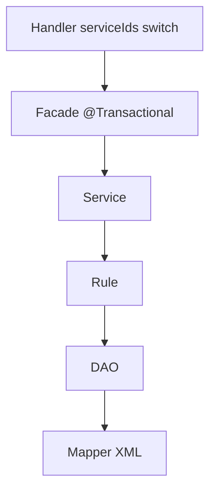

# 제4장. 애플리케이션 6계층

| 항목 | 내용 |
| --- | --- |
| **편** | 제1편 · TCF Framework 이해하기 |
| **에디션** | **Master** — 아키텍트·시니어·플랫폼 |
| **기반 원본** | [ztcfbook/제01편/04-애플리케이션-6계층.md](../ztcfbook/제01편/04-애플리케이션-6계층.md) |
| **입문서** | [ztcfbook-m](../ztcfbook-m/README.md) |
| **장** | 제4장 |
| **파일** | `제01편/04-애플리케이션-6계층.md` |
| **상태** | Master Edition (ztcfbook-h) |
| **목차** | [00-목차](../00-목차.md) |

---

## 아키텍처 뷰



---

## Master 해설

Handler→Facade→Service→Rule→DAO→Mapper 6계층은 HTTP 진입(OnlineTransactionController) 이후 업무 코드의 유일한 허용 구조입니다. Handler는 serviceIds() 선언과 switch 분기만 담당하고 @Transactional을 붙이면 안 되며, 트랜잭션 경계는 Facade에만 둡니다.

Rule 계층은 순수 로직·부수효과·DB 접근 금지가 원칙입니다. Service에서 Rule을 호출해 검증하고, DAO는 MyBatis Mapper만 호출합니다. Mapper XML namespace는 DAO FQCN과 일치해야 Spring-MyBatis 바인딩이 깨지지 않습니다.

Controller를 업무 WAR에 만들지 않는 이유는 STF~ETF 공통 파이프라인 일원화입니다. 예외적으로 파일 업로드 등은 tcf-web 또는 OM Handler 패턴을 따르며, RESTful URL 설계와 Online Endpoint 혼용은 Gateway 라우팅 표를 복잡하게 만듭니다.

리뷰 시 SvCustomerHandler 같은 표준 샘플과 diff를 비교해 계층 역전(Handler에서 Mapper 직접 호출, Service에서 HttpSession 접근)이 없는지 확인하십시오. Facade @Transactional(readOnly=true) 조회·쓰기 혼합 메서드 분리도 데이터 정합성 관점에서 필수입니다.

---

## 구현 샘플 (코드베이스)

### SvCustomerHandler

```java
package com.nh.nsight.marketing.sv.entry.handler;

import com.nh.nsight.marketing.sv.entry.facade.SvCustomerFacade;
import com.nh.nsight.tcf.core.support.context.TransactionContext;
import com.nh.nsight.tcf.core.support.error.BusinessException;
import com.nh.nsight.tcf.core.support.error.ErrorCode;
import com.nh.nsight.tcf.core.support.message.StandardRequest;
import com.nh.nsight.tcf.core.support.transaction.TransactionHandler;
import java.util.Collection;
import java.util.List;
import java.util.Map;
import org.springframework.stereotype.Component;

/**
 * SV 고객 도메인 핸들러. SV.Customer.* 거래를 한 핸들러가 처리한다(Service 도메인당 1개).
 */
@Component
public class SvCustomerHandler implements TransactionHandler {

    private static final String SELECT_SUMMARY = "SV.Customer.selectSummary";

    private final SvCustomerFacade facade;

    public SvCustomerHandler(SvCustomerFacade facade) {
        this.facade = facade;
    }

    @Override
    public Collection<String> serviceIds() {
        return List.of(SELECT_SUMMARY);
    }

    @Override
    public Object doHandle(StandardRequest<Map<String, Object>> request, TransactionContext context) {
        String serviceId = context.getHeader().getServiceId();
        return switch (serviceId) {
            case SELECT_SUMMARY -> facade.selectCustomerSummary(request.getBody(), context);
            default -> throw new BusinessException(ErrorCode.SERVICE_NOT_FOUND,
                    "SvCustomerHandler 미지원 serviceId: " + serviceId);
        };
    }
}

```

원본: [`sv-service/src/main/java/com/nh/nsight/marketing/sv/entry/handler/SvCustomerHandler.java`](../sv-service/src/main/java/com/nh/nsight/marketing/sv/entry/handler/SvCustomerHandler.java)

### SvCustomerFacade

```java
package com.nh.nsight.marketing.sv.entry.facade;

import com.nh.nsight.marketing.sv.application.dto.customer.CustomerSummaryRequest;
import com.nh.nsight.marketing.sv.application.service.SvCustomerService;
import com.nh.nsight.tcf.core.support.context.TransactionContext;
import java.util.Map;
import org.springframework.stereotype.Service;
import org.springframework.transaction.annotation.Transactional;

@Service
public class SvCustomerFacade {

    private final SvCustomerService service;

    public SvCustomerFacade(SvCustomerService service) {
        this.service = service;
    }

    @Transactional(readOnly = true, timeout = 3)
    public Map<String, Object> selectCustomerSummary(Map<String, Object> body, TransactionContext context) {
        CustomerSummaryRequest inquiryRequest = CustomerSummaryRequest.fromMap(body);
        return service.selectCustomerSummary(inquiryRequest, context).toMap();
    }
}

```

원본: [`sv-service/src/main/java/com/nh/nsight/marketing/sv/entry/facade/SvCustomerFacade.java`](../sv-service/src/main/java/com/nh/nsight/marketing/sv/entry/facade/SvCustomerFacade.java)

---

## Master Deep Dive — 애플리케이션 6계층

- HTTP 진입 = OnlineTransactionController 단일 — 업무 Controller 없음
- Facade만 @Transactional, Handler/Service/Rule/DAO는 트랜잭션 경계 밖
- Rule = 순수 로직(부수효과·DB 접근 금지)
- Mapper namespace = DAO FQCN

### 아키텍트 체크리스트

- 상단 **구현 샘플**을 실제 코드와 대조한다.
- **심화 참고**와 ztcfbook 본문 절 번호를 매핑한다.
- 운영·배포 관점은 ztcfbook-h Master 블록을 우선 본다.

---

## 심화 참고 (Master)

- [docs/architecture/01-application-layer.md](../docs/architecture/01-application-layer.md)
- [zarchitecture/03-애플리케이션-6계층-아키텍처.md](../zarchitecture/03-애플리케이션-6계층-아키텍처.md)
- [znsight-man/12-애플리케이션-계층구조.md](../znsight-man/12-애플리케이션-계층구조.md)

---

## 4.1 Handler → Facade → Service → Rule → DAO → Mapper

NSIGHT TCF의 어플리케이션 계층은 TCF 엔진(STF → Dispatcher → ETF) **이후**에 위치하는 업무 코드 영역이다. 표준 6계층은 Handler, Facade, Service, Rule, DAO, Mapper로 구성되며, 업무 WAR(`sv-service` 등), `tcf-om`, `tcf-jwt`, `tcf-gateway` 모두 동일한 패키지 규칙을 따른다.

```text
[프레임워크 영역 — tcf-web / tcf-core]
  HTTP 진입 → STF → Dispatcher → ETF
        │
        ▼
[어플리케이션 계층 — 업무 모듈]
  entry/handler → entry/facade → application/service
       → application/rule → persistence/dao → persistence/mapper
```

**Handler(entry/handler)** 는 `serviceId`와 TCF 파이프라인을 연결하는 유일한 업무 진입점이다. `TransactionHandler` 인터페이스를 구현하고 `@Component`로 등록한다. StandardRequest의 body를 Request DTO로 변환하고 Facade에 위임한다.

**Facade(entry/facade)** 는 유스케이스 단위 오케스트레이션을 담당한다. 여러 Service를 조합하고, `@Transactional` 트랜잭션 경계를 설정한다. "고객 요약 조회"처럼 하나의 화면 거래에 대응하는 흐름을 조립한다.

**Service(application/service)** 는 도메인 로직과 결과 조립을 담당한다. 단일 도메인 객체에 대한 비즈니스 처리, 외부 연계(tcf-eai) 호출, Cache 조회 등이 이 계층에 위치한다.

**Rule(application/rule)** 은 입력·업무 규칙 검증을 담당한다. 필수값·형식·업무 제약 조건을 검사하고, 위반 시 `BusinessException`을 발생시킨다. Service 호출 전에 Rule을 실행하는 패턴이 일반적이다.

**DAO(persistence/dao)** 는 영속 접근 추상화(Repository 역할)를 담당한다. `@Repository`로 등록하며, Mapper를 호출하여 DB 결과를 도메인 객체로 변환한다.

**Mapper(persistence/mapper)** 는 MyBatis SQL 매핑을 담당한다. `@Mapper` 인터페이스와 `resources/mapper/{code}/*.xml`이 쌍을 이룬다.

```text
com.nh.nsight.marketing.sv
├── NsightSvApplication.java
├── entry/
│   ├── handler/     SvCustomerHandler
│   └── facade/      SvCustomerFacade
├── application/
│   ├── service/     SvCustomerService
│   └── rule/        SvCustomerRule
└── persistence/
    ├── dao/         SvCustomerDao
    └── mapper/      SvCustomerMapper

src/main/resources/mapper/sv/SvCustomerMapper.xml
```

6계층의 목표는 거래 단위 진입점 통일, 책임 분리, 프레임워크 비침투이다. 업무 로직은 `StandardRequest`/`TransactionContext` 계약과 6계층 인터페이스만 의존하며, TCF 내부 구현(STF, ETF 클래스)에 직접 의존하지 않는다.

Presentation 계층(`entry/web`)은 대부분의 업무 WAR에서 비어 있다. `OnlineTransactionController`는 `tcf-web`이 제공하므로 업무 모듈에 존재하지 않는다. 파일 업·다운로드, 헬스체크, Swagger(해당 시)만 `entry/web`에 둔다. 이 구조 덕분에 신규 거래 추가 시 패키지 위치가 항상 `entry/handler`로 고정되어 온보딩이 빨라진다.

---

## 4.2 계층별 책임·금지 사항

각 계층은 명확한 책임과 금지 사항을 가진다. 계층을 건너뛰거나 책임을 혼합하면 테스트·유지보수·운영 추적이 어려워진다.

| 계층 | 책임 | 금지 사항 |
| --- | --- | --- |
| Handler | serviceId 등록, DTO 변환, Facade 위임 | SQL 직접 호출, 비즈니스 로직, @Transactional, 응답 전문 조립 |
| Facade | 유스케이스 조합, 트랜잭션 경계 | SQL 직접 작성, HTTP 호출(→ Service 위임) |
| Service | 도메인 로직, 결과 조립, EAI 호출 | Request/Response 전문 직접 조립 |
| Rule | 입력·업무 규칙 검증 | DB 접근, 트랜잭션 관리 |
| DAO | Mapper 호출, 결과 매핑 | 비즈니스 규칙 판단 |
| Mapper | SQL 실행 | Java 비즈니스 로직 |

Handler는 **얇게(thin)** 유지하는 것이 핵심 원칙이다. 100줄이 넘는 Handler는 Facade·Service로 로직을 분리해야 한다. Handler에서 `try-catch`로 예외를 삼키고 성공 응답을 반환하는 패턴은 금지된다. 예외는 ETF가 표준 오류 응답으로 변환한다.

Facade에서 `@Transactional`을 사용할 때 읽기 전용 조회는 `@Transactional(readOnly = true)`를, 등록·변경은 기본 전파 `REQUIRED`를 사용한다. Rule에서 예외를 발생시키면 Facade 트랜잭션이 롤백된다.

DAO는 Mapper 메서드를 1:1로 래핑하는 경우가 많다. 복잡한 조합 쿼리가 필요하면 Service에서 여러 DAO 메서드를 호출하거나, Mapper에 단일 SQL로 작성한다. DAO에서 다른 DAO를 직접 호출하는 것은 지양한다.

계층 위반의 전형적 안티패턴은 Handler에서 Mapper 직접 호출, Service에서 StandardResponse 조립, Rule에서 @Transactional 선언이다. 부록 I 코드 리뷰 체크리스트에서 1차 필터링한다.

`tcf-om`은 24개 이상 Handler를 보유한 참조 구현이다. OM·업무 WAR 모두 동일 6계층이므로 `OmOperationFacade`·`SvCustomerFacade`를 비교 학습하면 패턴 습득이 빠르다.

---

## 4.3 Controller를 만들지 않는 이유

NSIGHT TCF 업무 WAR에서는 업무별 `@RestController`를 만들지 않는다. HTTP 진입점은 `tcf-web`이 제공하는 `OnlineTransactionController` 하나로 통일된다. 이 Controller는 `POST /{businessCode}/online`을 수신하고, JSON을 `StandardRequest`로 변환하여 TCF 엔진에 위임한다.

일반 Spring Boot 프로젝트에서 Controller는 URL 매핑·요청 파싱·응답 조립·예외 처리를 담당한다. NSIGHT TCF에서는 이 역할이 분산된다. URL 매핑과 JSON 파싱은 `OnlineTransactionController`, 예외 처리와 응답 조립은 ETF, 실행 라우팅은 Dispatcher가 담당한다. 업무 개발자가 Controller를 추가하면 이 공통 파이프라인을 우회하게 된다.

```text
[일반 Spring Boot]                    [NSIGHT TCF]
@RestController                       OnlineTransactionController (tcf-web)
  POST /api/customers/summary    →      POST /sv/online
  @RequestBody CustomerReq              header.serviceId = SV.Customer.selectSummary
  return customerService...             → Dispatcher → Handler → Facade
```

예외적으로 `entry/web` 패키지에 Controller가 존재할 수 있다. `tcf-om`의 `OmUpdownloadFileController`는 파일 업·다운로드처럼 표준 전문이 아닌 Multipart HTTP를 처리한다. `tcf-gateway`의 `TcfGateway`는 Gateway 전용 STF/GRF 파이프라인 진입점이다. 업무 WAR의 일반 온라인 거래에는 Controller를 추가하지 않는다.

"Controller 없이 어떻게 HTTP를 받는가?"라는 질문에 대한 답은 AutoConfiguration이다. `tcf-web`이 업무 WAR에 포함되면 `OnlineTransactionController`가 자동 등록된다. 업무 개발자는 Handler만 구현하면 된다.

Spring MVC에 익숙한 개발자는 초기에 "REST가 더 직관적"이라고 느낄 수 있다. 그러나 50개 이상의 거래가 있는 WAR에서 Controller-per-endpoint 방식은 URL·인증·로깅 중복을 만든다. TCF 방식은 **거래 추가 비용을 Handler+Facade+Service 세트로 일정하게** 유지한다. 학습 곡선은 있으나 장기 유지보수 비용이 낮다.

---

## 4.4 Facade 계층 설계

Facade는 6계층에서 가장 설계 판단이 필요한 계층이다. 유스케이스(화면 거래 1건) 단위로 존재하며, Service·Rule을 조합하여 하나의 업무 흐름을 완성한다.

Facade 설계 원칙은 다음과 같다. 첫째, Facade는 화면 거래 또는 ServiceId 1건과 1:1 대응을 원칙으로 한다. 둘째, 복수 Service 호출 순서와 보상 로직은 Facade에서 조율한다. 셋째, 트랜잭션 경계는 Facade 메서드에 `@Transactional`을 선언한다. 넷째, Facade는 Request DTO를 입력으로, Response DTO를 출력으로 사용한다. 다섯째, Facade는 `TransactionContext`에서 사용자·지점 정보를 읽을 수 있다.

```java
@Service
public class SvCustomerFacade {

  private final SvCustomerService customerService;
  private final SvCustomerRule customerRule;

  @Transactional(readOnly = true)
  public SvCustomerSummaryRes selectSummary(
      SvCustomerSummaryReq req, TransactionContext ctx) {
    customerRule.validateSummaryRequest(req);
    return customerService.selectSummary(req, ctx);
  }
}
```

도메인이 복잡한 경우 Facade를 도메인별로 분리한다. `SvCustomerFacade`, `SvProductFacade`, `SvIntegrationFacade`처럼 구성한다. `tcf-om`은 24개 이상의 Handler에 대응하는 다수의 Facade를 가진다.

Facade에서 tcf-eai를 통한 외부 WAR 호출이 필요하면 Service에 위임한다. Facade가 직접 HTTP Client를 사용하지 않는다. 외부 호출 실패 시 보상 트랜잭션이 필요하면 Facade에서 처리 순서를 설계한다.

복합 유스케이스 예: "고객 요약 조회 + 최근 캠페인 참여 이력"은 `SvCustomerFacade`가 `SvCustomerService`와 `SvIntegrationService`(EAI→PC)를 순차 호출한다. Partial failure 시 캠페인 이력 없이 고객 요약만 반환할지, 전체 실패로 처리할지는 설계서에 명시하고 Facade에서 구현한다.

---

## 4.5 트랜잭션·예외·로그 계층 기준

트랜잭션·예외·로그는 계층별로 역할이 분리된다. 혼동하면 데이터 정합성 장애나 로그 누락이 발생한다.

**트랜잭션**은 Facade에 `@Transactional`을 선언한다. Handler·Service·Rule·DAO에는 선언하지 않는다(Service에 선언하는 팀도 있으나 NSIGHT 표준은 Facade 경계). 조회는 `readOnly = true`, 등록·변경·삭제는 쓰기 트랜잭션이다. 트랜잭션 전파는 기본 `REQUIRED`이며, 외부 EAI 호출은 트랜잭션 밖에서 실행하는 것을 권장한다.

**예외**는 Rule·Service에서 `BusinessException`(업무 오류) 또는 `SystemException`(시스템 오류)을 발생시킨다. Handler·Facade에서 catch하여 다른 응답을 만들지 않는다. ETF가 `BusinessException`의 오류코드를 `result.code`에, 메시지를 `result.message`에 매핑한다.

**로그**는 세 종류로 구분된다. **거래로그**는 STF·ETF가 자동 기록한다(업무 코드 불필요). **애플리케이션 로그**는 SLF4J `log.info/debug/warn`으로 작성하며, MDC에 GUID가 자동 포함된다. **감사로그**는 등록·변경·삭제 거래에서 Service 또는 Facade가 `AuditLogService`를 호출하여 기록한다.

```text
[트랜잭션 경계]
STF ─────────────────────────────────────────── ETF
      │ @Transactional (Facade) │
      │  Rule → Service → DAO   │
      └─────────────────────────┘

[예외 흐름]
Rule.validate() → BusinessException → ETF → result.code = E-SV-001

[로그 흐름]
STF → 거래시작로그 → ... 업무처리 ... → ETF → 거래종료로그
```

업무 개발자가 `System.out.println`이나 임의 파일 로그를 사용하면 MDC·거래로그와 연계되지 않아 장애 분석이 어려워진다. 반드시 SLF4J Logger를 사용하고, 민감 정보(주민번호, 계좌번호)는 마스킹한다.

제11장에서 예외·트랜잭션·거래로그·Timeout·Cache·파일 UD 품질 속성을 실무 관점에서 상세히 다룬다. 6계층 구조와 품질 속성은 분리할 수 없으며, Facade 트랜잭션 경계 안에서 Rule·Service·DAO가 동작할 때 예외·로그 정책이 함께 적용된다.

---

## 장 요약 (Master)

NSIGHT TCF 어플리케이션 6계층은 Handler → Facade → Service → Rule → DAO → Mapper로 구성되며, TCF 엔진 이후 업무 코드의 책임을 분리한다. Handler는 얇게 유지하고 Facade에 트랜잭션 경계를 둔다. 업무별 RestController를 만들지 않고 `OnlineTransactionController` 공통 진입점을 사용한다. 예외는 BusinessException으로 전파하고, 거래로그는 STF·ETF가 자동 기록한다.

> Master Edition: **아키텍처 뷰** → **Master 해설** → **구현 샘플** → **Master Deep Dive** → **심화 참고** 순으로 본문과 함께 읽는다.

---

## 이전 · 다음

| | |
| --- | --- |
| ← 이전 | [제3장 TCF 처리 엔진](./03-TCF-처리-엔진.md) |
| → 다음 | [제5장 개발 표준 총정리](../제02편/05-개발-표준-총정리.md) |

---

## 출처 색인 · Master 확장

| 구분 | 경로 |
| --- | --- |
| ztcfbook-h | 본 파일 |
| ztcfbook | `../ztcfbook/제01편/04-애플리케이션-6계층.md` |

### 원본 출처


- [docs/architecture/01-application-layer.md](../../docs/architecture/01-application-layer.md)
- [zarchitecture/03-애플리케이션-6계층-아키텍처.md](../../zarchitecture/03-애플리케이션-6계층-아키텍처.md)
- [znsight-man/12-애플리케이션-계층구조.md](../../znsight-man/12-애플리케이션-계층구조.md)
- [zguide/README.md](../../zguide/README.md)
- [zman/08-업무Handler개발.md](../../zman/08-업무Handler개발.md)
- [docs/architecture/29-facade.md](../../docs/architecture/29-facade.md)
- [znsight-man/24-Facade-개발.md](../../znsight-man/24-Facade-개발.md)
- [docs/architecture/03-transaction.md](../../docs/architecture/03-transaction.md)
- [docs/architecture/05-exception.md](../../docs/architecture/05-exception.md)
- [znsight-man/32-예외처리-기준.md](../../znsight-man/32-예외처리-기준.md)
- [znsight-man/36-트랜잭션-기준.md](../../znsight-man/36-트랜잭션-기준.md)
