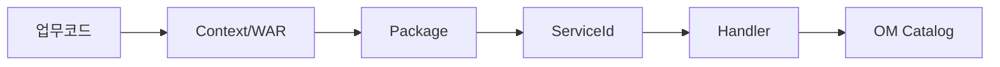

# 제5장. 개발 표준 총정리

| 항목 | 내용 |
| --- | --- |
| **편** | 제2편 · 개발 표준과 명명규칙 |
| **에디션** | **Master** — 아키텍트·시니어·플랫폼 |
| **기반 원본** | [ztcfbook/제02편/05-개발-표준-총정리.md](../ztcfbook/제02편/05-개발-표준-총정리.md) |
| **입문서** | [ztcfbook-m](../ztcfbook-m/README.md) |
| **장** | 제5장 |
| **파일** | `제02편/05-개발-표준-총정리.md` |
| **상태** | Master Edition (ztcfbook-h) |
| **목차** | [00-목차](../00-목차.md) |

---

## 아키텍처 뷰



---

## Master 해설

개발 표준 12축(업무코드→Context/WAR→패키지 com.nh.nsight.marketing.{bc}→ServiceId→Handler→OM Catalog→배포)은 신규 모듈마다 동일 순서로 적용됩니다. 한 축이라도 건너뛰면 "코드는 merge됐는데 운영 불가" 상태가 됩니다.

Gradle 모듈명·WAR명·Context Path·Gateway ProxyController 접두가 businessCode와 정합해야 STF Header 7항 검증과 URL Allow-List가 통과합니다. Git MR·Commit 메시지 규칙은 Catalog 등록·통제 등록 evidence와 짝을 이루도록 설계되어 있습니다.

표준 17업무코드와 배포 9 WAR 차이는 설계 확장성과 구현 범위의 의도적 Gap입니다. CC·BC·CM 등 미배포 코드를 Header에 넣으면 통제 정책·라우트 부재로 실패하므로, 부록 A와 zarchitecture/04를 항상 함께 봐야 합니다.

아키텍트 관점 MR 게이트에서는 settings.gradle 모듈 추가 시 deploy-wars.sh·ROUTING_TABLE·BusinessModuleDefinitions 동시 갱신 여부를 Blocker로 두는 것이 좋습니다. 패키지 루트가 marketing.{bc}에서 벗어나면 Handler 스캔·Mapper 경로가 어긋납니다.

---

## 구현 샘플 (코드베이스)

### BusinessModuleDefinitions

```java
package com.nh.nsight.tcf.ui.support;

import java.util.List;

public final class BusinessModuleDefinitions {
    private BusinessModuleDefinitions() {}

    public static final List<ModuleDefinition> ALL = List.of(
            new ModuleDefinition("CC", "Common", "공통", 8081),
            new ModuleDefinition("IC", "Integration Customer", "고객", 8082),
            new ModuleDefinition("PC", "Private Customer", "고객", 8083),
            new ModuleDefinition("BC", "Business Customer", "고객", 8084),
            new ModuleDefinition("MS", "Mini Single View", "고객", 8085),
            new ModuleDefinition("SV", "Single View", "마케팅", 8086),
            new ModuleDefinition("PD", "Product", "마케팅", 8087),
            new ModuleDefinition("CM", "Campaign", "마케팅", 8088),
            new ModuleDefinition("EB", "EBM", "마케팅", 8089),
            new ModuleDefinition("EP", "Event Processing", "실시간", 8090),
            new ModuleDefinition("BP", "Behavior Processing", "실시간", 8091),
            new ModuleDefinition("BD", "Behavior Data", "데이터", 8092),
            new ModuleDefinition("SS", "Sales Support", "지원", 8093),
            new ModuleDefinition("CS", "Common Service", "지원", 8094),
            new ModuleDefinition("CT", "Contents", "지원", 8095),
            new ModuleDefinition("MG", "Message", "지원", 8096),
            new ModuleDefinition("OM", "Operation Management (tcf-om)", "운영", 8097),
            new ModuleDefinition("UD", "Common UpDownload (tcf-om)", "공통", 8097),
            new ModuleDefinition("JWT", "JWT Auth (tcf-jwt)", "인증", 8110)
    );

    public record ModuleDefinition(String code, String name, String group, int localPort) {}
}

```

원본: [`tcf-ui/src/main/java/com/nh/nsight/tcf/ui/support/BusinessModuleDefinitions.java`](../tcf-ui/src/main/java/com/nh/nsight/tcf/ui/support/BusinessModuleDefinitions.java)

### settings.gradle 모듈

```gradle
pluginManagement {
    repositories {
        gradlePluginPortal()
        mavenCentral()
    }
}

dependencyResolutionManagement {
    repositoriesMode.set(RepositoriesMode.FAIL_ON_PROJECT_REPOS)
    repositories {
        mavenCentral()
    }
}

rootProject.name = 'nsight-tcf-framework-tcfmodules'

include 'tcf-util'
include 'tcf-core'
include 'tcf-web'
include 'tcf-eai'
include 'tcf-cache'
include 'tcf-ui'
include 'tcf-uj'
include 'tcf-batch'
include 'tcf-om'
include 'tcf-jwt'
include 'tcf-gateway'
include 'ic-service'
include 'pc-service'
include 'ms-service'
include 'sv-service'
include 'pd-service'
include 'eb-service'
include 'ep-service'
include 'ss-service'
include 'mg-service'
include 'om-service'

```

원본: [`settings.gradle`](../settings.gradle)

---

## Master Deep Dive — 개발 표준 총정리

- 12축 표준: 업무코드→패키지→ServiceId→Handler→OM→배포
- 패키지 `com.nh.nsight.marketing.{bc}` 고정
- Git MR·Commit 규칙 + Catalog 등록 순서
- 표준 17업무코드 vs 배포 9 WAR 차이 인지

### 아키텍트 체크리스트

- 상단 **구현 샘플**을 실제 코드와 대조한다.
- **심화 참고**와 ztcfbook 본문 절 번호를 매핑한다.
- 운영·배포 관점은 ztcfbook-h Master 블록을 우선 본다.

---

## 심화 참고 (Master)

- [znsight-man/04-개발표준-전체요약.md](../znsight-man/04-개발표준-전체요약.md)
- [znsight-man/14-명명-규칙.md](../znsight-man/14-명명-규칙.md)
- [znsight-man/09-업무-WAR-구조.md](../znsight-man/09-업무-WAR-구조.md)
- [znsight-man/07-Git-브랜치-기준.md](../znsight-man/07-Git-브랜치-기준.md)

---

## 5.1 개발 표준 전체 요약

NSIGHT TCF 개발 표준은 "코드 작성 스타일"만이 아니라 **운영 가능한 거래를 만드는 규칙** 전체를 의미한다. 업무코드, URL Context, WAR, Package, ServiceId, 거래코드, Handler, Mapper, SQL ID, 오류코드, 로그, 테스트, 배포 단위가 하나의 기준으로 연결되어야 한다.

개발 표준은 12개 축으로 정리된다. 업무코드 표준, URL Context 표준, WAR 표준, Package 표준, ServiceId 표준, 거래코드 표준, 계층구조 표준, DTO 표준, MyBatis 표준, 예외·오류코드 표준, 로그·감사 표준, 테스트·배포 표준이다. 이 중 하나라도 어기면 OM Catalog·거래로그·Gateway 라우팅·권한 검증과의 정합성이 깨진다.

개발 산출물의 연결 구조는 다음 순서를 따른다.

```text
업무코드 → URL Context → WAR → Package
  → ServiceId → TransactionHandler
  → Facade → Service → Rule → DAO/Mapper
  → MyBatis XML / SQL ID
  → 거래로그 / 감사로그 → 오류코드 / OM
```

SV 고객 요약 조회 거래를 예로 들면, 업무코드 SV → Context `/sv` → WAR `sv.war` → Package `com.nh.nsight.marketing.sv` → Endpoint `POST /sv/online` → ServiceId `SV.Customer.selectSummary` → 거래코드 `SV-INQ-0001` → Handler `SvCustomerSummaryHandler` → Facade `SvCustomerFacade` → Service `SvCustomerService` → Rule `SvCustomerRule` → DAO `SvCustomerDao` → Mapper `SvCustomerMapper` → SQL ID `SV.Customer.selectSummary`로 일관되게 연결된다.

NSIGHT Java 코딩 스타일 가이드는 Java/Spring Boot 기반 정보계 애플리케이션의 개발 표준, 코딩 스타일, 품질 기준, MyBatis SQL Mapper 기준을 통합 정의한다. 적용 대상은 NSIGHT 마케팅플랫폼, SingleView, 공통모듈, 배치·연계 Java 모듈, MyBatis SQL Mapper이다. MyBatis 표준은 SQL 표준화, RDW/ADW 접근 경계, Query Timeout, Mapper 표준, 관측성 통제를 포함한다.

12개 축은 서로 독립이 아니다. 예를 들어 ServiceId를 `SV.Customer.selectSummary`로 정하면 거래코드 `SV-INQ-*`, Handler `SvCustomer*Handler`, Mapper `SvCustomerMapper`, SQL ID, 오류코드 `E-SV-*`가 연쇄적으로 결정된다. 설계 단계(제8장)에서 이 연결을 먼저 확정하고 구현에 들어가야 리워크를 줄일 수 있다.

---

## 5.2 명명규칙 최상위 10원칙

NSIGHT 명명규칙은 21개 주제로 세분화되어 있으나, 최상위 10원칙을 먼저 숙지해야 한다.

첫째, **업무코드 우선**이다. 모든 식별자는 2자리 업무코드(BC)로 시작한다. SV, IC, OM, MG 등이다. 둘째, **의미 중심**이다. 이름만 보고 업무·도메인·행위를 알 수 있어야 한다. 셋째, **일관된 표기**이다. 업무코드는 대문자, 도메인은 PascalCase, 행위는 lowerCamelCase, DB는 snake_case이다.

넷째, **URL 기능명 금지**이다. 기능명은 ServiceId에 표현하고 URL은 Context 진입점만 담당한다. 다섯째, **ServiceId = 실행 기준**이다. URL이 아니라 `header.serviceId`가 Handler를 결정한다. 여섯째, **거래코드 = 추적 기준**이다. 거래로그·감사·재처리는 `transactionCode`로 식별한다.

일곱째, **Handler·Class·Mapper 1:1 매핑**이다. ServiceId, Handler 클래스, SQL ID는 서로 추적 가능해야 한다. 여덟째, **OM 등록 필수**이다. ServiceId·거래코드·오류코드는 OM Catalog에 등록되어야 실행·운영된다. 아홉째, **변경 최소화**이다. 운영 반영 후 ServiceId·거래코드 변경은 원칙적으로 금지한다. 열째, **추적 가능성**이다. GUID, TraceId, ServiceId, 거래코드, SQL ID가 로그에 남아야 한다.

| No | 원칙 | 위반 시 결과 |
| --- | --- | --- |
| 1 | 업무코드 우선 | Gateway 라우팅 실패 |
| 2 | 의미 중심 | 유지보수·인수인계 어려움 |
| 5 | ServiceId = 실행 기준 | Dispatcher 매핑 실패 |
| 8 | OM 등록 필수 | 운영 환경 거래 차단 |
| 9 | 변경 최소화 | 로그·감사 단절 |

명명규칙 21개 주제 전체는 부록 M 색인과 `znsight-man/명명규칙-00-목차.md`에서 확인한다. 제6~7장에서는 식별자·코드·DB 명명을 실무 예시와 함께 다룬다.

표준 준수는 SonarQube·코드 리뷰로 일부 자동 검증한다. `tcf-core` 내부 패키지 직접 import, 업무 WAR 간 Gradle 의존은 CI에서 차단 대상이다.

---

## 5.3 업무코드 · Context · WAR · Package

업무코드(BC)는 NSIGHT 전체에서 업무 영역을 식별하는 2자리 대문자 코드이다. 9개 업무 WAR와 OM, JWT가 각각 고유 BC를 가진다.

| BC | 업무명 | WAR | Context |
| --- | --- | --- | --- |
| IC | 통합고객 | ic.war | /ic |
| PC | 캠페인 | pc.war | /pc |
| MS | 마케팅전략 | ms.war | /ms |
| SV | Single View | sv.war | /sv |
| PD | 상품 | pd.war | /pd |
| EB | 이벤트브로커 | eb.war | /eb |
| EP | 이벤트프로세서 | ep.war | /ep |
| SS | 세그먼트 | ss.war | /ss |
| MG | 메시지 | mg.war | /mg |
| OM | 운영관리 | om.war | /om |
| JWT | 인증 | jwt.war | /jwt |

URL Context Path는 업무코드와 소문자로 일치한다. `sv-service`의 `server.servlet.context-path`는 `/sv`이다. Online Endpoint는 `POST /sv/online`이 된다. Gateway 라우팅 규칙도 `businessCode` → Context 매핑을 사용한다.

Package 루트는 `com.nh.nsight.marketing.{code}`이다. sv-service는 `com.nh.nsight.marketing.sv`, tcf-om은 `com.nh.nsight.marketing.om`이다. tcf-jwt는 `com.nh.nsight.auth.jwt`, tcf-gateway는 `com.nh.nsight.gateway` 예외 패턴을 사용한다.

```text
BC=SV 일관성 체크리스트
─────────────────────────
✓ Context Path:     /sv
✓ WAR 파일명:       sv.war
✓ Package:          com.nh.nsight.marketing.sv
✓ ServiceId Prefix: SV.
✓ 거래코드 Prefix:  SV-
✓ Mapper XML 경로:  mapper/sv/
✓ businessCode:     SV (Header)
```

신규 업무코드 발급은 아키텍트·OM 합의 후 부록 A 업무코드 표준표에 등록한다. 임의 2자리 코드를 사용하면 Gateway 라우팅 테이블과 충돌한다.

---

## 5.4 Gradle 모듈·패키지 표준

Gradle 멀티 모듈에서 업무 WAR는 `{code}-service` 명명을 따른다. `sv-service`, `ic-service` 등이다. 플랫폼 모듈은 `tcf-{name}`이다. `tcf-core`, `tcf-om`, `tcf-gateway` 등이다.

업무 WAR 표준 `build.gradle` 구성은 다음을 포함한다. `war` 플러그인, `tcf-web` 의존, Java 21 toolchain, `bootWar` 산출물 이름 `{code}.war`, `application.yml`의 context-path·port 설정이다.

패키지 구조 표준은 6계층에 대응한다.

```text
com.nh.nsight.marketing.{code}
├── Nsight{Code}Application.java
├── application/service/
├── application/rule/
├── application/scheduler/     (해당 시)
├── client/                    (tcf-eai 등, 해당 시)
├── config/
├── entry/handler/
├── entry/facade/
├── entry/web/                 (파일 UD 등 예외)
├── persistence/dao/
├── persistence/mapper/
└── support/

src/main/resources/
├── application.yml
├── application-local.yml
└── mapper/{code}/
```

신규 클래스는 반드시 올바른 패키지에 위치한다. Handler를 `application.service`에 두거나, Service를 `entry.handler`에 두면 코드 리뷰에서 반려된다. MyBatis XML은 `resources/mapper/{code}/`에 위치하며, Namespace는 Mapper 인터페이스 FQCN과 일치한다.

`support` 패키지는 상수·헬퍼·마이그레이션 유틸만 둔다. 비즈니스 로직을 `support`에 넣는 것은 금지된다. `config` 패키지는 모듈 전용 `@Configuration`만 포함하며, TCF AutoConfiguration을 덮어쓰지 않도록 주의한다.

---

## 5.5 Git 브랜치·Commit·MR 기준

NSIGHT TCF 프로젝트의 Git 브랜치 전략은 GitFlow 변형을 따른다. `main`은 운영 배포 기준, `develop`은 통합 개발 기준, `feature/{ticket}-{description}`은 기능 개발, `release/{version}`은 릴리즈 준비, `hotfix/{ticket}`은 긴급 수정이다.

업무 개발자는 `develop`에서 feature 브랜치를 생성하여 작업한다. 기능 완료 후 Merge Request(MR)를 생성하고, 코드 리뷰·CI 통과 후 `develop`에 병합한다. 릴리즈 시점에 `release` 브랜치에서 QA 후 `main`과 `develop`에 병합한다.

Commit 메시지는 Conventional Commits 스타일을 권장한다.

```text
feat(sv): SV.Customer.selectSummary Handler 구현
fix(om): ServiceCatalog 저장 시 Timeout 미반영 수정
docs(ztcfbook): 제5장 개발 표준 집필
refactor(tcf-core): Dispatcher Registry 로깅 개선
test(sv): SvCustomerFacade 단위 테스트 추가
```

MR 본문에는 변경 요약, ServiceId·거래코드 목록, OM 등록 필요 여부, 테스트 결과를 포함한다. Handler·ServiceId 변경 MR은 반드시 OM Catalog 등록 티켓 번호를 연결한다. CI 파이프라인은 빌드·단위 테스트·정적 분석을 자동 실행하며, 실패 시 병합이 차단된다.

release 브랜치에서는 기능 추가보다 버그 수정·설정 변경만 허용한다. hotfix는 `main`에서 분기하여 운영 긴급 패치 후 `main`·`develop` 양쪽에 병합한다. WAR 버전과 Git 태그를 1:1로 맞추어 배포 추적성을 확보한다.

---

## 장 요약 (Master)

NSIGHT 개발 표준은 업무코드부터 OM 등록까지 12개 축이 연결된 운영 가능한 거래 작성 규칙이다. 명명규칙 최상위 10원칙 중 ServiceId 실행 기준·OM 등록 필수·추적 가능성을 반드시 지켜야 한다. BC·Context·WAR·Package·ServiceId Prefix는 일관되게 맞추고, Gradle 모듈·패키지 구조 표준을 따른다. Git feature 브랜치·MR·CI 품질 게이트로 변경을 통제한다.

> Master Edition: **아키텍처 뷰** → **Master 해설** → **구현 샘플** → **Master Deep Dive** → **심화 참고** 순으로 본문과 함께 읽는다.

---

## 이전 · 다음

| | |
| --- | --- |
| ← 이전 | [제4장 애플리케이션 6계층](../제01편/04-애플리케이션-6계층.md) |
| → 다음 | [제6장 식별자 명명규칙](./06-식별자-명명규칙.md) |

---

## 출처 색인 · Master 확장

| 구분 | 경로 |
| --- | --- |
| ztcfbook-h | 본 파일 |
| ztcfbook | `../ztcfbook/제02편/05-개발-표준-총정리.md` |

### 원본 출처


- [znsight-man/04-개발표준-전체요약.md](../../znsight-man/04-개발표준-전체요약.md)
- [znsight-man/14-명명-규칙.md](../../znsight-man/14-명명-규칙.md)
- [znsight-man/명명규칙-02-최상위-원칙.md](../../znsight-man/명명규칙-02-최상위-원칙.md)
- [znsight-man/15-업무코드-Context-WAR.md](../../znsight-man/15-업무코드-Context-WAR.md)
- [znsight-man/명명규칙-03-업무코드-Context-WAR-Package.md](../../znsight-man/명명규칙-03-업무코드-Context-WAR-Package.md)
- [znsight-man/명명규칙-04-업무코드-표준표.md](../../znsight-man/명명규칙-04-업무코드-표준표.md)
- [znsight-man/09-업무-WAR-구조.md](../../znsight-man/09-업무-WAR-구조.md)
- [znsight-man/13-패키지-구조-표준.md](../../znsight-man/13-패키지-구조-표준.md)
- [znsight-man/명명규칙-05-모듈-설계기준.md](../../znsight-man/명명규칙-05-모듈-설계기준.md)
- [znsight-man/명명규칙-06-Package.md](../../znsight-man/명명규칙-06-Package.md)
- [znsight-man/07-Git-브랜치-기준.md](../../znsight-man/07-Git-브랜치-기준.md)
