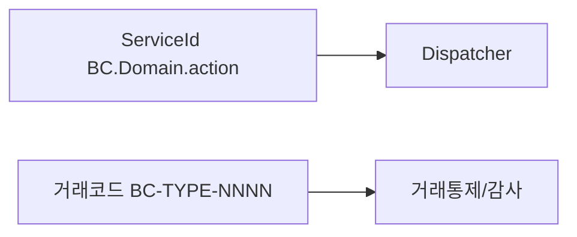

# 제6장. 식별자 명명규칙

| 항목 | 내용 |
| --- | --- |
| **편** | 제2편 · 개발 표준과 명명규칙 |
| **에디션** | **Master** — 아키텍트·시니어·플랫폼 |
| **기반 원본** | [ztcfbook/제02편/06-식별자-명명규칙.md](../ztcfbook/제02편/06-식별자-명명규칙.md) |
| **입문서** | [ztcfbook-m](../ztcfbook-m/README.md) |
| **장** | 제6장 |
| **파일** | `제02편/06-식별자-명명규칙.md` |
| **상태** | Master Edition (ztcfbook-h) |
| **목차** | [00-목차](../00-목차.md) |

---

## 아키텍처 뷰



---

## Master 해설

ServiceId `{BC}.{Domain}.{action}`은 TransactionDispatcher registry 키이며, action 표준(selectSummary, save, update, delete 등)을 따르지 않으면 OM Catalog 검색·운영자 교육 비용이 커집니다. 거래코드 `{BC}-{TYPE}-{NNNN}`은 Header transactionCode·감사·거래통제·Catalog 상태와 연결됩니다.

OM prefix `OM.*`(예: OM.Auth.login)와 업무 `SV.*`·`IC.*`는 Handler 패키지와 WAR 배치가 다릅니다. Gateway route `/{bc}/online`의 bc와 Header businessCode 불일치는 STF TransactionControlService에서 E-TCF-CTL-* 또는 E-TCF-HDR-*로 즉시 거절됩니다.

화면번호·menuId·functionCode·channelId는 AuthorizationValidator와 OM functionAuth seed와 삼각 정합을 이룹니다. Gateway·Batch·Cache 명명(명명규칙 18~20)은 플랫폼 모듈 간 설정 충돌을 막기 위한 별도 축입니다.

코드 리뷰에서 Handler serviceIds() 배열·switch case·OM Catalog service_id 컬럼 세 곳의 문자열 완전 일치를 diff 도구로 확인하십시오. 대소문자·도메인명 오타는 기동 시점 duplicate가 아니면 런타임 SERVICE_NOT_FOUND로만 나타납니다.

---

## 구현 샘플 (코드베이스)

### SvCustomerHandler serviceIds

```java
package com.nh.nsight.marketing.sv.entry.handler;

import com.nh.nsight.marketing.sv.entry.facade.SvCustomerFacade;
import com.nh.nsight.tcf.core.support.context.TransactionContext;
import com.nh.nsight.tcf.core.support.error.BusinessException;
import com.nh.nsight.tcf.core.support.error.ErrorCode;
import com.nh.nsight.tcf.core.support.message.StandardRequest;
import com.nh.nsight.tcf.core.support.transaction.TransactionHandler;
import java.util.Collection;
import java.util.List;
import java.util.Map;
import org.springframework.stereotype.Component;

/**
 * SV 고객 도메인 핸들러. SV.Customer.* 거래를 한 핸들러가 처리한다(Service 도메인당 1개).
 */
@Component
public class SvCustomerHandler implements TransactionHandler {

    private static final String SELECT_SUMMARY = "SV.Customer.selectSummary";

    private final SvCustomerFacade facade;

    public SvCustomerHandler(SvCustomerFacade facade) {
        this.facade = facade;
    }

    @Override
    public Collection<String> serviceIds() {
        return List.of(SELECT_SUMMARY);
    }

    @Override
    public Object doHandle(StandardRequest<Map<String, Object>> request, TransactionContext context) {
        String serviceId = context.getHeader().getServiceId();
```

원본: [`sv-service/src/main/java/com/nh/nsight/marketing/sv/entry/handler/SvCustomerHandler.java`](../sv-service/src/main/java/com/nh/nsight/marketing/sv/entry/handler/SvCustomerHandler.java)

### OmServiceCatalogHandler

```java
package com.nh.nsight.marketing.om.entry.handler;

import com.nh.nsight.marketing.om.entry.facade.OmServiceCatalogFacade;
import com.nh.nsight.tcf.core.support.context.TransactionContext;
import com.nh.nsight.tcf.core.support.error.BusinessException;
import com.nh.nsight.tcf.core.support.error.ErrorCode;
import com.nh.nsight.tcf.core.support.message.StandardRequest;
import com.nh.nsight.tcf.core.support.transaction.TransactionHandler;
import java.util.Collection;
import java.util.List;
import java.util.Map;
import org.springframework.stereotype.Component;

/**
 * OM 서비스카탈로그 도메인 핸들러. OM.ServiceCatalog.* 거래를 한 핸들러가 처리한다(Service 도메인당 1개).
 */
@Component
public class OmServiceCatalogHandler implements TransactionHandler {

    private static final String INQUIRY = "OM.ServiceCatalog.inquiry";
    private static final String DETAIL = "OM.ServiceCatalog.detail";
    private static final String SAVE = "OM.ServiceCatalog.save";
    private static final String UPDATE = "OM.ServiceCatalog.update";
    private static final String DELETE = "OM.ServiceCatalog.delete";

    private final OmServiceCatalogFacade facade;

    public OmServiceCatalogHandler(OmServiceCatalogFacade facade) {
        this.facade = facade;
    }

    @Override
    public Collection<String> serviceIds() {
        return List.of(INQUIRY, DETAIL, SAVE, UPDATE, DELETE);
    }
```

원본: [`tcf-om/src/main/java/com/nh/nsight/marketing/om/entry/handler/OmServiceCatalogHandler.java`](../tcf-om/src/main/java/com/nh/nsight/marketing/om/entry/handler/OmServiceCatalogHandler.java)

---

## Master Deep Dive — 식별자 명명규칙

- ServiceId = Dispatcher 키, 거래코드 = 감사·통제·Catalog
- action 표준: selectSummary, save, update, delete 등
- OM prefix `OM.*` vs 업무 `SV.*`/`IC.*`
- Gateway route `/{bc}/online`과 businessCode 정합

### 아키텍트 체크리스트

- 상단 **구현 샘플**을 실제 코드와 대조한다.
- **심화 참고**와 ztcfbook 본문 절 번호를 매핑한다.
- 운영·배포 관점은 ztcfbook-h Master 블록을 우선 본다.

---

## 심화 참고 (Master)

- [znsight-man/명명규칙-07-ServiceId.md](../znsight-man/명명규칙-07-ServiceId.md)
- [znsight-man/부록B-ServiceId-명명규칙.md](../znsight-man/부록B-ServiceId-명명규칙.md)
- [znsight-man/명명규칙-08-거래코드.md](../znsight-man/명명규칙-08-거래코드.md)
- [zman/07-ServiceIdDispatcher.md](../zman/07-ServiceIdDispatcher.md)

---

## 6.1 ServiceId (`{BC}.{Domain}.{action}`)

ServiceId는 NSIGHT TCF에서 온라인 거래를 실행·통제·추적하는 **핵심 식별자**이다. 단순한 프로그램 이름이 아니라, Dispatcher가 Handler를 선택하고, OM Catalog·권한·Timeout·거래로그·오류코드가 연결되는 중심 키이다.

표준 형식은 `{업무코드}.{업무대상}.{처리행위}`이다.

| 구성요소 | 표기 | 예시 |
| --- | --- | --- |
| 업무코드 | 대문자 2자리 | SV, CM, OM, MG |
| 업무대상 | PascalCase | Customer, Campaign, User |
| 처리행위 | lowerCamelCase | selectSummary, selectList, save |

```text
SV.Customer.selectSummary
│  │        └─ 처리행위: 고객 요약 조회
│  └─ 업무대상: Customer 도메인
└─ 업무코드: Single View
```

ServiceId 예시는 다음과 같다.

| 업무 | ServiceId | 의미 |
| --- | --- | --- |
| SV | SV.Customer.selectSummary | 고객 요약 조회 |
| SV | SV.Product.selectHoldingList | 보유상품 목록 |
| CM | CM.Campaign.save | 캠페인 저장 |
| MG | MG.Message.send | 메시지 발송 |
| OM | OM.ServiceCatalog.save | ServiceId 등록 |
| OM | OM.Auth.login | OM 로그인 |

ServiceId 최상위 원칙은 열 가지이다. 업무코드로 시작, Context와 일치(`/sv/online` → `SV.` prefix), businessCode와 일치, 의미 중심, URL 기능명 금지, Handler 매핑 가능, OM 등록 필수, 미등록 차단, 로그 추적 가능, 변경 최소화이다.

ServiceId와 URL의 역할 구분: URL Context(`/sv`)는 WAR 진입, `/sv/online`은 온라인 공통 Endpoint, `businessCode`(SV)는 검증, `serviceId`는 Handler 실행, `transactionCode`는 거래 추적이다.

ServiceId 변경은 하위 호환을 깨뜨린다. 화면·WebTop·외부 연계·OM Catalog·거래로그 통계가 모두 이전 ID를 참조하기 때문이다. 신규 거래는 처음부터 올바른 ID를 발급하고, 기존 ID 변경은 ADR과 운영 승인 없이는 진행하지 않는다.

---

## 6.2 거래코드 (`{BC}-{TYPE}-{NNNN}`)

거래코드(transactionCode)는 거래로그·감사로그·재처리·통계에서 거래를 식별하는 코드이다. ServiceId가 "어떤 프로그램을 실행할지"를 나타낸다면, 거래코드는 "이 거래를 로그에서 어떤 이름으로 추적할지"를 나타낸다.

표준 형식은 `{업무코드}-{유형}-{일련번호}`이다.

| 구성요소 | 표기 | 설명 |
| --- | --- | --- |
| 업무코드 | 대문자 2자리 | SV, IC, OM |
| 유형 | 대문자 3자리 | INQ(조회), REG(등록), UPD(변경), DEL(삭제), BAT(배치) |
| 일련번호 | 4자리 숫자 | 0001부터 순차 부여 |

```text
SV-INQ-0001   SV 업무 조회 거래 #1 (고객요약조회)
SV-REG-0003   SV 업무 등록 거래 #3
OM-UPD-0012   OM 업무 변경 거래 #12
MG-BAT-0001   MG 배치 거래 #1
```

거래코드와 ServiceId는 1:1 또는 N:1 관계가 가능하나, 운영 추적을 위해 **1 ServiceId = 1 거래코드**를 권장한다. 동일 ServiceId에 여러 거래코드가 매핑되면 감사 분석이 혼란스러워진다.

거래코드 발급은 OM 또는 설계 단계에서 중앙 관리한다. 임의로 `SV-INQ-9999`를 사용하면 기존 거래와 충돌할 수 있다. 신규 거래는 담당 업무의 다음 가용 일련번호를 할당받는다.

배치·스케줄 거래는 `BAT` 유형을 사용한다. 온라인 화면에서 호출하는 거래와 배치 전용 거래의 거래코드를 혼용하지 않는다. 통계·모니터링 대시보드에서 유형별 필터가 가능하도록 유형 코드를 정확히 부여한다.

---

## 6.3 Header 항목 (JSON·Java·DB·MDC)

표준 전문 Header 항목은 JSON 키, Java 필드, DB 컬럼, MDC 키에서 **동일 의미·일관 표기**를 유지해야 한다. Header 7항은 거래통제 Allow-List의 핵심이다.

| JSON 키 | Java (StandardHeader) | MDC 키 | 설명 |
| --- | --- | --- | --- |
| businessCode | businessCode | businessCode | 업무 WAR 식별 |
| serviceId | serviceId | serviceId | Handler 실행 기준 |
| transactionCode | transactionCode | transactionCode | 거래 추적 코드 |
| channelId | channelId | channelId | 호출 채널 |
| userId | userId | userId | 요청 사용자 |
| guid | guid | guid | 거래 고유 ID |
| traceId | traceId | traceId | End-to-End 추적 |

추가 Header 항목으로 `serviceName`, `branchId`, `clientIp`, `requestDateTime`, `transactionId`가 있다. `serviceName`은 사람이 읽는 거래명, `branchId`는 지점·조직 식별에 사용된다.

Java `StandardHeader` 클래스는 `tcf-core`의 `message` 패키지에 정의되어 있다. JSON 역직렬화 시 camelCase를 사용한다. DB 거래로그 테이블(TCF_TX_LOG 등)의 컬럼은 snake_case(`service_id`, `transaction_code`)이며, MyBatis Mapper에서 camelCase 필드와 매핑한다.

Header 작성 시 흔한 오류는 `businessCode`와 `serviceId` prefix 불일치(`businessCode=SV`인데 `serviceId=IC.Customer.inquiry`), `transactionCode` 형식 위반, 필수 항목 누락이다. STF의 `StandardHeaderValidator`가 이를 차단하고 `E-COM-HEADER_INVALID` 오류를 반환한다.

---

## 6.4 화면번호 · menuId · functionCode

UI 화면과 ServiceId·거래코드는 삼각 정합 관계를 유지해야 한다. 화면에서 버튼 클릭 → Header에 올바른 serviceId·transactionCode 설정 → 해당 Handler 실행이 연결된다.

**화면번호**는 `{BC}{일련번호4자리}` 형식이다. `SV0101`(SV 고객요약 화면), `OM0302`(OM ServiceCatalog 화면) 등이다. 화면번호는 UI 소스·설계서·OM 메뉴 등록에서 동일하게 사용한다.

**menuId**는 OM 메뉴 관리 테이블의 PK이다. `{BC}_MENU_{일련번호}` 패턴을 사용한다. `SV_MENU_0101`, `OM_MENU_0302` 등이다. menuId는 권한 검증 시 "이 사용자가 이 메뉴에 접근 가능한가?"를 판단하는 기준이다.

**functionCode**는 화면 내 기능(버튼·탭) 단위 식별자이다. `{화면번호}_{기능}` 형식이다. `SV0101_INQ`(조회), `SV0101_EXCEL`(엑셀다운로드) 등이다. functionCode는 기능권한 검증에 사용된다.

```text
화면 SV0101 (고객요약)
  ├─ menuId:       SV_MENU_0101
  ├─ functionCode: SV0101_INQ → ServiceId: SV.Customer.selectSummary
  │                              거래코드:   SV-INQ-0001
  └─ functionCode: SV0101_EXCEL → ServiceId: SV.Customer.exportSummary
                                   거래코드:   SV-INQ-0002
```

화면 설계 단계에서 functionCode별 ServiceId·거래코드를 설계서에 명시하고, 개발·테스트·OM 등록 시 동일하게 유지한다.

---

## 6.5 Gateway 라우팅·Batch·Cache 명명

플랫폼 영역 식별자도 업무코드 기반 일관성을 유지한다.

**Gateway 라우팅** 규칙은 `businessCode` → downstream URL 매핑이다. `application.yml`의 `gateway.routes`에 정의한다.

```yaml
gateway:
  routes:
  - businessCode: SV
    downstream: http://localhost:8086/sv
  - businessCode: OM
    downstream: http://localhost:8097/om
```

Route ID는 `route-{bc}` 소문자이다. `route-sv`, `route-om` 등이다. Gateway STF/GRF/GSF/GEF 파이프라인 내부 ServiceId는 `GW.Route.forward` 패턴을 사용한다.

**Batch·Scheduler** 명명은 `{BC}.Batch.{jobName}` 또는 `{BC}.Scheduler.{taskName}`이다. `OM.Scheduler.sessionCleanup`, `EB.Scheduler.eventPublish` 등이다. Batch Job ID는 `BATCH_{BC}_{NNNN}`이다.

**Cache** 명명은 `{BC}:{domain}:{key}` 콜론 구분이다. `SV:Customer:summary:{customerNo}`, `OM:Code:common:{groupCode}` 등이다. Cache 이름(EhCache alias)은 `{bc}-{domain}-cache` kebab-case이다. `sv-customer-cache`, `om-code-cache` 등이다.

| 영역 | 패턴 | 예시 |
| --- | --- | --- |
| Gateway Route | route-{bc} | route-sv |
| Batch Job | BATCH_{BC}_{NNNN} | BATCH_OM_0001 |
| Scheduler ServiceId | {BC}.Scheduler.{name} | OM.Scheduler.sessionCleanup |
| Cache Key | {BC}:{domain}:{key} | SV:Customer:summary:C001 |
| Cache Name | {bc}-{domain}-cache | sv-customer-cache |

Gateway·Batch·Cache 명명은 제16~17장·zguide 모듈 가이드와 연계된다. 업무 개발자가 Gateway route를 임의 추가할 때는 플랫폼 팀 리뷰가 필요하다.

---

## 장 요약 (Master)

ServiceId `{BC}.{Domain}.{action}`는 Handler 실행·OM Catalog·로그 추적의 중심 키이며, 거래코드 `{BC}-{TYPE}-{NNNN}`는 거래로그·감사 식별에 사용된다. Header 항목은 JSON·Java·DB·MDC에서 일관된 표기를 유지하고, 화면번호·menuId·functionCode는 ServiceId·거래코드와 정합성을 맞춘다. Gateway·Batch·Cache 명명도 업무코드 기반 패턴을 따른다.

> Master Edition: **아키텍처 뷰** → **Master 해설** → **구현 샘플** → **Master Deep Dive** → **심화 참고** 순으로 본문과 함께 읽는다.

---

## 이전 · 다음

| | |
| --- | --- |
| ← 이전 | [제5장 개발 표준 총정리](./05-개발-표준-총정리.md) |
| → 다음 | [제7장 코드·DB 명명규칙](./07-코드-DB-명명규칙.md) |

---

## 출처 색인 · Master 확장

| 구분 | 경로 |
| --- | --- |
| ztcfbook-h | 본 파일 |
| ztcfbook | `../ztcfbook/제02편/06-식별자-명명규칙.md` |

### 원본 출처


- [znsight-man/명명규칙-07-ServiceId.md](../../znsight-man/명명규칙-07-ServiceId.md)
- [znsight-man/부록B-ServiceId-명명규칙.md](../../znsight-man/부록B-ServiceId-명명규칙.md)
- [znsight-man/명명규칙-08-거래코드.md](../../znsight-man/명명규칙-08-거래코드.md)
- [znsight-man/부록C-거래코드-명명규칙.md](../../znsight-man/부록C-거래코드-명명규칙.md)
- [znsight-man/명명규칙-21-Header-항목.md](../../znsight-man/명명규칙-21-Header-항목.md)
- [znsight-man/21-Header-작성-기준.md](../../znsight-man/21-Header-작성-기준.md)
- [znsight-man/명명규칙-15-화면번호.md](../../znsight-man/명명규칙-15-화면번호.md)
- [znsight-man/명명규칙-17-화면-ServiceId-연결.md](../../znsight-man/명명규칙-17-화면-ServiceId-연결.md)
- [znsight-man/명명규칙-18-Gateway-라우팅.md](../../znsight-man/명명규칙-18-Gateway-라우팅.md)
- [znsight-man/명명규칙-19-Batch-Scheduler.md](../../znsight-man/명명규칙-19-Batch-Scheduler.md)
- [znsight-man/명명규칙-20-Cache.md](../../znsight-man/명명규칙-20-Cache.md)
