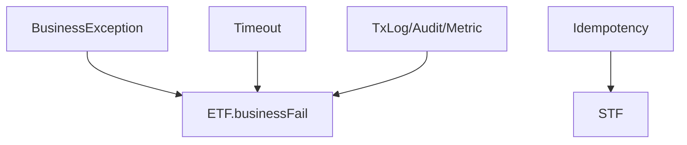

# 제11장. 품질 속성 구현

| 항목 | 내용 |
| --- | --- |
| **편** | 제3편 · 거래 개발 실무 |
| **에디션** | **Master** — 아키텍트·시니어·플랫폼 |
| **기반 원본** | [ztcfbook/제03편/11-품질-속성-구현.md](../ztcfbook/제03편/11-품질-속성-구현.md) |
| **입문서** | [ztcfbook-m](../ztcfbook-m/README.md) |
| **장** | 제11장 |
| **파일** | `제03편/11-품질-속성-구현.md` |
| **상태** | Master Edition (ztcfbook-h) |
| **목차** | [00-목차](../00-목차.md) |

---

## 아키텍처 뷰



---

## Master 해설

BusinessException, Timeout, 기타 Exception은 ETF businessFail·businessFail(timeout)·systemError로 수렴합니다. 예외 타입별 TxLog.end 코드(S0000, E0001, E9999 등)와 audit·metric emission이 ETF에서 공통 처리되므로 Handler catch 블록에서 임의 JSON을 만들면 관측성이 깨집니다.

거래로그는 STF TxLog.start와 ETF end가 쌍을 이루며, TCF_TX_LOG는 OM H2(로컬) 또는 운영 LOGDB에 INSERT됩니다. 감사로그는 민감 거래(CREATE/UPDATE/DELETE processingType)에 선택 적용됩니다. Cache는 tcf-cache SPI와 OM cache evict Handler로 무효화 전략을 맞춥니다.

파일 업·다운로드는 OM Handler 및 znsight-man 44장 기준을 따르며, Online Endpoint body와 별도 스트림 API 혼용 시 Gateway timeout과 맞지 않을 수 있습니다. 트랜잭션 경계는 Facade 단일 메서드 단위가 원칙입니다.

운영 이슈 다발: Timeout OM 값과 실제 SQL slow query 불일치, Idempotency processing stuck, Cache stale after Catalog 변경. 코드 리뷰에서 BusinessException errorCode 필수·로그 마스킹·@Transactional rollbackFor 확인하십시오.

---

## 구현 샘플 (코드베이스)

### BusinessException

```java
package com.nh.nsight.tcf.core.support.error;

public class BusinessException extends RuntimeException {
    private final String errorCode;

    public BusinessException(String errorCode, String message) {
        super(message);
        this.errorCode = errorCode;
    }

    public BusinessException(String errorCode, String message, Throwable cause) {
        super(message, cause);
        this.errorCode = errorCode;
    }

    public String getErrorCode() {
        return errorCode;
    }
}

```

원본: [`tcf-core/src/main/java/com/nh/nsight/tcf/core/support/error/BusinessException.java`](../tcf-core/src/main/java/com/nh/nsight/tcf/core/support/error/BusinessException.java)

### OnlineTransactionTimeoutExecutor

```java
package com.nh.nsight.tcf.core.support.timeout;

import com.nh.nsight.tcf.core.config.TcfProperties;
import com.nh.nsight.tcf.core.support.error.BusinessException;
import com.nh.nsight.tcf.core.support.error.ErrorCode;
import com.nh.nsight.tcf.core.support.error.SystemException;
import java.util.concurrent.ExecutionException;
import java.util.concurrent.ExecutorService;
import java.util.concurrent.Future;
import java.util.concurrent.TimeUnit;
import java.util.concurrent.TimeoutException;
import java.util.function.Supplier;
import org.springframework.beans.factory.annotation.Autowired;
import org.springframework.beans.factory.annotation.Qualifier;
import org.springframework.stereotype.Service;

@Service
public class OnlineTransactionTimeoutExecutor {

    private final TcfProperties properties;
    private final ExecutorService executorService;

    public OnlineTransactionTimeoutExecutor(
            TcfProperties properties,
            @Autowired(required = false) @Qualifier("onlineTransactionTimeoutThreadPool") ExecutorService executorService) {
        this.properties = properties;
        this.executorService = executorService;
    }

    public Object execute(Supplier<Object> action) {
        if (!properties.isTimeoutPolicyEnabled() || executorService == null) {
            return action.get();
        }
        TimeoutPolicy policy = TimeoutContextHolder.get();
        int timeoutSec = policy != null && policy.getOnlineTimeoutSec() > 0
                ? policy.getOnlineTimeoutSec()
                : TcfServiceTimeoutConstants.DEFAULT_ONLINE_TIMEOUT_SEC;

        TimeoutThreadContext.Snapshot contextSnapshot = TimeoutThreadContext.capture();
        Future<Object> future = executorService.submit(
                () -> TimeoutThreadContext.runWithSnapshot(contextSnapshot, action));
        try {
            return future.get(timeoutSec, TimeUnit.SECONDS);
        } catch (TimeoutException e) {
            future.cancel(true);
            throw new BusinessException(
                    ErrorCode.TIMEOUT_ONLINE,
                    "온라인 거래 처리 시간(" + timeoutSec + "초)을 초과했습니다.");
        } catch (InterruptedException e) {
            Thread.currentThread().interrupt();
```

원본: [`tcf-core/src/main/java/com/nh/nsight/tcf/core/support/timeout/OnlineTransactionTimeoutExecutor.java`](../tcf-core/src/main/java/com/nh/nsight/tcf/core/support/timeout/OnlineTransactionTimeoutExecutor.java)

---

## Master Deep Dive — 품질 속성 구현

- 예외 3경로: Business / Timeout / System → ETF
- 거래로그 STF start + ETF end, 감사는 민감 거래
- Cache SPI — tcf-cache + OM evict
- 파일 up/download OM Handler 연동

### 아키텍트 체크리스트

- 상단 **구현 샘플**을 실제 코드와 대조한다.
- **심화 참고**와 ztcfbook 본문 절 번호를 매핑한다.
- 운영·배포 관점은 ztcfbook-h Master 블록을 우선 본다.

---

## 심화 참고 (Master)

- [docs/architecture/05-exception.md](../docs/architecture/05-exception.md)
- [docs/architecture/37-transaction-log.md](../docs/architecture/37-transaction-log.md)
- [docs/architecture/08-timeout.md](../docs/architecture/08-timeout.md)
- [docs/architecture/12-cache.md](../docs/architecture/12-cache.md)

---

## 11.1 예외 처리 · BusinessException

NSIGHT TCF의 예외 처리는 **전파(propagation) 후 ETF 조립** 원칙을 따른다. Handler·Facade에서 try-catch로 응답을 만들지 않고, Rule·Service에서 `BusinessException` 또는 `SystemException`을 발생시키면 ETF가 `StandardResponse`의 `result`·`error`에 매핑한다.

예외 유형:

| 예외 | 용도 | result.code 예시 |
| --- | --- | --- |
| BusinessException | 업무 규칙 위반, 데이터 없음 | E-SV-0001 |
| SystemException | DB 장애, 외부 시스템 오류 | E-SYS-0001 |
| (프레임워크) | Header 검증 실패, Timeout | E-COM-* |

```java
// Rule·Service에서 발생
throw new BusinessException("E-SV-0001", "고객번호를 찾을 수 없습니다.");

// ErrorCode 상수 사용 (권장)
throw new BusinessException(ErrorCode.CUSTOMER_NOT_FOUND);
```

금지 패턴:

```java
// 금지: Handler에서 catch 후 성공 응답
try {
  return facade.selectSummary(req, ctx);
} catch (Exception e) {
  return Map.of("error", e.getMessage());  // ETF 우회
}

// 금지: 빈 catch
catch (Exception e) { /* ignore */ }
```

허용 패턴: 예외를 그대로 전파. Facade에서 보상 트랜잭션이 필요한 경우에만 제한적으로 catch하여 `BusinessException`으로 변환한다. `SystemException`은 로그에 stack trace를 남기고 전파한다.

---

## 11.2 오류코드·사용자/운영 메시지

오류코드는 `E-{BC}-{NNNN}` 또는 `E-COM-{NNNN}` 형식이다. 사용자 메시지는 OM 메시지 관리에서 조회하고, 운영 메시지는 `error.detailMessage`에 기록한다.

ETF 결과 매핑:

```json
{
  "result": {
    "code": "E-SV-0001",
    "message": "고객번호를 찾을 수 없습니다."
  },
  "error": {
    "detailCode": "E-SV-0001",
    "detailMessage": "customerNo=CUST99999999 not found in sv_customer"
  }
}
```

| 구분 | 대상 | 내용 |
| --- | --- | --- |
| result.message | 최종 사용자 | OM 등록 메시지, 고객 친화적 |
| error.detailMessage | 운영·개발 | 원인 파악용 상세 정보 |
| 로그 (SLF4J) | 운영 | MDC + stack trace (SystemException) |

신규 오류코드는 OM에 등록 후 사용한다. 임의 문자열 오류코드는 모니터링·알람 연계가 불가능하다. 동일 오류 상황에서는 동일 오류코드를 사용하여 통계 일관성을 유지한다.

---

## 11.3 거래로그·감사로그

**거래로그**는 STF(시작)·ETF(종료)가 자동 기록한다. 업무 코드에서 거래로그를 직접 INSERT하지 않는다.

거래로그 주요 항목: `guid`, `trace_id`, `service_id`, `transaction_code`, `business_code`, `user_id`, `channel_id`, `start_time`, `end_time`, `result_code`, `elapsed_ms`, `client_ip`.

```text
[거래로그 생명주기]
STF  → INSERT (status=START, start_time=now)
  ... Handler → Facade → Service → DAO ...
ETF  → UPDATE (status=END, end_time=now, result_code, elapsed_ms)
```

**감사로그**는 등록·변경·삭제 거래에서 Service 또는 Facade가 `AuditLogService`를 호출하여 기록한다.

```java
auditLogService.record(AuditLogRecord.builder()
    .auditType("UPDATE")
    .targetTable("sv_customer")
    .targetKey(req.getCustomerNo())
    .beforeValue(beforeJson)
    .afterValue(afterJson)
    .userId(context.getUserId())
    .build());
```

개인정보 조회 거래는 요건에 따라 조회 감사를 남긴다. 애플리케이션 로그(SLF4J)는 보조 수단이며, 거래로그·감사로그를 대체하지 않는다.

---

## 11.4 트랜잭션 경계

Spring `@Transactional`은 **Facade**에 선언한다. Handler·Service·Rule·DAO에는 선언하지 않는다(NSIGHT 표준).

| 거래 유형 | Facade 어노테이션 | 비고 |
| --- | --- | --- |
| 조회 | `@Transactional(readOnly = true)` | DB 부하 감소 |
| 등록·변경·삭제 | `@Transactional` | 기본 REQUIRED |
| 복합 (조회+변경) | 쓰기 트랜잭션 | readOnly=false |

```java
@Transactional(readOnly = true)
public SvCustomerSummaryRes selectSummary(...) { ... }

@Transactional
public SvCustomerUpdateRes updateCustomer(...) { ... }
```

트랜잭션 전파: 기본 `REQUIRED`. 외부 tcf-eai 호출은 트랜잭션 밖에서 실행하거나 `NOT_SUPPORTED`로 분리한다. Rule에서 `BusinessException` 발생 시 Facade 트랜잭션이 롤백된다.

STF·ETF는 트랜잭션 경계 밖이다. 거래로그 INSERT/UPDATE는 별도 트랜잭션(REQUIRES_NEW)으로 동작하여 업무 롤백 시에도 로그가 남도록 설계되었다.

---

## 11.5 Timeout 적용·초과 처리

Timeout은 Online(전체 요청)·Service(Catalog)·Query(SQL) 세 계층으로 적용된다.

Online Timeout: TCF AOP가 Facade 실행 시간을 측정. OM Catalog `timeoutMs` 초과 시 `TimeoutException` → `E-COM-TIMEOUT`.

Query Timeout: MyBatis `defaultStatementTimeout`(초) 또는 SQL별 `timeout` 속성.

```yaml
# application.yml
mybatis:
  configuration:
    default-statement-timeout: 10
```

```xml
<select id="heavyReport" timeout="30">
  ...
</select>
```

Timeout 초과 시 사용자 메시지: "요청 처리 시간이 초과되었습니다. 잠시 후 다시 시도해 주세요." 운영 확인: 거래로그 `elapsed_ms`, SQL 실행 계획, 인덱스, Pool 상태. 장시간 SQL은 설계 단계에서 배치 이관을 검토한다.

---

## 11.6 Cache 사용

기준정보·반복 조회 데이터는 `tcf-cache`(EhCache)를 사용한다. Cache Key는 `{BC}:{domain}:{key}` 형식이다.

```java
@Cacheable(value = "sv-customer-cache", key = "'SV:Customer:summary:' + #customerNo")
public SvCustomerSummaryRes selectSummaryCached(String customerNo) {
  return customerDao.selectSummary(...);
}

@CacheEvict(value = "sv-customer-cache", key = "'SV:Customer:summary:' + #customerNo")
public void evictCustomerCache(String customerNo) { }
```

Cache 사용 기준:

| 적합 | 부적합 |
| --- | --- |
| 공통코드, 지점정보 | 개인정보 실시간 잔액 |
| 변경 드문 기준정보 | 등록·변경 직후 즉시 조회 |
| OM Catalog 로컬 캐시 | 보안 민감 데이터 |

등록·변경·삭제 Service에서 `@CacheEvict`로 무효화한다. Cache 미스 시 DB 조회, Cache 장애 시 DB 폴백(fail-open) 정책을 `tcf-cache` 설정에서 확인한다.

---

## 11.7 파일 업·다운로드

파일 업·다운로드는 표준 전문 `/online`이 아닌 **별도 Multipart Endpoint**를 사용한다. `tcf-om`의 `OmUpdownloadFileController`가 대표 구현이다.

| 구분 | Endpoint 예시 | Content-Type |
| --- | --- | --- |
| 업로드 | POST /om/files/upload | multipart/form-data |
| 다운로드 | GET /om/files/download/{fileId} | application/octet-stream |

파일 거래도 ServiceId·거래코드·권한·감사로그를 연계한다. 대용량 파일은 Streaming 응답, 업로드 크기 제한(`spring.servlet.multipart.max-file-size`), 바이러스 검사(운영)를 적용한다.

업무 WAR에서 파일 기능이 필요하면 `entry/web`에 Controller를 추가하되, 온라인 JSON 거래와 Endpoint를 분리한다. 파일 다운로드 완료·실패도 감사로그에 기록한다.

---

## 장 요약 (Master)

예외는 BusinessException으로 전파하고 ETF가 StandardResponse에 매핑한다. 오류코드는 OM 등록 후 사용하며, 거래로그는 STF·ETF가 자동 기록하고 감사로그는 변경 거래에서 AuditLogService로 기록한다. 트랜잭션 경계는 Facade에 두고, Timeout·Cache·파일 UD는 각 기준 문서에 따라 구현한다.

> Master Edition: **아키텍처 뷰** → **Master 해설** → **구현 샘플** → **Master Deep Dive** → **심화 참고** 순으로 본문과 함께 읽는다.

---

## 이전 · 다음

| | |
| --- | --- |
| ← 이전 | [제10장 TransactionHandler 개발](./10-TransactionHandler-개발.md) |
| → 다음 | [제12장 세션·로그인·권한](../제04편/12-세션-로그인-권한.md) |

---

## 출처 색인 · Master 확장

| 구분 | 경로 |
| --- | --- |
| ztcfbook-h | 본 파일 |
| ztcfbook | `../ztcfbook/제03편/11-품질-속성-구현.md` |

### 원본 출처


- [znsight-man/32-예외처리-기준.md](../../znsight-man/32-예외처리-기준.md)
- [docs/architecture/05-exception.md](../../docs/architecture/05-exception.md)
- [znsight-man/33-오류코드-메시지-기준.md](../../znsight-man/33-오류코드-메시지-기준.md)
- [znsight-man/35-거래로그-감사로그-기준.md](../../znsight-man/35-거래로그-감사로그-기준.md)
- [docs/architecture/37-transaction-log.md](../../docs/architecture/37-transaction-log.md)
- [znsight-man/36-트랜잭션-기준.md](../../znsight-man/36-트랜잭션-기준.md)
- [docs/architecture/03-transaction.md](../../docs/architecture/03-transaction.md)
- [znsight-man/37-Timeout-기준.md](../../znsight-man/37-Timeout-기준.md)
- [docs/architecture/08-timeout.md](../../docs/architecture/08-timeout.md)
- [docs/architecture/41-service-timeout-policy.md](../../docs/architecture/41-service-timeout-policy.md)
- [znsight-man/43-Cache-사용-기준.md](../../znsight-man/43-Cache-사용-기준.md)
- [docs/architecture/12-cache.md](../../docs/architecture/12-cache.md)
- [zguide/tcf-cache-개발가이드.md](../../zguide/tcf-cache-개발가이드.md)
- [znsight-man/44-파일-업다운로드-기준.md](../../znsight-man/44-파일-업다운로드-기준.md)
- [docs/architecture/18-fileupdownload.md](../../docs/architecture/18-fileupdownload.md)
