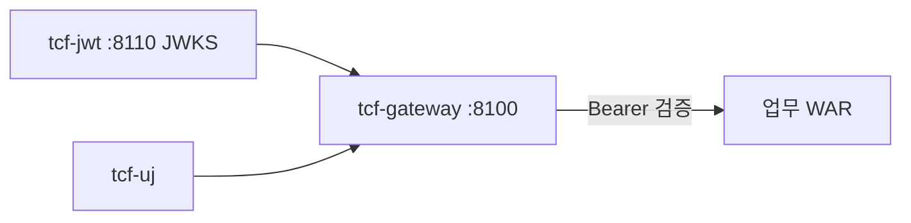

# 제13장. JWT · SSO · Gateway

| 항목 | 내용 |
| --- | --- |
| **편** | 제4편 · 보안·인증·통제 |
| **에디션** | **Master** — 아키텍트·시니어·플랫폼 |
| **기반 원본** | [ztcfbook/제04편/13-JWT-SSO-Gateway.md](../ztcfbook/제04편/13-JWT-SSO-Gateway.md) |
| **입문서** | [ztcfbook-m](../ztcfbook-m/README.md) |
| **장** | 제13장 |
| **파일** | `제04편/13-JWT-SSO-Gateway.md` |
| **상태** | Master Edition (ztcfbook-h) |
| **목차** | [00-목차](../00-목차.md) |

---

## 아키텍처 뷰



---

## Master 해설

tcf-jwt(:8110)는 JWKS(`/.well-known/jwks.json`)를 제공하고, tcf-gateway(:8100) GatewayJwtValidator가 Bearer 토큰을 검증한 뒤 업무 WAR `/{bc}/online`으로 프록시합니다. auth.jwt.enabled는 profile별로 다르며, 로컬 Relay-only와 ztomcat 통합 검증을 구분해야 합니다.

JWT claim과 StandardHeader(userId, channelId 등) 정합은 STF AuthenticationContextValidator와 맞물립니다. Session+JWT 이중 auth path는 tcf-web JWT Filter(znsight-man 80)와 Gateway GEF 계층에서 순서가 정의되어 있습니다. tcf-uj는 Gateway 경유 UI로 채널 ID·CORS·cookie 정책이 tcf-ui Relay와 다릅니다.

운영에서 흔한 장애: JWKS fetch 실패(cache stale), clock skew, claim businessCode와 route bc mismatch, Gateway ROUTING_TABLE 미갱신. E-JWT-AUTH-* 오류코드는 부록 F와 Gateway 로그에서 상관 분석합니다.

점검: ztomcat context /gw·/jwt, SvProxyController 등 AbstractBusinessProxyController 상속 일관성, prod secret rotation 후 Gateway restart, SSO 연계 시 logout·token revoke 경로 E2E.

---

## 구현 샘플 (코드베이스)

### JwkSetController

```java
package com.nh.nsight.auth.jwt.entry.web;

import com.nimbusds.jose.jwk.JWKSet;
import java.util.Map;
import org.springframework.http.MediaType;
import org.springframework.web.bind.annotation.GetMapping;
import org.springframework.web.bind.annotation.RestController;

@RestController
public class JwkSetController {
    private final JWKSet jwkSet;

    public JwkSetController(JWKSet jwtJwkSet) {
        this.jwkSet = jwtJwkSet;
    }

    @GetMapping(value = "/.well-known/jwks.json", produces = MediaType.APPLICATION_JSON_VALUE)
    public Map<String, Object> jwks() {
        return jwkSet.toJSONObject(true);
    }
}

```

원본: [`tcf-jwt/src/main/java/com/nh/nsight/auth/jwt/entry/web/JwkSetController.java`](../tcf-jwt/src/main/java/com/nh/nsight/auth/jwt/entry/web/JwkSetController.java)

### GatewayJwtValidator

```java
package com.nh.nsight.gateway.application.service;

import com.nh.nsight.gateway.application.rule.GatewayAuthException;
import com.nh.nsight.gateway.config.GatewayProperties;
import com.nh.nsight.gateway.support.GatewayProxyTrace;
import com.nh.nsight.gateway.support.GatewayRequestUserReader;
import com.nh.nsight.gateway.support.GatewaySessionContext;
import com.nh.nsight.gateway.application.rule.GatewaySessionHeaderRules;
import java.util.Optional;
import org.springframework.beans.factory.ObjectProvider;
import org.springframework.boot.autoconfigure.condition.ConditionalOnProperty;
import org.springframework.security.oauth2.jwt.Jwt;
import org.springframework.security.oauth2.jwt.JwtDecoder;
import org.springframework.security.oauth2.jwt.JwtException;
import org.springframework.stereotype.Service;
import org.springframework.util.StringUtils;

@Service
@ConditionalOnProperty(prefix = "nsight.gateway.auth.jwt", name = "enabled", havingValue = "true")
public class GatewayJwtValidator {
    private static final String PHASE = "GatewayJwtValidator.validate";
    private static final String JWT_LOG = "******* [GW-JWT] ";

    private final GatewayProperties properties;
    private final ObjectProvider<JwtDecoder> jwtDecoderProvider;
    private final GatewayRequestUserReader requestUserReader;

    public GatewayJwtValidator(GatewayProperties properties,
            ObjectProvider<JwtDecoder> jwtDecoderProvider,
            GatewayRequestUserReader requestUserReader) {
        this.properties = properties;
        this.jwtDecoderProvider = jwtDecoderProvider;
        this.requestUserReader = requestUserReader;
    }

    public boolean hasBearerToken(String authorizationHeader) {
        return extractBearerToken(authorizationHeader) != null;
    }

    public GatewaySessionContext validate(String authorizationHeader, String requestBody) {
        GatewayProxyTrace.start(PHASE);
        try {
            String token = extractBearerToken(authorizationHeader);
            System.out.println(JWT_LOG + "validate start token=" + maskToken(token));
            if (!StringUtils.hasText(token)) {
                System.out.println(JWT_LOG + "validate fail: Bearer token empty");
                throw new GatewayAuthException(401, "Authorization Bearer 토큰이 없습니다.");
            }
            JwtDecoder jwtDecoder = jwtDecoderProvider.getIfAvailable();
            if (jwtDecoder == null) {
                System.out.println(JWT_LOG + "validate fail: JwtDecoder not configured");
                throw new GatewayAuthException(503, "JWT 검증기가 구성되지 않았습니다.");
            }
            Jwt jwt;
            try {
```

원본: [`tcf-gateway/src/main/java/com/nh/nsight/gateway/application/service/GatewayJwtValidator.java`](../tcf-gateway/src/main/java/com/nh/nsight/gateway/application/service/GatewayJwtValidator.java)

---

## Master Deep Dive — JWT · SSO · Gateway

- `/.well-known/jwks.json` — Gateway가 JWKS fetch
- Gateway auth.jwt.enabled 프로파일별
- JWT claim ↔ StandardHeader 정합
- Session + JWT 이중 auth path

### 아키텍트 체크리스트

- 상단 **구현 샘플**을 실제 코드와 대조한다.
- **심화 참고**와 ztcfbook 본문 절 번호를 매핑한다.
- 운영·배포 관점은 ztcfbook-h Master 블록을 우선 본다.

---

## 심화 참고 (Master)

- [docs/architecture/42-jwt.md](../docs/architecture/42-jwt.md)
- [docs/architecture/51-api-gateway.md](../docs/architecture/51-api-gateway.md)
- [znsight-man/79-TCF-GATEWAY-JWT-개발-매뉴얼.md](../znsight-man/79-TCF-GATEWAY-JWT-개발-매뉴얼.md)

---

## 13.1 JWT 발급·갱신·폐기·JWKS

NSIGHT TCF에서 JWT는 **업무 실행 권한을 대체하지 않는다**. JWT는 "누가 요청했는지"를 증명하는 1차 신원 수단이며, TCF STF는 전문 Header·권한·거래통제·Timeout으로 "그 거래를 실행해도 되는가"를 최종 판단한다. 이 분리를 이해하지 못하면 "JWT만 있으면 모든 거래 가능"이라는 잘못된 설계로 이어진다.

토큰 발급·갱신·폐기는 `tcf-jwt` 모듈(포트 8110)이 담당한다. Access Token과 Refresh Token은 RS256으로 서명되며, 공개키는 `/.well-known/jwks.json`으로 제공된다. Refresh Token은 DB에 Hash만 저장하고 원문 저장은 금지한다. `JWT.Auth.*` serviceId로 발급·갱신·폐기 거래가 처리되며, jti 기준 Denylist와 OM 연계 강제 폐기가 지원된다.

SSO 연계 시 `OM.Auth.ssoLogin`이 OM 인증 성공 후 `tcf-jwt`에 내부 호출해 Access/Refresh를 발급한다. 클라이언트는 Access Token을 `Authorization: Bearer` 헤더에만 실어야 하며, Body에 토큰을 넣는 것은 금지된다. 토큰 원문은 로그에 남기지 않고 userId, jti, serviceId 수준만 기록한다.

JWKS URI는 Gateway(`nsight.gateway.auth.jwt.jwk-set-uri`)와 업무 WAR(`nsight.tcf.web.jwt.jwk-set-uri`)에서 동일하게 설정해야 한다. 로컬 예시는 `http://127.0.0.1:8110/.well-known/jwks.json`, issuer `NSIGHT-AUTH`, audience `NSIGHT-MP`이다. 키 로테이션 시 JWKS에 새 키를 추가한 뒤 구 키를 제거하는 순서를 지켜 무중단 전환한다.

Access Token claim에는 `userId`, `branchId`, `channelId`, `jti`, `iss`, `aud`, `exp`가 포함된다. STF 2차 정합성 검증과 Gateway 1차 검증 모두 이 claim을 참조하므로, 발급 시 Header와 동일한 값을 넣는 것이 원칙이다. Refresh Token 갱신(`JWT.Auth.refresh`)은 tcf-jwt 내부 또는 OM이 조율하며, 화면·Gateway·업무 WAR에서 직접 refresh endpoint를 노출하지 않는다.

토큰 수명 정책은 환경별 profile로 분리한다. Access Token은 짧게(예: 15~30분), Refresh Token은 길게(예: 7~14일) 설정하되, 운영 보안 정책에 맞춘다. 폐기(`JWT.Auth.revoke`, `JWT.Auth.logout`) 시 jti를 Denylist에 등록하고 Refresh Hash를 무효화한다. Denylist 실시간 Gateway 연동은 설계상 준비 중이므로, 긴급 폐기 후 Gateway 캐시 TTL·JWKS 전파 지연을 runbook에 명시한다.

| ServiceId | 호출 주체 | 용도 |
| --- | --- | --- |
| `JWT.Auth.ssoIssue` | tcf-om (내부) | SSO·로그인 후 Access/Refresh 발급 |
| `JWT.Auth.refresh` | tcf-jwt (내부) | Access Token 재발급 |
| `JWT.Auth.revoke` | tcf-om, Gateway | jti Denylist 등록 |
| `JWT.Auth.logout` | tcf-om | 로그아웃 연계 토큰 폐기 |

---

## 13.2 tcf-web JWT Filter

Gateway를 우회해 `/{businessCode}/online`에 직접 들어올 수 있는 환경(Tomcat 직접 접근, 내부망)에서는 **업무 WAR도 JWT 1차 검증**이 필요하다. `TcfJwtAuthenticationFilter`가 이 역할을 하며, `nsight.tcf.web.jwt.enabled=true`일 때 `*/online` URI(health/actuator 제외)에 적용된다.

Filter 동작: `Authorization: Bearer` 추출 → `JwtDecoder`로 decode·서명 검증 → `AuthenticatedUserContextHolder`와 `AuthenticationContextHolder`에 claim 저장 → 실패 시 HTTP 401 JSON(`E-JWT-AUTH-*`). Bearer가 없으면 `E-JWT-AUTH-0001`, decode 실패는 `E-JWT-AUTH-0004`, userId claim 없음은 `E-JWT-AUTH-0008`이다.

**JwtDecoder는 tcf-core가 아니라 HTTP 계층(tcf-gateway, tcf-web)에 둔다.** tcf-core는 전문 엔진이므로 JwtDecoder를 직접 배치하지 않는다. Filter 통과 후 `TCF.process()` → STF.preProcess()에서 `AuthenticationContextValidator`가 JWT claim과 StandardHeader의 2차 정합성을 검사한다.

로컬 디버그 시 로그 prefix로 구간을 구분한다. Gateway JWT는 `[GW-JWT]`, 업무 WAR Filter는 `[TCF-WEB-JWT]`, STF 2차 정합성은 `[TCF-AUTH-CTX]`이다. Filter와 STF 검증을 모두 통과해야 Handler까지 도달한다.

Filter는 Spring Security Filter Chain보다 앞단에서 동작하며, `OnlineTransactionController` 진입 전에 인증 컨텍스트를 ThreadLocal에 적재한다. STF의 `SessionValidator`와 `AuthorizationValidator`는 이 컨텍스트와 HttpSession을 함께 참조한다. JWT-only 호출(세션 쿠키 없음)도 Filter가 claim을 적재하면 STF 권한 검증까지 이어질 수 있다.

설정 예시(local profile):

```yaml
nsight:
  tcf:
    web:
      jwt:
        enabled: true
        jwk-set-uri: http://127.0.0.1:8110/.well-known/jwks.json
        issuer: NSIGHT-AUTH
        audience: NSIGHT-MP
    authentication-context-validation-enabled: true
```

| 오류 코드 | 의미 | 대응 |
| --- | --- | --- |
| `E-JWT-AUTH-0001` | Bearer 없음 | Authorization 헤더 추가 |
| `E-JWT-AUTH-0004` | 서명·decode 실패 | JWKS URI·issuer·audience 확인 |
| `E-JWT-AUTH-0008` | userId claim 없음 | tcf-jwt 발급 claim 점검 |
| `E-JWT-AUTH-0009` | claim↔Header 불일치 | Header 7항과 JWT claim 동기화 |

---

## 13.3 Gateway JWT·라우팅

`tcf-gateway`(포트 8100)는 L4·Apache를 대체하지 않는 **Application Gateway**이다. businessCode 기준으로 downstream WAR에 HTTP Relay를 수행하고, 세션·JWT 1차 관문과 Header 보정을 담당한다. 라우팅 키는 `serviceId`가 아니라 **`businessCode`**이며, `serviceId` → Handler 라우팅은 업무 WAR 내부 TCF Dispatcher 책임이다.

처리 파이프라인은 TCF의 STF/BTF/ETF와 대칭 naming으로 **GRF → GSF → GEF**이다. GSF.preProcess()에서 ① `TCF_GATEWAY_ROUTE` 조회(`ENV_CODE` + `BUSINESS_CODE`) ② `GatewayAuthenticationService` 인증 ③ `GatewaySessionRequestEnricher` Header 보정이 순서대로 실행된다. 이후 `GatewayRouteDispatcher`가 RestClient로 Target URL에 POST하고, GEF가 응답·Set-Cookie·Gateway TX Log를 처리한다.

`GatewayAuthenticationService` 인증 분기:

| 조건 | 동작 |
| --- | --- |
| `login-required=false` | 검증 생략 |
| 로그인 면제 serviceId | 검증 생략 |
| OM + jwt.enabled | Bearer JWT **필수** |
| 기타 + Bearer + jwt.enabled | JWT 검증 |
| 그 외 | SESSIONDB 4단계 세션 검증 |

세션 4단계는 Cookie → SPRING_SESSION 존재·만료 → TCF_USER_SESSION STATUS → header.userId vs 세션 userId 순이다. Gateway는 HttpSession을 생성하지 않으며, `session-datasource`는 tcf-om과 **동일 SESSIONDB**를 바라봐야 한다.

Target URL은 `TARGET_BASE_URL + CONTEXT_PATH + ONLINE_PATH`로 조립된다. LOCAL bootRun SV 예: `http://127.0.0.1:8086/sv/online`. Route 미등록 시 404, 인증 실패 시 401, downstream 연결 실패 시 502/503 Gateway JSON으로 응답한다. Gateway 오류는 TCF StandardResponse가 아닐 수 있으므로 채널 UI는 HTTP 상태와 Gateway JSON을 함께 처리해야 한다.

```text
[Browser / tcf-uj]
  │ POST /sv/online  JSON + Cookie [+ Bearer]
  ▼
[Gateway *ProxyController]
  ▼ GRF.forwardOnline
  ├─ GSF: Route → Auth → Header enrich
  ├─ GatewayRouteDispatcher → RestClient POST
  └─ GEF: Set-Cookie relay + TCF_GATEWAY_TX_LOG
  ▼
[sv-service] TcfJwtAuthenticationFilter → TCF.process()
```

Gateway는 `tcf-core`에 **의존하지 않는** 독립 WAR이다. bootRun 8100, WAR `gw.war`, ztomcat `/gw`(8080)이다. ztomcat 기본 deploy 목록에 gw가 없을 수 있어 로컬 Gateway 검증은 bootRun 8100을 주로 사용한다. Route Cache TTL은 profile별(local off, dev 30s, prod 60s)이며 `nsight.gateway.route-table.cache-enabled`로 제어한다.

---

## 13.4 JWT/SSO 연계 기준

JWT와 SSO는 "외부 IdP 로그인 → NSIGHT 토큰 발급 → Gateway·업무 호출" 흐름으로 연결된다. OM이 SSO 원천 인증을 수행하고, 성공 시 `tcf-jwt`가 NSIGHT 표준 Access Token을 발급한다. 이후 `tcf-ui`/`tcf-uj`는 `callViaGateway`로 Bearer를 실어 OM Admin·업무 거래를 호출한다.

쿠키 세션과 JWT Bearer는 **공존**한다. Gateway는 Bearer가 있으면 JWT, 없으면 세션 4단계로 분기한다. OM Admin 로컬 개발에서 쿠키 Relay(`/api/relay/OM/online`)와 JWT Gateway(`/api/gateway/om/online`)를 환경 설정으로 전환할 수 있다. 운영형 검증은 tcf-uj + Gateway 경로를 사용하는 것이 권장된다.

STF 2차 정합성(`AuthenticationContextValidator`)은 claim `userId`, `branchId`, `channelId`가 Header 동일 필드와 일치하는지 검사한다. 불일치 시 `E-JWT-AUTH-0009`(`JWT_HEADER_CLAIM_MISMATCH`)이다. `nsight.tcf.authentication-context-validation-enabled` 기본값은 `true`이며, 앞단 인증 컨텍스트가 없으면 skip하여 세션-only 거래와 호환된다.

SSO 연계 End-to-End 흐름:

```text
[외부 IdP] ── SAML/OIDC ──► [tcf-om] OM.Auth.ssoLogin
                                    │
                                    ▼ 내부 호출 JWT.Auth.ssoIssue
                              [tcf-jwt] Access + Refresh
                                    │
                                    ▼ Bearer
[tcf-uj] ──► [tcf-gateway] ──► [업무 WAR] STF 2차 정합성
```

외부 IdP 연동 시 채널 ID·issuer·audience·Gateway Route·OM Catalog·거래통제 Row를 한 세트로 등록한다. SSO 사용자 최초 로그인 시 OM_USER·권한그룹 매핑이 선행되어야 STF `AuthorizationValidator`를 통과한다. Refresh Token은 HttpOnly Cookie 또는 secure storage에만 보관하고, XSS로부터 격리한다.

SSO·JWT 도입 체크리스트:

| # | 항목 | 확인 |
| --- | --- | --- |
| 1 | `JWT.Auth.ssoIssue` Catalog 등록 | OM_SERVICE_CATALOG |
| 2 | JWKS URI Gateway·업무 WAR 동일 | application-local.yml |
| 3 | Gateway Route OM·업무 businessCode | TCF_GATEWAY_ROUTE |
| 4 | channelId 공통코드 등록 | OM_COMMON_CODE |
| 5 | TC Row(채널별) | TCF_TRANSACTION_CONTROL |
| 6 | Denylist·폐기 runbook | OM + tcf-jwt |

Denylist 실시간 Gateway 연동은 설계상 준비 중이므로 README·매뉴얼의 현행 Gap을 확인한다.

---

## 13.5 보안 코딩·보안 운영

보안 코딩 기준의 핵심은 **최소 권한·민감정보 비노출·계층별 책임 분리**이다. 비밀번호·토큰 원문·고객 식별정보를 로그·세션·응답 body에 남기지 않는다. SQL Injection·XSS 방지, Parameterized Query, 출력 이스케이프는 업무 WAR와 OM 공통 적용이다.

운영 보안에서는 HTTPS + secure cookie, 운영 `login-required=true`, Gateway 4단계 세션 검증 dev 완화 금지, JWKS 가용성 모니터링, Route seed 변경 시 H2 gateway-route DB 갱신을 점검한다. 세션 강제 종료·권한 변경·토큰 폐기 시 감사로그를 남긴다.

장애 대응 시 JWT 검증 실패가 전체 서비스를 막으면, 승인된 절차 하에서만 `jwt.enabled` 임시 off 또는 Gateway bypass를 검토한다. 평상시에는 Gateway TX Log(`TCF_GATEWAY_TX_LOG`)와 업무 `TCF_TX_LOG`의 동일 guid 상관으로 인증 실패 원인을 추적한다.

침해 대응 시 jti Denylist 등록, 해당 사용자 세션·토큰 일괄 폐기, OM.Session.delete, Refresh Token Hash 무효화 순으로 조치한다. 보안 패치 WAR 배포는 CI/CD 표준 롤백 절차와 함께 수행한다.

키 로테이션 운영 절차: ① tcf-jwt에 새 RSA 키 pair 생성 ② JWKS에 kid 추가(구 키 유지) ③ Gateway·업무 WAR JWKS cache 갱신 확인 ④ 신규 토큰 발급 검증 ⑤ 구 kid 제거. private key는 Secret Manager 또는 `.gitignore` 로컬 key file에만 보관한다.

| 운영 항목 | 주기 | 담당 |
| --- | --- | --- |
| JWKS reachable | 실시간 health | Gateway·batch AP Job |
| Route seed drift | 배포 전 diff | CI/CD validate stage |
| JWT off 임시 조치 | P1 장애 시만 | 승인된 runbook |
| SSO IdP 인증서 만료 | 분기 점검 | 보안·OM |

---

## 장 요약 (Master)

JWT는 tcf-jwt에서 RS256·JWKS로 발급되고, Gateway와 tcf-web Filter에서 1차 검증, tcf-core STF에서 claim↔Header 2차 정합성 검증을 거친다. Gateway는 businessCode Relay·세션 4단계·JWT 분기·Header 보정을 GRF/GSF/GEF 파이프라인으로 처리한다. JWT는 권한·거래통제를 대체하지 않으며, 쿠키 세션과 공존한다. 보안 운영은 토큰·세션·로그·Route·JWKS를 함께 관리하는 것이 원칙이다.

> Master Edition: **아키텍처 뷰** → **Master 해설** → **구현 샘플** → **Master Deep Dive** → **심화 참고** 순으로 본문과 함께 읽는다.

---

## 이전 · 다음

| | |
| --- | --- |
| ← 이전 | [제12장 세션·로그인·권한](../제04편/12-세션-로그인-권한.md) |
| → 다음 | [제14장 거래통제·정책](../제04편/14-거래통제-정책.md) |

---

## 출처 색인 · Master 확장

| 구분 | 경로 |
| --- | --- |
| ztcfbook-h | 본 파일 |
| ztcfbook | `../ztcfbook/제04편/13-JWT-SSO-Gateway.md` |

### 원본 출처


| 절 | 참고 문서 |
| --- | --- |
| 13.1 | [docs/architecture/42-jwt.md](../../docs/architecture/42-jwt.md), [zguide/tcf-jwt-개발가이드.md](../../zguide/tcf-jwt-개발가이드.md) |
| 13.2 | [znsight-man/80-JWT-TCF-WEB-개발-매뉴얼.md](../../znsight-man/80-JWT-TCF-WEB-개발-매뉴얼.md) |
| 13.3 | [docs/architecture/51-api-gateway.md](../../docs/architecture/51-api-gateway.md), [znsight-man/79-TCF-GATEWAY-JWT-개발-매뉴얼.md](../../znsight-man/79-TCF-GATEWAY-JWT-개발-매뉴얼.md), [zguide/tcf-gateway-개발가이드.md](../../zguide/tcf-gateway-개발가이드.md), [zarchitecture/06-API-Gateway-아키텍처.md](../../zarchitecture/06-API-Gateway-아키텍처.md) |
| 13.4 | [znsight-man/41-JWT-SSO-연계.md](../../znsight-man/41-JWT-SSO-연계.md) |
| 13.5 | [znsight-man/42-보안-코딩-기준.md](../../znsight-man/42-보안-코딩-기준.md), [docs/architecture/43-security-operations.md](../../docs/architecture/43-security-operations.md) |
