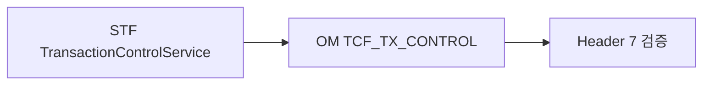

# 제14장. 거래통제·정책

| 항목 | 내용 |
| --- | --- |
| **편** | 제4편 · 보안·인증·통제 |
| **에디션** | **Master** — 아키텍트·시니어·플랫폼 |
| **기반 원본** | [ztcfbook/제04편/14-거래통제-정책.md](../ztcfbook/제04편/14-거래통제-정책.md) |
| **입문서** | [ztcfbook-m](../ztcfbook-m/README.md) |
| **장** | 제14장 |
| **파일** | `제04편/14-거래통제-정책.md` |
| **상태** | Master Edition (ztcfbook-h) |
| **목차** | [00-목차](../00-목차.md) |

---

## 아키텍처 뷰



---

## Master 해설

Header 7 Allow-List(businessCode, transactionCode, channelId, processingType 등)는 TransactionControlService가 STF 7단에서 OM TCF_TX_CONTROL과 대조합니다. URL `/{bc}/online`과 Header businessCode 불일치, 미등록 channelId, 허용 시간 외 호출은 E-TCF-HDR-*·E-TCF-CTL-*로 거절됩니다.

OM 거래통제 등록(OmTransactionControlHandler)은 Catalog·Timeout과 함께 신규 거래 출시 3종 세트입니다. 운영자가 OM UI에서 정책 변경 시 runtime cache evict API 호출 여부를 확인하지 않으면 구 정책이 남는 incident가 발생합니다.

채널·점포·URL prefix 정책은 Gateway STF/GRF와 업무 WAR STF가 이중 검증하는 경우가 있어, 설계 변경 시 양쪽 yml과 OM row를 동시에 갱신해야 합니다.

코드 리뷰·운영 전환: Catalog service_id 존재, TCF_TX_CONTROL allow row, TimeoutPolicy row, curl negative test(잘못된 channelId). prod OM seed와 dev diff를 부록 J 체크리스트로 승인받으십시오.

---

## 구현 샘플 (코드베이스)

### TransactionControlService

```java
package com.nh.nsight.tcf.core.support.control;

import com.nh.nsight.tcf.core.config.TcfProperties;
import com.nh.nsight.tcf.core.support.error.BusinessException;
import com.nh.nsight.tcf.core.support.error.ErrorCode;
import com.nh.nsight.tcf.core.support.message.StandardHeader;
import com.nh.nsight.tcf.core.support.TcfConsoleLog;
import java.util.Optional;
import org.slf4j.Logger;
import org.slf4j.LoggerFactory;
import org.springframework.beans.factory.ObjectProvider;
import org.springframework.stereotype.Service;

@Service
public class TransactionControlService {
    private static final Logger log = LoggerFactory.getLogger(TransactionControlService.class);

    private final TcfProperties properties;
    private final TransactionControlValidator validator;
    private final ObjectProvider<TransactionControlRepository> repositoryProvider;

    public TransactionControlService(TcfProperties properties,
                                     TransactionControlValidator validator,
                                     ObjectProvider<TransactionControlRepository> repositoryProvider) {
        this.properties = properties;
        this.validator = validator;
        this.repositoryProvider = repositoryProvider;
    }

    public void check(StandardHeader header) {
        if (!properties.isTransactionControlEnabled()) {
            return;
        }
        if (header != null && TransactionControlExemptions.isExempt(header.getServiceId())) {
            log.debug("Transaction control skipped for exempt service. serviceId={}", header.getServiceId());
            return;
        }
        TcfConsoleLog.boundary("TransactionControlService", "check", "START");
        TransactionControlHeader controlHeader = TransactionControlHeader.from(header);
        validator.validateRequired(controlHeader);

        TransactionControlRepository repository = repositoryProvider.getIfAvailable();
        if (repository == null) {
            log.warn("TransactionControlRepository not available; deny transaction. serviceId={}", header.getServiceId());
            throw new BusinessException(ErrorCode.TXCTRL_UNAVAILABLE, "거래통제 조회를 수행할 수 없습니다.");
        }

        Optional<TransactionControlRule> rule = repository.findRule(controlHeader);
        log.info("TX_CTRL_CHECK serviceId={} businessCode={} user={} channelId={} branch={} clientIp={} matched={} controlType={} globalUnblock={}",
                controlHeader.getServiceId(), controlHeader.getBusinessCode(),
                controlHeader.getUser(), controlHeader.getChannelId(), controlHeader.getBranch(),
                controlHeader.getClientIp(),
                rule.isPresent(), rule.map(TransactionControlRule::controlType).orElse("-"),
                repository.isGlobalUnblockActive());

```

원본: [`tcf-core/src/main/java/com/nh/nsight/tcf/core/support/control/TransactionControlService.java`](../tcf-core/src/main/java/com/nh/nsight/tcf/core/support/control/TransactionControlService.java)

### OmTransactionControlHandler

```java
package com.nh.nsight.marketing.om.entry.handler;

import com.nh.nsight.marketing.om.entry.facade.OmTransactionControlFacade;
import com.nh.nsight.tcf.core.support.context.TransactionContext;
import com.nh.nsight.tcf.core.support.error.BusinessException;
import com.nh.nsight.tcf.core.support.error.ErrorCode;
import com.nh.nsight.tcf.core.support.message.StandardRequest;
import com.nh.nsight.tcf.core.support.transaction.TransactionHandler;
import java.util.Collection;
import java.util.List;
import java.util.Map;
import org.springframework.stereotype.Component;

/**
 * OM 거래통제 도메인 핸들러. OM.TransactionControl.* 거래를 한 핸들러가 처리한다(Service 도메인당 1개).
 */
@Component
public class OmTransactionControlHandler implements TransactionHandler {

    private static final String INQUIRY = "OM.TransactionControl.inquiry";
    private static final String SAVE = "OM.TransactionControl.save";
    private static final String UPDATE = "OM.TransactionControl.update";
    private static final String DELETE = "OM.TransactionControl.delete";

    private final OmTransactionControlFacade facade;

    public OmTransactionControlHandler(OmTransactionControlFacade facade) {
        this.facade = facade;
    }

    @Override
    public Collection<String> serviceIds() {
        return List.of(INQUIRY, SAVE, UPDATE, DELETE);
    }

    @Override
    public Object doHandle(StandardRequest<Map<String, Object>> request, TransactionContext context) {
        String serviceId = context.getHeader().getServiceId();
        return switch (serviceId) {
            case INQUIRY -> facade.inquiry(request.getBody(), context);
            case SAVE -> facade.save(request.getBody(), context);
            case UPDATE -> facade.update(request.getBody(), context);
            case DELETE -> facade.delete(request.getBody(), context);
            default -> throw new BusinessException(ErrorCode.SERVICE_NOT_FOUND,
                    "OmTransactionControlHandler 미지원 serviceId: " + serviceId);
```

원본: [`tcf-om/src/main/java/com/nh/nsight/marketing/om/entry/handler/OmTransactionControlHandler.java`](../tcf-om/src/main/java/com/nh/nsight/marketing/om/entry/handler/OmTransactionControlHandler.java)

---

## Master Deep Dive — 거래통제 정책

- Header 7 Allow-List — businessCode URL 일치
- 채널·점포·시간대 OM 정책
- E-TCF-HDR-* / E-TCF-CTL-* ErrorCode
- Catalog·통제·Timeout 등록 3종 세트

### 아키텍트 체크리스트

- 상단 **구현 샘플**을 실제 코드와 대조한다.
- **심화 참고**와 ztcfbook 본문 절 번호를 매핑한다.
- 운영·배포 관점은 ztcfbook-h Master 블록을 우선 본다.

---

## 심화 참고 (Master)

- [docs/architecture/40-header-7-transaction-control.md](../docs/architecture/40-header-7-transaction-control.md)
- [znsight-man/48-거래통제-등록-절차.md](../znsight-man/48-거래통제-등록-절차.md)

---

## 14.1 Header 7항 Allow-List

NSIGHT TCF 거래통제는 **Header 7개 항목만**으로 거래 실행 여부를 판단한다. 별도의 URL 패턴이나 Handler 클래스명이 아니라, 표준 전문 Header에 실린 식별자 조합이 통제의 단위이다. 이 설계는 "같은 serviceId라도 사용자·지점·채널 조합별로 허용 범위를 다르게" 운영할 수 있게 한다.

| 통제 항목 | Header 필드 | DB 컬럼 |
| --- | --- | --- |
| Service-id | `serviceId` | `SERVICE_ID` |
| Transaction-code | `transactionCode` | `TRANSACTION_CODE` |
| Business-code | `businessCode` | `BUSINESS_CODE` |
| Service-name | `serviceName` | `SERVICE_NAME` |
| User | `user` (userId) | `USER_ID` |
| Channel | `channelId` | `CHANNEL_ID` |
| Branch | `branch` (branchId) | `BRANCH_ID` |

판단 규칙: **GLOBAL + BLOCK_YN=N** Row가 있으면 전체 차단 해제(최우선). 그 외 7필드가 모두 일치하고 `BLOCK_YN=Y`이면 차단. 미등록 거래는 **기본 허용**이다. (운영 정책에 따라 Allow-List 전환 시 미등록=차단으로 강화할 수 있으나, 코드베이스 기본은 미등록 허용 + 명시적 BLOCK_Y 차단이다.)

처리 위치는 `OnlineTransactionController` → `TCF.process()` → `STF.preProcess()` → `TransactionControlService.check()`이다. Header 7필드 필수값 누락 시 `E-TCF-HDR-001`~`007`, 차단 시 `E-TCF-CTL-001`, Repository 미구성 시 `E-TCF-CTL-003`이다. `OM.Auth.login`, `logout`, `session`은 거래통제 검사에서 제외된다.

STF 전처리 순서에서 거래통제는 Catalog 조회·세션·권한 검증과 인접한다. Gateway는 businessCode만 알고 serviceId 세부 통제는 downstream STF가 수행한다. 따라서 Gateway 401과 STF `E-TCF-CTL-001`은 원인이 다르며, guid로 Gateway log와 TCF_TX_LOG를 상관해야 한다.

와일드카드(`*`)는 OM seed·`TransactionControlSeedData`에서 채널·지점·사용자 범위를 넓힐 때 사용한다. 운영에서는 `USER_ID=*`, `CHANNEL_ID=WEBTOP`처럼 **최소 필요 범위**만 허용하고, 전역 `*` 남용을 금지한다. GLOBAL 해제 Row는 감사 대상이며 등록·삭제 이력을 OM_AUDIT_LOG에 남기는 정책을 권장한다.

```text
STF.preProcess()
  ├─ Header 7항 null/blank 검증
  ├─ OM_SERVICE_CATALOG (serviceId 존재)
  ├─ SessionValidator / AuthorizationValidator
  ├─ TransactionControlService.check()  ← TCF_TRANSACTION_CONTROL
  ├─ TimeoutExecutor
  └─ IdempotencyChecker
```

| 오류 코드 | 의미 |
| --- | --- |
| `E-TCF-HDR-001`~`007` | Header 7항 중 누락 |
| `E-TCF-CTL-001` | BLOCK_Y Row 매칭 차단 |
| `E-TCF-CTL-003` | TC Repository 미구성 |

---

## 14.2 businessCode · URL · Prefix 정합성

Header의 `businessCode`는 URL Context Path·WAR 업무코드·Catalog·Gateway Route와 **네 군데에서 일치**해야 한다. 예를 들어 SV 업무는 URL `/sv/online`, Header `businessCode: SV`, WAR context `/sv`, Gateway Route `BUSINESS_CODE=SV`가 모두 맞아야 Relay·Dispatcher·통제 조회가 한 흐름으로 이어진다.

`serviceId` prefix도 businessCode와 정합해야 한다. `SV.Customer.inquiry`는 businessCode `SV`, Handler `SvCustomerHandler`, Catalog `BUSINESS_CODE=SV`로 등록된다. OM Admin이나 테스트 JSON에서 businessCode만 바꾸고 serviceId prefix를 그대로 두면 Catalog는 통과해도 Handler 라우팅 또는 통제 Row 불일치로 실패한다.

`transactionCode`는 `{BC}-{TYPE}-{NNNN}` 명명을 따른다. Header 7항에 포함되므로 통제 Row 등록 시 transactionCode까지 정확히 일치시켜야 한다. 와일드카드(`*`) 사용 규칙은 OM seed와 `TransactionControlSeedData`를 참고하며, 운영에서는 무분별한 `*` 등록을 금지하고 채널·지점별 최소 허용 원칙을 적용한다.

Gateway URL `POST /{businessCode}/online`과 업무 WAR URL, tcf-ui Relay `/api/relay/{code}/online`의 `{code}`는 소문자 businessCode catalog와 매핑된다. tcf-uj는 Gateway 경유이므로 Route 미등록 시 Gateway 404가 먼저 발생하고 STF까지 도달하지 않는다. 통합 테스트 시 Gateway Route + Catalog + TC Row를 함께 확인한다.

정합성 점검 매트릭스:

| 검증 대상 | SV 예시 | 확인 방법 |
| --- | --- | --- |
| WAR context | `/sv` | bootRun·ztomcat context |
| Header businessCode | `SV` | StandardRequest JSON |
| serviceId prefix | `SV.*` | Handler `serviceIds()` |
| Gateway Route | `BUSINESS_CODE=SV` | TCF_GATEWAY_ROUTE |
| TC Row | `BUSINESS_CODE=SV` | OM Admin |

`serviceName`은 통제 키이지만 사람이 읽는 설명 필드이기도 하다. Catalog `SERVICE_NAME`과 Header `serviceName` 불일치는 통제 차단보다 감사·로그 혼선을 유발할 수 있으므로 seed와 UI 입력 시 동일 문자열을 유지한다.

---

## 14.3 OM 거래통제 등록 절차

거래통제 등록은 OM Admin `OM.TransactionControl.*` Handler 또는 SQL seed로 수행한다. `OmTransactionControlHandler`가 inquiry/save/delete 거래를 제공하며, 화면에서 7필드 + `CONTROL_TYPE` + `BLOCK_YN`을 입력한다.

신규 업무 거래 오픈 절차:

1. `OM_SERVICE_CATALOG`에 serviceId 등록
2. `TCF_TRANSACTION_CONTROL`에 Header 7 Allow-List(또는 차단) Row 등록
3. `TCF_SERVICE_TIMEOUT_POLICY` 등록
4. 필요 시 `OM_ERROR_CODE`, 기능·데이터 권한 등록
5. `data.sql` 또는 `ServiceCatalogSeedData` / `TransactionControlSeedData`에 seed 반영

운영 반영 후 `tcf-cache` Evict로 STF 캐시를 갱신한다. 캐시 TTL 동안 구 통제 정책이 적용될 수 있으므로, 긴급 차단 시 캐시 무효화 API 또는 OM Cache 관리 화면을 함께 사용한다.

차단 등록: 7필드 + `BLOCK_YN=Y`. 차단 해제: 동일 Row의 `BLOCK_YN=N` 또는 Row 삭제. 전체 해제: `CONTROL_TYPE=GLOBAL`, 7필드 `*`, `BLOCK_YN=N`. 감사 목적으로 해제 시에도 이력 Row를 남기는 운영 정책을 권장한다.

OM Admin 화면 경로: `/om/admin/transaction-control.html`. inquiry로 기존 Row 검색 후 save로 upsert, delete로 Row 제거한다. SQL 직접 반영 시 운영 DB backup 후 migration script를 CI/CD에 포함하고, 반영 직후 cache Evict를 runbook 단계로 고정한다.

긴급 차단 시나리오(악용 serviceId 발견):

```text
1. OM.TransactionControl.save → BLOCK_YN=Y Row 추가
2. OM.Cache.evict (또는 tcf-cache API)
3. TCF_TX_LOG에서 E-TCF-CTL-001 증가 확인
4. 필요 시 Gateway login-required 유지 + 세션 강제 종료
```

신규 채널(예: MOBILE-APP) 오픈 시 동일 serviceId에 대해 `CHANNEL_ID`만 다른 TC Row를 추가 등록한다. 채널별 Timeout·기능권한도 함께 점검한다.

---

## 14.4 Timeout·ServiceId Catalog OM 등록

ServiceId Catalog(`OM_SERVICE_CATALOG`)는 "이 serviceId가 시스템에 존재하는가"를 답한다. 거래통제는 "이 Header 조합이 허용되는가"를 답한다. Catalog에 없으면 STF에서 조기 실패하고, Catalog에 있어도 TC Row가 BLOCK_Y면 차단된다.

Catalog 등록 컬럼: `SERVICE_ID`(PK), `BUSINESS_CODE`, `HANDLER_CLASS`, `SERVICE_NAME`, `USE_YN`. OM Admin Service Catalog 화면 또는 `OM.ServiceCatalog.save`로 관리한다. 신규 Handler 개발 후 `serviceIds()`에 추가한 ID마다 Catalog Row가 있어야 운영 환경에서 거래가 열린다.

Timeout 정책(`TCF_SERVICE_TIMEOUT_POLICY`)은 거래통제와 **별도 테이블**이다. serviceId별 read timeout, connect timeout, STF `TimeoutExecutor` 적용 값을 OM에서 등록한다. 통제는 "실행 허용", Timeout은 "얼마나 기다릴지"를 결정하므로 설계·운영 문서를 분리해 관리한다.

로컬 H2는 `tcf-om/src/main/resources/data.sql`에 Catalog·TC·Timeout seed가 포함된다. 업무 WAR 단독 bootRun 시 OMDB를 공유하지 않으면 Catalog 조회 실패가 발생할 수 있으므로, 통합 검증은 tcf-om 기동 + 공유 datasource 설정을 권장한다.

Catalog·Timeout 등록 체크리스트:

| # | 작업 | Handler/API |
| --- | --- | --- |
| 1 | serviceId 설계 | `{BC}.{Domain}.{action}` |
| 2 | Catalog INSERT | `OM.ServiceCatalog.save` |
| 3 | TC Row | `OM.TransactionControl.save` |
| 4 | Timeout ms | `OM.TimeoutPolicy.save` |
| 5 | seed 동기화 | `data.sql` / Java Seed |
| 6 | cache Evict | `OM.Cache.*` |

Timeout 미등록 시 STF 기본값 또는 글로벌 fallback이 적용될 수 있다. 외부 EAI·장시간 조회 거래는 connect/read를 넉넉히 잡되, STF 전체 SLA와 Gateway downstream timeout과 **삼각 정합**을 맞춘다.

---

## 14.5 공통코드·오류코드 OM 등록

공통코드(`OM_COMMON_CODE`)는 채널 ID, 지점 유형, 상태 코드 등 UI·Header·SQL에서 참조하는 기준값이다. 오류코드(`OM_ERROR_CODE`)는 `E-{BC}-{DOMAIN}-{NNNN}` 형식으로 사용자·운영 메시지와 매핑된다. 신규 BusinessException 도입 시 OM 오류코드 등록 없이 하드코딩 메시지를 쓰지 않는다.

등록 절차: OM Admin 공통코드·오류코드 화면 → `OM.CommonCode.*`, `OM.ErrorCode.*` → seed·운영 DB 반영 → 업무 WAR MessageSource·ETF 오류 조립 경로 확인. 부록 F 오류코드 표준표와 정합성을 유지한다.

거래통제·Catalog·Timeout·공통코드·오류코드는 모두 **OMDB(System of Record)**에 있고, 업무 WAR STF는 JDBC 또는 cache를 통해 조회한다. 운영 변경은 OM Admin → DB → cache Evict → STF 반영 순서로 전파된다. Git 소스의 seed와 운영 DB drift를 방지하기 위해 배포 시 seed migration 절차를 CI/CD 체크리스트에 포함한다.

운영 알람: 미등록 serviceId 호출, `E-TCF-CTL-001` 급증, 특정 channelId·branchId 집중 차단은 대시보드·거래로그 조회(`OM.TransactionLog.*`)로 모니터링한다. 제21장 테스트 전략에서 통제·Timeout 시나리오 테스트를 거래 테스트 필수 항목으로 다룬다.

통제 관련 오류코드는 ETF가 `result.code`에 매핑한다. `E-TCF-CTL-001` 사용자 메시지는 OM_ERROR_CODE에서 다국어·채널별 문구를 관리한다. Header 검증 오류(`E-TCF-HDR-*`)와 혼동하지 않도록 Domain prefix를 엄격히 구분한다.

| 데이터 유형 | 테이블 | OM Handler prefix |
| --- | --- | --- |
| 공통코드 | OM_COMMON_CODE | OM.CommonCode.* |
| 오류코드 | OM_ERROR_CODE | OM.ErrorCode.* |
| 거래통제 | TCF_TRANSACTION_CONTROL | OM.TransactionControl.* |
| Catalog | OM_SERVICE_CATALOG | OM.ServiceCatalog.* |
| Timeout | TCF_SERVICE_TIMEOUT_POLICY | OM.TimeoutPolicy.* |

---

## 장 요약 (Master)

거래통제는 Header 7항 조합과 `TCF_TRANSACTION_CONTROL`의 BLOCK_YN으로 실행 여부를 결정하며, STF.preProcess()에서 Catalog·권한 다음 또는 병행 검증된다. businessCode·URL·serviceId prefix·Gateway Route 정합성은 통제 등록 전제이다. OM에서 Catalog·TC·Timeout·공통코드·오류코드를 등록·seed하고 cache Evict로 런타임에 반영한다. Gateway는 1차 관문, STF가 최종 통제 관문이다.

> Master Edition: **아키텍처 뷰** → **Master 해설** → **구현 샘플** → **Master Deep Dive** → **심화 참고** 순으로 본문과 함께 읽는다.

---

## 이전 · 다음

| | |
| --- | --- |
| ← 이전 | [제13장 JWT · SSO · Gateway](../제04편/13-JWT-SSO-Gateway.md) |
| → 다음 | [제15장 OM 아키텍처와 개발](../제05편/15-OM-아키텍처와-개발.md) |

---

## 출처 색인 · Master 확장

| 구분 | 경로 |
| --- | --- |
| ztcfbook-h | 본 파일 |
| ztcfbook | `../ztcfbook/제04편/14-거래통제-정책.md` |

### 원본 출처


| 절 | 참고 문서 |
| --- | --- |
| 14.1 | [docs/architecture/40-header-7-transaction-control.md](../../docs/architecture/40-header-7-transaction-control.md), [docs/architecture/39-header-transaction-control.md](../../docs/architecture/39-header-transaction-control.md), [zman/13-거래통제.md](../../zman/13-거래통제.md) |
| 14.2 | [znsight-man/명명규칙-21-Header-항목.md](../../znsight-man/명명규칙-21-Header-항목.md), [znsight-man/21-Header-작성-기준.md](../../znsight-man/21-Header-작성-기준.md) |
| 14.3 | [znsight-man/48-거래통제-등록-절차.md](../../znsight-man/48-거래통제-등록-절차.md) |
| 14.4 | [znsight-man/47-ServiceId-등록-절차.md](../../znsight-man/47-ServiceId-등록-절차.md), [znsight-man/49-Timeout-정책-등록.md](../../znsight-man/49-Timeout-정책-등록.md) |
| 14.5 | [znsight-man/50-공통코드-사용-절차.md](../../znsight-man/50-공통코드-사용-절차.md), [znsight-man/51-오류코드-등록-절차.md](../../znsight-man/51-오류코드-등록-절차.md) |
