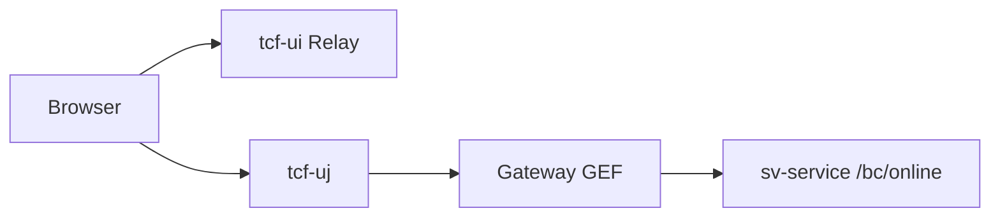

# 제16장. API Gateway · UI 채널

| 항목 | 내용 |
| --- | --- |
| **편** | 제5편 · 플랫폼·운영 관리 (OM) |
| **에디션** | **Master** — 아키텍트·시니어·플랫폼 |
| **기반 원본** | [ztcfbook/제05편/16-API-Gateway-UI-채널.md](../ztcfbook/제05편/16-API-Gateway-UI-채널.md) |
| **입문서** | [ztcfbook-m](../ztcfbook-m/README.md) |
| **장** | 제16장 |
| **파일** | `제05편/16-API-Gateway-UI-채널.md` |
| **상태** | Master Edition (ztcfbook-h) |
| **목차** | [00-목차](../00-목차.md) |

---

## 아키텍처 뷰



---

## Master 해설

tcf-gateway는 STF/GRF/GSF/GEF 4계층으로 외부 요청을 필터링·라우팅·프록시합니다. GatewayRouteDispatcher와 businessCode별 ProxyController(SvProxyController 등)가 downstream `http://host:port/{bc}/online`을 호출합니다. ROUTING_TABLE.md와 tcf-cicd profile yml이 SoT입니다.

tcf-ui는 TransactionRelayService로 개발 중 bootRun WAR에 직접 POST(gateway-relay-enabled=false)하거나 Gateway 경유(true)를 profile로 전환합니다. tcf-uj(:8102)는 Browser→Gateway→WAR 경로를 운영 UI에 가깝게 재현합니다. channelId Header는 채널별 통계·통제·로그 집계 키입니다.

Apache·Spring 이중 라우팅(zarchitecture/06) 환경에서는 path prefix(/gw)와 cookie domain 불일치가 세션 단절을 유발합니다. 외부 REST 연계 시 Online Endpoint 규약 유지 여부가 STF 적용 범위를 결정합니다.

운영: Gateway auth.jwt.enabled, downstream connection pool, Proxy timeout ≤ OM TimeoutPolicy. UI Relay sample JSON과 Gateway curl E2E를 릴리즈마다 smoke. channelId 신규 추가 시 OM 통제·functionAuth 동시 등록.

---

## 구현 샘플 (코드베이스)

### TransactionRelayService (tcf-ui)

```java
package com.nh.nsight.tcf.ui.client;

import com.nh.nsight.tcf.ui.application.service.BusinessModuleCatalog;
import com.nh.nsight.tcf.ui.config.TcfUiProperties;
import com.nh.nsight.tcf.ui.support.BusinessModuleInfo;
import com.nh.nsight.tcf.ui.support.RelayResult;
import java.net.URI;
import java.nio.charset.StandardCharsets;
import java.util.List;
import org.springframework.http.HttpHeaders;
import org.springframework.http.MediaType;
import org.springframework.stereotype.Service;
import org.springframework.util.StreamUtils;
import org.springframework.util.StringUtils;
import org.springframework.web.client.RestClient;
import org.springframework.web.client.RestClientResponseException;

@Service
public class TransactionRelayService {
    private final TcfUiProperties properties;
    private final BusinessModuleCatalog catalog;
    private final GatewayRelayService gatewayRelayService;
    private final RestClient restClient;

    public TransactionRelayService(TcfUiProperties properties,
                                   BusinessModuleCatalog catalog,
                                   GatewayRelayService gatewayRelayService) {
        this.properties = properties;
        this.catalog = catalog;
        this.gatewayRelayService = gatewayRelayService;
        this.restClient = RestClient.builder()
                .defaultHeader("Content-Type", MediaType.APPLICATION_JSON_VALUE + ";charset=UTF-8")
                .defaultHeader("Accept", MediaType.APPLICATION_JSON_VALUE + ";charset=UTF-8")
                .build();
    }

    public String resolveTargetUrl(String businessCode, RelayOptions options) {
        if (properties.isGatewayRelayEnabled()) {
            return gatewayRelayService.resolveGatewayOnlineUrl(businessCode, options);
        }
        BusinessModuleInfo module = catalog.findByCode(businessCode);
        String baseUrl = resolveDirectBaseUrl(module, options);
        return baseUrl + module.contextPath() + "/online";
    }

    private String resolveDirectBaseUrl(BusinessModuleInfo module, RelayOptions options) {
        if (resolveMode(options) == TcfUiProperties.DeploymentMode.tomcat) {
            return trimTrailingSlash(resolveTomcatGateway(options));
        }
        return trimTrailingSlash(resolveBootrunHost(options)) + ":" + module.localPort();
    }

    public RelayResult relay(String businessCode, String requestBody, RelayOptions options) {
        return relay(businessCode, requestBody, options, null, null);
    }
```

원본: [`tcf-ui/src/main/java/com/nh/nsight/tcf/ui/client/TransactionRelayService.java`](../tcf-ui/src/main/java/com/nh/nsight/tcf/ui/client/TransactionRelayService.java)

### GatewayRouteDispatcher

```java
package com.nh.nsight.gateway.client;

import com.nh.nsight.gateway.application.service.GatewayForwardResponse;
import com.nh.nsight.gateway.support.RouteContext;
import com.nh.nsight.gateway.support.GatewayProxyTrace;
import java.net.URI;
import java.nio.charset.StandardCharsets;
import java.time.Duration;
import java.util.List;
import org.springframework.http.HttpHeaders;
import org.springframework.http.MediaType;
import org.springframework.http.client.SimpleClientHttpRequestFactory;
import org.springframework.stereotype.Component;
import org.springframework.util.StreamUtils;
import org.springframework.util.StringUtils;
import org.springframework.web.client.RestClient;

@Component
public class GatewayRouteDispatcher {
    private static final String PHASE = "GatewayRouteDispatcher.dispatch";
    private static final int DEFAULT_CONNECT_TIMEOUT_MS = 3000;
    private static final int DEFAULT_READ_TIMEOUT_MS = 5000;

    public GatewayForwardResponse dispatch(RouteContext context, String cookieHeader) {
        GatewayProxyTrace.start(PHASE);
        try {
            int connectTimeoutMs = effectiveTimeout(context.connectTimeoutMs(), DEFAULT_CONNECT_TIMEOUT_MS);
            int readTimeoutMs = effectiveTimeout(context.readTimeoutMs(), DEFAULT_READ_TIMEOUT_MS);
            GatewayProxyTrace.log(PHASE, "targetUrl=" + context.targetUrl()
                    + " connectTimeoutMs=" + connectTimeoutMs
                    + " readTimeoutMs=" + readTimeoutMs);
            GatewayProxyTrace.log(PHASE, "restClient.post");
            RestClient restClient = restClient(connectTimeoutMs, readTimeoutMs);
            return restClient.post()
                    .uri(URI.create(context.targetUrl()))
                    .headers(headers -> {
                        if (StringUtils.hasText(cookieHeader)) {
                            headers.set(HttpHeaders.COOKIE, cookieHeader);
                        }
                        if (StringUtils.hasText(context.authorizationHeader())) {
                            headers.set(HttpHeaders.AUTHORIZATION, context.authorizationHeader());
                        }
                    })
                    .body(context.enrichedBody())
                    .exchange((request, response) -> {
                        String responseBody = StreamUtils.copyToString(response.getBody(), StandardCharsets.UTF_8);
                        List<String> setCookies = response.getHeaders().getOrEmpty(HttpHeaders.SET_COOKIE);
                        return new GatewayForwardResponse(
                                response.getStatusCode().value(),
                                System.currentTimeMillis() - context.startedAtMillis(),
                                responseBody == null ? "" : responseBody,
                                setCookies
                        );
                    });
        } catch (RuntimeException e) {
```

원본: [`tcf-gateway/src/main/java/com/nh/nsight/gateway/client/GatewayRouteDispatcher.java`](../tcf-gateway/src/main/java/com/nh/nsight/gateway/client/GatewayRouteDispatcher.java)

---

## Master Deep Dive — Gateway · UI · 채널

- Gateway STF/GRF/GSF/GEF 4계층
- tcf-ui gateway-relay-enabled vs direct bootRun
- channelId Header — 채널별 통계·통제
- ProxyController per businessCode

### 아키텍트 체크리스트

- 상단 **구현 샘플**을 실제 코드와 대조한다.
- **심화 참고**와 ztcfbook 본문 절 번호를 매핑한다.
- 운영·배포 관점은 ztcfbook-h Master 블록을 우선 본다.

---

## 심화 참고 (Master)

- [docs/architecture/51-api-gateway.md](../docs/architecture/51-api-gateway.md)
- [zarchitecture/13-UI-채널-아키텍처.md](../zarchitecture/13-UI-채널-아키텍처.md)
- [tcf-gateway/docs/ROUTING_TABLE.md](../tcf-gateway/docs/ROUTING_TABLE.md)

---

## 16.1 Gateway STF/GRF/GSF/GEF

`tcf-gateway`는 업무 WAR 앞에서 HTTP Relay와 인증 관문을 수행하는 **Application Gateway**이다. SSL 종료·Sticky Session은 Apache/L4가 담당하고, Gateway는 businessCode → Target WAR 라우팅, Cookie·Authorization 전달, SESSIONDB/JWT 검증, Header 보정, Gateway TX Log 기록을 담당한다.

TCF 업무 파이프라인(STF → Dispatcher → ETF)과 대칭되게 Gateway는 **GRF → GSF → GEF** naming을 사용한다. GRF(`GRF.forwardOnline`)가 오케스트레이션, GSF가 Route 조회·인증·body enrich, GEF가 HTTP 상태·JSON 오류·Set-Cookie·OM 로그인 시 `TCF_USER_SESSION` 등록을 처리한다. `GatewayTransactionLogRecorder`가 `TCF_GATEWAY_TX_LOG`에 guid·businessCode·결과를 남긴다.

Gateway는 `tcf-core`에 **의존하지 않는** 독립 WAR이다. bootRun 8100, WAR `gw.war`, ztomcat `/gw`(8080)이다. ztomcat 기본 13 WAR deploy 목록에는 gw가 미포함일 수 있어 로컬 Gateway 검증은 bootRun 8100을 주로 사용한다. 패키지 루트는 `com.nh.nsight.gateway`이며 entry/web의 `*ProxyController`가 `POST /{businessCode}/online`을 수신한다.

업무 WAR TCF와 Gateway의 차이:

| | Gateway | 업무 WAR TCF |
| --- | --- | --- |
| 라우팅 키 | businessCode | header.serviceId |
| 설정 SoT | TCF_GATEWAY_ROUTE | Handler + OM Catalog |
| 로그 | TCF_GATEWAY_TX_LOG | TCF_TX_LOG |
| 인증 | 1차 세션/JWT | STF 권한·통제·Timeout |
| 실패 응답 | HTTP 401/404 JSON | 대부분 200 + resultCode |

GRF는 GSF 실패 시 dispatch 없이 GEF로 바로 넘긴다. Route not found는 HTTP 404, auth fail은 401, connection error는 502/503이다. 성공 시 downstream StandardResponse body를 **변형하지 않고** Relay하되, Set-Cookie 헤더는 클라이언트에 전달한다.

Gateway 패키지 구조(요약):

| 패키지 | 역할 |
| --- | --- |
| `gateway.entry.web` | *ProxyController |
| `gateway.framework.grf/gsf/gef` | GRF/GSF/GEF |
| `gateway.route` | RouteResolver, Dispatcher |
| `gateway.auth` | JWT·Session Validator |
| `gateway.log` | TCF_GATEWAY_TX_LOG |

---

## 16.2 Apache·Spring 라우팅

운영 토폴로지는 GSLB → Apache → (Gateway 또는 Tomcat) → WAR이다. Apache는 SSL 종료, 정적 리소스, upstream sticky, `/ui`·`/uj`·`/gw` context reverse proxy를 담당한다. Spring Cloud Gateway가 아니라 **NSIGHT 자체 tcf-gateway WAR + RestClient Relay**가 application layer routing을 수행한다.

`TCF_GATEWAY_ROUTE` 조회 키: `ENV_CODE`(LOCAL/DEV/PRD) + `BUSINESS_CODE` + `USE_YN=Y`. Target URL = `TARGET_BASE_URL + CONTEXT_PATH + ONLINE_PATH`. Route Cache는 profile별 TTL(local off, dev 30s, prod 60s)이며 `nsight.gateway.route-table.cache-enabled`로 제어한다.

Admin UI `/admin/routes.html`, REST `/api/admin/routes`로 Route CRUD가 가능하다. OM 기준정보와 Route 동기화 정책은 운영 절차에서 확정하며, 현행 Gap은 OM Handler 단일 SoT 자동 동기화 미완이다. Route seed 변경 시 H2 `./data/gateway-route` 파일 갱신이 필요하다.

Apache 설정(`docs/architecture/23-env-apache.md`)과 Spring profile(`tcf-cicd/{local,dev,prod}`)은 **환경별 Source of Truth**이다. dev에서 `login-required=false`로 완화한 설정을 prod에 복사하지 않는다. Gateway `session-datasource` URL이 tcf-om SESSIONDB와 다르면 4단계 세션 검증이 항상 실패한다.

운영 토폴로지 ASCII:

```text
[Internet]
    ▼
[GSLB / L4]  sticky session
    ▼
[Apache]  SSL terminate, /ui /uj /gw /sv ...
    ├─► [tcf-gateway /gw] ──Relay──► [Tomcat WAR /sv /om ...]
    └─► [Tomcat direct context]  (내부망·레거시)
```

Route Row 예(LOCAL, SV):

| ENV_CODE | BUSINESS_CODE | TARGET_BASE_URL | CONTEXT_PATH |
| --- | --- | --- | --- |
| LOCAL | SV | http://127.0.0.1:8086 | /sv |
| LOCAL | OM | http://127.0.0.1:8097 | /om |

---

## 16.3 tcf-ui · tcf-uj (Relay·Gateway UI)

WebTopSuite 없이 브라우저에서 TCF JSON 전문 테스트·OM Admin을 제공하는 모듈이 **`tcf-ui`**와 **`tcf-uj`**이다.

| | tcf-ui | tcf-uj |
| --- | --- | --- |
| 포트 | 8099 | 8102 |
| ztomcat | /ui | /uj |
| Relay | 업무 WAS **직접** + OM JWT 시 Gateway | **Gateway 경유** |
| 용도 | 개발·단순 테스트 | 운영형·세션/JWT 관문 검증 |

tcf-ui: `POST /api/relay/{code}/online` → sv-service `:8086/sv/online` 등 직접 호출. OM JWT 모드: `POST /api/gateway/om/online` → Gateway → tcf-om.

tcf-uj: `POST /api/relay/{code}/online` → Gateway `:8100/{code}/online` → 업무 WAR. Cookie·Bearer 모두 Gateway 4단계/JWT 검증을 거친다.

공통 Relay API: `/api/business-modules`, `/api/relay/{code}/online`, `/api/gateway/om/online`, `/api/multi/relay/{code}/online`, `/api/updownload/*`(OM 직접). JS: `_shared/ui-context.js`, `uj-context.js`, `om-admin.js`가 context path·deployment-mode(bootrun/tomcat)를 자동 보정한다.

bootrun Gateway URL: `http://127.0.0.1:8100/{code}/online`. tomcat: `http://localhost:8080/gw/{code}/online`. tcf-ui/uJ 개발 시 `TransactionRelayService`, `GatewayRelayService` 구현을 참고한다.

Relay vs Gateway 선택 가이드:

| 시나리오 | 권장 모듈 | 이유 |
| --- | --- | --- |
| Handler 단위 디버그 | tcf-ui 직접 Relay | Gateway·세션 생략 가능 |
| 세션 4단계 검증 | tcf-uj | Gateway 관문 포함 |
| OM Admin JWT | tcf-ui `callViaGateway` | OM Bearer 필수 |
| 운영 smoke | tcf-uj + ztomcat | prod 유사 topology |

`deployment-mode`가 `tomcat`이면 Relay base URL이 8080 context path로 자동 전환된다. UI 개발 시 bootRun과 ztomcat **양쪽**에서 smoke하는 것이 Set-Cookie·path 이슈를 조기에 발견한다.

---

## 16.4 채널 ID · 외부 REST 연계

Header `channelId`는 거래통제 7항·JWT claim·세션·감사로그에 공통으로 실린다. WEBTOP, MOBILE, OM-ADMIN, BATCH 등 OM 공통코드에 등록된 값만 사용한다. 채널별 TC Row를 분리 등록하면 동일 serviceId도 채널마다 허용·차단을 다르게 운영할 수 있다.

외부 REST 연계는 TCF Online Endpoint(`POST /{bc}/online`)가 기본이다. 순수 REST API Gateway 패턴(리소스 URL + GET/PUT)이 아니라 **표준 전문 JSON + serviceId**이다. 외부 시스템 연동 시 `tcf-eai` 모듈로 adapter를 두거나, Gateway Route로 외부 host를 Target에 등록하는 패턴을 설계안에서 선택한다.

채널·외부 연계 설계 체크: channelId Catalog 등록, TC Row, Timeout(외부 지연), Gateway Route(필요 시), JWT audience(외부 채널), 방화벽·Apache upstream. EAI 연동 상세는 제10장·제9편 tcf-eai 레퍼런스를 본다.

Online 아키텍처(`docs/architecture/14-online-arc.md`)는 채널 → UI → Gateway → WAR → STF 흐름을 정의한다. 멀티 채널에서 동일 serviceId를 호출할 때 Header 7항의 user·branch·channel 조합이 통제·권한·감사의 키가 된다.

외부 파트너 연동 시 API Key만으로 TCF 권한을 대체하지 않는다. 파트너 전용 serviceId·channelId·TC Row·기능권한을 별도 등록하고, Gateway에서 IP allow-list(Apache)와 JWT audience를 병행한다.

---

## 16.5 Gateway·UI 운영·장애 대응

Gateway 장애는 **모든 businessCode Relay**에 영향을 준다. 401 급증, 404 Route, 502 downstream, JWKS connection refused는 각각 다른 runbook을 따른다. Gateway TX Log의 guid와 downstream TCF_TX_LOG guid가 일치하면 Relay 구간 문제, 불일치하면 클라이언트·UI Relay 구간을 의심한다.

Set-Cookie 유실은 tcf-ui 직접 Relay에서 자주 발생한다. Gateway GEF는 downstream Set-Cookie를 그대로 전달하므로, 운영형 검증은 tcf-uj 경로로 수행한다. Cookie domain·path·SameSite는 Apache·Tomcat·Spring Session 설정을 함께 점검한다.

Route Admin 변경 후 cache TTL 동안 구 Route가 사용될 수 있다. 긴급 Target 변경 시 cache off 또는 Gateway 재기동을 runbook에 포함한다. H2 gateway-route file lock은 단일 Gateway instance만 사용한다.

| 증상 | 1차 확인 | 조치 |
| --- | --- | --- |
| 404 Gateway | TCF_GATEWAY_ROUTE | Route seed·ENV_CODE |
| 401 전체 | session-datasource, JWKS | SESSIONDB URL·jwt.enabled |
| 502 특정 BC | Target WAR down | bootRun·Actuator health |
| UI만 실패 | Relay URL | ui-context.js mode |

Gateway Denylist 실시간 연동 미구현 Gap은 JWT 폐기 후 Access Token TTL 만료까지 유효할 수 있음을 운영 FAQ에 명시한다. 침해 시 짧은 Access TTL + 즉시 revoke + 세션 강제 종료를 병행한다.

---

## 장 요약 (Master)

tcf-gateway는 GRF/GSF/GEF로 businessCode Relay·세션/JWT 1차 관문·Header 보정을 수행하며 TCF와 역할이 분리된다. Apache/L4와 Gateway·Tomcat 계층을 구분해 라우팅·SSL·Sticky를 배치한다. tcf-ui는 직접 Relay, tcf-uj는 Gateway 경유로 개발·운영형 UI를 나눈다. channelId는 통제·JWT·감사의 공통 축이며 외부 연계는 Online Endpoint 표준을 따른다.

> Master Edition: **아키텍처 뷰** → **Master 해설** → **구현 샘플** → **Master Deep Dive** → **심화 참고** 순으로 본문과 함께 읽는다.

---

## 이전 · 다음

| | |
| --- | --- |
| ← 이전 | [제15장 OM 아키텍처와 개발](../제05편/15-OM-아키텍처와-개발.md) |
| → 다음 | [제17장 Batch · Scheduler · 이벤트](../제05편/17-Batch-Scheduler-이벤트.md) |

---

## 출처 색인 · Master 확장

| 구분 | 경로 |
| --- | --- |
| ztcfbook-h | 본 파일 |
| ztcfbook | `../ztcfbook/제05편/16-API-Gateway-UI-채널.md` |

### 원본 출처


| 절 | 참고 문서 |
| --- | --- |
| 16.1 | [docs/architecture/51-api-gateway.md](../../docs/architecture/51-api-gateway.md), [zarchitecture/06-API-Gateway-아키텍처.md](../../zarchitecture/06-API-Gateway-아키텍처.md), [zman/09-Gateway라우팅.md](../../zman/09-Gateway라우팅.md) |
| 16.2 | [docs/architecture/23-env-apache.md](../../docs/architecture/23-env-apache.md), [tcf-gateway/docs/ROUTING_TABLE.md](../../tcf-gateway/docs/ROUTING_TABLE.md) |
| 16.3 | [zarchitecture/13-UI-채널-아키텍처.md](../../zarchitecture/13-UI-채널-아키텍처.md), [zguide/tcf-ui-개발가이드.md](../../zguide/tcf-ui-개발가이드.md), [zguide/tcf-uj-개발가이드.md](../../zguide/tcf-uj-개발가이드.md) |
| 16.4 | [docs/architecture/14-online-arc.md](../../docs/architecture/14-online-arc.md), [docs/architecture/46-service-integration-contract.md](../../docs/architecture/46-service-integration-contract.md) |
| 16.5 | [znsight-man/70-장애-FAQ.md](../../znsight-man/70-장애-FAQ.md), [docs/architecture/43-security-operations.md](../../docs/architecture/43-security-operations.md) |
