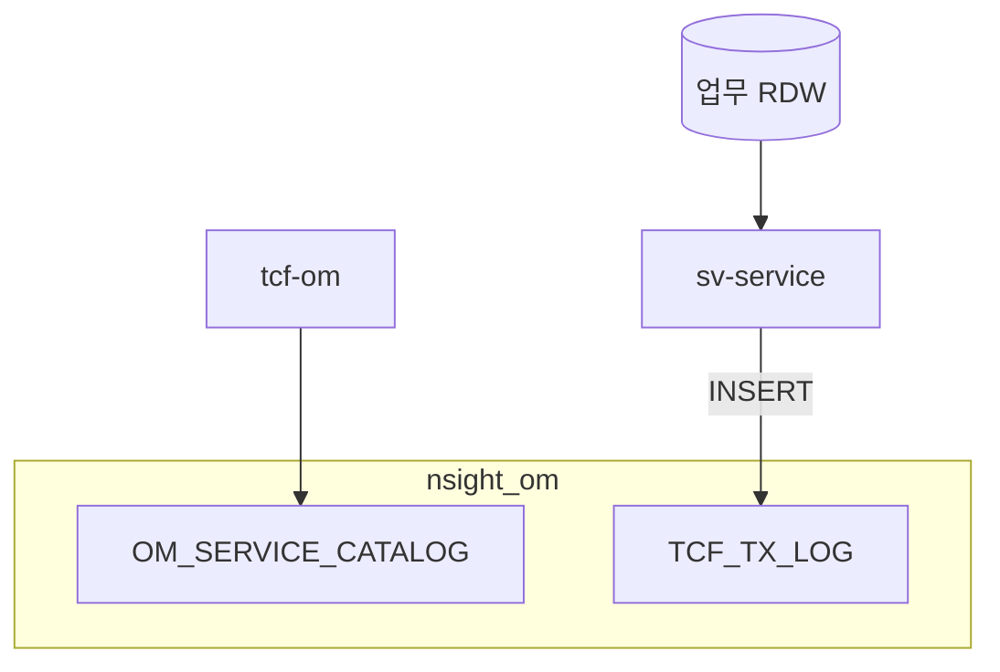

# 제18장. 데이터·DB 아키텍처

| 항목 | 내용 |
| --- | --- |
| **편** | 제5편 · 플랫폼·운영 관리 (OM) |
| **에디션** | **Master** — 아키텍트·시니어·플랫폼 |
| **기반 원본** | [ztcfbook/제05편/18-데이터-DB-아키텍처.md](../ztcfbook/제05편/18-데이터-DB-아키텍처.md) |
| **입문서** | [ztcfbook-m](../ztcfbook-m/README.md) |
| **장** | 제18장 |
| **파일** | `제05편/18-데이터-DB-아키텍처.md` |
| **상태** | Master Edition (ztcfbook-h) |
| **목차** | [00-목차](../00-목차.md) |

---

## 아키텍처 뷰



---

## Master 해설

RDW·ADW(업무), OMDB·nsight_om(H2 로컬), LOGDB(TCF_TX_LOG), SESSIONDB로 데이터stores가 분리됩니다. sv-service 등 업무 WAR는 RDW에 MyBatis DAO만 사용하며 JPA 업무 엔티티는 표준 밖입니다. OM 23테이블(schema.sql)은 Catalog·통제·Auth·공통코드·ErrorCode를 담습니다.

TCF_TX_LOG는 모든 WAR가 INSERT하는 cross-cutting table로, STF start·ETF end와 correlation guid가 핵심 컬럼입니다. Spring Session table은 SESSIONDB에 별도 존재합니다. application.yml datasource·profile은 tcf-cicd local/dev/prod SoT와 sync해야 합니다.

데이터 거버넌스·마스킹은 OM DataAuth Handler와 znsight-man 로그 기준에 따릅니다. Facade에서 RDW+OMDB 이중 datasource 트랜잭션은 2PC 없이 분리하는 것이 원칙입니다.

리뷰·운영: Hikari pool size, slow query on TxLog INSERT, H2→운영 DB migration script, PII mask in Mapper result. 장애 시 OMDB readonly fallback 정책(미구현 Gap)을 DR 문서에 명시하십시오.

---

## 구현 샘플 (코드베이스)

### schema.sql

```sql
-- OM Operation Management (local H2)

CREATE TABLE IF NOT EXISTS TCF_TX_LOG (
    LOG_ID VARCHAR(64) NOT NULL,
    TX_TIME VARCHAR(40) NOT NULL,
    BUSINESS_CODE VARCHAR(10),
    SERVICE_ID VARCHAR(100),
    TRANSACTION_CODE VARCHAR(50),
    GUID VARCHAR(64) NOT NULL,
    TRACE_ID VARCHAR(64),
    USER_ID VARCHAR(50),
    BRANCH_ID VARCHAR(20),
    RESULT_STATUS VARCHAR(20),
    RESULT_CODE VARCHAR(20),
    ERROR_CODE VARCHAR(50),
    ELAPSED_TIME_MS BIGINT,
    PRIMARY KEY (LOG_ID)
);

CREATE INDEX IF NOT EXISTS IDX_TCF_TX_GUID ON TCF_TX_LOG (GUID, TX_TIME DESC);
CREATE INDEX IF NOT EXISTS IDX_TCF_TX_SVC ON TCF_TX_LOG (SERVICE_ID, TX_TIME DESC);
CREATE INDEX IF NOT EXISTS IDX_TCF_TX_USER ON TCF_TX_LOG (USER_ID, TX_TIME DESC);

CREATE TABLE IF NOT EXISTS TCF_TRANSACTION_CONTROL (
    SERVICE_ID VARCHAR(100) NOT NULL,
    TRANSACTION_CODE VARCHAR(50) NOT NULL,
    BUSINESS_CODE VARCHAR(10) NOT NULL,
    SERVICE_NAME VARCHAR(200) NOT NULL,
    USER_ID VARCHAR(50) NOT NULL,
    CHANNEL_ID VARCHAR(30) NOT NULL,
    BRANCH_ID VARCHAR(30) NOT NULL,
    CONTROL_TYPE VARCHAR(20) NOT NULL DEFAULT 'FULL',
    BLOCK_YN CHAR(1) NOT NULL DEFAULT 'Y',
    PRIMARY KEY (
        SERVICE_ID,
        TRANSACTION_CODE,
        BUSINESS_CODE,
        SERVICE_NAME,
        USER_ID,
        CHANNEL_ID,
        BRANCH_ID
    )
);

CREATE INDEX IF NOT EXISTS IDX_TCF_TX_CTRL_USER ON TCF_TRANSACTION_CONTROL (USER_ID, CHANNEL_ID, BRANCH_ID);
CREATE INDEX IF NOT EXISTS IDX_TCF_TX_CTRL_SVC ON TCF_TRANSACTION_CONTROL (BUSINESS_CODE, SERVICE_ID, TRANSACTION_CODE);

CREATE TABLE IF NOT EXISTS OM_SERVICE_CATALOG (
    CATALOG_ID VARCHAR(64) NOT NULL,
    BUSINESS_CODE VARCHAR(10) NOT NULL,
    SERVICE_ID VARCHAR(100) NOT NULL,
    TRANSACTION_CODE VARCHAR(50) NOT NULL,
    PROCESSING_TYPE VARCHAR(20) NOT NULL,
    HANDLER_CLASS VARCHAR(200),
    AUTH_CODE VARCHAR(50),
    AUDIT_YN CHAR(1) DEFAULT 'N',
    TIMEOUT_SEC INT DEFAULT 5,
    USE_YN CHAR(1) DEFAULT 'Y',
    DESCRIPTION VARCHAR(500),
    PRIMARY KEY (CATALOG_ID)
```

원본: [`tcf-om/src/main/resources/schema.sql`](../tcf-om/src/main/resources/schema.sql)

### application.yml (sv)

```yaml
server:
  servlet:
    context-path: /
    encoding:
      charset: UTF-8
      enabled: true
      force: true
    session:
      timeout: 60m
      tracking-modes: cookie
      cookie:
        name: JSESSIONID
        path: /
        http-only: true
        secure: false
        same-site: Lax

spring:
  profiles:
    default: local
  datasource:
    driver-class-name: org.h2.Driver
    username: sa
    password:
    hikari:
      maximum-pool-size: 10
      minimum-idle: 2
      connection-timeout: 3000
      validation-timeout: 3000
      idle-timeout: 600000
      max-lifetime: 1800000
      keepalive-time: 300000
      auto-commit: false
  session:
    store-type: none
  transaction:
    default-timeout: 5

mybatis:
  mapper-locations:
```

원본: [`sv-service/src/main/resources/application.yml`](../sv-service/src/main/resources/application.yml)

---

## Master Deep Dive — 데이터·DB 아키텍처

- OM 23테이블 + Spring Session + TCF_TX_LOG
- 업무 RDW vs OM H2(local) 분리
- MyBatis DAO only — JPA 업무 사용 금지
- 마스킹·거버넌스 OM DataAuth

### 아키텍트 체크리스트

- 상단 **구현 샘플**을 실제 코드와 대조한다.
- **심화 참고**와 ztcfbook 본문 절 번호를 매핑한다.
- 운영·배포 관점은 ztcfbook-h Master 블록을 우선 본다.

---

## 심화 참고 (Master)

- [zarchitecture/09-데이터-DB-아키텍처.md](../zarchitecture/09-데이터-DB-아키텍처.md)
- [docs/architecture/19-tcf-table.md](../docs/architecture/19-tcf-table.md)

---

## 18.1 RDW · ADW · OMDB · LOGDB · SESSIONDB

NSIGHT TCF는 **DB 역할 분리** 원칙을 따른다. 업무 SQL, 운영 SQL, 세션 SQL, 로그 SQL, Gateway SQL, JWT SQL은 서로 다른 논리 DB·Connection Pool을 사용한다. DAO는 해당 Pool만 바라보며, Service에서 cross-DB join을 만들지 않는다.

| DB (논리) | 용도 | 로컬(H2) 예 |
| --- | --- | --- |
| RDW | 실시간 조회·Single View | 업무 WAR별 file DB |
| ADW | 분석·집계 (온라인 영향 분리) | (목표) |
| SESSIONDB | Spring Session, TCF_USER_SESSION | nsight_om 공유 |
| OMDB | 사용자, Catalog, 통제, 코드 | data/nsight-txlog/nsight_om |
| LOGDB | TCF_TX_LOG, OM_AUDIT_LOG | data/nsight-txlog |
| Gateway DB | TCF_GATEWAY_ROUTE, GW TX Log | data/gateway-route |
| JWT DB | Token, Refresh, Denylist | tcf-jwt schema |
| FILEDB | UD_FILE, UD_DOWNLOAD_LOG | OMDB 내 |

업무 개발자는 RDW(또는 업무 전용 schema)만 접근하고, OM 테이블을 업무 Mapper에서 직접 조회하지 않는다. STF가 OMDB·cache를 통해 Catalog·TC·Timeout을 조회하는 SPI는 tcf-web·tcf-core에 있다. Gateway `session-datasource`는 tcf-om과 **동일 SESSIONDB** URL이 필수이다.

운영 Oracle 전환 시 스키마·계정·Pool을 환경별 `tcf-cicd` profile과 `application-datasource.yml`로 분리한다. 로컬 H2 file path 충돌을 피하기 위해 WAR별 `./data/{bc}` 디렉터리를 사용한다.

Pool 분리는 장애 격리와 튜닝 독립성을 위해 필수이다. LOGDB insert burst가 RDW pool을 고갈시키지 않도록 ETF 로그 datasource는 별도 HikariCP bean을 사용한다. ADW는 OLAP·배치 집계 전용으로 목표 아키텍처에 포함되며, 온라인 RDW와 **물리 또는 논리 분리**를 유지한다.

```text
[업무 WAR]
  ├─ RDW Pool  → 고객·계약 조회 SQL
  ├─ LOG Pool  → (ETF 위임) TCF_TX_LOG
  └─ OM Pool   → (STF SPI) Catalog·TC read-only

[tcf-om]
  ├─ OMDB Pool → 마스터 CRUD
  ├─ SESSION Pool → SPRING_SESSION
  └─ LOG Pool   → TX·Audit 조회

[tcf-gateway]
  ├─ Gateway Pool → Route·GW log
  └─ SESSION Pool → 4단계 세션 (OM과 동일 URL)
```

---

## 18.2 TCF 핵심 테이블

플랫폼 통제·로그 테이블은 모든 업무 WAR STF·ETF·Gateway가 공유한다.

| 테이블 | 역할 | 조회 주체 |
| --- | --- | --- |
| OM_SERVICE_CATALOG | serviceId 마스터 | STF, OM |
| TCF_TRANSACTION_CONTROL | Header 7 거래통제 | STF |
| TCF_SERVICE_TIMEOUT_POLICY | serviceId별 timeout | STF, TimeoutExecutor |
| TCF_IDEMPOTENCY_KEY | 중복 방지 | STF |
| TCF_SERVICE_AUDIT_POLICY | 감사 대상 | STF, ETF |
| TCF_TX_LOG | 거래 마스터 | ETF, OM 조회 |
| TCF_TX_STEP_LOG | 단계별(S SQL ID) | ETF |
| TCF_ERROR_LOG | 시스템 오류 | ETF |
| TCF_GATEWAY_TX_LOG | Gateway Relay | GEF |

OM 사용자·권한: `OM_USER`, `OM_AUTH_GROUP`, `OM_MENU`, `OM_FUNCTION_AUTH`, `OM_DATA_AUTH`. 기준정보: `OM_COMMON_CODE`, `OM_ERROR_CODE`, `OM_SYSTEM_CONFIG`. Dashboard: `OM_AP_STATUS`, `OM_DB_STATUS`, `OM_SESSION_STATUS`, `OM_DEPLOY_STATUS`. 부록 L에 DDL 요약이 있다.

DDL 자동 생성: `TransactionControlSchemaInitializer`, `GatewayRouteSchemaInitializer` 등 profile/local에서 H2 schema를 초기화한다. 운영 Oracle은 `tcf-gateway/sql/oracle/`, docs/19 migration을 따른다.

`TCF_TX_LOG`와 `TCF_TX_STEP_LOG`는 guid·transactionId로 1:N 관계이다. Step log SQL ID는 MyBatis mapper statement id와 매칭되어 "어느 DAO 호출에서 지연·오류가 났는가"를 추적한다. Gateway log는 별도 테이블이지만 guid를 맞추면 End-to-End 추적이 가능하다.

세션·사용자 테이블:

| 테이블 | 용도 |
| --- | --- |
| SPRING_SESSION | Spring Session JDBC |
| TCF_USER_SESSION | NSIGHT 세션 레지스트리 |
| OM_USER | 사용자 마스터 |

---

## 18.3 MyBatis·DAO 패턴

데이터 접근은 **Service → DAO → @Mapper → XML/Annotation SQL** 4단이다. DAO·Mapper는 SQL만 담당하고 비즈니스 판단을 넣지 않는다. SQL ID는 `TCF_TX_STEP_LOG`와 연계되어 거래 단계 추적에 사용된다.

MyBatis 명명: Mapper interface `{Domain}Mapper`, XML `{Domain}Mapper.xml`, SQL id `{domain}{Action}` camelCase. 페이징은 공통 `PagingHelper`·`RowBounds` 또는 SQL 레벨 OFFSET/FETCH 패턴(매뉴얼 30장)을 따른다. Dynamic SQL은 `<if>`, `<choose>`로 null-safe하게 작성한다.

Connection Pool은 HikariCP이며 Pool **분리**가 원칙이다. RDW Pool, ADW Pool(목표), SESSION Pool, OM Pool(조회 SPI), LOG Pool을 datasource bean으로 나눈다. `@Transactional`은 Facade에 두고, DAO는 트랜잭션 경계 밖에서도 test 가능하게 유지한다.

업무 WAR Gradle 의존: `tcf-core`, `tcf-web`, `tcf-cache`(선택). Mapper scan package는 `{bc}.persistence.mapper` 표준. 로컬 테스트는 H2 in-memory 또는 file + `schema.sql`/`data.sql`로 재현한다. Oracle 전용 hint·페이징 syntax는 profile별 mapper 분리 또는 vendor databaseId를 사용한다.

DAO 레이어 규칙:

| 규칙 | 설명 |
| --- | --- |
| SQL만 | if/비즈니스 분기 금지 |
| `#{}` 바인딩 | SQL Injection 방지 |
| SQL ID = step log id | 추적 일관성 |
| Facade @Transactional | 다중 DAO 원자성 |
| cross-DB join 금지 | Service에서 2회 조회·조합 |

목록·페이징 조회는 Rule에서 filter DTO를 완성한 뒤 DAO에 전달한다. COUNT + LIST 이중 쿼리 패턴은 `PagingHelper`로 표준화한다(제23장).

---

## 18.4 데이터 거버넌스·마스킹

데이터 거버넌스는 **분류·보관·마스킹·접근 통제·삭제** 정책을 OM·업무·로그 전반에 적용한다. 고객식별정보(CI), 계좌번호, 연락처는 로그·응답·세션·파일에 평문 저장을 금지한다. ETF·감사로그에는 마스킹된 값 또는 해시만 남긴다.

`docs/architecture/47-data-governance.md` 기준: RDW는 운영 조회, ADW는 분석 목적 분리, LOGDB 보관 기간·아카이브, OM_AUDIT_LOG 불변성. 파일 업·다운로드(`UD_FILE`)는 OM File Handler와 바이러스 스캔·용량 한도·다운로드 감사(`UD_DOWNLOAD_LOG`)를 적용한다.

OM Data Auth로 지점·조직 범위를 SQL WHERE에 강제하지 않고 Rule·Service에서 SessionContext 기반 filter parameter를 DAO에 전달한다. SQL Injection 방지는 `#{}` 바인딩 필수, `${}`는 화이트리스트 컬럼만.

GDPR·개인정보법 대응: 삭제 요청 시 RDW soft delete + ADW anonymize + LOG retention 정책. DR 시 RPO/RTO는 업무 DB와 LOGDB를 다르게 설정(제20장). Gateway Route·JWT DB backup은 운영 전환 체크리스트 항목이다.

마스킹 예시(로그·응답):

| 필드 | 저장·로그 | 표시 |
| --- | --- | --- |
| 주민번호 | 해시 또는 마스킹 | `******-*******` |
| 계좌번호 | 뒤 4자리만 | `****-1234` |
| 휴대전화 | 중간 마스킹 | `010-****-5678` |

감사 정책(`TCF_SERVICE_AUDIT_POLICY`)에 등록된 serviceId는 ETF가 요청·응답 요약을 OM_AUDIT_LOG 또는 별도 audit store에 적재한다. 민감 필드는 마스킹 후 저장한다.

---

## 18.5 DB Migration·백업·운영

로컬 H2는 file DB lock으로 **단일 프로세스**만 write 가능하다. bootRun 여러 WAR가 동일 file URL을 쓰면 lock exception이 발생하므로 OM·LOG 공유 URL 설계를 문서화한다. ztomcat 단일 Tomcat은 lock 충돌이 적다.

운영 Oracle migration은 forward-only script를 CI/CD `deploy-stg` 전에 적용한다. Catalog·TC seed diff는 Git과 운영 DB drift 검사 job으로 자동화를 권장한다. 롤백 시 schema 호환성(컬럼 nullable·default)을 release note에 명시한다.

백업·DR:

| DB | RPO 목표(예) | 비고 |
| --- | --- | --- |
| RDW(업무) | 0~15분 | DR 센터 복제 |
| SESSIONDB | 재로그인 허용 | 세션 유실 가능 |
| LOGDB | 15분~1h | 거래는 지속 |
| OMDB | 0~15분 | Catalog·통제 SoT |
| Gateway Route | 배포 bundle | seed 재적재 |

정기 점검: HikariCP leak detection log, pool active/max ratio, slow query(Step log duration), H2→Oracle syntax drift in mapper XML. DB pool exhausted 장애 시 STF Timeout과 함께 급증하므로 OM Dashboard DB 탭과 correlation한다.

---

## 장 요약 (Master)

NSIGHT TCF DB는 RDW·OMDB·SESSIONDB·LOGDB·Gateway·JWT로 역할이 분리되고 Pool·DAO가 경계를 지킨다. TCF 핵심 테이블(Catalog·TC·Timeout·TX Log)은 STF·ETF·Gateway가 공유한다. MyBatis DAO 패턴과 SQL ID·페이징·트랜잭션 Facade 규칙을 따른다. 거버넌스·마스킹·Data Auth로 민감정보 노출을 줄인다.

> Master Edition: **아키텍처 뷰** → **Master 해설** → **구현 샘플** → **Master Deep Dive** → **심화 참고** 순으로 본문과 함께 읽는다.

---

## 이전 · 다음

| | |
| --- | --- |
| ← 이전 | [제17장 Batch · Scheduler · 이벤트](../제05편/17-Batch-Scheduler-이벤트.md) |
| → 다음 | [제19장 로컬 개발환경](../제06편/19-로컬-개발환경.md) |

---

## 출처 색인 · Master 확장

| 구분 | 경로 |
| --- | --- |
| ztcfbook-h | 본 파일 |
| ztcfbook | `../ztcfbook/제05편/18-데이터-DB-아키텍처.md` |

### 원본 출처


| 절 | 참고 문서 |
| --- | --- |
| 18.1 | [zarchitecture/09-데이터-DB-아키텍처.md](../../zarchitecture/09-데이터-DB-아키텍처.md), [zman/19-DB-테이블.md](../../zman/19-DB-테이블.md) |
| 18.2 | [docs/architecture/19-tcf-table.md](../../docs/architecture/19-tcf-table.md), [ztcfbook/부록/L-TCF-핵심-테이블-DDL-요약.md](../부록/L-TCF-핵심-테이블-DDL-요약.md) |
| 18.3 | [docs/architecture/07-DAO.md](../../docs/architecture/07-DAO.md), [docs/architecture/26-mybatis.md](../../docs/architecture/26-mybatis.md), [docs/architecture/27-paging.md](../../docs/architecture/27-paging.md) |
| 18.4 | [docs/architecture/47-data-governance.md](../../docs/architecture/47-data-governance.md), [znsight-man/44-파일-업다운로드-기준.md](../../znsight-man/44-파일-업다운로드-기준.md) |
| 18.5 | [docs/architecture/45-disaster-recovery.md](../../docs/architecture/45-disaster-recovery.md), [znsight-man/68-운영-전환-체크리스트.md](../../znsight-man/68-운영-전환-체크리스트.md) |
