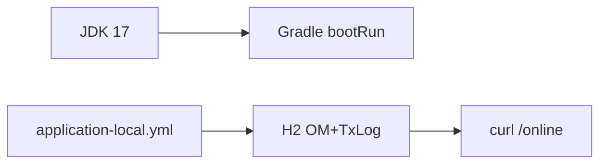

# 제19장. 로컬 개발환경

| 항목 | 내용 |
| --- | --- |
| **편** | 제6편 · 환경·빌드·배포 |
| **에디션** | **Master** — 아키텍트·시니어·플랫폼 |
| **기반 원본** | [ztcfbook/제06편/19-로컬-개발환경.md](../ztcfbook/제06편/19-로컬-개발환경.md) |
| **입문서** | [ztcfbook-m](../ztcfbook-m/README.md) |
| **장** | 제19장 |
| **파일** | `제06편/19-로컬-개발환경.md` |
| **상태** | Master Edition (ztcfbook-h) |
| **목차** | [00-목차](../00-목차.md) |

---

## 아키텍처 뷰



---

## Master 해설

JDK 21·Gradle·IDE·application-local.yml·H2(nsight_om+TxLog) 구성은 sv-service bootRun만으로도 STF~ETF·Handler·Mapper까지 검증 가능하게 설계되었습니다. tcf.session-validation-enabled=false, InMemory Idempotency는 속도와 운영 fidelity tradeoff입니다.

profile local/dev/prod와 application-tcf.yml fragment는 tcf-cicd가 SoT이며, sv-service/src/main/resources와 tcf-cicd/local/spring/sv-service/application-local.yml diff를 주기적으로 맞춥니다. seed-function-auth.sql로 로컬 권한 없이 막히는 문제를 줄입니다.

ztomcat 8080 ALL_MODULES는 Gateway·JWT·9 WAR·OM 통합 smoke용입니다. bootRun 단독 통과 ≠ ztomcat 통과이므로, 릴리즈 전 deploy-wars.sh와 curl-sv-sample.sh를 ztomcat 대상으로 실행하십시오.

온보딩 체크: Gradle wrapper, H2 console(필요 시), tcf-ui Relay URL, 포트 충돌(부록 K). application.yml에 secret hardening 금지. IDE run config active profile=local 확인.

---

## 구현 샘플 (코드베이스)

### application-local.yml

```yaml
# local - bootRun (port 8086)
server:
  port: 8086

spring:
  application:
    name: nsight-sv-service
  sql:
    init:
      mode: always
      schema-locations: classpath:schema.sql
      data-locations: classpath:data.sql
  datasource:
    url: jdbc:h2:mem:nsight_sv;MODE=Oracle;DB_CLOSE_DELAY=-1;DATABASE_TO_UPPER=false
    hikari:
      pool-name: nsight-sv-hikari-local
  h2:
    console:
      enabled: true

nsight:
  integration:
    default-timeout-ms: 3000
    services:
      IC:
        base-url: http://127.0.0.1:8082
        context-path: /ic
        online-path: /online
        connect-timeout-ms: 1000
        read-timeout-ms: 3000
  tcf:
    transaction-log-schema-auto-init: true
    transaction-control-datasource:
      url: jdbc:h2:file:${nsight.txlog.path:./data/nsight-txlog}/nsight_om;MODE=Oracle;AUTO_SERVER=TRUE;DATABASE_TO_UPPER=false
    transaction-log-datasource:
      url: jdbc:h2:file:${nsight.txlog.path:./data/nsight-txlog}/nsight_om;MODE=Oracle;AUTO_SERVER=TRUE;DATABASE_TO_UPPER=false
      username: sa
      password:
      driver-class-name: org.h2.Driver
```

원본: [`sv-service/src/main/resources/application-local.yml`](../sv-service/src/main/resources/application-local.yml)

### ztomcat README

```markdown
# ztomcat — NSIGHT 로컬 Tomcat WAR 배포

Spring Boot 3 **WAR** 12개를 **Apache Tomcat 10.1.34**에 올려 로컬에서 운영 환경과 동일한 context path로 테스트하기 위한 도구 모음입니다.

| 항목 | 값 |
|------|-----|
| Tomcat | 10.1.34 (Jakarta EE 10 / Servlet 6) |
| 포트 | **8080** (Tomcat), **9092** (H2 TCP — 공유 `nsight_om`) |
| JDK | **21 필수** (WAR가 Java 21로 빌드됨) |
| WAR 개수 | **12** (업무 9 + tcf-om + tcf-batch + tcf-ui) |
| Gradle | 8.x (`bootWar` 빌드) |

> WAR는 **JDK 21**로 컴파일됩니다. Tomcat을 JDK 18 등으로 기동하면 Spring Boot가 뜨지 않아 **`/sv/online` 404**가 납니다. `start.ps1` / `start.sh`가 JDK 21을 고정합니다.

---

## 목차

1. [빠른 시작](#1-빠른-시작)
2. [디렉터리 구조](#2-디렉터리-구조)
3. [스크립트 목록](#3-스크립트-목록)
4. [Tomcat 설치](#4-tomcat-설치)
5. [기동·중지](#5-기동중지)
6. [WAR 배포 (deploy-wars)](#6-war-배포-deploy-wars)
7. [배포 검증 (verify-deploy)](#7-배포-검증-verify-deploy)
8. [원클릭 재배포 (deploy-restart)](#8-원클릭-재배포-deploy-restart)
9. [설정 (UTF-8·JVM)](#9-설정-utf-8jvm)
10. [배포 URL·Context](#10-배포-urlcontext)
11. [ztomcat vs bootRun (tcf-ui · tcf-batch · tcf-om)](#11-ztomcat-vs-bootrun-tcf-ui--tcf-batch--tcf-om)
12. [트러블슈팅](#12-트러블슈팅)
13. [관련 문서](#13-관련-문서)

---

## 1. 빠른 시작

### Windows

```bat
cd ztomcat
```

원본: [`ztomcat/README.md`](../ztomcat/README.md)

---

## Master Deep Dive — 로컬 개발환경

- profile local/dev/prod — tcf-cicd SoT
- H2 + InMemory Idempotency + session skip
- bootRun 단독 vs ztomcat ALL_MODULES
- seed-function-auth.sql 로컬 권한

### 아키텍트 체크리스트

- 상단 **구현 샘플**을 실제 코드와 대조한다.
- **심화 참고**와 ztcfbook 본문 절 번호를 매핑한다.
- 운영·배포 관점은 ztcfbook-h Master 블록을 우선 본다.

---

## 심화 참고 (Master)

- [znsight-man/63-로컬-빌드-방법.md](../znsight-man/63-로컬-빌드-방법.md)
- [znsight-man/06-로컬-개발환경-구성.md](../znsight-man/06-로컬-개발환경-구성.md)
- [ztomcat/README.md](../ztomcat/README.md)

---

## 19.1 JDK·Gradle·DB·IDE 구성

NSIGHT TCF Framework는 단일 Spring Boot 앱이 아니라 **Gradle 멀티 모듈**이다. tcf-core, tcf-web, tcf-om, tcf-gateway, tcf-jwt, tcf-batch, tcf-ui, 9개 업무 WAR가 한 저장소에 있으며, 로컬 개발 목표는 소스 clone → build → bootRun → `POST /{businessCode}/online` → `TCF.process()` 흐름을 개발자 PC에서 재현하는 것이다.

표준 도구: JDK **Java 17 이상**(프로젝트는 Java 21 target), **Gradle Wrapper**(`gradlew`/`gradlew.bat`), IDE IntelliJ IDEA 또는 VS Code, Git, UTF-8, Timezone Asia/Seoul, Profile **local**. DB는 Local H2 file 또는 팀 Dev DB. SQL Tool(DBeaver 등), API 테스트(Postman·curl)를 함께 둔다.

필수 확인 명령:

| 순서 | 항목 | 확인 |
| --- | --- | --- |
| 1 | JDK | `java -version` |
| 2 | Git | `git --version` |
| 3 | Gradle | `gradlew -v` |
| 4 | IDE | Gradle import, 모듈 인식 |
| 5 | 빌드 | `gradlew clean build` |

Windows는 `gradlew.bat`, Linux/macOS는 `./gradlew`를 사용한다. 로컬에서 **운영 DB·운영 Secret·prd profile**을 직접 쓰지 않는다. 환경 분리와 운영 설정 보호가 개발환경 구성의 필수 원칙이다.

IDE import 후 Run Configuration에 모듈별 `*Application` main class를 등록한다. IntelliJ는 Gradle composite build로 전체 모듈 dependency graph를 인식해야 cross-module jump·refactor가 동작한다. `.idea`·`.vscode` local only 설정은 gitignore 대상이며, 팀 공유는 `tcf-cicd/local` profile과 README를 SoT로 한다.

로컬 디렉터리 준비:

```text
nsight-tcf-framework/
  ./data/nsight-txlog/     ← OM·LOG H2
  ./data/gateway-route/    ← Gateway H2
  ./data/sv/               ← sv-service RDW (예)
```

clone 직후 `gradlew clean build` 한 번으로 wrapper·dependency cache를 검증한다. corporate proxy 환경은 `gradle.properties` proxy 설정을 로컬 only file로 둔다.

---

## 19.2 application.yml·Profile

설정은 **profile별 분리**한다. local, dev, stg, prd는 `application-{profile}.yml`과 `tcf-cicd/{local,dev,prod}/` 외부 설정으로 나뉜다. 공통 템플릿은 부록 G application.yml 템플릿을 참고한다.

핵심 namespace:

| prefix | 모듈 | 예 |
| --- | --- | --- |
| nsight.tcf.* | tcf-core/web | session-validation, transaction-control |
| nsight.tcf.web.jwt.* | tcf-web | jwt enabled, jwk-set-uri |
| nsight.gateway.* | tcf-gateway | env-code, auth, route-table |
| nsight.batch.* | tcf-batch | startup-collect |
| spring.datasource.* | 각 WAR | H2 file URL |

로컬 bootRun 시 `spring.profiles.active=local`이 기본이다. datasource URL 예: OM/LOG `jdbc:h2:file:./data/nsight-txlog/nsight_om`, Gateway `jdbc:h2:file:./data/gateway-route`. H2 console은 local에서만 enable.

Secret(JWT private key, DB password)은 yaml 평문 대신 환경 변수·로컬 key file(.gitignore)을 사용한다. IDE Run Configuration에 `SPRING_PROFILES_ACTIVE=local`과 module별 main class(`*Application`)를 등록한다.

profile 전환 실수 방지: prod yaml을 local에 import하지 않는다. `nsight.gateway.auth.login-required=false`는 **local/dev 한정**이며 prod bundle에 포함되면 CI validate stage에서 fail 되도록 pipeline을 구성한다.

JWT 로컬 설정 예:

```yaml
nsight:
  gateway:
    auth:
      jwt:
        enabled: true
        jwk-set-uri: http://127.0.0.1:8110/.well-known/jwks.json
    env-code: LOCAL
  tcf:
    web:
      jwt:
        enabled: true
        jwk-set-uri: http://127.0.0.1:8110/.well-known/jwks.json
```

---

## 19.3 Spring/Tomcat/Apache 환경

로컬 **개발 실행 = Spring Boot bootRun**. **운영 실행 = WAR → Tomcat**. bootRun은 내장 Tomcat, 빠른 재기동, IDE 디버그에 유리하다. Tomcat WAR는 Apache 앞 multicontext, SSL, sticky, 운영과 동일 topology 검증에 유리하다.

로컬 포트 참고(bootRun):

| 모듈 | 포트 | Context |
| --- | --- | --- |
| tcf-ui | 8099 | / |
| tcf-gateway | 8100 | / |
| tcf-uj | 8102 | / |
| tcf-jwt | 8110 | / |
| tcf-om | 8097 | /om |
| tcf-batch | 8098 | /batch |
| sv-service | 8086 | /sv |
| ic-service | 8085 | /ic |
| … | zarchitecture/16 | … |

ztomcat 통합: **8080** 단일 Tomcat에 ui, uj, om, sv, … context로 배포. Gateway `/gw`는 deploy-wars 목록 확인 필요. Apache 로컬 simulation은 optional reverse proxy 설정(docs/23).

Spring Session JDBC, MyBatis, HikariCP pool size는 local에서 축소해도 되나 **구조는 운영과 동일**하게 유지한다. `server.servlet.session.timeout`, `spring.session.timeout` 60m 등.

bootRun vs ztomcat 선택:

| 목적 | 실행 방식 |
| --- | --- |
| Handler 디버그 | 단일 WAR bootRun |
| Context path·classloader | ztomcat 8080 |
| Gateway + uj smoke | gateway·uj bootRun 또는 ztomcat /gw |
| Apache sticky·SSL | optional local Apache |

여러 bootRun 동시 기동 시 포트 충돌을 zarchitecture/16 표로 확인한다. SESSIONDB 공유 URL을 쓰는 tcf-om·gateway·업무 WAR는 **동시 write** 가능하나 H2 file lock은 프로세스 간 배타적이다.

---

## 19.4 로컬 빌드·bootRun

전체 빌드: `gradlew clean build`. 단일 모듈: `gradlew :sv-service:bootRun`. 테스트 포함: `gradlew test`. Mapper 검증·Application Context test는 CI와 동일 gate를 로컬에서 먼저 통과시킨다.

업무 개발 일반 루프:

1. `:tcf-om:bootRun` (Catalog·TC·SESSIONDB)
2. `:sv-service:bootRun` (예)
3. `:tcf-ui:bootRun` (Relay UI)
4. 브라우저 또는 curl로 `POST http://localhost:8099/api/relay/sv/online`

Gateway·JWT 검증 루프: tcf-jwt → tcf-gateway → tcf-uj bootRun, Bearer 또는 Cookie 경로 테스트. tcf-scripts(zguide)에 로컬 기동·smoke shell이 있으면 팀 표준으로 사용한다.

bootRun 시 `./data/` H2 file lock 충돌 시 다른 프로세스 종료 또는 `./data` 백업 후 삭제. Gradle daemon memory `-Xmx`는 대형 multi-module build 시 IDE와 맞춘다.

curl smoke 예:

```bash
curl -X POST http://localhost:8099/api/relay/sv/online \
  -H "Content-Type: application/json" \
  -d @samples/sv-customer-inquiry.json
```

통합 검증 최소 기동 세트: `tcf-om` + 대상 업무 WAR + `tcf-ui`. JWT·Gateway 검증 시 `tcf-jwt`, `tcf-gateway`, `tcf-uj` 추가. Dashboard 검증 시 `tcf-batch` 추가.

---

## 19.5 ztomcat 8080 통합 검증

**ztomcat**은 로컬에서 운영에 가까운 **단일 Tomcat 8080** 통합 검증 환경이다. `ztomcat/README.md`의 deploy-wars, context path, shared lib 정책을 따른다. bootRun으로만 검증한 기능을 WAR 배포·context path·classloader 환경에서 재검증한다.

통합 검증 시나리오: OM login → UI Relay → sv 조회 → Gateway 경유(uj) → JWT OM Admin → batch Dashboard 데이터 → Gateway Route admin. Cookie domain/path, Set-Cookie Relay, session-datasource 공유를 Tomcat에서 확인한다.

bootRun vs Tomcat 차이 요약: 포트 분산 vs 8080 통합, embedded vs shared Tomcat, Gateway `/gw` 가용성, startup-collect delay, Actuator URL path(`/sv/actuator` vs `:8086/actuator`). 이중 배포 검증이 CI release gate에 포함되는 경우 ztomcat smoke를 pipeline stage로 올린다.

문제 해결: 404 context → WAR명·context 매핑표(부록 K). 401 Gateway → Route·session DB·JWT JWKS. Catalog 없음 → tcf-om 기동·data.sql. H2 lock → 단일 Tomcat instance only.

ztomcat smoke 체크리스트:

| # | 시나리오 | URL |
| --- | --- | --- |
| 1 | OM login | http://localhost:8080/ui/om/admin/login.html |
| 2 | sv Relay | http://localhost:8080/ui/api/relay/sv/online |
| 3 | uj Gateway | http://localhost:8080/uj/api/relay/sv/online |
| 4 | Actuator | http://localhost:8080/sv/actuator/health |
| 5 | batch run | POST http://localhost:8080/batch/jobs/ap-status/run |

WAR 배포 후 `gradlew :ztomcat:deployWars`(또는 README script)로 산출물을 복사한다. bootRun에서 수정한 코드는 **재bootWar·재배포** 없이는 ztomcat에 반영되지 않는다.

---

## 장 요약 (Master)

로컬 개발환경은 JDK·Gradle Wrapper·IDE·local profile·H2 file DB로 멀티 모듈 TCF 흐름을 재현한다. application.yml과 tcf-cicd profile로 환경을 분리하고 운영 Secret을 격리한다. 일상 개발은 bootRun, 통합·배포 검증은 ztomcat 8080 WAR를 사용한다. tcf-om + 업무 WAR + tcf-ui/gateway/jwt 조합으로 end-to-end smoke를 수행한다.

> Master Edition: **아키텍처 뷰** → **Master 해설** → **구현 샘플** → **Master Deep Dive** → **심화 참고** 순으로 본문과 함께 읽는다.

---

## 이전 · 다음

| | |
| --- | --- |
| ← 이전 | [제18장 데이터·DB 아키텍처](../제05편/18-데이터-DB-아키텍처.md) |
| → 다음 | [제20장 CI/CD · 릴리즈 · DR](../제06편/20-CICD-릴리즈-DR.md) |

---

## 출처 색인 · Master 확장

| 구분 | 경로 |
| --- | --- |
| ztcfbook-h | 본 파일 |
| ztcfbook | `../ztcfbook/제06편/19-로컬-개발환경.md` |

### 원본 출처


| 절 | 참고 문서 |
| --- | --- |
| 19.1 | [znsight-man/06-로컬-개발환경-구성.md](../../znsight-man/06-로컬-개발환경-구성.md) |
| 19.2 | [znsight-man/11-application-yml-기준.md](../../znsight-man/11-application-yml-기준.md), [docs/architecture/20-env-spring.md](../../docs/architecture/20-env-spring.md), [docs/architecture/25-env-profile.md](../../docs/architecture/25-env-profile.md), [ztcfbook/부록/G-application-yml-템플릿.md](../부록/G-application-yml-템플릿.md) |
| 19.3 | [docs/architecture/20-env-spring.md](../../docs/architecture/20-env-spring.md), [docs/architecture/21-env-tomcat.md](../../docs/architecture/21-env-tomcat.md), [docs/architecture/23-env-apache.md](../../docs/architecture/23-env-apache.md), [zarchitecture/16-모듈-포트-의존성-레퍼런스.md](../../zarchitecture/16-모듈-포트-의존성-레퍼런스.md) |
| 19.4 | [znsight-man/63-로컬-빌드-방법.md](../../znsight-man/63-로컬-빌드-방법.md), [zguide/tcf-scripts-개발가이드.md](../../zguide/tcf-scripts-개발가이드.md) |
| 19.5 | [ztomcat/README.md](../../ztomcat/README.md), [znsight-man/10-bootRun-Tomcat-WAR-차이.md](../../znsight-man/10-bootRun-Tomcat-WAR-차이.md) |
