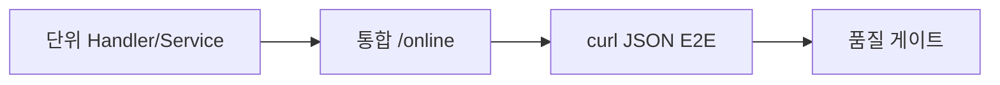

# 제21장. 테스트 전략

| 항목 | 내용 |
| --- | --- |
| **편** | 제7편 · 테스트·품질 보증 |
| **에디션** | **Master** — 아키텍트·시니어·플랫폼 |
| **기반 원본** | [ztcfbook/제07편/21-테스트-전략.md](../ztcfbook/제07편/21-테스트-전략.md) |
| **입문서** | [ztcfbook-m](../ztcfbook-m/README.md) |
| **장** | 제21장 |
| **파일** | `제07편/21-테스트-전략.md` |
| **상태** | Master Edition (ztcfbook-h) |
| **목차** | [00-목차](../00-목차.md) |

---

## 아키텍처 뷰



---

## Master 해설

테스트 3층( Handler/Service 단위 → /online 통합 → curl JSON E2E )은 STF~ETF 포함 여부를 명시적으로 요구합니다. MockMvc Controller 테스트는 Online Endpoint 아키텍처와 맞지 않으므로 TCF.process 또는 @SpringBootTest + OnlineTransactionController 호출 패턴을 씁니다.

MyBatis SQL·보안·성능·장애 테스트는 MR 품질 게이트(znsight-man 57~60)와 연동됩니다. sv-sample-inquiry.json·curl-sv-sample.sh는 회귀 테스트 artifact로 tcf-scripts에 유지합니다.

부록 H·I 체크리스트는 "테스트 evidence 없는 MR 승인 금지" Blocker로 사용할 수 있습니다. Idempotency·Timeout·거래통제 negative case는 E2E에서 필수입니다.

아키텍트 리뷰: 통합 테스트가 TransactionControlService mock 없이 OM H2 seed를 쓰는지, TxLog assertion, Gateway path smoke(optional CI stage). 커버리지 숫자보다 Catalog·통제 등록 E2E 통과가 출시 기준입니다.

---

## 구현 샘플 (코드베이스)

### sv-sample-inquiry.json

```json
{
  "header": {
    "systemId": "NSIGHT-MP",
    "businessCode": "SV",
    "serviceId": "SV.Sample.inquiry",
    "serviceName": "SV 샘플 조회",
    "transactionCode": "SV-INQ-0001",
    "processingType": "INQUIRY",
    "guid": "",
    "traceId": "",
    "channelId": "WEBTOP",
    "userId": "U123456",
    "branchId": "001234",
    "centerId": "DC1",
    "requestTime": "2026-06-14T10:30:00+09:00",
    "transactionIntime": "2026-06-14T10:30:00+09:00",
    "transactionOuttime": "",
    "systemDate": "20260614",
    "bizDate": "20260614",
    "clientIp": "10.10.10.10"
  },
  "body": {
    "pageNo": 1,
    "pageSize": 10,
    "sampleKey": "A00"
  }
}
```

원본: [`tcf-ui/src/main/resources/sample-requests/sv-sample-inquiry.json`](../tcf-ui/src/main/resources/sample-requests/sv-sample-inquiry.json)

### curl-sv-sample.sh

```shell
#!/usr/bin/env bash
set -euo pipefail
cd "$(dirname "$0")"
exec ./curl-sample.sh sv

```

원본: [`tcf-scripts/curl-sv-sample.sh`](../tcf-scripts/curl-sv-sample.sh)

---

## Master Deep Dive — 테스트 전략

- Handler 단위 + /online 통합 + curl E2E 3층
- STF~ETF 포함 통합 테스트 권장
- SQL·보안·성능 테스트 MR 게이트
- 부록 H·I 체크리스트와 연계

### 아키텍트 체크리스트

- 상단 **구현 샘플**을 실제 코드와 대조한다.
- **심화 참고**와 ztcfbook 본문 절 번호를 매핑한다.
- 운영·배포 관점은 ztcfbook-h Master 블록을 우선 본다.

---

## 심화 참고 (Master)

- [docs/architecture/50-test-architecture.md](../docs/architecture/50-test-architecture.md)
- [znsight-man/56-TCF-거래-테스트-기준.md](../znsight-man/56-TCF-거래-테스트-기준.md)
- [znsight-man/부록H-개발-완료-체크리스트.md](../znsight-man/부록H-개발-완료-체크리스트.md)

---

## 21.1 테스트 아키텍처 개요

NSIGHT TCF에서 테스트는 "코드가 실행되는가"를 넘어 **serviceId 단위 거래가 표준 전문·거래로그·오류코드와 정합하는가**를 검증하는 품질 체계입니다. TCF는 REST API가 아니라 `POST /{업무코드}/online`으로 들어오는 표준 전문을 STF → Dispatcher → Handler → ETF 파이프라인으로 처리하므로, 테스트 설계도 이 흐름을 중심으로 잡아야 합니다.

### 테스트 피라미드

NSIGHT TCF는 아래 피라미드를 목표로 합니다.

```text
                    ┌─────────────┐
                    │  Smoke/E2E  │  배포 후·릴리즈 전 (대표 serviceId)
                    ├─────────────┤
                    │  통합/거래   │  MockMvc, RestAssured, tcf-ui
                    ├─────────────┤
                    │ Mapper/SQL  │  H2 Test DB, SQL 실행계획
                    ├─────────────┤
                    │  단위 테스트 │  JUnit 5 + Mockito (다수)
                    └─────────────┘
```

| 층 | 비율(목표) | 실행 시점 | 핵심 질문 |
| --- | --- | --- | --- |
| 단위 | 70% 이상 | 개발 중·MR·CI | 각 계층이 자기 책임만 수행하는가? |
| Mapper/SQL | 10% | Mapper 변경 시 | SQL ID·파라미터·결과 매핑이 맞는가? |
| 통합·거래 | 15% | 기능 완료·develop merge | TCF End-to-End로 정상 응답·로그가 남는가? |
| Smoke/E2E | 5% | ztomcat·스테이징·배포 후 | 대표 거래가 살아 있는가? |

### TCF 거래 테스트 vs 일반 통합 테스트

| 구분 | 통합 테스트 | TCF 거래 테스트 |
| --- | --- | --- |
| 검증 단위 | 기능·API | **serviceId 1건** |
| 핵심 검증 | body·DB 결과 | `resultCode`, `guid`, `TCF_TX_LOG` |
| 도구 | MockMvc | MockMvc + OM 거래로그 + tcf-ui |

> **핵심 문장:** NSIGHT TCF 테스트는 **serviceId 단위 거래**가 중심이다. 단위 테스트는 계층 책임을, 통합·Smoke는 `TCF.process()` End-to-End와 `TCF_TX_LOG` 정합을 검증한다.

### 테스트 환경 계층

| 환경 | DB | 용도 |
| --- | --- | --- |
| 로컬 단위 | Mock / 없음 | Handler·Service·Rule |
| 로컬 Mapper | H2 (file/mem) | SQL·페이징 |
| bootRun 통합 | H2 또는 dev DB | WAR 내 E2E |
| ztomcat | dev/stg DB | Tomcat WAR 배포 검증 |
| 스테이징 | stg DB | Smoke·성능·보안 |

---

## 21.2 단위·통합·TCF 거래 테스트

### 단위 테스트 기준

단위 테스트는 **Spring Context를 가급적 띄우지 않고**, JUnit 5 + Mockito + AssertJ로 계층별 책임을 검증합니다.

| 구분 | 기준 |
| --- | --- |
| 테스트 대상 | Handler, Facade, Service, Rule, DAO, Mapper, 공통 유틸 |
| DB 접근 | 단위에서는 Mock — 실제 DB는 Mapper 통합 테스트로 분리 |
| HTTP 호출 | 단위가 아닌 Controller/Gateway 통합 테스트로 분리 |
| ServiceId 검증 | Handler 또는 Dispatcher 테스트에서 수행 |
| 오류코드 | `BusinessException`, `SystemException`, 표준 오류코드 매핑 확인 |

#### 계층별 단위 테스트 책임

| 계층 | 검증 포인트 |
| --- | --- |
| **Handler** | ServiceId 매핑, Body→DTO 변환, Facade 호출, 예외→표준 오류 변환 |
| **Facade** | Service 호출 순서, `@Transactional` 경계(통합에서), 예외 전파 |
| **Service** | Rule/DAO/Client 조합, 정상·오류 분기 |
| **Rule** | 입력값 검증, 계산·상태 판단, `BusinessException` 발생 조건 |
| **DAO** | Mapper 메서드 호출, 파라미터 전달 |
| **Mapper** | SQL ID, 파라미터 바인딩, ResultMap (H2 Test DB) |

Handler 테스트 예시 개념:

```java
@ExtendWith(MockitoExtension.class)
class SvCustomerSummaryHandlerTest {
    @Mock SvCustomerFacade facade;
    @InjectMocks SvCustomerSummaryHandler handler;

    @Test
    void selectSummary_정상() {
        var req = buildRequest("SV.Customer.selectSummary", Map.of("customerId", "C001"));
        when(facade.selectSummary(any())).thenReturn(new SummaryResponse(...));

        var result = handler.doHandle(req, ctx);

        verify(facade).selectSummary(argThat(d -> "C001".equals(d.getCustomerId())));
        assertThat(result).isNotNull();
    }
}
```

### 통합 테스트

통합 테스트는 **Spring Context를 기동**하고 MockMvc 또는 TestRestTemplate로 `POST /{bc}/online`을 호출합니다.

| 항목 | 기준 |
| --- | --- |
| Profile | `test` 또는 `local` + H2 |
| Header | 표준 Header 7항 + serviceId·businessCode·channelId |
| 검증 | HTTP 200, `result.resultCode`, body 필드, DB 변경(등록·변경 시) |
| 롤백 | `@Transactional` + `@Rollback` 또는 `@Sql`로 데이터 격리 |

### TCF 거래 테스트

TCF 거래 테스트는 통합 테스트에 **TCF 공통 후처리 검증**을 추가합니다.

| 검증 항목 | 기준 |
| --- | --- |
| `resultCode` | `0000`(정상) 또는 정의된 Business 오류코드 |
| `guid` | 응답 Header에 GUID 존재, MDC와 일치 |
| `TCF_TX_LOG` | PROCESSING → SUCCESS/FAIL 상태 전이 |
| Timeout | 정책 초과 시 Timeout 오류코드 |
| 거래통제 | 미등록 serviceId 차단 |
| 감사로그 | 감사 대상 거래 시 AUDIT_LOG 기록 |

실행 예:

```bash
gradle :sv-service:test --tests "*TransactionIntegrationTest"
curl -X POST http://127.0.0.1:8086/sv/online \
  -H "Content-Type: application/json" \
  -d @tcf-ui/src/main/resources/sample-requests/sv-sample-inquiry.json
```

tcf-ui Relay를 통한 수동 검증도 TCF 거래 테스트의 일부로 인정합니다.

---

## 21.3 MyBatis SQL·보안·성능·장애 테스트

### MyBatis·SQL 테스트

| 유형 | 도구 | 검증 |
| --- | --- | --- |
| Mapper 단위 | H2 + `@MybatisTest` | SQL ID, 파라미터, ResultMap |
| SQL 실행계획 | EXPLAIN (dev DB) | Full Scan, Index 사용 |
| 페이징 | count + list 2쿼리 | offset·limit, totalCount |
| 동적 SQL | `<if>`, `<choose>` | 조건별 SQL 생성 |

SQL 테스트 체크리스트:

- SQL ID가 `{Domain}Mapper.{verb}{Entity}` 명명규칙을 따르는가
- `#{}` 바인딩 사용 — `${}`는 금지(동적 ORDER BY 예외는 화이트리스트)
- SELECT * 지양, 필요 컬럼만 조회
- 대량 조회 시 페이징·Timeout 적용

### 보안 테스트

| 영역 | 시나리오 |
| --- | --- |
| 인증 | 세션 없음·만료 → 401/표준 오류 |
| 권한 | 기능권한 없음 → BusinessException |
| 거래통제 | Header 7항 위변조·미등록 serviceId 차단 |
| JWT | tcf-gateway 경유 시 Token 만료·폐기 |
| 입력값 | SQL Injection, XSS 패턴 입력 |
| 마스킹 | 응답·로그에서 주민번호·계좌번호 마스킹 |
| Secret | application.yml에 평문 Secret 없음 |

### 성능 테스트

목표 SLA(설계 기준): TPS 720, P95 3초, 가용성 99.99%.

| 항목 | 기준 |
| --- | --- |
| 대상 | 주요 serviceId(조회·목록·등록) |
| 환경 | perf DB, ztomcat 또는 stg |
| 지표 | TPS, P50/P95/P99, Error Rate |
| DB | Connection Pool, Slow Query |
| Timeout | 정책값 대비 실측 |

성능 테스트는 릴리즈 전 **대표 거래 3~5건**을 선정해 회귀합니다.

### 장애 테스트

| 시나리오 | 기대 동작 |
| --- | --- |
| DB 장애 | Connection 실패 → SystemException, PROCESSING→FAIL |
| Timeout 초과 | `OnlineTransactionTimeoutExecutor` → Timeout 오류 |
| tcf-eai 대상 WAR 다운 | Circuit·재시도·Fallback(정의 시) |
| 트랜잭션 롤백 | 등록·변경 실패 시 데이터 미반영 |
| Cache Evict 실패 | DB Fallback, 오류 로그 |

Chaos Engineering(의도적 Pod Kill, Network Delay)은 P2 이후 목표입니다.

---

## 21.4 코드 리뷰·품질 게이트

### 코드 리뷰

코드 리뷰는 MR/PR 단위로 수행하며, **표준 구조·계층 책임·운영 추적성**을 확인합니다.

| 구분 | 기준 |
| --- | --- |
| 리뷰 단위 | Merge Request / Pull Request |
| 필수 대상 | Handler, Facade, Service, Rule, DAO, Mapper, XML, Config, Test |
| 추적성 | ServiceId → Handler → SQL ID → 거래로그 GUID |
| 자동 검증 | Build, Test, Checkstyle, PMD, SonarQube, Secret Scan |
| 승인 | Blocker/Critical 0건, Major 조치 또는 승인, CI 통과 |
| 반려 | 컴파일·테스트 실패, 계층 위반, SQL Injection 위험, Secret 노출 |

리뷰 10대 원칙:

1. **표준 우선** — 개인 취향보다 NSIGHT 6계층 구조
2. **책임 경계** — Rule에 SQL 없음, Handler에 업무 로직 없음
3. **운영 추적성** — GUID, ServiceId, SQL ID로 장애 추적 가능
4. **Controller 금지** — `/online`은 tcf-web 공통
5. **WAR 간 직접 참조 금지** — tcf-eai 사용
6. **오류코드 표준** — `E-{DOMAIN}-{CATEGORY}-{NNNN}`
7. **로그 민감정보** — 마스킹·레벨 준수
8. **테스트 동반** — 신규 Handler·Rule에 단위 테스트
9. **SQL 검증** — Mapper Test 또는 EXPLAIN
10. **설정 분리** — Secret은 환경 변수·Vault

상세 체크리스트는 [부록 I](../부록/I-코드-리뷰-체크리스트.md)를 참고합니다.

### 품질 게이트 (CI/CD)

| Gate | 시점 | 통과 조건 |
| --- | --- | --- |
| G1 Compile | Push | 컴파일 성공 |
| G2 Unit Test | MR | 단위 테스트 100% 통과, 커버리지 하한(팀 정책) |
| G3 Static Analysis | MR | SonarQube Quality Gate, Critical 0 |
| G4 Integration | develop merge | 통합·TCF 거래 테스트 통과 |
| G5 Smoke | 배포 후 | 대표 serviceId curl/UI 성공 |
| G6 Health | 배포 후 | Liveness/Readiness OK |

품질 Gate 실패 시 **배포 차단**이 원칙입니다. 조건부 승인은 아키텍트·QA 합의 후에만 허용합니다.

---

## 21.5 개발 완료·운영 전환 체크리스트

### 개발 완료 체크리스트 (부록 H 요약)

거래 1건 개발 완료 시 아래를 확인합니다.

| 영역 | 확인 항목 |
| --- | --- |
| 설계 | ServiceId·거래코드·화면번호 OM 등록 |
| 구현 | Handler→Facade→Service→Rule→DAO 6계층 준수 |
| Header | 7항 Allow-List, businessCode·channelId 정합 |
| Timeout | OM TimeoutPolicy 등록 |
| 오류 | BusinessException + 표준 오류코드 |
| 로그 | GUID, ServiceId, MDC, 감사 대상 시 AUDIT |
| SQL | Mapper Test, EXPLAIN, 페이징(count+list) |
| 테스트 | 단위 + 통합 + TCF 거래 테스트 |
| 문서 | 거래 설계서·변경 이력 |

### 운영 전환 체크리스트 (부록 J 요약)

릴리즈·운영 반영 전:

| 영역 | 확인 항목 |
| --- | --- |
| OM | Service Catalog, 거래통제, Timeout, 오류코드, 공통코드 |
| 배포 | WAR 빌드, ztomcat/stg 검증, Rolling 절차 |
| CI/CD | Pipeline Green, Rollback 스크립트 |
| DB | DDL·DML 반영, RDW/ADW 분리 |
| 보안 | JWT·세션·권한 stg 검증 |
| 모니터링 | 헬스체크, 대시보드, 알람 |
| DR | 백업·복구 절차, SESSIONDB JDBC |
| Smoke | 대표 serviceId 5건 이상 성공 |
| Runbook | 장애 대응·FAQ, 담당자 RACI |

---

## 장 요약 (Master)

NSIGHT TCF 테스트는 **serviceId 단위 거래**를 중심으로 피라미드를 구성합니다. 단위 테스트(70%+)는 계층 책임을 Mock으로 검증하고, Mapper/SQL·통합·TCF 거래 테스트는 H2·MockMvc·거래로그로 End-to-End 정합을 확인합니다. 보안·성능·장애 테스트는 인증·Timeout·DB 장애 시나리오를 포함하며, CI/CD 품질 Gate와 코드 리뷰가 MR 승인·배포의 관문입니다. 개발 완료(부록 H)와 운영 전환(부록 J) 체크리스트로 OM 등록·Smoke·DR까지 일관되게 마무리합니다.

> Master Edition: **아키텍처 뷰** → **Master 해설** → **구현 샘플** → **Master Deep Dive** → **심화 참고** 순으로 본문과 함께 읽는다.

---

## 이전 · 다음

| | |
| --- | --- |
| ← 이전 | [제20장 CI/CD · 릴리즈 · DR](../제06편/20-CICD-릴리즈-DR.md) |
| → 다음 | [제22장 조회 거래 (SV 고객요약)](../제08편/22-조회-거래-SV-고객요약.md) |

---

## 출처 색인 · Master 확장

| 구분 | 경로 |
| --- | --- |
| ztcfbook-h | 본 파일 |
| ztcfbook | `../ztcfbook/제07편/21-테스트-전략.md` |

### 원본 출처


| 절 | 출처 |
| --- | --- |
| 21.1 | [docs/architecture/50-test-architecture.md](../../docs/architecture/50-test-architecture.md) |
| 21.2 | [znsight-man/54-단위-테스트-기준.md](../../znsight-man/54-단위-테스트-기준.md), [55-통합-테스트-기준.md](../../znsight-man/55-통합-테스트-기준.md), [56-TCF-거래-테스트-기준.md](../../znsight-man/56-TCF-거래-테스트-기준.md) |
| 21.3 | [znsight-man/57-MyBatis-SQL-테스트-기준.md](../../znsight-man/57-MyBatis-SQL-테스트-기준.md), [58-보안-테스트-기준.md](../../znsight-man/58-보안-테스트-기준.md), [59-성능-테스트-기준.md](../../znsight-man/59-성능-테스트-기준.md), [60-장애-테스트-기준.md](../../znsight-man/60-장애-테스트-기준.md) |
| 21.4 | [znsight-man/61-코드-리뷰-기준.md](../../znsight-man/61-코드-리뷰-기준.md), [62-품질-게이트-기준.md](../../znsight-man/62-품질-게이트-기준.md), [부록I-코드-리뷰-체크리스트.md](../../znsight-man/부록I-코드-리뷰-체크리스트.md) |
| 21.5 | [부록H-개발-완료-체크리스트.md](../../znsight-man/부록H-개발-완료-체크리스트.md), [부록J-운영-전환-체크리스트.md](../../znsight-man/부록J-운영-전환-체크리스트.md) |
