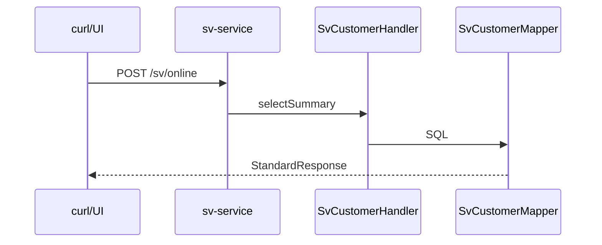

# 제22장. 조회 거래 (SV 고객요약)

| 항목 | 내용 |
| --- | --- |
| **편** | 제8편 · 실습 — End-to-End 샘플 |
| **에디션** | **Master** — 아키텍트·시니어·플랫폼 |
| **기반 원본** | [ztcfbook/제08편/22-조회-거래-SV-고객요약.md](../ztcfbook/제08편/22-조회-거래-SV-고객요약.md) |
| **입문서** | [ztcfbook-m](../ztcfbook-m/README.md) |
| **장** | 제22장 |
| **파일** | `제08편/22-조회-거래-SV-고객요약.md` |
| **상태** | Master Edition (ztcfbook-h) |
| **목차** | [00-목차](../00-목차.md) |

---

## 아키텍처 뷰



---

## Master 해설

SV.Customer.selectSummary는 nsight-tcf-framework 표준 실습 거래로, POST /sv/online → SvCustomerHandler → SvCustomerFacade → SvCustomerMapper → StandardResponse까지 E2E 교재 역할을 합니다. ServiceId·거래코드·JSON sample·OM Catalog row가 서로 reference implementation입니다.

조회 processingType(INQUIRY)은 @Transactional(readOnly=true) Facade와 count 없는 단건/요약 SQL 패턴을 보여줍니다. STF~ETF 전 구간이 실행되므로 curl 한 번으로 TxLog·Header echo·result.success 검증이 가능합니다.

OM 등록(Catalog·통제·Timeout) 없이 Handler만 있으면 STF 7단 또는 Dispatcher에서 실패합니다. tcf-ui Relay로 UI에서 동일 JSON 재현 시 channelId·session cookie 이슈를 분리 테스트할 수 있습니다.

실습 확장 시 ic-service 연동·Gateway 경유·JWT Bearer를 단계별로 추가하며 회귀하십시오. 코드 리뷰 baseline으로 SvCustomer* 파일 구조를 다른 BC에 복제할 때 diff가 최소화되도록 하십시오.

---

## 구현 샘플 (코드베이스)

### SvCustomerHandler

```java
package com.nh.nsight.marketing.sv.entry.handler;

import com.nh.nsight.marketing.sv.entry.facade.SvCustomerFacade;
import com.nh.nsight.tcf.core.support.context.TransactionContext;
import com.nh.nsight.tcf.core.support.error.BusinessException;
import com.nh.nsight.tcf.core.support.error.ErrorCode;
import com.nh.nsight.tcf.core.support.message.StandardRequest;
import com.nh.nsight.tcf.core.support.transaction.TransactionHandler;
import java.util.Collection;
import java.util.List;
import java.util.Map;
import org.springframework.stereotype.Component;

/**
 * SV 고객 도메인 핸들러. SV.Customer.* 거래를 한 핸들러가 처리한다(Service 도메인당 1개).
 */
@Component
public class SvCustomerHandler implements TransactionHandler {

    private static final String SELECT_SUMMARY = "SV.Customer.selectSummary";

    private final SvCustomerFacade facade;

    public SvCustomerHandler(SvCustomerFacade facade) {
        this.facade = facade;
    }

    @Override
    public Collection<String> serviceIds() {
        return List.of(SELECT_SUMMARY);
    }

    @Override
    public Object doHandle(StandardRequest<Map<String, Object>> request, TransactionContext context) {
        String serviceId = context.getHeader().getServiceId();
        return switch (serviceId) {
            case SELECT_SUMMARY -> facade.selectCustomerSummary(request.getBody(), context);
            default -> throw new BusinessException(ErrorCode.SERVICE_NOT_FOUND,
                    "SvCustomerHandler 미지원 serviceId: " + serviceId);
        };
    }
}

```

원본: [`sv-service/src/main/java/com/nh/nsight/marketing/sv/entry/handler/SvCustomerHandler.java`](../sv-service/src/main/java/com/nh/nsight/marketing/sv/entry/handler/SvCustomerHandler.java)

### SvCustomerMapper.xml

```xml
<?xml version="1.0" encoding="UTF-8" ?>
<!DOCTYPE mapper
        PUBLIC "-//mybatis.org//DTD Mapper 3.0//EN"
        "https://mybatis.org/dtd/mybatis-3-mapper.dtd">
<mapper namespace="com.nh.nsight.marketing.sv.persistence.mapper.SvCustomerMapper">

    <!--
      운영(RDW)에서는 RDW_CUSTOMER + 잔액/여신/상품/거래 요약 테이블 LEFT JOIN.
      로컬(H2)에서는 단일 SV_CUSTOMER 테이블로 동일 응답 컬럼을 제공.
      SQL_ID: SV.Customer.selectSummary
    -->
    <select id="selectCustomerSummary"
            parameterType="com.nh.nsight.marketing.sv.application.dto.customer.CustomerSummaryCriteria"
            resultType="com.nh.nsight.marketing.sv.persistence.dto.customer.CustomerSummaryRow"
            timeout="3">
        /* SQL_ID: SV.Customer.selectSummary */
        SELECT
              CUSTOMER_NO            AS customerNo
            , CUSTOMER_NAME          AS customerName
            , CUSTOMER_GRADE         AS customerGrade
            , BRANCH_CODE            AS branchCode
            , BRANCH_NAME            AS branchName
            , TOTAL_BALANCE          AS totalBalance
            , LOAN_BALANCE           AS loanBalance
            , PRODUCT_COUNT          AS productCount
            , LAST_TRANSACTION_DATE  AS lastTransactionDate
          FROM SV_CUSTOMER
         WHERE CUSTOMER_NO = #{customerNo}
    </select>

</mapper>

```

원본: [`sv-service/src/main/resources/mapper/sv/SvCustomerMapper.xml`](../sv-service/src/main/resources/mapper/sv/SvCustomerMapper.xml)

### curl JSON

```json
{
  "header": {
    "systemId": "NSIGHT-MP",
    "businessCode": "SV",
    "serviceId": "SV.Sample.inquiry",
    "serviceName": "SV 샘플 조회",
    "transactionCode": "SV-INQ-0001",
    "processingType": "INQUIRY",
    "guid": "",
    "traceId": "",
    "channelId": "WEBTOP",
    "userId": "U123456",
    "branchId": "001234",
    "centerId": "DC1",
    "requestTime": "2026-06-14T10:30:00+09:00",
    "transactionIntime": "2026-06-14T10:30:00+09:00",
    "transactionOuttime": "",
    "systemDate": "20260614",
    "bizDate": "20260614",
    "clientIp": "10.10.10.10"
  },
  "body": {
    "pageNo": 1,
    "pageSize": 10,
    "sampleKey": "A00"
  }
}
```

원본: [`tcf-ui/src/main/resources/sample-requests/sv-sample-inquiry.json`](../tcf-ui/src/main/resources/sample-requests/sv-sample-inquiry.json)

---

## Master Deep Dive — SV 고객요약 조회 실습

- `SV.Customer.selectSummary` — 표준 실습 거래
- E2E: JSON → Handler → Facade → Mapper
- OM Catalog·통제·Timeout 등록 필수
- tcf-ui Relay로 UI 테스트

### 아키텍트 체크리스트

- 상단 **구현 샘플**을 실제 코드와 대조한다.
- **심화 참고**와 ztcfbook 본문 절 번호를 매핑한다.
- 운영·배포 관점은 ztcfbook-h Master 블록을 우선 본다.

---

## 심화 참고 (Master)

- [znsight-man/71-SV-고객요약조회-샘플.md](../znsight-man/71-SV-고객요약조회-샘플.md)
- [zguide/sv-service-개발가이드.md](../zguide/sv-service-개발가이드.md)
- [zman/22-업무서비스샘플.md](../zman/22-업무서비스샘플.md)

---

## 22.1 요건·ServiceId·거래코드

본 장은 NSIGHT TCF에서 **조회 거래**를 처음부터 끝까지 구현하는 End-to-End 실습입니다. 샘플로 **SV(Single View) 고객요약조회**를 사용합니다. 이 거래는 업무 개발자가 복제·변형할 수 있는 **표준 참조 구현**으로 정의되어 있습니다.

### 거래 정의

| 항목 | 값 |
| --- | --- |
| 업무코드 | SV |
| Context Path | `/sv` |
| Endpoint | `POST /sv/online` |
| ServiceId | `SV.Customer.selectSummary` |
| 거래코드 | `SV-INQ-0001` |
| 거래명 | 고객 요약 조회 |
| 처리유형 | 조회 (INQ) |
| DB | RDW |
| Timeout | 3초 |
| 감사로그 | Y |
| 배포 단위 | `sv.war` |
| 구현 모듈 | `sv-service` |

### 핵심 원칙

1. **Controller를 만들지 않는다** — `/online` 진입은 tcf-web이 담당합니다.
2. **Handler = 도메인(application Service)당 1개** — `serviceIds()` + `switch`로 분기합니다.
3. **트랜잭션은 Facade** — 조회도 `@Transactional(readOnly = true)`를 권장합니다.
4. **업무 검증은 Rule** — customerId 필수·형식 검증.
5. **DB 접근은 DAO/Mapper만** — Service·Rule에서 SQL 금지.
6. **응답 조립은 ETF** — Handler는 업무 DTO를 반환하면 ETF가 StandardResponse로 감쌉니다.

### OM 사전 등록

거래 개발 전 OM에 아래를 등록합니다.

| OM 메뉴 | 등록 내용 |
| --- | --- |
| Service Catalog | `SV.Customer.selectSummary`, Handler 클래스명 |
| 거래통제 | Header 7항 Allow-List, businessCode=SV |
| Timeout Policy | 3초 |
| 오류코드 | `E-SV-CUSTOMER-0001`(고객 없음) 등 |

---

## 22.2 Handler~Mapper 구현

### 전체 처리 흐름

```text
[tcf-ui / curl]
      │ POST /sv/online + StandardRequest JSON
      ▼
[OnlineTransactionController]  ← tcf-web
      ▼
[TCF.process()]
      ├─ STF: Header·GUID·세션·권한·거래통제·Timeout·PROCESSING 로그
      ├─ Dispatcher: serviceId → SvCustomerHandler
      ▼
[SvCustomerHandler] → body → CustomerSummaryRequest DTO
      ▼
[SvCustomerFacade.selectSummary()]  @Transactional(readOnly=true)
      ▼
[SvCustomerService] → [SvCustomerRule.validate] → [SvCustomerDao]
      ▼
[SvCustomerMapper.selectSummary] → RDW
      ▼
[ETF] → StandardResponse (resultCode=0000, body=SummaryResponse)
```

### Handler

```java
@Component
public class SvCustomerHandler implements TransactionHandler {

    private final SvCustomerFacade facade;

    @Override
    public Collection<String> serviceIds() {
        return List.of(
            "SV.Customer.selectSummary",
            "SV.Customer.selectList"   // 동일 도메인 추가 거래
        );
    }

    @Override
    public Object doHandle(StandardRequest<Map<String, Object>> req, TransactionContext ctx) {
        return switch (ctx.getHeader().getServiceId()) {
            case "SV.Customer.selectSummary" -> {
                var dto = objectMapper.convertValue(req.getBody(), CustomerSummaryRequest.class);
                yield facade.selectSummary(dto);
            }
            // ...
            default -> throw new BusinessException(ErrorCode.SERVICE_NOT_FOUND);
        };
    }
}
```

### Facade · Service · Rule

```java
@Service
@RequiredArgsConstructor
public class SvCustomerFacade {
    private final SvCustomerService service;

    @Transactional(readOnly = true)
    public CustomerSummaryResponse selectSummary(CustomerSummaryRequest req) {
        return service.selectSummary(req);
    }
}

@Service
@RequiredArgsConstructor
public class SvCustomerService {
    private final SvCustomerRule rule;
    private final SvCustomerDao dao;

    public CustomerSummaryResponse selectSummary(CustomerSummaryRequest req) {
        rule.validateSummaryRequest(req);
        return dao.selectSummary(req.getCustomerId())
            .orElseThrow(() -> new BusinessException("E-SV-CUSTOMER-0001", "고객 정보 없음"));
    }
}
```

### DAO · Mapper

**Mapper XML** (`SvCustomerMapper.xml`):

```xml
<select id="selectSummary" resultType="CustomerSummaryResponse">
    SELECT customer_id, customer_name, grade_code, last_visit_date
    FROM sv_customer
    WHERE customer_id = #{customerId}
</select>
```

SQL ID: `SvCustomerMapper.selectSummary` — 명명규칙 `{Domain}Mapper.{verb}{Entity}`.

### Request 전문 예시

```json
{
  "header": {
    "serviceId": "SV.Customer.selectSummary",
    "businessCode": "SV",
    "channelId": "CH-WTS",
    "transactionCode": "SV-INQ-0001",
    "screenId": "SV01001",
    "userId": "dev01",
    "guid": ""
  },
  "body": {
    "customerId": "C001"
  }
}
```

응답 `body`에는 `customerName`, `gradeCode`, `lastVisitDate` 등이 포함됩니다. 민감 필드는 ETF 마스킹 정책을 따릅니다.

---

## 22.3 OM 등록·거래 테스트

### 로컬 기동·호출

```bash
# 1) SV WAR 기동
gradle :sv-service:bootRun

# 2) curl 테스트
curl -X POST http://127.0.0.1:8086/sv/online \
  -H "Content-Type: application/json" \
  -d @tcf-ui/src/main/resources/sample-requests/sv-sample-inquiry.json

# 3) tcf-ui (선택)
gradle :tcf-ui:bootRun
# http://localhost:8099/sv/index.html
```

ztomcat 통합 검증:

```bash
ztomcat/deploy-wars.bat sv
curl -X POST http://localhost:8080/sv/online -H "Content-Type: application/json" -d @...
```

### TCF 거래 테스트 검증 항목

| # | 검증 | 기대 결과 |
| --- | --- | --- |
| 1 | 정상 조회 | `resultCode=0000`, body에 고객 정보 |
| 2 | customerId 누락 | BusinessException, 표준 오류코드 |
| 3 | 미존재 고객 | `E-SV-CUSTOMER-0001` |
| 4 | 미등록 serviceId | 거래통제/ Dispatcher 차단 |
| 5 | GUID | 응답 header.guid 존재 |
| 6 | TCF_TX_LOG | PROCESSING → SUCCESS |
| 7 | Timeout | 3초 초과 시 Timeout 오류 |
| 8 | 감사로그 | AUDIT_LOG 기록(Y) |

### 단위·통합 테스트

```java
@SpringBootTest
@AutoConfigureMockMvc
class SvCustomerSummaryIntegrationTest {
    @Autowired MockMvc mockMvc;

    @Test
    void selectSummary_정상() throws Exception {
        mockMvc.perform(post("/sv/online")
                .contentType(APPLICATION_JSON)
                .content(loadJson("sv-sample-inquiry.json")))
            .andExpect(status().isOk())
            .andExpect(jsonPath("$.result.resultCode").value("0000"))
            .andExpect(jsonPath("$.body.customerName").exists());
    }
}
```

### IC 연동 (tcf-eai) — 확장

SV에서 IC WAR를 호출하는 샘플: `SV.Integration.icSample`. WAR 간 **Java 직접 참조는 금지**하고 tcf-eai HTTP Client를 사용합니다. 상세는 [제23장 §23.3](../제08편/23-목록-페이징-등록-변경.md)을 참고합니다.

---

## 장 요약 (Master)

SV 고객요약조회(`SV.Customer.selectSummary`, `SV-INQ-0001`)는 NSIGHT TCF **조회 거래의 표준 샘플**입니다. Controller 없이 Handler→Facade→Service→Rule→DAO→Mapper 6계층으로 구현하고, OM Catalog·거래통제·Timeout을 선등록한 뒤 curl·tcf-ui·MockMvc로 TCF End-to-End를 검증합니다. 이 패턴을 복제하면 다른 업무 WAR의 단건 조회 거래를 동일한 방식으로 개발할 수 있습니다.

> Master Edition: **아키텍처 뷰** → **Master 해설** → **구현 샘플** → **Master Deep Dive** → **심화 참고** 순으로 본문과 함께 읽는다.

---

## 이전 · 다음

| | |
| --- | --- |
| ← 이전 | [제21장 테스트 전략](../제07편/21-테스트-전략.md) |
| → 다음 | [제23장 목록·페이징·등록·변경](../제08편/23-목록-페이징-등록-변경.md) |

---

## 출처 색인 · Master 확장

| 구분 | 경로 |
| --- | --- |
| ztcfbook-h | 본 파일 |
| ztcfbook | `../ztcfbook/제08편/22-조회-거래-SV-고객요약.md` |

### 원본 출처


| 절 | 출처 |
| --- | --- |
| 22.1 | [znsight-man/71-SV-고객요약조회-샘플.md](../../znsight-man/71-SV-고객요약조회-샘플.md), [zman/22-업무서비스샘플.md](../../zman/22-업무서비스샘플.md) |
| 22.2 | [zguide/sv-service-개발가이드.md](../../zguide/sv-service-개발가이드.md), [znsight-man/23-TransactionHandler-개발.md](../../znsight-man/23-TransactionHandler-개발.md) |
| 22.3 | [znsight-man/47-ServiceId-등록-절차.md](../../znsight-man/47-ServiceId-등록-절차.md), [56-TCF-거래-테스트-기준.md](../../znsight-man/56-TCF-거래-테스트-기준.md) |
