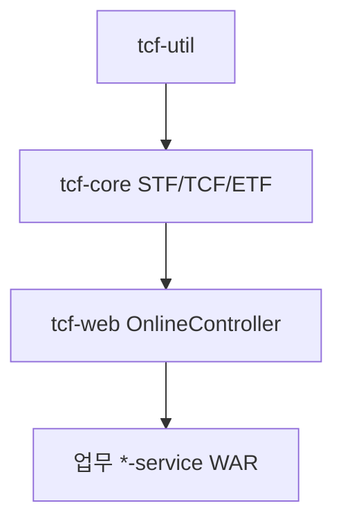

# 제24장. tcf-core · tcf-web · tcf-util

| 항목 | 내용 |
| --- | --- |
| **편** | 제9편 · 모듈별 레퍼런스 (Quick Start) |
| **에디션** | **Master** — 아키텍트·시니어·플랫폼 |
| **기반 원본** | [ztcfbook/제09편/24-tcf-core-web-util.md](../ztcfbook/제09편/24-tcf-core-web-util.md) |
| **입문서** | [ztcfbook-m](../ztcfbook-m/README.md) |
| **장** | 제24장 |
| **파일** | `제09편/24-tcf-core-web-util.md` |
| **상태** | Master Edition (ztcfbook-h) |
| **목차** | [00-목차](../00-목차.md) |

---

## 아키텍처 뷰



---

## Master 해설

tcf-core는 STF·TCF·ETF·Dispatcher·TransactionControl·Timeout·Idempotency·ErrorCode의 프레임워크 kernel이고, tcf-web은 OnlineTransactionController·NsightWarBootstrap·Security autoconfig를 제공합니다. tcf-util은 HTTP·Gateway session helper 등 cross-cutting util입니다.

모든 업무 *-service WAR는 tcf-web에 의존하므로 tcf-core minor 변경도 전 WAR regression을 요구합니다. TcfCoreAutoConfiguration·TcfWebAutoConfiguration 순서와 AOP Timeout·@Transactional Facade pointcut이 기동 로그에서 conflict 없이 올라와야 합니다.

프레임워크 수정 시 TCF.process() finally MDC clear, STF 10단 순서 변경은 breaking change로 취급하고 zman·docs/33~36 동시 갱신하십시오.

플랫폼 MR은 tcf-core 단위 테스트·sv-service integration·ztomcat smoke를 최소 regression으로 요구합니다. tcf-util 변경은 Gateway·UI compile만으로는 부족하고 업무 WAR bootRun으로 STF~ETF 경로를 확인해야 합니다.

---

## 구현 샘플 (코드베이스)

### OnlineTransactionController

```java
package com.nh.nsight.tcf.web.entry.web;

import com.nh.nsight.tcf.core.support.message.StandardHeader;
import com.nh.nsight.tcf.core.support.message.StandardRequest;
import com.nh.nsight.tcf.core.support.message.StandardResponse;
import com.nh.nsight.tcf.core.support.processor.TCF;
import jakarta.servlet.http.HttpServletRequest;
import java.util.Map;
import org.springframework.web.bind.annotation.PathVariable;
import org.springframework.web.bind.annotation.PostMapping;
import org.springframework.web.bind.annotation.RequestBody;
import org.springframework.web.bind.annotation.RestController;
import org.springframework.util.StringUtils;

@RestController
public class OnlineTransactionController {
    private final TCF tcf;

    public OnlineTransactionController(TCF tcf) {
        this.tcf = tcf;
    }

    @PostMapping("/online")
    public StandardResponse<Object> handleRoot(@RequestBody StandardRequest<Map<String, Object>> request,
                                               HttpServletRequest servletRequest) {
        return handle(null, request, servletRequest);
    }

    @PostMapping("/{businessCode}/online")
    public StandardResponse<Object> handleWithBusinessCode(@PathVariable("businessCode") String businessCode,
                                                           @RequestBody StandardRequest<Map<String, Object>> request,
                                                           HttpServletRequest servletRequest) {
        return handle(businessCode, request, servletRequest);
    }

    private StandardResponse<Object> handle(String businessCode,
                                            StandardRequest<Map<String, Object>> request,
                                            HttpServletRequest servletRequest) {
        System.out.println("\n ======================================================================[OnlineTransactionController.handle] start");
        System.out.println(" ======================================================================[OnlineTransactionController.handle] businessCode=" + businessCode);
        if (request.getHeader() == null) {
            System.out.println(" ======================================================================[OnlineTransactionController.handle] create empty header");
            request.setHeader(new StandardHeader());
        }
        StandardHeader header = request.getHeader();
        if (StringUtils.hasText(businessCode) && !StringUtils.hasText(header.getBusinessCode())) {
            System.out.println(" ======================================================================[OnlineTransactionController.handle] set businessCode from path");
            header.setBusinessCode(businessCode);
        }
        if (!StringUtils.hasText(header.getClientIp())) {
            System.out.println(" ======================================================================[OnlineTransactionController.handle] resolveClientIp");
            header.setClientIp(resolveClientIp(servletRequest));
        }
        System.out.println(" ======================================================================[OnlineTransactionController.handle] tcf.process serviceId="
                + header.getServiceId());
        StandardResponse<Object> response = tcf.process(request);
        System.out.println(" ======================================================================[OnlineTransactionController.handle] end");
        return response;
    }

    private String resolveClientIp(HttpServletRequest request) {
        String forwardedFor = request.getHeader("X-Forwarded-For");
        if (StringUtils.hasText(forwardedFor)) {
            return forwardedFor.split(",")[0].trim();
        }
        return request.getRemoteAddr();
    }
}

```

원본: [`tcf-web/src/main/java/com/nh/nsight/tcf/web/entry/web/OnlineTransactionController.java`](../tcf-web/src/main/java/com/nh/nsight/tcf/web/entry/web/OnlineTransactionController.java)

### STF

```java
package com.nh.nsight.tcf.core.support.processor;

import com.nh.nsight.tcf.core.support.context.TransactionContext;
import com.nh.nsight.tcf.core.support.context.TransactionContextHolder;
import com.nh.nsight.tcf.core.support.control.TransactionControlService;
import com.nh.nsight.tcf.core.support.idempotency.IdempotencyChecker;
import com.nh.nsight.tcf.core.support.logging.TransactionLogService;
import com.nh.nsight.tcf.core.support.message.StandardHeader;
import com.nh.nsight.tcf.core.support.message.StandardRequest;
import com.nh.nsight.tcf.core.support.security.AuthenticationContextValidator;
import com.nh.nsight.tcf.core.support.security.AuthorizationValidator;
import com.nh.nsight.tcf.core.support.security.SessionValidator;
import com.nh.nsight.tcf.core.support.TcfConsoleLog;
import com.nh.nsight.tcf.core.support.timeout.TimeoutPolicyService;
import com.nh.nsight.tcf.core.support.validation.StandardHeaderValidator;
import com.nh.nsight.tcf.util.GuidGenerator;
import java.util.Map;
import org.slf4j.MDC;
import org.springframework.stereotype.Component;
import org.springframework.util.StringUtils;

@Component
public class STF {
    private final StandardHeaderValidator headerValidator;
    private final SessionValidator sessionValidator;
    private final AuthenticationContextValidator authenticationContextValidator;
    private final AuthorizationValidator authorizationValidator;
    private final IdempotencyChecker idempotencyChecker;
    private final TransactionControlService transactionControlService;
    private final TimeoutPolicyService timeoutPolicyService;
    private final TransactionLogService transactionLogService;

    public STF(StandardHeaderValidator headerValidator,
            SessionValidator sessionValidator,
            AuthenticationContextValidator authenticationContextValidator,
```

원본: [`tcf-core/src/main/java/com/nh/nsight/tcf/core/support/processor/STF.java`](../tcf-core/src/main/java/com/nh/nsight/tcf/core/support/processor/STF.java)

---

## Master Deep Dive — tcf-core · web · util

- AutoConfiguration — TcfCore/Web/Security
- 모든 업무 WAR가 tcf-web 의존
- tcf-util HTTP·Gateway session helpers
- AOP Timeout·@Transactional Facade

### 아키텍트 체크리스트

- 상단 **구현 샘플**을 실제 코드와 대조한다.
- **심화 참고**와 ztcfbook 본문 절 번호를 매핑한다.
- 운영·배포 관점은 ztcfbook-h Master 블록을 우선 본다.

---

## 심화 참고 (Master)

- [zguide/tcf-core-개발가이드.md](../zguide/tcf-core-개발가이드.md)
- [docs/architecture/33-TCF.md](../docs/architecture/33-TCF.md)
- [tcf-web/README.md](../tcf-web/README.md)

---

## 24.1 모듈 개요

NSIGHT TCF 플랫폼의 **기반 3종 JAR**입니다. 업무 WAR는 이들 위에 Handler를 올립니다.

| 모듈 | 유형 | 역할 |
| --- | --- | --- |
| **tcf-util** | JAR | Spring 비의존 공통 유틸 (문자열·날짜·JSON 헬퍼) |
| **tcf-core** | JAR | TCF 엔진 — STF/TCF/ETF, Dispatcher, 거래통제·Timeout·로그 |
| **tcf-web** | JAR | HTTP 진입 — `/online`, WAR Bootstrap, JWT Filter |

의존 방향: `tcf-util` ← `tcf-core` ← `tcf-web` ← `*-service` WAR

---

## 24.2 tcf-core — TCF 처리 엔진

### 처리 순서

```text
StandardRequest
  → STF.preProcess()        Header, GUID, 세션, 권한, 거래통제, Timeout, PROCESSING 로그
  → OnlineTransactionTimeoutExecutor
  → TransactionDispatcher   serviceId → Handler
  → Handler.doHandle()      [업무 WAR]
  → ETF.postProcess()       StandardResponse, 로그 종료
```

### 핵심 패키지

```text
com.nh.nsight.tcf.core/
├── processor/     TCF, STF, ETF
├── dispatch/      TransactionDispatcher
├── transaction/   TransactionHandler (업무 구현)
├── message/       StandardRequest, StandardResponse, Result
├── context/       TransactionContext, TransactionContextHolder
├── control/       TransactionControlService
├── timeout/       OnlineTransactionTimeoutExecutor
├── validation/    StandardHeaderValidator
├── security/      SessionValidator, AuthorizationValidator
└── logging/       TransactionLogService, AuditLogService
```

### TransactionHandler (업무가 구현)

```java
@Component
public class XxxHandler implements TransactionHandler {
    @Override
    public Collection<String> serviceIds() { return List.of("XX.Domain.action"); }
    @Override
    public Object doHandle(StandardRequest<Map<String, Object>> req, TransactionContext ctx) {
        return switch (ctx.getHeader().getServiceId()) { ... };
    }
}
```

### 빌드

```bash
gradle :tcf-core:build
```

업무 WAR `bootRun` 시 tcf-core는 transitively 포함됩니다.

---

## 24.3 tcf-web — HTTP 진입·WAR Bootstrap

### 담당

| 담당 | 비담당 |
| --- | --- |
| `POST /{bc}/online` Controller | 업무 로직 |
| `NsightWarBootstrap` | STF/ETF (→ tcf-core) |
| JWT Filter (선택) | JWT 발급 (→ tcf-jwt) |
| TcfGateway RestClient 헬퍼 | Gateway 라우팅 (→ tcf-gateway) |

### Online Endpoint

모든 업무 WAR는 **동일 URL 패턴**을 사용합니다.

```text
POST /sv/online
POST /ic/online
POST /om/online
Content-Type: application/json
Body: StandardRequest { header, body }
```

Controller를 업무 WAR에 만들지 **않습니다**. tcf-web의 `OnlineTransactionController`가 공통 처리합니다.

### WAR Bootstrap

```java
@SpringBootApplication
public class NsightSvServiceApplication {
    public static void main(String[] args) {
        NsightWarBootstrap.run(NsightSvServiceApplication.class, args);
    }
}
```

`NsightWarBootstrap`은 tcf-web에서 제공하는 표준 기동 클래스입니다.

### JWT Filter

Gateway·tcf-uj JWT 모드에서 Bearer Token 검증. 상세는 [제26장](./26-tcf-gateway-jwt.md).

---

## 24.4 tcf-util — 공통 유틸

Spring에 의존하지 않는 **순수 Java 유틸**입니다.

| 영역 | 예 |
| --- | --- |
| 문자열·날짜 | `StringUtils`, `DateUtils` |
| JSON | Jackson 헬퍼 |
| 검증 | 공통 Validator |

업무 WAR·tcf-core 모두에서 사용 가능. **업무 도메인 로직은 tcf-util에 넣지 않습니다.**

---

## 24.5 5분 Quick Start (업무 개발자)

```bash
# 1) 의존성 확인 (sv-service/build.gradle)
# implementation project(':tcf-util')
# implementation project(':tcf-core')
# implementation project(':tcf-web')

# 2) Handler 1개 + Facade + Service 작성

# 3) bootRun
gradle :sv-service:bootRun

# 4) 호출
curl -X POST http://127.0.0.1:8086/sv/online \
  -H "Content-Type: application/json" \
  -d @tcf-ui/src/main/resources/sample-requests/sv-sample-inquiry.json
```

### 자주 보는 클래스

| 작업 | 클래스 |
| --- | --- |
| Header 검증 | `StandardHeaderValidator` |
| serviceId 라우팅 | `TransactionDispatcher` |
| 업무 오류 | `BusinessException`, `ErrorCode` |
| Timeout | `OnlineTransactionTimeoutExecutor` |
| HTTP 진입 | `OnlineTransactionController` |

---

## 장 요약 (Master)

**tcf-util → tcf-core → tcf-web** 순으로 플랫폼 기반 JAR가 쌓이고, 업무 WAR는 Handler만 구현합니다. tcf-core가 STF/Dispatcher/ETF 파이프라인을, tcf-web이 `/online`과 WAR Bootstrap을 담당합니다. Controller를 만들지 않고 `TransactionHandler` + `NsightWarBootstrap`으로 5분 내 첫 거래 호출까지 도달할 수 있습니다.

> Master Edition: **아키텍처 뷰** → **Master 해설** → **구현 샘플** → **Master Deep Dive** → **심화 참고** 순으로 본문과 함께 읽는다.

---

## 이전 · 다음

| | |
| --- | --- |
| ← 이전 | [제23장 목록·페이징·등록·변경](../제08편/23-목록-페이징-등록-변경.md) |
| → 다음 | [제25장 tcf-om · tcf-ui · tcf-uj](./25-tcf-om-ui-uj.md) |

---

## 출처 색인 · Master 확장

| 구분 | 경로 |
| --- | --- |
| ztcfbook-h | 본 파일 |
| ztcfbook | `../ztcfbook/제09편/24-tcf-core-web-util.md` |

### 원본 출처


| 절 | 출처 |
| --- | --- |
| 24.1~24.2 | [zguide/tcf-core-개발가이드.md](../../zguide/tcf-core-개발가이드.md), [docs/architecture/33-TCF.md](../../docs/architecture/33-TCF.md) |
| 24.3 | [tcf-web/README.md](../../tcf-web/README.md), [docs/architecture/28-tcf-framework-ref.md](../../docs/architecture/28-tcf-framework-ref.md) |
| 24.4 | [tcf-util/README.md](../../tcf-util/README.md) |
| 24.5 | [zguide/README.md](../../zguide/README.md), [zman/08-업무Handler개발.md](../../zman/08-업무Handler개발.md) |
