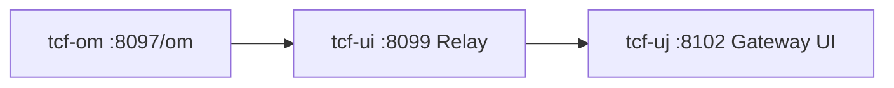

# 제25장. tcf-om · tcf-ui · tcf-uj

| 항목 | 내용 |
| --- | --- |
| **편** | 제9편 · 모듈별 레퍼런스 (Quick Start) |
| **에디션** | **Master** — 아키텍트·시니어·플랫폼 |
| **기반 원본** | [ztcfbook/제09편/25-tcf-om-ui-uj.md](../ztcfbook/제09편/25-tcf-om-ui-uj.md) |
| **입문서** | [ztcfbook-m](../ztcfbook-m/README.md) |
| **장** | 제25장 |
| **파일** | `제09편/25-tcf-om-ui-uj.md` |
| **상태** | Master Edition (ztcfbook-h) |
| **목차** | [00-목차](../00-목차.md) |

---

## 아키텍처 뷰



---

## Master 해설

tcf-om의 24개 Om*Handler는 Service Catalog·거래통제·Timeout·Auth·Dashboard 등 운영 메타의 Single Source of Truth API입니다. tcf-ui(:8099)는 TransactionRelayService와 sample JSON·Admin HTML로 bootRun WAR에 직접 POST하는 개발 Relay를, tcf-uj(:8102)는 Browser→Gateway→업무 WAR 경로를 재현하는 운영 유사 UI 채널입니다.

gateway-relay-enabled 프로파일 한 줄 전환이 개발 편의와 운영 fidelity tradeoff를 결정하며, 장애 triage 시 "UI Relay 경로 vs uj Gateway 경로"를 먼저 분리해야 합니다. OmServiceCatalogHandler 등 OM.* ServiceId는 marketing.om 패키지에만 존재하고, BusinessModuleDefinitions의 bc→port→context 하드코딩은 신규 WAR 추가 시 tcf-ui·Gateway·ztomcat 동시 수정을 요구합니다.

OM Catalog 변경 후 cache evict API 미호출 시 업무 WAR STF 7~8단 lookup이 stale policy를 읽는 incident가 발생합니다. uj의 CORS·cookie·Gateway /gw prefix 정합, tcf-ui direct bootRun port mismatch도 통합 smoke 전에 확인합니다.

리뷰·운영: Relay header 7항 completeness, OM Handler switch default branch, prod profile Admin endpoint 노출 차단.

---

## 구현 샘플 (코드베이스)

### OmServiceCatalogHandler

```java
package com.nh.nsight.marketing.om.entry.handler;

import com.nh.nsight.marketing.om.entry.facade.OmServiceCatalogFacade;
import com.nh.nsight.tcf.core.support.context.TransactionContext;
import com.nh.nsight.tcf.core.support.error.BusinessException;
import com.nh.nsight.tcf.core.support.error.ErrorCode;
import com.nh.nsight.tcf.core.support.message.StandardRequest;
import com.nh.nsight.tcf.core.support.transaction.TransactionHandler;
import java.util.Collection;
import java.util.List;
import java.util.Map;
import org.springframework.stereotype.Component;

/**
 * OM 서비스카탈로그 도메인 핸들러. OM.ServiceCatalog.* 거래를 한 핸들러가 처리한다(Service 도메인당 1개).
 */
@Component
public class OmServiceCatalogHandler implements TransactionHandler {

    private static final String INQUIRY = "OM.ServiceCatalog.inquiry";
    private static final String DETAIL = "OM.ServiceCatalog.detail";
    private static final String SAVE = "OM.ServiceCatalog.save";
    private static final String UPDATE = "OM.ServiceCatalog.update";
    private static final String DELETE = "OM.ServiceCatalog.delete";

    private final OmServiceCatalogFacade facade;

    public OmServiceCatalogHandler(OmServiceCatalogFacade facade) {
        this.facade = facade;
    }

    @Override
    public Collection<String> serviceIds() {
        return List.of(INQUIRY, DETAIL, SAVE, UPDATE, DELETE);
    }

    @Override
    public Object doHandle(StandardRequest<Map<String, Object>> request, TransactionContext context) {
        String serviceId = context.getHeader().getServiceId();
        return switch (serviceId) {
            case INQUIRY -> facade.inquiry(request.getBody(), context);
            case DETAIL -> facade.detail(request.getBody(), context);
            case SAVE -> facade.save(request.getBody(), context);
            case UPDATE -> facade.update(request.getBody(), context);
            case DELETE -> facade.delete(request.getBody(), context);
            default -> throw new BusinessException(ErrorCode.SERVICE_NOT_FOUND,
                    "OmServiceCatalogHandler 미지원 serviceId: " + serviceId);
        };
    }
}
```

원본: [`tcf-om/src/main/java/com/nh/nsight/marketing/om/entry/handler/OmServiceCatalogHandler.java`](../tcf-om/src/main/java/com/nh/nsight/marketing/om/entry/handler/OmServiceCatalogHandler.java)

### TransactionRelayService (ui)

```java
package com.nh.nsight.tcf.ui.client;

import com.nh.nsight.tcf.ui.application.service.BusinessModuleCatalog;
import com.nh.nsight.tcf.ui.config.TcfUiProperties;
import com.nh.nsight.tcf.ui.support.BusinessModuleInfo;
import com.nh.nsight.tcf.ui.support.RelayResult;
import java.net.URI;
import java.nio.charset.StandardCharsets;
import java.util.List;
import org.springframework.http.HttpHeaders;
import org.springframework.http.MediaType;
import org.springframework.stereotype.Service;
import org.springframework.util.StreamUtils;
import org.springframework.util.StringUtils;
import org.springframework.web.client.RestClient;
import org.springframework.web.client.RestClientResponseException;

@Service
public class TransactionRelayService {
    private final TcfUiProperties properties;
    private final BusinessModuleCatalog catalog;
    private final GatewayRelayService gatewayRelayService;
    private final RestClient restClient;

    public TransactionRelayService(TcfUiProperties properties,
                                   BusinessModuleCatalog catalog,
                                   GatewayRelayService gatewayRelayService) {
        this.properties = properties;
        this.catalog = catalog;
        this.gatewayRelayService = gatewayRelayService;
        this.restClient = RestClient.builder()
                .defaultHeader("Content-Type", MediaType.APPLICATION_JSON_VALUE + ";charset=UTF-8")
                .defaultHeader("Accept", MediaType.APPLICATION_JSON_VALUE + ";charset=UTF-8")
                .build();
    }

    public String resolveTargetUrl(String businessCode, RelayOptions options) {
        if (properties.isGatewayRelayEnabled()) {
            return gatewayRelayService.resolveGatewayOnlineUrl(businessCode, options);
        }
        BusinessModuleInfo module = catalog.findByCode(businessCode);
        String baseUrl = resolveDirectBaseUrl(module, options);
        return baseUrl + module.contextPath() + "/online";
    }

    private String resolveDirectBaseUrl(BusinessModuleInfo module, RelayOptions options) {
        if (resolveMode(options) == TcfUiProperties.DeploymentMode.tomcat) {
            return trimTrailingSlash(resolveTomcatGateway(options));
        }
        return trimTrailingSlash(resolveBootrunHost(options)) + ":" + module.localPort();
    }

    public RelayResult relay(String businessCode, String requestBody, RelayOptions options) {
        return relay(businessCode, requestBody, options, null, null);
    }
```

원본: [`tcf-ui/src/main/java/com/nh/nsight/tcf/ui/client/TransactionRelayService.java`](../tcf-ui/src/main/java/com/nh/nsight/tcf/ui/client/TransactionRelayService.java)

---

## Master Deep Dive — tcf-om · ui · uj

- tcf-om 24 Handler — 운영 SoT
- tcf-ui = 개발 Relay + sample JSON + Admin HTML
- tcf-uj = Gateway 경유 UI (8102)
- gateway-relay-enabled 프로파일 전환

### 아키텍트 체크리스트

- 상단 **구현 샘플**을 실제 코드와 대조한다.
- **심화 참고**와 ztcfbook 본문 절 번호를 매핑한다.
- 운영·배포 관점은 ztcfbook-h Master 블록을 우선 본다.

---

## 심화 참고 (Master)

- [zguide/tcf-om-개발가이드.md](../zguide/tcf-om-개발가이드.md)
- [zguide/tcf-ui-개발가이드.md](../zguide/tcf-ui-개발가이드.md)
- [zguide/tcf-uj-개발가이드.md](../zguide/tcf-uj-개발가이드.md)
- [zarchitecture/05-운영관리-OM-아키텍처.md](../zarchitecture/05-운영관리-OM-아키텍처.md)

---

## 25.1 tcf-om — 운영 관리 본체

| 항목 | 값 |
| --- | --- |
| 포트 | 8097 |
| Context | `/om` |
| 업무코드 | OM |
| WAR | `tcf-om.war` / `om.war` |

### 역할

NSIGHT **운영 기준정보 원장** — 사용자·권한·메뉴·ServiceId Catalog·거래통제·Timeout·오류코드·세션·거래로그·배치·배포·Cache·대시보드·파일(UD).

업무 WAR와 **동일 TCF 6계층**이지만 OM 전용 Handler **24개**, serviceId **80+**.

### 5분 Quick Start

```bash
gradle :tcf-om:bootRun

curl -X POST http://127.0.0.1:8097/om/online \
  -H "Content-Type: application/json" \
  -d @tcf-ui/src/main/resources/sample-requests/om-sample-inquiry.json
```

⚠ **om-service와 포트 8097 충돌** — 동시 기동 금지. 신규 개발은 **tcf-om만** 사용.

### 주요 Handler

| Handler | 영역 |
| --- | --- |
| OmAuthHandler | login, logout, ssoLogin |
| OmServiceCatalogHandler | **ServiceId Catalog** |
| OmTransactionControlHandler | **거래통제** |
| OmTimeoutPolicyHandler | Timeout |
| OmTransactionLogHandler | 거래로그 조회 |
| OmCacheHandler | Cache Evict |
| OmDashboardHandler | 운영 대시보드 |

### Catalog · Seed (중요)

업무 serviceId 등록 시 반드시 반영:

- `tcf-om/src/main/resources/data.sql`
- `ServiceCatalogSeedData.java`
- 필드 `HANDLER_CLASS` = `{Domain}Handler` 클래스명

---

## 25.2 tcf-ui — 거래·OM 테스트 UI

| 항목 | 값 |
| --- | --- |
| 포트 | 8097 (Relay) / **8099** (UI 서버) |
| Context (ztomcat) | `/ui` |

### 역할

- 업무 WAR **거래 테스트** HTML (sv, ic, om 등)
- OM Admin Relay — `http://localhost:8099/om/admin/login.html`
- JWT Admin Relay — `/jwt/admin/*` (tcf-jwt 8110 필요)

### Quick Start

```bash
gradle :sv-service:bootRun    # 대상 WAR
gradle :tcf-ui:bootRun        # 8099

# SV 테스트 UI
http://localhost:8099/sv/index.html
# OM Admin
http://localhost:8099/om/admin/login.html
```

ztomcat: `http://localhost:8080/ui/sv/index.html`

### Relay 원리

tcf-ui는 브라우저 요청을 **동일 Origin**으로 받아 백엔드 WAR(`8086/sv/online` 등)로 프록시합니다. CORS·세션 쿠키 이슈를 줄입니다.

---

## 25.3 tcf-uj — Gateway 경유 UI

| 항목 | 값 |
| --- | --- |
| 포트 | **8102** |
| Context (ztomcat) | `/uj` |

### 역할

**tcf-gateway(8100)를 반드시 경유**하는 채널 UI. 운영 아키텍처(FAD)와 동일한 End-to-End 검증용.

```text
브라우저 → tcf-uj(8102) → tcf-gateway(8100) → sv-service(8086)
```

### Quick Start

```bash
gradle :sv-service:bootRun
gradle :tcf-om:bootRun         # 세션
gradle :tcf-gateway:bootRun    # 8100
gradle :tcf-uj:bootRun         # 8102

http://localhost:8102/sv/index.html
http://localhost:8102/om/admin/login.html
```

JWT 모드: Bearer Token + Gateway JWT Filter. [제26장](./26-tcf-gateway-jwt.md) 참고.

---

## 25.4 OM ↔ UI 접속 URL 요약

| 모드 | OM Admin 로그인 |
| --- | --- |
| tcf-ui bootRun | http://localhost:8099/om/admin/login.html |
| tcf-ui ztomcat | http://localhost:8080/ui/om/admin/login.html |
| tcf-uj bootRun | http://localhost:8102/om/admin/login.html |
| tcf-uj ztomcat | http://localhost:8080/uj/om/admin/login.html |

---

## 장 요약 (Master)

**tcf-om**은 Service Catalog·거래통제·Timeout 등 운영 메타의 SoT이고, **tcf-ui**는 로컬 직결 Relay 테스트 UI, **tcf-uj**는 Gateway 경유 운영 동형 테스트 UI입니다. 업무 serviceId는 OM Catalog + Seed에 등록하고, Admin 화면은 tcf-ui 또는 tcf-uj로 접속합니다.

> Master Edition: **아키텍처 뷰** → **Master 해설** → **구현 샘플** → **Master Deep Dive** → **심화 참고** 순으로 본문과 함께 읽는다.

---

## 이전 · 다음

| | |
| --- | --- |
| ← 이전 | [제24장 tcf-core · tcf-web · tcf-util](./24-tcf-core-web-util.md) |
| → 다음 | [제26장 tcf-gateway · tcf-jwt](./26-tcf-gateway-jwt.md) |

---

## 출처 색인 · Master 확장

| 구분 | 경로 |
| --- | --- |
| ztcfbook-h | 본 파일 |
| ztcfbook | `../ztcfbook/제09편/25-tcf-om-ui-uj.md` |

### 원본 출처


| 절 | 출처 |
| --- | --- |
| 25.1 | [zguide/tcf-om-개발가이드.md](../../zguide/tcf-om-개발가이드.md), [zarchitecture/05-운영관리-OM-아키텍처.md](../../zarchitecture/05-운영관리-OM-아키텍처.md) |
| 25.2 | [zguide/tcf-ui-개발가이드.md](../../zguide/tcf-ui-개발가이드.md), [zarchitecture/13-UI-채널-아키텍처.md](../../zarchitecture/13-UI-채널-아키텍처.md) |
| 25.3 | [zguide/tcf-uj-개발가이드.md](../../zguide/tcf-uj-개발가이드.md) |
| 25.4 | [docs/설계자료/README.md](../../docs/설계자료/README.md) |
