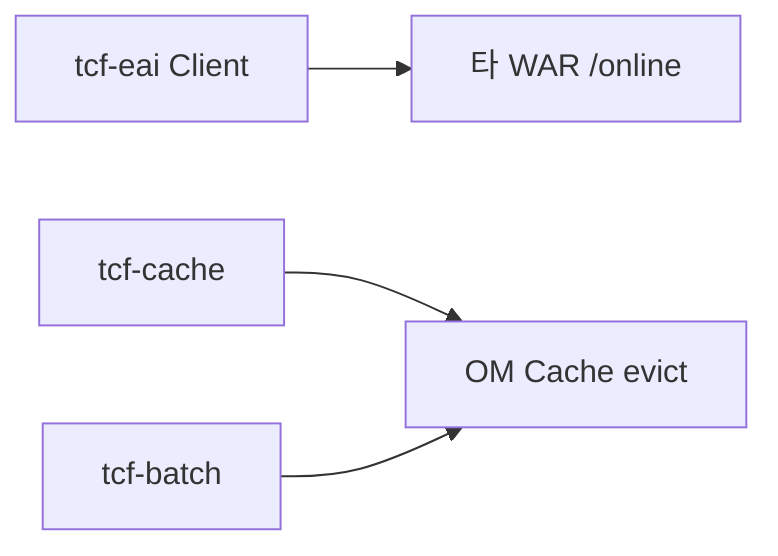

# 제27장. tcf-eai · tcf-cache · tcf-batch

| 항목 | 내용 |
| --- | --- |
| **편** | 제9편 · 모듈별 레퍼런스 (Quick Start) |
| **에디션** | **Master** — 아키텍트·시니어·플랫폼 |
| **기반 원본** | [ztcfbook/제09편/27-tcf-eai-cache-batch.md](../ztcfbook/제09편/27-tcf-eai-cache-batch.md) |
| **입문서** | [ztcfbook-m](../ztcfbook-m/README.md) |
| **장** | 제27장 |
| **파일** | `제09편/27-tcf-eai-cache-batch.md` |
| **상태** | Master Edition (ztcfbook-h) |
| **목차** | [00-목차](../00-목차.md) |

---

## 아키텍처 뷰



---

## Master 해설

tcf-eai TcfServiceClient는 WAR 간 StandardRequest POST 클라이언트로, ad-hoc REST URL 없이 ServiceId 수준 contract를 유지합니다. Header guid propagation·error mapping·Timeout 중첩은 docs/46-service-integration-contract와 zguide/tcf-eai가 SoT입니다.

tcf-cache SPI와 OM cache evict Handler는 Catalog·공통코드 변경 propagation을 맞추며, evict 누락 시 STF 이후 Handler가 stale meta를 읽는 production issue가 빈번합니다. tcf-batch Scheduler→OM Dashboard metrics는 online TCF 장애와 lifecycle이 decouple되어 batch down이 거래를 막지는 않으나 observability blind spot을 만듭니다.

eai·cache·batch 모듈은 bootRun 독립 기동이 가능하나 ztomcat ALL_MODULES integration verify가 릴리즈 gate입니다. 온라인 Handler에 @Scheduled 혼입은 antipattern입니다.

리뷰: EAI target ServiceId Catalog 존재, foreign WAR RestTemplate 직접 호출 금지, batch job idempotent, scheduler cluster singleton(운영 Gap 문서화).

---

## 구현 샘플 (코드베이스)

### TcfServiceClient

```java
package com.nh.nsight.tcf.eai.client;

import com.nh.nsight.tcf.core.support.context.TransactionContext;
import com.nh.nsight.tcf.eai.model.IntegrationCallRequest;
import com.nh.nsight.tcf.eai.model.IntegrationCallResult;
import java.util.Map;

/**
 * 서비스 간 표준 전문 호출 공통 Client.
 *
 * <p>업무 서비스는 다른 업무 서비스의 Java 코드를 직접 참조하지 않고,
 * 이 Client 를 통해 {@code POST /{businessCode}/online} + serviceId 방식으로 호출한다.
 *
 * <p>대상별 Adapter 없이 한 줄로 호출하려면 {@link #call(String, String, String, Map, TransactionContext)}
 * 또는 {@link #callForBody(String, String, String, Map, TransactionContext)} 를 사용한다.
 */
public interface TcfServiceClient {

    /**
     * 대상 서비스를 호출한다. 호출 측 컨텍스트의 GUID/TraceId/사용자 정보를 전파한다.
     *
     * @param request       대상 식별 정보와 body
     * @param callerContext 호출 측 거래 컨텍스트 (null 허용 — 신규 GUID 생성)
     * @return 정규화된 연동 결과
     */
    IntegrationCallResult call(IntegrationCallRequest request, TransactionContext callerContext);

    /**
     * 대상별 Adapter 없이 한 줄로 호출하는 편의 메서드 (INQUIRY 기본).
     *
     * <pre>
     * IntegrationCallResult r = tcfServiceClient.call(
     *         "SV", "SV.Customer.selectSummary", "SV-INQ-0002",
     *         Map.of("customerNo", customerNo), context);
     * </pre>
     */
    default IntegrationCallResult call(String targetBusinessCode,
                                       String targetServiceId,
                                       String targetTransactionCode,
                                       Map<String, Object> body,
                                       TransactionContext callerContext) {
        IntegrationCallRequest request = IntegrationCallRequest.builder()
                .targetBusinessCode(targetBusinessCode)
                .targetServiceId(targetServiceId)
                .targetTransactionCode(targetTransactionCode)
                .body(body)
                .build();
        return call(request, callerContext);
    }

    /**
     * 성공 시 대상 응답 body(Map)만 바로 반환하는 편의 메서드.
     *
     * <p>업무 실패/Timeout/시스템 오류는 {@code IntegrationException} 계열로 전파된다.
     *
     * <pre>
     * Map&lt;String, Object&gt; summary = tcfServiceClient.callForBody(
     *         "SV", "SV.Customer.selectSummary", "SV-INQ-0002",
     *         Map.of("customerNo", customerNo), context);
     * </pre>
     */
    default Map<String, Object> callForBody(String targetBusinessCode,
                                            String targetServiceId,
                                            String targetTransactionCode,
                                            Map<String, Object> body,
                                            TransactionContext callerContext) {
        return call(targetBusinessCode, targetServiceId, targetTransactionCode, body, callerContext)
                .getBody();
    }
}
```

원본: [`tcf-eai/src/main/java/com/nh/nsight/tcf/eai/client/TcfServiceClient.java`](../tcf-eai/src/main/java/com/nh/nsight/tcf/eai/client/TcfServiceClient.java)

### SessionStatusCollectScheduler

```java
package com.nh.nsight.tcf.batch.application.scheduler;

import com.nh.nsight.tcf.batch.config.SessionStatusBatchProperties;
import com.nh.nsight.tcf.batch.support.model.SessionStatusCollectResult;
import com.nh.nsight.tcf.batch.application.service.SessionStatusCollectService;
import com.nh.nsight.tcf.batch.support.ScheduledCollectSupport;
import org.slf4j.Logger;
import org.slf4j.LoggerFactory;
import org.springframework.scheduling.annotation.Scheduled;
import org.springframework.stereotype.Component;

@Component
public class SessionStatusCollectScheduler {
    private static final Logger log = LoggerFactory.getLogger(SessionStatusCollectScheduler.class);

    private final SessionStatusBatchProperties properties;
    private final SessionStatusCollectService collectService;
    private final ScheduledCollectSupport scheduledCollectSupport;

    public SessionStatusCollectScheduler(SessionStatusBatchProperties properties,
                                         SessionStatusCollectService collectService,
                                         ScheduledCollectSupport scheduledCollectSupport) {
        this.properties = properties;
        this.collectService = collectService;
        this.scheduledCollectSupport = scheduledCollectSupport;
    }

    @Scheduled(cron = "${nsight.batch.session-status.cron:45 */5 * * * *}")
    public void runScheduled() {
        if (scheduledCollectSupport.skipIfWarmingUp(properties.getJobId(), log)) {
            return;
        }
        log.info("Scheduled session status collect started jobId={}", properties.getJobId());
        SessionStatusCollectResult result = collectService.collectAndPersist();
        log.info("Scheduled session status collect finished jobId={} status={} message={}",
```

원본: [`tcf-batch/src/main/java/com/nh/nsight/tcf/batch/application/scheduler/SessionStatusCollectScheduler.java`](../tcf-batch/src/main/java/com/nh/nsight/tcf/batch/application/scheduler/SessionStatusCollectScheduler.java)

---

## Master Deep Dive — tcf-eai · cache · batch

- WAR간 표준전문 POST — TcfServiceClient
- Cache eviction OM Handler 연동
- batch scheduler → OM Dashboard metrics
- 온라인 TCF와 별도 모듈 lifecycle

### 아키텍트 체크리스트

- 상단 **구현 샘플**을 실제 코드와 대조한다.
- **심화 참고**와 ztcfbook 본문 절 번호를 매핑한다.
- 운영·배포 관점은 ztcfbook-h Master 블록을 우선 본다.

---

## 심화 참고 (Master)

- [zguide/tcf-eai-개발가이드.md](../zguide/tcf-eai-개발가이드.md)
- [zguide/tcf-cache-개발가이드.md](../zguide/tcf-cache-개발가이드.md)
- [zguide/tcf-batch-개발가이드.md](../zguide/tcf-batch-개발가이드.md)

---

## 27.1 tcf-eai — WAR 간 연동

| ❌ 금지 | ✅ 권장 |
| --- | --- |
| ic-service가 sv-service Java import | `TcfServiceClient.call(...)` HTTP |
| WAR 간 Bean 참조 | `POST /{code}/online` 표준 전문 |

### 의존성

```gradle
implementation project(':tcf-eai')
```

### 설정 (application.yml)

```yaml
nsight:
  integration:
    default-timeout-ms: 3000
    services:
      SV:
        base-url: http://127.0.0.1:8086
        context-path: /sv
        online-path: /online
      IC:
        base-url: http://127.0.0.1:8082
        context-path: /ic
        online-path: /online
```

Gateway 경유 시 `base-url`을 `http://127.0.0.1:8100`으로 변경 가능.

### 호출 코드

```java
@Service
@RequiredArgsConstructor
public class SvIntegrationDemoService {
    private final TcfServiceClient client;

    public Map<String, Object> callIcSample(Map<String, Object> body, TransactionContext ctx) {
        return client.callForBody("IC", "IC.Sample.inquiry", "IC-INQ-0001", body, ctx);
    }
}
```

- **Header 전파:** GUID, TraceId, user, channel — `HeaderPropagationHelper`
- **데모:** `SV.Integration.icSample` → `IC.Sample.inquiry`

---

## 27.2 tcf-cache — 공통 캐시

Spring Cache + **EhCache 3 (JCache)** 공통 환경.

### 의존성·설정

```gradle
implementation project(':tcf-cache')
```

```yaml
spring:
  cache:
    type: jcache
    jcache:
      config: classpath:ehcache.xml
nsight:
  tcf:
    cache:
      enabled: true
```

### 캐시 영역

| alias | 용도 | TTL |
| --- | --- | --- |
| `commonCode` | 공통코드 | 30분 |
| `serviceCatalog` | ServiceId Catalog | 60분 |
| `sessionRegion` | 세션/리전 | 10분 |

상수: `TcfCacheNames`

### 사용 예

```java
@Cacheable(cacheNames = TcfCacheNames.COMMON_CODE, key = "#codeGroup")
public List<Map<String, Object>> findByGroup(String codeGroup) { ... }

@CacheEvict(cacheNames = TcfCacheNames.COMMON_CODE, allEntries = true)
public void save(...) { ... }
```

OM Cache 관리 UI: `OM.Cache.*` serviceId — [제25장](./25-tcf-om-ui-uj.md).

---

## 27.3 tcf-batch — 배치·모니터링 수집

| 항목 | 값 |
| --- | --- |
| 포트 | 8098 |
| Context | `/batch` |

### 역할

- AP/DB/세션/배포 **모니터링 데이터 수집**
- Batch Job 실행 이력·Scheduler 연동
- OM 대시보드·헬스체크 데이터 공급

### Quick Start

```bash
gradle :tcf-batch:bootRun

curl http://localhost:8098/actuator/health
```

### 업무 Batch와의 관계

| 구분 | 모듈 |
| --- | --- |
| 플랫폼 수집·모니터링 | tcf-batch |
| 업무 Job (@Scheduled) | 각 `*-service` WAR |
| OM Batch 관리 | tcf-om `OmBatchHandler` |

업무 Scheduler 예: [제23장 §23.5](../제08편/23-목록-페이징-등록-변경.md)

---

## 27.4 연동 시나리오 요약

```text
[SV WAR] --tcf-eai--> [IC WAR]
[tcf-om] --tcf-cache--> 공통코드·Catalog
[tcf-batch] --수집--> [OM Dashboard]
[EB WAR] --HTTP--> [EP WAR]  (이벤트, tcf-eai 대체 가능)
```

---

## 장 요약 (Master)

**tcf-eai**는 WAR 간 HTTP/JSON + serviceId 연동의 유일한 표준 경로입니다. **tcf-cache**는 OM 기준정보 캐시를 중앙화하고, **tcf-batch**는 운영 모니터링·배치 이력을 수집합니다. 세 모듈 모두 JAR(또는 tcf-batch WAR)로 의존성 추가 후 yml 설정만으로 Quick Start 가능합니다.

> Master Edition: **아키텍처 뷰** → **Master 해설** → **구현 샘플** → **Master Deep Dive** → **심화 참고** 순으로 본문과 함께 읽는다.

---

## 이전 · 다음

| | |
| --- | --- |
| ← 이전 | [제26장 tcf-gateway · tcf-jwt](./26-tcf-gateway-jwt.md) |
| → 다음 | [제28장 tcf-cicd · tcf-scripts](./28-tcf-cicd-scripts.md) |

---

## 출처 색인 · Master 확장

| 구분 | 경로 |
| --- | --- |
| ztcfbook-h | 본 파일 |
| ztcfbook | `../ztcfbook/제09편/27-tcf-eai-cache-batch.md` |

### 원본 출처


| 절 | 출처 |
| --- | --- |
| 27.1 | [zguide/tcf-eai-개발가이드.md](../../zguide/tcf-eai-개발가이드.md), [docs/architecture/46-service-integration-contract.md](../../docs/architecture/46-service-integration-contract.md) |
| 27.2 | [zguide/tcf-cache-개발가이드.md](../../zguide/tcf-cache-개발가이드.md), [docs/architecture/12-cache.md](../../docs/architecture/12-cache.md) |
| 27.3 | [zguide/tcf-batch-개발가이드.md](../../zguide/tcf-batch-개발가이드.md), [zarchitecture/12-배치-모니터링-아키텍처.md](../../zarchitecture/12-배치-모니터링-아키텍처.md) |
