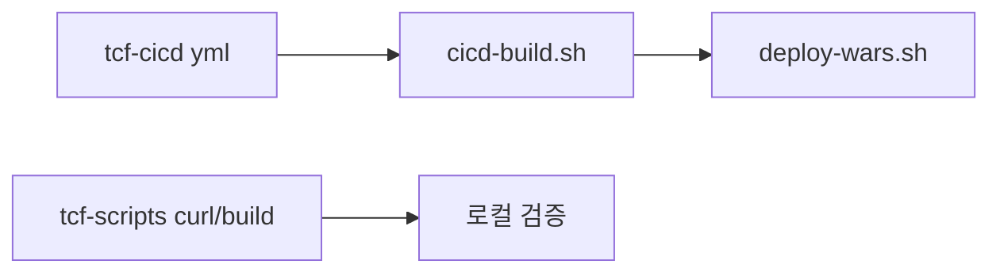

# 제28장. tcf-cicd · tcf-scripts

| 항목 | 내용 |
| --- | --- |
| **편** | 제9편 · 모듈별 레퍼런스 (Quick Start) |
| **에디션** | **Master** — 아키텍트·시니어·플랫폼 |
| **기반 원본** | [ztcfbook/제09편/28-tcf-cicd-scripts.md](../ztcfbook/제09편/28-tcf-cicd-scripts.md) |
| **입문서** | [ztcfbook-m](../ztcfbook-m/README.md) |
| **장** | 제28장 |
| **파일** | `제09편/28-tcf-cicd-scripts.md` |
| **상태** | Master Edition (ztcfbook-h) |
| **목차** | [00-목차](../00-목차.md) |

---

## 아키텍처 뷰



---

## Master 해설

tcf-cicd는 profile별 application yml·Apache·Tomcat layout의 SoT이며 sync-to-framework·pull-from-framework로 nsight-tcf-framework와 양방향 sync합니다. tcf-scripts build-all.sh·curl-sv-sample.sh·deploy helper는 로컬·CI shortcut으로 ztomcat smoke·sv-sample E2E regression artifact를 제공합니다.

cicd-build.sh→deploy-wars.sh 13 WAR pipeline은 settings.gradle module list와 manifest.yaml 일치를 전제하며, ztomcat README ALL_MODULES smoke는 릴리즈 전 권장 gate입니다. 스크립트 hardcoded path·Windows vs Linux line ending·secret repo commit은 CI fail·보안 incident 원인입니다.

DevOps 운영: manifest version pin, rollback script dry-run, tcf-scripts re-run idempotency, cicd-deploy smoke fail→znsight-man 67 rollback 분기.

아키텍트: tcf-cicd yml 변경은 전 WAR STF flag·Gateway auth.jwt.enabled blast radius review 동반.

---

## 구현 샘플 (코드베이스)

### cicd-build.sh

```shell
#!/usr/bin/env bash
# tcf-cicd — sync + build only
set -euo pipefail

SCRIPT_DIR="$(cd "$(dirname "${BASH_SOURCE[0]}")" && pwd)"
BUILD_PS1="${SCRIPT_DIR}/cicd-build.ps1"

TARGET="wars"
PROFILE="dev"
DRY_RUN=0
SKIP_SYNC=0
NO_GRADLE_STOP=0
ARTIFACT_DIR=""
CODES=()

usage() {
  cat <<'EOF'
Usage: cicd-build.sh [options] [codes...]

sync + Gradle 빌드 (배포 없음).

Options:
  --profile local|dev|prod   (기본 dev)
  --target wars|business|all|fast
  --dry-run
  --skip-sync
  --no-gradle-stop
  --artifact-dir <path>
  -h, --help

EOF
}

while [[ $# -gt 0 ]]; do
  case "| **목차** | [00-목차](../00-목차.md) |

---

" in
    --profile)
      PROFILE="${2:-dev}"
      shift 2
      ;;
    --target)
```

원본: [`tcf-cicd/scripts/cicd-build.sh`](../tcf-cicd/scripts/cicd-build.sh)

### deploy-wars.sh

```shell
#!/usr/bin/env bash
set -euo pipefail

ZTOMCAT_HOME="$(cd "$(dirname "${BASH_SOURCE[0]}")" && pwd)"
PROJECT_HOME="$(cd "${ZTOMCAT_HOME}/.." && pwd)"
CATALINA_HOME="${ZTOMCAT_HOME}/apache-tomcat-10.1.34"
WEBAPPS="${CATALINA_HOME}/webapps"

ALL_MODULES=(
  ic-service:ic.war:ic.war:ic
  pc-service:pc.war:pc.war:pc
  ms-service:ms.war:ms.war:ms
  sv-service:sv.war:sv.war:sv
  pd-service:pd.war:pd.war:pd
  eb-service:eb.war:eb.war:eb
  ep-service:ep.war:ep.war:ep
  ss-service:ss.war:ss.war:ss
  mg-service:mg.war:mg.war:mg
  tcf-om:tcf-om.war:om.war:om
  tcf-ui:tcf-ui.war:ui.war:ui
  tcf-jwt:jwt.war:jwt.war:jwt
  tcf-batch:tcf-batch.war:zz-batch.war:batch
)

usage() {
  cat <<'EOF'
Usage:
  deploy-wars.sh              Build and deploy all 13 WARs
  deploy-wars.sh all          Same as above
  deploy-wars.sh sv           Build and deploy one code (e.g. sv.war -> /sv)
  deploy-wars.sh sv ic om     Build and deploy multiple codes

Codes: ic pc ms sv pd eb ep ss mg om ui jwt batch
  (별칭: tcf-jwt, tcf-om, tcf-ui, tcf-batch)
EOF
```

원본: [`ztomcat/deploy-wars.sh`](../ztomcat/deploy-wars.sh)

### build-all.sh

```shell
#!/usr/bin/env bash
set -euo pipefail
exec "$(dirname "$0")/build.sh" all "$@"

```

원본: [`tcf-scripts/build-all.sh`](../tcf-scripts/build-all.sh)

---

## Master Deep Dive — tcf-cicd · scripts

- tcf-cicd = local/dev/prod profile SoT
- sync-to-framework / pull-from-framework
- tcf-scripts = curl·build·deploy 단축
- 13 WAR deploy-wars.sh ALL_MODULES

### 아키텍트 체크리스트

- 상단 **구현 샘플**을 실제 코드와 대조한다.
- **심화 참고**와 ztcfbook 본문 절 번호를 매핑한다.
- 운영·배포 관점은 ztcfbook-h Master 블록을 우선 본다.

---

## 심화 참고 (Master)

- [zguide/tcf-cicd-개발가이드.md](../zguide/tcf-cicd-개발가이드.md)
- [tcf-cicd/README.md](../tcf-cicd/README.md)
- [zguide/tcf-scripts-개발가이드.md](../zguide/tcf-scripts-개발가이드.md)
- [ztomcat/README.md](../ztomcat/README.md)

---

## 28.1 tcf-cicd — 환경 설정 SoT

| 항목 | 내용 |
| --- | --- |
| 유형 | 설정·스크립트 (실행 WAR 아님) |
| 역할 | `local` / `dev` / `prod` 프로파일 yml, Tomcat, Apache **Source of Truth** |

### Profile

| Profile | 용도 |
| --- | --- |
| `local/` | bootRun (개발 PC) |
| `dev/` | ztomcat 통합 검증 |
| `prod/` | 운영 Tomcat + Apache |

공통 `application.yml`은 각 framework 모듈에 유지. tcf-cicd는 **프로파일 yml만** 관리.

### 디렉터리

```text
tcf-cicd/
├── manifest.yaml
├── local/ dev/ prod/
│   ├── spring/{module}/application-{profile}.yml
│   ├── ztomcat/setenv.*
│   └── env/.env.example
├── prod/apache/
└── scripts/
    ├── sync-to-framework.ps1
    ├── pull-from-framework.ps1
    └── cicd-deploy.ps1
```

### 워크플로

```powershell
# 최초: framework → tcf-cicd
cd tcf-cicd/scripts
.\pull-from-framework.ps1 -Profile all

# 수정 후: tcf-cicd → framework
.\sync-to-framework.ps1 -Profile dev

# ztomcat 배포
.\cicd-deploy.ps1 --profile dev sv om --restart
```

---

## 28.2 tcf-scripts — 로컬 실행 스크립트

| 스크립트 | 용도 |
| --- | --- |
| `run-local.bat {module}` | 단일 WAR bootRun |
| `run-all-local.bat` | 주요 WAR 일괄 기동 |
| `build-war.bat {module}` | WAR 빌드 |

### Quick Start

```bash
# SV만 기동
tcf-scripts/run-local.bat sv

# OM + UI
tcf-scripts/run-local.bat tcf-om
tcf-scripts/run-local.bat tcf-ui
```

Windows `.bat` / Linux `.sh` 쌍 제공. Gradle `:sv-service:bootRun` 래퍼.

---

## 28.3 ztomcat 연계

| 단계 | 명령 |
| --- | --- |
| WAR 빌드 | `gradle :sv-service:bootWar` |
| 배포 | `ztomcat/deploy-wars.bat sv om` |
| 기동 | `ztomcat/start.bat` |
| 검증 | `http://localhost:8080/sv/online` |

tcf-cicd `dev/ztomcat/setenv.*`가 JVM·Profile을 통제합니다.

---

## 28.4 CI/CD Pipeline (개요)

```text
Push/MR → Build → Unit Test → SonarQube → Integration Test
       → bootWar → Nexus/Artifact → ztomcat/stg Deploy
       → Smoke → Health → (Rollback 준비)
```

상세: [제20장](../제06편/20-CICD-릴리즈-DR.md), [docs/architecture/49-release-strategy.md](../../docs/architecture/49-release-strategy.md)

---

## 장 요약 (Master)

**tcf-cicd**는 local/dev/prod 환경 설정의 단일 원천이며 sync 스크립트로 framework 모듈과 동기화합니다. **tcf-scripts**는 로컬 bootRun·WAR 빌드를 단축하고, **ztomcat**과 결합해 Tomcat WAR 배포를 검증합니다. 릴리즈 Pipeline은 tcf-cicd manifest + GitLab CI/CD가 담당합니다.

> Master Edition: **아키텍처 뷰** → **Master 해설** → **구현 샘플** → **Master Deep Dive** → **심화 참고** 순으로 본문과 함께 읽는다.

---

## 이전 · 다음

| | |
| --- | --- |
| ← 이전 | [제27장 tcf-eai · tcf-cache · tcf-batch](./27-tcf-eai-cache-batch.md) |
| → 다음 | [제29장 ic · pc · ms · sv · pd](./29-업무-WAR-ic-pc-ms-sv-pd.md) |

---

## 출처 색인 · Master 확장

| 구분 | 경로 |
| --- | --- |
| ztcfbook-h | 본 파일 |
| ztcfbook | `../ztcfbook/제09편/28-tcf-cicd-scripts.md` |

### 원본 출처


| 절 | 출처 |
| --- | --- |
| 28.1 | [zguide/tcf-cicd-개발가이드.md](../../zguide/tcf-cicd-개발가이드.md), [tcf-cicd/README.md](../../tcf-cicd/README.md) |
| 28.2 | [zguide/tcf-scripts-개발가이드.md](../../zguide/tcf-scripts-개발가이드.md) |
| 28.3 | [ztomcat/README.md](../../ztomcat/README.md), [znsight-man/10-bootRun-Tomcat-WAR-차이.md](../../znsight-man/10-bootRun-Tomcat-WAR-차이.md) |
| 28.4 | [znsight-man/65-CICD-파이프라인-기준.md](../../znsight-man/65-CICD-파이프라인-기준.md) |
