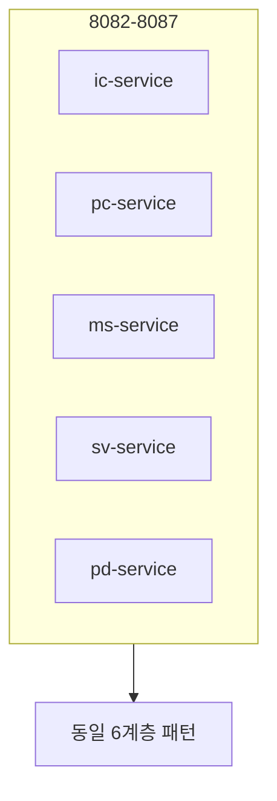

# 제29장. ic · pc · ms · sv · pd (업무 WAR 5)

| 항목 | 내용 |
| --- | --- |
| **편** | 제9편 · 모듈별 레퍼런스 (Quick Start) |
| **에디션** | **Master** — 아키텍트·시니어·플랫폼 |
| **기반 원본** | [ztcfbook/제09편/29-업무-WAR-ic-pc-ms-sv-pd.md](../ztcfbook/제09편/29-업무-WAR-ic-pc-ms-sv-pd.md) |
| **입문서** | [ztcfbook-m](../ztcfbook-m/README.md) |
| **장** | 제29장 |
| **파일** | `제09편/29-업무-WAR-ic-pc-ms-sv-pd.md` |
| **상태** | Master Edition (ztcfbook-h) |
| **목차** | [00-목차](../00-목차.md) |

---

## 아키텍처 뷰



---

## Master 해설

ic·pc·ms·sv·pd 다섯 업무 WAR는 동일 6계층·`/{bc}/online`·com.nh.nsight.marketing.{bc} 패키지 패턴을 공유합니다. sv-service는 SV.Customer.selectSummary 표준 실습·zguide/sv-service SoT이고, ic-service는 tcf-eai WAR 간 연동 데모 상대입니다. pc·ms·pd는 SampleHandler 확장 템플릿으로 신규 BC 온보딩 boilerplate입니다.

포트 8082~8087(부록 K)과 businessCode별 Gateway ProxyController는 bc 문자열만 바꿔 복제 가능하나, OM Catalog·거래통제·Timeout·RDW schema는 BC별 독립 등록이 필수입니다. WAR 간 duplicate ServiceId는 기동 fail, contract 없는 shared DB table은 정합성 incident를 유발합니다.

IcCustomerHandler vs SvCustomerHandler diff minimal pattern을 MR template으로 두면 review noise를 줄입니다. deploy-wars.sh·settings.gradle war project name·ROUTING_TABLE downstream 동시 갱신을 Blocker로 둡니다.

점검: BC별 curl /{bc}/online smoke, OM seed per BC, Gateway Proxy health.

---

## 구현 샘플 (코드베이스)

### SvCustomerHandler (표준)

```java
package com.nh.nsight.marketing.sv.entry.handler;

import com.nh.nsight.marketing.sv.entry.facade.SvCustomerFacade;
import com.nh.nsight.tcf.core.support.context.TransactionContext;
import com.nh.nsight.tcf.core.support.error.BusinessException;
import com.nh.nsight.tcf.core.support.error.ErrorCode;
import com.nh.nsight.tcf.core.support.message.StandardRequest;
import com.nh.nsight.tcf.core.support.transaction.TransactionHandler;
import java.util.Collection;
import java.util.List;
import java.util.Map;
import org.springframework.stereotype.Component;

/**
 * SV 고객 도메인 핸들러. SV.Customer.* 거래를 한 핸들러가 처리한다(Service 도메인당 1개).
 */
@Component
public class SvCustomerHandler implements TransactionHandler {

    private static final String SELECT_SUMMARY = "SV.Customer.selectSummary";

    private final SvCustomerFacade facade;

    public SvCustomerHandler(SvCustomerFacade facade) {
        this.facade = facade;
    }

    @Override
    public Collection<String> serviceIds() {
        return List.of(SELECT_SUMMARY);
    }

    @Override
    public Object doHandle(StandardRequest<Map<String, Object>> request, TransactionContext context) {
        String serviceId = context.getHeader().getServiceId();
        return switch (serviceId) {
            case SELECT_SUMMARY -> facade.selectCustomerSummary(request.getBody(), context);
            default -> throw new BusinessException(ErrorCode.SERVICE_NOT_FOUND,
                    "SvCustomerHandler 미지원 serviceId: " + serviceId);
        };
```

원본: [`sv-service/src/main/java/com/nh/nsight/marketing/sv/entry/handler/SvCustomerHandler.java`](../sv-service/src/main/java/com/nh/nsight/marketing/sv/entry/handler/SvCustomerHandler.java)

### IcCustomerHandler

```java
package com.nh.nsight.marketing.ic.entry.handler;

import com.nh.nsight.marketing.ic.entry.facade.IcCustomerFacade;
import com.nh.nsight.tcf.core.support.context.TransactionContext;
import com.nh.nsight.tcf.core.support.error.BusinessException;
import com.nh.nsight.tcf.core.support.error.ErrorCode;
import com.nh.nsight.tcf.core.support.message.StandardRequest;
import com.nh.nsight.tcf.core.support.transaction.TransactionHandler;
import java.util.Collection;
import java.util.List;
import java.util.Map;
import org.springframework.stereotype.Component;

/**
 * IC 고객 도메인 핸들러. IC.Customer.* 거래를 한 핸들러가 처리한다(Service 도메인당 1개).
 *
 * <p>새 고객 거래를 추가할 때 {@link #serviceIds()} 와 {@link #doHandle} 의 분기만 확장한다.
 */
@Component
public class IcCustomerHandler implements TransactionHandler {

    private static final String INQUIRY = "IC.Customer.inquiry";

    private final IcCustomerFacade facade;

    public IcCustomerHandler(IcCustomerFacade facade) {
        this.facade = facade;
    }

    @Override
    public Collection<String> serviceIds() {
        return List.of(INQUIRY);
    }

    @Override
    public Object doHandle(StandardRequest<Map<String, Object>> request, TransactionContext context) {
        String serviceId = context.getHeader().getServiceId();
        return switch (serviceId) {
            case INQUIRY -> facade.inquiryCustomerDetail(request.getBody(), context);
            default -> throw new BusinessException(ErrorCode.SERVICE_NOT_FOUND,
```

원본: [`ic-service/src/main/java/com/nh/nsight/marketing/ic/entry/handler/IcCustomerHandler.java`](../ic-service/src/main/java/com/nh/nsight/marketing/ic/entry/handler/IcCustomerHandler.java)

---

## Master Deep Dive — 업무 WAR ic·pc·ms·sv·pd

- sv = 표준 실습·샘플 WAR
- ic = tcf-eai 연동 데모 상대
- pc/ms/pd = SampleHandler 확장 템플릿
- 공통 `/{bc}/online` + marketing.{bc} 패키지

### 아키텍트 체크리스트

- 상단 **구현 샘플**을 실제 코드와 대조한다.
- **심화 참고**와 ztcfbook 본문 절 번호를 매핑한다.
- 운영·배포 관점은 ztcfbook-h Master 블록을 우선 본다.

---

## 심화 참고 (Master)

- [zarchitecture/04-업무-도메인-서비스-아키텍처.md](../zarchitecture/04-업무-도메인-서비스-아키텍처.md)
- [zguide/sv-service-개발가이드.md](../zguide/sv-service-개발가이드.md)
- [zguide/ic-service-개발가이드.md](../zguide/ic-service-개발가이드.md)

---

## 29.1 공통 패턴 (5 WAR 공통)

9개 업무 WAR 중 **마케팅·고객 도메인 5종**을 다룹니다. 모두 동일 Quick Start 패턴을 따릅니다.

```text
POST /{업무코드}/online
  → TCF.process() [tcf-core + tcf-web]
  → {Domain}Handler  ← 개발 시작점
  → Facade → Service → Rule → DAO/Mapper
```

| 규칙 | 내용 |
| --- | --- |
| Controller | 만들지 않음 |
| Handler | 도메인당 1개, `serviceIds()` + `switch` |
| serviceId prefix | `{BC}.` (예: `SV.Customer.*`) |
| WAR 간 호출 | tcf-eai만 |
| OM 등록 | Catalog + 거래통제 + Timeout |

### 패키지 (6계층)

```text
com.nh.nsight.marketing.{code}/
├── entry/handler|facade
├── application/service|rule
├── persistence/dao|mapper
├── config/
└── support/
```

---

## 29.2 모듈별 Quick Start

| WAR | 업무 | 포트 | Context | bootRun | 샘플 serviceId |
| --- | --- | --- | --- | --- | --- |
| **ic-service** | Individual Customer | 8082 | `/ic` | `gradle :ic-service:bootRun` | `IC.Sample.inquiry` |
| **pc-service** | Product Catalog | 8083 | `/pc` | `gradle :pc-service:bootRun` | `PC.Sample.inquiry` |
| **ms-service** | Marketing Service | 8085 | `/ms` | `gradle :ms-service:bootRun` | `MS.Sample.inquiry` |
| **sv-service** | Single View | 8086 | `/sv` | `gradle :sv-service:bootRun` | `SV.Customer.selectSummary` |
| **pd-service** | Product Detail | 8087 | `/pd` | `gradle :pd-service:bootRun` | `PD.Sample.inquiry` |

### curl 템플릿

```bash
curl -X POST http://127.0.0.1:{port}/{code}/online \
  -H "Content-Type: application/json" \
  -d @tcf-ui/src/main/resources/sample-requests/{code}-sample-inquiry.json
```

ztomcat: `http://localhost:8080/{code}/online`

### UI (tcf-ui)

| WAR | URL |
| --- | --- |
| IC | http://localhost:8099/ic/index.html |
| PC | http://localhost:8099/pc/index.html |
| MS | http://localhost:8099/ms/index.html |
| SV | http://localhost:8099/sv/index.html |
| PD | http://localhost:8099/pd/index.html |

---

## 29.3 sv-service — 표준 참조 WAR

SV는 **End-to-End 실습·샘플의 기준 WAR**입니다.

| 거래 | ServiceId | 거래코드 |
| --- | --- | --- |
| 고객요약조회 | `SV.Customer.selectSummary` | SV-INQ-0001 |
| 고객목록조회 | `SV.Customer.selectList` | SV-INQ-0002 |
| IC 연동 | `SV.Integration.icSample` | SV-INT-0001 |

상세: [제22~23장](../제08편/22-조회-거래-SV-고객요약.md)

### 의존성

```gradle
implementation project(':tcf-util')
implementation project(':tcf-core')
implementation project(':tcf-web')
implementation project(':tcf-eai')   // IC 등 연동
```

---

## 29.4 ic-service — 연동 대상 WAR

SV→IC tcf-eai 데모의 **수신측** WAR.

| Handler | serviceId |
| --- | --- |
| IcSampleHandler | `IC.Sample.inquiry` |
| IcCustomerHandler | `IC.Customer.inquiry` |

IC→SV 역방향: `nsight.integration.services.SV` yml 설정.

---

## 29.5 pc · ms · pd — 확장 WAR

pc/ms/pd는 ic/sv와 **동일 Handler 패턴**으로 신규 거래를 추가합니다.

### 신규 거래 추가 5단계

1. ServiceId·거래코드 설계 → OM Catalog 등록
2. `{Domain}Handler`에 `serviceIds()` + `switch` case
3. Facade · Service · Rule · DAO · Mapper 구현
4. `data.sql` / Seed (필요 시)
5. 단위·통합·TCF 거래 테스트 + tcf-ui 샘플 JSON

serviceId prefix: **`PC.`**, **`MS.`**, **`PD.`** — [부록 B](../부록/B-ServiceId-명명규칙.md)

---

## 29.6 build.gradle · 메인 클래스

| WAR | Application 클래스 |
| --- | --- |
| ic | `com.nh.nsight.marketing.ic.NsightIcServiceApplication` |
| pc | `com.nh.nsight.marketing.pc.NsightPcServiceApplication` |
| ms | `com.nh.nsight.marketing.ms.NsightMsServiceApplication` |
| sv | `com.nh.nsight.marketing.sv.NsightSvServiceApplication` |
| pd | `com.nh.nsight.marketing.pd.NsightPdServiceApplication` |

WAR 빌드: `gradle :{code}-service:bootWar` → `ztomcat/deploy-wars.bat {code}`

---

## 장 요약 (Master)

**ic·pc·ms·sv·pd** 5 WAR는 포트·Context·serviceId prefix만 다르고 개발 패턴은 동일합니다. **sv-service**가 표준 샘플·실습의 기준이며, **ic-service**는 tcf-eai 연동 데모의 핵심 상대입니다. 신규 거래는 Handler `switch` 확장 + OM Catalog 등록 + tcf-ui JSON으로 Quick Start할 수 있습니다.

> Master Edition: **아키텍처 뷰** → **Master 해설** → **구현 샘플** → **Master Deep Dive** → **심화 참고** 순으로 본문과 함께 읽는다.

---

## 이전 · 다음

| | |
| --- | --- |
| ← 이전 | [제28장 tcf-cicd · tcf-scripts](./28-tcf-cicd-scripts.md) |
| → 다음 | [제30장 eb · ep · ss · mg](./30-업무-WAR-eb-ep-ss-mg.md) |

---

## 출처 색인 · Master 확장

| 구분 | 경로 |
| --- | --- |
| ztcfbook-h | 본 파일 |
| ztcfbook | `../ztcfbook/제09편/29-업무-WAR-ic-pc-ms-sv-pd.md` |

### 원본 출처


| 절 | 출처 |
| --- | --- |
| 29.1 | [zarchitecture/04-업무-도메인-서비스-아키텍처.md](../../zarchitecture/04-업무-도메인-서비스-아키텍처.md), [부록K-모듈-포트-Context-WAR-매핑표.md](../부록/K-모듈-포트-Context-WAR-매핑표.md) |
| 29.2~29.5 | [zguide/ic-service-개발가이드.md](../../zguide/ic-service-개발가이드.md), [pc-service](../../zguide/pc-service-개발가이드.md), [ms-service](../../zguide/ms-service-개발가이드.md), [sv-service](../../zguide/sv-service-개발가이드.md), [pd-service](../../zguide/pd-service-개발가이드.md) |
| 29.3 | [znsight-man/71-SV-고객요약조회-샘플.md](../../znsight-man/71-SV-고객요약조회-샘플.md) |
