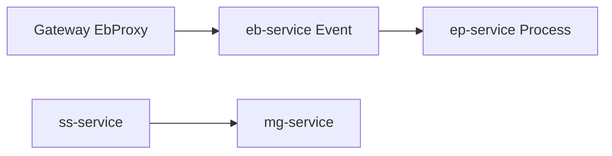

# 제30장. eb · ep · ss · mg (업무 WAR 4)

| 항목 | 내용 |
| --- | --- |
| **편** | 제9편 · 모듈별 레퍼런스 (Quick Start) |
| **에디션** | **Master** — 아키텍트·시니어·플랫폼 |
| **기반 원본** | [ztcfbook/제09편/30-업무-WAR-eb-ep-ss-mg.md](../ztcfbook/제09편/30-업무-WAR-eb-ep-ss-mg.md) |
| **입문서** | [ztcfbook-m](../ztcfbook-m/README.md) |
| **장** | 제30장 |
| **파일** | `제09편/30-업무-WAR-eb-ep-ss-mg.md` |
| **상태** | Master Edition (ztcfbook-h) |
| **목차** | [00-목차](../00-목차.md) |

---

## 아키텍처 뷰



---

## Master 해설

eb-service(EbEventHandler)는 이벤트 브릿지·배치성 ingress, ep-service(EpUserEventHandler)는 실시간 이벤트 처리 WAR입니다. ss·mg는 지원 도메인 Sample로 sv 패턴 parity를 유지합니다. Gateway EbProxy ingress는 REST surface처럼 보이나 내부는 Online TCF Handler dispatch로 귀결됩니다.

tcf-eai 동기 StandardRequest POST vs eb/ep 비동기 이벤트는 zarchitecture/14 tradeoff를 코드로 구현한 것이며, 동일 business rule 이중 구현은 drift·bug duplicate 위험이 큽니다. eb Batch-heavy Handler와 ep low-latency Handler는 SLA·TimeoutPolicy·감사 processingType 설계가 다릅니다.

점검: eb→ep E2E event, Gateway route to eb, ep processingType audit log, ss/mg sample Handler 6계층 compliance.

리뷰: online Handler에 이벤트 consumer logic 혼입 금지, 이벤트 payload vs StandardRequest header mapping 문서화.

---

## 구현 샘플 (코드베이스)

### EbEventHandler

```java
package com.nh.nsight.marketing.eb.entry.handler;

import com.nh.nsight.marketing.eb.entry.facade.EbEventFacade;
import com.nh.nsight.tcf.core.support.context.TransactionContext;
import com.nh.nsight.tcf.core.support.error.BusinessException;
import com.nh.nsight.tcf.core.support.error.ErrorCode;
import com.nh.nsight.tcf.core.support.message.StandardRequest;
import com.nh.nsight.tcf.core.support.transaction.TransactionHandler;
import java.util.Collection;
import java.util.List;
import java.util.Map;
import org.springframework.stereotype.Component;

/**
 * EB 이벤트 도메인 핸들러. EB.Event.* 거래를 한 핸들러가 처리한다(Service 도메인당 1개).
 */
@Component
public class EbEventHandler implements TransactionHandler {

    private static final String INQUIRY = "EB.Event.inquiry";

    private final EbEventFacade facade;

    public EbEventHandler(EbEventFacade facade) {
        this.facade = facade;
    }

    @Override
    public Collection<String> serviceIds() {
        return List.of(INQUIRY);
    }

    @Override
    public Object doHandle(StandardRequest<Map<String, Object>> request, TransactionContext context) {
        String serviceId = context.getHeader().getServiceId();
        return switch (serviceId) {
            case INQUIRY -> facade.inquiry(request.getBody(), context);
            default -> throw new BusinessException(ErrorCode.SERVICE_NOT_FOUND,
                    "EbEventHandler 미지원 serviceId: " + serviceId);
        };
    }
}

```

원본: [`eb-service/src/main/java/com/nh/nsight/marketing/eb/entry/handler/EbEventHandler.java`](../eb-service/src/main/java/com/nh/nsight/marketing/eb/entry/handler/EbEventHandler.java)

### EpUserEventHandler

```java
package com.nh.nsight.marketing.ep.entry.handler;

import com.nh.nsight.marketing.ep.entry.facade.EpUserEventFacade;
import com.nh.nsight.tcf.core.support.context.TransactionContext;
import com.nh.nsight.tcf.core.support.error.BusinessException;
import com.nh.nsight.tcf.core.support.error.ErrorCode;
import com.nh.nsight.tcf.core.support.message.StandardRequest;
import com.nh.nsight.tcf.core.support.transaction.TransactionHandler;
import java.util.Collection;
import java.util.List;
import java.util.Map;
import org.springframework.stereotype.Component;

/**
 * EP 사용자이벤트 도메인 핸들러. EP.UserEvent.* 거래를 한 핸들러가 처리한다(Service 도메인당 1개).
 */
@Component
public class EpUserEventHandler implements TransactionHandler {

    private static final String INQUIRY = "EP.UserEvent.inquiry";
    private static final String RECEIVE = "EP.UserEvent.receive";

    private final EpUserEventFacade facade;

    public EpUserEventHandler(EpUserEventFacade facade) {
        this.facade = facade;
    }

    @Override
    public Collection<String> serviceIds() {
        return List.of(INQUIRY, RECEIVE);
    }

    @Override
    public Object doHandle(StandardRequest<Map<String, Object>> request, TransactionContext context) {
        String serviceId = context.getHeader().getServiceId();
        return switch (serviceId) {
            case INQUIRY -> facade.inquiry(request.getBody(), context);
            case RECEIVE -> facade.receive(request.getBody(), context);
            default -> throw new BusinessException(ErrorCode.SERVICE_NOT_FOUND,
```

원본: [`ep-service/src/main/java/com/nh/nsight/marketing/ep/entry/handler/EpUserEventHandler.java`](../ep-service/src/main/java/com/nh/nsight/marketing/ep/entry/handler/EpUserEventHandler.java)

---

## Master Deep Dive — 업무 WAR eb·ep·ss·mg

- eb = 이벤트 브릿지·배치 Handler
- ep = 실시간 이벤트 처리
- ss/mg = 지원 도메인 Sample
- tcf-eai(동기) vs eb/ep(이벤트) 역할 분리

### 아키텍트 체크리스트

- 상단 **구현 샘플**을 실제 코드와 대조한다.
- **심화 참고**와 ztcfbook 본문 절 번호를 매핑한다.
- 운영·배포 관점은 ztcfbook-h Master 블록을 우선 본다.

---

## 심화 참고 (Master)

- [zguide/eb-service-개발가이드.md](../zguide/eb-service-개발가이드.md)
- [zguide/ep-service-개발가이드.md](../zguide/ep-service-개발가이드.md)
- [zarchitecture/14-이벤트-연계-아키텍처.md](../zarchitecture/14-이벤트-연계-아키텍처.md)

---

## 30.1 모듈 개요

9개 업무 WAR 중 **이벤트·시스템·관리 도메인 4종**입니다. eb/ep는 **이벤트 연계**, ss/mg는 **시스템·관리** 샘플을 제공합니다.

| WAR | 업무 | 포트 | Context | 특징 |
| --- | --- | --- | --- | --- |
| **eb-service** | Event Bridge | 8089 | `/eb` | Outbox → EP 발행 |
| **ep-service** | Event Processor | 8090 | `/ep` | 이벤트 수신·처리 |
| **ss-service** | System Service | 8093 | `/ss` | 시스템 공통 샘플 |
| **mg-service** | Management | 8096 | `/mg` | 관리·설정 샘플 |

공통 패턴: [제29장 §29.1](./29-업무-WAR-ic-pc-ms-sv-pd.md) — Handler 6계층, `/online`, tcf-eai(선택).

---

## 30.2 eb-service — Event Bridge

### 역할

사용자·이벤트 등록 후 **Outbox 패턴**으로 ep-service에 이벤트를 발행합니다.

```text
EB.User.create → EB_USER + EB_EVENT(READY)
@Scheduled 배치 → POST ep-service /ep/online (EP.UserEvent.receive)
성공/실패 → EB_EVENT = SENT / FAIL
```

### Quick Start

```bash
gradle :eb-service:bootRun

curl -X POST http://127.0.0.1:8089/eb/online \
  -H "Content-Type: application/json" \
  -d @tcf-ui/src/main/resources/sample-requests/eb-sample-inquiry.json
```

UI: http://localhost:8099/eb/index.html

### 주요 Handler

| Handler | serviceId | 거래코드 |
| --- | --- | --- |
| EbSampleHandler | `EB.Sample.inquiry` | EB-INQ-0001 |
| EbUserHandler | `EB.User.inquiry`, `EB.User.create` | EB-USR-* |
| EbEventHandler | `EB.Event.inquiry` | EB-EVT-0001 |
| EbBatchHandler | `EB.Batch.inquiry` | EB-BAT-0001 |

### 주요 테이블

| 테이블 | 역할 |
| --- | --- |
| `EB_USER` | 사용자 |
| `EB_EVENT` | EP 발행 대기 (`READY` / `SENT` / `FAIL`) |

### EB → EP 연동

- **클라이언트:** `EpOnlineClient` — `POST /ep/online`
- **스케줄러:** `EbEventPublishScheduler` (기본 60초)
- **설정:** `nsight.eb.event-publish` → EP URL 8090

> WAR 간 Java 직접 참조 금지. tcf-eai 도입 시 동일 HTTP 패턴 적용 가능.

---

## 30.3 ep-service — Event Processor

### 역할

EB에서 발행한 이벤트를 **수신·처리**합니다.

| Handler | serviceId |
| --- | --- |
| EpSampleHandler | `EP.Sample.inquiry` |
| EpUserEventHandler | `EP.UserEvent.receive` |

### Quick Start

```bash
gradle :ep-service:bootRun
# EB + EP 동시 기동 후 EB.User.create → Scheduler → EP.UserEvent.receive 확인
```

End-to-End: EB create → `EB_EVENT.READY` → Scheduler → EP receive → `SENT`

아키텍처: [zarchitecture/14-이벤트-연계-아키텍처.md](../../zarchitecture/14-이벤트-연계-아키텍처.md)

---

## 30.4 ss-service — System Service

| 항목 | 값 |
| --- | --- |
| 포트 | 8093 |
| Context | `/ss` |
| 용도 | 시스템 공통·인프라 연동 샘플 WAR |

```bash
gradle :ss-service:bootRun
curl -X POST http://127.0.0.1:8093/ss/online ...
```

신규 거래 prefix: **`SS.`** — ic/sv와 동일 Handler 패턴.

---

## 30.5 mg-service — Management

| 항목 | 값 |
| --- | --- |
| 포트 | 8096 |
| Context | `/mg` |
| 용도 | 관리·설정·내부 운영 샘플 WAR |

```bash
gradle :mg-service:bootRun
```

신규 거래 prefix: **`MG.`**

OM(`tcf-om`)과 역할 구분: **OM = 플랫폼 운영 메타**, **mg = 업무 관리 도메인**(설계 확장 시).

---

## 30.6 이벤트 WAR vs tcf-eai

| 패턴 | 적합 |
| --- | --- |
| **tcf-eai** | 동기 요청-응답 (SV→IC 조회) |
| **EB/EP Outbox** | 비동기 이벤트, 재시도, SENT/FAIL 추적 |
| **Batch Scheduler** | 주기적 대량 처리 |

이벤트 연계 상세: [제5편 §17.4](../제05편/17-Batch-Scheduler-이벤트.md)

---

## 장 요약 (Master)

**eb/ep**는 Outbox 기반 이벤트 발행·수신의 참조 구현이고, **ss/mg**는 시스템·관리 도메인 확장용 샘플 WAR입니다. 4 WAR 모두 `POST /{code}/online` + Handler 6계층 패턴을 따르며, EB→EP는 Scheduler + HTTP로 End-to-End 검증합니다.

> Master Edition: **아키텍처 뷰** → **Master 해설** → **구현 샘플** → **Master Deep Dive** → **심화 참고** 순으로 본문과 함께 읽는다.

---

## 이전 · 다음

| | |
| --- | --- |
| ← 이전 | [제29장 ic · pc · ms · sv · pd](./29-업무-WAR-ic-pc-ms-sv-pd.md) |
| → 다음 | [제31장 공식 설계안 매핑](../제10편/31-공식-설계안-매핑.md) |

---

## 출처 색인 · Master 확장

| 구분 | 경로 |
| --- | --- |
| ztcfbook-h | 본 파일 |
| ztcfbook | `../ztcfbook/제09편/30-업무-WAR-eb-ep-ss-mg.md` |

### 원본 출처


| 절 | 출처 |
| --- | --- |
| 30.1~30.2 | [zguide/eb-service-개발가이드.md](../../zguide/eb-service-개발가이드.md) |
| 30.3 | [zguide/ep-service-개발가이드.md](../../zguide/ep-service-개발가이드.md) |
| 30.4~30.5 | [zguide/ss-service-개발가이드.md](../../zguide/ss-service-개발가이드.md), [mg-service-개발가이드.md](../../zguide/mg-service-개발가이드.md) |
| 30.6 | [zarchitecture/14-이벤트-연계-아키텍처.md](../../zarchitecture/14-이벤트-연계-아키텍처.md) |
