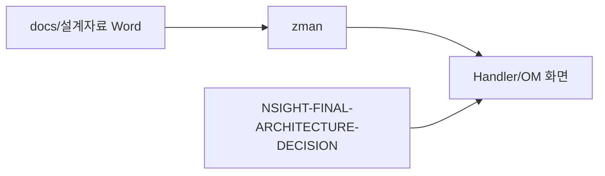

# 제31장. 공식 설계안 매핑

| 항목 | 내용 |
| --- | --- |
| **편** | 제10편 · 설계 근거와 로드맵 |
| **에디션** | **Master** — 아키텍트·시니어·플랫폼 |
| **기반 원본** | [ztcfbook/제10편/31-공식-설계안-매핑.md](../ztcfbook/제10편/31-공식-설계안-매핑.md) |
| **입문서** | [ztcfbook-m](../ztcfbook-m/README.md) |
| **장** | 제31장 |
| **파일** | `제10편/31-공식-설계안-매핑.md` |
| **상태** | Master Edition (ztcfbook-h) |
| **목차** | [00-목차](../00-목차.md) |

---

## 아키텍처 뷰



---

## Master 해설

docs/설계자료 Word 20+→zman→zarchitecture→Handler·OM 화면 3-way traceability는 감사·인증·레거시 장애 대응의 기본 도구입니다. NSIGHT-FINAL-ARCHITECTURE-DECISION ADR은 Handler 중심·Online Endpoint·tcf-om SoT 등 최종 아키텍처 결정 근거를 코드 review dispute 시 인용합니다.

OmDashboardHandler 등 OM 화면 ServiceId와 Word 절 번호 매핑 표는 Gap 식별 출발점입니다. 설계-only CC/BC/CM WAR는 코드 grep 0건이 정상이며 zman/00-설계서-코드베이스-대조표에 명시됩니다. Word revision→zman diff→ztcfbook 갱신 절차가 어긋나면 "설계서상 필수·코드 optional" friction이 생깁니다.

아키텍트 deliverable: framework change 시 ADR append, OM UI screenshot↔Handler↔Word 절 삼각 링크, 설계 MR에 Word anchor citation.

리뷰: ADR conflict check, OM Catalog row vs design transaction list, Gap은 제32장 cross-ref.

---

## 구현 샘플 (코드베이스)

### OmDashboardHandler

```java
package com.nh.nsight.marketing.om.entry.handler;

import com.nh.nsight.marketing.om.entry.facade.OmDashboardFacade;
import com.nh.nsight.tcf.core.support.context.TransactionContext;
import com.nh.nsight.tcf.core.support.error.BusinessException;
import com.nh.nsight.tcf.core.support.error.ErrorCode;
import com.nh.nsight.tcf.core.support.message.StandardRequest;
import com.nh.nsight.tcf.core.support.transaction.TransactionHandler;
import java.util.Collection;
import java.util.List;
import java.util.Map;
import org.springframework.stereotype.Component;

/**
 * OM 대시보드 도메인 핸들러. OM.Dashboard.* 거래를 한 핸들러가 처리한다(Service 도메인당 1개).
 */
@Component
public class OmDashboardHandler implements TransactionHandler {

    private static final String INQUIRY = "OM.Dashboard.inquiry";
    private static final String RESET = "OM.Dashboard.reset";

    private final OmDashboardFacade facade;

    public OmDashboardHandler(OmDashboardFacade facade) {
        this.facade = facade;
    }

    @Override
    public Collection<String> serviceIds() {
        return List.of(INQUIRY, RESET);
    }

    @Override
    public Object doHandle(StandardRequest<Map<String, Object>> request, TransactionContext context) {
```

원본: [`tcf-om/src/main/java/com/nh/nsight/marketing/om/entry/handler/OmDashboardHandler.java`](../tcf-om/src/main/java/com/nh/nsight/marketing/om/entry/handler/OmDashboardHandler.java)

---

## Master Deep Dive — 공식 설계안 매핑

- Word → zman → zarchitecture → code 3-way
- ADR 최종 아키텍처 결정 문서
- OM 화면 ↔ Handler ↔ Word 절 매핑
- Gap은 제32장·zman/23 참조

### 아키텍트 체크리스트

- 상단 **구현 샘플**을 실제 코드와 대조한다.
- **심화 참고**와 ztcfbook 본문 절 번호를 매핑한다.
- 운영·배포 관점은 ztcfbook-h Master 블록을 우선 본다.

---

## 심화 참고 (Master)

- [docs/설계자료/README.md](../docs/설계자료/README.md)
- [docs/architecture/52-om-operations.md](../docs/architecture/52-om-operations.md)
- [zman/00-설계서-코드베이스-대조표.md](../zman/00-설계서-코드베이스-대조표.md)

---

## 31.1 20+ Word 설계안 목록·주제

NSIGHT TCF의 **공식 설계안(Word)** 은 `docs/설계자료/`에 보관됩니다. 구현·운영 시 설계안과 `docs/architecture/` Markdown, `zman/`, `znsight-man/`을 **함께** 참고합니다.

### 문서 계층

```text
공식 설계안 (Word, docs/설계자료/)
    ↓ 매핑
docs/architecture/ (아키텍처 정의서 01~53)
    ↓ 요약
zman/ (설계서 장별 설명)
    ↓ 실무
znsight-man/ (개발 매뉴얼 78장)
    ↓ Quick Start
zguide/ (모듈별 가이드 22종)
    ↓ 통합
ztcfbook/ (본 책)
```

### 설계안 목록 (주제별)

| 설계안 | 주제 | 구현 모듈 |
| --- | --- | --- |
| NSIGHT TCF Framework 설계안 | 프레임워크 전체·TCF 흐름 | tcf-util, tcf-core, tcf-web, *-service, tcf-om |
| NSIGHT 거래통제 설계안 | Header 7필드 Allow-List | tcf-core, tcf-web, tcf-om |
| 서비스별 Timeout 설계안 | Timeout 종류·기본값 | tcf-core, tcf-web |
| TCF Framework 타임아웃 관리 설계안 | Timeout 적용·OM 화면 | tcf-core, tcf-om, tcf-ui |
| NSIGHT 거래로그 관리 설계안 | PROCESSING→SUCCESS/FAIL | tcf-core, tcf-web, tcf-gateway |
| NSIGHT 공통전문조립 설계안 | StandardResponse·마스킹 | tcf-core (ETF) |
| NSIGHT 오류코드·메시지 설계안 | E-{DOMAIN}-* | tcf-core, tcf-om |
| TCF Framework 세션관리 설계안 | Spring Session JDBC | tcf-core, tcf-web, tcf-om, tcf-gateway |
| TCF Framework Cache 관리 설계안 | EhCache·OM Cache | tcf-cache, tcf-om |
| NSIGHT 서비스 ID 관리 설계안 | ServiceId·Handler Registry | tcf-core, tcf-om |
| NSIGHT 사용자 정보관리 설계안 | 사용자·권한·세션 | tcf-om, tcf-ui, tcf-uj |
| NSIGHT 기능권한 설계안 | CRUD·다운로드 권한 | tcf-om, tcf-ui |
| NSIGHT 메뉴관리 설계안 | 메뉴 트리 | tcf-om, tcf-ui |
| NSIGHT 공통코드 관리 설계안 | 공통코드·캐시 | tcf-cache, tcf-om |
| TCF Framework 파일관리 설계안 | UD 업·다운로드 | tcf-om `/ud/files` |
| NSIGHT 환경설정 조회 설계안 | Runtime·Profile | tcf-om |
| TCF Framework 운영 대시보드 설계안 | AP/DB/세션/TPS | tcf-om, tcf-batch, tcf-ui |
| TCF Framework 헬스체크 설계안 | Liveness/Readiness | tcf-web, tcf-batch |
| TCF Framework 배포관리 설계안 | CI/CD·Rolling | tcf-cicd, ztomcat |
| NSIGHT 배치·스케줄러 설계안 | Job·Execution | tcf-batch, tcf-om |

아키텍처 Markdown 보조 문서(42~53): JWT, Gateway, 관측성, DR, 연동 Contract, 테스트, 명명규칙 등.

---

## 31.2 설계안 ↔ 코드 ↔ OM 화면

설계안의 **운영 요구**는 대부분 **tcf-om Admin 화면**으로 구현됩니다.

### OM 화면 매핑

| OM 화면 | serviceId (예) | 설계안 |
| --- | --- | --- |
| dashboard.html | `OM.Dashboard.inquiry` | 운영 대시보드 |
| transaction-log.html | `OM.TransactionLog.inquiry` | 거래로그 관리 |
| service-catalog.html | `OM.ServiceCatalog.*` | 서비스 ID 관리 |
| transaction-control.html | `OM.TransactionControl.*` | 거래통제 |
| timeout-policy.html | `OM.TimeoutPolicy.*` | Timeout 관리 |
| user-auth.html | `OM.User.*`, `OM.AuthGroup.*` | 사용자·기능·메뉴 |
| common-code.html | `OM.CommonCode.*` | 공통코드 |
| error-code.html | `OM.ErrorCode.*` | 오류코드·메시지 |
| cache.html | `OM.Cache.*` | Cache 관리 |
| session.html | `OM.Session.*` | 세션관리 |
| batch.html | `OM.Batch.*` | 배치·스케줄러 |
| deploy.html | `OM.Deploy.*` | 배포관리 |
| file-management.html | `/ud/files` (REST) | 파일관리 |
| system-config.html | `OM.SystemConfig.inquiry` | 환경설정 조회 |

### 코드 매핑 예 — 거래통제

```text
설계안: Header 7필드 Allow-List
    ↓
docs/architecture/40-header-7-transaction-control.md
    ↓
tcf-core: TransactionControlService, StandardHeaderValidator
tcf-om: OmTransactionControlHandler, transaction-control.html
tcf-web: OnlineTransactionController (STF 호출)
```

### 코드 매핑 예 — ServiceId Catalog

```text
설계안: NSIGHT 서비스 ID 관리
    ↓
tcf-om: OmServiceCatalogHandler, data.sql, ServiceCatalogSeedData
tcf-core: TransactionDispatcher (Handler Registry)
업무 WAR: {Domain}Handler.serviceIds()
```

### 플랫폼 모듈 ↔ 설계안

| 모듈 | README | 관련 설계안 |
| --- | --- | --- |
| tcf-core | [tcf-core/README.md](../../tcf-core/README.md) | Framework, 거래통제, Timeout, 거래로그 |
| tcf-web | [tcf-web/README.md](../../tcf-web/README.md) | Framework, 세션, JWT Filter |
| tcf-om | [tcf-om/README.md](../../tcf-om/README.md) | OM 전반 |
| tcf-gateway | [tcf-gateway/README.md](../../tcf-gateway/README.md) | 세션 관문, 거래로그 |
| tcf-jwt | [tcf-jwt/README.md](../../tcf-jwt/README.md) | JWT (architecture/42) |
| tcf-eai | [tcf-eai/README.md](../../tcf-eai/README.md) | 연동 Contract (46) |

---

## 31.3 ADR·최종 아키텍처 결정

### NSIGHT Final Architecture Decision (FAD)

확정일 **2026-06-28**, 상태 **Approved**. [docs/NSIGHT-FINAL-ARCHITECTURE-DECISION.md](../../docs/architecture/NSIGHT-FINAL-ARCHITECTURE-DECISION.md)

| No | 확정 항목 | 한 줄 결정 |
| --- | --- | --- |
| 1 | 전체 요청 흐름 | 채널 → **tcf-uj** → **tcf-gateway** → 업무 WAR/OM |
| 2 | Gateway | **단일 진입** — 라우팅·세션 관문, 세션 **비소유** |
| 3 | 세션 | **SESSIONDB** 공유, Gateway 4단계 검증 |
| 4 | Tomcat 배포 | 업무그룹별 WAR 분리, ztomcat/K8s |
| 5 | serviceId / businessCode | businessCode=배포·라우팅, serviceId=Handler |
| 6 | OM | 운영 메타·세션·로그 — 업무 거래 아님 |
| 7 | DB | RDW/ADW=업무, SESSIONDB=세션, LOGDB=로그 |

### End-to-End (운영 표준)

```text
브라우저 → tcf-uj(8102) → tcf-gateway(8100)
         → TCF_GATEWAY_ROUTE → sv-service(8086/sv/online)
         → TCF.process() → Handler → ETF
```

성공 판단: HTTP Status가 아니라 **`result.resultCode == "S0000"`** (또는 `0000`).

### 설계안 vs 코드 대조

| 주제 | 설계안 | 코드 현황 | 비고 |
| --- | --- | --- | --- |
| Handler | serviceId당 1 | **도메인당 1**, serviceIds() | Gap 축소 ✅ |
| OM Handler | 83 | **24** | Gap 축소 ✅ |
| EAI | 설계 | **tcf-eai** | Gap 축소 ✅ |
| WAR | 17 목표 | **9** 구현 | [제32장](./32-Gap-보완-향후-과제.md) |
| Idempotency | 설계 | 부분 | P1 보완 |
| Gateway Route DB | 운영 | local H2 / Oracle | P2 |

상세 Gap: [zman/00-설계서-코드베이스-대조표.md](../../zman/00-설계서-코드베이스-대조표.md)

### ADR 활용법

1. **신규 기능** — FAD 원칙 위반 여부 먼저 확인
2. **설계안 변경** — Word + docs/architecture + zman 동시 갱신
3. **OM 화면** — 설계안 ↔ serviceId ↔ Handler 3자 정합
4. **코드 리뷰** — FAD·설계안·매뉴얼 불일치 시 반려

---

## 장 요약 (Master)

`docs/설계자료/`의 **20+ Word 설계안**은 docs/architecture·zman·znsight-man·zguide·ztcfbook으로 계층화되어 있습니다. 운영 기능은 **tcf-om Admin 화면 + serviceId**로 매핑되고, **FAD(2026-06-28)** 가 Gateway·세션·WAR·DB의 최종 아키텍처 결정입니다. 설계안↔코드↔OM 3자 정합을 유지하는 것이 프레임워크 거버넌스의 핵심입니다.

> Master Edition: **아키텍처 뷰** → **Master 해설** → **구현 샘플** → **Master Deep Dive** → **심화 참고** 순으로 본문과 함께 읽는다.

---

## 이전 · 다음

| | |
| --- | --- |
| ← 이전 | [제30장 eb · ep · ss · mg](../제09편/30-업무-WAR-eb-ep-ss-mg.md) |
| → 다음 | [제32장 Gap·보완·향후 과제](./32-Gap-보완-향후-과제.md) |

---

## 출처 색인 · Master 확장

| 구분 | 경로 |
| --- | --- |
| ztcfbook-h | 본 파일 |
| ztcfbook | `../ztcfbook/제10편/31-공식-설계안-매핑.md` |

### 원본 출처


| 절 | 출처 |
| --- | --- |
| 31.1 | [docs/설계자료/README.md](../../docs/설계자료/README.md) |
| 31.2 | [docs/architecture/52-om-operations.md](../../docs/architecture/52-om-operations.md), [zarchitecture/05-운영관리-OM-아키텍처.md](../../zarchitecture/05-운영관리-OM-아키텍처.md) |
| 31.3 | [docs/NSIGHT-FINAL-ARCHITECTURE-DECISION.md](../../docs/architecture/NSIGHT-FINAL-ARCHITECTURE-DECISION.md), [zman/00-설계서-코드베이스-대조표.md](../../zman/00-설계서-코드베이스-대조표.md) |
