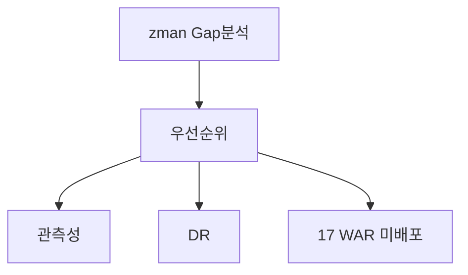

# 제32장. Gap·보완·향후 과제

| 항목 | 내용 |
| --- | --- |
| **편** | 제10편 · 설계 근거와 로드맵 |
| **에디션** | **Master** — 아키텍트·시니어·플랫폼 |
| **기반 원본** | [ztcfbook/제10편/32-Gap-보완-향후-과제.md](../ztcfbook/제10편/32-Gap-보완-향후-과제.md) |
| **입문서** | [ztcfbook-m](../ztcfbook-m/README.md) |
| **장** | 제32장 |
| **파일** | `제10편/32-Gap-보완-향후-과제.md` |
| **상태** | Master Edition (ztcfbook-h) |
| **목차** | [00-목차](../00-목차.md) |

---

## 아키텍처 뷰



---

## Master 해설

zman/23 소스 Gap 분석과 zman/24 보완과제 우선순위는 nsight-tcf-framework의 공식 로드맵 SoT입니다. 설계서 17업무 WAR 대비 코드 9 WAR 배포, CC·BC·CM 미구현, Observability metrics 통합 export 미완, DR·Rollback 자동화 부분 구현 등이 rank되어 있으며, 코드베이스 TODO comment만으로 우선순위를 정하면 설계·운영과 어긋납니다.

Observability Gap은 tcf-batch→OM Dashboard feed는 존재하나 guid/traceId 기반 cross-WAR tracing export·alert 연동이 미완입니다. DR Gap은 cicd-deploy 실패 시 수동 WAR version pin rollback, OMDB backup·restore runbook partial 상태입니다. 제31장 설계안 매핑과 함께 Gap closure evidence(smoke·metric·runbook) 없이 "완료" 선언하지 않습니다.

향후 17업무 WAR 확장 시 Gradle settings.gradle, Gateway ProxyController·ROUTING_TABLE, ztomcat deploy-wars.sh, OM seed blast radius를 사전 estimate해야 STF~ETF·Catalog·통제 일괄 누락을 막을 수 있습니다. docs/architecture/44~45 observability·DR ADR과 zman/24 priority를 분기 review에서 delta 갱신하십시오.

아키텍트 분기 점검: Gap list 변경분, smoke coverage vs closed Gap, 미배포 BC Header 사용 incident postmortem 반영.

---

## 구현 샘플 (코드베이스)

### Gap 분석 (zman)

```markdown
# 23장. 소스 Gap 분석 — 설명

## 설계서 절 목차

23.1~23.2 개요 · 23.3 강점 · 23.4 목표 · 23.5 영역별 Gap · 23.6~23.7 우선순위·요약 · 23.8~23.9 마무리·시사점

---

## 핵심 결론

| | |
|---|---|
| **현재** | TCF 골격·표준전문·Dispatcher·OM·Gateway·JWT·Cache **보유** |
| **운영** | 보안·기준정보 운영·CI/CD·17 WAR·품질 Gate **보강** |

---

## 현재 강점 (23.3)

- Gradle 멀티 모듈 (tcf-* + 9 WAR)  
- STF/Dispatcher/ETF  
- **도메인 Handler** (tcf-om 24개)  
- **tcf-eai** IC↔SV  
- tcf-gateway, jwt, batch, cache, ztomcat  
- docs / zdoc / **zman**  

## Gap 축소 (최근)

| 항목 | 이전 | 현재 |
|------|------|------|
| Handler | serviceId당 1 | **도메인당 1**, serviceIds() |
| OM Handler | 83 | **24** |
| EAI | 설계 | **tcf-eai** |
| 문서 | docx | **zman+docs** |

## 목표 운영 (23.4)

36K user / 43K session / TPS 720 / P95 3s / 99.99%  
Apache, Tomcat, Session JDBC, RDW/ADW, GitLab CI/CD, **17 WAR**

```

원본: [`zman/23-소스Gap분석.md`](../zman/23-소스Gap분석.md)

### 보완과제 우선순위

```markdown
# 24장. 보완 과제 및 우선순위 — 설명

## 설계서 절 목차

24.1~24.2 개요 · 24.3~24.4 **P1** · 24.5~24.6 **P2** · 24.7 **P3** · 24.8 매트릭스 · 24.9 로드맵 · 24.10~24.12 역할·산출물·PMO · 24.13~24.14 마무리

---

## 우선순위

| | 의미 |
|---|------|
| **P1** | 운영 반영 **전 필수** |
| **P2** | 운영 **안정성** |
| **P3** | **확장·생산성** |

---

## P1 (24.3~24.4)

| ID | 과제 | 완료 기준 |
|----|------|-----------|
| P1-1 | 보안·인가 | JWT+세션, Header 위변조, Internal Call |
| P1-2 | Session JDBC | 43K session, DR, 다중 WAR |
| P1-3 | Catalog·TC | OM Allow-List 실운영 |
| P1-4 | TX·감사로그 | PROCESSING→종료, UNKNOWN |
| P1-5 | CI/CD | Build, Test, Deploy, Health, Rollback |

## P2 (24.5~24.6)

Gateway Route · Cache Evict · Batch Lock/이력 · File 감사 · Hikari/MyBatis · Dashboard

## P3 (24.7)

17 WAR · Handler 템플릿 · tcf-eai 확대 · SonarQube · docs↔OM

**완료:** 도메인 Handler, serviceIds(), tcf-eai 데모, zman/docs

## 매트릭스 (24.8)

```

원본: [`zman/24-보완과제-우선순위.md`](../zman/24-보완과제-우선순위.md)

---

## Master Deep Dive — Gap · 보완 · 향후 과제

- CC/BC/CM 등 설계-only WAR
- Observability·Metrics Gap
- DR·Rollback 자동화 미완
- 로드맵 = zman/24 우선순위 따름

### 아키텍트 체크리스트

- 상단 **구현 샘플**을 실제 코드와 대조한다.
- **심화 참고**와 ztcfbook 본문 절 번호를 매핑한다.
- 운영·배포 관점은 ztcfbook-h Master 블록을 우선 본다.

---

## 심화 참고 (Master)

- [zman/23-소스Gap분석.md](../zman/23-소스Gap분석.md)
- [zman/24-보완과제-우선순위.md](../zman/24-보완과제-우선순위.md)
- [docs/architecture/44-observability.md](../docs/architecture/44-observability.md)
- [docs/architecture/45-disaster-recovery.md](../docs/architecture/45-disaster-recovery.md)

---

## 32.1 설계서 vs 코드 Gap

### 핵심 결론

| | 내용 |
| --- | --- |
| **현재** | TCF 골격·표준전문·Dispatcher·OM·Gateway·JWT·Cache **보유** |
| **운영** | 보안·기준정보 운영·CI/CD·17 WAR·품질 Gate **보강 필요** |

NSIGHT TCF는 **프레임워크 골격은 설계와 정합**하나, **운영 가능 수준**까지는 Gap이 남아 있습니다. "코드가 없다"기보다 **운영 프로세스·확장·품질 Gate**가 과제입니다.

### 현재 강점

- Gradle 멀티 모듈 (tcf-* + 9 WAR)
- STF / Dispatcher / ETF 파이프라인
- **도메인 Handler** (tcf-om 24개, serviceIds() 패턴)
- **tcf-eai** IC↔SV 연동 데모
- tcf-gateway, jwt, batch, cache, ztomcat
- docs / zdoc / **zman** / znsight-man / zguide / **ztcfbook**

### Gap 축소 (최근)

| 항목 | 이전 | 현재 |
| --- | --- | --- |
| Handler | serviceId당 1개 | **도메인당 1**, serviceIds() |
| OM Handler | 83개 | **24개** |
| EAI | 설계만 | **tcf-eai** 구현 |
| 문서 | Word docx | **zman + docs + ztcfbook** |

### 목표 운영 규모 (설계 기준)

| 지표 | 목표 |
| --- | --- |
| 사용자 | 36K |
| 동시 세션 | 43K |
| TPS | 720 |
| P95 | 3초 |
| 가용성 | 99.99% |
| WAR | **17** (현재 9) |

### 영역별 Gap

| 영역 | Gap | 우선순위 |
| --- | --- | --- |
| 업무 WAR | 9 → 17 확장 | P3 |
| TCF Core | Idempotency, 마스킹, 감사정책 운영화 | P1~P2 |
| OM | UI·프로세스 **실운영 검증** | P1 |
| Gateway | Route DB 운영·동기화 | P2 |
| JWT/SSO | IdP 연동, Token 정책 | P1 |
| DB/MyBatis | RDW/ADW 분리, SQL 표준 | P2 |
| Spring | prd Profile, Secret Vault | P1 |
| CI/CD | SonarQube, Nexus, Pipeline 완성 | P1 |

---

## 32.2 보완 우선순위

### 우선순위 정의

| 등급 | 의미 |
| --- | --- |
| **P1** | 운영 반영 **전 필수** |
| **P2** | 운영 **안정성** |
| **P3** | **확장·생산성** |

### P1 — 운영 반영 전 필수

| ID | 과제 | 완료 기준 |
| --- | --- | --- |
| P1-1 | 보안·인가 | JWT+세션, Header 위변조 차단, Internal Call 통제 |
| P1-2 | Session JDBC | 43K session, DR, 다중 WAR 공유 |
| P1-3 | Catalog·TC | OM Allow-List **실운영** 등록·검증 |
| P1-4 | TX·감사로그 | PROCESSING→종료, UNKNOWN 처리 |
| P1-5 | CI/CD | Build, Test, Deploy, Health, **Rollback** |

### P2 — 운영 안정성

- Gateway Route 운영 DB·Evict
- Cache Evict OM 연동
- Batch Lock/이력·재처리
- File 업·다운로드 감사
- Hikari/MyBatis SQL 표준·Slow Query
- 운영 Dashboard·알람

### P3 — 확장·생산성

- **17 WAR** 확장 (Handler 템플릿)
- tcf-eai 연동 범위 확대
- SonarQube Quality Gate 정착
- docs ↔ OM 화면 자동 정합

**이미 완료:** 도메인 Handler, serviceIds(), tcf-eai 데모, zman/docs/ztcfbook

### 우선순위 매트릭스

| 영역 | P1 | P2 | P3 |
| --- | ---: | ---: | ---: |
| 보안·세션 | ● | ○ | |
| TC·Timeout·로그 | ● | ○ | |
| CI/CD | ● | ○ | |
| Gateway·Cache·Batch | | ● | ○ |
| Handler·WAR 확장 | | ○ | ● |

---

## 32.3 17업무 WAR 확장·관측성·DR

### 17 WAR 로드맵

현재 **9 WAR** (ic, pc, ms, sv, pd, eb, ep, ss, mg) + 플랫폼. 설계 목표 **17 WAR**는 업무 도메인 추가에 따른 확장입니다.

| 단계 | 내용 |
| --- | --- |
| 1 | 9 WAR Handler·Catalog·테스트 **표준화** (sv 템플릿) |
| 2 | 신규 8 WAR — Gradle 모듈·6계층·OM Seed |
| 3 | Gateway Route·ztomcat 그룹 배포 |
| 4 | tcf-eai 연동 Contract 확대 |

신규 WAR 추가 체크: [부록 K](../부록/K-모듈-포트-Context-WAR-매핑표.md), [znsight-man/09-업무-WAR-구조.md](../../znsight-man/09-업무-WAR-구조.md)

### 관측성 (Observability)

| 영역 | 현재 | 목표 |
| --- | --- | --- |
| 거래로그 | TCF_TX_LOG, OM 조회 | Gateway↔WAR GUID 연계 |
| 메트릭 | tcf-batch 수집 | Prometheus/Grafana (P2) |
| 헬스 | Actuator | Liveness/Readiness/Deep/Smoke |
| 대시보드 | OM Dashboard | TPS·P95·Timeout 실시간 |
| 추적 | GUID, TraceId MDC | 분산 추적(OpenTelemetry, P3) |

문서: [docs/architecture/44-observability.md](../../docs/architecture/44-observability.md)

### DR (Disaster Recovery)

| 영역 | 과제 |
| --- | --- |
| SESSIONDB | JDBC 복제·Failover |
| RDW/ADW | 백업·Point-in-Time Recovery |
| LOGDB | 보존 정책·아카이브 |
| WAR | Rolling Deploy + **Rollback** (tcf-cicd) |
| Gateway | Route DB 백업 |

문서: [docs/architecture/45-disaster-recovery.md](../../docs/architecture/45-disaster-recovery.md)

### 로드맵 3단계

```text
Phase 1 (P1) — "안전하게 올라가는가?"
  → 보안·세션·Catalog·TC·CI/CD·Rollback

Phase 2 (P2) — "장애를 보고·조치할 수 있는가?"
  → Gateway·Cache·Batch·Dashboard·SQL 표준

Phase 3 (P3) — "같은 방식으로 확산할 수 있는가?"
  → 17 WAR·Handler 템플릿·SonarQube·EAI·관측성 고도화
```

### PMO 관점

| | 현재 | 목표 |
| --- | --- | --- |
| WAR | 9 | 17 |
| Handler | 도메인 패턴 ✅ | 전 WAR 동일 |
| CI | 골격 | Full Pipeline |
| 문서 | ztcfbook ✅ | OM↔docs 자동 sync |

### 성공 기준

1. **통제** — 모든 serviceId OM Catalog·거래통제 등록
2. **설명** — 장애 시 GUID→로그→SQL 추적 가능
3. **확장** — sv 샘플 복제로 신규 WAR·거래 2주 내 추가

---

## 장 요약 (Master)

설계서 대비 코드는 **TCF 골격·Handler·EAI·문서화**에서 Gap이 크게 줄었고, 남은 과제는 **운영 가능성**(P1: 보안·세션·Catalog·CI/CD)과 **확장**(P3: 17 WAR)입니다. P1→P2→P3 로드맵으로 관측성·DR·Gateway Route를 단계적으로 보완하며, sv-service 표준 샘플을 템플릿으로 전 WAR에 확산하는 것이 향후 과제의 핵심입니다.

> Master Edition: **아키텍처 뷰** → **Master 해설** → **구현 샘플** → **Master Deep Dive** → **심화 참고** 순으로 본문과 함께 읽는다.

---

## 이전 · 다음

| | |
| --- | --- |
| ← 이전 | [제31장 공식 설계안 매핑](./31-공식-설계안-매핑.md) |
| → 다음 | [부록 A](../부록/A-업무코드-표준표.md) |

---

## 출처 색인 · Master 확장

| 구분 | 경로 |
| --- | --- |
| ztcfbook-h | 본 파일 |
| ztcfbook | `../ztcfbook/제10편/32-Gap-보완-향후-과제.md` |

### 원본 출처


| 절 | 출처 |
| --- | --- |
| 32.1 | [zman/23-소스Gap분석.md](../../zman/23-소스Gap분석.md), [zman/00-설계서-코드베이스-대조표.md](../../zman/00-설계서-코드베이스-대조표.md) |
| 32.2 | [zman/24-보완과제-우선순위.md](../../zman/24-보완과제-우선순위.md) |
| 32.3 | [docs/architecture/44-observability.md](../../docs/architecture/44-observability.md), [45-disaster-recovery.md](../../docs/architecture/45-disaster-recovery.md), [architecture.md §3](../../docs/architecture/architecture.md) |
