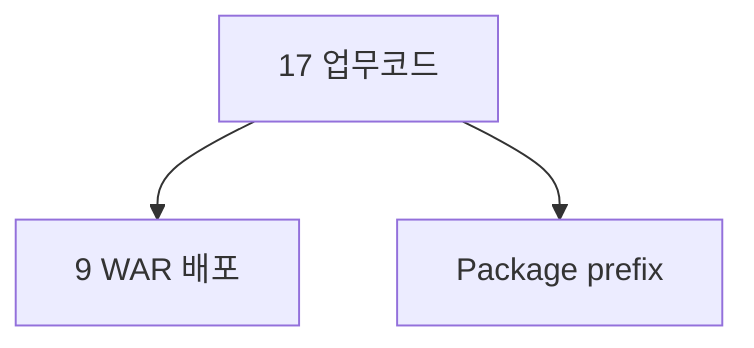

# 부록 A. 업무코드 표 (9 WAR)

| **부록** | A |
| **상태** | 집필 완료 |
| **원본** | [ztcfbook 부록 A](../ztcfbook/부록/A-업무코드-표준표.md) |

---

## 그림으로 보기

---

## 배포 중인 업무 WAR (develop 기준)

| 코드 | 이름 | Context | 로컬 포트 |
| --- | --- | --- | --- |
| IC | 통합고객 | /ic | 8082 |
| PC | 개인고객 | /pc | 8083 |
| MS | 미니 싱글뷰 | /ms | 8085 |
| SV | Single View | /sv | 8086 |
| PD | 상품 | /pd | 8087 |
| EB | 이벤트 마케팅 | /eb | 8089 |
| EP | 이벤트 처리 | /ep | 8090 |
| SS | 영업지원 | /ss | 8093 |
| MG | 메시지 | /mg | 8096 |
| OM | 운영관리 | /om | 8097 |

**플랫폼:** Gateway 8100, tcf-ui 8099, JWT 8110, batch 8098 — [부록 K](./K-포트-모듈-한눈에.md) 전체 표

---

## 한 줄 규칙

- 코드 **대문자 2자** → Context **소문자** `/sv` → WAR **`sv.war`**
- Online 주소: **`POST /{코드소문자}/online`**

설계상 17코드(CC, CM, BC …)는 **원본 부록 A** 참고.

---

## 📘 원본

- [ztcfbook/부록/A-업무코드-표준표.md](../ztcfbook/부록/A-업무코드-표준표.md)
