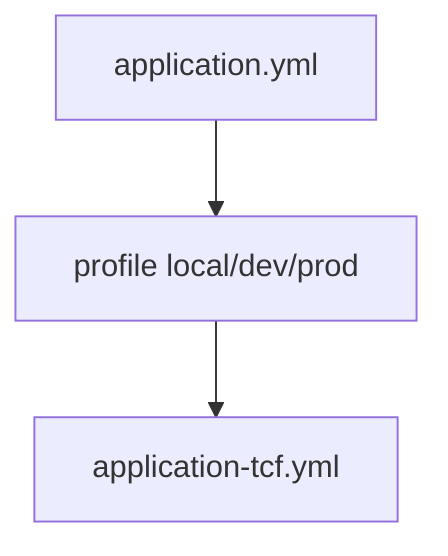

# 부록 G. application.yml 기본

| **부록** | G |
| **상태** | 집필 완료 |
| **원본** | [ztcfbook 부록 G](../ztcfbook/부록/G-application-yml-템플릿.md) |

---

## 그림으로 보기



---

## yml이 하는 일

`application.yml`은 “서버 설정 메모장”입니다. 여기서 정해지는 것:

```text
포트 · Context Path · DB 연결 · MyBatis · TCF(세션/권한/로그) · Timeout
```

**로컬**과 **운영**은 **profile**로 나눕니다.

| profile | 언제 |
| --- | --- |
| `local` | 내 PC bootRun |
| `dev` | 개발/통합 서버 |
| `prod` | 운영 |

---

## 파일 위치 (sv-service 예)

```text
src/main/resources/
├── application.yml          ← 공통 기본
└── application-local.yml    ← local일 때 추가
```

`tcf-cicd/local/spring/sv-service/` 에도 **같은 내용**이 있을 수 있습니다. **어느 쪽이 SoT인지** 팀에 확인하세요.

---

## 초보가 꼭 아는 항목

### 1) 서버

```yaml
server:
  port: 8086
  servlet:
    context-path: /sv    # bootRun 루트면 / 인 경우도 있음
```

| 항목 | 의미 |
| --- | --- |
| `port` | `http://localhost:8086` |
| `context-path` | URL 앞에 붙는 경로 (`/sv/online`) |

### 2) DB (로컬 H2)

```yaml
spring:
  datasource:
    url: jdbc:h2:mem:nsight_sv;MODE=Oracle;...
    username: sa
    password:
```

로컬은 **H2 메모리/파일**. 운영은 Oracle 등 **별도 yml + 환경변수**.

### 3) MyBatis

```yaml
mybatis:
  mapper-locations:
    - classpath:/mapper/**/*.xml
  configuration:
    default-statement-timeout: 3
```

| | |
| --- | --- |
| `mapper-locations` | XML 파일 찾는 경로 |
| `default-statement-timeout` | SQL **3초** (RDW 기본) |

### 4) TCF 플래그 (로컬에서 자주 끔)

```yaml
nsight:
  tcf:
    session-validation-enabled: false
    authorization-validation-enabled: false
    idempotency-enabled: true
    transaction-log-enabled: true
  timeout:
    online-transaction-seconds: 5
    db-query-seconds: 3
```

| 플래그 | 로컬 `false` 이유 |
| --- | --- |
| `session-validation-enabled` | 로그인 없이 curl 테스트 |
| `authorization-validation-enabled` | 권한 OM 없이 Handler만 검증 |
| `transaction-log-enabled` | 거래로그 H2에 쌓기 |

**운영에서는 보통 `true`.** 로컬만 false인지 yml을 꼭 확인하세요.

### 5) 거래로그 DB (local)

```yaml
nsight:
  tcf:
    transaction-log-datasource:
      url: jdbc:h2:file:./data/nsight-txlog/nsight_om;...
```

OM·거래로그용 H2 파일. `./data/nsight-txlog` 폴더가 생깁니다.

---

## profile 켜는 법

| 방법 | 예 |
| --- | --- |
| IDE Run Configuration | `-Dspring.profiles.active=local` |
| 환경변수 | `SPRING_PROFILES_ACTIVE=local` |
| `application.yml` | `spring.profiles.default: local` |

---

## ⚠️ 초보자 실수

| 실수 | |
| --- | --- |
| 운영 DB URL을 local에 commit | **데이터 사고** |
| 비밀번호를 Git에 commit | **보안 사고** — 환경변수 사용 |
| `context-path` 모르고 `/online`만 호출 | **404** — `/sv/online` 확인 |
| session 검증 켠 채 로그인 없이 curl | **E-COM-AUTH** 계열 오류 |

---

## 이전 · 다음

| | |
| --- | --- |
| ← 이전 | [부록 F 오류코드](./F-오류코드-형식.md) |
| → 다음 | [부록 H 개발 체크](./H-개발-끝나기-전-체크.md) |

---

## 📘 원본

- [ztcfbook/부록/G-application-yml-템플릿.md](../ztcfbook/부록/G-application-yml-템플릿.md)
- [sv-service/.../application.yml](../../sv-service/src/main/resources/application.yml)
- [sv-service/.../application-local.yml](../../sv-service/src/main/resources/application-local.yml)
