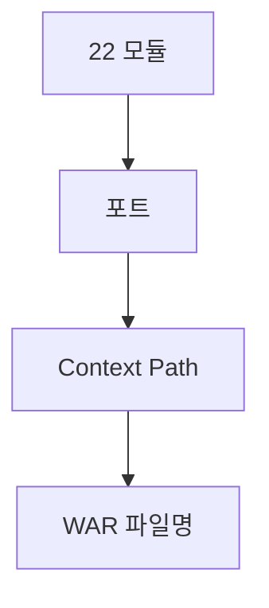

# 부록 K. 포트·모듈 한눈에

| **부록** | K |
| **상태** | 집필 완료 |
| **원본** | [ztcfbook 부록 K](../ztcfbook/부록/K-모듈-포트-Context-WAR-매핑표.md) |

---

## 그림으로 보기



---

## 업무 WAR (9종) — 외울 것: SV 8086

| 모듈 | BC | 포트 | Context | Online URL |
| --- | --- | --- | --- | --- |
| ic-service | IC | 8082 | /ic | `POST /ic/online` |
| pc-service | PC | 8083 | /pc | `POST /pc/online` |
| ms-service | MS | 8085 | /ms | `POST /ms/online` |
| **sv-service** | **SV** | **8086** | **/sv** | **`POST /sv/online`** |
| pd-service | PD | 8087 | /pd | `POST /pd/online` |
| eb-service | EB | 8089 | /eb | `POST /eb/online` |
| ep-service | EP | 8090 | /ep | `POST /ep/online` |
| ss-service | SS | 8093 | /ss | `POST /ss/online` |
| mg-service | MG | 8096 | /mg | `POST /mg/online` |

업무코드만 → [부록 A](./A-업무코드-표.md)

---

## 플랫폼·채널

| 모듈 | 포트 | 역할 (한 줄) |
| --- | --- | --- |
| **tcf-om** | 8097 | OM Admin, Catalog |
| **tcf-batch** | 8098 | 대시보드 수집 |
| **tcf-ui** | 8099 | 브라우저 테스트 UI |
| **tcf-gateway** | 8100 | API 정문 |
| **tcf-uj** | 8102 | Gateway 경유 UI |
| **tcf-jwt** | 8110 | Token 발급 |
| **ztomcat** | 8080 | Tomcat 통합 (WAR 여러 개) |

⚠ **om-service(레거시)** 도 8097 — **tcf-om과 동시 기동 금지**

---

## URL 패턴 3가지

| 환경 | SV 예시 |
| --- | --- |
| **bootRun** | http://127.0.0.1:**8086**/sv/online |
| **ztomcat** | http://127.0.0.1:**8080**/sv/online |
| **Gateway** | http://127.0.0.1:**8100**/gw/SV/online |

tcf-ui 테스트: http://localhost:**8099**/sv/index.html

---

## Gateway LOCAL Route (SV만 예)

| BC | Target |
| --- | --- |
| SV | http://127.0.0.1:8086/sv/online |
| OM | http://127.0.0.1:8097/om/online |
| JWT | http://127.0.0.1:8110/online |

전체 BC → **원본 부록 K §K.4**

---

## 빠른 기동

```bash
gradle :sv-service:bootRun          # 업무
gradle :tcf-om:bootRun             # OM
gradle :tcf-ui:bootRun             # UI 8099
tcf-scripts/run-local.bat sv       # 스크립트
```

채널 전체: om → gateway → uj (13·16·26장)

---

## ⚠️ 초보자 실수

| 실수 | |
| --- | --- |
| 포트 8086인데 /ic/online 호출 | **Context = 업무코드** |
| Gateway 없이 uj만 | **8100 필수** |
| bootRun URL을 ztomcat에 그대로 | **8080 vs 8086** |

---

## 이전 · 다음

| | |
| --- | --- |
| ← 이전 | [부록 J 운영 전환](./J-운영-전환-전-체크.md) |
| → 다음 | [부록 L DB 테이블](./L-DB-테이블-한눈에.md) |

---

## 📘 원본

- [ztcfbook/부록/K-모듈-포트-Context-WAR-매핑표.md](../ztcfbook/부록/K-모듈-포트-Context-WAR-매핑표.md)
